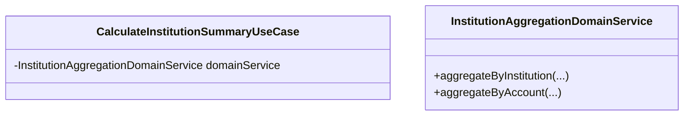
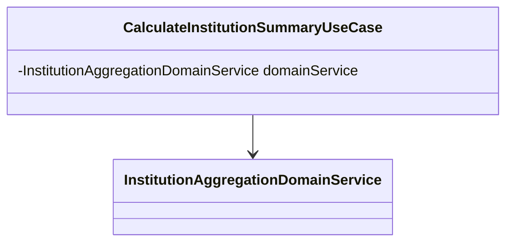
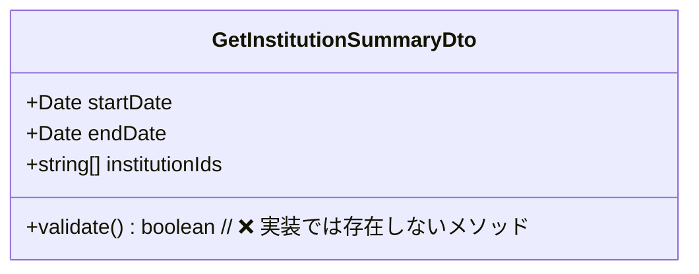
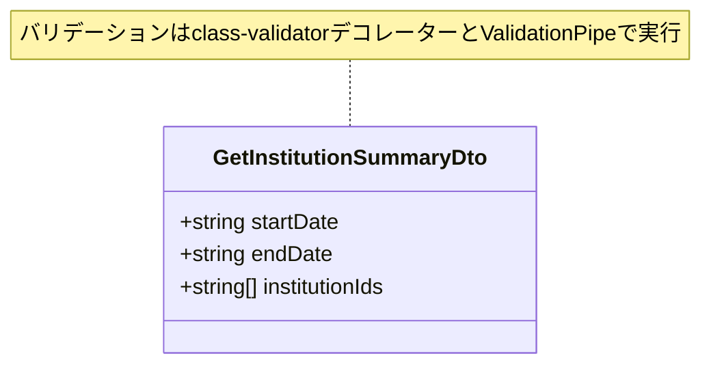
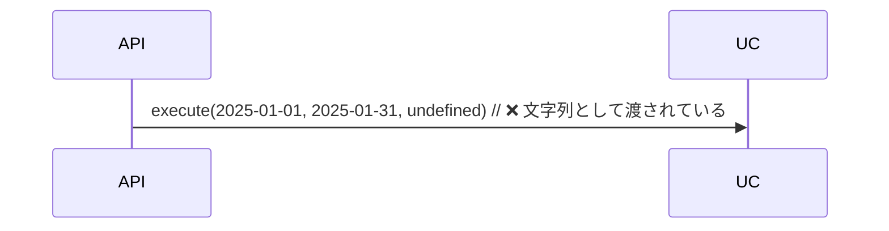
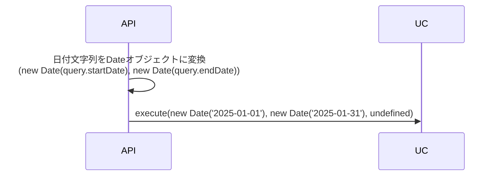
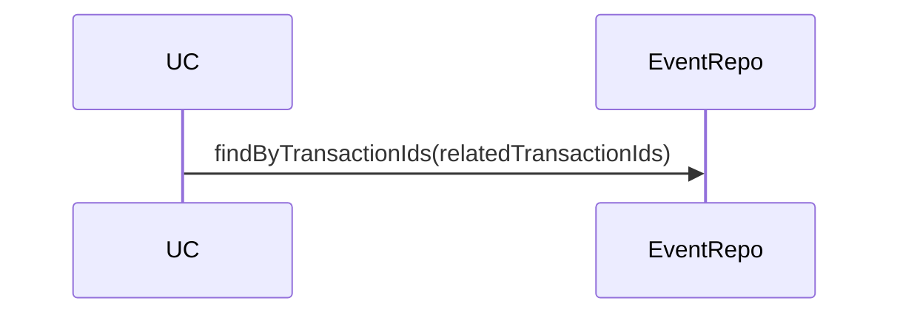
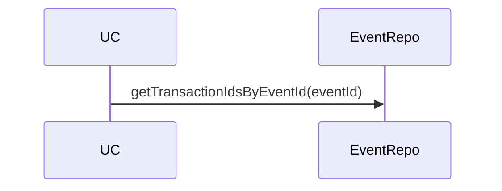

## 13. Geminiレビューから学んだ観点

**優先度レベル**: `04-XX` - **メモ（NOTE）** - 参考情報・学習記録

### 13-1. コードの重複排除と再利用性（PR #349）

**学習元**: PR #349 - Issue #114: 金融機関設定画面の実装（Geminiレビュー指摘）

#### データ取得ロジックの重複排除

**問題**: `useEffect`と`handleRefresh`で同じデータ取得ロジックが重複している

**解決策**: `useCallback`を使用してデータ取得ロジックを1つの関数にまとめる

```typescript
// ❌ 悪い例: ロジックが重複
useEffect(() => {
  const fetchData = async () => {
    // データ取得ロジック
  };
  void fetchData();
}, []);

const handleRefresh = () => {
  void (async () => {
    // 同じデータ取得ロジックが重複
  })();
};

// ✅ 良い例: useCallbackで共通化
const fetchData = useCallback(async () => {
  // データ取得ロジック
}, []);

useEffect(() => {
  void fetchData();
}, [fetchData]);

const handleRefresh = () => {
  void fetchData();
};
```

**理由**:

- コードの重複を排除し、保守性を向上
- ロジックの変更時に1箇所の修正で済む
- テストが容易になる

### 13-2. インライン関数の抽出（PR #349）

**学習元**: PR #349 - Issue #114: 金融機関設定画面の実装（Geminiレビュー指摘）

#### 複雑なインラインアロー関数の抽出

**問題**: JSX内のインラインアロー関数が複雑で、可読性と保守性が低下

**解決策**: 名前付き関数として抽出

```typescript
// ❌ 悪い例: 複雑なインライン関数
<Modal
  onConfirm={() => {
    setIsDeleting(true);
    try {
      // 複雑なロジック
    } catch (error) {
      // エラーハンドリング
    } finally {
      setIsDeleting(false);
    }
  }}
/>

// ✅ 良い例: 名前付き関数として抽出
const handleConfirm = (): void => {
  setIsDeleting(true);
  try {
    // 複雑なロジック
  } catch (error) {
    // エラーハンドリング
  } finally {
    setIsDeleting(false);
  }
};

<Modal onConfirm={handleConfirm} />
```

**理由**:

- 可読性が向上
- 関数の再利用が容易
- テストが容易になる

### 13-3. 未実装UI要素の扱い（PR #349）

**学習元**: PR #349 - Issue #114: 金融機関設定画面の実装（Geminiレビュー指摘）

#### 未実装機能に関するUIテキストの扱い

**問題**: 未実装のUI要素に関する注意書きが表示され、ユーザーを混乱させる

**解決策**: 未実装の場合は、該当するUIテキストを削除またはコメントアウト

```typescript
// ❌ 悪い例: 未実装機能に関する注意書きが表示される
<div className="mt-4 p-3 bg-yellow-50">
  <p>注意: 削除する際は、取引履歴の扱いを選択してください。</p>
  {/* しかし、選択UI要素が存在しない */}
</div>

// ✅ 良い例: 未実装の場合は削除またはTODOコメント
{/* TODO: 取引履歴の扱いを選択するUI要素を実装（別Issueで実装予定） */}
```

**理由**:

- ユーザーの混乱を防ぐ
- 将来の実装を示すためにTODOコメントを残す
- 実装時に明確な指針となる

### 13-4. エラーハンドリングでのログ出力（PR #349）

**学習元**: PR #349 - Issue #114: 金融機関設定画面の実装（Geminiレビュー指摘）

#### catchブロックでのエラーログ出力

**問題**: catchブロックが空で、エラー発生時のデバッグが困難

**解決策**: `console.error`でエラーオブジェクトをログに出力する

```typescript
// ❌ 悪い例: catchブロックが空
catch (error) {
  if (error instanceof Error) {
    // エラーを適切に処理
  }
}

// ✅ 良い例: console.errorでエラーをログ出力
catch (error) {
  if (error instanceof Error) {
    console.error('処理中にエラーが発生しました:', error);
  }
}
```

**理由**:

- デバッグが容易になる
- 予期せぬ問題の原因特定がしやすくなる
- 開発中の問題発見に役立つ

**注意**: 本番環境では、適切なエラーロギングサービス（Sentry等）を使用することを推奨

### 13-5. テストスキップ時のコメント（PR #349）

**学習元**: PR #349 - Issue #114: 金融機関設定画面の実装（Geminiレビュー指摘）

#### テストスキップ時の理由とIssue番号の記録

**問題**: テストをスキップした理由が不明で、再有効化を忘れる可能性がある

**解決策**: スキップ理由とIssue番号をコメントとして残す

```typescript
// ❌ 悪い例: 理由が不明
test.skip('費目を編集できる', async ({ page }) => {
  // ...
});

// ✅ 良い例: 理由とIssue番号をコメントとして残す
// TODO: Issue #XXX - 編集機能の不具合が修正されたら、このテストを有効化する
test.skip('費目を編集できる', async ({ page }) => {
  // ...
});
```

**理由**:

- テスト再有効化のタイミングが明確になる
- コードの保守性が向上
- 将来の実装者への情報提供

### 13-6. モーダルのアクセシビリティ改善（PR #349）

**学習元**: PR #349 - Issue #114: 金融機関設定画面の実装（Geminiレビュー指摘）

#### モーダルコンポーネントのアクセシビリティ属性

**問題**: モーダルコンポーネントに適切なARIA属性が設定されていない

**解決策**: `role="dialog"`、`aria-modal="true"`、`aria-labelledby`を追加

```typescript
// ❌ 悪い例: アクセシビリティ属性が不足
<div className="modal">
  <h3>削除しますか？</h3>
  {/* ... */}
</div>

// ✅ 良い例: 適切なARIA属性を設定
<div role="dialog" aria-modal="true" aria-labelledby="modal-title">
  <h3 id="modal-title">削除しますか？</h3>
  {/* ... */}
</div>
```

**理由**:

- スクリーンリーダーがモーダルを正しく認識できる
- ユーザー体験が向上
- WCAG準拠

**注意**: オーバーレイの`div`に`role="button"`や`tabIndex`を設定するのは不適切。`onClick`と`onKeyDown`だけで十分。

### 13-7. テストでの堅牢なセレクタ使用（PR #349）

**学習元**: PR #349 - Issue #114: 金融機関設定画面の実装（Geminiレビュー指摘）

#### テストでのセレクタ選択

**問題**: `getAllByText`とインデックスを使用したセレクタは脆弱

**解決策**: `getByRole`と`within`を使用してスコープを限定

```typescript
// ❌ 悪い例: インデックスに依存した脆弱なセレクタ
const deleteButtons = screen.getAllByText('削除');
fireEvent.click(deleteButtons[deleteButtons.length - 1]);

// ✅ 良い例: roleとwithinでスコープを限定
const modal = screen.getByRole('dialog');
const deleteButton = within(modal).getByRole('button', { name: '削除' });
fireEvent.click(deleteButton);
```

**理由**:

- UIの変更に強いテストになる
- 意図が明確になる
- 保守性が向上

### 13-8. 型定義の共有パッケージへの移動（PR #349）

**学習元**: PR #349 - Issue #114: 金融機関設定画面の実装（Geminiレビュー指摘）

#### API型定義の配置

**問題**: フロントエンドとバックエンドで型定義が重複している

**解決策**: 共通の型定義を`@account-book/types`パッケージに移動

```typescript
// ❌ 悪い例: フロントエンドにローカル型定義
// apps/frontend/src/lib/api/sync.ts
export interface SyncAllTransactionsRequest {
  forceFullSync?: boolean;
  institutionIds?: string[];
}

// ✅ 良い例: 共有パッケージに型定義
// libs/types/src/sync.types.ts
export interface SyncAllTransactionsRequest {
  forceFullSync?: boolean;
  institutionIds?: string[];
}

// apps/frontend/src/lib/api/sync.ts
import { SyncAllTransactionsRequest } from '@account-book/types';
```

**理由**:

- 型の一貫性が保証される
- 重複が排除される
- 保守性が向上

### 13-9. N+1問題の回避（PR #356）

**学習元**: PR #356 - Issue #351: 金融機関削除機能の実装（Geminiレビュー指摘）

#### 一括削除メソッドの実装

**問題**: ループで一つずつ削除することで、データベースへのアクセス回数が増加し、パフォーマンス問題が発生する可能性がある。

**解決策**: リポジトリに一括削除メソッドを追加し、UseCaseで使用する

```typescript
// ❌ 悪い例: N+1問題が発生
const transactions = await this.transactionRepository.findByInstitutionId(id);
for (const transaction of transactions) {
  await this.transactionRepository.delete(transaction.id);
}

// ✅ 良い例: 一括削除メソッドを使用
await this.transactionRepository.deleteByInstitutionId(id);
```

**実装例**:

```typescript
// Repositoryインターフェース
export interface ITransactionRepository {
  deleteByInstitutionId(institutionId: string): Promise<void>;
}

// TypeORM実装
async deleteByInstitutionId(institutionId: string): Promise<void> {
  await this.repository.delete({ institutionId });
}

// ファイルシステム実装（月ごとにグループ化）
async deleteByInstitutionId(institutionId: string): Promise<void> {
  const transactions = await this.findByInstitutionId(institutionId);
  // 月ごとにグループ化して削除
  // ...
}
```

**理由**:

- データベースへのアクセス回数が大幅に削減される
- パフォーマンスが向上する
- スケーラビリティが向上する

### 13-10. エラーハンドリングでのユーザーフィードバック（PR #356）

**学習元**: PR #356 - Issue #351: 金融機関削除機能の実装（Geminiレビュー指摘）

#### エラー時のトースト通知実装

**問題**: エラー発生時に`console.error`でログ出力するのみで、ユーザーへのフィードバックがない。

**解決策**: エラー時にトースト通知を表示する

```typescript
// ❌ 悪い例: ログ出力のみ
catch (error) {
  if (error instanceof Error) {
    console.error('削除処理中にエラーが発生しました:', error);
  }
}

// ✅ 良い例: トースト通知を表示
catch (error) {
  const errorMessage = getErrorMessage(
    error,
    '金融機関の削除に失敗しました',
  );
  showErrorToast('error', errorMessage);
  console.error('削除処理中にエラーが発生しました:', error);
}
```

**理由**:

- ユーザーがエラーを認識できるようになる
- ユーザー体験が向上する
- デバッグ情報はログに残しつつ、ユーザーにも通知する

### 13-11. データベース操作の原子性確保（PR #356）

**学習元**: PR #356 - Issue #351: 金融機関削除機能の実装（Geminiレビュー指摘）

#### トランザクションの導入

**問題**: 複数のデータベース操作が関連する場合、処理の途中でエラーが発生するとデータが不整合な状態になる可能性がある。

**解決策**: 関連する操作をトランザクション内で実行する

```typescript
// ❌ 悪い例: トランザクションなし
await this.transactionRepository.deleteByInstitutionId(id);
await this.institutionRepository.delete(id);
// 2つ目の操作が失敗すると、取引履歴のみが削除された状態になる

// ✅ 良い例: トランザクションを使用
await this.dataSource.transaction(async (entityManager) => {
  const transactionRepo = entityManager.getRepository(TransactionOrmEntity);
  await transactionRepo.delete({ institutionId: id });

  const institutionRepo = entityManager.getRepository(InstitutionOrmEntity);
  await institutionRepo.delete(id);
});
```

**実装例**:

```typescript
@Injectable()
export class DeleteInstitutionUseCase {
  constructor(
    @InjectDataSource()
    private readonly dataSource: DataSource
    // ...
  ) {}

  async execute(id: string, dto: DeleteInstitutionDto = {}): Promise<void> {
    // トランザクション外で検証（パフォーマンス向上）
    const existingInstitution = await this.institutionRepository.findById(id);
    if (!existingInstitution) {
      throw new NotFoundException(`金融機関 (ID: ${id}) が見つかりません`);
    }

    // トランザクション内で削除操作を実行
    await this.dataSource.transaction(async (entityManager) => {
      if (dto.deleteTransactions === true) {
        const transactionRepo = entityManager.getRepository(TransactionOrmEntity);
        await transactionRepo.delete({ institutionId: id });
      }

      const institutionRepo = entityManager.getRepository(InstitutionOrmEntity);
      await institutionRepo.delete(id);
    });
  }
}
```

**理由**:

- データ整合性が保証される
- 不整合な状態が発生しない
- エラー発生時にすべての変更がロールバックされる

**重要なポイント**:

1. **複数のデータベース操作が関連する場合は必ずトランザクションを使用**
2. **トランザクション外で可能な検証は先に実行**（パフォーマンス向上）
3. **トランザクション内では`entityManager.getRepository()`を使用**
4. **すべての操作が成功するか、すべて失敗するかのどちらか**（原子性）

### 13-12. ファイルシステム版リポジトリのパフォーマンス最適化（PR #356）

**学習元**: PR #356 - Issue #351: 金融機関削除機能の実装（Geminiレビュー指摘）

#### 全データ読み込みの回避

**問題**: 全取引をメモリに読み込んでから処理することで、大規模データセットでパフォーマンスが低下する。

**解決策**: 月ごとのファイルを直接処理し、必要なデータのみを読み込む

```typescript
// ❌ 悪い例: 全データを読み込んでから処理
async deleteByInstitutionId(institutionId: string): Promise<void> {
  const transactions = await this.findByInstitutionId(institutionId); // 全データ読み込み
  // 月ごとにグループ化
  // 各月のファイルを再度読み込んで削除
}

// ✅ 良い例: 月ごとのファイルを直接処理
async deleteByInstitutionId(institutionId: string): Promise<void> {
  const files = await fs.readdir(this.dataDir);
  const jsonFiles = files.filter((file) => file.endsWith('.json'));

  for (const fileName of jsonFiles) {
    const [yearStr, monthStr] = fileName.replace('.json', '').split('-');
    const year = parseInt(yearStr, 10);
    const month = parseInt(monthStr, 10);

    if (isNaN(year) || isNaN(month)) continue;

    const existingTransactions = await this.findByMonth(year, month);
    const filteredTransactions = existingTransactions.filter(
      (t) => t.institutionId !== institutionId,
    );

    if (filteredTransactions.length < existingTransactions.length) {
      await this.saveMonthData(year, month, filteredTransactions);
    }
  }
}
```

**理由**:

- メモリ使用量が削減される
- 大規模データセットでのパフォーマンスが向上する
- 必要なデータのみを処理するため効率的

### 13-13. URL構築ロジックの簡潔化（PR #356）

**学習元**: PR #356 - Issue #351: 金融機関削除機能の実装（Geminiレビュー指摘）

#### クエリ文字列の構築

**問題**: URLのクエリ文字列を構築するロジックが冗長で、可読性が低い。

**解決策**: `params.set`を使用し、`params.toString()`を一度だけ呼び出す

```typescript
// ❌ 悪い例: 冗長なロジック
const params = new URLSearchParams();
if (options?.deleteTransactions === true) {
  params.append('deleteTransactions', 'true');
}
const endpoint = `/institutions/${id}${params.toString() ? `?${params.toString()}` : ''}`;

// ✅ 良い例: 簡潔で読みやすい
const params = new URLSearchParams();
if (options?.deleteTransactions) {
  params.set('deleteTransactions', 'true');
}
const queryString = params.toString();
const endpoint = `/institutions/${id}${queryString ? `?${queryString}` : ''}`;
```

**理由**:

- コードの可読性が向上する
- `params.toString()`を一度だけ呼び出すため効率的
- `params.set`は`params.append`よりも意図が明確

### 13-14. UseCaseレイヤーでの抽象化の維持（PR #356）

**学習元**: PR #356 - Issue #351: 金融機関削除機能の実装（Geminiレビュー指摘）

#### リポジトリインターフェースの拡張

**問題**: トランザクションブロック内で`entityManager.getRepository()`とORMエンティティを直接使用しており、リポジトリ層の抽象化がバイパスされている。これにより、UseCaseが特定のORM実装（TypeORM）に密結合してしまい、テストや将来のデータソース変更が困難になる。

**解決策**: リポジトリのメソッドがオプショナルで`EntityManager`を受け取れるようにインターフェースを変更

```typescript
// ❌ 悪い例: ORMエンティティを直接使用
await this.dataSource.transaction(async (entityManager) => {
  const transactionRepo = entityManager.getRepository(TransactionOrmEntity);
  await transactionRepo.delete({ institutionId: id });

  const institutionRepo = entityManager.getRepository(InstitutionOrmEntity);
  await institutionRepo.delete(id);
});

// ✅ 良い例: リポジトリメソッドを使用
await this.dataSource.transaction(async (entityManager) => {
  await this.transactionRepository.deleteByInstitutionId(id, entityManager);
  await this.institutionRepository.delete(id, entityManager);
});
```

**実装例**:

```typescript
// リポジトリインターフェース（ドメイン層）
export interface ITransactionRepository {
  deleteByInstitutionId(
    institutionId: string,
    manager?: unknown, // ドメイン層にTypeORMの依存を避けるためunknownを使用
  ): Promise<void>;
}

// リポジトリ実装（インフラ層）
async deleteByInstitutionId(
  institutionId: string,
  manager?: unknown,
): Promise<void> {
  const repository = manager
    ? (manager as EntityManager).getRepository(TransactionOrmEntity)
    : this.repository;
  await repository.delete({ institutionId });
}
```

**理由**:

- リポジトリの抽象化が維持され、テストが容易になる
- 将来のデータソース変更が容易になる
- 関心の分離が適切に保たれる
- UseCaseが永続化の詳細から切り離される

**重要なポイント**:

1. **ドメイン層にTypeORMの依存を入れない**: インターフェースでは`unknown`型を使用
2. **インフラ層で型アサーション**: 実装層で`EntityManager`として型アサーション
3. **ファイルシステム版リポジトリ**: `manager`パラメータは無視（互換性のため）

### 13-15. クエリパラメータの型変換（PR #356）

**学習元**: PR #356 - Issue #351: 金融機関削除機能の実装（Geminiレビュー指摘）

#### @Transformデコレーターの使用

**問題**: クエリパラメータは文字列として送信されるため、`deleteTransactions=true`のようなリクエストでは、`"true"`という文字列が渡される。`IsBoolean`バリデーターがこれをブール値ではないと判断し、バリデーションエラーを引き起こす。

**解決策**: `class-transformer`の`@Transform`デコレーターを使用して文字列をブール値に変換

```typescript
// ❌ 悪い例: 型変換なし
export class DeleteInstitutionDto {
  @IsBoolean()
  @IsOptional()
  deleteTransactions?: boolean; // "true"文字列が渡されるとバリデーションエラー
}

// ✅ 良い例: @Transformで型変換
export class DeleteInstitutionDto {
  @Transform(({ value }): boolean | string => {
    if (value === 'true') {
      return true;
    }
    if (value === 'false') {
      return false;
    }
    return value as string;
  })
  @IsBoolean({ message: '取引履歴の削除フラグは真偽値で指定してください' })
  @IsOptional()
  deleteTransactions?: boolean;
}
```

**理由**:

- クエリパラメータが正しくブール値に変換される
- バリデーションエラーが発生しなくなる
- ユーザー体験が向上する

### 13-16. Exception Filter設計のベストプラクティス（PR #369）

**学習元**: PR #369 - Issue #366: Exception Filterの導入によるエラーハンドリングの一元化（Geminiレビュー指摘）

#### 13-16-1. 文字列マッチングによる例外変換の回避 🔴 High

**問題**: エラーメッセージの文字列に基づく例外変換は堅牢性に欠ける

```typescript
// ❌ 悪い例: 文字列マッチングによる例外変換
if (exception instanceof Error) {
  if (exception.message.includes('validation')) {
    return new BadRequestException({ ... });
  }
}
```

**問題点**:

- 500系エラーのメッセージが「validation of external service response failed」の場合、誤って400 `BadRequestException`として処理される可能性
- エラーメッセージの変更で挙動が変わる
- 予期せぬ挙動を引き起こす可能性

**解決策**: ドメイン固有のカスタム例外クラスをスローするようにリファクタリング

```typescript
// ✅ 良い例: カスタム例外クラスを使用
if (exception instanceof ValidationError) {
  return new BadRequestException({ ... });
}
```

**推奨事項**:

- 文字列マッチングロジックには警告コメントを追加
- 将来的にはドメイン固有のカスタム例外クラスをスローするようにリファクタリング
- 文字列マッチングロジックを削除することを目標とする

#### 13-16-2. 例外処理のコード重複排除 🟡 Medium

**問題**: 同じHTTP例外に変換される複数の例外クラスで、オブジェクト生成ロジックが重複している

```typescript
// ❌ 悪い例: コードが重複
if (exception instanceof DuplicateAlertException) {
  return new UnprocessableEntityException({ ... });
}
if (exception instanceof AlertAlreadyResolvedException) {
  return new UnprocessableEntityException({ ... });
}
if (exception instanceof CriticalAlertDeletionException) {
  return new UnprocessableEntityException({ ... });
}
```

**解決策**: 同じHTTP例外に変換される例外を1つの`if`ブロックにまとめる

```typescript
// ✅ 良い例: 1つのifブロックにまとめる
if (
  exception instanceof DuplicateAlertException ||
  exception instanceof AlertAlreadyResolvedException ||
  exception instanceof CriticalAlertDeletionException
) {
  return new UnprocessableEntityException({
    success: false,
    statusCode: HttpStatus.UNPROCESSABLE_ENTITY,
    message: exception.message,
    code: exception.code, // 例外クラスのプロパティから取得
    errors: [],
    timestamp: new Date().toISOString(),
    path: request.url,
  });
}
```

**理由**:

- コードの重複を排除し、保守性を向上
- 一貫性の観点からも、同様のケースをグループ化
- 可読性が向上

#### 13-16-3. エラーコードの管理をドメイン層に集約 🟡 Medium

**問題**: 例外クラスに`code`プロパティを持たず、フィルター側でエラーコードをハードコードしている

```typescript
// ❌ 悪い例: フィルター側でエラーコードをハードコード
if (exception instanceof AlertNotFoundException) {
  return new NotFoundException({
    code: 'AL001', // ハードコード
    ...
  });
}
```

**解決策**: 例外クラスに`code`プロパティを追加し、フィルター側ではそのプロパティを参照する

```typescript
// ✅ 良い例: 例外クラスにcodeプロパティを追加
export class AlertNotFoundException extends Error {
  public readonly code = 'AL001';
  constructor(public readonly alertId: string) {
    super(`Alert not found: ${alertId}`);
    this.name = 'AlertNotFoundException';
  }
}

// フィルター側では例外のプロパティからコードを取得
if (exception instanceof AlertNotFoundException) {
  return new NotFoundException({
    code: exception.code, // 例外のプロパティから取得
    ...
  });
}
```

**理由**:

- エラーコードの管理がドメイン層に閉じる
- モジュール間の一貫性を高める
- 保守性を向上させる（エラーコードの変更時に1箇所の修正で済む）

**重要なポイント**:

1. **エラーコードは例外クラスで定義**: ドメイン層でエラーコードを管理
2. **フィルター側では参照のみ**: エラーコードをハードコードしない
3. **モジュール間の一貫性**: すべての例外クラスで同じパターンを採用

### 13-17. Exception Filterの簡潔化と責務の明確化（PR #369）

**学習元**: PR #369 - Issue #366: Exception Filterの導入によるエラーハンドリングの一元化（Geminiレビュー指摘 #2）

#### convertToHttpExceptionメソッドの冗長なプロパティ削除

**問題**: `convertToHttpException`メソッド内で、各HTTP例外を生成する際に渡しているオブジェクトに冗長なプロパティが含まれている

```typescript
// ❌ 悪い例: 冗長なプロパティを含む
if (exception instanceof AlertNotFoundException) {
  return new NotFoundException({
    success: false,
    statusCode: HttpStatus.NOT_FOUND,
    message: exception.message,
    code: exception.code,
    errors: [],
    timestamp: new Date().toISOString(),
    path: request.url,
  });
}
```

**問題点**:

- `handleHttpException`メソッドでは、ここで生成された例外オブジェクトから主に`message`と`code`プロパティしか利用していない
- `success`, `statusCode`, `timestamp`, `path`などのプロパティは`handleHttpException`側で設定されるため、`convertToHttpException`内での定義は不要
- コードが冗長で、責務が不明確

**解決策**: HTTP例外のコンストラクタに渡すオブジェクトを簡潔にする

```typescript
// ✅ 良い例: 必要なプロパティのみを含める
if (exception instanceof AlertNotFoundException) {
  return new NotFoundException({
    message: exception.message,
    code: exception.code,
  });
}
```

**理由**:

- コードがシンプルになり、可読性が向上
- 責務が明確になる（`convertToHttpException`は例外の変換のみ、`handleHttpException`はレスポンスの整形）
- メンテナンスが容易になる

**重要なポイント**:

1. **責務の分離**: 例外変換とレスポンス整形を明確に分離
2. **最小限の情報**: 変換時に必要な情報のみを渡す
3. **一貫性**: すべての例外変換で同じパターンを採用

### 13-18. ドメイン固有カスタム例外クラスの導入（PR #369）

**学習元**: PR #369 - Issue #366: Exception Filterの導入によるエラーハンドリングの一元化（Geminiレビュー指摘 #3）

#### 文字列マッチングロジックの完全な排除

**問題**: エラーメッセージの文字列マッチングによる例外変換は堅牢性に欠ける

```typescript
// ❌ 悪い例: 文字列マッチングによる例外変換
if (exception instanceof Error) {
  if (exception.message.includes('not found')) {
    return new NotFoundException({ ... });
  }
}
```

**問題点**:

- エラーメッセージの変更で挙動が変わる
- 予期せぬ挙動を引き起こす可能性（例: 500系エラーのメッセージが「validation of external service response failed」の場合、誤って400 `BadRequestException`として処理される）

**解決策**: アプリケーション全体でドメイン固有のカスタム例外クラスをスローするようにリファクタリング

```typescript
// ✅ 良い例: カスタム例外クラスを使用
export class EventNotFoundException extends Error {
  public readonly code = 'EV001';
  constructor(public readonly eventId: string) {
    super(`Event not found: ${eventId}`);
    this.name = 'EventNotFoundException';
  }
}

// UseCase層で使用
if (!event) {
  throw new EventNotFoundException(id);
}

// Filter層で処理
if (exception instanceof EventNotFoundException) {
  return new NotFoundException({
    message: exception.message,
    code: exception.code,
  });
}
```

**理由**:

- 型安全な例外処理が可能になる
- 文字列マッチングロジックを完全に排除できる
- エラーコードの管理がドメイン層に集約される
- モジュール間の一貫性が向上

**実装手順**:

1. **ドメイン層に例外クラスを定義**: `domain/errors/`ディレクトリに例外クラスを作成
2. **UseCase層でカスタム例外をスロー**: `NotFoundException`や`Error`の代わりにカスタム例外を使用
3. **Filter層で例外を処理**: `instanceof`による型安全な分岐で処理
4. **テストを更新**: テストの期待値をカスタム例外のメッセージに合わせる

**重要なポイント**:

1. **型安全性**: `instanceof`による型安全な例外処理
2. **ドメイン層での管理**: エラーコードとメッセージをドメイン層で管理
3. **段階的な移行**: 既存の文字列マッチングロジックは残しつつ、新規モジュールからカスタム例外を導入

## 14. Geminiレビューから学んだ観点（旧セクション14以降）

### 14-1. 型安全性の維持 🔴 Critical

**学習元**: PR #259 - パフォーマンステストとチューニング

#### ❌ 避けるべきパターン: モジュール全体でのルール緩和

```javascript
// eslint.config.mjs
{
  files: ['src/modules/health/**/*.ts'],
  rules: {
    '@typescript-eslint/no-explicit-any': 'warn',  // モジュール全体で緩和
    '@typescript-eslint/no-unsafe-assignment': 'warn',
  },
}
```

**問題点**:

- 意図しない`any`型の使用を見逃すリスク
- モジュール全体の型安全性が低下
- 将来的なリファクタリングが困難

#### ✅ 正しいパターン: 必要な箇所でのみインライン無効化

```typescript
async checkConnection(apiAdapter: unknown): Promise<boolean> {
  // eslint-disable-next-line @typescript-eslint/no-explicit-any
  const adapter = apiAdapter as any;
  return await adapter.testConnection();
}
```

**推奨アプローチ**:

1. `unknown`型と型ガードを優先的に使用
2. 本当に必要な箇所のみ`// eslint-disable-next-line`で個別対応
3. `any`の代わりに`unknown`型を検討
4. インターフェースを明確に定義

---

### 13-2. テストセレクターの一貫性 🟡 Medium

#### ❌ 避けるべきパターン: クラス名との併用

```typescript
await page.waitForSelector('[data-testid="list"], .list-container');
```

**問題点**:

- スタイリング変更でテストが壊れる
- セレクターの一貫性がない

#### ✅ 正しいパターン: data-testid優先

```typescript
await page.waitForSelector('[data-testid="list"]');
```

**利点**:

- テストの堅牢性向上
- スタイリング変更の影響を受けない
- 意図が明確

---

### 13-3. ページネーションテストの前提条件 🔴 Critical

#### ❌ 避けるべきパターン: 実装されていない機能のテスト

```typescript
describe('Pagination Performance', () => {
  it('should fetch page 1', async () => {
    await request(app).get('/api/institutions').query({ page: 1, limit: 20 });
  });
});
```

**問題点**:

- APIがページネーションを実装していない
- テストが常に失敗または誤った結果を返す

#### ✅ 正しいパターン: 未実装機能は.skip

```typescript
describe.skip('Pagination Performance (Future Implementation)', () => {
  // Note: InstitutionControllerにページネーション実装後に有効化
  it('should fetch page 1', async () => {
    await request(app).get('/api/institutions').query({ page: 1, limit: 20 });
  });
});
```

**推奨**:

1. 実装されていない機能のテストは`.skip`
2. コメントで実装予定を明記
3. 実装完了後にテストを有効化

---

### 13-4. コード重複の回避とDRY原則 🔴 Critical

**学習元**: PR #266 - カスタムプロンプト（@トリガー）の追加

#### ❌ 避けるべきパターン: ルールファイルリストの重複

```markdown
<!-- start-task.md -->

await Promise.all([
read_file('.cursor/rules/00-WORKFLOW-CHECKLIST.md'),
read_file('.cursor/rules/GIT-WORKFLOW-ENFORCEMENT.md'),
// ... 全10ファイル
]);

<!-- inc-all-rules.md -->

await Promise.all([
read_file('.cursor/rules/00-WORKFLOW-CHECKLIST.md'),
read_file('.cursor/rules/GIT-WORKFLOW-ENFORCEMENT.md'),
// ... 全10ファイル（完全に同じリスト）
]);
```

**問題点**:

- ルールファイル追加時に2箇所を修正する必要
- メンテナンス性の低下
- 変更漏れのリスク

#### ✅ 正しいパターン: 一元管理と再利用

```markdown
<!-- start-task.md -->

### 0. すべてのルールファイルを再読込（最優先）

**必ず最初に** `@inc-all-rules` を実行して、すべてのルールファイルを読み込んでください。
```

**利点**:

- ルールファイルリストを一箇所で管理
- 変更時の修正箇所が1つだけ
- DRY原則の遵守

---

### 13-5. ドキュメントの可読性と一貫性 🟡 Medium

#### ❌ 避けるべきパターン: 情報が分散したファイルリスト

```markdown
### 読込対象ファイル

以下のファイルを順番に読み込んでください：

1. ファイルA
2. ファイルB

### テンプレート

- テンプレート1
- テンプレート2

### 追加リソース

- リソース1
```

**問題点**:

- ファイルリストが複数セクションに分散
- 「順番に」の記述が並列読み込みの実装と矛盾
- 可読性が低い

#### ✅ 正しいパターン: 統合されたファイルリスト

```markdown
### 読込対象ファイル

以下のファイルをすべて読み込んでください：

- **ファイルA** - 説明
- **ファイルB** - 説明
- **テンプレート1** - 説明
- **テンプレート2** - 説明
- **リソース1** - 説明
```

**利点**:

- すべての対象ファイルが一目で把握できる
- 並列読み込みの実装と記述が一致
- 可読性の向上

---

### 13-6. 命名規則の一貫性 🟡 Medium

#### △ 不十分なパターン: 曖昧な命名規則

```bash
git checkout -b feature/issue-<番号>-<説明>
```

**問題点**:

- `<説明>`が曖昧
- 開発者によって異なるフォーマットになる
- 自動化スクリプトとの不一致

#### ✅ 正しいパターン: 明確な命名規則

```bash
git checkout -b feature/issue-<番号>-<Issueタイトルをケバブケースにした文字列>

# 例:
# Issue #267: "CI最適化: マークダウン変更時のスキップ"
# → feature/issue-267-ci-optimization-skip-markdown-changes
```

**利点**:

- 一貫したブランチ名
- 自動化スクリプトとの整合性
- 誰が作成しても同じ形式

---

### 13-7. ReactコンポーネントのJSX共通化とDRY原則 🟡 Medium

**学習元**: PR #327 - FR-010: 費目の手動修正機能（Geminiレビュー指摘）

#### ❌ 避けるべきパターン: 共通レイアウトの重複

```typescript
// ❌ 悪い例: 同じレイアウトコードが3回繰り返される
export default function TransactionsPage(): React.JSX.Element {
  // ...

  if (loading) {
    return (
      <div className="container mx-auto p-6">
        <h1 className="text-2xl font-bold mb-4">取引一覧</h1>
        <div className="flex justify-center items-center py-12">
          {/* ローディング表示 */}
        </div>
      </div>
    );
  }

  if (error) {
    return (
      <div className="container mx-auto p-6">
        <h1 className="text-2xl font-bold mb-4">取引一覧</h1>
        {/* エラー表示 */}
      </div>
    );
  }

  return (
    <div className="container mx-auto p-6">
      <h1 className="text-2xl font-bold mb-4">取引一覧</h1>
      {/* 正常表示 */}
    </div>
  );
}
```

**問題点**:

- 同じレイアウトコード（`<div className="container...">`と`<h1>`）が重複
- レイアウト変更時に3箇所を修正する必要
- メンテナンス性の低下

#### ✅ 正しいパターン: 共通レイアウトコンポーネントの抽出

```typescript
// ✅ 良い例: 共通レイアウトをコンポーネント化
export default function TransactionsPage(): React.JSX.Element {
  // ...

  // 共通レイアウトコンポーネント
  const PageLayout = ({ children }: { children: React.ReactNode }): React.JSX.Element => (
    <div className="container mx-auto p-6">
      <h1 className="text-2xl font-bold mb-4">取引一覧</h1>
      {children}
    </div>
  );

  if (loading) {
    return (
      <PageLayout>
        <div className="flex justify-center items-center py-12">
          {/* ローディング表示 */}
        </div>
      </PageLayout>
    );
  }

  if (error) {
    return (
      <PageLayout>
        {/* エラー表示 */}
      </PageLayout>
    );
  }

  return (
    <PageLayout>
      {/* 正常表示 */}
    </PageLayout>
  );
}
```

**利点**:

- レイアウト変更が1箇所で完結
- DRY原則の遵守
- メンテナンス性の向上

**推奨アプローチ**:

1. 複数の状態（loading/error/success）で同じレイアウトを使用する場合は共通化
2. コンポーネント内で`PageLayout`のようなヘルパーコンポーネントを定義
3. 複数ページで使用する場合は、共通コンポーネントとして抽出

---

### 13-8. データフェッチングライブラリの導入検討 🟢 Low（将来改善）

**学習元**: PR #327 - FR-010: 費目の手動修正機能（Geminiレビュー指摘）

#### 現状のパターン: 手動でのデータフェッチング

```typescript
// 現状: useState + useEffect で手動実装
export default function TransactionsPage(): React.JSX.Element {
  const [transactions, setTransactions] = useState<Transaction[]>([]);
  const [loading, setLoading] = useState<boolean>(true);
  const [error, setError] = useState<string | null>(null);

  const loadTransactions = useCallback(async (): Promise<void> => {
    try {
      setLoading(true);
      setError(null);
      const data = await getTransactions();
      setTransactions(data);
    } catch (err) {
      setError('取引データの取得に失敗しました。再読み込みしてください。');
    } finally {
      setLoading(false);
    }
  }, []);

  useEffect(() => {
    void loadTransactions();
  }, [loadTransactions]);
}
```

**現状の問題点**:

- ローディング・エラー状態の管理が冗長
- キャッシュ機能がない
- 再フェッチ、リトライなどの機能を手動実装する必要

#### 将来の改善案: データフェッチングライブラリの導入

**検討対象**:

- **SWR** (Stale-While-Revalidate)
  - 軽量でNext.jsとの統合が容易
  - 自動キャッシュ、再検証、エラーハンドリング
- **React Query (TanStack Query)**
  - より高機能（キャッシュ、同期、オプティミスティック更新）
  - 複雑なデータフェッチング要件に対応

**導入時の利点**:

```typescript
// 将来の改善例: SWRを使用
import useSWR from 'swr';

export default function TransactionsPage(): React.JSX.Element {
  const { data: transactions, error, isLoading, mutate } = useSWR(
    '/api/transactions',
    getTransactions
  );

  if (isLoading) return <PageLayout><Loading /></PageLayout>;
  if (error) return <PageLayout><Error error={error} /></PageLayout>;

  return (
    <PageLayout>
      <TransactionList transactions={transactions} />
    </PageLayout>
  );
}
```

**利点**:

- コードの簡潔化
- 自動キャッシュと再検証
- エラーハンドリングの統一
- リトライ、ポーリングなどの高度な機能

**導入判断基準**:

- ✅ **導入を検討**: 複数のページでデータフェッチングが必要な場合
- ✅ **導入を検討**: リアルタイム更新が必要な場合
- ⚠️ **現状維持**: 単一ページのみで、シンプルな要件の場合

**注意点**:

- プロジェクト全体の方針として検討が必要
- 既存コードへの影響範囲を評価
- チーム全体での合意が必要

---

### 13-9. バリデーション実装とクラス図設計のベストプラクティス 🟡 Medium

**学習元**: PR #345 - FR-017: 金融機関別集計機能の詳細設計書（Geminiレビュー指摘）

#### ❌ 避けるべきパターン1: フィールド間相関チェックでの`@ValidateIf`の誤用

```typescript
// ❌ 誤った実装例
import { IsDateString, IsNotEmpty, ValidateIf } from 'class-validator';

export class GetInstitutionSummaryDto {
  @IsDateString()
  @IsNotEmpty()
  startDate: string;

  @IsDateString()
  @IsNotEmpty()
  @ValidateIf((o) => {
    if (o.startDate && o.endDate) {
      return new Date(o.startDate) <= new Date(o.endDate);
    }
    return true;
  })
  endDate: string;
}
```

**問題点**:

- `@ValidateIf`は他のバリデーターを条件付きで実行するためのデコレーターであり、それ自体がバリデーションロジックを持つものではない
- フィールド間の相関チェックには適さない
- 期待通りに動作しない

#### ✅ 正しいパターン: カスタムバリデーターを使用

```typescript
// ✅ 正しい実装例
import {
  ValidatorConstraint,
  ValidatorConstraintInterface,
  ValidationArguments,
  Validate,
} from 'class-validator';

@ValidatorConstraint({ name: 'isEndDateAfterStartDate', async: false })
export class IsEndDateAfterStartDateConstraint implements ValidatorConstraintInterface {
  validate(endDate: string, args: ValidationArguments): boolean {
    const object = args.object as GetInstitutionSummaryDto;
    const startDate = object.startDate;
    if (!startDate || !endDate) {
      return true; // 必須チェックは @IsNotEmpty で行う
    }
    return new Date(startDate) <= new Date(endDate);
  }

  defaultMessage(args: ValidationArguments): string {
    return 'endDate must be after or equal to startDate';
  }
}

export class GetInstitutionSummaryDto {
  @IsDateString()
  @IsNotEmpty()
  startDate: string;

  @IsDateString()
  @IsNotEmpty()
  @Validate(IsEndDateAfterStartDateConstraint)
  endDate: string;
}
```

**利点**:

- フィールド間の相関チェックが正しく動作する
- エラーメッセージをカスタマイズできる
- 再利用可能

#### ❌ 避けるべきパターン2: 命名規則の曖昧さ

```typescript
// ❌ 曖昧な命名
interface InstitutionSummary {
  totalBalance: number; // 期間内の収支差額？現在の残高？
  balance: number; // 期間内の収支差額？現在の残高？
  currentBalance: number; // 現在の残高
}
```

**問題点**:

- `totalBalance`と`balance`が期間内の収支差額を指しているのか、現在の残高を指しているのか不明確
- `currentBalance`と混同しやすい
- 実装時の混乱を招く

#### ✅ 正しいパターン: 明確な命名規則

```typescript
// ✅ 明確な命名
interface InstitutionSummary {
  periodBalance: number; // 期間内の収支差額（期間内の純増減額）
  currentBalance: number; // 現在の残高（口座の実際の残高）
}
```

**利点**:

- 期間内の収支と現在の残高を明確に区別できる
- 実装時の混乱を防ぐ
- 可読性の向上

**命名規則の推奨**:

- `periodBalance`: 指定期間内の収支差額（期間内の純増減額）
- `currentBalance`: 現在時点での残高（口座の実際の残高）
- `netBalance`: 期間内の純増減額（`periodBalance`の別名として使用可）

#### ❌ 避けるべきパターン3: チェックボックスの誤用

```markdown
- [x] 認証・認可の実装（将来対応）
- [x] キャッシング戦略（将来対応：集計結果のキャッシュ）
```

**問題点**:

- `[x]`は「実装済み」を意味するため、「将来対応」と矛盾する
- 実装状態が不明確になる

#### ✅ 正しいパターン: 未実装項目は`[ ]`を使用

```markdown
- [ ] 認証・認可の実装（将来対応）
- [ ] キャッシング戦略（将来対応：集計結果のキャッシュ）
```

**利点**:

- 実装状態が一目で明確
- 「将来対応」の意図が明確

#### ❌ 避けるべきパターン4: クラス図の重複定義



**問題点**:

- `InstitutionAggregationDomainService`はDomain層で定義されているため、Application層の図で再定義する必要がない
- 将来的な変更時に不整合を生む原因となる

#### ✅ 正しいパターン: 依存関係の線のみで示す



**利点**:

- クラス定義の重複を避けられる
- 変更時の不整合を防げる
- 図が簡潔になる

#### ❌ 避けるべきパターン5: 設計書内の仕様不統一

```markdown
<!-- sequence-diagrams.md -->

データが存在しない場合: すべて0の集計データを返す

<!-- input-output-design.md -->

データが存在しない場合: 空配列を返す
```

**問題点**:

- 設計書内で仕様が矛盾している
- 実装時の混乱を招く

#### ✅ 正しいパターン: 仕様を明確化して統一

```markdown
**データが存在しない場合のレスポンス:**

以下の2つのケースがあります：

1. **リクエストされた金融機関が存在するが、期間内に取引がない場合**:
   - 金融機関の情報を0埋めのデータとして返す
   - フロントエンドは「処理されたがデータがなかった」と判断できる

2. **リクエストされた金融機関が存在しない場合**:
   - 空配列を返す
```

**利点**:

- 仕様が明確になる
- 実装時の混乱を防ぐ
- すべての設計書で一貫性を保てる

**推奨アプローチ**:

1. 設計書作成時は、すべてのドキュメントで仕様を統一する
2. レビュー時は、仕様の一貫性を確認する
3. 仕様が複雑な場合は、ケースごとに明確に記載する

#### ❌ 避けるべきパターン6: 設計書内の型定義の不整合

```typescript
// ❌ 悪い例: 同じDTOが2箇所で定義されているが内容が異なる
// 「TypeScript型定義」セクション
export class GetInstitutionSummaryDto {
  @IsDateString()
  @IsNotEmpty()
  endDate: string; // カスタムバリデーターが付与されていない
}

// 「バリデーション実装例」セクション
export class GetInstitutionSummaryDto {
  @IsDateString()
  @IsNotEmpty()
  @Validate(IsEndDateAfterStartDateConstraint) // カスタムバリデーターが付与されている
  endDate: string;
}
```

**問題点**:

- 同じDTOが複数箇所で定義されているが内容が異なる
- 実装時の混乱を招く
- どちらが正しいか判断できない

#### ✅ 正しいパターン: 型定義を一箇所に集約

```typescript
// ✅ 正しい例: カスタムバリデーターの定義も含めて完全な型定義を記載
// カスタムバリデーター（フィールド間の相関チェック用）
@ValidatorConstraint({ name: 'isEndDateAfterStartDate', async: false })
export class IsEndDateAfterStartDateConstraint implements ValidatorConstraintInterface {
  // ... 実装
}

// Request DTO（class）
export class GetInstitutionSummaryDto {
  @IsDateString()
  @IsNotEmpty()
  startDate: string;

  @IsDateString()
  @IsNotEmpty()
  @Validate(IsEndDateAfterStartDateConstraint) // カスタムバリデーターを付与
  endDate: string;
}
```

**利点**:

- 型定義が一箇所に集約され、一貫性が保たれる
- 実装時の混乱を防げる
- レビュー時に確認しやすい

#### ❌ 避けるべきパターン7: クラス図と実装の不整合



**問題点**:

- クラス図に実装されていないメソッドが記載されている
- NestJSの標準的な実装方法（デコレーターによるバリデーション）と異なる
- 実装と乖離を生む

#### ✅ 正しいパターン: 実装に合わせたクラス図



**利点**:

- 実装と一致する
- NestJSの標準的な実装方法を反映
- 誤解を防げる

#### ❌ 避けるべきパターン8: シーケンス図の型の不正確さ



**問題点**:

- 実際の実装では`Date`オブジェクトが渡されるが、図では文字列として表現されている
- 実装時の混乱を招く

#### ✅ 正しいパターン: 正確な型を表現



**利点**:

- 実際の実装を正確に表現
- 型変換の処理も明示できる
- 実装時の混乱を防げる

**推奨アプローチ**:

1. 設計書内の型定義は一箇所に集約し、完全な定義を記載する
2. クラス図は実装に合わせ、存在しないメソッドを記載しない
3. シーケンス図では正確な型を表現し、型変換処理も明示する
4. レビュー時は、設計書内の整合性を確認する

---

## 14. コードの簡潔性と効率性 🟡 Medium

**学習元**: PR #339 - 支払いステータスAPIのN+1問題を解消（Geminiレビュー指摘）

#### ❌ 避けるべきパターン1: 不要なawait

```typescript
// ❌ 悪い例: async関数から直接Promiseを返す場合、awaitは不要
async execute(
  cardSummaryIds: string[],
): Promise<Map<string, PaymentStatusRecord>> {
  if (cardSummaryIds.length === 0) {
    return new Map<string, PaymentStatusRecord>();
  }

  return await this.paymentStatusRepository.findByCardSummaryIds(
    cardSummaryIds,
  );
}
```

**問題点**:

- `async`関数から直接Promiseを返す場合、`await`は不要
- コードが冗長になる
- パフォーマンスへの影響は微々たるものだが、コードの可読性が低下

#### ✅ 正しいパターン1: awaitを削除

```typescript
// ✅ 良い例: awaitを削除して簡潔に
async execute(
  cardSummaryIds: string[],
): Promise<Map<string, PaymentStatusRecord>> {
  if (cardSummaryIds.length === 0) {
    return new Map<string, PaymentStatusRecord>();
  }

  return this.paymentStatusRepository.findByCardSummaryIds(cardSummaryIds);
}
```

**利点**:

- コードが簡潔で可読性が向上
- 意図が明確（Promiseを直接返す）

---

#### ❌ 避けるべきパターン2: 不要な中間変数とループ

```typescript
// ❌ 悪い例: 不要なresultマップと最後のループ
async findByCardSummaryIds(
  cardSummaryIds: string[],
): Promise<Map<string, PaymentStatusRecord>> {
  const records = await this.loadFromFile();
  const result = new Map<string, PaymentStatusRecord>();
  const targetIds = new Set(cardSummaryIds);

  const latestByCardSummary = new Map<string, PaymentStatusRecord>();
  for (const record of records) {
    if (!targetIds.has(record.cardSummaryId)) {
      continue;
    }

    const existing = latestByCardSummary.get(record.cardSummaryId);
    if (
      !existing ||
      record.updatedAt.getTime() > existing.updatedAt.getTime()
    ) {
      latestByCardSummary.set(record.cardSummaryId, record);
    }
  }

  // 不要なループ: latestByCardSummaryをresultにコピー
  for (const [cardSummaryId, record] of latestByCardSummary) {
    result.set(cardSummaryId, record);
  }

  return result;
}
```

**問題点**:

- 空配列の場合の早期リターンがない
- 不要な`result`マップと最後のループが存在
- コードが冗長で効率が悪い

#### ✅ 正しいパターン2: 早期リターンと直接返却

```typescript
// ✅ 良い例: 早期リターンを追加し、不要なループを削除
async findByCardSummaryIds(
  cardSummaryIds: string[],
): Promise<Map<string, PaymentStatusRecord>> {
  if (cardSummaryIds.length === 0) {
    return new Map();
  }

  const records = await this.loadFromFile();
  const targetIds = new Set(cardSummaryIds);

  const latestByCardSummary = new Map<string, PaymentStatusRecord>();
  for (const record of records) {
    if (!targetIds.has(record.cardSummaryId)) {
      continue;
    }

    const existing = latestByCardSummary.get(record.cardSummaryId);
    if (
      !existing ||
      record.updatedAt.getTime() > existing.updatedAt.getTime()
    ) {
      latestByCardSummary.set(record.cardSummaryId, record);
    }
  }

  return latestByCardSummary; // 直接返却
}
```

**利点**:

- 空配列の場合の早期リターンで効率化
- 不要な中間変数とループを削除
- コードが簡潔で保守しやすい

---

#### ❌ 避けるべきパターン3: 命令的なfor...ofループ

```typescript
// ❌ 悪い例: 命令的なfor...ofループ
const statusRecords = await paymentStatusApi.getStatuses(summaryIds);

const recordsMap = new Map<string, PaymentStatusRecord>();
for (const record of statusRecords) {
  recordsMap.set(record.cardSummaryId, record);
}

setStatusRecords(recordsMap);
```

**問題点**:

- 命令的な記述で可読性が低い
- 関数型プログラミングのパターンに沿っていない

#### ✅ 正しいパターン3: 宣言的なreduce

```typescript
// ✅ 良い例: 宣言的なreduceを使用
const statusRecords = await paymentStatusApi.getStatuses(summaryIds);

const recordsMap = statusRecords.reduce((map, record) => {
  map.set(record.cardSummaryId, record);
  return map;
}, new Map<string, PaymentStatusRecord>());

setStatusRecords(recordsMap);
```

**利点**:

- 宣言的な記述で可読性が向上
- 関数型プログラミングのパターンに沿っている
- 意図が明確（配列からMapへの変換）

**推奨アプローチ**:

1. **async関数から直接Promiseを返す場合**: `await`を削除
2. **空配列や空値の場合**: 早期リターンを追加
3. **不要な中間変数やループ**: 削除して直接返却
4. **配列からMapへの変換**: `reduce`を使用して宣言的に記述

---

#### ❌ 避けるべきパターン4: 順序が不定な配列返却

```typescript
// ❌ 悪い例: Mapから配列に変換する際、順序が不定
const recordsMap = await this.getPaymentStatusesUseCase.execute(cardSummaryIds);

const records = Array.from(recordsMap.values()).map((record) => toPaymentStatusResponseDto(record));

return {
  success: true,
  data: records,
};
```

**問題点**:

- `Array.from(recordsMap.values())`はMapへの挿入順序に依存するため、順序が不定になる可能性がある
- APIの応答が一貫しない
- クライアント側での処理が不安定になる可能性

#### ✅ 正しいパターン4: ソートで順序を保証

```typescript
// ✅ 良い例: cardSummaryIdでソートして順序を保証
const recordsMap = await this.getPaymentStatusesUseCase.execute(cardSummaryIds);

const records = Array.from(recordsMap.values())
  .map(toPaymentStatusResponseDto)
  .sort((a, b) => a.cardSummaryId.localeCompare(b.cardSummaryId));

return {
  success: true,
  data: records,
};
```

**利点**:

- APIの応答が一貫する
- クライアント側での処理が安定
- テストが書きやすい（順序が予測可能）

**推奨アプローチ**:

1. **async関数から直接Promiseを返す場合**: `await`を削除
2. **空配列や空値の場合**: 早期リターンを追加
3. **不要な中間変数やループ**: 削除して直接返却
4. **配列からMapへの変換**: `reduce`を使用して宣言的に記述
5. **Mapから配列への変換**: 順序を保証するためにソートを追加

**参考**: PR #339 - Geminiレビュー指摘

---

## 15. Issue #279から学んだ教訓

**学習元**: Issue #279 - FR-006: 未実装機能の実装、PR #285

### 14-1. エラーメッセージの文字列依存は脆弱 🔴 Critical

#### ❌ 脆弱な実装

```typescript
if (error instanceof Error && error.message === 'Transaction fetch was cancelled') {
  // キャンセル処理
}
```

**教訓**:

- エラーメッセージが変更されるとロジックが壊れる
- 文字列の完全一致が必要で、メンテナンスコストが高い

#### ✅ 堅牢な実装: カスタムエラークラス

```typescript
export class CancellationError extends Error {
  constructor(message: string = 'Operation was cancelled') {
    super(message);
    this.name = 'CancellationError';
    Error.captureStackTrace?.(this, CancellationError);
  }
}

// 判定（型安全）
if (error instanceof CancellationError) {
  // キャンセル処理
}
```

**適用箇所**:

- キャンセルエラー: `CancellationError`
- バリデーションエラー: `ValidationError`
- ネットワークエラー: `NetworkError`

---

### 14-2. 不要な依存関係は削除する 🟡 Medium

#### ❌ 使用していない依存関係

```typescript
constructor(
  @Inject(SYNC_HISTORY_REPOSITORY)
  private readonly syncHistoryRepository: ISyncHistoryRepository,
  @Inject(CREDIT_CARD_REPOSITORY)
  private readonly creditCardRepository: ICreditCardRepository, // 使用していない
  private readonly fetchCreditCardTransactionsUseCase: FetchCreditCardTransactionsUseCase,
) {}
```

**教訓**:

- 子UseCaseに機能を委譲した場合、親からは不要な依存関係を削除
- テストが複雑になる（不要なモックを作成する必要）
- コードの意図が不明確になる

#### ✅ 必要な依存関係のみ

```typescript
constructor(
  @Inject(SYNC_HISTORY_REPOSITORY)
  private readonly syncHistoryRepository: ISyncHistoryRepository,
  private readonly fetchCreditCardTransactionsUseCase: FetchCreditCardTransactionsUseCase,
) {}
```

**チェックリスト**:

1. `this.xxxRepository` で検索して使用状況を確認
2. 子UseCaseに機能が委譲されていないか確認
3. テストを簡素化できるか確認

---

### 14-3. Enum値と使用箇所の型を統一する 🟡 Medium

#### ❌ 型の不一致

```typescript
enum InstitutionType {
  CREDIT_CARD = 'credit_card', // アンダースコア
}
type SyncTarget = 'credit-card'; // ハイフン

// 変換関数が必要
function convertInstitutionType(type: InstitutionType): 'credit-card' {
  if (type === InstitutionType.CREDIT_CARD) {
    return 'credit-card';
  }
  throw new Error(`Unsupported institution type: ${type}`);
}
```

**教訓**:

- 型の不一致は変換関数を必要とし、コードが複雑になる
- バグの原因になる
- 保守性が低い

#### ✅ 統一された型

```typescript
enum InstitutionType {
  CREDIT_CARD = 'credit-card', // ハイフンで統一
}
type SyncTarget = InstitutionType; // 直接使用可能

// 変換関数は不要
const target: SyncTarget = institution.type;
```

---

### 14-4. 特定のエラーによるステータス上書き防止 🔴 Critical

#### ❌ キャンセルエラーもFAILEDに上書きされる

```typescript
try {
  await fetchData();
} catch (error) {
  // すべてのエラーがFAILEDになる
  syncHistory = syncHistory.markAsFailed(error.message);
}
```

**教訓**:

- キャンセルエラーをFAILEDステータスで上書きすると、ステータスの整合性が失われる
- ユーザーの意図的なキャンセル操作が「失敗」として記録される

#### ✅ キャンセルエラーを判定して早期return

```typescript
try {
  await fetchData();
} catch (error) {
  if (error instanceof CancellationError) {
    // キャンセル処理（早期return）
    syncHistory = syncHistory.markAsCancelled();
    return { status: 'CANCELLED' };
  }
  // その他のエラーはFAILED
  syncHistory = syncHistory.markAsFailed(error.message);
}
```

---

### 14-5. テストの動作確認を行わずに品質保証はできない ⚠️ Critical

**学び**:

> 「テストの動作確認を行わずに、品質担保ができているというのは、テストというものの概念を正しく理解できていないようにも思います。」
>
> — ユーザーフィードバック

**教訓**:

- テストコードを書いただけでは不十分
- **必ずローカルで実行してパスすることを確認**
- テストがパスして初めて品質保証ができる

**実践**:

```bash
# テスト実行（必須）
pnpm --filter @account-book/backend test sync-all-transactions.use-case.spec

# 結果確認（必須）
# ✅ Test Suites: 1 passed, 1 total
# ✅ Tests: 11 passed, 11 total
```

**Push前チェックリスト**:

1. ✅ Lintチェック: `./scripts/test/lint.sh`
2. ✅ ビルドチェック: `pnpm build`
3. ✅ **テスト実行**: `./scripts/test/test.sh all`（必須！）
4. ✅ E2Eテスト: `./scripts/test/test-e2e.sh frontend`

---

### 14-6. テストの冗長性を排除する 🎯 Medium

#### ❌ useCase.executeが2回呼び出される（非効率）

```typescript
await expect(useCase.execute({ creditCardId })).rejects.toThrow(NotFoundException);
await expect(useCase.execute({ creditCardId })).rejects.toThrow(
  `Credit card not found with ID: ${creditCardId}`
);
```

**教訓**:

- 同じ処理を2回実行するのは非効率
- 副作用のある処理の場合、予期しない動作を引き起こす可能性

#### ✅ 一度の呼び出しで型とメッセージの両方を検証

```typescript
await expect(useCase.execute({ creditCardId })).rejects.toThrow(
  new NotFoundException(`Credit card not found with ID: ${creditCardId}`)
);
```

---

### 14-7. Factory関数でテストデータ作成を簡潔に 🧪 Medium

#### ✅ Factory関数の活用

```typescript
export function createTestCreditCard(overrides?: Partial<CreditCardEntity>) {
  return new CreditCardEntity(
    overrides?.id || 'cc_test_123',
    overrides?.cardName || 'テストカード'
    // ...デフォルト値
  );
}

// テストで使用
const creditCard = createTestCreditCard({ isConnected: true });
```

**教訓**:

- テストデータの作成が簡潔になる
- デフォルト値を一箇所で管理できる
- テストの可読性が向上

**適用例**:

- `test/helpers/credit-card.factory.ts`
- `test/helpers/securities.factory.ts`
- `test/helpers/institution.factory.ts`

---

### 14-8. テストケースの統合による可読性と保守性の向上 🎯 Medium

**学習元**: PR #358 - Gemini Code Assistレビュー指摘

#### ❌ 関連する複数のテストケースを分離（非効率）

```typescript
it('デフォルトで「取引履歴は保持」が選択されている', () => {
  render(<DeleteConfirmModal {...props} />);
  const keepOption = screen.getByLabelText('取引履歴は保持');
  const deleteOption = screen.getByLabelText('取引履歴も削除');
  expect(keepOption).toBeChecked();
  expect(deleteOption).not.toBeChecked();
});

it('「取引履歴も削除」を選択できる', () => {
  render(<DeleteConfirmModal {...props} />);
  const deleteOption = screen.getByLabelText('取引履歴も削除');
  fireEvent.click(deleteOption);
  expect(deleteOption).toBeChecked();
  const keepOption = screen.getByLabelText('取引履歴は保持');
  expect(keepOption).not.toBeChecked();
});

it('「取引履歴は保持」を選択できる', () => {
  render(<DeleteConfirmModal {...props} />);
  const deleteOption = screen.getByLabelText('取引履歴も削除');
  const keepOption = screen.getByLabelText('取引履歴は保持');
  fireEvent.click(deleteOption);
  expect(deleteOption).toBeChecked();
  fireEvent.click(keepOption);
  expect(keepOption).toBeChecked();
  expect(deleteOption).not.toBeChecked();
});
```

**問題点**:

- コンポーネントのレンダリングが3回発生（非効率）
- 関連するテストが分散し、一連のユーザー操作として理解しにくい
- テストの保守性が低下（同じsetupが重複）

#### ✅ 一連の操作を1つのテストケースに統合

```typescript
it('ラジオボタンの選択が正しく切り替わる', () => {
  render(<DeleteConfirmModal {...props} />);

  const keepOption = screen.getByLabelText('取引履歴は保持');
  const deleteOption = screen.getByLabelText('取引履歴も削除');

  // デフォルトで「取引履歴は保持」が選択されていることを確認
  expect(keepOption).toBeChecked();
  expect(deleteOption).not.toBeChecked();

  // 「取引履歴も削除」を選択
  fireEvent.click(deleteOption);
  expect(deleteOption).toBeChecked();
  expect(keepOption).not.toBeChecked();

  // 「取引履歴は保持」を選択
  fireEvent.click(keepOption);
  expect(keepOption).toBeChecked();
  expect(deleteOption).not.toBeChecked();
});
```

**教訓**:

- **関連する複数のテストケースは1つにまとめる**: 一連のユーザー操作としてテストの流れが明確になる
- **コンポーネントのレンダリングを最小化**: パフォーマンス向上とテスト実行時間の短縮
- **テストの可読性と保守性が向上**: 同じsetupが1回で済み、変更時の修正箇所が減る

**適用基準**:

- 同じコンポーネントをレンダリングする複数のテストケース
- 一連のユーザー操作として理解できる関連するテスト
- デフォルト状態の確認と状態変更のテストが同じコンポーネントで行われる場合

**注意点**:

- テストが長くなりすぎる場合は、適切な粒度で分割する
- 各テストケースが独立して実行できることを確認する（前のテストの副作用がないこと）

---

## 16. Gemini Code Assist レビューから学んだ観点（PR #320）

### 15-1. データ不整合の早期発見：警告ログの重要性 🟡 Medium

#### ❌ データ不整合が検知されない

```typescript
// 店舗IDがあるが、店舗が見つからない場合
const merchantId = classification.getMerchantId();
if (merchantId) {
  const merchant = await this.merchantRepository.findById(merchantId);
  if (merchant) {
    merchantName = merchant.name;
  }
  // 店舗が見つからなくても何も記録されない
}
```

**問題点**:

- 分類器が返した`merchantId`に対応する店舗が存在しない場合、データ不整合が発生
- この不整合が検知されず、デバッグが困難になる
- 本番環境で気づかないままデータが蓄積される可能性

#### ✅ Logger注入で警告を出力

```typescript
@Injectable()
export class ClassifySubcategoryUseCase {
  private readonly logger = new Logger(ClassifySubcategoryUseCase.name);

  constructor(
    private readonly classifierService: SubcategoryClassifierService,
    @Inject(SUB_CATEGORY_REPOSITORY)
    private readonly subcategoryRepository: ISubcategoryRepository,
    @Inject(MERCHANT_REPOSITORY)
    private readonly merchantRepository: IMerchantRepository
  ) {}

  async execute(dto: ClassifySubcategoryDto): Promise<ClassifySubcategoryResult> {
    // ...

    const merchantId = classification.getMerchantId();
    if (merchantId) {
      const merchant = await this.merchantRepository.findById(merchantId);
      if (merchant) {
        merchantName = merchant.name;
      } else {
        // データ不整合を警告ログで記録
        this.logger.warn(
          `Merchant with ID ${merchantId} not found, but was returned by classifier.`
        );
      }
    }

    // ...
  }
}
```

**効果**:

- データ不整合の早期発見が可能
- ログから問題のある分類パターンを特定できる
- 分類器のトレーニングデータ改善に活用できる

**チェックリスト**:

1. 外部データソース（分類器、API等）が返すIDを信頼せず、必ず存在確認
2. 期待されるデータが存在しない場合は警告ログを出力
3. Logger注入を忘れずに

---

### 15-2. スプレッド構文でコードを簡潔に 🟢 Low

#### ❌ 冗長なプロパティ列挙

```typescript
return {
  subcategoryId: subcategory.id,
  subcategoryName: subcategory.name,
  categoryType: subcategory.categoryType,
  parentId: subcategory.parentId,
  displayOrder: subcategory.displayOrder,
  icon: subcategory.icon,
  color: subcategory.color,
  isDefault: subcategory.isDefault,
  isActive: subcategory.isActive,
  confidence: classification.getConfidence().getValue(),
  reason: classification.getReason(),
  merchantId: merchantId || null,
  merchantName,
};
```

**問題点**:

- プロパティを個別に代入していて冗長
- 新しいプロパティ追加時に漏れが発生しやすい
- 保守性が低い

#### ✅ スプレッド構文と分割代入を活用

```typescript
// createdAt/updatedAtを除外し、id/nameをリネーム
const { id, name, createdAt: _createdAt, updatedAt: _updatedAt, ...rest } = subcategory;

return {
  subcategoryId: id,
  subcategoryName: name,
  ...rest, // 残りのプロパティを一括展開
  confidence: classification.getConfidence().getValue(),
  reason: classification.getReason(),
  merchantId: merchantId || null,
  merchantName,
};
```

**効果**:

- コードが簡潔で可読性が向上
- 新しいプロパティが自動的に含まれる
- メンテナンス性が向上

**チェックリスト**:

1. 不要なプロパティ（`createdAt`, `updatedAt`等）を分割代入で除外
2. リネームが必要なプロパティ（`id` → `subcategoryId`）は明示的に指定
3. 残りは`...rest`で一括展開
4. 未使用変数には`_`プレフィックスを付ける（ESLintエラー回避）

---

### 13-4. APIエンドポイントの効率性とコードの簡潔化（PR #355）

**学習元**: PR #355 - Issue #350: 金融機関編集機能の実装（Geminiレビュー指摘）

#### APIエンドポイントの効率性

**問題**: フロントエンドで全データを取得してから検索するのは非効率

```typescript
// ❌ 悪い例: 全データ取得後に検索
export async function getInstitution(id: string): Promise<Institution> {
  const institutions = await getInstitutions(); // 全データ取得
  const institution = institutions.find((inst) => inst.id === id); // 検索
  if (!institution) {
    throw new Error(`金融機関 (ID: ${id}) が見つかりません`);
  }
  return institution;
}
```

**解決策**: バックエンドに直接取得エンドポイントを追加

```typescript
// ✅ 良い例: バックエンドの直接取得エンドポイントを使用
export async function getInstitution(id: string): Promise<Institution> {
  return await apiClient.get<Institution>(`/institutions/${id}`);
}
```

**理由**:

- ネットワークトラフィックの削減（必要なデータのみ取得）
- パフォーマンスの向上（全データ取得不要）
- バックエンドでの効率的な検索が可能

#### エンティティ更新ロジックの簡潔化

**問題**: 冗長な変数代入と条件分岐

```typescript
// ❌ 悪い例: 冗長な変数代入
const name = dto.name ?? existingInstitution.name;
const type = dto.type ?? existingInstitution.type;
let credentials = existingInstitution.credentials;

if (dto.credentials !== undefined) {
  const credentialsJson = JSON.stringify(dto.credentials);
  const encryptedCredentials = this.cryptoService.encrypt(credentialsJson);
  credentials = encryptedCredentials;
}

const updatedInstitution = new InstitutionEntity(
  existingInstitution.id,
  name,
  type,
  credentials
  // ...
);
```

**解決策**: 三項演算子とNull合体演算子を活用

```typescript
// ✅ 良い例: 簡潔な記述
const credentials =
  dto.credentials !== undefined
    ? this.cryptoService.encrypt(JSON.stringify(dto.credentials))
    : existingInstitution.credentials;

const updatedInstitution = new InstitutionEntity(
  existingInstitution.id,
  dto.name ?? existingInstitution.name,
  dto.type ?? existingInstitution.type,
  credentials
  // ...
);
```

**理由**:

- コードが簡潔で可読性が向上
- 中間変数が不要になり、メンテナンス性が向上
- 意図が明確になる

#### 冗長な状態更新の削除

**問題**: 既に初期化されている値の再設定

```typescript
// ❌ 悪い例: 冗長な状態更新
const [currentStep, setCurrentStep] = useState<'select' | 'input'>('select');

useEffect(() => {
  // ...
  if (data.type === InstitutionType.BANK) {
    setCurrentStep('select'); // 既に'select'で初期化されている
  }
}, [data]);
```

**解決策**: 冗長な更新を削除

```typescript
// ✅ 良い例: 冗長な更新を削除
const [currentStep, setCurrentStep] = useState<'select' | 'input'>('select');

useEffect(() => {
  // ...
  // currentStepは既に'select'で初期化されているため、設定不要
}, [data]);
```

**理由**:

- 不要な再レンダリングを防止
- コードが簡潔になる
- 意図が明確になる

#### 状態管理の複雑さへの対応（オプション）

**問題**: 複数の`useState`による状態管理が複雑

```typescript
// ⚠️ 複雑な状態管理の例
const [institution, setInstitution] = useState<Institution | null>(null);
const [loading, setLoading] = useState<boolean>(true);
const [error, setError] = useState<string | null>(null);
const [currentStep, setCurrentStep] = useState<'select' | 'input'>('select');
// ... さらに多くの状態
```

**解決策**: `useReducer`の検討（状態が複雑な場合）

```typescript
// ✅ 良い例: useReducerで状態を統合
type State = {
  institution: Institution | null;
  loading: boolean;
  error: string | null;
  currentStep: 'select' | 'input';
};

type Action =
  | { type: 'SET_INSTITUTION'; payload: Institution }
  | { type: 'SET_LOADING'; payload: boolean }
  | { type: 'SET_ERROR'; payload: string | null }
  | { type: 'SET_STEP'; payload: 'select' | 'input' };

const reducer = (state: State, action: Action): State => {
  switch (action.type) {
    case 'SET_INSTITUTION':
      return { ...state, institution: action.payload };
    // ...
  }
};

const [state, dispatch] = useReducer(reducer, initialState);
```

**判断基準**:

- 状態が3つ以上で、関連性が高い場合は`useReducer`を検討
- 状態が独立している場合は`useState`で十分
- 状態更新ロジックが複雑な場合は`useReducer`が適切

**参考**: PR #355 - Issue #350: 金融機関編集機能の実装

---

### 15-3. Geminiレビュー対応フロー

---

## 17. GitHub API操作とRate Limit処理（PR #40）

### 17-1. Rate Limitリトライロジックの実装 🔴 Critical

**問題**: Rate Limit対策の定数が定義されているが、実際には使用されていない。

**解決策**:
- Rate Limitエラー時に自動リトライするデコレータを実装
- リセット時刻を確認し、適切な待機時間を計算
- 指数バックオフを実装してAPI負荷を軽減

**実装例**:
```python
def _retry_on_rate_limit(func: Callable) -> Callable:
    """Rate Limitエラー時にリトライするデコレータ"""
    def wrapper(*args, **kwargs):
        retry_count = 0
        while retry_count <= MAX_RATE_LIMIT_RETRIES:
            try:
                return func(*args, **kwargs)
            except RateLimitError as e:
                if retry_count >= MAX_RATE_LIMIT_RETRIES:
                    raise
                # リセット時刻を確認
                if e.reset_time:
                    wait_time = max(e.reset_time - int(time.time()), 0) + 1
                else:
                    wait_time = API_RATE_LIMIT_WAIT * (RATE_LIMIT_BACKOFF_MULTIPLIER ** retry_count)
                time.sleep(wait_time)
                retry_count += 1
    return wrapper
```

**参照**: PR #40 - Issue #4: Git操作ユーティリティの実装（Gemini Code Assistレビュー指摘）

---

### 17-2. HTTPヘッダーからRate Limit情報を取得 🔴 Critical

**問題**: `RateLimitError`が発生した際に、リセット時刻などの詳細情報が例外に設定されていない。

**解決策**:
- `gh api`コマンドに`--include`フラグを追加してHTTPヘッダーを取得
- `x-ratelimit-remaining`, `x-ratelimit-reset`, `x-ratelimit-limit`をパース
- これらの情報を`RateLimitError`に渡す

**実装例**:
```python
def _run_gh_command_with_headers(...) -> tuple[subprocess.CompletedProcess, dict[str, str]]:
    """HTTPヘッダーも取得するGitHub CLIコマンド実行関数"""
    command = ["gh"] + command + ["--include"]
    result = subprocess.run(...)
    
    # HTTPヘッダーをパース
    headers = {}
    if result.stdout:
        parts = result.stdout.split("\r\n\r\n", 1)
        if len(parts) == 2:
            header_lines = parts[0].split("\n")
            for line in header_lines:
                if ":" in line:
                    key, value = line.split(":", 1)
                    headers[key.strip().lower()] = value.strip()
    
    # Rate Limit情報を抽出
    rate_limit_reset = int(headers.get("x-ratelimit-reset", 0)) if "x-ratelimit-reset" in headers else None
    rate_limit_remaining = int(headers.get("x-ratelimit-remaining", 0)) if "x-ratelimit-remaining" in headers else None
    rate_limit_limit = int(headers.get("x-ratelimit-limit", 0)) if "x-ratelimit-limit" in headers else None
    
    if rate_limit_remaining == 0:
        raise RateLimitError(
            "GitHub API rate limit exceeded",
            reset_time=rate_limit_reset,
            remaining=rate_limit_remaining,
            limit=rate_limit_limit,
        )
```

**参照**: PR #40 - Issue #4: Git操作ユーティリティの実装（Gemini Code Assistレビュー指摘）

---

### 17-3. GraphQLクエリのページネーション実装 🔴 Critical

**問題**: GraphQLクエリで`items(first: 200)`とハードコードされており、ページネーションが実装されていない。

**解決策**:
- `pageInfo` (`hasNextPage`, `endCursor`) を使用して、すべてのアイテムをループで取得
- ページサイズを適切に設定（例: 100）
- すべてのアイテムを取得するまでループを継続

**実装例**:
```python
def get_project_item_id(project_id: str, issue_node_id: str, token: Optional[str] = None) -> Optional[str]:
    """Project Item IDを取得する（ページネーション対応）"""
    cursor = None
    page_size = 100
    
    while True:
        query = """
        query($projectId: ID!, $first: Int!, $after: String) {
          node(id: $projectId) {
            ... on ProjectV2 {
              items(first: $first, after: $after) {
                pageInfo {
                  hasNextPage
                  endCursor
                }
                nodes {
                  id
                  content {
                    ... on Issue {
                      id
                    }
                  }
                }
              }
            }
          }
        }
        """
        variables = {"projectId": project_id, "first": page_size}
        if cursor:
            variables["after"] = cursor
        
        data = _run_graphql_query(query, variables, token)
        items_data = data.get("node", {}).get("items", {})
        items = items_data.get("nodes", [])
        page_info = items_data.get("pageInfo", {})
        
        # 現在のページで検索
        for item in items:
            if item.get("content", {}).get("id") == issue_node_id:
                return item.get("id")
        
        # 次のページがあるか確認
        if not page_info.get("hasNextPage", False):
            break
        
        cursor = page_info.get("endCursor")
    
    return None
```

**適用箇所**:
- `get_project_item_id()` - Project Item ID取得
- `get_project_items()` - プロジェクトアイテム取得
- `create_issue()` - ラベル取得部分

**参照**: PR #40 - Issue #4: Git操作ユーティリティの実装（Gemini Code Assistレビュー指摘）

---

### 17-4. 共通関数の一元化 🔴 Critical

**問題**: `_run_gh_command`関数が`github.py`と`pr.py`で重複している。また、同様の`_run_git_command`関数も`commit.py`と`repository.py`で重複している。

**解決策**:
- 共通のヘルパー関数を`_common.py`のような共通モジュールに一元化
- コードの重複をなくすことで、保守性を大幅に向上

**実装例**:
```python
# scripts/utils/git/_common.py
def _run_gh_command(
    command: list[str], check: bool = True, token: Optional[str] = None
) -> subprocess.CompletedProcess:
    """GitHub CLIコマンドを実行する共通関数"""
    # 実装...
```

**使用例**:
```python
# scripts/utils/git/pr.py
from scripts.utils.git._common import _run_gh_command

# scripts/utils/git/github.py
from scripts.utils.git._common import _run_gh_command, _run_gh_command_with_headers
```

**参照**: PR #40 - Issue #4: Git操作ユーティリティの実装（Gemini Code Assistレビュー指摘）

---

### 17-5. 例外ハンドリングの改善 🟡 Medium

**問題**: `except Exception as e:`は非常に広範な例外キャッチであり、予期しないエラーを隠蔽してしまう可能性がある。

**解決策**:
- より具体的な例外をキャッチするように修正
- `GitError`など、適切な例外クラスを指定

**実装例**:
```python
# ❌ 悪い例
try:
    add_issue_to_project(project_id, issue_id, token=token)
except Exception as e:
    logger.warning(f"Failed to add issue to project: {e}")

# ✅ 良い例
try:
    add_issue_to_project(project_id, issue_id, token=token)
except (GitError, RateLimitError) as e:
    logger.warning(f"Failed to add issue to project: {e}")
```

**参照**: PR #40 - Issue #4: Git操作ユーティリティの実装（Gemini Code Assistレビュー指摘）

---

### 17-6. 未使用パラメータの削除 🟡 Medium

**問題**: `get_issue`関数の`include_project`パラメータが関数内で使用されていない。

**解決策**:
- パラメータが不要であれば削除
- もし特定の条件下でプロジェクト情報を取得する意図があるなら、そのロジックを実装

**実装例**:
```python
def get_issue(
    repo_owner: str,
    repo_name: str,
    issue_number: int,
    include_project: bool = False,
    token: Optional[str] = None,
) -> Dict[str, Any]:
    """Issue情報を取得する"""
    json_fields = "number,title,body,state,url,assignees,labels"
    if include_project:
        json_fields += ",projectItems"  # パラメータを使用
    
    command = [
        "issue",
        "view",
        str(issue_number),
        "--repo",
        f"{repo_owner}/{repo_name}",
        "--json",
        json_fields,
    ]
    # ...
```

**参照**: PR #40 - Issue #4: Git操作ユーティリティの実装（Gemini Code Assistレビュー指摘）

---

### 17-7. インポートの整理 🟡 Medium

**問題**: `commit.py`で`GitError`がインポートされているが使用されていない。一方で、`push_changes`関数内で使用されている`AuthenticationError`がトップレベルでインポートされていない。

**解決策**:
- 未使用の`GitError`を削除
- `AuthenticationError`をトップレベルのインポートに追加
- ローカルインポートを削除

**実装例**:
```python
# ❌ 悪い例
from scripts.utils.git.exceptions import (
    GitError,  # 未使用
    RepositoryNotFoundError,
    GitCommandError,
)

def push_changes(...):
    from scripts.utils.git.exceptions import AuthenticationError  # ローカルインポート

# ✅ 良い例
from scripts.utils.git.exceptions import (
    RepositoryNotFoundError,
    GitCommandError,
    AuthenticationError,  # トップレベルでインポート
)
```

**参照**: PR #40 - Issue #4: Git操作ユーティリティの実装（Gemini Code Assistレビュー指摘）

---

### 17-8. ドキュメントの完全性 🟡 Medium

**問題**: `github.py`モジュールのドキュメントが不足している。

**解決策**:
- `README.md`に`github.py`の説明を追加
- 主要な関数と使用例を記載

**実装例**:
```markdown
### github.py
GitHub Issue操作とProject操作を提供します。

**主要関数**:
- **Issue操作**:
  - `create_issue()`: Issue作成
  - `get_issue()`: Issue情報取得
  - `update_issue()`: Issue更新
- **Project操作**:
  - `add_issue_to_project()`: Issueをプロジェクトに追加
  - `update_project_status()`: プロジェクトステータス更新
  - `get_project_items()`: プロジェクトアイテム取得
```

**参照**: PR #40 - Issue #4: Git操作ユーティリティの実装（Gemini Code Assistレビュー指摘）

**ルール**: Geminiからの指摘は必ず個別commit/pushで対応する

**手順**:

1. Geminiレビューコメントを確認
2. 各指摘に対して個別に対応
3. 各対応ごとにcommit（コミットメッセージに指摘内容を記載）
4. push
5. 全対応完了後、PRコメントで返信

**コミットメッセージ例**:

```bash
refactor(category): Geminiレビュー対応

1. 店舗が見つからない場合の警告ログ追加
   - Merchant not foundの警告を出力
   - データ不整合の早期発見が可能に

2. 戻り値生成をスプレッド構文でリファクタリング
   - createdAt/updatedAtを除外
   - コードを簡潔に保守しやすく改善
```

---

---

## 17. 詳細設計書レビューから学んだ観点（Issue #32 / PR #321）

### 16-1. 認証設計の明確化 🔴 Critical

#### ❌ 避けるべきパターン: 認証要件の曖昧な記述

```markdown
| エンドポイント         | 認証 |
| ---------------------- | ---- |
| POST /categories       | 不要 |
| DELETE /categories/:id | 不要 |

**注意**: 将来的にはユーザー認証を追加予定
```

**問題点**:

- 開発時に認証不要と誤解される
- セキュリティリスク（誰でもデータ操作可能）
- 実装時の判断基準が不明確

#### ✅ 正しいパターン: 認証方式と将来計画を明記

```markdown
| エンドポイント         | 認証             |
| ---------------------- | ---------------- |
| POST /categories       | 必要（将来対応） |
| DELETE /categories/:id | 必要（将来対応） |

**注意**: 現在は開発フェーズのため認証は実装しませんが、本番環境では必須となります。

### 認証方式（将来実装予定）

**認証タイプ**: JWT Bearer Token

**実装例**:
\`\`\`typescript
@Controller('categories')
@UseGuards(JwtAuthGuard) // 全エンドポイントで認証必須
export class CategoryController {
@Post()
async create(@Request() req, @Body() dto: CreateCategoryDto) {
const userId = req.user.id; // JWTから取得
return this.createUseCase.execute(userId, dto);
}
}
\`\`\`
```

**教訓**:

- 認証要件は設計段階から明確に記載
- 将来実装時の参考となる具体例を提供
- セキュリティリスクを事前に認識

---

### 16-2. データモデル設計の整合性 🔴 Critical

#### ❌ 避けるべきパターン: テーブル定義と実装方針の矛盾

```sql
CREATE TABLE categories (
  id VARCHAR(36) PRIMARY KEY,
  name VARCHAR(255) NOT NULL,
  created_at TIMESTAMP NOT NULL
);
```

```markdown
### 削除処理

- 論理削除を実装する
```

**問題点**:

- テーブル定義に論理削除用カラムがない
- 実装時に混乱を招く
- マイグレーションが必要になる

#### ✅ 正しいパターン: テーブル定義に論理削除カラムを含める

```sql
CREATE TABLE categories (
  id VARCHAR(36) PRIMARY KEY,
  name VARCHAR(255) NOT NULL,
  is_active BOOLEAN NOT NULL DEFAULT true, -- 論理削除フラグ
  deleted_at TIMESTAMP NULL, -- 論理削除日時
  created_at TIMESTAMP NOT NULL,
  INDEX idx_categories_is_active (is_active)
);
```

```typescript
interface CategoryEntity {
  id: string;
  name: string;
  isActive: boolean; // 論理削除フラグ
  deletedAt: Date | null; // 論理削除日時
  createdAt: Date;
}
```

**教訓**:

- テーブル定義と実装方針を一致させる
- 論理削除には専用カラムとインデックスが必要
- ドメインモデルにも対応するプロパティを追加

---

### 16-3. API仕様の統一性 🟡 High

#### ❌ 避けるべきパターン: リクエストボディとクエリパラメータの混在

**class-diagrams.md**:

```typescript
class DeleteCategoryDto {
  +string replacementCategoryId  // リクエストボディ
}
```

**input-output-design.md**:

```
DELETE /api/categories/:id?replacementCategoryId=xxx  // クエリパラメータ
```

**問題点**:

- 設計書間で仕様が矛盾
- 実装時に判断が困難
- フロントエンド・バックエンドで異なる実装になる可能性

#### ✅ 正しいパターン: 全設計書で仕様を統一

```markdown
**注意**: `DeleteCategoryDto`は削除されました。
削除時の代替費目IDはクエリパラメータで指定します。

DELETE /api/categories/:id?replacementCategoryId=xxx
```

**教訓**:

- APIの仕様は全設計書で統一
- 変更時は関連する全ドキュメントを更新
- RESTful APIの慣習に従う（DELETE時のクエリパラメータ推奨）

---

### 16-4. ユースケース設計の明確化 🟡 High

#### ❌ 避けるべきパターン: 存在しないメソッドの呼び出し

```typescript
@Get(':id')
async findOne(@Param('id') id: string): Promise<CategoryResponseDto> {
  // GetCategoriesUseCaseにexecuteById()メソッドは存在しない
  const result = await this.getCategoriesUseCase.executeById(id);
  return CategoryResponseDto.fromEntity(result);
}
```

**問題点**:

- 設計書に定義されていないメソッドを使用
- 実装時にエラーが発生
- クラス図との不整合

#### ✅ 正しいパターン: 専用ユースケースを定義

```typescript
@Controller('categories')
export class CategoryController {
  constructor(
    private readonly getCategoriesUseCase: GetCategoriesUseCase,
    private readonly getCategoryByIdUseCase: GetCategoryByIdUseCase
  ) {}

  @Get(':id')
  async findOne(@Param('id') id: string): Promise<CategoryResponseDto> {
    const result = await this.getCategoryByIdUseCase.execute(id);
    return CategoryResponseDto.fromEntity(result);
  }
}
```

**教訓**:

- 単一責任の原則（SRP）に従う
- 一覧取得と詳細取得は別ユースケースとして分離
- 設計書間の整合性を保つ

---

### 16-5. バリデーションルールの柔軟性 🟢 Medium

#### ❌ 避けるべきパターン: 制限的な正規表現

```typescript
// 6桁形式のみ許可
color: string; // #RRGGBB
regex: /^#[0-9A-F]{6}$/;
```

**問題点**:

- 3桁形式（#RGB）が使えない
- 8桁形式（#RRGGBBAA - アルファチャンネル付き）が使えない
- テーブル定義（VARCHAR(20)）との不整合

#### ✅ 正しいパターン: 複数形式をサポート

```typescript
/**
 * カラーコードのバリデーション
 * サポートする形式:
 * - 3桁: #RGB (例: #F00 は #FF0000 と同義)
 * - 6桁: #RRGGBB (例: #FF9800)
 * - 8桁: #RRGGBBAA (例: #FF9800FF - アルファチャンネル付き)
 */
@Matches(/^#([0-9A-F]{3}|[0-9A-F]{6}|[0-9A-F]{8})$/, {
  message: 'カラーコードは#RGB、#RRGGBB、または#RRGGBBAA形式で指定してください',
})
color: string;
```

**教訓**:

- 一般的な形式をすべてサポート
- テーブルカラムの定義と整合性を保つ
- 将来の拡張性を考慮

---

### 16-6. パフォーマンス最適化の意識 🟢 Medium

#### ❌ 避けるべきパターン: 不要なカラムの取得

```typescript
// 使用状況確認で全カラムを取得
async checkCategoryUsage(categoryId: string) {
  const transactions = await this.transactionRepository.query(
    'SELECT * FROM transactions WHERE category_id = ?',
    [categoryId]
  );
  return transactions.map(tx => tx.id); // IDのみ使用
}
```

**問題点**:

- 不要なデータを取得してメモリを消費
- ネットワーク帯域の無駄
- クエリパフォーマンスの低下

#### ✅ 正しいパターン: 必要なカラムのみ取得

```typescript
// 必要なカラムのみ取得
async checkCategoryUsage(categoryId: string) {
  const transactionIds = await this.transactionRepository.query(
    'SELECT id FROM transactions WHERE category_id = ? LIMIT 10',
    [categoryId]
  );
  return transactionIds.map(row => row.id);
}
```

**教訓**:

- SELECT \* を避け、必要なカラムのみ指定
- LIMIT句で取得件数を制限
- メモリとネットワーク帯域を節約
- クエリの意図が明確になる

---

## 17. 詳細設計書レビュー第2弾から学んだ観点（Issue #32 / PR #321）

### 17-1. N+1問題の回避（API設計） 🔴 Critical

**学習元**: Issue #32 / PR #321 - Geminiレビュー（FR-011 詳細設計書 第2弾）

#### ❌ 避けるべきパターン: IDのみ返却 + 追加APIコール

**API仕様**:

```typescript
interface CategoryUsageResponse {
  isUsed: boolean;
  usageCount: number;
  transactionIds: string[]; // IDのみ
}
```

**UI表示**:

```typescript
// 各IDに対して追加APIコールが必要（N+1問題）
const transactionDetails = await Promise.all(
  transactionIds.map((id) => fetchTransactionDetail(id))
);
```

**問題点**:

- UI表示に必要な情報を取得するために複数のAPIコールが必要
- N+1問題によるパフォーマンス低下
- ネットワーク遅延の累積

#### ✅ 正しいパターン: 表示に必要な情報を含める

**API仕様**:

```typescript
interface CategoryUsageResponse {
  isUsed: boolean;
  usageCount: number;
  transactionSamples: TransactionSample[]; // 詳細情報を含む
}

interface TransactionSample {
  id: string;
  date: string; // 表示用
  description: string; // 表示用
  amount: number; // 表示用
}
```

**教訓**:

- UI表示に必要な情報を事前に考慮
- 1回のAPIコールで完結するよう設計
- フロントエンドの実装を想定した設計

---

### 17-2. RESTful API設計の原則 🟡 High

#### ❌ 避けるべきパターン: 冗長なエンドポイント

```markdown
DELETE /api/categories/:id
POST /api/categories/batch-update
```

**問題点**:

- 削除時の一括置換が別エンドポイントとして分離
- APIの責務が不明確

#### ✅ 正しいパターン: 単一エンドポイントで完結

```markdown
DELETE /api/categories/:id?replacementCategoryId=xxx
```

**教訓**:

- RESTful な設計原則に従う
- 関連する操作は単一エンドポイントで処理

#### ❌ 避けるべきパターン: 同じエンドポイントが異なるデータ構造を返す

```typescript
// クエリパラメータの有無で異なるデータ構造を返す
GET /api/aggregation/card/monthly           // MonthlyCardSummaryListItemDto[]
GET /api/aggregation/card/monthly?cardId=X // MonthlyCardSummaryResponseDto[]
```

**問題点**:

- APIのクライアントにとって分かりにくい
- 同じエンドポイントが異なる型を返すため、型安全性が低下
- Swaggerの定義が複雑になる
- 将来の保守性に影響を与える可能性がある

#### ✅ 正しいパターン: エンドポイントを分割して一貫性を保つ

```typescript
// エンドポイントを分割して、それぞれが明確なデータ構造を返す
GET /api/aggregation/card/monthly              // MonthlyCardSummaryListItemDto[]
GET /api/aggregation/card/monthly/card/:cardId // MonthlyCardSummaryResponseDto[]
```

**教訓**:

- エンドポイントごとに返すデータ構造を明確にする
- クエリパラメータで動作を変えるのではなく、エンドポイントを分割する
- APIの一貫性と予測可能性を保つ
- Swaggerの定義が明確になる

**代替案**:

1. **常に詳細なDTOを返す**: すべてのエンドポイントで`MonthlyCardSummaryResponseDto[]`を返す
2. **明示的なクエリパラメータ**: `view=detailed`のようなパラメータでデータ形式を指定

#### ❌ 避けるべきパターン: ドキュメントと実装の不整合

```typescript
/**
 * GET /api/aggregation/card/:cardId/monthly  // ❌ 実装と不一致
 * カードIDで月別集計の詳細を一括取得
 */
@Get('card/:cardId')  // 実際のパス: /api/aggregation/card/monthly/card/:cardId
```

**問題点**:

- JSDocに記載されているエンドポイントパスが実装と一致しない
- Swaggerの`@ApiResponse`で定義されているステータスコードが実際の動作と一致しない（例: 404を定義しているが、実際は空配列を返す）
- Issue定義ファイルのエンドポイントパスが実装と一致しない
- 開発者が混乱し、誤った理解をしてしまう可能性がある

#### ✅ 正しいパターン: ドキュメントと実装の整合性を保つ

```typescript
/**
 * GET /api/aggregation/card/monthly/card/:cardId  // ✅ 実装と一致
 * カードIDで月別集計の詳細を一括取得（N+1問題回避用）
 */
@Get('card/:cardId')
@ApiOperation({ summary: 'カードIDで月別集計の詳細を一括取得' })
@ApiResponse({
  status: 200,
  description: '取得成功（該当データがない場合は空配列を返す）',  // ✅ 実際の動作を明記
  type: [MonthlyCardSummaryResponseDto],
})
// ❌ 不要: @ApiResponse({ status: 404, ... })  // 実際には404を返さないため削除
```

**チェックポイント**:

- [ ] JSDocのエンドポイントパスが実装と一致しているか
- [ ] Swaggerの`@ApiResponse`が実際の動作と一致しているか（404を返さない場合は定義しない）
- [ ] Issue定義ファイルのエンドポイントパスが実装と一致しているか
- [ ] コントローラーのプレフィックスとメソッドのデコレーターを組み合わせた完全なパスを確認

**教訓**:

- ドキュメント（JSDoc、Swagger、Issue定義ファイル）と実装の整合性を常に保つ
- エンドポイントパスは、コントローラーのプレフィックス + メソッドのデコレーターで決定される
- 実際の動作と異なる`@ApiResponse`は定義しない（誤解を招く）
- リスト取得APIで該当データがない場合は空配列を返すのが一般的（404は返さない）

---

### 17-3. 文字列正規化の明確化 🟡 High

#### ❌ 避けるべきパターン: 曖昧なルール記述

```markdown
- 大文字小文字を区別しない
- 例: 「ペット」と「ぺっと」は重複
```

**問題点**:

- ひらがな/カタカナは大文字小文字の問題ではない
- 実装時に混乱を招く

#### ✅ 正しいパターン: NFKC正規化を明記

```markdown
- 文字の正規化後に比較（NFKC正規化）
  - ひらがな/カタカナの統一
  - 全角/半角の統一
  - 大文字/小文字の統一
```

**教訓**:

- 文字列比較のルールは具体的に記述
- NFKC正規化などの技術用語を使用

---

### 17-4. Discriminated Union型の活用 🟢 Medium

#### ❌ 避けるべきパターン: 曖昧なユニオン型

```typescript
interface ApiResponse {
  success: boolean;
  data?: SomeData;
  error?: string;
}
```

**問題点**:

- \`success: true\` でも \`data\` が \`undefined\` の可能性
- クライアント側でのハンドリングが複雑

#### ✅ 正しいパターン: Discriminated Union型

```typescript
type ApiResponse<T> = SuccessResponse<T> | ErrorResponse;

interface SuccessResponse<T> {
  success: true;
  data: T; // 必ず存在
}

interface ErrorResponse {
  success: false;
  error: string; // 必ず存在
  message: string;
  details?: object; // エラー詳細（任意）
}
```

**教訓**:

- Discriminated Union型で型安全性を確保
- \`success\`フラグで型を判別

---

### 17-5. Markdownテーブルの正しい記法 🟢 Medium

#### ❌ パイプ文字のエスケープ忘れ

```markdown
| 正規表現 | \`^#([0-9A-F]{3}|[0-9A-F]{6})$\` |
```

#### ✅ パイプ文字をエスケープ

```markdown
| 正規表現 | \`^#([0-9A-F]{3}\\|[0-9A-F]{6})$\` |
```

**教訓**:

- Markdownテーブル内では特殊文字をエスケープ
- バックスラッシュ \`\\|\` を使用

---

## 18. Gemini Code Assist レビューから学んだ観点（PR #322 実装フェーズ）

### 18-1. データベースクエリの最適化 🔴 High

#### ❌ 複数回のDB呼び出し

```typescript
// 非効率：3回のDB呼び出し
async execute(request: CreateCategoryRequest): Promise<CreateCategoryResponse> {
  await this.checkDuplicate(request.name, request.type, request.parentId);
  const order = await this.getNextOrder(request.type, request.parentId);
  // ...
}

private async checkDuplicate(...) {
  const categories = await this.repository.findByType(type); // 1回目
}

private async getNextOrder(...) {
  const categories = await this.repository.findByType(type); // 2回目（重複）
}
```

#### ✅ 1回のDB呼び出しに統合

```typescript
async execute(request: CreateCategoryRequest): Promise<CreateCategoryResponse> {
  const { name, type, parentId } = request;

  // 関連カテゴリを一度だけ取得し、重複チェックと順序計算を行う
  const categories = await this.repository.findByType(type);
  const siblings = categories.filter((c) => c.parentId === parentId);

  // 重複チェック
  const normalizedName = name.normalize('NFKC').toLowerCase();
  const duplicate = siblings.find(
    (c) => c.name.normalize('NFKC').toLowerCase() === normalizedName,
  );
  if (duplicate) {
    throw new ConflictException(\`同名の費目が既に存在します: \${name}\`);
  }

  // 順序計算
  const order = siblings.length > 0
    ? Math.max(...siblings.map((c) => c.order)) + 1
    : 0;
  // ...
}
```

**教訓**:

- 複数のプライベートメソッドがそれぞれDBを呼び出す場合、統合を検討
- 同じデータを複数回取得しない
- 1回の取得で必要なロジックを全て実行

---

### 18-2. findAll() vs findByType() 🔴 High

#### ❌ 全件取得（非効率）

```typescript
private async checkDuplicate(...): Promise<void> {
  const categories = await this.repository.findAll(); // 全カテゴリ取得
  // カテゴリ数が増えるとパフォーマンス低下
}
```

#### ✅ 必要なデータのみ取得

```typescript
private async checkDuplicate(
  name: string,
  type: CategoryType,
  parentId: string | null,
  excludeId: string,
): Promise<void> {
  const categories = await this.repository.findByType(type); // タイプ別のみ
  // ...
}
```

**教訓**:

- \`findAll()\`は最小限に使用
- 可能な限り条件付きクエリ（\`findByType\`, \`findByParentId\`等）を使用
- スケーラビリティを考慮したクエリ設計

---

### 18-3. テストの効率化 🟡 Medium

#### ❌ 重複したexpect呼び出し

```typescript
await expect(useCase.execute(request)).rejects.toThrow(ConflictException);
await expect(useCase.execute(request)).rejects.toThrow('同名の費目が既に存在します');
// 問題：2回実行される、モック状態が影響
```

#### ✅ 1回の呼び出しで型とメッセージを検証

```typescript
await expect(useCase.execute(request)).rejects.toThrow(
  new ConflictException('同名の費目が既に存在します')
);
// 1回の実行で型とメッセージの両方を検証
```

**教訓**:

- 例外インスタンスを直接\`toThrow\`に渡す
- テスト実行効率が向上
- モック状態の管理が簡単

---

### 18-4. it.eachでテストケースをまとめる 🟡 Medium

#### ❌ 同じロジックの繰り返し

```typescript
it('#RGB形式を受け入れる', async () => {
  const response = await request(app.getHttpServer())
    .post('/categories')
    .send({ name: 'RGB形式テスト', color: '#FFF' })
    .expect(201);
  await request(app.getHttpServer()).delete(\`/categories/\${response.body.id}\`);
});

it('#RRGGBB形式を受け入れる', async () => {
  const response = await request(app.getHttpServer())
    .post('/categories')
    .send({ name: 'RRGGBB形式テスト', color: '#FFFFFF' })
    .expect(201);
  await request(app.getHttpServer()).delete(\`/categories/\${response.body.id}\`);
});
```

#### ✅ it.eachで簡潔に

```typescript
const testCases = [
  { format: '#RGB', color: '#FFF', name: 'RGB形式テスト' },
  { format: '#RRGGBB', color: '#FFFFFF', name: 'RRGGBB形式テスト' },
  { format: '#RRGGBBAA', color: '#FFFFFFFF', name: 'RRGGBBAA形式テスト' },
];

it.each(testCases)('$format形式を受け入れる', async ({ color, name }) => {
  const response = await request(app.getHttpServer())
    .post('/categories')
    .send({ name, type: CategoryType.EXPENSE, color })
    .expect(201);
  await request(app.getHttpServer()).delete(\`/categories/\${response.body.id}\`);
});
```

**教訓**:

- 同じロジックで異なるデータの場合は\`it.each\`を使用
- コードの重複削減
- テストケースの追加が容易

---

### 18-5. Controllerレスポンスの簡潔化 🟡 Medium

#### ❌ 手動でレスポンス構築

```typescript
async delete(id: string): Promise<DeleteCategoryResponseDto> {
  const result = await this.deleteCategoryUseCase.execute(id);
  return {
    success: true,
    replacedCount: result.replacedCount,
    message: result.message,
  };
}
```

#### ✅ UseCaseの返り値を直接返す

```typescript
async delete(id: string): Promise<DeleteCategoryResponseDto> {
  return this.deleteCategoryUseCase.execute(id);
}
```

**教訓**:

- UseCaseの返り値型とControllerのレスポンス型が一致する場合は直接返す
- コードの簡潔性向上
- 将来の変更に強い（UseCaseの変更がControllerに自動反映）

---

## 📚 セクション16: FR-012実装レビューから学んだ観点（Gemini PR#325）

### 16.1 集計処理の冪等性確保

**問題**: 集計APIを再実行すると、ユニーク制約違反でエラーが発生する。

**解決策**: Upsert処理を実装

```typescript
// ❌ 常に新規作成（再実行でエラー）
await this.aggregationRepository.save(summary);

// ✅ 既存データをチェックしてUpsert
const existing = await this.aggregationRepository.findByCardAndMonth(
  summary.cardId,
  summary.billingMonth
);

if (existing) {
  // 既存データのIDを引き継いで更新
  const updatedSummary = new MonthlyCardSummary(
    existing.id, // 既存IDを使用
    // ... 他のフィールド
    existing.createdAt, // createdAtは保持
    new Date() // updatedAtは更新
  );
  await this.aggregationRepository.save(updatedSummary);
} else {
  await this.aggregationRepository.save(summary);
}
```

**教訓**:

- 集計・バッチ処理は冪等性を確保する
- ユニーク制約がある場合は必ずUpsert処理を実装
- createdAt/updatedAtを適切に管理

### 16.2 DIトークンのSymbol統一

**問題**: 文字列リテラルをDIトークンとして使用すると、タイプミスやリファクタリングが困難。

**解決策**: Symbolトークンを定義

```typescript
// ✅ tokens.ts
export const AGGREGATION_REPOSITORY = Symbol('AggregationRepository');

// ✅ UseCase
@Inject(AGGREGATION_REPOSITORY)
private readonly aggregationRepository: AggregationRepository,

// ✅ Module
{
  provide: AGGREGATION_REPOSITORY,
  useClass: AggregationTypeOrmRepository,
}
```

**教訓**:

- すべてのモジュールで`*.tokens.ts`ファイルを作成
- DIトークンはSymbolで統一
- タイプミスを防ぎ、リファクタリングが容易

### 16.3 Controller層のアーキテクチャ違反

**問題**: Controllerがリポジトリに直接アクセスしている（Onion Architecture違反）。

**解決策**: 専用UseCaseを作成

```typescript
// ❌ Controllerからリポジトリへ直接アクセス
@Controller()
export class AggregationController {
  constructor(
    @Inject(AGGREGATION_REPOSITORY)
    private readonly aggregationRepository: AggregationRepository
  ) {}

  async findAll() {
    return this.aggregationRepository.findAll(); // 違反
  }
}

// ✅ UseCase経由でアクセス
@Injectable()
export class FindAllSummariesUseCase {
  constructor(
    @Inject(AGGREGATION_REPOSITORY)
    private readonly aggregationRepository: AggregationRepository
  ) {}

  async execute(): Promise<MonthlyCardSummary[]> {
    return this.aggregationRepository.findAll();
  }
}

@Controller()
export class AggregationController {
  constructor(private readonly findAllSummariesUseCase: FindAllSummariesUseCase) {}

  async findAll() {
    return this.findAllSummariesUseCase.execute();
  }
}
```

**教訓**:

- Presentation層はInfrastructure層に直接依存しない
- CRUD操作でも専用UseCaseを作成
- ビジネスロジックをApplication層に集約
- Onion Architectureの原則を厳守

### 16.4 到達不能コードの削除

**問題**: 条件分岐で必ず真になる条件がある場合、else節は到達不能。

```typescript
// ❌ 到達不能コード
if (this.isLastDayOfMonth(closingDay)) {
  const lastDay = this.getLastDayOfMonth(year, month);
  if (day <= lastDay) {
    // dayは必ずlastDay以下
    return this.formatYearMonth(year, month);
  } else {
    // ここには到達しない
    return this.formatYearMonth(year, month + 1);
  }
}

// ✅ シンプルに
if (this.isLastDayOfMonth(closingDay)) {
  return this.formatYearMonth(year, month);
}
```

**教訓**:

- ロジックを単純化し、到達不能コードを削除
- コードレビューで論理的な不整合を指摘

### 16.5 適切なHTTP例外の使用

**問題**: UseCase内で汎用`Error`をthrowすると、クライアントに500エラーが返る。

**解決策**: NestJSのHTTP例外クラスを使用

```typescript
// ❌ 汎用Error（500エラー）
throw new Error(`Credit card not found: ${cardId}`);

// ✅ NotFoundException（404エラー）
throw new NotFoundException(`Credit card not found: ${cardId}`);
```

**教訓**:

- UseCaseでは適切なHTTP例外を使用
- `NotFoundException`, `BadRequestException`, `ForbiddenException`等
- クライアントに適切なステータスコードを返す

### 16.6 一括保存によるパフォーマンス向上

**問題**: ループ内で1件ずつ保存すると、I/Oがボトルネックになる。

**解決策**: Promise.allで並列実行

```typescript
// ❌ 1件ずつ保存
for (const summary of summaries) {
  await this.aggregationRepository.save(summary);
}

// ✅ 一括保存（並列実行）
await Promise.all(summaries.map((summary) => this.aggregationRepository.save(summary)));
```

**教訓**:

- 複数件の保存は並列実行を検討
- データベースI/Oを削減
- パフォーマンス向上

---

## 📚 セクション17: FR-012実装レビュー第2回から学んだ観点（Gemini PR#325）

### 17.1 N+1クエリ問題とUpsertの重大なバグ

**問題1 (N+1クエリ)**: ループ内でリポジトリ呼び出しを繰り返すとパフォーマンスが低下する。

```typescript
// ❌ N+1クエリ
for (const summary of summaries) {
  const existing = await this.aggregationRepository.findByCardAndMonth(
    summary.cardId,
    summary.billingMonth
  );
  // ...
}
```

**問題2 (重大なバグ)**: 更新後のデータではなく、更新前のデータを返している。

```typescript
// ❌ 更新前のsummariesを返す（バグ）
summaries.sort((a, b) => a.billingMonth.localeCompare(b.billingMonth));
return summaries;
```

**解決策**: 一括取得してMap化、更新後の配列を返す

```typescript
// ✅ 一括取得してMap化
const existingSummaries = await this.aggregationRepository.findByCard(
  creditCard.id,
  startMonth,
  endMonth
);
const existingSummariesMap = new Map(existingSummaries.map((s) => [s.billingMonth, s]));

const summariesToSave = summaries.map((summary) => {
  const existing = existingSummariesMap.get(summary.billingMonth);
  if (existing) {
    // 更新
    return new MonthlyCardSummary(/* ... */);
  }
  return summary;
});

// 一括保存
await Promise.all(summariesToSave.map((s) => this.aggregationRepository.save(s)));

// 更新後の配列を返す
return summariesToSave;
```

---

## 📚 セクション18: クレジットカード管理画面実装レビューから学んだ観点（Gemini PR#304）

### 18.1 フロントエンド側のN+1問題 🔴 Critical

**学習元**: PR #304 - Geminiレビュー（Issue #113: クレジットカード管理画面）

#### ❌ 避けるべきパターン: ループ内での個別APIコール

```typescript
// ❌ N+1問題: リスト取得後に各アイテムの詳細を個別に取得
const summaries = await aggregationApi.getAll();
const cardSummaries = summaries
  .filter((s) => s.cardId === selectedCardId)
  .map(async (s) => {
    const detail = await aggregationApi.getById(s.id); // N回のAPIコール
    return detail;
  });
const results = await Promise.all(cardSummaries);
```

**問題点**:

- サマリーの数に比例してAPIリクエストが増加
- ネットワーク遅延の累積
- パフォーマンスの大幅な低下

#### ✅ 正しいパターン: バックエンドAPIで一括取得

**バックエンドAPI設計**:

```typescript
// ✅ カードIDでフィルタリングし、詳細情報を含めて一括返却
GET /api/aggregation/card/monthly?cardId=card-1
```

**フロントエンド実装**:

```typescript
// ✅ 1回のAPIコールで必要なデータをすべて取得
const summaries = await aggregationApi.getByCardId(selectedCardId);
```

**教訓**:

- フロントエンドの実装を想定したAPI設計
- 表示に必要な情報を1回のAPIコールで取得できるようにする
- バックエンドAPIに適切なエンドポイントを追加

### 18.2 コード重複の解消 🟡 Medium

#### ❌ 避けるべきパターン: 同じロジックの重複

```typescript
// ❌ useEffectとonAggregateで同じロジックが重複
useEffect(() => {
  const fetchMonthlySummaries = async (): Promise<void> => {
    // ... データ取得ロジック
  };
  void fetchMonthlySummaries();
}, [selectedCardId]);

// 別の場所で同じロジックが重複
onAggregate={async () => {
  // ... 同じデータ取得ロジック
}}
```

**問題点**:

- コードの重複により保守性が低下
- 変更時に複数箇所を修正する必要がある
- 一貫性が保たれない可能性

#### ✅ 正しいパターン: useCallbackで関数化

```typescript
// ✅ useCallbackで関数としてカプセル化
const fetchMonthlySummaries = useCallback(async (): Promise<void> => {
  if (!selectedCardId) return;
  // ... データ取得ロジック
}, [selectedCardId]);

useEffect(() => {
  void fetchMonthlySummaries();
}, [fetchMonthlySummaries]);

// 同じ関数を再利用
<AggregateButton cardId={selectedCardId} onAggregate={fetchMonthlySummaries} />
```

**教訓**:

- 重複するロジックは`useCallback`で関数化
- `useEffect`とイベントハンドラの両方から同じ関数を呼び出す
- コードの再利用性と一貫性が向上

### 18.3 import文の位置と型の重複 🟢 Low

#### ❌ 避けるべきパターン: import文が型定義の後に来る

```typescript
// ❌ import文が型定義の後に来ている
export interface MonthlyCardSummary {
  // ...
}
import { apiClient } from './client';
```

**問題点**:

- コードの可読性が低下
- 一般的なコーディング規約に反する

#### ✅ 正しいパターン: import文をファイル先頭に配置

```typescript
// ✅ import文をファイル先頭に配置
import { apiClient } from './client';

export interface MonthlyCardSummary {
  // ...
}
```

**教訓**:

- すべてのimport文はファイルの先頭にまとめる
- コードの可読性と一貫性を保つ

### 18.4 型の重複定義の回避 🟡 Medium

#### ❌ 避けるべきパターン: 同じ型の重複定義

```typescript
// ❌ APIファイルで定義されている型をコンポーネントで再定義
// payment-status.ts
type PaymentStatus = 'PENDING' | 'PAID' | ...;

// PaymentStatusCard.tsx
type PaymentStatus = 'PENDING' | 'PAID' | ...; // 重複！
```

**問題点**:

- 型の一貫性が保たれない
- 変更時に複数箇所を修正する必要がある

#### ✅ 正しいパターン: 型をexportして再利用

```typescript
// ✅ APIファイルで型をexport
// payment-status.ts
export type PaymentStatus = 'PENDING' | 'PAID' | ...;

// PaymentStatusCard.tsx
import { type PaymentStatus } from '@/lib/api/payment-status';
```

**教訓**:

- 型は一度定義してexportし、再利用する
- 型の重複を避け、一貫性を保つ

### 18.5 ハードコードされた選択肢の定数化 🟢 Low

#### ❌ 避けるべきパターン: 選択肢がハードコードされている

```typescript
// ❌ 選択肢がハードコードされている
<select>
  {(['PENDING', 'PAID', ...] as PaymentStatus[]).map((status) => (
    <option key={status} value={status}>{status}</option>
  ))}
</select>
```

**問題点**:

- 型と同期が取れなくなる可能性
- 保守性が低い

#### ✅ 正しいパターン: 定数として定義

```typescript
// ✅ 定数として定義
const PAYMENT_STATUSES: PaymentStatus[] = [
  'PENDING',
  'PROCESSING',
  'PAID',
  // ...
];

<select>
  {PAYMENT_STATUSES.map((status) => (
    <option key={status} value={status}>{status}</option>
  ))}
</select>
```

**教訓**:

- 選択肢は定数として定義し、型と同期を保つ
- 保守性が向上

### 18.6 冗長な型チェックの簡略化 🟢 Low

#### ❌ 避けるべきパターン: 冗長な型チェック

```typescript
// ❌ 冗長なString()比較
reconciliation.status === ReconciliationStatus.MATCHED ||
  String(reconciliation.status) === 'matched';
```

**問題点**:

- コードが冗長で読みにくい
- enumとの直接比較で十分

#### ✅ 正しいパターン: enumとの直接比較

```typescript
// ✅ enumとの直接比較のみ
reconciliation.status === ReconciliationStatus.MATCHED;
```

**教訓**:

- enum型は直接比較する
- 冗長な型変換は避ける

### 18.7 エラーハンドリングの改善 🟡 Medium

#### ❌ 避けるべきパターン: エラーを握りつぶす

```typescript
// ❌ エラーを握りつぶしてデバッグが困難
const status = await paymentStatusApi.getStatus(summaryId).catch(() => null);
```

**問題点**:

- デバッグが困難
- 問題の早期発見ができない

#### ✅ 正しいパターン: エラーログを記録

```typescript
// ✅ エラーログを記録（IDを含める）
const status = await paymentStatusApi.getStatus(summaryId).catch((err) => {
  console.error(`Failed to fetch status for summary ${summaryId}:`, err);
  return null;
});
```

**教訓**:

- エラーは握りつぶさず、ログに記録する
- ログには対象のIDを含めて、デバッグを容易にする
- 開発中に問題を検知できるようにする

### 18.8 共通ユーティリティ関数の抽出 🟡 Medium

#### ❌ 避けるべきパターン: 同じ関数の重複定義

```typescript
// ❌ 複数のコンポーネントで同じ関数を重複定義
// MonthlySummaryCard.tsx
const formatDate = (date: Date | string): string => {
  const d = typeof date === 'string' ? new Date(date) : date;
  return `${d.getFullYear()}年${d.getMonth() + 1}月${d.getDate()}日`;
};

// ReconciliationResultCard.tsx
const formatDate = (date: Date | string | undefined): string => {
  if (!date) return '';
  const d = typeof date === 'string' ? new Date(date) : date;
  if (isNaN(d.getTime())) return '';
  return `${d.getFullYear()}年${d.getMonth() + 1}月${d.getDate()}日`;
};

// PaymentStatusCard.tsx
const formatDate = (date: Date | string | undefined): string => {
  if (!date) return '';
  const d = typeof date === 'string' ? new Date(date) : date;
  if (isNaN(d.getTime())) return '';
  return `${d.getFullYear()}年${d.getMonth() + 1}月${d.getDate()}日 ${d.getHours()}:${String(d.getMinutes()).padStart(2, '0')}`;
};
```

**問題点**:

- コードの重複により保守性が低下
- 日付フォーマットの変更時に複数箇所を修正する必要がある
- 一貫性が保たれない可能性

#### ✅ 正しいパターン: 共通ユーティリティに抽出

```typescript
// ✅ 共通ユーティリティファイルに抽出
// utils/date.utils.ts
export function formatDate(date: Date | string | undefined): string {
  if (!date) return '';
  const d = typeof date === 'string' ? new Date(date) : date;
  if (isNaN(d.getTime())) return '';
  return `${d.getFullYear()}年${d.getMonth() + 1}月${d.getDate()}日`;
}

export function formatDateTime(date: Date | string | undefined): string {
  if (!date) return '';
  const d = typeof date === 'string' ? new Date(date) : date;
  if (isNaN(d.getTime())) return '';
  return `${d.getFullYear()}年${d.getMonth() + 1}月${d.getDate()}日 ${d.getHours()}:${String(d.getMinutes()).padStart(2, '0')}`;
}

// 各コンポーネントからimportして使用
import { formatDate } from '@/utils/date.utils';
```

**教訓**:

- 重複する関数は共通ユーティリティに抽出
- コードの再利用性と保守性が向上
- 将来的な変更も一箇所で済む

// ✅ 更新後のデータを返す
summariesToSave.sort((a, b) => a.billingMonth.localeCompare(b.billingMonth));
return summariesToSave;

````

**教訓**:

- N+1問題はパフォーマンス劣化の主要因
- 一括取得→Map化で解決
- 更新後のデータを返す（クライアントが正しいデータを受け取る）
- Upsert処理の返り値は特に注意

### 17.2 useFactoryの冗長性

**問題**: `@Injectable()`デコレータがあるのに、手動でファクトリを定義している。

```typescript
// ❌ 冗長
{
  provide: AggregateCardTransactionsUseCase,
  useFactory: (
    creditCardRepository: ICreditCardRepository,
    // ...
  ): AggregateCardTransactionsUseCase => {
    return new AggregateCardTransactionsUseCase(
      creditCardRepository,
      // ...
    );
  },
  inject: [
    CREDIT_CARD_REPOSITORY,
    // ...
  ],
}

// ✅ シンプル（NestJSが自動解決）
AggregateCardTransactionsUseCase,
````

**教訓**:

- `@Injectable()`があればNestJSが自動でDI解決
- 手動ファクトリは特別な初期化が必要な場合のみ
- コードの簡潔性向上

### 17.3 Dateの自動オーバーフロー処理活用

**問題**: 年月計算を手動で実装すると複雑になる。

```typescript
// ❌ 複雑
private formatYearMonth(year: number, month: number): string {
  if (month > 11) {
    const yearOffset = Math.floor(month / 12);
    const actualMonth = month % 12;
    return `${year + yearOffset}-${String(actualMonth + 1).padStart(2, '0')}`;
  }
  if (month < 0) {
    // ... 複雑なロジック
  }
  return `${year}-${String(month + 1).padStart(2, '0')}`;
}

// ✅ Dateの自動処理活用
private formatYearMonth(year: number, month: number): string {
  const date = new Date(year, month);
  const formattedYear = date.getFullYear();
  const formattedMonth = String(date.getMonth() + 1).padStart(2, '0');
  return `${formattedYear}-${formattedMonth}`;
}
```

**教訓**:

- `new Date(year, month)`は自動でオーバーフロー・アンダーフロー処理
- 標準APIの機能を最大限活用
- コードが簡潔で可読性向上

### 17.4 テストのモック整合性

**問題**: 実装を変更したのに、テストのモックを更新し忘れる。

```typescript
// 実装で追加
const existingSummaries = await this.aggregationRepository.findByCard(/* ... */);

// ❌ テストでモック未定義
// aggregationRepository.findByCard.mockResolvedValue([]);  // 追加忘れ

// ✅ テストで追加
aggregationRepository.findByCard.mockResolvedValue([]);
```

**教訓**:

- リポジトリメソッドを追加したら、すべてのテストでモック追加
- テスト失敗の原因が「モック未定義」になることが多い
- 実装変更とテスト更新は常にセット

### 17.5 ローカルチェックの徹底

**問題**: Lint/Buildは通過しても、Testを忘れてCI失敗。

**解決策**: 4ステップチェックを完全実行

```bash
# 1. Lint
./scripts/test/lint.sh

# 2. Build（重要！）
pnpm build

# 3. Unit Tests
./scripts/test/test.sh all

# 4. E2E Tests
./scripts/test/test-e2e.sh frontend
```

**教訓**:

- **Build**は特に重要（型エラーを検出）
- すべてのチェックを自動化スクリプトで実行
- CIで失敗すると時間損失が大きい

---

## 📚 セクション18: FR-012実装レビュー第3回（最終）から学んだ観点（Gemini PR#325）

### 18.1 API設計：0件は例外ではなく正常

**問題**: 取引が0件の場合に`NotFoundException`をスローしている。

```typescript
// ❌ 0件をエラー扱い
if (transactions.length === 0) {
  throw new NotFoundException('No transactions found for the specified period');
}

// ✅ 0件は正常、空配列を返す
if (transactions.length === 0) {
  return [];
}
```

**教訓**:

- **「データがない」は正常な状態**
- クライアントが404エラーハンドリング不要
- API設計として自然で使いやすい
- 検索APIやリスト取得APIでは特に重要

### 18.2 toPlain/fromPlainの活用（エンティティの保守性）

**問題**: 長いコンストラクタ引数で更新すると、将来の変更に脆弱。

```typescript
// ❌ 引数14個、将来の変更に脆弱
return new MonthlyCardSummary(
  existing.id,
  summary.cardId,
  summary.cardName,
  summary.billingMonth,
  summary.closingDate,
  summary.paymentDate,
  summary.totalAmount,
  summary.transactionCount,
  summary.categoryBreakdown,
  summary.transactionIds,
  summary.netPaymentAmount,
  summary.status,
  existing.createdAt,
  new Date()
);

// ✅ toPlain/fromPlainで簡潔かつ堅牢
const plainSummary = summary.toPlain();
return MonthlyCardSummary.fromPlain({
  ...plainSummary,
  id: existing.id,
  createdAt: existing.createdAt,
  updatedAt: new Date(),
});
```

**教訓**:

- エンティティに`toPlain/fromPlain`がある場合は積極活用
- 引数の順番間違いを防止
- フィールド追加時の変更箇所を最小化
- コード可読性向上

### 18.3 Value Objectのファクトリメソッド統一

**問題**: VOを直接`new`で生成したり、`fromPlain`を使ったりで統一されていない。

```typescript
// ❌ 手動生成（一貫性欠如）
const categoryBreakdown = ormEntity.categoryBreakdown.map(
  (item) => new CategoryAmount(item.category, item.amount, item.count)
);

// 手動変換
const categoryBreakdown = domain.categoryBreakdown.map((item) => ({
  category: item.category,
  amount: item.amount,
  count: item.count,
}));

// ✅ 統一：VOのメソッド活用
// ORM→Domain
const categoryBreakdown = ormEntity.categoryBreakdown.map((item) => CategoryAmount.fromPlain(item));

// Domain→Plain
const categoryBreakdown = domain.categoryBreakdown.map((item) => item.toPlain());
```

**教訓**:

- VOに`toPlain/fromPlain`がある場合は必ず使用
- 変換ロジックをVOに集約
- コード全体で一貫性を保つ
- バリデーションもVOに集約されるため安全

### 18.4 Date API活用の徹底

**問題**: 翌月計算で手動の年月判定をしている。

```typescript
// ❌ 手動の年月判定
const year = closingDate.getFullYear();
const month = closingDate.getMonth();
const nextMonth = month + 1;
const nextYear = nextMonth > 11 ? year + 1 : year;
const actualMonth = nextMonth > 11 ? 0 : nextMonth;

// ✅ Date APIの自動処理活用
const firstDayOfNextMonth = new Date(closingDate.getFullYear(), closingDate.getMonth() + 1, 1);
const year = firstDayOfNextMonth.getFullYear();
const month = firstDayOfNextMonth.getMonth();
```

**教訓**:

- `Date`コンストラクタは自動でオーバーフロー処理
- 12月→1月の年越しも自動
- 手動計算は複雑でバグの温床
- 標準APIを最大限活用

### 18.5 全体的な学び：コードの一貫性と保守性

**統一すべきパターン**:

1. **変換ロジック**: エンティティ/VOのメソッドを使用
2. **日付計算**: Date APIの自動処理を活用
3. **API設計**: 0件は正常な結果として扱う
4. **エラーハンドリング**: 適切なHTTP例外を使用

**保守性向上のポイント**:

- ファクトリメソッド/変換メソッドの積極活用
- 手動変換の排除
- 一貫したパターンの適用
- 将来の変更に強い設計

---

## 19. 詳細設計時の重要な観点（Gemini PR#330レビューから学習）

（既存の内容は省略）

## 20. 実装時の重要な観点（Gemini PR#331レビューから学習）

### 20.1 リポジトリの不変性保証

**問題**: 履歴データを追記のみ（append-only）とする設計において、既存レコードの更新ロジックが含まれていると、データの不整合を招く危険性がある。

**解決策**:

- リポジトリの`save`メソッドで、ID重複時はエラーをスローする
- 履歴は常に新しいIDを持つ新しいレコードとして記録する

```typescript
// ✅ 正しい実装
async save(record: PaymentStatusRecord): Promise<PaymentStatusRecord> {
  const records = await this.loadFromFile();

  // ID重複チェック（履歴の不変性を保証）
  const existingIndex = records.findIndex((r) => r.id === record.id);
  if (existingIndex >= 0) {
    throw new Error(`Record with ID ${record.id} already exists.`);
  }

  records.push(record);
  await this.saveToFile(records);
  return record;
}
```

### 20.2 HTTPステータスコードの適切な使用

**問題**: リソースが見つからない場合に汎用の`Error`をスローすると、HTTP 500 Internal Server Errorが返ってしまう。

**解決策**:

- リソースが見つからない場合は、NestJSの`NotFoundException`を使用してHTTP 404 Not Foundを返す
- これにより、クライアントに適切なエラーレスポンスを提供できる

```typescript
// ✅ 正しい実装
if (!record) {
  throw new NotFoundException(`Payment status not found: ${cardSummaryId}`);
}
```

### 20.3 バッチ処理の並列化

**問題**: forループ内での逐次的な`await`により、多数のレコードを処理する場合に処理時間が長くなる。

**解決策**:

- `Promise.allSettled`を使用して並列処理を実装
- 各更新処理を並列で実行しつつ、個別の成功・失敗をハンドリング
- これにより、バッチ処理全体の実行時間を大幅に短縮できる

```typescript
// ✅ 正しい実装
const updateTasks = records
  .map((record) => {
    // 更新条件をチェック
    if (shouldUpdate(record)) {
      return {
        cardSummaryId: record.cardSummaryId,
        promise: this.updateUseCase.executeAutomatically(...),
      };
    }
    return null;
  })
  .filter((item): item is NonNullable<typeof item> => item !== null);

const results = await Promise.allSettled(
  updateTasks.map((t) => t.promise),
);

let successCount = 0;
let failureCount = 0;

results.forEach((result, index) => {
  if (result.status === 'fulfilled') {
    successCount++;
  } else {
    failureCount++;
    this.logger.error(
      `Failed to update status for ${updateTasks[index].cardSummaryId}`,
      result.reason,
    );
  }
});
```

### 20.4 バッチ処理結果の返却

**問題**: 手動実行時の結果が分からず、デバッグやテストの際に不便。

**解決策**:

- バッチ処理メソッドが更新成功・失敗件数を返すように修正
- `executeManually`でそれらを集計することで、より有用な情報を提供

```typescript
// ✅ 正しい実装
async updatePendingToProcessing(): Promise<{
  success: number;
  failure: number;
  total: number;
}> {
  // ... 処理 ...
  return {
    success: successCount,
    failure: failureCount,
    total: records.length,
  };
}

async executeManually(): Promise<BatchResult> {
  const pendingResult = await this.updatePendingToProcessing();
  const overdueResult = await this.updateProcessingToOverdue();

  return {
    success: pendingResult.success + overdueResult.success,
    failure: pendingResult.failure + overdueResult.failure,
    total: pendingResult.total + overdueResult.total,
    duration: Date.now() - startTime,
    timestamp: new Date(),
  };
}
```

### 20.5 コードの重複排除（DRY原則）

**問題**: 複数のメソッドで同じロジックが重複していると、将来のメンテナンス性が低下する。

**解決策**:

- 共通ロジックをプライベートメソッドとして抽出
- 両方のメソッドから呼び出すことで、コードのDRY原則を保ち、可読性と保守性を向上

```typescript
// ✅ 正しい実装
async executeManually(...): Promise<PaymentStatusRecord> {
  const currentRecord = await this.getValidRecordForTransition(
    cardSummaryId,
    newStatus,
  );
  // ... 残りの処理 ...
}

async executeAutomatically(...): Promise<PaymentStatusRecord> {
  const currentRecord = await this.getValidRecordForTransition(
    cardSummaryId,
    newStatus,
  );
  // ... 残りの処理 ...
}

private async getValidRecordForTransition(
  cardSummaryId: string,
  newStatus: PaymentStatus,
): Promise<PaymentStatusRecord> {
  // 共通ロジックをここに集約
}
```

### 20.6 遷移ルールの一元管理

**問題**: `canTransitionTo`メソッドと`getAllowedTransitions`メソッドの両方で、同じ遷移ルールオブジェクトが定義されており、コードが重複している。

**解決策**:

- 遷移ルールを`private static readonly`なクラスメンバーとして一元管理
- 両方のメソッドからこの静的メンバーを参照するようにリファクタリング
- これにより、保守性が向上し、将来のルール変更が容易になる

```typescript
// ✅ 正しい実装
export class PaymentStatusRecord {
  private static readonly ALLOWED_TRANSITIONS: Record<PaymentStatus, PaymentStatus[]> = {
    [PaymentStatus.PENDING]: [
      PaymentStatus.PROCESSING,
      PaymentStatus.PARTIAL,
      PaymentStatus.CANCELLED,
      PaymentStatus.MANUAL_CONFIRMED,
    ],
    // ... 他の遷移ルール ...
  };

  canTransitionTo(newStatus: PaymentStatus): boolean {
    const allowed = PaymentStatusRecord.ALLOWED_TRANSITIONS[this.status] || [];
    return allowed.includes(newStatus);
  }

  getAllowedTransitions(): PaymentStatus[] {
    return PaymentStatusRecord.ALLOWED_TRANSITIONS[this.status] || [];
  }
}
```

### 20.7 リポジトリのfindAllByStatusメソッドのロジック修正 🔴 Critical

**問題**: `findAllByStatus`メソッドで、まずステータスでフィルタリングしてから最新レコードを取得していると、過去のステータスが返される可能性がある。

**解決策**:

- まず全てのレコードから各`cardSummaryId`の最新レコードを特定
- その後、最新レコードが指定されたステータスであるものをフィルタリング

```typescript
// ✅ 正しい実装
async findAllByStatus(status: PaymentStatus): Promise<PaymentStatusRecord[]> {
  const records = await this.loadFromFile();

  // 各cardSummaryIdごとに最新の記録をマップに格納
  const latestByCardSummary = new Map<string, PaymentStatusRecord>();
  for (const record of records) {
    const existing = latestByCardSummary.get(record.cardSummaryId);
    if (
      !existing ||
      record.updatedAt.getTime() > existing.updatedAt.getTime()
    ) {
      latestByCardSummary.set(record.cardSummaryId, record);
    }
  }

  // 最新の記録の中から指定されたステータスのものをフィルタリング
  const result: PaymentStatusRecord[] = [];
  for (const record of latestByCardSummary.values()) {
    if (record.status === status) {
      result.push(record);
    }
  }

  return result;
}
```

**理由**:

- ステータスで先にフィルタすると、すでにステータスが変更された請求の過去レコードが返される可能性がある
- 最新レコードを先に特定することで、現在のステータスが指定されたステータスであるレコードのみを返せる

### 20.8 無効なステータス遷移時の適切な例外処理

**問題**: 無効なステータス遷移を試みた場合に、汎用の`Error`をスローすると、HTTP 500 Internal Server Errorが返ってしまう。

**解決策**:

- クライアントからの不正なリクエスト（無効な遷移）に起因するエラーであるため、`BadRequestException`（HTTP 400）をスローする

```typescript
// ✅ 正しい実装
import { BadRequestException } from '@nestjs/common';

if (!currentRecord.canTransitionTo(newStatus)) {
  throw new BadRequestException(`Cannot transition from ${currentRecord.status} to ${newStatus}`);
}
```

**理由**:

- サーバー側の問題ではなく、クライアントからの不正なリクエストである
- HTTP 400 Bad Requestが適切なステータスコード

### 20.9 終端状態チェックの冗長性排除

**問題**: `canTransitionTo`メソッド内で、`terminalStatuses`配列を用いた終端状態のチェックが冗長。

**解決策**:

- `ALLOWED_TRANSITIONS`マップでは、終端状態からの遷移先としてすでに空の配列(`[]`)が定義されている
- 後続の `allowed.includes(newStatus)` のロジックで終端状態からの遷移は自動的に`false`と判定される
- 冗長なチェックを削除

```typescript
// ✅ 正しい実装
canTransitionTo(newStatus: PaymentStatus): boolean {
  // 同じステータスへの遷移は不可
  if (this.status === newStatus) {
    return false;
  }

  // 遷移ルールを静的メンバーから取得
  // ALLOWED_TRANSITIONSに空配列が定義されている終端状態からの遷移は自動的にfalseと判定される
  const allowed = PaymentStatusRecord.ALLOWED_TRANSITIONS[this.status] || [];
  return allowed.includes(newStatus);
}
```

**メリット**:

- コードがシンプルになる
- 遷移ルールが一元管理されているという意図が明確になる

### 20.10 バッチ処理の共通ロジック抽出

**問題**: `updatePendingToProcessing`メソッドと`updateProcessingToOverdue`メソッドには、レコードの取得、関連データの取得、更新タスクの作成と実行といった共通のロジックが多く含まれている。

**解決策**:

- 共通処理をプライベートヘルパーメソッドに抽出
- 更新条件を関数として受け取ることで、柔軟性を保つ

```typescript
// ✅ 正しい実装
private async processStatusUpdates(
  fromStatus: PaymentStatus,
  toStatus: PaymentStatus,
  updateCondition: (summary: MonthlyCardSummary) => boolean,
  reason: string,
): Promise<{ success: number; failure: number; total: number }> {
  // 共通ロジック: レコード取得、関連データ取得、更新タスク作成と実行
  // ...
}

async updatePendingToProcessing(): Promise<{
  success: number;
  failure: number;
  total: number;
}> {
  return this.processStatusUpdates(
    PaymentStatus.PENDING,
    PaymentStatus.PROCESSING,
    (summary) => {
      const today = new Date();
      today.setHours(0, 0, 0, 0);
      const threeDaysBefore = new Date(summary.paymentDate);
      threeDaysBefore.setDate(threeDaysBefore.getDate() - 3);
      threeDaysBefore.setHours(0, 0, 0, 0);
      return today >= threeDaysBefore;
    },
    '引落予定日の3日前',
  );
}
```

**メリット**:

- コードの重複が削減される
- 可読性と保守性が向上する
- 新しいステータス遷移の追加が容易になる

### 20.11 副作用を避けるための配列操作

**問題**: `save`メソッドで、`loadFromFile`が返す配列を直接変更している。これは内部実装に依存しており、将来の実装変更時にバグの原因となる可能性がある。

**解決策**:

- 返された配列を直接変更するのではなく、新しい配列を作成してキャッシュを更新
- スプレッド構文を使用して新しい配列を作成

```typescript
// ✅ 正しい実装
async save(record: PaymentStatusRecord): Promise<PaymentStatusRecord> {
  const records = await this.loadFromFile();

  // ID重複チェック（履歴の不変性を保証）
  const existingIndex = records.findIndex((r) => r.id === record.id);
  if (existingIndex >= 0) {
    throw new Error(`Record with ID ${record.id} already exists.`);
  }

  // 新しい記録を追加した新しい配列を作成（副作用を避ける）
  const newRecords = [...records, record];

  await this.saveToFile(newRecords);
  this.cache = newRecords;

  return record;
}
```

**メリット**:

- 副作用のないクリーンな実装
- 内部実装の変更に影響されない
- 意図が明確になる

**重要なポイント**:

- 履歴データは不変であるべきで、更新ではなく常に新しいレコードとして追加する
- HTTPステータスコードは適切に使用し、クライアントに正確なエラー情報を提供する
- バッチ処理は並列化することで、パフォーマンスを大幅に向上できる
- コードの重複は積極的に排除し、DRY原則を遵守する
- ビジネスルール（遷移ルールなど）は一元管理し、保守性を向上させる

### 19.1 リポジトリの不変性保証

**問題**: 履歴の不変性を保証する設計原則と、リポジトリインターフェースに`delete`メソッドが定義されている矛盾。

**解決策**:

- 履歴は追記のみ（append-only）で、削除・変更は不可という設計原則を徹底
- リポジトリインターフェースから`delete`メソッドを削除
- アーキテクチャレベルで不変性を保証

**教訓**:

- 設計原則とインターフェース定義の整合性を常に確認
- 不変性を保証する場合は、削除メソッドを提供しない

### 19.2 バッチ処理のN+1問題回避

**問題**: ループ内で個別に`findById`を呼び出すことで、大量のレコード処理時に深刻なパフォーマンスボトルネックとなる。

**解決策**:

- 必要なデータを一括取得するリポジトリメソッドを設計
- `findByIds(ids: string[])`のような一括取得メソッドを提供
- ループ前に必要なデータをすべて取得し、Mapで管理

**教訓**:

- バッチ処理では必ずN+1問題を考慮
- 一括取得メソッドの設計を優先
- 大量データ処理時のパフォーマンスを事前に検討

### 19.3 ドメインロジックの一元化

**問題**: 状態遷移の検証ロジックがドメインエンティティとApplication層のバリデーターで重複。

**解決策**:

- 状態遷移ルールはドメインの関心事であるため、ドメイン層に一元化
- Application層のバリデーターを削除
- UseCaseがエンティティのメソッドを直接呼び出して検証

**教訓**:

- ドメインロジックはドメイン層に集約
- Application層は調整ロジックのみ
- ロジックの重複を避け、Single Source of Truthを維持

### 19.4 フロントエンドとバックエンドの結合度低減

**問題**: フロントエンドで遷移ルールがハードコードされており、バックエンドと二重管理となる。

**解決策**:

- バックエンドをSingle Source of Truthとする
- 遷移可能なステータスリストを取得するAPIエンドポイントを提供
- フロントエンドはAPIから動的に取得

**教訓**:

- ビジネスルールはバックエンドに集約
- フロントエンドは表示ロジックのみ
- API設計で動的なデータ取得を可能にする

### 19.5 設計書の一貫性

**問題**: `PaymentStatusRecord`が`interface`として定義されているが、`class-diagrams.md`では`class`として定義されている。

**解決策**:

- すべての設計書で定義を統一
- DDDにおいてエンティティはデータと振る舞いをカプセル化するクラスとして実装
- 設計書間の整合性を常に確認

**教訓**:

- 設計書間の一貫性を保つ
- エンティティはクラスとして定義（振る舞いを含む）
- 設計書レビュー時に整合性を確認

### 19.6 データ形式の正確性

**問題**: レスポンス例に無効なUUID形式が含まれている。

**解決策**:

- すべての例で有効な形式を使用
- UUIDは16進数のみを含む形式を確認
- 開発者の混乱を避けるため、正確な形式を提供

**教訓**:

- 設計書の例は正確な形式を使用
- 開発者が混乱しないよう、有効なデータ形式を提供
- レビュー時にデータ形式を確認

### 19.7 インターフェースと実装の整合性

**問題**: `executeManually`メソッドの返り値が`BatchResult`インターフェースの定義と一致していない。

**解決策**:

- インターフェース定義と実装の整合性を保つ
- 型の不一致を修正
- 実際の処理結果を反映する設計

**教訓**:

- インターフェース定義と実装の整合性を常に確認
- 型の不一致は即座に修正
- 実装例も正確な型を使用

### 19.8 設計書間の一貫性確認

**問題**: 複数の設計書間で定義が不整合（例：`PaymentStatusHistory`が`interface`と`class`で混在、`isValidTransition`メソッドが残存）。

**解決策**:

- すべての設計書で定義を統一
- エンティティはクラスとして定義（振る舞いを含む）
- 削除されたコンポーネントへの参照をすべて削除
- 設計書レビュー時に整合性を確認

**教訓**:

- 設計書間の一貫性を保つ
- 削除されたコンポーネントへの参照をすべて削除
- メソッド名の統一（`isValidTransition` → `canTransitionTo`）
- 設計書レビュー時に整合性チェックリストを使用

### 19.9 責務の明確化と依存関係の最適化

**問題**: 照合結果による更新フローで、`Recon`が`Scheduler`を呼び出している（責務が不自然）。

**解決策**:

- 照合処理は直接`UpdatePaymentStatusUseCase`を呼び出す設計に変更
- `Scheduler`は日次バッチ処理のみを担当
- 責務を明確に分離

**教訓**:

- 各コンポーネントの責務を明確に定義
- 不自然な依存関係を避ける
- 直接的な呼び出しを優先（中間層を介さない）

### 19.10 メソッド実装の正確性

**問題**: `getStatusAt`メソッドの実装で、指定日以前で最も新しいレコードを返すべきところ、最初に一致するレコード（最も古いもの）を返していた。

**解決策**:

- `statusChanges`が`updatedAt`昇順でソートされていると仮定
- `slice().reverse().find()`を使用して、指定日以前で最も新しいレコードを取得

**教訓**:

- メソッドの実装ロジックを正確に検証
- 時系列データの検索では、ソート順を考慮
- 設計書の実装例も正確性を保つ

### 19.11 設計書のクリーンさ

**問題**: 実装例に修正作業の名残（コメント）が残っている。

**解決策**:

- 不要なコメントを削除
- 設計意図を伝えるコメントのみを残す

**教訓**:

- 設計書は常にクリーンに保つ
- 修正作業の名残を残さない
- コメントは設計意図を伝えるもののみ

### 19.12 エラーコード定義の設計書間統一（CRITICAL）

**問題**: 複数の設計書（README.md、class-diagrams.md、input-output-design.md）でエラーコードの定義が矛盾していた。例：`AL001`が「アラート生成失敗(500)」と「アラートが見つからない(404)」で異なる定義。

**解決策**:

- すべての設計書でエラーコード、HTTPステータス、メッセージを統一
- エラーコード一覧を1箇所に集約し、他の設計書から参照
- 設計書レビュー時にエラーコード定義の整合性を確認

**教訓**:

- エラーコード定義は設計書間で完全に統一する
- 実装前にすべての設計書でエラーコード定義を確認
- エラーコードの変更時は、すべての設計書を同時に更新

**学習元**: Issue #36 / PR #332 - FR-015: 不一致時のアラート表示機能（Geminiレビュー指摘）

### 19.13 DTOの冗長性解消と状態管理の統一

**問題**: `AlertListItemDto`と`AlertResponseDto`に`status`フィールドと`isRead`、`isResolved`フィールドが両方含まれており、データが冗長だった。

**解決策**:

- `status`フィールド（UNREAD/READ/RESOLVED）で状態を表現することに統一
- `isRead`と`isResolved`フィールドを削除
- クライアント側で`status`から`isRead`や`isResolved`を導出

**教訓**:

- DTOの設計では冗長なフィールドを避ける
- 状態は1つのフィールドで表現し、導出可能な情報は含めない
- APIレスポンスをシンプルにし、クライアント側での状態管理を容易にする

**学習元**: Issue #36 / PR #332 - FR-015: 不一致時のアラート表示機能（Geminiレビュー指摘）

### 19.14 アラート生成フローの責務分離改善

**問題**: アラート生成フローで、`ReconcileCreditCardUseCase`が`type`を渡す設計になっていた。アラート種別の判定ロジックがアラートモジュール外に漏れていた。

**解決策**:

- `ReconcileCreditCardUseCase`は照合失敗を通知するのみ（`reconciliationId`のみを渡す）
- `CreateAlertUseCase`が`reconciliationId`から照合結果を取得
- `AlertService`が照合結果を分析してアラート種別を自動判定（`analyzeReconciliationResult()`メソッド）

**教訓**:

- 各モジュールの責務を明確に分離
- 判定ロジックは該当モジュール内にカプセル化
- 呼び出し側は判定結果を渡すのではなく、判定に必要な情報のみを渡す

**学習元**: Issue #36 / PR #332 - FR-015: 不一致時のアラート表示機能（Geminiレビュー指摘）

### 19.15 REST APIの標準的なレスポンスコード

**問題**: `DELETE /api/alerts/:id`の成功レスポンスとして`200 OK`とメッセージボディを返していた。

**解決策**:

- DELETE操作が成功した場合は`204 No Content`をステータスコードとして返す
- レスポンスボディは空にする

**教訓**:

- REST APIの標準的な慣例に従う
- DELETE操作は`204 No Content`を使用
- クライアントがボディをパースする必要がないようにする

**学習元**: Issue #36 / PR #332 - FR-015: 不一致時のアラート表示機能（Geminiレビュー指摘）

### 19.14 DI設定の一貫性とトークン使用

**問題**: `AlertModule`で`AlertService`を`ALERT_SERVICE`トークンで提供していたが、`CreateAlertUseCase`で直接注入しようとしていた。

**解決策**:

- `AlertService`を直接プロバイドし、`ALERT_SERVICE`トークンは`useExisting`で提供（後方互換性のため）
- または、すべての注入箇所でトークンを使用するように統一
- テストコードと実装コードでDI設定を一致させる

**教訓**:

- DI設定はモジュールとUseCaseで一貫性を保つ
- トークンを使用する場合は、すべての注入箇所で統一する
- テストコードでも同じDI設定を使用する

**学習元**: Issue #36 / PR #334 - FR-015: 不一致時のアラート表示機能（Geminiレビュー指摘）

### 19.15 エンティティの不変性（immutability）の一貫性

**問題**: `Alert`エンティティで`markAsRead()`はミューテーション、`markAsResolved()`は不変（新しいインスタンスを返す）と一貫性がなかった。

**解決策**:

- すべての状態変更メソッドで不変性を保つ（新しいインスタンスを返す）
- `markAsRead()`も`markAsResolved()`と同様に新しいインスタンスを返すように修正
- UseCaseで新しいインスタンスを保存するように修正

**教訓**:

- エンティティの状態変更メソッドは一貫性を保つ
- 不変性を保つことで副作用を予測しやすくする
- テストコードでも不変性を考慮したアサーションを行う

**学習元**: Issue #36 / PR #332, #334 - FR-015: 不一致時のアラート表示機能（Geminiレビュー指摘）

### 19.16 リポジトリメソッドの効率性と責務分離

**問題**: `AlertController`の`deleteAlert`メソッドで`findById`と`delete`を別々に呼び出していた。

**解決策**:

- `delete`メソッド内で存在確認と削除をまとめて行う
- `delete`メソッドが`AlertNotFoundException`をスローするように修正
- コントローラーからは`delete`を一度だけ呼び出す

**教訓**:

- リポジトリメソッドは単一の責務を持つ
- 存在確認と操作をまとめることで効率性を向上
- エラーハンドリングはリポジトリ層で行う

**学習元**: Issue #36 / PR #334 - FR-015: 不一致時のアラート表示機能（Geminiレビュー指摘）

### 19.17 キャッシュの不変性を保つ

**問題**: `JsonAlertRepository`の`findAll`メソッドで、キャッシュされた配列を直接ソートしていたため、キャッシュ自体が変更されてしまっていた。

**解決策**:

- フィルタリングやソートを行う前に配列のコピーを作成
- `[...(await this.loadFromFile())]`のようにスプレッド演算子を使用
- キャッシュの不変性を保つことで、後続のメソッド呼び出しに影響を与えない

**教訓**:

- キャッシュされたデータは不変として扱う
- 配列操作（ソート、フィルタリング）を行う前にコピーを作成
- 副作用を避けることで予測可能な動作を保つ

**学習元**: Issue #36 / PR #334 - FR-015: 不一致時のアラート表示機能（Geminiレビュー指摘）

### 19.18 ドメインロジックの堅牢性とエラーハンドリング

**問題**: `analyzeReconciliationResult`で`UNMATCHED`以外のステータスの照合結果に対してもアラートを生成してしまっていた。

**解決策**:

- `UNMATCHED`以外の場合はエラーをスローする
- ドメインロジックの前提条件を明確にする
- 呼び出し元で適切にエラーハンドリングを行う

**教訓**:

- ドメインロジックの前提条件を明確にする
- 不正な状態の場合はエラーをスローして処理を中断
- エラーメッセージで原因を明確に示す

**学習元**: Issue #36 / PR #334 - FR-015: 不一致時のアラート表示機能（Geminiレビュー指摘）

### 19.19 数値の真偽値チェックとnullチェックの区別

**問題**: `buildAlertMessage`メソッドで三項演算子を使用する際、`details.actualAmount ? ...` のように数値を直接真偽値として評価していたため、`0`が`false`と評価され、意図しない動作が発生していた。

**解決策**:

- 数値が`null`でないことを明確にチェックするために`!== null`を使用
- `details.actualAmount !== null ? ... : '未検出'`のように修正
- `details.discrepancy !== null ? ... : '計算不可'`も同様に修正

**教訓**:

- 数値の真偽値チェックとnullチェックを区別する
- `0`は有効な値であるため、`null`チェックには`!== null`を使用
- 三項演算子で数値を評価する場合は注意が必要

**学習元**: Issue #36 / PR #334 - FR-015: 不一致時のアラート表示機能（Geminiレビュー指摘）

### 19.20 E2Eテストのアサーション強化

**問題**: E2Eテストで`expect([201, 404]).toContain(response.status)`のような曖昧なアサーションを使用していたため、テストの意図が不明確で、信頼性が低下していた。

**解決策**:

- テスト前に必要なデータを適切にセットアップ（シーディング）
- 期待するステータスコードを1つに絞る
- 各テストケースが単一のシナリオを検証するように分割
- バリデーションエラーの場合は`400`を期待する

**教訓**:

- E2Eテストでは明確なアサーションを使用する
- テストの前提条件を明確に設定する
- 複数の結果を許容するアサーションは避ける

**学習元**: Issue #36 / PR #334 - FR-015: 不一致時のアラート表示機能（Geminiレビュー指摘）

---

## 21. 集計機能実装時の重要な観点（Gemini PR#346レビューから学習）

### 21-1. 集計結果のフィールド名と意味の明確化

**問題**: 集計サマリーの`currentBalance`フィールドが、集計期間終了時点の残高なのか、現在の実際の残高なのかが不明確。

**解決策**:

- DTOのフィールドにJSDocコメントを追加し、意味を明確にする
- `currentBalance`は「現在時点での実際の残高」であることを明記
- `periodBalance`は「期間内の収支差額」であることを区別

**実装例**:

```typescript
export interface AccountSummaryDto {
  // ...
  /**
   * 現在の口座残高（account.balance）
   * 注意: これは集計期間終了時点の残高ではなく、現在時点での実際の口座残高です。
   * 期間内の収支差額は periodBalance フィールドを参照してください。
   */
  currentBalance: number;
  // ...
}
```

**参照**: PR #346 - FR-017: 金融機関別集計機能（Geminiレビュー指摘）

### 21-2. ドメインサービス内の冗長なコードの削除

**問題**: すべてのエンティティで初期化されているMapに対して、存在チェックが冗長。

**解決策**:

- 初期化済みのMapに対しては、`!`演算子を使用して非nullアサーションを行う
- 冗長な`if (!existing) { continue; }`チェックを削除

**実装例**:

```typescript
// ❌ 冗長なコード
const existing = result.get(transaction.accountId);
if (!existing) {
  continue;
}

// ✅ 改善後
// すべての口座で初期化されているため、existing は常に存在する
const existing = result.get(transaction.accountId)!;
```

**参照**: PR #346 - FR-017: 金融機関別集計機能（Geminiレビュー指摘）

### 21-3. 未使用メソッドの扱い

**問題**: ドメインサービス内に未使用のメソッドが存在する。

**解決策**:

- 将来的に再利用する可能性がある場合は、`@deprecated`タグを付けてコメントを追加
- 完全に不要な場合は削除する

**実装例**:

```typescript
/**
 * 収支差額を計算
 * @deprecated このメソッドは現在使用されていません。集計ロジック内で直接計算されています。
 * 将来的に再利用する可能性があるため、現時点では削除せずに残しています。
 */
calculateInstitutionBalance(income: number, expense: number): number {
  return income - expense;
}
```

**参照**: PR #346 - FR-017: 金融機関別集計機能（Geminiレビュー指摘）

### 21-4. JSONリポジトリのパフォーマンス考慮事項

**問題**: JSONファイルベースのリポジトリで、リクエストごとに全データをメモリにロードするため、大規模データセットではパフォーマンスに影響がある。

**解決策**:

- メソッドにJSDocコメントを追加し、パフォーマンスの考慮事項を明記
- テストや小規模環境向けであることを明記
- 大規模データセットの場合はTypeORMリポジトリの使用を推奨

**実装例**:

```typescript
/**
 * 複数のIDで金融機関を取得
 *
 * 注意: JSONファイルベースのリポジトリでは、リクエストごとにすべての金融機関データを
 * メモリにロードします。JSONファイルが非常に大きくなった場合、パフォーマンスに影響を
 * 与える可能性があります。このリポジトリはテストや小規模な環境向けです。
 * 大規模なデータセットを扱う場合は、TypeORMリポジトリ（InstitutionTypeOrmRepository）を
 * 使用することを推奨します。
 */
async findByIds(ids: string[]): Promise<InstitutionEntity[]> {
  // ...
}
```

**参照**: PR #346 - FR-017: 金融機関別集計機能（Geminiレビュー指摘）

**学習元**: Issue #46 / PR #346 - FR-017: 金融機関別集計機能（Geminiレビュー指摘）

### 21-5. UseCase内のデッドコードの削除

**問題**: ドメインサービスがすべてのエンティティについて必ず初期化する場合、UseCase内での存在チェックは到達不能なコード（デッドコード）になる。

**解決策**:

- ドメインサービスの実装を確認し、必ず初期化されることが保証されている場合は、存在チェックを削除
- 非nullアサーション（`!`）を使用してコードを簡潔化

**実装例**:

```typescript
// ❌ デッドコード
const aggregationData = institutionAggregation.get(institution.id);
if (!aggregationData) {
  // このブロックは到達不能
  const emptyAggregationData: InstitutionAggregationData = { ... };
  // ...
  continue;
}

// ✅ 改善後
// aggregateByInstitutionはすべての金融機関について必ず初期化するため、
// aggregationDataは常に存在する（デッドコードを削除）
const aggregationData = institutionAggregation.get(institution.id)!;
```

**参照**: PR #346 - FR-017: 金融機関別集計機能（Geminiレビュー指摘）

### 21-6. ドメインサービス内の一貫性の確保

**問題**: 同じパターンの冗長なコードが複数のメソッドに存在する場合、一貫性を保つためにもすべて修正する必要がある。

**解決策**:

- 一つのメソッドで修正したパターンは、他のメソッドにも同様に適用する
- コードレビュー時に一貫性を確認する

**実装例**:

```typescript
// aggregateByAccountメソッドで修正済み
const existing = result.get(transaction.accountId)!;

// aggregateByInstitutionメソッドでも同様に修正
// すべての金融機関で初期化されているため、existing は常に存在する
const existing = result.get(transaction.institutionId)!;
```

**参照**: PR #346 - FR-017: 金融機関別集計機能（Geminiレビュー指摘）

**学習元**: Issue #46 / PR #346 - FR-017: 金融機関別集計機能（Geminiレビュー指摘 第2弾）

---

## 19. Gemini Code Assist レビューから学んだ観点（PR #359 金融機関登録機能）

### 19-1. バリデーションロジックの簡潔化 🟡 Medium

**学習元**: Issue #354 / PR #359 - 金融機関登録機能の改善（Geminiレビュー指摘）

#### ❌ 避けるべきパターン: プロパティへの繰り返しアクセス

```typescript
validate(
  credentials: Record<string, unknown> | undefined,
  args: ValidationArguments,
): boolean {
  // プロパティへの繰り返しアクセス
  if (
    typeof credentials.bankCode !== 'string' ||
    typeof credentials.branchCode !== 'string' ||
    typeof credentials.accountNumber !== 'string'
  ) {
    return false;
  }

  return (
    IsValidBankCredentialsConstraint.bankCodePattern.test(credentials.bankCode) &&
    IsValidBankCredentialsConstraint.branchCodePattern.test(credentials.branchCode) &&
    IsValidBankCredentialsConstraint.accountNumberPattern.test(credentials.accountNumber)
  );
}
```

**問題点**:

- `credentials.bankCode`などのプロパティに複数回アクセス
- コードが冗長で読みにくい
- 保守性が低い

#### ✅ 正しいパターン: 分割代入で簡潔化

```typescript
validate(
  credentials: Record<string, unknown> | undefined,
  args: ValidationArguments,
): boolean {
  const { bankCode, branchCode, accountNumber } = credentials;

  // 必須フィールドの存在、型、フォーマットをチェック
  return (
    typeof bankCode === 'string' &&
    IsValidBankCredentialsConstraint.bankCodePattern.test(bankCode) &&
    typeof branchCode === 'string' &&
    IsValidBankCredentialsConstraint.branchCodePattern.test(branchCode) &&
    typeof accountNumber === 'string' &&
    IsValidBankCredentialsConstraint.accountNumberPattern.test(accountNumber)
  );
}
```

**教訓**:

- オブジェクトの分割代入（destructuring）を使用してコードを簡潔化
- プロパティへの繰り返しアクセスを減らす
- 型チェックと正規表現テストをまとめて記述

**参照**: PR #359 - Issue #354: 金融機関登録機能の改善（Geminiレビュー指摘）

---

### 19-2. エラーメッセージの定数化 🟡 Medium

**学習元**: Issue #354 / PR #359 - 金融機関登録機能の改善（Geminiレビュー指摘）

#### ❌ 避けるべきパターン: ハードコードされたエラーメッセージ

```typescript
catch (error) {
  if (error instanceof ApiError) {
    const errorMessage = error.message || '銀行の登録に失敗しました。';
    // ...
  } else {
    const errorMessage = getErrorMessage(
      error,
      '銀行の登録に失敗しました。もう一度お試しください。'
    );
    setSaveError(errorMessage);
  }
}
```

**問題点**:

- エラーメッセージが2箇所でハードコードされている
- メッセージの内容が微妙に異なる（一貫性がない）
- メンテナンス性が低い（変更時に複数箇所を修正する必要がある）

#### ✅ 正しいパターン: 定数として定義して再利用

```typescript
const DEFAULT_SAVE_ERROR_MESSAGE = '銀行の登録に失敗しました。もう一度お試しください。';

try {
  // ...
} catch (error) {
  if (error instanceof ApiError) {
    const errorMessage = error.message || DEFAULT_SAVE_ERROR_MESSAGE;
    // ...
  } else {
    const errorMessage = getErrorMessage(error, DEFAULT_SAVE_ERROR_MESSAGE);
    setSaveError(errorMessage);
  }
}
```

**教訓**:

- デフォルトのエラーメッセージを定数として定義
- 複数箇所で使用する場合は定数で一元管理
- 一貫性を保ち、メンテナンス性を向上

**参照**: PR #359 - Issue #354: 金融機関登録機能の改善（Geminiレビュー指摘）

---

### 19-3. 正規表現のパフォーマンス最適化 🟢 Medium

**学習元**: Issue #354 / PR #359 - 金融機関登録機能の改善（Geminiレビュー指摘）

#### ❌ 避けるべきパターン: メソッド呼び出しごとに正規表現を再生成

```typescript
validate(
  credentials: Record<string, unknown> | undefined,
  args: ValidationArguments,
): boolean {
  // メソッドが呼ばれるたびに正規表現オブジェクトが再生成される
  const bankCodePattern = /^\d{4}$/;
  const branchCodePattern = /^\d{3}$/;
  const accountNumberPattern = /^\d{7}$/;

  return (
    bankCodePattern.test(credentials.bankCode) &&
    branchCodePattern.test(credentials.branchCode) &&
    accountNumberPattern.test(credentials.accountNumber)
  );
}
```

**問題点**:

- `validate`メソッドが呼び出されるたびに正規表現オブジェクトが再生成される
- パフォーマンスにわずかな影響を与える可能性がある
- 不要なメモリ割り当てが発生

#### ✅ 正しいパターン: 静的プロパティとして定義

```typescript
@ValidatorConstraint({ name: 'isValidBankCredentials', async: false })
export class IsValidBankCredentialsConstraint implements ValidatorConstraintInterface {
  private static readonly bankCodePattern = /^\d{4}$/;
  private static readonly branchCodePattern = /^\d{3}$/;
  private static readonly accountNumberPattern = /^\d{7}$/;

  validate(credentials: Record<string, unknown> | undefined, args: ValidationArguments): boolean {
    // 静的プロパティとして定義された正規表現を再利用
    return (
      IsValidBankCredentialsConstraint.bankCodePattern.test(bankCode) &&
      IsValidBankCredentialsConstraint.branchCodePattern.test(branchCode) &&
      IsValidBankCredentialsConstraint.accountNumberPattern.test(accountNumber)
    );
  }
}
```

**教訓**:

- 定数として使用される正規表現はクラスの静的プロパティとして定義
- 不要な再生成を避け、パフォーマンスを向上
- コードの可読性も向上

**参照**: PR #359 - Issue #354: 金融機関登録機能の改善（Geminiレビュー指摘）

---

### 19-4. エラーメッセージの重複定義解消 🟢 Medium

**学習元**: Issue #354 / PR #359 - 金融機関登録機能の改善（Geminiレビュー指摘）

#### ❌ 避けるべきパターン: エラーメッセージの重複定義

```typescript
@Validate(IsValidBankCredentialsConstraint, {
  message: '銀行タイプの場合、認証情報にはbankCode（4桁の数字）、branchCode（3桁の数字）、accountNumber（7桁の数字）が必要です',
})
credentials!: Record<string, unknown>;

// カスタムバリデーター内でも同じメッセージを定義
export class IsValidBankCredentialsConstraint implements ValidatorConstraintInterface {
  defaultMessage(_args: ValidationArguments): string {
    return '銀行タイプの場合、認証情報にはbankCode（4桁の数字）、branchCode（3桁の数字）、accountNumber（7桁の数字）が必要です';
  }
}
```

**問題点**:

- エラーメッセージが2箇所で定義されている（DRY原則違反）
- メッセージを変更する際に複数箇所を修正する必要がある
- 保守性が低い

#### ✅ 正しいパターン: defaultMessageに一本化

```typescript
@Validate(IsValidBankCredentialsConstraint)
credentials!: Record<string, unknown>;

// カスタムバリデーター内でエラーメッセージを定義
export class IsValidBankCredentialsConstraint implements ValidatorConstraintInterface {
  defaultMessage(_args: ValidationArguments): string {
    return '銀行タイプの場合、認証情報にはbankCode（4桁の数字）、branchCode（3桁の数字）、accountNumber（7桁の数字）が必要です';
  }
}
```

**教訓**:

- DRY原則に従い、エラーメッセージは1箇所で定義
- `@Validate`デコレーターの`message`プロパティを削除し、`defaultMessage`に一本化
- バリデーションロジックと関連メッセージをカプセル化

**参照**: PR #359 - Issue #354: 金融機関登録機能の改善（Geminiレビュー指摘）

---

### 19-5. 詳細設計時のOnion Architecture原則遵守 🟢 High

**学習元**: Issue #50 / PR #363 - FR-021: イベントメモ機能の詳細設計（Geminiレビュー指摘）

#### ❌ 避けるべきパターン: FrontendコンポーネントがDomain層のEntityを直接使用

```typescript
// ❌ FrontendコンポーネントがEventEntityを直接使用
class EventManagementPage {
  +EventEntity[] events  // Domain層のEntityを直接使用
}
```

**問題点**:

- Onion Architecture原則違反（Presentation層がDomain層に直接依存）
- Domain層の変更がFrontendに直接影響する

#### ✅ 正しいパターン: Presentation層のDTOを使用

```typescript
// ✅ FrontendコンポーネントはEventResponseDtoを使用
class EventManagementPage {
  +EventResponseDto[] events  // Presentation層のDTOを使用
}
```

**教訓**:

- FrontendコンポーネントはDomain層のEntityに依存せず、Presentation層のDTOを使用
- Onion Architecture原則を遵守し、レイヤ間の結合度を下げる

#### ❌ 避けるべきパターン: EntityのtoJSON()メソッドでDTOを返す

```typescript
// ❌ EventEntityにtoJSON()メソッドを定義
class EventEntity {
  +toJSON() EventJSONResponse  // Onion Architecture原則違反
}
```

**問題点**:

- Domain層のEntityがPresentation層のDTO型に依存する（Onion Architecture原則違反）

#### ✅ 正しいパターン: UseCaseまたはマッパーでDTOに変換

```typescript
// ✅ UseCaseでEventResponseDtoに変換
class GetEventByIdUseCase {
  execute(id: string): Promise<EventResponseDto> {
    const event = await this.repository.findById(id);
    return EventResponseDto.fromEntity(event, transactions);
  }
}
```

**教訓**:

- EntityからDTOへの変換はApplication層またはPresentation層で実施
- Entityに`toJSON()`メソッドを定義しない

#### ❌ 避けるべきパターン: Domain層にInfrastructure層の関心事を含める

```typescript
// ❌ EventEntityにrelatedTransactionIdsを含める
interface EventEntity {
  relatedTransactionIds: string[]; // Infrastructure層の関心事
}
```

**問題点**:

- Domain層にInfrastructure層の関心事（関連テーブルの情報）を含める

#### ✅ 正しいパターン: Domain層は純粋なドメインモデルのみ

```typescript
// ✅ EventEntityは純粋なドメインモデルのみ
interface EventEntity {
  id: string;
  date: Date;
  title: string;
  // relatedTransactionIdsは含めない
}
```

**教訓**:

- Domain層のEntityは純粋なドメインモデルのみを含める
- Infrastructure層の関心事は含めない

#### ❌ 避けるべきパターン: シーケンス図で存在しないメソッドを呼び出す



**問題点**:

- クラス図で定義されていないメソッドをシーケンス図で呼び出している

#### ✅ 正しいパターン: クラス図と整合性のあるメソッドを使用



**教訓**:

- シーケンス図で使用するメソッドは、クラス図で定義されたインターフェースと整合性を保つ

#### ❌ 避けるべきパターン: APIレスポンス形式が統一されていない

```json
// ❌ エンドポイントごとにレスポンス形式が異なる
{
  "id": "evt_001"
}
```

#### ✅ 正しいパターン: SuccessResponse<T>で統一

```json
// ✅ すべての成功レスポンスをSuccessResponse<T>でラップ
{
  "success": true,
  "data": {
    "id": "evt_001"
  },
  "metadata": {
    "timestamp": "2025-01-27T10:00:00Z",
    "version": "1.0.0"
  }
}
```

**教訓**:

- すべての成功レスポンスを`SuccessResponse<T>`でラップ
- 設計書のすべてのレスポンス例で統一

**参照**: PR #363 - Issue #50: FR-021: イベントメモ機能の詳細設計（Geminiレビュー指摘）

---

### 19-6. 中間テーブル操作のリポジトリ設計 🟢 Medium

**学習元**: Issue #50 / PR #363 - FR-021: イベントメモ機能の詳細設計（Geminiレビュー指摘）

#### ❌ 避けるべきパターン: 中間テーブル専用のリポジトリをDomain層で定義

```typescript
// ❌ IEventTransactionRelationRepositoryをDomain層で定義
interface IEventTransactionRelationRepository {
  save(relation: EventTransactionRelation): Promise<EventTransactionRelation>;
  findByEventId(eventId: string): Promise<EventTransactionRelation[]>;
  delete(eventId: string, transactionId: string): Promise<void>;
}
```

**問題点**:

- 中間テーブル（多対多関連）はInfrastructure層の実装詳細
- Application層に中間テーブルの存在を公開してしまう
- Onion Architecture原則に反する

#### ✅ 正しいパターン: メインリポジトリに統合

```typescript
// ✅ IEventRepositoryに統合
interface IEventRepository {
  // ... existing methods
  linkTransaction(eventId: string, transactionId: string): Promise<void>;
  unlinkTransaction(eventId: string, transactionId: string): Promise<void>;
  getTransactionIdsByEventId(eventId: string): Promise<string[]>;
}
```

**教訓**:

- 中間テーブルの操作はメインリポジトリ（`IEventRepository`）に統合
- Application層は中間テーブルの存在を意識しない
- Infrastructure層の実装で中間テーブルを扱う
- Onion Architecture原則を遵守し、ドメインの関心事を純粋に保つ

**参照**: PR #363 - Issue #50: FR-021: イベントメモ機能の詳細設計（Geminiレビュー指摘）

---

### 19-8. パフォーマンス最適化とアーキテクチャ改善 🟢 Medium

**学習元**: Issue #50 / PR #365 - FR-021: イベントメモ機能の実装（Geminiレビュー指摘）

#### 19-8-1. N+1クエリ問題の解消 🔴 Critical

**問題点**:

- ループ内で`findById`を呼び出すと、データベースへのクエリが大量に発行される
- 関連データが多数ある場合にパフォーマンスが大幅に低下

**解決策**:

- リポジトリに`findByIds(ids: string[])`メソッドを追加
- SQLの`IN`句を使って一度のクエリで全ての関連データを取得

```typescript
// ✅ 正しいパターン
interface ITransactionRepository {
  findByIds(ids: string[]): Promise<TransactionEntity[]>;
}

// 使用例
const relatedTransactions = await this.transactionRepository.findByIds(transactionIds);
```

**教訓**:

- 複数のIDでデータを取得する場合は、必ず`findByIds`のような一括取得メソッドを使用
- N+1クエリ問題を事前に回避する設計を心がける

#### 19-8-2. 不変エンティティの効率的な更新 🟡 High

**問題点**:

- 不変（immutable）エンティティで、全削除→全追加のアプローチは非効率
- タグの数が多い場合、不要なインスタンス生成が発生

**解決策**:

- 差分のみを更新するアプローチに変更
- `Set`を使用して追加/削除を効率的に判定

```typescript
// ✅ 正しいパターン
if (dto.tags !== undefined) {
  const currentTags = new Set(updatedEvent.tags);
  const newTags = new Set(dto.tags);

  // 不要になったタグを削除
  for (const tag of currentTags) {
    if (!newTags.has(tag)) {
      eventWithTags = eventWithTags.removeTag(tag);
    }
  }

  // 新しく追加されたタグを追加
  for (const tag of newTags) {
    if (!currentTags.has(tag)) {
      eventWithTags = eventWithTags.addTag(tag);
    }
  }
}
```

**教訓**:

- 不変エンティティの更新は、差分のみを更新するアプローチを採用
- 不要なインスタンス生成を最小限に抑える

#### 19-8-3. Application層とPresentation層の責務分離 🟡 High

**問題点**:

- `GetEventByIdUseCase`がPresentation層のDTOに似たオブジェクトを返す
- コントローラーで再度オブジェクトを組み直すという冗長な実装

**解決策**:

- Application層はドメインエンティティを返す
- Presentation層でDTOに変換

```typescript
// ✅ 正しいパターン
// Application層
export interface GetEventByIdResult {
  event: EventEntity;
  relatedTransactions: TransactionEntity[];
}

// Presentation層
const result = await this.getEventByIdUseCase.execute(id);
return {
  success: true,
  data: toEventResponseDto(result.event, result.relatedTransactions),
};
```

**教訓**:

- Application層はドメインエンティティを含むオブジェクトを返す
- Presentation層のDTOはPresentation層で定義・変換する
- 各層の責務を明確に分離する

#### 19-8-4. バリデーションロジックの一元化 🟢 Medium

**問題点**:

- コントローラー内で手動チェックを行う
- DTOの定義と実装が一致しない

**解決策**:

- DTOで必須項目として定義
- `class-validator`のデコレータでバリデーション
- コントローラーから手動チェックを削除

```typescript
// ✅ 正しいパターン
export class GetEventsByDateRangeQueryDto {
  @ApiProperty({
    description: '開始日（ISO 8601形式: YYYY-MM-DD）',
    example: '2025-01-01',
  })
  @IsNotEmpty({ message: 'startDateは必須です' })
  @IsDateString({}, { message: 'startDateは有効な日付形式である必要があります' })
  startDate!: string;

  @ApiProperty({
    description: '終了日（ISO 8601形式: YYYY-MM-DD）',
    example: '2025-12-31',
  })
  @IsNotEmpty({ message: 'endDateは必須です' })
  @IsDateString({}, { message: 'endDateは有効な日付形式である必要があります' })
  endDate!: string;
}
```

**教訓**:

- バリデーションロジックはDTOに一元化
- コントローラーから手動チェックを削除してコードを簡潔に
- DTOの定義と実装を一致させる

#### 19-8-5. リクエストボディの型安全性 🟢 Medium

**問題点**:

- インラインの型定義を使用すると、バリデーションができない
- 他のエンドポイントとの一貫性が保たれない

**解決策**:

- `class-validator`を使ったDTOクラスを定義
- バリデーションパイプラインによる型チェックや存在チェックを可能にする

```typescript
// ✅ 正しいパターン
export class LinkTransactionRequestDto {
  @ApiProperty({
    description: '取引ID',
    example: 'txn_123',
  })
  @IsString()
  @IsNotEmpty({ message: 'transactionIdは必須です' })
  transactionId!: string;
}
```

**教訓**:

- リクエストボディは必ずDTOクラスとして定義
- `class-validator`を使用してバリデーションを実施
- 型安全性と一貫性を保つ

#### 19-8-6. エンティティのカプセル化強化 🟢 Medium

**問題点**:

- バリデーションメソッドがpublicで、外部から直接呼び出せる
- エンティティの内部的なロジックが外部に公開される

**解決策**:

- 内部的なバリデーションロジックは`private`にする
- エンティティのカプセル化を強化

```typescript
// ✅ 正しいパターン
export class EventEntity {
  private validateTitle(title: string): void {
    // ...
  }

  private validateDate(date: Date): void {
    // ...
  }
}
```

**教訓**:

- エンティティの内部的なバリデーションロジックは`private`にする
- カプセル化を強化して、外部からの直接呼び出しを防ぐ

#### 19-8-7. 重複チェックの削除 🟢 Medium

**問題点**:

- リポジトリ層で既に重複チェックが行われているのに、ユースケース層でも実施
- 責務の重複

**解決策**:

- リポジトリ層で重複チェックが実施されている場合は、ユースケース層から削除
- 責務を明確に分離

**教訓**:

- 重複チェックは一箇所で実施する
- リポジトリ層で実施されている場合は、ユースケース層から削除
- 責務の重複を避ける

**参照**: PR #365 - Issue #50: FR-021: イベントメモ機能の実装（Geminiレビュー指摘）

---

### 20-8. E2Eテストのアサーションの厳密性 🟢 Medium

**問題点**:

- テストの期待値が曖昧で、実装の意図が明確でない
- `toBeGreaterThanOrEqual(1)`のような緩いアサーションは、テストの意図を不明確にする

**解決策**:

- テストの期待値を明確に定義する
- 可能な限り厳密なアサーションを使用する

```typescript
// ❌ 悪い例: 曖昧なアサーション
expect(getEventResponse.body.data.relatedTransactions.length).toBeGreaterThanOrEqual(1);
expect(getEventResponse.body.data.relatedTransactions).not.toContain(
  expect.objectContaining({ id: createdTransactionId })
);

// ✅ 良い例: 明確なアサーション
expect(getEventResponse.body.data.relatedTransactions).toHaveLength(1);
expect(getEventResponse.body.data.relatedTransactions).toHaveLength(0);
```

**教訓**:

- テストの期待値は可能な限り明確に定義する
- `toHaveLength(n)`のような厳密なアサーションを使用する
- テストの意図を明確にすることで、実装の意図も明確になる

**参照**: PR #365 - Issue #50: FR-021: イベントメモ機能の実装（Geminiレビュー指摘 #8, #9）

---

### 20-9. バリデーションエラーの処理方法 🟡 Medium

**学習元**: PR #372 - Issue #367: Exception Filterの導入によるエラーハンドリングの一元化（Gemini Code Assistレビュー指摘）

**問題点**:

- `HttpExceptionFilter`で正規表現 `/^(\w+)\s/` を使ってエラーメッセージからフィールド名を抽出している
- ネストされたオブジェクトのバリデーション（例: `user.name must be a string`）や、メッセージの形式が少しでも変わった場合に、正しくフィールド名を取得できない可能性がある
- 文字列パースへの依存により、堅牢性が低い

**解決策**:

- `ValidationPipe`の`exceptionFactory`オプションを利用して、`class-validator`が返す`ValidationError`オブジェクトを直接扱う
- `error.property`や`error.constraints`を直接使用することで、より信頼性の高い方法で`field`や`message`を抽出できる

```typescript
// ✅ 正しいパターン: exceptionFactoryを使用
app.useGlobalPipes(
  new ValidationPipe({
    whitelist: true,
    forbidNonWhitelisted: true,
    transform: true,
    exceptionFactory: (errors: ValidationError[]): BadRequestException => {
      const messages = errors.map((error) => {
        const field = error.property;
        const constraints = error.constraints
          ? Object.values(error.constraints).join(', ')
          : 'Validation failed';

        // ネストされたプロパティのエラーも処理
        if (error.children && error.children.length > 0) {
          const nestedMessages = error.children
            .map((child) => {
              const childConstraints = child.constraints
                ? Object.values(child.constraints).join(', ')
                : '';
              return childConstraints ? `${child.property}: ${childConstraints}` : '';
            })
            .filter((msg) => msg.length > 0);

          if (nestedMessages.length > 0) {
            return {
              field,
              message: `${constraints} (${nestedMessages.join('; ')})`,
            };
          }
        }

        return {
          field,
          message: constraints,
        };
      });

      return new BadRequestException({ message: messages });
    },
  })
);
```

**教訓**:

- バリデーションエラーの処理には、`ValidationPipe`の`exceptionFactory`を使用する
- `ValidationError`オブジェクトから直接`property`や`constraints`を取得することで、文字列パースへの依存をなくす
- ネストされたオブジェクトのバリデーションにも対応できる
- `HttpExceptionFilter`では、オブジェクト形式のメッセージを優先的に処理する

**参照**: PR #372 - Issue #367: Exception Filterの導入によるエラーハンドリングの一元化（Gemini Code Assistレビュー指摘）

---

### 20-10. Error型の文字列マッチングによるエラー分類 🟡 Medium

**学習元**: PR #372 - Issue #367: Exception Filterの導入によるエラーハンドリングの一元化（Gemini Code Assistレビュー指摘）

**問題点**:

- `HttpExceptionFilter`で`message.includes('not found')`のような文字列マッチングによるエラー変換を使用している
- エラーメッセージに偶然'not found'という単語が含まれているだけで、500エラーが404エラーとして扱われてしまう危険性がある
- 意図しないエラー分類を引き起こす可能性がある

**解決策**:

- 将来的には、アプリケーション全体で汎用的な`Error`クラスの代わりに、ドメイン固有のカスタム例外をスローするようにリファクタリングする
- これにより、エラーハンドリングがより堅牢で予測可能になる

```typescript
// ❌ 悪い例: 文字列マッチングによるエラー分類
if (exception instanceof Error) {
  if (exception.message.includes('not found')) {
    return new NotFoundException({ message: exception.message });
  }
}

// ✅ 良い例: ドメイン固有のカスタム例外を使用
if (exception instanceof AlertNotFoundException) {
  return new NotFoundException({
    message: exception.message,
    code: exception.code,
  });
}
```

**教訓**:

- エラーメッセージの文字列マッチングによるエラー分類は避ける
- ドメイン固有のカスタム例外クラスを定義し、それを使用する
- カスタム例外からHTTP例外への変換は、`HttpExceptionFilter`で一元管理する
- 文字列マッチングロジックは、将来的に削除することを目標とする

**参照**: PR #372 - Issue #367: Exception Filterの導入によるエラーハンドリングの一元化（Gemini Code Assistレビュー指摘）

---

### 21-1. カラーコードの定数化 🟡 Medium

**学習元**: PR #373 - Issue #52: FR-023 月間収支グラフ表示機能の実装（Gemini Code Assistレビュー指摘）

**問題点**:

- コンポーネント内でカラーコードがハードコーディングされている
- 複数箇所で同じカラーコードが使用されているが、変更時にすべての箇所を修正する必要がある
- テーマ対応や色の変更が困難

**解決策**:

- カラーコードをコンポーネントのトップレベルで定数として定義する
- すべての箇所で定数を使用する

```typescript
// ❌ 悪い例: カラーコードがハードコーディング
const summaryData = useMemo(() => {
  return [
    {
      name: '収入',
      value: data.income.total,
      color: '#4CAF50',
    },
    {
      name: '支出',
      value: data.expense.total,
      color: '#F44336',
    },
  ];
}, [data]);

<Line
  type="monotone"
  dataKey="income"
  stroke="#4CAF50"
  strokeWidth={2}
  name="収入"
/>

// ✅ 良い例: カラーコードを定数として定義
const COLOR_INCOME = '#4CAF50';
const COLOR_EXPENSE = '#F44336';
const COLOR_BALANCE_POSITIVE = '#2196F3';
const COLOR_BALANCE_NEGATIVE = '#FF9800';

const summaryData = useMemo(() => {
  return [
    {
      name: '収入',
      value: data.income.total,
      color: COLOR_INCOME,
    },
    {
      name: '支出',
      value: data.expense.total,
      color: COLOR_EXPENSE,
    },
  ];
}, [data]);

<Line
  type="monotone"
  dataKey="income"
  stroke={COLOR_INCOME}
  strokeWidth={2}
  name="収入"
/>
```

**教訓**:

- カラーコードなどのマジックナンバーは定数として定義する
- 定数化により、コードの可読性が向上し、将来の変更が容易になる
- テーマ対応や色の変更が1箇所の修正で済む

**参照**: PR #373 - Issue #52: FR-023 月間収支グラフ表示機能の実装（Gemini Code Assistレビュー指摘）

---

### 21-2. 重複ロジックのヘルパー関数化 🟡 Medium

**学習元**: PR #373 - Issue #52: FR-023 月間収支グラフ表示機能の実装（Gemini Code Assistレビュー指摘）

**問題点**:

- 収入と支出の取引を処理するロジックが重複している
- 同じパターンのコードが2回繰り返されている
- コードの保守性が低下し、変更時に複数箇所の修正が必要

**解決策**:

- 重複しているロジックをヘルパー関数にまとめる
- 関数の引数で種別（'income'または'expense'）を指定する

```typescript
// ❌ 悪い例: ロジックが重複
const dailyData = useMemo(() => {
  const dailyMap = new Map<string, { income: number; expense: number }>();

  // 収入取引を日付ごとに集計
  for (const transaction of data.income.transactions) {
    const date = new Date(transaction.date);
    const day = date.getDate();
    const key = day.toString();

    if (!dailyMap.has(key)) {
      dailyMap.set(key, { income: 0, expense: 0 });
    }

    const daily = dailyMap.get(key)!;
    daily.income += Math.abs(transaction.amount);
  }

  // 支出取引を日付ごとに集計（同じロジックが重複）
  for (const transaction of data.expense.transactions) {
    const date = new Date(transaction.date);
    const day = date.getDate();
    const key = day.toString();

    if (!dailyMap.has(key)) {
      dailyMap.set(key, { income: 0, expense: 0 });
    }

    const daily = dailyMap.get(key)!;
    daily.expense += Math.abs(transaction.amount);
  }
  // ...
}, [data]);

// ✅ 良い例: ヘルパー関数にまとめる
const dailyData = useMemo(() => {
  const dailyMap = new Map<string, { income: number; expense: number }>();

  // 取引を処理するヘルパー関数
  const processTransactions = (
    transactions: MonthlyBalanceResponse['income']['transactions'],
    type: 'income' | 'expense'
  ): void => {
    for (const transaction of transactions) {
      const date = new Date(transaction.date);
      const day = date.getDate();
      const key = day.toString();

      if (!dailyMap.has(key)) {
        dailyMap.set(key, { income: 0, expense: 0 });
      }

      const daily = dailyMap.get(key)!;
      daily[type] += Math.abs(transaction.amount);
    }
  };

  // 収入と支出の取引を処理
  processTransactions(data.income.transactions, 'income');
  processTransactions(data.expense.transactions, 'expense');
  // ...
}, [data]);
```

**教訓**:

- 重複しているロジックはヘルパー関数にまとめる
- DRY原則（Don't Repeat Yourself）を遵守する
- コードの可読性と保守性が向上する
- 変更時に1箇所の修正で済む

**参照**: PR #373 - Issue #52: FR-023 月間収支グラフ表示機能の実装（Gemini Code Assistレビュー指摘）

---

### 21-3. Props型のinterface定義 🟡 Medium

**学習元**: PR #373 - Issue #52: FR-023 月間収支グラフ表示機能の実装（Gemini Code Assistレビュー指摘）

**問題点**:

- コンポーネントのpropsの型がインラインで定義されている
- 可読性と再利用性が低下している
- 型定義が複雑になると、コードが読みにくくなる

**解決策**:

- propsの型を別の`interface`として定義する
- コンポーネントの外で定義することで、再利用性が向上する

```typescript
// ❌ 悪い例: propsの型がインライン定義
const CustomTooltip = ({
  active,
  payload,
}: {
  active?: boolean;
  payload?: Array<{ name: string; value: number; color: string }>;
}): React.JSX.Element | null => {
  // ...
};

// ✅ 良い例: interfaceとして定義
interface CustomTooltipProps {
  active?: boolean;
  payload?: Array<{ name: string; value: number; color: string }>;
}

const CustomTooltip = ({ active, payload }: CustomTooltipProps): React.JSX.Element | null => {
  // ...
};
```

**教訓**:

- コンポーネントのpropsの型は`interface`として定義する
- 型定義をコンポーネントの外に置くことで、可読性と再利用性が向上する
- 複雑な型定義は特に、別の`interface`として定義することを推奨

**参照**: PR #373 - Issue #52: FR-023 月間収支グラフ表示機能の実装（Gemini Code Assistレビュー指摘）

---

### 21-4. SVG要素のID衝突防止 🔴 High

**学習元**: PR #373 - Issue #52: FR-023 月間収支グラフ表示機能の実装（Gemini Code Assistレビュー指摘）

**問題点**:

- `linearGradient`などのSVG要素の`id`がハードコードされている
- 同一ページでコンポーネントが複数回使用された場合、IDが衝突して意図しないスタイルが適用される可能性がある
- コンポーネントの再利用性が低下する

**解決策**:

- React 18の`useId`フックを使用して一意なIDを生成する
- 生成したIDをSVG要素の`id`属性と参照に使用する

```typescript
// ❌ 悪い例: IDがハードコード
<AreaChart>
  <defs>
    <linearGradient id="colorIncome" x1="0" y1="0" x2="0" y2="1">
      <stop offset="5%" stopColor={COLOR_INCOME} stopOpacity={0.8} />
      <stop offset="95%" stopColor={COLOR_INCOME} stopOpacity={0} />
    </linearGradient>
  </defs>
  <Area fill="url(#colorIncome)" />
</AreaChart>

// ✅ 良い例: useIdで一意なIDを生成
import React, { useId } from 'react';

export function MonthlyBalanceGraph({ data }: MonthlyBalanceGraphProps): React.JSX.Element {
  const uniqueId = useId();
  const incomeGradientId = `colorIncome-${uniqueId}`;
  const expenseGradientId = `colorExpense-${uniqueId}`;

  return (
    <AreaChart>
      <defs>
        <linearGradient id={incomeGradientId} x1="0" y1="0" x2="0" y2="1">
          <stop offset="5%" stopColor={COLOR_INCOME} stopOpacity={0.8} />
          <stop offset="95%" stopColor={COLOR_INCOME} stopOpacity={0} />
        </linearGradient>
      </defs>
      <Area fill={`url(#${incomeGradientId})`} />
    </AreaChart>
  );
}
```

**教訓**:

- SVG要素やその他のDOM要素で一意なIDが必要な場合は、`useId`フックを使用する
- コンポーネントの再利用性が向上し、ID衝突によるバグを防ぐことができる
- React 18以降で利用可能な機能

**参照**: PR #373 - Issue #52: FR-023 月間収支グラフ表示機能の実装（Gemini Code Assistレビュー指摘）

---

### 21-5. Reactのkey propの適切な使用 🟡 Medium

**学習元**: PR #373 - Issue #52: FR-023 月間収支グラフ表示機能の実装（Gemini Code Assistレビュー指摘）

**問題点**:

- リストの`key`として`index`を使用している
- リストの項目が並び替えられたり、追加・削除されたりする場合にパフォーマンスの問題やバグを引き起こす可能性がある
- Reactのアンチパターンとされている

**解決策**:

- 一意で安定した識別子を`key`として使用する
- `item.name`や`item.id`など、データに含まれる一意な値を使用する

```typescript
// ❌ 悪い例: indexをkeyとして使用
{payload.map((item, index) => (
  <p key={index} className="text-sm">
    {`${item.name}: ${formatCurrency(item.value)}`}
  </p>
))}

// ✅ 良い例: 一意な識別子をkeyとして使用
{payload.map((item) => (
  <p key={item.name} className="text-sm">
    {`${item.name}: ${formatCurrency(item.value)}`}
  </p>
))}
```

**教訓**:

- リストの`key`として`index`を使用することは避ける
- 一意で安定した識別子（`id`、`name`など）を`key`として使用する
- これにより、Reactの再レンダリングが最適化され、パフォーマンスが向上する

**参照**: PR #373 - Issue #52: FR-023 月間収支グラフ表示機能の実装（Gemini Code Assistレビュー指摘）

---

### 21-6. 型定義の重複排除とDRY原則 🟡 Medium

**学習元**: PR #373 - Issue #52: FR-023 月間収支グラフ表示機能の実装（Gemini Code Assistレビュー指摘）

**問題点**:

- インターフェース内で型定義に多くの重複が見られる
- 同じ構造の型が複数箇所で定義されている
- 変更時に複数箇所の修正が必要で、保守性が低下する

**解決策**:

- 共通の型を別の`interface`として抽出する
- DRY原則に従い、型定義の重複を排除する

```typescript
// ❌ 悪い例: 型定義が重複
export interface MonthlyBalanceResponse {
  month: string;
  income: {
    total: number;
    byCategory: Array<{
      categoryId: string;
      categoryName: string;
      amount: number;
      count: number;
      percentage: number;
    }>;
    transactions: Array<{
      id: string;
      date: string;
      amount: number;
      // ...
    }>;
  };
  expense: {
    total: number;
    byCategory: Array<{
      categoryId: string;
      categoryName: string;
      amount: number;
      count: number;
      percentage: number;
    }>;
    transactions: Array<{
      id: string;
      date: string;
      amount: number;
      // ...
    }>;
  };
}

// ✅ 良い例: 共通の型を抽出
interface MonthlyBalanceTransaction {
  id: string;
  date: string;
  amount: number;
  // ...
}

interface MonthlyBalanceCategoryBreakdown {
  categoryId: string;
  categoryName: string;
  amount: number;
  count: number;
  percentage: number;
}

interface MonthlyBalanceDetails {
  total: number;
  byCategory: MonthlyBalanceCategoryBreakdown[];
  transactions: MonthlyBalanceTransaction[];
}

export interface MonthlyBalanceResponse {
  month: string;
  income: MonthlyBalanceDetails;
  expense: MonthlyBalanceDetails;
  // ...
}
```

**教訓**:

- 型定義の重複を排除し、共通の型を抽出する
- DRY原則に従い、コードの可読性と保守性を向上させる
- 変更時に1箇所の修正で済むようになる

**参照**: PR #373 - Issue #52: FR-023 月間収支グラフ表示機能の実装（Gemini Code Assistレビュー指摘）

---

## PR #376 - Issue #374: FR-024 年間収支グラフをページに統合（Gemini Code Assistレビュー指摘）

### 1. データ取得ロジックの重複解消（useCallbackの活用）

**問題点**:

再試行ボタンの`onClick`ハンドラ内のデータ取得ロジックが、`useEffect`フック内のロジックと重複していました。コードの重複は、将来のバグの原因となったり、メンテナンス性を低下させたりする可能性があります。

**❌ 悪い例**:

```typescript
// useEffect内
useEffect(() => {
  const fetchYearlyData = async (): Promise<void> => {
    try {
      setYearlyLoading(true);
      setYearlyError(null);
      const yearlyResponse = await aggregationApi.getYearlyBalance(selectedYear);
      setYearlyBalanceData(yearlyResponse);
    } catch (_err) {
      setYearlyError('年間データの取得に失敗しました');
    } finally {
      setYearlyLoading(false);
    }
  };
  void fetchYearlyData();
}, [selectedYear]);

// 再試行ボタンのonClick内（重複）
<button
  onClick={() => {
    void (async (): Promise<void> => {
      try {
        setYearlyLoading(true);
        setYearlyError(null);
        const yearlyResponse = await aggregationApi.getYearlyBalance(selectedYear);
        setYearlyBalanceData(yearlyResponse);
      } catch (_err) {
        setYearlyError('年間データの取得に失敗しました');
      } finally {
        setYearlyLoading(false);
      }
    })();
  }}
>
  再試行
</button>
```

**✅ 良い例**:

```typescript
// useCallbackで関数を切り出し
const fetchYearlyData = useCallback(async (): Promise<void> => {
  try {
    setYearlyLoading(true);
    setYearlyError(null);
    const yearlyResponse = await aggregationApi.getYearlyBalance(selectedYear);
    setYearlyBalanceData(yearlyResponse);
  } catch (_err) {
    setYearlyError('年間データの取得に失敗しました');
  } finally {
    setYearlyLoading(false);
  }
}, [selectedYear]);

// useEffectで使用
useEffect(() => {
  void fetchYearlyData();
}, [fetchYearlyData]);

// 再試行ボタンでも同じ関数を使用
<button
  onClick={() => {
    void fetchYearlyData();
  }}
>
  再試行
</button>
```

**教訓**:

- データ取得ロジックが複数箇所で使用される場合は、`useCallback`で関数として切り出す
- `useEffect`とイベントハンドラの両方から同じ関数を呼び出すことで、コードの重複を排除
- DRY原則に従い、一貫性を保つ
- 変更時に1箇所の修正で済むようになる

### 2. グラフコンポーネントの適切な選択（意味的な適切性）

**問題点**:

月別収支の積み上げ棒グラフの実装に`ComposedChart`が使用されていましたが、このグラフは`Bar`コンポーネントのみで構成されています。`ComposedChart`は、棒グラフや折れ線グラフなど、複数の種類のグラフを組み合わせる際に使用するものです。

**❌ 悪い例**:

```typescript
<ComposedChart data={monthlyData} margin={{ top: 5, right: 30, left: 20, bottom: 5 }}>
  <CartesianGrid strokeDasharray="3 3" />
  <XAxis dataKey="month" />
  <YAxis tickFormatter={(value: number) => formatCurrency(value)} />
  <Tooltip content={<CustomTooltip />} />
  <Legend />
  <Bar dataKey="income" stackId="a" fill={COLOR_INCOME} name="収入" />
  <Bar dataKey="expense" stackId="a" fill={COLOR_EXPENSE} name="支出" />
</ComposedChart>
```

**✅ 良い例**:

```typescript
<BarChart data={monthlyData} margin={{ top: 5, right: 30, left: 20, bottom: 5 }}>
  <CartesianGrid strokeDasharray="3 3" />
  <XAxis dataKey="month" />
  <YAxis tickFormatter={(value: number) => formatCurrency(value)} />
  <Tooltip content={<CustomTooltip />} />
  <Legend />
  <Bar dataKey="income" stackId="a" fill={COLOR_INCOME} name="収入" />
  <Bar dataKey="expense" stackId="a" fill={COLOR_EXPENSE} name="支出" />
</BarChart>
```

**教訓**:

- グラフコンポーネントは、使用するグラフの種類に応じて適切なものを選択する
- `ComposedChart`は複数の種類のグラフを組み合わせる場合のみ使用する
- `Bar`コンポーネントのみで構成される場合は、`BarChart`を使用する方が意味的に適切
- コードの意図が明確になり、可読性が向上する

**参照**: PR #376 - Issue #374: FR-024 年間収支グラフをページに統合（Gemini Code Assistレビュー指摘）

---

### 3. マジックナンバーの定数化

**問題点**:

年の選択範囲を生成する際に、`10`と`5`というマジックナンバーが使用されていました。これらの数値が何を表しているのかがコードから直感的に分かりにくく、将来的に範囲を変更する際に修正が困難になる可能性があります。

**❌ 悪い例**:

```typescript
{Array.from({ length: 10 }, (_, i) => currentYear - 5 + i).map((year) => (
  <option key={year} value={year}>
    {year}年
  </option>
))}
```

**✅ 良い例**:

```typescript
// 年の選択範囲の定数
const YEAR_SELECTION_RANGE = 10; // 選択可能な年の数
const YEAR_SELECTION_OFFSET = 5; // 現在年から前後何年まで表示するか

{Array.from(
  { length: YEAR_SELECTION_RANGE },
  (_, i) => currentYear - YEAR_SELECTION_OFFSET + i
).map((year) => (
  <option key={year} value={year}>
    {year}年
  </option>
))}
```

**教訓**:

- マジックナンバーは意味のある名前を持つ定数として定義する
- コードの可読性と保守性が向上する
- 将来的に範囲を変更する際に、1箇所の修正で済む

### 4. データパース処理の厳格化

**問題点**:

`month.month.split('-')[1] || '1'`というフォールバック処理は、`month.month`の形式が期待される`YYYY-MM`ではない場合に、データを暗黙的に1月として扱ってしまいます。これにより、APIからのデータに問題があった場合でも気づきにくくなり、グラフが誤ったデータを表示する原因となります。

**❌ 悪い例**:

```typescript
const monthNum = parseInt(month.month.split('-')[1] || '1', 10);
```

**✅ 良い例**:

```typescript
// month.monthはYYYY-MM形式であることが保証されている
const monthPart = month.month.split('-')[1];
if (!monthPart) {
  throw new Error(`Invalid month format: ${month.month}`);
}
const monthNum = parseInt(monthPart, 10);
```

**教訓**:

- 不正な形式のデータは早期に検知できるよう、厳格なパース処理を行う
- フォールバック処理は、データの整合性を損なう可能性があるため、慎重に使用する
- エラーを明示的に投げることで、問題を早期に発見できる

### 5. UIの一貫性向上（動的なスタイル適用）

**問題点**:

年間収支のサマリーカードの背景色とテキストカラーが、収支がプラスの場合の色（`bg-blue-50`, `text-blue-600`）に固定されていました。しかし、すぐ下の棒グラフでは、収支がマイナスの場合にオレンジ色系の`COLOR_BALANCE_NEGATIVE`を使用するロジックになっています。

**❌ 悪い例**:

```typescript
<div className="text-center p-4 bg-blue-50 rounded-lg">
  <p className="text-sm text-gray-600 mb-1">年間収支</p>
  <p className="text-2xl font-bold text-blue-600">
    {formatCurrency(data.annual.totalBalance)}
  </p>
  <p className="text-xs text-gray-500 mt-1">
    貯蓄率: {data.annual.savingsRate.toFixed(1)}%
  </p>
</div>
```

**✅ 良い例**:

```typescript
<div
  className={`text-center p-4 rounded-lg ${
    data.annual.totalBalance >= 0 ? 'bg-blue-50' : 'bg-orange-50'
  }`}
>
  <p className="text-sm text-gray-600 mb-1">年間収支</p>
  <p
    className={`text-2xl font-bold ${
      data.annual.totalBalance >= 0 ? 'text-blue-600' : 'text-orange-600'
    }`}
  >
    {formatCurrency(data.annual.totalBalance)}
  </p>
  <p className="text-xs text-gray-500 mt-1">
    貯蓄率: {data.annual.savingsRate.toFixed(1)}%
  </p>
</div>
```

**教訓**:

- UIの一貫性を保ち、ユーザーが収支の状態を直感的に理解できるようにする
- 同じデータの表示方法を統一することで、ユーザーエクスペリエンスが向上する
- プラス/マイナスの状態に応じて、色を動的に変更する

**参照**: PR #376 - Issue #374: FR-024 年間収支グラフをページに統合（Gemini Code Assistレビュー指摘 - 第2回）

---

### 13-XX. E2Eテストの品質向上（PR #378）

**学習元**: PR #378 - Issue #375: FR-024 年間収支グラフのE2Eテスト追加（Gemini Code Assistレビュー指摘）

#### 13-XX-1. テストの意図を明確にする

**問題**: テストのアサーションが曖昧で、テストの意図が不明確

**❌ 悪い例**:

```typescript
test('データが空の場合に適切なメッセージが表示される', async ({ page }) => {
  // ...
  const hasNoDataMessage = await page
    .getByText('データがありません')
    .isVisible()
    .catch(() => false);
  const hasGraph = await page
    .locator('svg')
    .first()
    .isVisible()
    .catch(() => false);

  // グラフが表示されてもテストが成功してしまう
  expect(hasNoDataMessage || hasGraph).toBe(true);
});
```

**✅ 良い例**:

```typescript
test('データが空の年に「データがありません」と表示される', async ({ page }) => {
  // ...
  const hasNoDataMessage = await page
    .getByText('データがありません')
    .isVisible()
    .catch(() => false);

  if (hasNoDataMessage) {
    // メッセージが表示されていればテスト成功
    await expect(page.getByText('データがありません')).toBeVisible();
  } else {
    // グラフが表示された場合は、テスト対象のデータがないためスキップ
    test.skip(
      `最も古い年 (${oldestYear}) にデータが存在するため、空データの場合のテストをスキップします。`
    );
  }
});
```

**理由**:

- テストの意図が明確になり、テストの信頼性が向上
- データが存在しない場合にテストをスキップすることで、テストの目的を明確にできる

#### 13-XX-2. APIエラーをモックして確実にテストする

**問題**: エラーハンドリングテストが、実際のエラーを発生させずにテストできていない

**❌ 悪い例**:

```typescript
test('APIエラー時にエラーメッセージが表示される', async ({ page }) => {
  // エラーが発生していない場合は、エラーメッセージは表示されない
  const errorMessage = page.getByText('年間データの取得に失敗しました');
  const errorVisible = await errorMessage.isVisible().catch(() => false);

  // エラーが表示されている場合のみ確認（確実にテストできない）
  if (errorVisible) {
    await expect(page.getByRole('button', { name: '再試行' })).toBeVisible();
  }
});
```

**✅ 良い例**:

```typescript
test('APIエラー時にエラーメッセージと再試行ボタンが表示される', async ({ page }) => {
  // APIリクエストをインターセプトしてエラーをシミュレート
  await page.route('**/api/aggregation/yearly-balance*', (route) => {
    void route.abort();
  });

  // 年を変更してAPIエラーを発生させる
  const yearSelect = page.getByLabel('年:');
  const currentYear = new Date().getFullYear();
  const previousYear = currentYear - 1;
  await yearSelect.selectOption(String(previousYear));

  // エラーメッセージが表示されるのを待機
  const errorMessage = page.getByText('年間データの取得に失敗しました');
  await expect(errorMessage).toBeVisible();

  // 再試行ボタンが表示されることを確認
  await expect(page.getByRole('button', { name: '再試行' })).toBeVisible();
});
```

**理由**:

- `page.route()`を使用してAPIエラーを確実にシミュレートできる
- エラーハンドリングを確実にテストできる
- テストの信頼性と決定的性が向上

#### 13-XX-3. 重複テストの削除

**問題**: 同じ内容をテストする複数のテストが存在し、冗長になっている

**❌ 悪い例**:

```typescript
test('エラー時に適切なメッセージが表示される', async ({ page }) => {
  // エラーメッセージの表示要素が存在することを確認
});

test('APIエラー時にエラーメッセージが表示される', async ({ page }) => {
  // 同じ内容をテストしている
});
```

**✅ 良い例**:

```typescript
// 重複しているテストを1つに統合
test('APIエラー時にエラーメッセージと再試行ボタンが表示される', async ({ page }) => {
  // APIエラーをモックして確実にテスト
});
```

**理由**:

- テストの重複を避け、責務を明確にする
- テストの保守性が向上

#### 13-XX-4. ヘルパー関数でコード重複を削減

**問題**: テストファイル全体で、同じロジックが繰り返し使用されている

**❌ 悪い例**:

```typescript
test('テスト1', async ({ page }) => {
  const hasNoData = await page
    .getByText('データがありません')
    .isVisible()
    .catch(() => false);
  if (hasNoData) {
    test.skip();
  }
});

test('テスト2', async ({ page }) => {
  const hasNoData = await page
    .getByText('データがありません')
    .isVisible()
    .catch(() => false);
  if (hasNoData) {
    test.skip();
  }
});
```

**✅ 良い例**:

```typescript
// ヘルパー関数を定義
async function skipIfNoData(page: Page): Promise<void> {
  const noData = await page
    .getByText('データがありません')
    .isVisible()
    .catch(() => false);
  if (noData) {
    test.skip('データがないためテストをスキップします。');
  }
}

test('テスト1', async ({ page }) => {
  await skipIfNoData(page);
});

test('テスト2', async ({ page }) => {
  await skipIfNoData(page);
});
```

**理由**:

- コードの重複を排除し、DRY原則に従う
- 保守性が向上し、将来のメンテナンスが容易になる

#### 13-XX-5. アサーションを強化してテストの信頼性を向上

**問題**: 凡例のアサーションが弱く、テストの意図を十分に検証できていない

**❌ 悪い例**:

```typescript
// 凡例のいずれか1つが存在すればテストが成功してしまう
const legendText = await page.locator('text').allTextContents();
const hasIncome = legendText.some((text) => text.includes('収入'));
const hasExpense = legendText.some((text) => text.includes('支出'));
const hasBalance = legendText.some((text) => text.includes('収支'));

expect(hasIncome || hasExpense || hasBalance).toBe(true);
```

**✅ 良い例**:

```typescript
// 3つの凡例すべてが表示されることを個別にアサート
await expect(page.getByText('収入', { exact: true })).toBeVisible();
await expect(page.getByText('支出', { exact: true })).toBeVisible();
await expect(page.getByText('収支', { exact: true })).toBeVisible();
```

**理由**:

- テストの意図（収入・支出・収支の3つの凡例が表示されること）を十分に検証できる
- テストの信頼性が向上

#### 13-XX-6. セレクタの範囲を限定してテストの安定性を向上

**問題**: `page.textContent('body')`を使用すると、範囲が広すぎてテストが不安定になる

**❌ 悪い例**:

```typescript
// ページ全体のテキストコンテンツを取得（範囲が広すぎる）
const pageText = await page.textContent('body');
const hasBalancePositive = pageText?.includes('収支（プラス）') ?? false;
const hasBalanceNegative = pageText?.includes('収支（マイナス）') ?? false;
```

**✅ 良い例**:

```typescript
// より範囲を限定したセレクタを使用
const hasBalancePositive = await page
  .getByText('収支（プラス）')
  .isVisible()
  .catch(() => false);
const hasBalanceNegative = await page
  .getByText('収支（マイナス）')
  .isVisible()
  .catch(() => false);
```

**理由**:

- セレクタの範囲を限定することで、テストの信頼性と安定性が向上
- 意図しないテキストを拾ってしまう可能性を排除

**参照**: PR #378 - Issue #375: FR-024 年間収支グラフのE2Eテスト追加（Gemini Code Assistレビュー指摘）

#### 13-XX-7. マジックストリングを定数化して保守性を向上

**問題**: テストコード内で文字列リテラルが複数回使用されており、タイポのリスクや将来の変更が困難

**❌ 悪い例**:

```typescript
test('テスト', async ({ page }) => {
  await page.waitForSelector('text=読み込み中...', { state: 'hidden' });
  const noData = await page.getByText('データがありません').isVisible();
  const error = await page.getByText('年間データの取得に失敗しました').isVisible();
  await expect(page.getByRole('button', { name: '再試行' })).toBeVisible();
});
```

**✅ 良い例**:

```typescript
// 定数定義
const LOADING_TEXT = '読み込み中...';
const NO_DATA_TEXT = 'データがありません';
const API_ERROR_TEXT = '年間データの取得に失敗しました';
const RETRY_BUTTON_NAME = '再試行';

test('テスト', async ({ page }) => {
  await page.waitForSelector(`text=${LOADING_TEXT}`, { state: 'hidden' });
  const noData = await page.getByText(NO_DATA_TEXT).isVisible();
  const error = await page.getByText(API_ERROR_TEXT).isVisible();
  await expect(page.getByRole('button', { name: RETRY_BUTTON_NAME })).toBeVisible();
});
```

**理由**:

- タイポを防ぎ、一貫性を保つ
- 将来の変更（テキストの修正など）が容易になる
- コードの可読性が向上

#### 13-XX-8. ヘルパー関数を利用してコード重複を削減

**問題**: 同じロジックが複数のテストで重複しており、保守性が低下

**❌ 悪い例**:

```typescript
test('テスト1', async ({ page }) => {
  const hasNoDataMessage = await page
    .getByText('データがありません')
    .isVisible()
    .catch(() => false);
  const hasGraph = await page
    .locator('svg')
    .first()
    .isVisible()
    .catch(() => false);
  expect(hasNoDataMessage || hasGraph).toBe(true);
});

test('テスト2', async ({ page }) => {
  // 同じロジックが重複
  const hasNoDataMessage = await page
    .getByText('データがありません')
    .isVisible()
    .catch(() => false);
  const hasGraph = await page
    .locator('svg')
    .first()
    .isVisible()
    .catch(() => false);
  expect(hasNoDataMessage || hasGraph).toBe(true);
});
```

**✅ 良い例**:

```typescript
// ヘルパー関数を定義
async function expectDataOrGraphDisplayed(page: Page): Promise<void> {
  const hasNoDataMessage = await page
    .getByText(NO_DATA_TEXT)
    .isVisible()
    .catch(() => false);
  const hasGraph = await page
    .locator('svg')
    .first()
    .isVisible()
    .catch(() => false);
  expect(hasNoDataMessage || hasGraph).toBe(true);
}

test('テスト1', async ({ page }) => {
  await expectDataOrGraphDisplayed(page);
});

test('テスト2', async ({ page }) => {
  await expectDataOrGraphDisplayed(page);
});
```

**理由**:

- コードの重複を排除し、DRY原則に従う
- 保守性が向上し、将来のメンテナンスが容易になる
- テストの意図が明確になる

#### 13-XX-9. optionのvalue属性を直接取得して堅牢性を向上

**問題**: 正規表現でテキストコンテンツをパースするのは脆弱で、フォーマット変更に弱い

**❌ 悪い例**:

```typescript
// 正規表現でテキストコンテンツをパース（脆弱）
const options = await yearSelect.locator('option').allTextContents();
const years = options
  .map((opt) => {
    const match = opt.match(/(\d+)年/);
    return match ? parseInt(match[1], 10) : null;
  })
  .filter((year): year is number => year !== null)
  .sort((a, b) => a - b);
```

**✅ 良い例**:

```typescript
// value属性を直接取得（堅牢）
const optionValues = await yearSelect
  .locator('option')
  .evaluateAll((options) => options.map((o) => (o as HTMLOptionElement).value));
const years = optionValues
  .map((v) => parseInt(v, 10))
  .filter((v) => !isNaN(v))
  .sort((a, b) => a - b);
```

**理由**:

- フォーマット変更に強く、より堅牢な実装になる
- 正規表現パースよりもシンプルで理解しやすい
- DOMの構造に直接アクセスすることで、テストの信頼性が向上

**参照**: PR #378 - Issue #375: FR-024 年間収支グラフのE2Eテスト追加（Gemini Code Assistレビュー指摘 - 第2回）

### 13-XX. コードの可読性と保守性の向上（PR #380）

**学習元**: PR #380 - Issue #51: FR-022 イベントと収支の紐付け機能の実装（Gemini Code Assistレビュー指摘）

#### DRY原則の遵守とロジックの統合

**問題**: スコア計算と理由生成のロジックが重複しており、将来の変更が困難でバグの原因となる可能性がある。

**解決策**: スコア計算メソッドがスコアと理由の両方をオブジェクトとして返すようにリファクタリングする

```typescript
// ❌ 悪い例: ロジックが重複
private calculateAmountScore(amount: number): number {
  const absAmount = Math.abs(amount);
  if (absAmount >= 100000) return 30;
  if (absAmount >= 50000) return 25;
  // ...
}

private generateReasons(transaction: TransactionEntity, event: EventEntity, _score: number): string[] {
  const reasons: string[] = [];
  const absAmount = Math.abs(transaction.amount);
  if (absAmount >= 100000) {
    reasons.push('高額取引（10万円以上）');
  } else if (absAmount >= 50000) {
    reasons.push('高額取引（5万円以上）');
  }
  // ...
}

// ✅ 良い例: スコアと理由を同時に返す
private calculateAmountScore(amount: number): { score: number; reason: string | null } {
  const absAmount = Math.abs(amount);
  const thresholds = [
    { limit: 100000, score: 30, reason: '高額取引（10万円以上）' },
    { limit: 50000, score: 25, reason: '高額取引（5万円以上）' },
    { limit: 30000, score: 20, reason: '高額取引（3万円以上）' },
    { limit: 10000, score: 15, reason: '高額取引（1万円以上）' },
    { limit: 5000, score: 10, reason: null },
  ];

  for (const threshold of thresholds) {
    if (absAmount >= threshold.limit) {
      return { score: threshold.score, reason: threshold.reason };
    }
  }
  return { score: 5, reason: null };
}

// 使用例
const scoreAndReasonParts = [
  this.calculateDateScore(transaction.date, event.date),
  this.calculateAmountScore(transaction.amount),
  this.calculateCategoryScore(transaction, event.category),
];

const score = scoreAndReasonParts.reduce((sum, part) => sum + part.score, 0);
const reasons = scoreAndReasonParts
  .map((part) => part.reason)
  .filter((reason): reason is string => reason !== null);
```

**理由**:

- ロジックが1箇所に集約され、保守性が向上
- スコア計算と理由生成の整合性が保証される
- 将来の変更が容易になる

#### マジックナンバーの定数化

**問題**: スコアリングのしきい値（例: `100000`, `50000`）がハードコードされており、可読性と保守性が低い。

**解決策**: しきい値をデータ構造として定義し、意味のある名前を付ける

```typescript
// ❌ 悪い例: マジックナンバー
if (absAmount >= 100000) return 30;
if (absAmount >= 50000) return 25;

// ✅ 良い例: データ構造として定義
const thresholds = [
  { limit: 100000, score: 30, reason: '高額取引（10万円以上）' },
  { limit: 50000, score: 25, reason: '高額取引（5万円以上）' },
  // ...
];
```

**理由**:

- 可読性が向上する
- 保守性が向上する（変更が容易）
- テストが容易になる

#### 配列操作の適切な使用（reduce）

**問題**: `for`ループを使用した集計処理が冗長で、不変性が保証されない。

**解決策**: `Array.prototype.reduce()`を使用してより簡潔で宣言的にリファクタリングする

```typescript
// ❌ 悪い例: forループ
private calculateSummary(transactions: TransactionEntity[]): {
  totalIncome: number;
  totalExpense: number;
  netAmount: number;
  transactionCount: number;
} {
  let totalIncome = 0;
  let totalExpense = 0;

  for (const transaction of transactions) {
    if (transaction.category.type === CategoryType.INCOME) {
      totalIncome += transaction.amount;
    } else if (transaction.category.type === CategoryType.EXPENSE) {
      totalExpense += Math.abs(transaction.amount);
    }
  }

  const netAmount = totalIncome - totalExpense;
  const transactionCount = transactions.length;

  return { totalIncome, totalExpense, netAmount, transactionCount };
}

// ✅ 良い例: reduceを使用
private calculateSummary(transactions: TransactionEntity[]): {
  totalIncome: number;
  totalExpense: number;
  netAmount: number;
  transactionCount: number;
} {
  const summary = transactions.reduce(
    (acc, transaction) => {
      if (transaction.category.type === CategoryType.INCOME) {
        acc.totalIncome += transaction.amount;
      } else if (transaction.category.type === CategoryType.EXPENSE) {
        acc.totalExpense += Math.abs(transaction.amount);
      }
      return acc;
    },
    { totalIncome: 0, totalExpense: 0 },
  );

  const netAmount = summary.totalIncome - summary.totalExpense;
  const transactionCount = transactions.length;

  return {
    totalIncome: summary.totalIncome,
    totalExpense: summary.totalExpense,
    netAmount,
    transactionCount,
  };
}
```

**理由**:

- より簡潔で宣言的なコードになる
- 不変性が促進される
- 関数型プログラミングのパターンに準拠

#### データ構造の重複チェック

**問題**: 配列やマッピングに重複した値が含まれていると、コードの品質とメンテナンス性が低下する。

**解決策**: データ構造を定義する際に重複がないか確認する

```typescript
// ❌ 悪い例: 重複がある
[EventCategory.LIFE_EVENT]: [
  '結婚式',
  '出産',
  '引越し',
  '結婚',
  '出産',  // 重複
  '引越',
],

// ✅ 良い例: 重複を削除
[EventCategory.LIFE_EVENT]: [
  '結婚式',
  '出産',
  '引越し',
  '結婚',
  '引越',
],
```

**理由**:

- コードの品質が向上する
- メンテナンス性が向上する
- 意図しない動作を防ぐ

**参照**: PR #380 - Issue #51: FR-022 イベントと収支の紐付け機能の実装（Gemini Code Assistレビュー指摘）

#### 仕様と実装の整合性確認

**問題**: PRの説明やコメントで記載されている仕様（例: スコアの配点）と実装が一致していない。

**解決策**: 仕様と実装を一致させる

```typescript
// ❌ 悪い例: PR説明で「カテゴリマッチ20点」と記載されているのに、実装では15点
// 関連カテゴリ名に含まれる場合は15点
if (relatedCategoryNames.some((relatedName) => categoryName.includes(relatedName.toLowerCase()))) {
  return {
    score: 15, // PR説明では20点と記載されている
    reason: `カテゴリが関連（${transaction.category.name}）`,
  };
}

// ✅ 良い例: 仕様と実装を一致させる
// 関連カテゴリ名に含まれる場合は20点
if (relatedCategoryNames.some((relatedName) => categoryName.includes(relatedName.toLowerCase()))) {
  return {
    score: 20, // PR説明と一致
    reason: `カテゴリが関連（${transaction.category.name}）`,
  };
}
```

**理由**:

- 仕様と実装の不一致はバグの原因となる
- コードレビュー時に混乱を招く
- 仕様変更がある場合は、PR説明やコメントも更新する

#### 冗長なデータ構造の簡略化

**問題**: `includes`メソッドを使用する場合、短いキーワードだけで長いキーワードにもマッチするため、冗長なキーワードが含まれている。

**解決策**: より短い（基本的な）キーワードのみを残す

```typescript
// ❌ 悪い例: 冗長なキーワードが含まれている
const mapping: Record<EventCategory, string[]> = {
  [EventCategory.TRAVEL]: [
    '交通費', // '交通'でマッチするため冗長
    '宿泊費', // '宿泊'でマッチするため冗長
    '飲食費', // '飲食'でマッチするため冗長
    '娯楽費', // '娯楽'でマッチするため冗長
    '交通',
    '宿泊',
    '飲食',
    '娯楽',
  ],
  [EventCategory.EDUCATION]: [
    '教育費', // '教育'でマッチするため冗長
    '書籍費', // '書籍'でマッチするため冗長
    '文具費', // '文具'でマッチするため冗長
    '教育',
    '書籍',
    '文具',
  ],
  // ...
};

// ✅ 良い例: 短いキーワードのみを残す
const mapping: Record<EventCategory, string[]> = {
  [EventCategory.TRAVEL]: ['交通', '宿泊', '飲食', '娯楽'],
  [EventCategory.EDUCATION]: ['教育', '書籍', '文具'],
  [EventCategory.PURCHASE]: ['家具', '家電', '自動車', '住宅', '購入'],
  [EventCategory.MEDICAL]: ['医療', '薬', '健康診断'],
  [EventCategory.LIFE_EVENT]: ['結婚', '出産', '引越'],
  [EventCategory.INVESTMENT]: ['投資', '証券'],
  [EventCategory.OTHER]: [],
};
```

**理由**:

- データ構造がシンプルになり、意図が明確になる
- メンテナンス性が向上する
- `includes`メソッドを使用する場合、短いキーワードだけで十分

#### 到達不能コードの削除

**問題**: 事前にフィルタリングされているデータに対して、常にtrueとなる条件分岐は到達不能コードとなる。

**解決策**: 到達不能コードを削除してコードを簡潔にする

```typescript
// ❌ 悪い例: 到達不能コードが含まれている
private calculateDateScore(
  transactionDate: Date,
  eventDate: Date,
): { score: number; reason: string | null } {
  const diffDays = Math.abs(
    Math.floor(
      (transactionDate.getTime() - eventDate.getTime()) /
        (1000 * 60 * 60 * 24),
    ),
  );

  const scores = [50, 45, 40, 35, 30, 25, 20, 15];
  if (diffDays <= 7) {
    return {
      score: scores[diffDays],
      reason: `日付が近い（${diffDays}日差）`,
    };
  }
  // このreturn文は到達不能（トランザクションは既に前後7日以内にフィルタリング済み）
  return { score: 0, reason: null };
}

// ✅ 良い例: 到達不能コードを削除
private calculateDateScore(
  transactionDate: Date,
  eventDate: Date,
): { score: number; reason: string | null } {
  const diffDays = Math.abs(
    Math.floor(
      (transactionDate.getTime() - eventDate.getTime()) /
        (1000 * 60 * 60 * 24),
    ),
  );

  const scores = [50, 45, 40, 35, 30, 25, 20, 15];
  // トランザクションは既にイベント日付の前後7日以内にフィルタリングされているため、
  // diffDays <= 7は常にtrueとなる
  return {
    score: scores[diffDays],
    reason: `日付が近い（${diffDays}日差）`,
  };
}
```

**理由**:

- コードが簡潔になる
- 意図が明確になる
- 到達不能コードは混乱を招く

**参照**: PR #380 - Issue #51: FR-022 イベントと収支の紐付け機能の実装（Gemini Code Assistレビュー指摘 - 第2回）

---

## 📚 セクション22: FR-025 カテゴリ別円グラフ表示機能実装レビューから学んだ観点（Gemini PR#381）

### 1. E2Eテストの安定性向上: data-testidの追加 🔴 Critical

**問題**: E2Eテストで`[data-testid="pie-chart"]`セレクターを使用しているが、対応するコンポーネントに`data-testid`が設定されていない。

**解決策**: テストで使用する要素には必ず`data-testid`を追加する。

```typescript
// ❌ 悪い例: data-testidがない
<PieChart>
  ...
</PieChart>

// ✅ 良い例: data-testidを追加
<PieChart data-testid="pie-chart">
  ...
</PieChart>
```

**理由**:

- E2Eテストの安定性が向上する
- セレクターが明確になる
- UIの変更に影響されにくくなる

### 2. 未使用コードの削除 🟡 Medium

**問題**: コンポーネントのpropsで未使用の`selectedCategoryType`と`onCategoryTypeChange`が定義されている。

**解決策**: 使用予定がない場合は削除する。

```typescript
// ❌ 悪い例: 未使用のprops
interface CategoryPieChartProps {
  data: CategoryAggregationResponseDto[];
  selectedCategoryType?: CategoryType; // 未使用
  onCategoryTypeChange?: (categoryType?: CategoryType) => void; // 未使用
  loading?: boolean;
  error?: string | null;
}

// ✅ 良い例: 使用するpropsのみ定義
interface CategoryPieChartProps {
  data: CategoryAggregationResponseDto[];
  loading?: boolean;
  error?: string | null;
}
```

**理由**:

- コードの可読性が向上する
- 保守性が向上する
- 混乱を防ぐ

### 3. 型安全性の確保: percentage.toFixed()の型チェック 🟡 Medium

**問題**: `CustomLegend`内で`pieData.percentage.toFixed(1)`を直接呼び出しているが、`percentage`が数値でない場合にランタイムエラーが発生する可能性がある。

**解決策**: 型チェックを追加する。

```typescript
// ❌ 悪い例: 型チェックなし
<span className="text-sm text-gray-500">({pieData.percentage.toFixed(1)}%)</span>

// ✅ 良い例: 型チェックを追加
<span className="text-sm text-gray-500">
  ({typeof pieData.percentage === 'number' ? pieData.percentage.toFixed(1) : '0.0'}%)
</span>
```

**理由**:

- ランタイムエラーを防ぐ
- 型安全性が向上する
- ツールチップと凡例で一貫した処理ができる

### 4. UIの簡潔性: Pieコンポーネントのlabelプロパティの削除 🟡 Medium

**問題**: `<Pie>`コンポーネントの`label`プロパティは、カテゴリ数が多い場合にラベルが重なり合い、UIが乱雑になる可能性がある。

**解決策**: ツールチップと凡例で詳細情報を提供しているため、`label`プロパティを削除する。

```typescript
// ❌ 悪い例: labelプロパティあり
<Pie
  data={pieChartData}
  label={(props: { name?: string; percent?: number }) => {
    const name = props.name || '';
    const percent = props.percent || 0;
    return `${name} ${(percent * 100).toFixed(1)}%`;
  }}
  ...
/>

// ✅ 良い例: labelプロパティを削除
<Pie
  data={pieChartData}
  ...
/>
```

**理由**:

- UIがシンプルになる
- ラベルの重なりを防ぐ
- ツールチップと凡例で十分な情報を提供できる

### 5. パフォーマンス最適化: 定数・関数のコンポーネント外定義 🟡 Medium

**問題**: `now`, `currentYear`, `currentMonth`といった定数や`getDefaultStartDate`, `getDefaultEndDate`関数がコンポーネント関数内で定義されているため、再レンダリングのたびに再生成される。

**解決策**: コンポーネントの外に定義する。

```typescript
// ❌ 悪い例: コンポーネント内で定義
export function CategoryPieChartContainer({ ... }: CategoryPieChartContainerProps) {
  const now = new Date();
  const currentYear = now.getFullYear();
  const currentMonth = now.getMonth() + 1;

  const getDefaultStartDate = (): Date => {
    return new Date(currentYear, currentMonth - 1, 1);
  };
  ...
}

// ✅ 良い例: コンポーネント外で定義
const getCurrentYear = (): number => {
  return new Date().getFullYear();
};

const getCurrentMonth = (): number => {
  return new Date().getMonth() + 1;
};

const getDefaultStartDate = (): Date => {
  const currentYear = getCurrentYear();
  const currentMonth = getCurrentMonth();
  return new Date(currentYear, currentMonth - 1, 1);
};

export function CategoryPieChartContainer({ ... }: CategoryPieChartContainerProps) {
  ...
}
```

**理由**:

- 不要な再生成を防ぐ
- パフォーマンスが向上する
- コードの構造が改善される

### 6. コードの可読性: コメントアウトされたコードの削除 🟡 Medium

**問題**: コメントアウトされている`handleDateChange`関数が使用されていない。

**解決策**: すぐに実装する予定がなければ削除する。

```typescript
// ❌ 悪い例: コメントアウトされたコード
// 期間変更ハンドラ（将来対応）
// const handleDateChange = useCallback(
//   (newStartDate: Date, newEndDate: Date) => {
//     setStartDate(newStartDate);
//     setEndDate(newEndDate);
//     if (onDateChange) {
//       onDateChange(newStartDate, newEndDate);
//     }
//   },
//   [onDateChange]
// );

// ✅ 良い例: コメントアウトされたコードを削除
// （実装する場合は、コメントアウトではなく実装する）
```

**理由**:

- コードの可読性が向上する
- 混乱を防ぐ
- 実装する場合はコメントアウトではなく実装する

### 7. テストの正確性: テストケース名とデータの一致 🟡 Medium

**問題**: テストケース名が「percentageが数値でない場合でもエラーにならない」となっているが、使用されているモックデータでは`percentage`に数値が設定されている。

**解決策**: テストの意図に合わせて、`percentage`が`undefined`や`null`になるようなモックデータに修正するか、テストケース名を現在のデータに合うように変更する。

```typescript
// ❌ 悪い例: テストケース名とデータが一致していない
it('percentageが数値でない場合でもエラーにならない', () => {
  const dataWithUndefinedPercentage: CategoryAggregationResponseDto[] = [
    {
      ...
      percentage: 100.0, // 数値が設定されている
      ...
    },
  ];
  ...
});

// ✅ 良い例: テストケース名とデータを一致させる
it('percentageが数値でない場合でもエラーにならない', () => {
  // 注意: 実際のAPIレスポンスではpercentageは常に数値だが、
  // 型安全性のため、undefinedやnullの場合でもエラーにならないことを確認
  const dataWithUndefinedPercentage: CategoryAggregationResponseDto[] = [
    {
      ...
      percentage: 100.0, // 実際のAPIでは常に数値
      ...
    },
  ];
  // CustomLegendでpercentage.toFixed(1)が呼ばれるが、型チェックによりエラーにならないことを確認
  ...
});
```

**理由**:

- テストの意図が明確になる
- テストの正確性が向上する
- 混乱を防ぐ

### 8. ドキュメントと実装の一貫性 🟡 Medium

**問題**:

- `CustomTooltip`の説明で`apps/frontend/src/components/dashboard/CustomTooltip.tsx`を参照しているが、このファイルは存在しない。`CustomTooltip`は`CategoryPieChart.tsx`内で定義されている。
- 「エラー表示」のセクションに「再試行」ボタンの実装例が記載されているが、現在の実装にはこの機能がない。
- シーケンス図「正常系フロー（特定カテゴリのみ表示）」では、ユーザーがUIからカテゴリタイプを選択するフローが描かれているが、現在の実装にはカテゴリタイプを選択するためのUIがない。

**解決策**: ドキュメントを現状の実装に合わせるか、実装を追加する。

```markdown
<!-- ❌ 悪い例: 存在しないファイルを参照 -->

- **参照**: 既存の`apps/frontend/src/components/dashboard/CustomTooltip.tsx`

<!-- ✅ 良い例: 正しい参照先 -->

- **参照**: `apps/frontend/src/components/dashboard/CategoryPieChart.tsx`内で定義
```

```markdown
<!-- ❌ 悪い例: 実装されていない機能を記載 -->

<button onClick={() => { void fetchData(); }}>再試行</button>

<!-- ✅ 良い例: 実装に合わせて記載 -->

**注意**: 現在の実装では再試行ボタンは実装されていません。将来的に追加する場合は、`CategoryPieChartContainer`から`fetchData`関数をpropsで渡す必要があります。
```

**理由**:

- ドキュメントと実装の一貫性が保たれる
- 混乱を防ぐ
- 実装時の誤解を防ぐ

**参照**: PR #381 - Issue #54: FR-025 カテゴリ別円グラフ表示機能の実装（Gemini Code Assistレビュー指摘）

### 9. ドキュメントと実装の一貫性確保 🟡 Medium

**問題**: ドキュメントと実装に不整合がある。

**具体例**:

- ドキュメントで`CustomTooltip`を既存のUIコンポーネントとして記載しているが、実際には`PieChartTooltip`という名前で新規作成されている
- クラス図に記載されているメソッドやプロパティが実装されていない
- Props定義が実際の実装と一致していない

**解決策**: ドキュメントを実装に合わせて修正する。

```markdown
<!-- ❌ 悪い例: 実装と異なる記載 -->

- 既存のUIコンポーネント（`Card`、`CustomTooltip`）を再利用

<!-- ✅ 良い例: 実装に合わせた記載 -->

- 既存のUIコンポーネント（`Card`）を再利用
- 円グラフ用のツールチップ（`PieChartTooltip`）は`CategoryPieChart.tsx`内で新規作成
```

```typescript
// ❌ 悪い例: 実装されていない機能をドキュメントに記載
interface CategoryPieChartProps {
  data: CategoryAggregationResponseDto[];
  selectedCategoryType?: CategoryType; // 実装されていない
  onCategoryTypeChange?: (categoryType?: CategoryType) => void; // 実装されていない
  loading?: boolean;
  error?: string | null;
}

// ✅ 良い例: 実装に合わせた記載
interface CategoryPieChartProps {
  data: CategoryAggregationResponseDto[];
  loading?: boolean;
  error?: string | null;
}
// 注意: selectedCategoryTypeとonCategoryTypeChangeは実装されていません。
// カテゴリタイプのフィルタリングはCategoryPieChartContainerのcategoryType propで制御されます。
```

**理由**:

- ドキュメントと実装の一貫性が保たれる
- 混乱を防ぐ
- 実装時の誤解を防ぐ

### 10. 未実装機能のテスト削除 🟡 Medium

**問題**: 実装されていない機能や存在しないプロパティをテストしようとしている。

**解決策**: 実装されていない機能のテストは削除する。

```typescript
// ❌ 悪い例: 実装されていない機能をテスト
it('カテゴリタイプ変更コールバックが呼び出される', async () => {
  const onCategoryTypeChange = jest.fn();
  render(
    <CategoryPieChartContainer
      onCategoryTypeChange={onCategoryTypeChange} // 実装されていない
    />
  );
  // ...
});

// ✅ 良い例: 実装されていない機能のテストを削除
// （実装されるまでテストを書かない）
```

**理由**:

- 型エラーを防ぐ
- テストの意図が明確になる
- 混乱を防ぐ

**参照**: PR #381 - Issue #54: FR-025 カテゴリ別円グラフ表示機能の実装（Gemini Code Assistレビュー指摘 - 第2回）

### 13-XX. 詳細設計書のレスポンス例の整合性（PR #382）

**学習元**: PR #382 - FR-026 金融機関別資産残高表示機能の詳細設計書（Geminiレビュー指摘）

#### レスポンス例の数値の整合性チェック

**問題**: レスポンス例のJSONデータに不整合がある（totalAssetsの計算が合わない、percentageの計算が合わない）

**解決策**: レスポンス例の数値は必ず整合性を確認する

```typescript
// ❌ 悪い例: 数値が不整合
{
  "totalAssets": 5234567,  // 実際の合計: 5358023
  "institutions": [
    {
      "total": 3234567,
      "percentage": 61.8  // 実際: 60.4%
    }
  ]
}

// ✅ 良い例: 数値を正確に計算
{
  "totalAssets": 5358023,  // 1234567 + 2000000 + 1500000 + 623456
  "institutions": [
    {
      "total": 3234567,
      "percentage": 60.4  // 3234567 / 5358023 * 100
    }
  ]
}
```

**理由**:

- 実装時の混乱を防ぐ
- 設計書の信頼性を保つ
- レビュー時の指摘を減らす

#### accountTypeなどの特定の値を持つプロパティはenum型で定義

**問題**: `accountType`が`string`型として定義されているが、特定の値（SAVINGS, TIME_DEPOSITなど）を取る

**解決策**: 型安全性を高めるため、`enum`型として定義する

```typescript
// ❌ 悪い例: string型
interface AccountAssetDto {
  accountType: string; // 予期せぬ値が入る可能性
}

// ✅ 良い例: enum型
export enum AccountType {
  SAVINGS = 'SAVINGS',
  TIME_DEPOSIT = 'TIME_DEPOSIT',
  CREDIT_CARD = 'CREDIT_CARD',
  STOCK = 'STOCK',
  MUTUAL_FUND = 'MUTUAL_FUND',
  OTHER = 'OTHER',
}

interface AccountAssetDto {
  accountType: AccountType; // 型安全
}
```

**理由**:

- 型安全性を向上
- 予期せぬ値の使用を防ぐ
- IDEの補完が効く

#### XSS対策の記述は具体的に

**問題**: 「フロントエンド側で対応」という抽象的な記述

**解決策**: 具体的な対策方法を明記する

```markdown
<!-- ❌ 悪い例: 抽象的 -->

- [ ] XSS対策（フロントエンド側で対応）

<!-- ✅ 良い例: 具体的 -->

- [x] XSS対策（ReactのJSXによる自動エスケープを基本とする。ユーザーが入力したHTMLを意図的に表示する必要がある場合は、DOMPurifyなどのライブラリを使用してサニタイズ処理を必須とする）
```

**理由**:

- 実装者が具体的な対策を理解しやすくなる
- セキュリティ要件が明確になる
- 実装時の迷いを減らす

#### クラス図の重複定義を避ける

**問題**: 同じDTOが複数のレイヤのクラス図で再定義されている

**解決策**: 定義済みのDTOは再定義せず、注釈で参照を明記する

```mermaid
<!-- ❌ 悪い例: 重複定義 -->
classDiagram
    class AssetBalanceResponseDto {
        +number totalAssets
        ...
    }
    note for AssetBalanceResponseDto "Presentation層で定義済み"

<!-- ✅ 良い例: 参照のみ -->
classDiagram
    class aggregationApi {
        +getAssetBalance() Promise~AssetBalanceResponseDto~
    }
    note for aggregationApi "AssetBalanceResponseDtoはPresentation層で定義済み"
```

**理由**:

- 定義の不整合を防ぐ
- メンテナンス性が向上
- 単一の定義源を参照できる

**参照**: PR #382 - Issue #73: FR-026 金融機関別資産残高表示機能の詳細設計書（Gemini Code Assistレビュー指摘）

### 13-XX. 詳細設計書の既存コードとの整合性（PR #382 - 第2回）

**学習元**: PR #382 - FR-026 金融機関別資産残高表示機能の詳細設計書（Geminiレビュー指摘 - 第2回）

#### 既存の型定義との整合性チェック

**問題**: 設計書で定義したenum値が既存のコードベースと異なる（`BANK` vs `bank`）

**解決策**: 設計書を作成する前に、既存の型定義ファイルを確認し、既存の定義に合わせる

```typescript
// ❌ 悪い例: 既存コードと異なる値
export enum InstitutionType {
  BANK = 'BANK', // 既存コードでは 'bank'
  CREDIT_CARD = 'CREDIT_CARD', // 既存コードでは 'credit-card'
  SECURITIES = 'SECURITIES', // 既存コードでは 'securities'
}

// ✅ 良い例: 既存コードに合わせる
export enum InstitutionType {
  BANK = 'bank',
  CREDIT_CARD = 'credit-card',
  SECURITIES = 'securities',
}
```

**確認方法**:

- `libs/types/src/`配下の型定義ファイルを確認
- 既存のUseCaseやControllerでの使用例を確認
- レスポンス例の値も既存コードに合わせる

**理由**:

- 実装時の混乱を防ぐ
- 型エラーを防ぐ
- 既存コードとの一貫性を保つ

#### フィールド説明の明確化

**問題**: `totalLiabilities`の説明が「マイナス残高の合計」とあるが、レスポンス例では正数が返されている

**解決策**: フィールドの説明は、実際のレスポンス形式と一致させる

```markdown
<!-- ❌ 悪い例: 曖昧な説明 -->

| totalLiabilities | number | 総負債（マイナス残高の合計） |

<!-- ✅ 良い例: 明確な説明 -->

| totalLiabilities | number | 総負債（マイナス残高の合計の絶対値） |
```

**理由**:

- 実装者が誤解しない
- レスポンス形式が明確になる
- 実装時の混乱を防ぐ

**参照**: PR #382 - Issue #73: FR-026 金融機関別資産残高表示機能の詳細設計書（Gemini Code Assistレビュー指摘 - 第2回）

### 13-XX. 詳細設計書のエンティティ定義の完全性（PR #382 - 第3回）

**学習元**: PR #382 - FR-026 金融機関別資産残高表示機能の詳細設計書（Geminiレビュー指摘 - 第3回）

#### 既存エンティティの完全な定義

**問題**: 設計書で定義したエンティティに、既存実装に存在するプロパティが欠けている（`InstitutionEntity`に`credentials`プロパティがない）

**解決策**: 設計書を作成する前に、既存のエンティティ定義を確認し、すべてのプロパティを含める

```typescript
// ❌ 悪い例: プロパティが欠けている
interface InstitutionEntity {
  id: string;
  name: string;
  type: InstitutionType;
  accounts: AccountEntity[];
  // credentialsプロパティが欠けている
  isConnected: boolean;
  lastSyncedAt: Date | null;
  createdAt: Date;
  updatedAt: Date;
}

// ✅ 良い例: 既存実装と一致
interface InstitutionEntity {
  id: string;
  name: string;
  type: InstitutionType;
  credentials: EncryptedCredentials; // 既存実装に存在するプロパティ
  accounts: AccountEntity[];
  isConnected: boolean;
  lastSyncedAt: Date | null;
  createdAt: Date;
  updatedAt: Date;
}
```

**確認方法**:

- `apps/backend/src/modules/*/domain/entities/`配下のエンティティファイルを確認
- 既存のリポジトリ実装での使用例を確認
- クラス図にもすべてのプロパティを含める

**理由**:

- 設計書の正確性を保つ
- 実装時の混乱を防ぐ
- 既存コードとの一貫性を保つ

#### インターフェース定義に説明コメントを追加

**問題**: `AssetSummary`インターフェースのプロパティに説明コメントがなく、特に`totalLiabilities`が正の値なのか負の値なのかが不明確

**解決策**: 重要なプロパティには説明コメントを追加し、ドキュメント間の整合性を保つ

```typescript
// ❌ 悪い例: 説明コメントがない
interface AssetSummary {
  totalAssets: number;
  totalLiabilities: number; // 正の値なのか負の値なのか不明確
  netWorth: number;
  institutions: InstitutionAsset[];
  asOfDate: Date;
  comparison: {
    previousMonth: AssetComparison;
    previousYear: AssetComparison;
  };
}

// ✅ 良い例: 説明コメントを追加
interface AssetSummary {
  totalAssets: number; // 総資産（プラス残高の合計）
  totalLiabilities: number; // 総負債（マイナス残高の合計の絶対値）
  netWorth: number; // 純資産（総資産 - 総負債）
  institutions: InstitutionAsset[];
  asOfDate: Date;
  comparison: {
    previousMonth: AssetComparison;
    previousYear: AssetComparison;
  };
}
```

**理由**:

- ドキュメント間の整合性を保つ
- 実装者が誤解しない
- 設計意図が明確になる

#### Infrastructure層のORMエンティティの完全な定義

**問題**: Infrastructure層のクラス図の`InstitutionOrmEntity`に認証情報関連のプロパティがない

**解決策**: ORMエンティティには、データベーススキーマに存在するすべてのフィールドを含める

```mermaid
<!-- ❌ 悪い例: 認証情報関連のプロパティが欠けている -->
class InstitutionOrmEntity {
    +string id
    +string name
    +InstitutionType type
    +AccountOrmEntity[] accounts
    +boolean isConnected
    +Date|null lastSyncedAt
    +Date createdAt
    +Date updatedAt
}

<!-- ✅ 良い例: すべてのプロパティを含める -->
class InstitutionOrmEntity {
    +string id
    +string name
    +InstitutionType type
    +string credentialsEncrypted
    +string credentialsIv
    +string credentialsAuthTag
    +string credentialsAlgorithm
    +string credentialsVersion
    +AccountOrmEntity[] accounts
    +boolean isConnected
    +Date|null lastSyncedAt
    +Date createdAt
    +Date updatedAt
}
```

**確認方法**:

- `apps/backend/src/modules/*/infrastructure/`配下のORMエンティティファイルを確認
- データベーススキーマ定義を確認
- リポジトリ実装での使用例を確認

**理由**:

- ドキュメントの整合性を保つ
- 実装時の混乱を防ぐ
- データベーススキーマとの一貫性を保つ

**参照**: PR #382 - Issue #73: FR-026 金融機関別資産残高表示機能の詳細設計書（Gemini Code Assistレビュー指摘 - 第3回）

---

### 13-XX. フロントエンドでの型安全性向上（PR #384）

**学習元**: PR #384 - Issue #73: FR-026 金融機関別資産残高表示機能の実装（Gemini Code Assistレビュー指摘）

#### バックエンドとフロントエンドで型定義を統一

**問題**: バックエンドでenum型を使用している場合、フロントエンドでも`string`型として定義していると型安全性が低下する

**解決策**: フロントエンドでも`@account-book/types`からenum型をインポートして使用する

```typescript
// ❌ 悪い例: string型で定義
export interface InstitutionAssetDto {
  institutionType: string; // 'bank' | 'credit-card' | 'securities'
}

// ✅ 良い例: enum型を使用
import { InstitutionType } from '@account-book/types';

export interface InstitutionAssetDto {
  institutionType: InstitutionType;
}
```

**理由**:

- 型安全性が向上し、コンパイル時にエラーを検出できる
- バックエンドとフロントエンドで型定義が統一される
- IDEの補完機能が正しく動作する

**参照**: PR #384 - Issue #73: FR-026 金融機関別資産残高表示機能の実装（Gemini Code Assistレビュー指摘）

---

### 13-XX. テストの時刻依存性の排除（PR #384）

**学習元**: PR #384 - Issue #73: FR-026 金融機関別資産残高表示機能の実装（Gemini Code Assistレビュー指摘）

#### テストで`new Date()`を直接使用しない

**問題**: `new Date()`を直接使用してテストの実行前後で時刻を比較する方法は、実行環境やタイミングによってテストが失敗する可能性（flakiness）がある

**解決策**: `jest.useFakeTimers()`と`jest.setSystemTime()`を使用して時刻を固定する

```typescript
// ❌ 悪い例: new Date()を直接使用
it('should use current date when asOfDate is not provided', async () => {
  const beforeExecute = new Date();
  const result = await useCase.execute();
  const afterExecute = new Date();

  const resultDate = new Date(result.asOfDate);
  expect(resultDate.getTime()).toBeGreaterThanOrEqual(beforeExecute.getTime());
  expect(resultDate.getTime()).toBeLessThanOrEqual(afterExecute.getTime());
});

// ✅ 良い例: jest.useFakeTimers()で時刻を固定
it('should use current date when asOfDate is not provided', async () => {
  const mockDate = new Date('2025-01-20T10:00:00.000Z');
  jest.useFakeTimers();
  jest.setSystemTime(mockDate);

  const result = await useCase.execute();

  expect(result.asOfDate).toBe(mockDate.toISOString());

  jest.useRealTimers();
});
```

**理由**:

- テストの再現性が高まる
- 実行環境やタイミングに依存しない安定したテストになる
- テストの実行速度が向上する可能性がある

**参照**: PR #384 - Issue #73: FR-026 金融機関別資産残高表示機能の実装（Gemini Code Assistレビュー指摘）

---

### 13-XX. DTOのファイル構成の統一（PR #384）

**学習元**: PR #384 - Issue #73: FR-026 金融機関別資産残高表示機能の実装（Gemini Code Assistレビュー指摘）

#### レスポンスDTOも`presentation/dto`に配置

**問題**: リクエストDTOは`presentation/dto`に分離されているが、レスポンスDTOがユースケースファイル内に直接定義されていると一貫性がない

**解決策**: レスポンスDTOも`presentation/dto`配下のファイルに移動する

```typescript
// ❌ 悪い例: ユースケースファイル内にDTOを定義
// calculate-asset-balance.use-case.ts
export interface AssetBalanceResponseDto {
  // ...
}

// ✅ 良い例: presentation/dtoに分離
// presentation/dto/asset-balance-response.dto.ts
export interface AssetBalanceResponseDto {
  // ...
}

// calculate-asset-balance.use-case.ts
import type { AssetBalanceResponseDto } from '../../presentation/dto/asset-balance-response.dto';
```

**理由**:

- 関心事が分離され、コードの見通しが良くなる
- リクエストDTOとレスポンスDTOの配置が統一される
- DTOの再利用性が向上する

**参照**: PR #384 - Issue #73: FR-026 金融機関別資産残高表示機能の実装（Gemini Code Assistレビュー指摘）

---

### 13-XX. 文字列ベースのロジックの堅牢性強化（PR #384）

**学習元**: PR #384 - Issue #73: FR-026 金融機関別資産残高表示機能の実装（Gemini Code Assistレビュー指摘）

#### 文字列マッチングの優先順位を考慮

**問題**: 口座名に特定の文字列が含まれるかで判定するロジックは、意図しない分類を引き起こす可能性がある（例: 「クレジットカード株式」の場合、`includes('カード')`が先に評価され`CREDIT_CARD`に分類される）

**解決策**: より具体的なキーワードを優先的に判定する

```typescript
// ❌ 悪い例: 順序を考慮しない
if (name.includes('カード')) {
  return 'CREDIT_CARD';
}
if (name.includes('株式')) {
  return 'STOCK';
}

// ✅ 良い例: より具体的なキーワードを先に判定
// 株式は「クレジットカード」より先に判定
if (name.includes('株式') || name.includes('stock')) {
  return 'STOCK';
}
// カードは最後に判定
if (name.includes('カード') || name.includes('card')) {
  return 'CREDIT_CARD';
}
```

**理由**:

- 意図しない分類を防ぐ
- より正確な判定が可能になる
- エッジケースに対応できる

**参照**: PR #384 - Issue #73: FR-026 金融機関別資産残高表示機能の実装（Gemini Code Assistレビュー指摘）

---

### 13-XX. グラフコンポーネントの色の管理（PR #384）

**学習元**: PR #384 - Issue #73: FR-026 金融機関別資産残高表示機能の実装（Gemini Code Assistレビュー指摘）

#### ハードコードされた色を定数化

**問題**: グラフのバーの色が`fill="#2196F3"`としてハードコードされていると、デザインの一貫性を保ちにくく、将来的なテーマ変更が困難

**解決策**: 色を定数として定義し、将来的にテーマカラーに変更可能にする

```typescript
// ❌ 悪い例: ハードコードされた色と冗長なCell
<Bar dataKey="value" name="資産残高" fill="#2196F3" radius={[0, 4, 4, 0]}>
  {graphData.map((entry, index) => (
    <Cell key={`cell-${index}`} fill="#2196F3" />
  ))}
</Bar>

// ✅ 良い例: 定数として定義し、冗長なCellを削除
const BAR_CHART_COLOR = '#2196F3'; // blue-500相当

<Bar dataKey="value" name="資産残高" fill={BAR_CHART_COLOR} radius={[0, 4, 4, 0]} />
```

**理由**:

- デザインの一貫性を保ちやすい
- 将来的なテーマ変更が容易になる
- コードがシンプルになる（冗長な`<Cell>`を削除）

**参照**: PR #384 - Issue #73: FR-026 金融機関別資産残高表示機能の実装（Gemini Code Assistレビュー指摘）

---

### 13-XX. ドキュメントと実装の整合性チェック（PR #384）

**学習元**: PR #384 - Issue #73: FR-026 金融機関別資産残高表示機能の実装（Gemini Code Assistレビュー指摘）

#### ドキュメントの値と実装を一致させる

**問題**: APIレスポンス例において、実装と異なる値が記載されていると混乱を招く

**解決策**: 実装を確認し、ドキュメントの値を実装と一致させる

**確認項目**:

- レスポンス例の数値が実装と一致しているか
- フィールドの説明が実装の動作と一致しているか
- 重要な仕様の注釈が記載されているか

**例**:

```markdown
<!-- ❌ 悪い例: 実装と異なる値 -->

"percentage": -2.4

<!-- ✅ 良い例: 実装と一致 -->

"percentage": 0.0
```

```markdown
<!-- ❌ 悪い例: 説明が曖昧 -->

| totalLiabilities | number | 総負債（マイナス残高の合計） |

<!-- ✅ 良い例: 明確な説明 -->

| totalLiabilities | number | 総負債（マイナス残高の合計の絶対値） |
```

```markdown
<!-- ❌ 悪い例: 重要な注釈が欠落 -->

| percentage | number | 構成比（%）（総資産に対する割合） |

<!-- ✅ 良い例: 重要な注釈を追加 -->

| percentage | number | 構成比（%）（総資産に対する割合）。負債の場合は0.0 |
```

**理由**:

- ドキュメントと実装の整合性を保つ
- 実装時の混乱を防ぐ
- レビュー時の誤解を避ける

**参照**: PR #384 - Issue #73: FR-026 金融機関別資産残高表示機能の実装（Gemini Code Assistレビュー指摘）

---

### 13-XX. マジックストリングの排除とenum型の使用（PR #384）

**学習元**: PR #384 - Issue #73: FR-026 金融機関別資産残高表示機能の実装（Gemini Code Assistレビュー指摘 - 第2回）

#### マジックストリングをenum型に置き換える

**問題**: メソッドがマジックストリング（例: `'SAVINGS'`）を返していると、型安全性が低下し、将来のメンテナンスが困難になる

**解決策**: `@account-book/types`のような共有ライブラリにenumを定義し、メソッドがそのenumを返すようにする

```typescript
// ❌ 悪い例: マジックストリングを返す
private inferAccountType(accountName: string): string {
  if (name.includes('普通')) {
    return 'SAVINGS';
  }
  return 'OTHER';
}

// ✅ 良い例: enum型を返す
import { AccountType } from '@account-book/types';

private inferAccountType(accountName: string): AccountType {
  if (name.includes('普通')) {
    return AccountType.SAVINGS;
  }
  return AccountType.OTHER;
}
```

**DTOでもenum型を使用**:

```typescript
// ❌ 悪い例: string型
export interface AccountAssetDto {
  accountType: string;
}

// ✅ 良い例: enum型
import { AccountType } from '@account-book/types';

export interface AccountAssetDto {
  accountType: AccountType;
}
```

**理由**:

- 型安全性が向上し、コンパイル時にエラーを検出できる
- フロントエンドとバックエンド間で型定義が統一される
- IDEの補完機能が正しく動作する
- マジックストリングによる誤字を防げる

**参照**: PR #384 - Issue #73: FR-026 金融機関別資産残高表示機能の実装（Gemini Code Assistレビュー指摘 - 第2回）

---

### 13-XX. バリデーターのユニットテスト作成（PR #384）

**学習元**: PR #384 - Issue #73: FR-026 金融機関別資産残高表示機能の実装（Gemini Code Assistレビュー指摘 - 第2回）

#### カスタムバリデーターのテストを作成する

**問題**: カスタムバリデーターが`new Date()`を使用している場合、テストが存在しないとロジックの検証ができない

**解決策**: バリデーターのユニットテストを作成し、`jest.useFakeTimers()`と`jest.setSystemTime()`を使用して時刻を固定化する

```typescript
// get-asset-balance.dto.spec.ts
import { IsNotFutureDateConstraint } from './get-asset-balance.dto';

describe('IsNotFutureDateConstraint', () => {
  let constraint: IsNotFutureDateConstraint;

  beforeEach(() => {
    constraint = new IsNotFutureDateConstraint();
  });

  it('should return false when asOfDate is in the future', () => {
    const mockDate = new Date('2025-01-20T12:00:00.000Z');
    jest.useFakeTimers();
    jest.setSystemTime(mockDate);

    const result = constraint.validate('2025-01-21');

    expect(result).toBe(false);

    jest.useRealTimers();
  });
});
```

**理由**:

- バリデーターのロジックを確実にテストできる
- 時刻依存のロジックを安定してテストできる
- エッジケース（今日の終わり、未来日など）を網羅できる

**参照**: PR #384 - Issue #73: FR-026 金融機関別資産残高表示機能の実装（Gemini Code Assistレビュー指摘 - 第2回）

---

### 13-XX. APIレスポンス例の数値整合性チェック（PR #384）

**学習元**: PR #384 - Issue #73: FR-026 金融機関別資産残高表示機能の実装（Gemini Code Assistレビュー指摘 - 第2回）

#### ドキュメントの数値が実装ロジックと一致しているか確認

**問題**: APIレスポンス例の数値が実装ロジックと一致していないと、混乱を招く

**解決策**: レスポンス例の数値を実装ロジックに基づいて計算し、整合性を確認する

**確認項目**:

- `totalAssets`が`institutions`内の資産の合計と一致しているか
- `netWorth`が`totalAssets - totalLiabilities`と一致しているか
- `percentage`が`(institution.total / totalAssets) * 100`と一致しているか

**例**:

```json
// ❌ 悪い例: 数値が不一致
{
  "totalAssets": 5234567,
  "netWorth": 5111111,
  "institutions": [
    { "total": 3234567, "percentage": 61.8 },
    { "total": 2123456, "percentage": 40.6 }
  ]
}
// totalAssets = 3234567 + 2123456 = 5358023 なのに 5234567 となっている

// ✅ 良い例: 数値が一致
{
  "totalAssets": 5358023,
  "netWorth": 5234567,
  "institutions": [
    { "total": 3234567, "percentage": 60.4 },
    { "total": 2123456, "percentage": 39.6 }
  ]
}
```

**理由**:

- ドキュメントと実装の整合性を保つ
- 実装時の混乱を防ぐ
- レビュー時の誤解を避ける

**参照**: PR #384 - Issue #73: FR-026 金融機関別資産残高表示機能の実装（Gemini Code Assistレビュー指摘 - 第2回）

---

### 13-42. 冗長な計算の排除と型安全性の向上（PR #385）

**学習元**: PR #385 - Issue #74: FR-027 収支推移のトレンド表示機能の実装（Geminiレビュー指摘）

#### 既に計算済みの値を再計算しない

**問題**: メソッド内で既に計算済みの値を再計算している

**解決策**: 計算済みの値を引数として渡す

```typescript
// ❌ 悪い例: 冗長な計算
private generateInsights(
  targetType: TrendTargetType,
  values: number[],
  trendLine: TrendLineDto,
  standardDeviation: number,
  coefficientOfVariation: number,
  monthCount: number,
): InsightDto[] {
  // meanを再計算している（executeメソッドで既に計算済み）
  const mean = values.reduce((sum, val) => sum + val, 0) / values.length;
  const isIncreasing = trendLine.slope > mean * 0.01;
  // ...
}

// ✅ 良い例: 計算済みの値を引数として渡す
private generateInsights(
  targetType: TrendTargetType,
  values: number[],
  trendLine: TrendLineDto,
  mean: number, // 既に計算済みの値を引数として受け取る
  standardDeviation: number,
  coefficientOfVariation: number,
  monthCount: number,
): InsightDto[] {
  const isIncreasing = trendLine.slope > mean * 0.01;
  // ...
}
```

**理由**:

- 冗長な計算を排除し、パフォーマンスを向上
- コードの意図が明確になる
- 計算ロジックの一貫性を保つ

#### 型安全性の向上

**問題**: `unknown[]`型を使用しているため、型安全性が低下

**解決策**: 具体的な型を使用する

```typescript
// ❌ 悪い例: unknown型を使用
private generateInsights(
  trendLine: { slope: number; intercept: number; points: unknown[] },
  // ...
): InsightDto[] {
  // pointsの型が不明確
}

// ✅ 良い例: 具体的な型を使用
private generateInsights(
  trendLine: { slope: number; intercept: number; points: DataPointDto[] },
  // ...
): InsightDto[] {
  // pointsの型が明確で、型安全性が向上
}
```

**理由**:

- 型安全性が向上し、コンパイル時にエラーを検出できる
- IDEの補完が効くようになる
- コードの可読性が向上

**参照**: PR #385 - Issue #74: FR-027 収支推移のトレンド表示機能の実装（Gemini Code Assistレビュー指摘）

---

### 13-43. 負の値に対する閾値計算の考慮（PR #385）

**学習元**: PR #385 - Issue #74: FR-027 収支推移のトレンド表示機能の実装（Geminiレビュー指摘 - 第2回）

#### 負の値に対する閾値計算

**問題**: `mean`が負の値（収支が赤字）の場合、閾値計算が意図しない動作をする可能性がある

**解決策**: `Math.abs(mean)`を使用して閾値を計算する

```typescript
// ❌ 悪い例: meanが負の値の場合に問題が発生
const isIncreasing = trendLine.slope > mean * 0.01;
const isDecreasing = trendLine.slope < -mean * 0.01;
// meanが-10000の場合、mean * 0.01 = -100となり、
// slope > -100でわずかな減少でも「増加傾向」と判定される可能性がある

// ✅ 良い例: Math.absを使用して絶対値で判定
const threshold = Math.abs(mean) * 0.01;
const isIncreasing = trendLine.slope > threshold;
const isDecreasing = trendLine.slope < -threshold;
```

**理由**:

- 負の値でも正しく判定できる
- 閾値の意味が明確になる
- 一貫性のある判定ロジックを実現

**参照**: PR #385 - Issue #74: FR-027 収支推移のトレンド表示機能の実装（Gemini Code Assistレビュー指摘 - 第2回）

### 13-44. ドメインサービスのメソッドで計算済み値を再利用（PR #385）

**学習元**: PR #385 - Issue #74: FR-027 収支推移のトレンド表示機能の実装（Geminiレビュー指摘 - 第2回）

#### 計算済みの値を引数として受け取る

**問題**: ドメインサービスのメソッド内で既に計算済みの値を再計算している

**解決策**: 計算済みの値を任意引数として受け取れるようにする

```typescript
// ❌ 悪い例: 毎回meanを再計算
calculateStandardDeviation(data: number[]): number {
  const mean = data.reduce((sum, val) => sum + val, 0) / data.length;
  // ...
}

// UseCase側
const mean = values.reduce((sum, val) => sum + val, 0) / values.length;
const stdDev = service.calculateStandardDeviation(values); // 内部でmeanを再計算

// ✅ 良い例: 計算済みの値を引数として受け取る
calculateStandardDeviation(data: number[], mean?: number): number {
  const dataMean = mean ?? data.reduce((sum, val) => sum + val, 0) / data.length;
  // ...
}

// UseCase側
const mean = values.reduce((sum, val) => sum + val, 0) / values.length;
const stdDev = service.calculateStandardDeviation(values, mean); // 計算済みのmeanを再利用
```

**理由**:

- 冗長な計算を排除し、パフォーマンスを向上
- DRY原則に従う
- 計算ロジックの一貫性を保つ

**参照**: PR #385 - Issue #74: FR-027 収支推移のトレンド表示機能の実装（Gemini Code Assistレビュー指摘 - 第2回）

### 13-45. DTOの適切な層への配置（PR #385）

**学習元**: PR #385 - Issue #74: FR-027 収支推移のトレンド表示機能の実装（Geminiレビュー指摘 - 第2回）

#### 関心の分離とコードの重複排除

**問題**: DTOがUseCaseファイル内に定義されており、関心の分離が不十分

**解決策**: プレゼンテーション層のDTOは`presentation/dto`に配置し、ドメイン層の型は再利用する

```typescript
// ❌ 悪い例: UseCaseファイル内にDTOを定義
// calculate-trend-analysis.use-case.ts
export interface TrendAnalysisResponseDto { ... }
export interface InsightDto { ... }
export interface DataPointDto { ... } // ドメイン層のDataPointと重複

// ✅ 良い例: 適切な層に配置
// presentation/dto/trend-analysis-response.dto.ts
import type { DataPoint } from '../../domain/services/trend-analysis-domain.service';
export type DataPointDto = DataPoint; // ドメイン層の型を再利用
export interface TrendAnalysisResponseDto { ... }
export interface InsightDto { ... }
```

**理由**:

- 関心の分離が明確になる
- コードの重複を排除できる
- 保守性が向上する

**参照**: PR #385 - Issue #74: FR-027 収支推移のトレンド表示機能の実装（Gemini Code Assistレビュー指摘 - 第2回）

---

### 13-46. 計算済み値の再利用とパフォーマンス向上（PR #385）

**学習元**: PR #385 - Issue #74: FR-027 収支推移のトレンド表示機能の実装（Geminiレビュー指摘 - 第3回）

#### 計算済みの値を引数として受け取る

**問題**: メソッド内で既に計算済みの値を再計算している

**解決策**: 計算済みの値を任意引数として受け取れるようにする

```typescript
// ❌ 悪い例: 毎回標準偏差を再計算
calculateCoefficientOfVariation(data: number[], mean?: number): number {
  const stdDev = this.calculateStandardDeviation(data, dataMean);
  return stdDev / dataMean;
}

// UseCase側
const standardDeviation = service.calculateStandardDeviation(values, mean);
const coefficientOfVariation = service.calculateCoefficientOfVariation(values, mean);
// 内部で再度calculateStandardDeviationが呼ばれる

// ✅ 良い例: 計算済みの値を引数として受け取る
calculateCoefficientOfVariation(
  data: number[],
  mean?: number,
  stdDev?: number,
): number {
  const standardDeviation = stdDev ?? this.calculateStandardDeviation(data, dataMean);
  return standardDeviation / Math.abs(dataMean);
}

// UseCase側
const standardDeviation = service.calculateStandardDeviation(values, mean);
const coefficientOfVariation = service.calculateCoefficientOfVariation(
  values,
  mean,
  standardDeviation,
); // 計算済みのstandardDeviationを再利用
```

**理由**:

- 冗長な計算を排除し、パフォーマンスを向上
- DRY原則に従う
- 計算ロジックの一貫性を保つ

### 13-47. 負の値に対する変動係数計算の考慮（PR #385）

**学習元**: PR #385 - Issue #74: FR-027 収支推移のトレンド表示機能の実装（Geminiレビュー指摘 - 第3回）

#### 平均値が負の場合の変動係数計算

**問題**: 平均値が負（収支が赤字）の場合、変動係数が負となり、変動の大きさを正しく評価できない

**解決策**: `Math.abs(dataMean)`を使用して絶対値で割る

```typescript
// ❌ 悪い例: 平均値が負の場合に問題が発生
calculateCoefficientOfVariation(data: number[], mean?: number): number {
  const dataMean = mean ?? ...;
  const stdDev = this.calculateStandardDeviation(data, dataMean);
  return stdDev / dataMean; // meanが負の場合、結果も負になる
}

// ✅ 良い例: 絶対値で割る
calculateCoefficientOfVariation(
  data: number[],
  mean?: number,
  stdDev?: number,
): number {
  const dataMean = mean ?? ...;
  const standardDeviation = stdDev ?? ...;
  // 平均値が負の場合も考慮し、絶対値で割る
  return standardDeviation / Math.abs(dataMean);
}
```

**理由**:

- 平均値の符号に関わらず相対的な変動性を正しく測定できる
- 変動係数は常に正の値になる
- 数学的に正しい計算

**参照**: PR #385 - Issue #74: FR-027 収支推移のトレンド表示機能の実装（Gemini Code Assistレビュー指摘 - 第3回）

### 13-48. 重複コードのヘルパーメソッド抽出（PR #385）

**学習元**: PR #385 - Issue #74: FR-027 収支推移のトレンド表示機能の実装（Geminiレビュー指摘 - 第3回）

#### 繰り返し出現するロジックの抽出

**問題**: 同じロジックが複数箇所で繰り返されている

**解決策**: ヘルパーメソッドとして抽出する

```typescript
// ❌ 悪い例: 同じロジックが重複
const monthString1 = `${date1.getFullYear()}-${String(
  date1.getMonth() + 1,
).padStart(2, '0')}`;
const monthString2 = `${date2.getFullYear()}-${String(
  date2.getMonth() + 1,
).padStart(2, '0')}`;

// ✅ 良い例: ヘルパーメソッドに抽出
private toMonthString(date: Date): string {
  return `${date.getFullYear()}-${String(date.getMonth() + 1).padStart(2, '0')}`;
}

const monthString1 = this.toMonthString(date1);
const monthString2 = this.toMonthString(date2);
```

**理由**:

- DRY原則に従う
- コードの重複を排除
- 保守性が向上（変更時に1箇所の修正で済む）

**参照**: PR #385 - Issue #74: FR-027 収支推移のトレンド表示機能の実装（Gemini Code Assistレビュー指摘 - 第3回）

### 13-49. 型定義の共有パッケージへの移動（PR #385）

**学習元**: PR #385 - Issue #74: FR-027 収支推移のトレンド表示機能の実装（Geminiレビュー指摘 - 第3回）

#### フロントエンドとバックエンドで重複する型定義の一元管理

**問題**: フロントエンドとバックエンドで同じ型定義が重複して定義されている

**解決策**: 共有パッケージ（`@account-book/types`）に移動し、両方からインポートして使用する

```typescript
// ❌ 悪い例: 型定義が重複
// apps/backend/src/modules/transaction/presentation/dto/trend-analysis-response.dto.ts
export interface TrendAnalysisResponseDto { ... }

// apps/frontend/src/lib/api/aggregation.ts
export interface TrendAnalysisResponse { ... } // 同じ構造

// ✅ 良い例: 共有パッケージに移動
// libs/types/src/api/trend-analysis-response.ts
export interface TrendAnalysisResponse { ... }

// バックエンド
import type { TrendAnalysisResponse } from '@account-book/types';

// フロントエンド
import type { TrendAnalysisResponse } from '@account-book/types';
```

**理由**:

- 型定義の重複を排除
- メンテナンスコストの削減
- 不整合の防止
- 単一の真実の源（Single Source of Truth）

**参照**: PR #385 - Issue #74: FR-027 収支推移のトレンド表示機能の実装（Gemini Code Assistレビュー指摘 - 第3回）

---

### 13-50. エンティティ更新時の新しい値を使用した計算（PR #388）

**学習元**: PR #388 - Issue #76: FR-030 データ同期間隔の設定機能を実装（Geminiレビュー指摘）

#### エンティティ更新時に新しい値を使って次回同期時刻を計算する

**問題**: エンティティの更新メソッドで、更新前の古い値を使って次回同期時刻を計算してしまう

**解決策**: 更新メソッドでは、新しい値を使って計算する

```typescript
// ❌ 悪い例: 古いintervalを使って計算
updateInterval(interval: SyncInterval): InstitutionSyncSettings {
  const nextSyncAt = this.calculateNextSyncAt(); // this.interval（古い値）を使用
  return new InstitutionSyncSettings(..., interval, ..., nextSyncAt, ...);
}

// ✅ 良い例: 新しいintervalを使って計算
updateInterval(interval: SyncInterval): InstitutionSyncSettings {
  let nextSyncAt: Date | null;
  if (this.enabled && interval.type !== SyncIntervalType.MANUAL) {
    try {
      nextSyncAt = interval.calculateNextSyncAt(this.lastSyncedAt); // 新しいintervalを使用
    } catch {
      nextSyncAt = null;
    }
  } else {
    nextSyncAt = null;
  }
  return new InstitutionSyncSettings(..., interval, ..., nextSyncAt, ...);
}
```

**理由**:

- エンティティの状態が一貫性を保つ
- 更新後の値と計算結果が一致する
- バグの防止

**参照**: PR #388 - Issue #76: FR-030 データ同期間隔の設定機能を実装（Gemini Code Assistレビュー指摘）

### 13-51. デフォルト設定変更時の古い値との比較（PR #388）

**学習元**: PR #388 - Issue #76: FR-030 データ同期間隔の設定機能を実装（Geminiレビュー指摘）

#### デフォルト設定変更時に、更新前の古い値と比較して更新対象を決定する

**問題**: デフォルト設定変更時に、更新後の新しい値と比較してしまうと、本来更新されるべき金融機関が更新されない

**解決策**: 更新前の古い値を保持し、それと比較して更新対象を決定する

```typescript
// ❌ 悪い例: 新しいデフォルト間隔と比較
async execute(dto: UpdateSyncSettingsDto): Promise<SyncSettings> {
  let settings = await this.syncSettingsRepository.find();
  if (dto.defaultInterval) {
    settings = settings.updateDefaultInterval(interval);
  }
  // 新しいデフォルト間隔と比較（誤り）
  await this.recalculateInstitutionNextSyncTimes(settings);
}

private async recalculateInstitutionNextSyncTimes(settings: SyncSettings) {
  for (const institutionSettings of allInstitutionSettings) {
    if (institutionSettings.interval.equals(settings.defaultInterval)) { // 新しい値と比較
      // 更新処理
    }
  }
}

// ✅ 良い例: 古いデフォルト間隔と比較
async execute(dto: UpdateSyncSettingsDto): Promise<SyncSettings> {
  const oldSettings = await this.syncSettingsRepository.find();
  let settings = oldSettings ?? SyncSettings.createDefault();
  const oldDefaultInterval = settings.defaultInterval; // 古い値を保持

  if (dto.defaultInterval) {
    settings = settings.updateDefaultInterval(interval);
  }

  // 古いデフォルト間隔と比較
  if (oldSettings && !settings.defaultInterval.equals(oldDefaultInterval)) {
    await this.recalculateInstitutionNextSyncTimes(settings, oldDefaultInterval);
  }
}

private async recalculateInstitutionNextSyncTimes(
  settings: SyncSettings,
  oldDefaultInterval: SyncInterval, // 古い値を引数で受け取る
) {
  for (const institutionSettings of allInstitutionSettings) {
    if (institutionSettings.interval.equals(oldDefaultInterval)) { // 古い値と比較
      // 更新処理
    }
  }
}
```

**理由**:

- 更新対象を正確に特定できる
- 意図しない更新を防止
- ロジックの正確性を保証

**参照**: PR #388 - Issue #76: FR-030 データ同期間隔の設定機能を実装（Gemini Code Assistレビュー指摘）

### 13-52. 複数金融機関設定から最も頻繁な間隔を算出（PR #388）

**学習元**: PR #388 - Issue #76: FR-030 データ同期間隔の設定機能を実装（Geminiレビュー指摘）

#### 金融機関ごとのスケジュール更新時に、全金融機関設定から最も頻繁な間隔を算出する

**問題**: 特定金融機関の設定更新時に、その金融機関の間隔だけを全体スケジュールに適用してしまうと、他の金融機関の設定が無視される

**解決策**: 全金融機関設定を取得し、その中で最も短い（最も頻繁な）有効な間隔を算出して全体スケジュールに適用する

```typescript
// ❌ 悪い例: 特定金融機関の間隔だけを適用
updateInstitutionSchedule(institutionId: string, settings: InstitutionSyncSettings): void {
  if (settings.enabled && settings.interval.type !== SyncIntervalType.MANUAL) {
    const cronExpression = settings.interval.toCronExpression();
    this.updateCronJob(cronExpression, this.timezone); // この金融機関の間隔だけを適用
  }
}

// ✅ 良い例: 全金融機関設定から最も頻繁な間隔を算出
async updateInstitutionSchedule(
  institutionId: string,
  settings: InstitutionSyncSettings,
): Promise<void> {
  const allInstitutionSettings = await this.syncSettingsRepository.findAllInstitutionSettings();

  // 有効で、手動以外の設定のみを対象
  const validSettings = allInstitutionSettings.filter(
    (s) => s.enabled && s.interval.type !== SyncIntervalType.MANUAL,
  );

  if (validSettings.length === 0) {
    return;
  }

  // 最も短い間隔（最も頻繁な間隔）を算出
  let shortestInterval = validSettings[0].interval;
  for (const s of validSettings) {
    if (s.interval.toMinutes() < shortestInterval.toMinutes()) {
      shortestInterval = s.interval;
    }
  }

  const cronExpression = shortestInterval.toCronExpression();
  if (cronExpression) {
    this.updateCronJob(cronExpression, this.timezone);
  }
}
```

**理由**:

- すべての金融機関の設定を考慮できる
- 最も頻繁な間隔で同期することで、すべての金融機関のデータを確実に取得できる
- 意図しない動作を防止

**参照**: PR #388 - Issue #76: FR-030 データ同期間隔の設定機能を実装（Gemini Code Assistレビュー指摘）

### 13-53. SchedulerRegistryのgetCronJobs()を使用した可読性向上（PR #388）

**学習元**: PR #388 - Issue #76: FR-030 データ同期間隔の設定機能を実装（Geminiレビュー指摘）

#### try-catchブロックの代わりにgetCronJobs()を使用して可読性を向上させる

**問題**: `getCronJob()`はジョブが存在しない場合にエラーをスローするため、try-catchブロックが必要で可読性が低下する

**解決策**: `getCronJobs().get()`を使用すると、ジョブが存在しない場合は`undefined`を返すため、より安全で宣言的な存在チェックが可能

```typescript
// ❌ 悪い例: try-catchブロックが必要
private updateCronJob(cronExpression: string, timezone: string): void {
  try {
    try {
      const existingJob = this.schedulerRegistry.getCronJob(this.jobName);
      if (existingJob) {
        existingJob.stop();
        this.schedulerRegistry.deleteCronJob(this.jobName);
      }
    } catch {
      // ジョブが存在しない場合は無視
    }
  } catch {
    // エラーハンドリング
  }
}

// ✅ 良い例: getCronJobs().get()を使用
private updateCronJob(cronExpression: string, timezone: string): void {
  const existingJob = this.schedulerRegistry.getCronJobs().get(this.jobName);
  if (existingJob) {
    existingJob.stop();
    this.schedulerRegistry.deleteCronJob(this.jobName);
  }
}
```

**理由**:

- 可読性の向上
- エラーハンドリングの簡素化
- より宣言的なコード

**参照**: PR #388 - Issue #76: FR-030 データ同期間隔の設定機能を実装（Gemini Code Assistレビュー指摘）

### 13-54. エラーハンドリングでHttpExceptionをそのままスロー（PR #388）

**学習元**: PR #388 - Issue #76: FR-030 データ同期間隔の設定機能を実装（Geminiレビュー指摘）

#### コントローラーでのエラーハンドリングで、HttpExceptionのインスタンスはそのままスローする

**問題**: すべての`Error`を`BadRequestException`としてラップしてしまうと、`NotFoundException`（404）などの適切なHTTPステータスコードが失われる

**解決策**: `HttpException`のインスタンスはそのままスローし、それ以外の`Error`のみをラップする

```typescript
// ❌ 悪い例: すべてのErrorをBadRequestExceptionに変換
catch (error) {
  this.logger.error('エラー', error);
  if (error instanceof Error) {
    throw new BadRequestException(error.message); // NotFoundExceptionも400になる
  }
  throw error;
}

// ✅ 良い例: HttpExceptionはそのままスロー
catch (error) {
  this.logger.error('エラー', error);
  if (error instanceof HttpException) {
    throw error; // 適切なHTTPステータスコードを保持
  }
  if (error instanceof Error) {
    throw new BadRequestException(error.message);
  }
  throw error;
}
```

**理由**:

- 適切なHTTPステータスコードを保持できる
- クライアント側でエラーの原因を正しく判断できる
- RESTful APIの設計原則に従う

**参照**: PR #388 - Issue #76: FR-030 データ同期間隔の設定機能を実装（Gemini Code Assistレビュー指摘）

### 13-55. リポジトリでの検索条件の明確化（PR #388）

**学習元**: PR #388 - Issue #76: FR-030 データ同期間隔の設定機能を実装（Geminiレビュー指摘）

#### リポジトリでの既存データ検索時は、ビジネス上の主キー（institutionId）のみで検索する

**問題**: `id`と`institutionId`の両方で検索すると、役割が曖昧になり、混乱を招く

**解決策**: `institutionId`はビジネス上の主キーであるため、こちらのみで検索する。`id`はエンティティの識別に使い、`institutionId`はリポジトリでの一意性の識別に使うと役割が明確になる

```typescript
// ❌ 悪い例: idとinstitutionIdの両方で検索
const existingIndex = allSettings.findIndex(
  (s) => s.id === settings.id || s.institutionId === settings.institutionId
);

// ✅ 良い例: institutionIdのみで検索
const existingIndex = allSettings.findIndex((s) => s.institutionId === settings.institutionId);
```

**理由**:

- 役割の明確化
- ビジネスロジックの明確化
- コードの可読性向上

**参照**: PR #388 - Issue #76: FR-030 データ同期間隔の設定機能を実装（Gemini Code Assistレビュー指摘）

### 13-56. 未使用のstate変数の削除（PR #389）

**学習元**: PR #389 - Issue #77: FR-030 データ同期間隔設定機能のフロントエンド実装（Geminiレビュー指摘）

#### コンポーネント内で定義されているが使用されていないstate変数は削除すべき

**問題**: 各フォームフィールドの状態を個別の`useState`で管理している場合、元のデータを保持するstate変数は不要になることが多い

```typescript
// ❌ 悪い例: 未使用のstate変数
const [_settings, setSettings] = useState<SyncSettingsDataDto | null>(null);
// ... フォーム状態は個別のuseStateで管理
// _settingsは一度も使用されない
```

**解決策**: 未使用のstate変数とそのsetter、未使用の型定義を削除

```typescript
// ✅ 良い例: 未使用の変数を削除
// _settingsとsetSettingsを削除
// フォーム状態のみを個別のuseStateで管理
```

**理由**:

- コードの可読性が向上
- 不要なコードを削除してシンプルに保つ
- メモリ使用量の削減

**参照**: PR #389 - Issue #77: FR-030 データ同期間隔設定機能のフロントエンド実装（Gemini Code Assistレビュー指摘）

### 13-57. 保存中ボタンの無効化処理（PR #389）

**学習元**: PR #389 - Issue #77: FR-030 データ同期間隔設定機能のフロントエンド実装（Geminiレビュー指摘）

#### 非同期処理中はボタンを無効化して、ユーザーが複数回クリックできないようにする

**問題**: 保存処理中でもボタンが有効なままの場合、ユーザーが複数回クリックできてしまう

```typescript
// ❌ 悪い例: 保存中でもボタンが有効
<button onClick={() => handleSave(setting.id)}>
  保存
</button>
```

**解決策**: 保存中のIDをstateで管理し、保存中はボタンを無効化

```typescript
// ✅ 良い例: 保存中はボタンを無効化
const [savingId, setSavingId] = useState<string | null>(null);

const handleSave = async (settingId: string): Promise<void> => {
  try {
    setSavingId(settingId);
    // ... 保存処理
  } finally {
    setSavingId(null);
  }
};

<button
  onClick={() => handleSave(setting.id)}
  disabled={savingId === setting.id}
  className="... disabled:opacity-50 disabled:cursor-not-allowed"
>
  {savingId === setting.id ? '保存中...' : '保存'}
</button>
```

**理由**:

- 複数のアイテムを編集可能なリストでは、保存中のIDをstateで管理
- 保存中は視覚的フィードバック（「保存中...」）を提供
- 同じコンポーネント内で一貫したUXパターンを適用

**参照**: PR #389 - Issue #77: FR-030 データ同期間隔設定機能のフロントエンド実装（Gemini Code Assistレビュー指摘）

### 13-58. 保存後の全件再取得の削除（PR #389）

**学習元**: PR #389 - Issue #77: FR-030 データ同期間隔設定機能のフロントエンド実装（Geminiレビュー指摘）

#### APIレスポンスを直接利用してstateを更新することで、不要なAPI呼び出しを削減

**問題**: 保存後に全件再取得すると、リストが長い場合に非効率になる

```typescript
// ❌ 悪い例: 保存後に全件再取得
await updateInstitutionSyncSettings(setting.institutionId, request);
const updated = await getAllInstitutionSyncSettings(); // 不要なAPI呼び出し
setSettings(updated);
```

**解決策**: 更新APIのレスポンスを直接利用してローカルstateを更新

```typescript
// ✅ 良い例: APIレスポンスを直接利用
const updatedSetting = await updateInstitutionSyncSettings(setting.institutionId, request);

// 一覧を再取得する代わりに、ローカルstateを更新
setSettings((currentSettings) =>
  currentSettings.map((s) => (s.id === updatedSetting.id ? updatedSetting : s))
);
```

**理由**:

- 更新APIが更新後のオブジェクトを返す場合、それを直接利用する
- リストが長い場合、全件再取得は非効率
- ローカルstateの更新でパフォーマンスを向上

**参照**: PR #389 - Issue #77: FR-030 データ同期間隔設定機能のフロントエンド実装（Gemini Code Assistレビュー指摘）

### 13-59. useMemoによる配列検索の最適化（PR #389）

**学習元**: PR #389 - Issue #77: FR-030 データ同期間隔設定機能のフロントエンド実装（Geminiレビュー指摘）

#### レンダリングごとに配列を検索する処理は、useMemoでMapを生成して最適化する

**問題**: レンダリングごとに配列を検索すると、データ数が増えるとパフォーマンスに影響を与える

```typescript
// ❌ 悪い例: レンダリングごとに配列を検索
const getInstitutionName = (institutionId: string): string => {
  const institution = institutions.find((i) => i.id === institutionId);
  return institution?.name ?? institutionId;
};
// 各設定のレンダリング時に呼び出される → O(n)の検索が繰り返される
```

**解決策**: `useMemo`でIDから名前へのMapを一度だけ生成

```typescript
// ✅ 良い例: useMemoでMapを生成
const institutionNameMap = useMemo(() => {
  const map = new Map<string, string>();
  institutions.forEach((institution) => {
    map.set(institution.id, institution.name);
  });
  return map;
}, [institutions]);

const getInstitutionName = (institutionId: string): string => {
  return institutionNameMap.get(institutionId) ?? institutionId; // O(1)の参照
};
```

**理由**:

- レンダリングごとの配列検索を削除
- `useMemo`でIDから名前へのMapを一度だけ生成することで、O(1)の参照が可能
- 依存配列に`institutions`を指定することで、データ変更時のみ再生成

**参照**: PR #389 - Issue #77: FR-030 データ同期間隔設定機能のフロントエンド実装（Gemini Code Assistレビュー指摘）

---

## 📚 セクション23: FR-031 データエクスポート機能実装レビューから学んだ観点（PR #390）

### 1. E2Eテストでのファイルダウンロード検証: HTTPレスポンスヘッダーの確認 🔴 Critical

**問題**: E2Eテストで`download.suggestedFilename()`を使用してファイル名を検証していたが、Playwrightの`download.suggestedFilename()`は`<a>`タグの`download`属性から取得するため、HTTPレスポンスヘッダーの`Content-Disposition`が正しく反映されない場合がある。

**解決策**: HTTPレスポンスヘッダーから直接`Content-Disposition`を取得して検証する。

```typescript
// ❌ 悪い例: download.suggestedFilename()のみを使用
test('CSV形式でエクスポートできる', async () => {
  const downloadPromise = page.waitForEvent('download');
  await page.getByRole('button', { name: 'CSVエクスポート' }).click();
  const download = await downloadPromise;
  const filename = download.suggestedFilename();
  expect(filename).toMatch(/^transactions_.*\.csv$/); // 失敗: "download.csv"が返される
});

// ✅ 良い例: HTTPレスポンスヘッダーから直接取得
test('CSV形式でエクスポートできる', async () => {
  const responsePromise = page.waitForResponse(
    (response) => response.url().includes('/api/transactions/export') && response.status() === 200
  );
  const downloadPromise = page.waitForEvent('download');
  await page.getByRole('button', { name: 'CSVエクスポート' }).click();
  const [response, download] = await Promise.all([responsePromise, downloadPromise]);
  const contentDisposition = response.headers()['content-disposition'] || '';
  if (contentDisposition) {
    const filenameMatch = contentDisposition.match(/filename="([^"]+)"/);
    if (filenameMatch && filenameMatch[1]) {
      expect(filenameMatch[1]).toMatch(/^transactions_.*\.csv$/);
    }
  }
});
```

**理由**:

- HTTPレスポンスヘッダーから直接取得することで、サーバー側の設定を正確に検証できる
- `Content-Disposition`ヘッダーのパースロジックをテストできる
- フロントエンドの実装に依存しない、より堅牢なテストになる

**参照**: PR #390 - Issue #78: FR-031 データエクスポート機能の実装（CI失敗対応）

### 2. Content-Dispositionヘッダーのパース: 正規表現の改善 🟡 Medium

**問題**: `Content-Disposition`ヘッダーからファイル名を抽出する正規表現が不十分で、クォート付き・クォートなしの両方の形式に対応できていない。

**解決策**: クォート付きを優先的に抽出し、フォールバックとしてクォートなし形式に対応する。

```typescript
// ❌ 悪い例: 単一の正規表現で対応
const filenameMatch = contentDisposition.match(/filename="(.+)"/);
if (filenameMatch) {
  filename = filenameMatch[1];
}

// ✅ 良い例: クォート付きを優先、フォールバックでクォートなし
const quotedMatch = contentDisposition.match(/filename="([^"]+)"/);
if (quotedMatch && quotedMatch[1]) {
  filename = quotedMatch[1];
} else {
  const unquotedMatch = contentDisposition.match(/filename=([^;]+)/);
  if (unquotedMatch && unquotedMatch[1]) {
    filename = unquotedMatch[1].trim();
  }
}
```

**理由**:

- より堅牢なパースロジックになる
- 様々な形式の`Content-Disposition`ヘッダーに対応できる
- エッジケースでのエラーを防げる

**参照**: PR #390 - Issue #78: FR-031 データエクスポート機能の実装（CI失敗対応）

### 3. テストでの型安全性: 値オブジェクトとプリミティブ型の区別 🔴 Critical

**問題**: テストで`TransactionEntity`をインスタンス化する際に、値オブジェクト（`TransactionDate`、`Money`）を渡していたが、実際のコンストラクタはプリミティブ型（`Date`、`number`）を期待している。

**解決策**: テストでも実際のコンストラクタの型定義に合わせて、プリミティブ型を直接渡す。

```typescript
// ❌ 悪い例: 値オブジェクトを渡す
const createTransaction = (id: string, date: Date, amount: number): TransactionEntity => {
  return new TransactionEntity(
    id,
    new TransactionDate(date), // 値オブジェクト
    new Money(amount) // 値オブジェクト
    // ...
  );
};

// ✅ 良い例: プリミティブ型を直接渡す
const createTransaction = (id: string, date: Date, amount: number): TransactionEntity => {
  return new TransactionEntity(
    id,
    date, // Date型を直接
    amount // number型を直接
    // ...
  );
};
```

**理由**:

- テストでも実際の実装と同じ型を使用することで、型安全性が確保される
- 値オブジェクトとプリミティブ型の混同を防げる
- 将来的な型変更に対する堅牢性が向上する

**参照**: PR #390 - Issue #78: FR-031 データエクスポート機能の実装（Gemini Code Assistレビュー指摘）

### 4. 型安全性の向上: unknown型の活用 🟡 Medium

**問題**: `escapeCSVField`メソッドが`string`型を前提としているが、実際には`String(field)`で他の型も文字列に変換している。型アノテーションが実装と一致していない。

**解決策**: パラメータの型を`unknown`に変更し、型ガードで安全に処理する。

```typescript
// ❌ 悪い例: string型を前提としているが、実際には他の型も受け入れる
private escapeCSVField(field: string): string {
  if (field === null || field === undefined) {
    return '';
  }
  const stringField = String(field); // 型が一致しない
  // ...
}

// ✅ 良い例: unknown型を使用し、型ガードで安全に処理
private escapeCSVField(field: unknown): string {
  if (field === null || field === undefined) {
    return '';
  }
  // プリミティブ型のみを文字列に変換（オブジェクトは除外）
  if (typeof field === 'object') {
    return '';
  }
  const stringField =
    typeof field === 'string'
      ? field
      : typeof field === 'number' || typeof field === 'boolean'
        ? String(field)
        : '';
  // ...
}
```

**理由**:

- 型アノテーションが実装と一致し、型安全性が向上する
- オブジェクト型の誤った文字列化を防げる
- 意図が明確になる

**参照**: PR #390 - Issue #78: FR-031 データエクスポート機能の実装（Gemini Code Assistレビュー指摘）

### 5. コードの簡潔化: オブジェクトの分割代入とOmitの活用 🟡 Medium

**問題**: `getTransactionsUseCase.execute`にクエリパラメータを渡す際、各プロパティを個別に展開しているため冗長。

**解決策**: オブジェクトの分割代入と`Omit`を使用して簡潔化する。

```typescript
// ❌ 悪い例: 各プロパティを個別に展開
const transactions = await this.getTransactionsUseCase.execute({
  institutionId: query.institutionId,
  accountId: query.accountId,
  year: query.year,
  month: query.month,
  startDate: query.startDate,
  endDate: query.endDate,
});

// ✅ 良い例: 分割代入でformatを除外
const { format: _format, ...getTransactionsQuery } = query;
const transactions = await this.getTransactionsUseCase.execute(getTransactionsQuery);
```

**理由**:

- コードが簡潔になり、保守性が向上する
- 将来のパラメータ追加時に修正が不要になる
- 意図が明確になる

**参照**: PR #390 - Issue #78: FR-031 データエクスポート機能の実装（Gemini Code Assistレビュー指摘）

### 6. コードの重複排除: 共通メソッドの再利用 🟡 Medium

**問題**: `formatDate`メソッドが`ExportService`と`ExportTransactionsUseCase`の両方に存在し、コードが重複している。

**解決策**: 共通メソッドを`ExportService`から`public`として公開し、再利用する。

```typescript
// ❌ 悪い例: 同じメソッドが複数のクラスに存在
// ExportService
private formatDate(date: Date): string { /* ... */ }

// ExportTransactionsUseCase
private formatDate(date: Date): string { /* ... */ }

// ✅ 良い例: ExportServiceからpublicメソッドとして公開
// ExportService
formatDate(date: Date): string { /* ... */ }

// ExportTransactionsUseCase
const dateStr = this.exportService.formatDate(now);
```

**理由**:

- コードの重複を排除し、保守性が向上する
- 単一責任の原則に従う
- 将来の変更時に1箇所の修正で済む

**参照**: PR #390 - Issue #78: FR-031 データエクスポート機能の実装（Gemini Code Assistレビュー指摘）

### 7. UI/UXの改善: alert()の代わりに既存のstateを使用 🟡 Medium

**問題**: エラーハンドリングに`alert()`が使用されており、ユーザーの操作をブロックするため、ユーザー体験を損なう。

**解決策**: 既存の`error` stateを使用して、インラインでエラーメッセージを表示する。

```typescript
// ❌ 悪い例: alert()を使用
catch (err) {
  console.error('エクスポートに失敗しました:', err);
  alert('エクスポートに失敗しました。もう一度お試しください。');
}

// ✅ 良い例: 既存のerror stateを使用
catch (err) {
  console.error('エクスポートに失敗しました:', err);
  setError('エクスポートに失敗しました。もう一度お試しください。');
}
```

**理由**:

- ユーザーの操作をブロックしない
- 既存のUIコンポーネントと一貫性がある
- よりモダンなUXを提供できる

**参照**: PR #390 - Issue #78: FR-031 データエクスポート機能の実装（Gemini Code Assistレビュー指摘）

### 8. HTTPリクエストの適切なヘッダー設定 🟡 Medium

**問題**: GETリクエストで`Content-Type: application/json`ヘッダーが指定されているが、ボディのないGETリクエストでは不要。

**解決策**: 不要なヘッダーを削除する。

```typescript
// ❌ 悪い例: 不要なContent-Typeヘッダー
const response = await fetch(url, {
  method: 'GET',
  headers: {
    'Content-Type': 'application/json', // 不要
  },
});

// ✅ 良い例: ヘッダーを削除
const response = await fetch(url, {
  method: 'GET',
});
```

**理由**:

- セマンティックに正しいコードになる
- 不要なヘッダーを送信しないことで、わずかにパフォーマンスが向上する
- HTTP仕様に準拠する

**参照**: PR #390 - Issue #78: FR-031 データエクスポート機能の実装（Gemini Code Assistレビュー指摘）

### 9. コードの簡潔化: Object.entries()によるループ処理 🟡 Medium

**問題**: `URLSearchParams`を構築する際、`if`文の繰り返しで冗長になっている。

**解決策**: `Object.entries()`とループを使用して簡潔化する。

```typescript
// ❌ 悪い例: if文の繰り返し
if (params.institutionId) {
  searchParams.append('institutionId', params.institutionId);
}
if (params.accountId) {
  searchParams.append('accountId', params.accountId);
}
// ... 繰り返し

// ✅ 良い例: Object.entries()でループ処理
for (const [key, value] of Object.entries(params)) {
  if (key !== 'format' && value !== null && value !== undefined) {
    searchParams.append(key, String(value));
  }
}
searchParams.append('format', params.format);
```

**理由**:

- コードが簡潔になり、保守性が向上する
- 将来のパラメータ追加時に修正が不要になる
- `0`などのfalsy値も正しく処理される（`null`と`undefined`のみをチェック）

**参照**: PR #390 - Issue #78: FR-031 データエクスポート機能の実装（Gemini Code Assistレビュー指摘）

### 10. E2Eテストの完全性: エラーハンドリングの検証 🔴 Critical

**問題**: エクスポートエラー時のテストで、エラーメッセージが表示されることのアサーションが行われていない。ネットワークをオフラインにしてボタンをクリックするだけで、実際のエラーメッセージ表示を検証していない。

**解決策**: `getByText`などを用いて、期待されるエラーメッセージが実際に表示されることを確認する。

```typescript
// ❌ 悪い例: エラーメッセージの表示を検証していない
test('エクスポートエラー時にエラーメッセージが表示される', async () => {
  await page.context().setOffline(true);
  await page.getByRole('button', { name: 'CSVエクスポート' }).click();
  // エラーメッセージが表示される（実装に応じて）← コメントのみ
  await page.context().setOffline(false);
});

// ✅ 良い例: エラーメッセージの表示を明示的に検証
test('エクスポートエラー時にエラーメッセージが表示される', async () => {
  await page.context().setOffline(true);
  await page.getByRole('button', { name: 'CSVエクスポート' }).click();
  // エラーメッセージが表示されることを確認
  await expect(
    page.getByText('エクスポートに失敗しました。もう一度お試しください。')
  ).toBeVisible();
  await page.context().setOffline(false);
});
```

**理由**:

- エラーハンドリングが正しく機能することを保証できる
- UIに実際にエラーメッセージが表示されることを確認できる
- テストの完全性が向上する

**参照**: PR #390 - Issue #78: FR-031 データエクスポート機能の実装（Gemini Code Assistレビュー指摘）

### 11. コードの一貫性: 共通メソッドの統一使用 🟡 Medium

**問題**: `convertToCSV`メソッド内で、一部のフィールド（`amount`、`isReconciled`）は直接`toString()`や三項演算子を使用し、他のフィールドは`escapeCSVField`を使用している。コードの一貫性が欠けている。

**解決策**: すべてのフィールドで`escapeCSVField`メソッドを統一して使用する。

```typescript
// ❌ 悪い例: 処理方法が統一されていない
return [
  this.escapeCSVField(transaction.id),
  this.formatDate(transaction.date),
  transaction.amount.toString(), // 直接toString()
  // ...
  transaction.isReconciled ? 'true' : 'false', // 三項演算子
  transaction.relatedTransactionId ? this.escapeCSVField(transaction.relatedTransactionId) : '', // 三項演算子
];

// ✅ 良い例: escapeCSVFieldで統一
return [
  this.escapeCSVField(transaction.id),
  this.formatDate(transaction.date),
  this.escapeCSVField(transaction.amount), // escapeCSVFieldで統一
  // ...
  this.escapeCSVField(transaction.isReconciled), // escapeCSVFieldで統一
  this.escapeCSVField(transaction.relatedTransactionId), // 簡略化
];
```

**理由**:

- コードの一貫性が向上し、可読性が高まる
- 将来的な仕様変更（エスケープ処理の変更など）に強くなる
- `escapeCSVField`が`null`や`undefined`を正しく空文字列に変換するため、三項演算子が不要になる

**参照**: PR #390 - Issue #78: FR-031 データエクスポート機能の実装（Gemini Code Assistレビュー指摘）

### 12. コードの簡潔化: スプレッド構文の活用 🟡 Medium

**問題**: クエリオブジェクトの構築が冗長で、各プロパティを個別に展開している。

**解決策**: スプレッド構文を使用して簡潔化する。

```typescript
// ❌ 悪い例: 各プロパティを個別に展開
const result = await this.exportTransactionsUseCase.execute({
  institutionId: query.institutionId,
  accountId: query.accountId,
  year: query.year ? parseInt(query.year) : undefined,
  month: query.month ? parseInt(query.month) : undefined,
  startDate: query.startDate ? new Date(query.startDate) : undefined,
  endDate: query.endDate ? new Date(query.endDate) : undefined,
  format: query.format,
});

// ✅ 良い例: スプレッド構文で簡潔化
const { year, month, startDate, endDate, ...rest } = query;
const result = await this.exportTransactionsUseCase.execute({
  ...rest,
  year: year ? parseInt(year) : undefined,
  month: month ? parseInt(month) : undefined,
  startDate: startDate ? new Date(startDate) : undefined,
  endDate: endDate ? new Date(endDate) : undefined,
});
```

**理由**:

- コードが簡潔になり、可読性が向上する
- 将来的なクエリパラメータの追加に対応しやすくなる
- 変換が必要なプロパティとそのまま渡せるプロパティを明確に分離できる

**参照**: PR #390 - Issue #78: FR-031 データエクスポート機能の実装（Gemini Code Assistレビュー指摘）

### 13. E2Eテストの堅牢性: Content-Dispositionヘッダーのパース処理 🟡 Medium

**問題**: E2Eテストで`Content-Disposition`ヘッダーからファイル名を取得する際の正規表現が、クォートで囲まれていないケースなど、一部の形式に対応していない。

**解決策**: クォート付き・クォートなしの両方に対応した、より堅牢なパース処理を実装する。

```typescript
// ❌ 悪い例: クォート付きのみに対応
const filenameMatch = contentDisposition.match(/filename="([^"]+)"/);
if (filenameMatch && filenameMatch[1]) {
  expect(filenameMatch[1]).toMatch(/^transactions_.*\.csv$/);
}

// ✅ 良い例: クォート付き・クォートなしの両方に対応
let filename = '';
if (contentDisposition) {
  const quotedMatch = contentDisposition.match(/filename="([^"]+)"/);
  if (quotedMatch && quotedMatch[1]) {
    filename = quotedMatch[1];
  } else {
    const unquotedMatch = contentDisposition.match(/filename=([^;]+)/);
    if (unquotedMatch && unquotedMatch[1]) {
      filename = unquotedMatch[1].trim();
    }
  }
}
expect(filename).toMatch(/^transactions_.*\.csv$/);
```

**理由**:

- サーバー側のヘッダー形式の変更に対するテストの安定性が向上する
- さまざまなブラウザやサーバーの実装に対応できる
- テストの信頼性が向上する

**参照**: PR #390 - Issue #78: FR-031 データエクスポート機能の実装（Gemini Code Assistレビュー指摘）

### 14. エクスポート機能の一貫性: クライアント側フィルタ条件の反映 🔴 High

**問題**: エクスポート機能で、画面に適用されているすべてのフィルタ条件が反映されていない。バックエンドで処理されるフィルタ（金融機関、日付範囲）のみがエクスポート時に反映され、クライアント側で適用されているフィルタ（カテゴリタイプ、照合ステータス）が考慮されていない。

**解決策**: クライアント側でフィルタリング・ソート済みのデータ（`filteredAndSortedTransactions`）をもとにCSV/JSONを生成し、ダウンロードさせる。

```typescript
// ❌ 悪い例: バックエンドAPIに一部のフィルタ条件のみを渡す
const handleExport = useCallback(
  async (format: ExportFormat): Promise<void> => {
    const params: GetTransactionsParams = {};
    if (institutionFilter !== 'all') {
      params.institutionId = institutionFilter;
    }
    if (startDate) {
      params.startDate = startDate;
    }
    if (endDate) {
      params.endDate = endDate;
    }
    // categoryTypeFilterやreconciledFilterは反映されない
    await exportTransactions({ ...params, format });
  },
  [institutionFilter, startDate, endDate]
);

// ✅ 良い例: クライアント側でフィルタリング済みのデータを使用
const handleExport = useCallback(
  async (format: ExportFormat): Promise<void> => {
    // クライアント側でフィルタリング・ソート済みのデータを使用
    const dataToExport = filteredAndSortedTransactions;

    if (dataToExport.length === 0) {
      setError('エクスポートするデータがありません。');
      setExporting(false);
      return;
    }

    // クライアント側でCSV/JSONを生成
    let content: string;
    let mimeType: string;

    if (format === 'csv') {
      content = convertTransactionsToCSV(dataToExport);
      mimeType = 'text/csv; charset=utf-8';
    } else {
      content = convertTransactionsToJSON(dataToExport);
      mimeType = 'application/json; charset=utf-8';
    }

    // ダウンロード
    await downloadFile(content, filename, mimeType);
  },
  [filteredAndSortedTransactions]
);
```

**理由**:

- ユーザーが画面で見ている内容とエクスポートされるファイルの内容が一致する
- ユーザーの混乱を防ぐことができる
- すべてのフィルタ条件（バックエンド・クライアント側）が一貫して反映される

**参照**: PR #392 - Issue #108: [TASK] E-2: 取引履歴一覧画面の実装（Gemini Code Assistレビュー指摘）

### 15. エラーハンドリングの一貫性: ユーザーへの通知 🔴 Medium

**問題**: API呼び出しが失敗した場合、コンソールにログが出力されるのみで、ユーザーには何も通知されない。これにより、ユーザーが原因を特定するのが難しくなる。

**解決策**: `catch`ブロックでエラー状態を更新し、ユーザーにエラーメッセージを表示する。

```typescript
// ❌ 悪い例: コンソールログのみ
useEffect(() => {
  const fetchData = async (): Promise<void> => {
    try {
      const institutionsData = await getInstitutions();
      setInstitutions(institutionsData);
    } catch (err) {
      console.error('データの取得に失敗しました:', err);
      // ユーザーには何も通知されない
    }
  };
  void fetchData();
}, []);

// ✅ 良い例: エラー状態を更新してユーザーに通知
useEffect(() => {
  const fetchData = async (): Promise<void> => {
    try {
      const institutionsData = await getInstitutions();
      setInstitutions(institutionsData);
    } catch (err) {
      console.error('金融機関一覧の取得に失敗しました:', err);
      setError('金融機関一覧の取得に失敗しました。ページを再読み込みしてください。');
    }
  };
  void fetchData();
}, []);
```

**理由**:

- ユーザーがエラーの原因を特定しやすくなる
- エラー発生時に適切なアクション（再読み込みなど）を促せる
- ユーザーエクスペリエンスが向上する

**参照**: PR #392 - Issue #108: [TASK] E-2: 取引履歴一覧画面の実装（Gemini Code Assistレビュー指摘）

### 16. テストの厳密性: ソート機能の検証 🔴 Medium

**問題**: ソート機能のテストケースが、実際に要素がソートされているかどうかの検証を行っていない。現在はソート順を変更した後、リストが存在することを確認しているだけ。

**解決策**: `within`ヘルパーなどを使用して、リスト内の要素の順序が期待通りに変わっていることをアサーションに追加する。

```typescript
// ❌ 悪い例: リストの存在のみを確認
it('ソート機能が動作する', async () => {
  await userEvent.selectOptions(sortFieldSelect, 'amount');
  await userEvent.selectOptions(sortOrderSelect, 'asc');

  await waitFor(() => {
    const transactionList = screen.getByTestId('transaction-list');
    expect(transactionList).toBeInTheDocument();
    // ソート順の検証がない
  });
});

// ✅ 良い例: 実際のソート順を検証
import { within } from '@testing-library/react';

it('ソート機能が動作する', async () => {
  await userEvent.selectOptions(sortFieldSelect, 'amount');
  await userEvent.selectOptions(sortOrderSelect, 'asc');

  await waitFor(() => {
    const transactionList = screen.getByTestId('transaction-list');
    const items = within(transactionList).getAllByTestId(/transaction-/);

    // 金額の昇順でソートした場合、絶対値が小さい順になるはず
    // mockTransactions: tx-1 (amount: -1000), tx-3 (amount: -2000), tx-2 (amount: 50000)
    // Math.abs(amount): tx-1 (1000), tx-3 (2000), tx-2 (50000)
    expect(items[0]).toHaveAttribute('data-testid', 'transaction-tx-1');
    expect(items[1]).toHaveAttribute('data-testid', 'transaction-tx-3');
    expect(items[2]).toHaveAttribute('data-testid', 'transaction-tx-2');
  });
});
```

**理由**:

- ソート機能が正しく動作していることを保証できる
- テストの信頼性が向上する
- バグの早期発見につながる

**参照**: PR #392 - Issue #108: [TASK] E-2: 取引履歴一覧画面の実装（Gemini Code Assistレビュー指摘）

---

## テストコードの重複排除とヘルパー関数の活用

### 問題

E2Eテストで、複数のテストケースで同じ準備コード（取引一覧から詳細ページへの遷移など）が重複している。

### 解決策

共通ロジックをヘルパー関数として切り出す。

**例: E2Eテストのヘルパー関数**

```typescript
/**
 * 取引一覧から最初の取引の詳細ページに遷移するヘルパー関数
 */
async function navigateToFirstTransactionDetail(page: Page): Promise<void> {
  // 取引一覧にデータがあるか確認
  const table = page.locator('table');
  const hasData = await table.isVisible({ timeout: 5000 }).catch(() => false);

  if (!hasData) {
    test.skip();
    return;
  }

  // 最初の取引の説明をクリック（リンクになっている）
  const firstTransactionLink = page.locator('table tbody tr').first().locator('a').first();
  await expect(firstTransactionLink).toBeVisible({ timeout: 10000 });

  // リンクのhrefを取得して遷移
  const href = await firstTransactionLink.getAttribute('href');
  if (href) {
    await page.goto(href, {
      waitUntil: 'domcontentloaded',
      timeout: 60000,
    });
  } else {
    // hrefがない場合はクリック
    await firstTransactionLink.click();
  }
}

// テストケース内での呼び出し
test('取引詳細情報が正しく表示される', async () => {
  await navigateToFirstTransactionDetail(page);
  // ...以降のアサーション
});
```

**理由**:

- コードの重複を減らし、メンテナンス性が向上する
- テストケースが簡潔になり、可読性が向上する
- 共通ロジックの変更が1箇所で済む

**参照**: PR #393 - Issue #109: [TASK] E-3: 取引詳細画面の実装（Gemini Code Assistレビュー指摘）

---

## テストコードの命名規則の一貫性

### 問題

テストコードで、モック変数の命名規則が一貫していない（例：`_getByIdUseCase`と`getUseCase`）。

### 解決策

テストコード内の変数命名規則を統一する。アンダースコアの接頭辞は使用しない。

**例: バックエンドテストの命名規則**

```typescript
// ❌ 悪い例: アンダースコアの接頭辞を使用
let _getByIdUseCase: jest.Mocked<GetTransactionByIdUseCase>;

// ✅ 良い例: 他の変数と統一された命名規則
let getByIdUseCase: jest.Mocked<GetTransactionByIdUseCase>;
```

**理由**:

- コードの可読性が向上する
- 命名規則の一貫性が保たれる
- 未使用の変数が明確になる

**参照**: PR #393 - Issue #109: [TASK] E-3: 取引詳細画面の実装（Gemini Code Assistレビュー指摘）

---

## モック定義の重複排除

### 問題

テストファイル内で、同じモジュールのモックが複数回定義されている。

### 解決策

モック定義は1箇所に集約する。

**例: ユニットテストのモック定義**

```typescript
// ❌ 悪い例: モックが2回定義されている
jest.mock('next/navigation', () => ({
  useParams: jest.fn(),
  useRouter: jest.fn(),
}));
// ... 他のモック定義 ...
jest.mock('next/navigation', () => ({
  useParams: () => mockUseParams(),
  useRouter: jest.fn(),
}));

// ✅ 良い例: モック定義を1箇所に集約
const mockUseParams = jest.fn();
jest.mock('next/navigation', () => ({
  useParams: () => mockUseParams(),
  useRouter: jest.fn(),
}));
```

**理由**:

- コードの可読性と保守性が向上する
- モック定義の重複を防ぐ
- モックの動作が明確になる

**参照**: PR #393 - Issue #109: [TASK] E-3: 取引詳細画面の実装（Gemini Code Assistレビュー指摘）

---

## Reactコンポーネントのデータ取得ロジックの分離

### 問題

`useEffect`内にデータ取得ロジックが直接記述されているため、エラー時の再取得処理がページ全体のリロードなしで行えない。

### 解決策

データ取得ロジックを`useCallback`でメモ化し、`useEffect`から分離する。

**例: フロントエンドページのデータ取得**

```typescript
// ❌ 悪い例: useEffect内に直接記述
useEffect(() => {
  const fetchTransaction = async (): Promise<void> => {
    try {
      setLoading(true);
      setError(null);
      const data = await getTransactionById(transactionId);
      setTransaction(data);
      if (data) {
        await fetchSubcategories(data.category.type);
      }
    } catch (err) {
      console.error('取引データの取得に失敗しました:', err);
      setError(err instanceof Error ? err.message : '取引データの取得に失敗しました');
    } finally {
      setLoading(false);
    }
  };

  if (transactionId) {
    void fetchTransaction();
  }
}, [transactionId, fetchSubcategories]);

// ✅ 良い例: useCallbackでメモ化
const fetchTransaction = useCallback(async (): Promise<void> => {
  try {
    setLoading(true);
    setError(null);
    const data = await getTransactionById(transactionId);
    setTransaction(data);
    if (data) {
      await fetchSubcategories(data.category.type);
    }
  } catch (err) {
    console.error('取引データの取得に失敗しました:', err);
    setError(err instanceof Error ? err.message : '取引データの取得に失敗しました');
  } finally {
    setLoading(false);
  }
}, [transactionId, fetchSubcategories]);

useEffect(() => {
  if (transactionId) {
    void fetchTransaction();
  }
}, [transactionId, fetchTransaction]);

// 再読み込みボタンのハンドラ
<button onClick={() => void fetchTransaction()}>再読み込み</button>
```

**理由**:

- エラー時の再取得処理をページ全体のリロードなしで行える
- ユーザー体験が向上する
- ロジックの再利用性が高まる

**参照**: PR #393 - Issue #109: [TASK] E-3: 取引詳細画面の実装（Gemini Code Assistレビュー指摘）

---

## APIクライアントの共通ロジックの抽出

### 問題

複数のAPI関数で同じ日付変換ロジックが重複している。

### 解決策

共通ロジックをヘルパー関数として切り出す。

**例: APIクライアントの日付変換**

```typescript
// ✅ 良い例: 共通のヘルパー関数
function toTransactionWithDates(data: Transaction): Transaction {
  return {
    ...data,
    date: data.date instanceof Date ? data.date : new Date(data.date),
    createdAt: data.createdAt instanceof Date ? data.createdAt : new Date(data.createdAt),
    updatedAt: data.updatedAt instanceof Date ? data.updatedAt : new Date(data.updatedAt),
    confirmedAt: data.confirmedAt
      ? data.confirmedAt instanceof Date
        ? data.confirmedAt
        : new Date(data.confirmedAt)
      : null,
  };
}

export async function getTransactionById(id: string): Promise<Transaction> {
  const data = await apiClient.get<Transaction>(`/api/transactions/${id}`);
  return toTransactionWithDates(data);
}

export async function updateTransactionCategory(
  transactionId: string,
  category: { id: string; name: string; type: CategoryType }
): Promise<Transaction> {
  const data = await apiClient.patch<Transaction>(`/api/transactions/${transactionId}/category`, {
    category,
  });
  return toTransactionWithDates(data);
}
```

**理由**:

- コードの重複を避け、保守性が向上する
- 日付変換ロジックの変更が1箇所で済む
- 一貫性が保たれる

**参照**: PR #393 - Issue #109: [TASK] E-3: 取引詳細画面の実装（Gemini Code Assistレビュー指摘）

---

## ストアのエラー状態の監視と表示

### 問題

ストア（Zustandなど）が内部でエラーをキャッチし、自身の`error` stateにセットしていても、コンポーネントがそのエラーを監視していない場合、ユーザーにエラーが通知されない。

### 解決策

ストアから`error` stateを取得し、UIに表示する。

**例: サブカテゴリストアのエラー表示**

```typescript
// ❌ 悪い例: エラーを監視していない
const { getSubcategoryById, fetchSubcategories } = useSubcategoryStore();

// ✅ 良い例: エラーを監視し、UIに表示
const { getSubcategoryById, fetchSubcategories, error: subcategoryError } = useSubcategoryStore();

// UIでの表示
{(error || subcategoryError) && (
  <div className="mb-6 bg-red-50 border border-red-200 rounded-md p-4">
    {error && <p className="text-sm text-red-600">{error}</p>}
    {subcategoryError && (
      <p className="text-sm text-red-600">
        サブカテゴリの読み込みに失敗しました: {subcategoryError}
      </p>
    )}
  </div>
)}
```

**理由**:

- データ取得に問題があった場合にユーザーが状況を把握できる
- サブカテゴリセレクターが空で表示されるなどの問題を防ぐ
- エラーハンドリングの一貫性が保たれる

**参照**: PR #393 - Issue #109: [TASK] E-3: 取引詳細画面の実装（Gemini Code Assistレビュー指摘）

---

## Pythonログ機能の実装ベストプラクティス

**学習元**: PR #44 - Issue #7: ログ機能の実装（Gemini Code Assistレビュー指摘）

### 問題

ログ機能を実装する際、以下の問題が発生する可能性がある：

1. **ルートロガーの直接変更**: 他のライブラリが設定したハンドラを削除してしまう
2. **ログレベル検証の一貫性**: 異なるメソッドで検証方法が異なる
3. **冗長なディレクトリ作成**: 同じディレクトリを複数回作成しようとする
4. **ハンドラレベル更新の不完全性**: 子ロガーが親ロガーのハンドラを使用する場合に更新されない

### 解決策

#### 1. ルートロガーの既存ハンドラを保持するオプションを提供

**❌ 悪い例**: 常に既存のハンドラを削除

```python
# ルートロガーの設定
root_logger = logging.getLogger()
root_logger.setLevel(level)

# 既存のハンドラをクリア（他のライブラリの設定も削除される）
root_logger.handlers.clear()
```

**✅ 良い例**: オプションで制御可能にする

```python
@staticmethod
def setup_logging(
    level: Union[str, int] = logging.INFO,
    # ... 他のパラメータ ...
    clear_existing_handlers: bool = False,  # デフォルトはFalse
) -> None:
    root_logger = logging.getLogger()
    root_logger.setLevel(level)

    # 既存のハンドラをクリア（オプション）
    if clear_existing_handlers:
        root_logger.handlers.clear()
```

**理由**:

- 他のライブラリが設定したハンドラを保護できる
- 必要に応じて明示的にクリアできる
- デフォルトでは安全な動作

#### 2. ログレベル検証の一貫性を確保

**❌ 悪い例**: メソッドごとに異なる検証方法

```python
# setup_logging内
if isinstance(level, str):
    level = getattr(logging, level.upper(), logging.INFO)  # デフォルト値を使用

# set_level内
if isinstance(level, str):
    level_upper = level.upper()
    if not hasattr(logging, level_upper):
        raise LogUtilsError(f"無効なログレベル: {level}")  # エラーを発生
    level = getattr(logging, level_upper)
```

**✅ 良い例**: 共通の検証関数を作成

```python
@staticmethod
def _validate_log_level(level: Union[str, int]) -> int:
    """ログレベルを検証して整数値に変換する"""
    if isinstance(level, int):
        return level

    level_upper = level.upper()
    if not hasattr(logging, level_upper):
        raise LogUtilsError(f"無効なログレベル: {level}")

    return getattr(logging, level_upper)

@staticmethod
def setup_logging(level: Union[str, int] = logging.INFO, ...) -> None:
    level = LogUtils._validate_log_level(level)  # 共通関数を使用
    # ...

@staticmethod
def set_level(level: Union[str, int], logger_name: Optional[str] = None) -> None:
    level = LogUtils._validate_log_level(level)  # 共通関数を使用
    # ...
```

**理由**:

- 検証ロジックが一貫している
- 変更時に1箇所の修正で済む
- エラーハンドリングが統一される

#### 3. 冗長なディレクトリ作成を避ける

**❌ 悪い例**: 同じディレクトリを複数回作成

```python
log_path = Path(log_file)
if log_dir is not None:
    log_dir = Path(log_dir)
    log_dir.mkdir(parents=True, exist_ok=True)  # 1回目
    log_path = log_dir / log_path.name

# ログディレクトリが存在しない場合は作成
log_path.parent.mkdir(parents=True, exist_ok=True)  # 2回目（冗長）
```

**✅ 良い例**: 一度だけ作成

```python
log_path = Path(log_file)
if log_dir is not None:
    log_dir = Path(log_dir)
    log_path = log_dir / log_path.name

# ログディレクトリが存在しない場合は作成（一度だけ）
log_path.parent.mkdir(parents=True, exist_ok=True)
```

**理由**:

- パフォーマンスの向上
- コードの簡潔性
- 意図が明確になる

#### 4. ハンドラレベル更新の完全性を確保

**❌ 悪い例**: ロガー自身のハンドラのみ更新

```python
logger = logging.getLogger(logger_name)
logger.setLevel(level)

# ロガー自身のハンドラのみ更新
for handler in logger.handlers:
    handler.setLevel(level)
```

**✅ 良い例**: 親ロガーのハンドラも更新

```python
logger = logging.getLogger(logger_name)
logger.setLevel(level)

# ロガー自身のハンドラのレベルを更新
for handler in logger.handlers:
    handler.setLevel(level)

# ルートロガーのハンドラも更新（子ロガーが親のハンドラを使用する場合があるため）
if logger_name:
    root_logger = logging.getLogger()
    for handler in root_logger.handlers:
        handler.setLevel(level)
```

**理由**:

- Pythonのログシステムでは、子ロガーが親ロガーのハンドラを使用する場合がある
- ログレベルの変更が確実に反映される
- 階層的なロガー構造に対応できる

### 実装チェックリスト

- [ ] `clear_existing_handlers`パラメータを提供し、デフォルトは`False`
- [ ] ログレベル検証を共通関数として実装
- [ ] ディレクトリ作成は一度だけ実行
- [ ] 親ロガーのハンドラも更新するロジックを実装
- [ ] エラーハンドリングが一貫している

**参照**: PR #44 - Issue #7: ログ機能の実装（Gemini Code Assistレビュー指摘）

---

## 13-14. 運用ドキュメントの品質向上（PR #59）

### 背景

PR #59（Issue #22: 運用ドキュメントの作成）において、Gemini Code Assistから運用マニュアル、トラブルシューティングガイド、FAQに関する複数の指摘を受けました。特に、危険なコマンドの記述や、コマンド例の安全性に関する指摘が重要でした。

### 学んだ観点

#### 1. 危険なコマンドの記述を避ける

**❌ 悪い例**: すべての管理対象リポジトリを削除してしまう可能性があるコマンド

```bash
# 管理対象外のRepositoryを削除
find repository/ -maxdepth 1 -type d ! -name "repository" -exec rm -rf {} \;
```

**問題点**:
- `find repository/ -maxdepth 1 -type d`は`repository/`直下のディレクトリ（各管理対象リポジトリのディレクトリ）をリストアップ
- `! -name "repository"`の条件は、これらのディレクトリ名が"repository"でない限り真となり、結果としてすべての管理対象リポジトリが削除対象となる
- 意図せず管理対象のすべてのリポジトリを削除してしまう可能性がある

**✅ 良い例**: プロジェクト設定ファイルから管理対象リポジトリ名を取得し、それ以外を削除

```bash
# 管理対象外のRepositoryを削除
# プロジェクト設定ファイルから管理対象リポジトリ名を取得
MANAGED_REPOS=$(find config/projects/ -name "*.yaml" -exec grep -h "name:" {} \; | sed 's/.*name: *//' | sort -u)
# 管理対象外のディレクトリを特定（確認用）
for dir in repository/*/; do
  repo_name=$(basename "$dir")
  if ! echo "$MANAGED_REPOS" | grep -q "^${repo_name}$"; then
    echo "削除対象: $dir"
  fi
done
# 実際に削除する場合は、上記の確認後に以下を実行
# for dir in repository/*/; do
#   repo_name=$(basename "$dir")
#   if ! echo "$MANAGED_REPOS" | grep -q "^${repo_name}$"; then
#     rm -rf "$dir"
#   fi
# done
```

**理由**:
- プロジェクト設定ファイルにリストされているリポジトリ以外を削除するロジックにより、管理対象リポジトリを誤って削除するリスクを回避
- 削除前に確認用のコマンドを実行する手順を提供することで、運用ミスを防止
- 実際の削除コマンドはコメントアウトしており、確認後に実行することを明確化

#### 2. コマンド例でのハードコードされた値を避ける

**❌ 悪い例**: ハードコードされた値を使用

```bash
poetry run python scripts/script_management/manage_config.py create-template \
  scripts/github/config.sh \
  --var REPO_OWNER=kencom2400 \
  --var REPO_NAME=RepoAdmin \
  --var PROJECT_NUMBER=3 \
  --var PROJECT_ID=PVT_kwHOANWYrs4BKftb
```

**問題点**:
- このままコピー＆ペーストすると意図しない設定でファイルが作成されてしまう可能性がある
- ユーザーが自身の値に置き換える必要があることが明確でない

**✅ 良い例**: プレースホルダーを使用

```bash
poetry run python scripts/script_management/manage_config.py create-template \
  scripts/github/config.sh \
  --var REPO_OWNER=<your_repo_owner> \
  --var REPO_NAME=<your_repo_name> \
  --var PROJECT_NUMBER=<your_project_number> \
  --var PROJECT_ID=<your_project_id>
```

**理由**:
- ユーザーが自身の値に置き換える必要があることを明確に示せる
- コピー＆ペースト時の誤用を防止

#### 3. lsコマンドの出力をforループで処理する方法を避ける

**❌ 悪い例**: lsコマンドの出力をforループで処理

```bash
for project in $(ls config/projects/); do
  poetry run python scripts/update_cursor_rules.py ${project%.yaml}
done
```

**問題点**:
- ファイル名にスペースなどが含まれている場合に意図しない動作を引き起こす可能性がある
- 一般的に推奨されない方法

**✅ 良い例**: シェルのglobbing（ワイルドカード展開）を使用

```bash
for project_file in config/projects/*.yaml; do
  poetry run python scripts/update_cursor_rules.py "$(basename "${project_file}" .yaml)"
done
```

**理由**:
- ファイル名にスペースが含まれていても正しく処理される
- より安全で堅牢な方法
- シェルの標準的な方法

#### 4. 存在しないスクリプトへの参照を避ける

**❌ 悪い例**: 提供されていないスクリプトを実行

```bash
./restore.sh backups/YYYYMMDD_HHMMSS.tar.gz
```

**問題点**:
- スクリプト自体がドキュメント内で提供されていない
- ユーザーが実行できない

**✅ 良い例**: 手動でのリストア手順を提供

```bash
# アーカイブを展開
tar -xzf backups/YYYYMMDD_HHMMSS.tar.gz

# データを復元
cp -r backups/YYYYMMDD_HHMMSS/repository/ ./
cp -r backups/YYYYMMDD_HHMMSS/cursorrules/ ./
cp -r backups/YYYYMMDD_HHMMSS/scripts_repository/ ./
cp -r backups/YYYYMMDD_HHMMSS/config/ ./
```

**理由**:
- 実際に実行可能な手順を提供
- スクリプトが提供されていない場合でも対応可能
- 手動でのリストア手順への参照を追加することで、より親切なドキュメントになる

#### 5. ファイルパスの正確性を確認する

**❌ 悪い例**: 間違ったパスでファイルを探す

```bash
find scripts_repository/ -name ".script_manifest.yaml" -exec cp --parents {} "$BACKUP_DIR/" \;
```

**問題点**:
- ドキュメントの他の箇所では、このファイルはプロジェクトのルートディレクトリに存在するかのようにリストされている
- パスが間違っている可能性が高い

**✅ 良い例**: 正しいパスでファイルをコピー

```bash
if [ -f .script_manifest.yaml ]; then
  cp .script_manifest.yaml "$BACKUP_DIR/"
fi
```

**理由**:
- ドキュメント全体で一貫した記述になる
- ファイルが存在する場合のみコピーするため、エラーを回避

### 実装チェックリスト

- [ ] 危険なコマンド（特に削除コマンド）は、プロジェクト設定ファイルなどから管理対象を取得する方法を使用
- [ ] 削除コマンドの前に確認用のコマンドを提供
- [ ] コマンド例ではハードコードされた値ではなく、プレースホルダーを使用
- [ ] `ls`コマンドの出力を`for`ループで処理する方法は避け、globbingを使用
- [ ] 存在しないスクリプトへの参照は避け、実際に実行可能な手順を提供
- [ ] ファイルパスはドキュメント全体で一貫していることを確認
- [ ] コマンド例は実際に実行可能であることを確認

**参照**: PR #59 - Issue #22: 運用ドキュメントの作成（Gemini Code Assistレビュー指摘）

---

## 13-15. 運用ドキュメントの品質向上（PR #59 - 第2回レビュー）

### 背景

PR #59（Issue #22: 運用ドキュメントの作成）において、Gemini Code Assistから第2回目のレビューを受けました。主に、コマンド例の正確性と堅牢性に関する指摘が含まれていました。

### 学んだ観点

#### 1. cpコマンドの末尾の`/`に注意する

**❌ 悪い例**: 末尾に`/`が付いていると意図しない動作になる

```bash
cp -r backups/YYYYMMDD_HHMMSS/repository/ ./
cp -r backups/YYYYMMDD_HHMMSS/cursorrules/ ./
cp -r backups/YYYYMMDD_HHMMSS/scripts_repository/ ./
cp -r backups/YYYYMMDD_HHMMSS/config/ ./
```

**問題点**:
- コピー元のパスの末尾に`/`が付いていると、ディレクトリの中身だけがカレントディレクトリにコピーされてしまう
- ディレクトリ自体を置き換えるという意図したリストア動作にならない

**✅ 良い例**: 末尾の`/`を削除

```bash
cp -r backups/YYYYMMDD_HHMMSS/repository ./
cp -r backups/YYYYMMDD_HHMMSS/cursorrules ./
cp -r backups/YYYYMMDD_HHMMSS/scripts_repository ./
cp -r backups/YYYYMMDD_HHMMSS/config ./
```

**理由**:
- ディレクトリ自体を置き換えるという意図した動作になる
- バックアップと整合性を取ることができる

#### 2. ファイルが存在しない場合のエラーを回避する

**❌ 悪い例**: ファイルが存在しない場合にエラーになる

```bash
tail -100 *.log | grep -i error
```

**問題点**:
- カレントディレクトリに`.log`ファイルが存在しない場合に`tail: cannot open '*.log' for reading: No such file or directory`というエラーで失敗する

**✅ 良い例**: `find`コマンドを使用

```bash
find . -name "*.log" -type f -print0 | xargs -0 tail -n 100 | grep -i error
```

**理由**:
- ファイルが存在しない場合でもエラーにならない
- より堅牢な方法
- プロジェクトの他のドキュメントでも`find`が使われている箇所があり、一貫性も保てる

#### 3. ドキュメントの実装例をプロジェクトの実際の実装に合わせる

**❌ 悪い例**: プロジェクトで使用していないライブラリの例

```python
import time
from requests.exceptions import HTTPError

def api_call_with_retry(func, max_retries=3):
    for i in range(max_retries):
        try:
            return func()
        except HTTPError as e:
            if e.response.status_code == 403:
                time.sleep(60)  # 1分待機
                continue
            raise
```

**問題点**:
- このプロジェクトのGitHub API呼び出しは主に`gh`コマンドを`subprocess`でラップして実行されている
- `scripts/utils/git/github.py`には`_retry_on_rate_limit`というデコレータによる実際のリトライ実装がある
- ドキュメントの例がプロジェクトの実際の実装と異なると、利用者が混乱する可能性がある

**✅ 良い例**: プロジェクトの実際の実装に合わせる

```bash
# ghコマンドのリトライ例
max_retries=3
retry_count=0
until [ $retry_count -ge $max_retries ]
do
  gh api rate_limit && break  # コマンドが成功したらループを抜ける
  retry_count=$((retry_count+1))
  echo "Command failed. Retrying in 5 seconds... ($retry_count/$max_retries)"
  sleep 5
done

if [ $retry_count -ge $max_retries ]; then
  echo "Command failed after $max_retries retries."
fi
```

**理由**:
- `gh`コマンドに特化しており、より文脈に合っている
- プロジェクトの実際の実装（`scripts/utils/git/github.py`の`_retry_on_rate_limit`デコレータ）に言及することで、利用者が実際の実装を参照できる

### 実装チェックリスト

- [ ] `cp`コマンドのコピー元パスから末尾の`/`を削除する（ディレクトリ自体を置き換える場合）
- [ ] ファイルが存在しない場合のエラーを回避するため、`find`コマンドを使用する
- [ ] ドキュメントの実装例はプロジェクトの実際の実装に合わせる
- [ ] プロジェクトで使用していないライブラリの例は避ける
- [ ] 実際の実装への参照を追加することで、利用者が詳細を確認できるようにする

**参照**: PR #59 - Issue #22: 運用ドキュメントの作成（Gemini Code Assistレビュー指摘 - 第2回）

---

## 13-16. CI/CDパイプラインの品質向上（PR #60）

### 背景

PR #60（Issue #23: CI/CDパイプラインの構築）において、Gemini Code Assistからリントチェックの設定に関する指摘を受けました。特に、`flake8`の設定で行長チェックが無効になっていた点が指摘されました。

### 学んだ観点

#### 1. flake8の設定で行長チェックを有効にする

**❌ 悪い例**: 行長チェックを無視している

```toml
[tool.flake8]
max-line-length = 100
extend-ignore = ["E203", "E266", "E501", "W503"]
```

**問題点**:
- `max-line-length = 100`と設定しているにもかかわらず、`extend-ignore`で`E501`（line too long）を指定しているため、行長チェックが機能しなくなってしまう
- `black`が行のフォーマットを行いますが、長い文字列など`black`が自動で改行できないケースを検知できない

**✅ 良い例**: 行長チェックを有効にする

```toml
[tool.flake8]
max-line-length = 100
extend-ignore = ["E203", "E266", "W503"]
```

**理由**:
- `black`が自動で改行できないケース（長い文字列など）を検知できる
- `max-line-length`の設定が正しく機能する
- コード品質の向上につながる

#### 2. リントツールの設定の一貫性を保つ

**❌ 悪い例**: 設定ファイルとコマンドライン引数が不一致

```toml
# pyproject.toml
[tool.flake8]
extend-ignore = ["E203", "E266", "E501", "W503"]

# ワークフローファイル
--extend-ignore=E203,E266,E501,W503
```

**問題点**:
- 設定ファイルとコマンドライン引数が一致していないと、期待する動作と異なる結果になる可能性がある

**✅ 良い例**: 設定ファイルとコマンドライン引数を一致させる

```toml
# pyproject.toml
[tool.flake8]
extend-ignore = ["E203", "E266", "W503"]

# ワークフローファイル
--extend-ignore=E203,E266,W503
```

**理由**:
- 設定の一貫性が保たれる
- 期待する動作が確実に実行される
- メンテナンスが容易になる

### 実装チェックリスト

- [ ] `flake8`の`max-line-length`を設定する場合は、`E501`を`extend-ignore`から除外する
- [ ] `black`と`flake8`の役割を理解し、適切に設定する
  - `black`: 自動フォーマット
  - `flake8`: コード品質チェック（行長チェックを含む）
- [ ] 設定ファイル（`pyproject.toml`）とコマンドライン引数の一貫性を保つ
- [ ] リントツールの設定を変更した場合は、ワークフローファイルも同様に更新する

**参照**: PR #60 - Issue #23: CI/CDパイプラインの構築（Gemini Code Assistレビュー指摘）

---

## 13-17. CI/CDパイプラインの品質向上（PR #60 - 第2回レビュー）

### 背景

PR #60（Issue #23: CI/CDパイプラインの構築）において、Gemini Code Assistから第2回目のレビューを受けました。主に、ドキュメントの正確性と設定の一貫性に関する指摘が含まれていました。

### 学んだ観点

#### 1. ドキュメントのコード例の正確性を保つ

**❌ 悪い例**: セクションヘッダーが抜けている

```toml
# pyproject.toml
extend-ignore = ["E203", "E266", "E501", "W503"]
```

**問題点**:
- TOMLファイルとして正しくない
- セクションヘッダー`[tool.flake8]`が抜けている
- ドキュメントの正確性が損なわれる

**✅ 良い例**: セクションヘッダーを含める

```toml
# pyproject.toml
[tool.flake8]
extend-ignore = ["E203", "E266", "E501", "W503"]
```

**理由**:
- TOMLファイルとして正しい形式
- ドキュメントの正確性が保たれる
- コピー＆ペーストして使用できる

#### 2. リントツールの設定の一貫性を保つ

**❌ 悪い例**: `black`と`flake8`の行長設定が不一致

```toml
[tool.flake8]
max-line-length = 100

# [tool.black]セクションがない
```

**問題点**:
- `black`と`flake8`の行長設定が一致していない
- ツール間で設定の不整合が発生する可能性がある
- 不要なリントエラーが発生する可能性がある

**✅ 良い例**: `black`と`flake8`の行長設定を一致させる

```toml
[tool.flake8]
max-line-length = 100
extend-ignore = ["E203", "E266", "W503"]
exclude = [
    ".git",
    "__pycache__",
    ".venv",
    "venv",
    "build",
    "dist",
    ".eggs",
    "*.egg",
]

[tool.black]
line-length = 100
```

**理由**:
- `black`と`flake8`の振る舞いが一貫する
- 不要なリントエラーを防ぐことができる
- 安定したCIが期待できる

#### 3. コードブロックの言語指定を正確にする

**❌ 悪い例**: 言語指定が不正確

```yaml
# pyproject.toml
[tool.flake8]
extend-ignore = ["E203", "E266", "W503"]
```

**問題点**:
- `pyproject.toml`はTOMLファイルなのに、コードブロックの言語指定が`yaml`になっている
- シンタックスハイライトが正しく機能しない

**✅ 良い例**: 正しい言語指定

```toml
# pyproject.toml
[tool.flake8]
extend-ignore = ["E203", "E266", "W503"]
```

**理由**:
- シンタックスハイライトが正しく機能する
- ドキュメントの可読性が向上する
- ファイル形式が明確になる

### 実装チェックリスト

- [ ] ドキュメントのコード例にセクションヘッダーを含める（TOMLファイルの場合）
- [ ] `black`と`flake8`の行長設定を一致させる
- [ ] コードブロックの言語指定を正確にする（TOMLファイルには`toml`、YAMLファイルには`yaml`）
- [ ] ドキュメントのコード例がコピー＆ペーストして使用できることを確認する

**参照**: PR #60 - Issue #23: CI/CDパイプラインの構築（Gemini Code Assistレビュー指摘 - 第2回）

---
