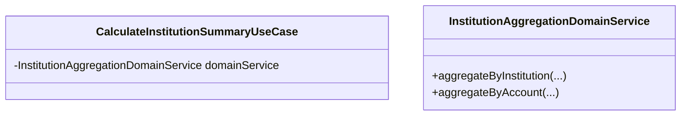
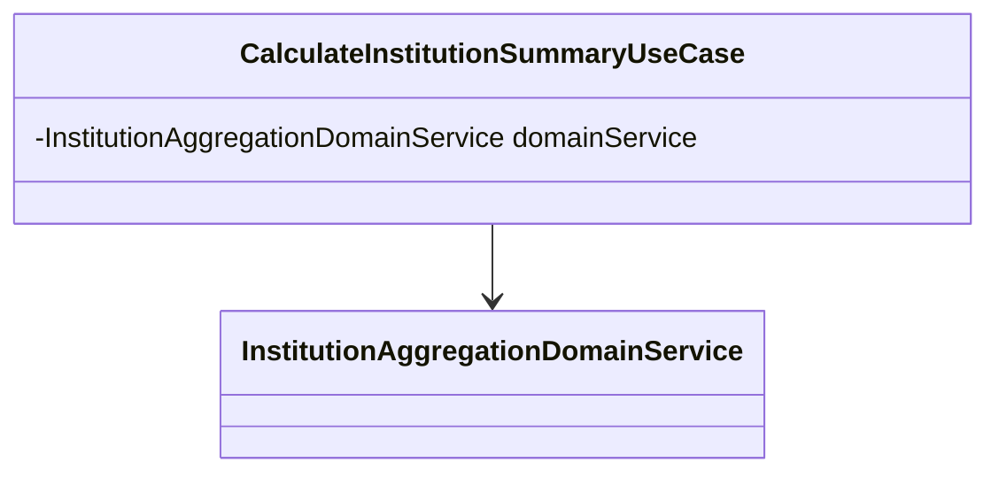
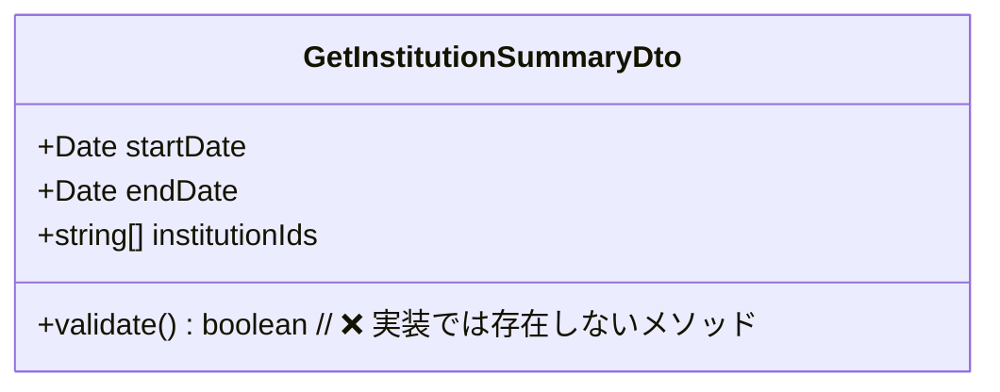
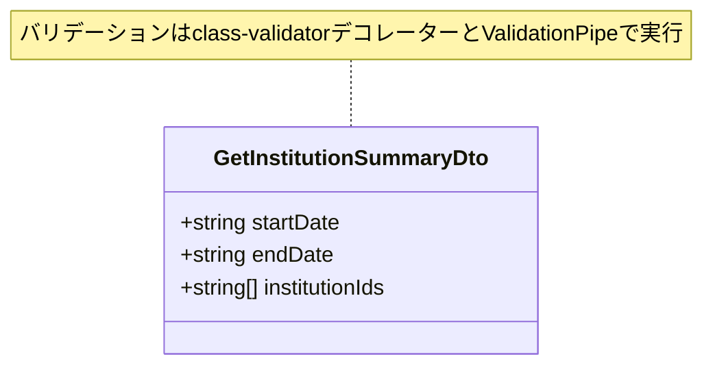
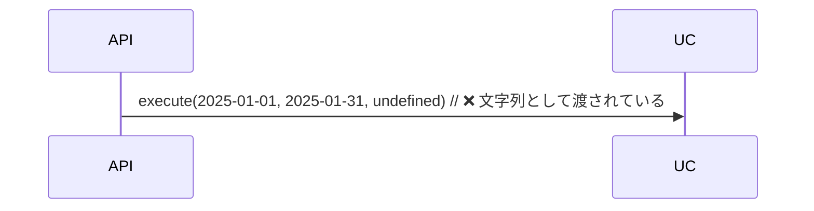
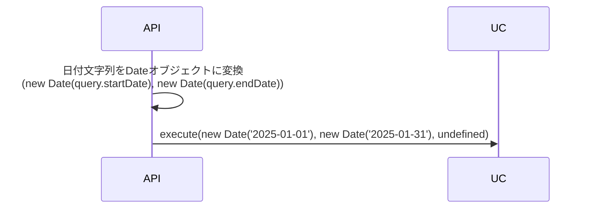
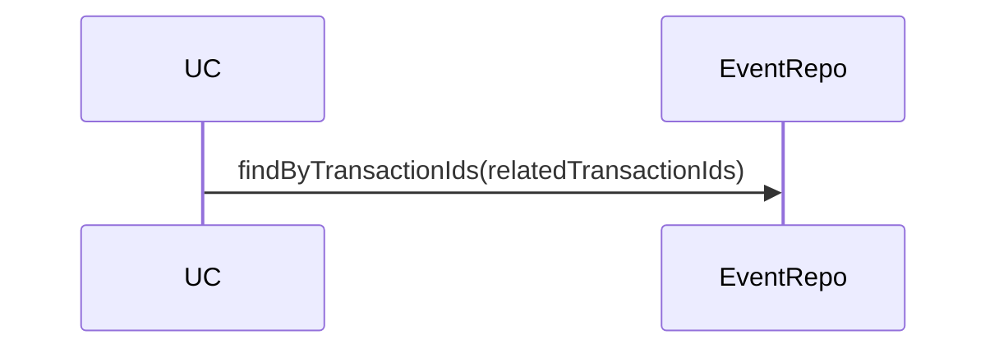
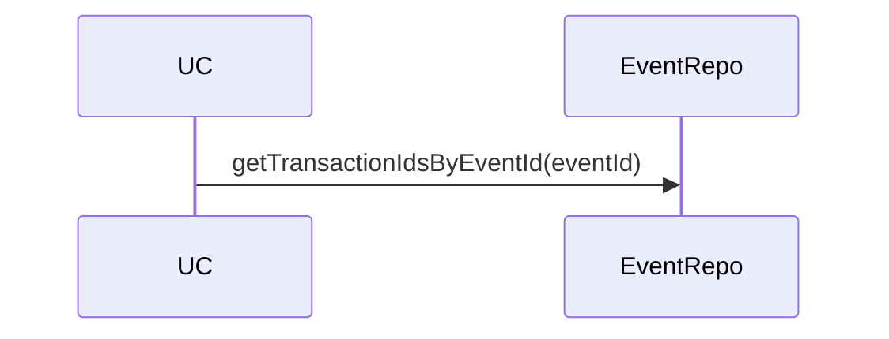

# コード品質基準とテスト実装ガイドライン

このファイルは、コード品質の基準とテスト実装のガイドラインを統合したものです。

---

## 🎯 基本原則

### 型安全性（最優先）

- **any型の使用禁止**（テストのJestモック作成時のみ例外、理由コメント必須）
- **危険な型キャストの禁止**（`as unknown as`等）
- **Enum型の型安全な比較**（`Object.entries()`使用時は明示的型キャスト）
- **テストコードでも型安全性を保つ**

### テストの原則

- **全ての新規実装にユニットテストを作成**
- **APIエンドポイントやUI機能にはE2Eテストも作成**
- **テストが失敗した場合は必ず修正してから次の作業に進む**
- **テストカバレッジは80%以上を目標**

---

## 🚨 テスト作成の必須化（最重要ルール）

```
╔══════════════════════════════════════════════════════════════╗
║  🚨 CRITICAL RULE - MUST FOLLOW 🚨                          ║
║                                                              ║
║  新規機能・バグ修正の実装時は、必ずテストを同時に作成する    ║
║  テストなしでのPRマージは禁止                                 ║
║  「後でテストを書く」は許可しない                             ║
╚══════════════════════════════════════════════════════════════╝
```

### 絶対ルール: テストなしでの実装は禁止

**原則として、このルールは全ての実装に適用されます。**

#### ✅ 正しいワークフロー（TDD推奨）

1. **テスト作成**: 実装前に失敗するテストを書く
2. **実装**: テストをパスする最小限の実装
3. **リファクタリング**: コード品質を向上
4. **コミット**: 実装とテストを同時にコミット

#### ⚠️ 許容されるワークフロー（同時実装）

1. **実装とテストを並行**: 機能実装しながらテストも書く
2. **同一PRに含める**: 実装とテストを同じPRでレビュー
3. **コミット**: 実装commitとテストcommitを連続で行う

#### ❌ 禁止されるワークフロー

1. **実装のみでPR作成**: テストなしでPRを出す
2. **「後でテストを書く」**: テストを別PRで対応
3. **テストなしでマージ**: レビュアーがテストなしを許可

### テスト作成の対象

#### Backend

| レイヤー            | 必須テスト  | 理由                         |
| ------------------- | ----------- | ---------------------------- |
| Domain Entity       | Unit        | ビジネスルールの検証         |
| Domain Value Object | Unit        | バリデーションロジックの検証 |
| Domain Service      | Unit        | ドメインロジックの検証       |
| Application UseCase | Unit        | ユースケースのロジック検証   |
| Controller          | E2E         | APIエンドポイントの動作確認  |
| Repository実装      | Integration | データアクセスの検証         |

#### Frontend

| 対象           | 必須テスト | 理由                              |
| -------------- | ---------- | --------------------------------- |
| Component      | Unit       | UIロジックの検証                  |
| Store          | Unit       | 状態管理ロジックの検証            |
| API Client     | Unit       | APIリクエストの検証（モック使用） |
| Utils          | Unit       | ユーティリティ関数の検証          |
| ユーザーフロー | E2E        | 主要な画面遷移の検証              |

### 例外ケース

以下の場合のみ、テストなしでのマージを許可：

1. **ドキュメント変更のみ**: `.md`ファイルの更新のみ
2. **設定ファイル変更のみ**: `tsconfig.json`等の設定変更のみ
3. **緊急のホットフィックス**: セキュリティ修正等（ただし、直後にテスト追加Issueを作成）

### PR作成時のチェックリスト

PRテンプレート（`.github/pull_request_template.md`）には以下のチェックリストが含まれています：

- [ ] 新規追加/変更したすべてのコードに対応するテストを作成した
- [ ] すべてのテストがパスすることを確認した
- [ ] カバレッジレポートを確認し、追加コードがカバーされていることを確認した
- [ ] E2Eテストが必要な場合は追加した
- [ ] ローカルでの4ステップチェックを完了した
  - [ ] `./scripts/test/lint.sh`
  - [ ] `pnpm build`
  - [ ] `./scripts/test/test.sh all`
  - [ ] `./scripts/test/test-e2e.sh frontend`
- [ ] テストなしでマージする場合、例外ケースに該当し、その理由を記載した

**PR作成時は必ずこのチェックリストを確認し、すべての項目をチェックしてください。**

### カバレッジ目標

#### 現在のカバレッジ（2024年11月時点）

- Backend Unit: 35.89%（目標: 80%）
- Backend E2E: 1.23%（目標: 50%）
- Frontend Unit: 47.92%（目標: 80%）

#### 新規実装コードの目標

- **Unit Test Coverage**: 80%以上
- **E2E Test Coverage**: 主要フローを100%カバー

**重要**: 既存コードのカバレッジは段階的に向上させますが、**新規実装コードは必ず80%以上のカバレッジを確保**してください。

---

## 1. 型安全性のチェックリスト

### ❌ 絶対禁止事項

#### 1-1. 危険な型キャスト

```typescript
// ❌ 絶対禁止
apiClient: someObject as unknown as ITargetInterface;
apiClient: someObject as any;
```

**問題**: 型安全性を完全に損なう。実行時エラーの原因。

**✅ 正しい対応**:

```typescript
// ✅ インターフェース継承で型安全に
export interface ISourceInterface extends ITargetInterface {
  // 既存のメソッド
}

// ✅ 適切な型定義を作成
interface IAdapter {
  healthCheck(id: string): Promise<HealthCheckResult>;
}
```

#### 1-2. any型の安易な使用

```typescript
// ❌ 禁止
function process(data: any) {}
const result: any = fetchData();
```

**✅ 正しい対応**:

```typescript
// ✅ 適切な型定義
interface DataType {
  id: string;
  value: number;
}
function process(data: DataType): void {}

// ✅ 型が不明な場合はunknown
function process(data: unknown): void {
  if (typeof data === 'string') {
    // 型ガードで安全に使用
  }
}
```

**例外**: テストファイルでJestモック作成時のみ、コメント付きで許可

```typescript
// Jest型定義の制約によりany使用
const mockRepo = { findById: jest.fn() } as any;
```

#### 1-3. Enum型の型安全な比較

```typescript
// ❌ 避けるべきパターン
{Object.entries(CATEGORY_LABELS).map(([category, label]) => (
  <button
    onClick={() => setSelectedCategory(category as BankCategory)}
    className={String(selectedCategory) === category ? '...' : '...'}
  >
))}
```

**問題**:

- `Object.entries()`の戻り値は`[string, T][]`型
- 型アサーション（`as`）は型安全性を損なう

**✅ 正しい対応**:

```typescript
// ✅ 明示的な型キャストで型安全に
{(Object.entries(CATEGORY_LABELS) as [BankCategory, string][]).map(([category, label]) => (
  <button
    onClick={() => setSelectedCategory(category)}
    className={selectedCategory === category ? '...' : '...'}
  >
))}
```

#### 1-4. 型ガード関数の実装

型ガード関数（Type Guard）を実装する際は、型安全性を損なわないよう注意が必要です。

**❌ 避けるべきパターン**:

```typescript
// ❌ 型ガード関数内で、証明しようとしている型自身にキャストする
export function isHttpError(error: unknown): error is HttpError {
  return (
    error instanceof Error &&
    'statusCode' in error &&
    typeof (error as HttpError).statusCode === 'number' // ← 問題
  );
}
```

**問題点**:

- 型ガード関数が証明しようとしている型（`HttpError`）に、検証前にキャストしている
- 型ガードの目的（型の証明）と矛盾する
- 型安全性の観点で改善の余地がある

**✅ 正しい実装**:

```typescript
// ✅ より限定的な型アサーションを使用
export function isHttpError(error: unknown): error is HttpError {
  return (
    error instanceof Error &&
    'statusCode' in error &&
    typeof (error as { statusCode: unknown }).statusCode === 'number'
  );
}
```

**改善点**:

- `{ statusCode: unknown }` という最小限の型アサーションを使用
- 型ガード自体の堅牢性が向上
- TypeScriptの型システムをより適切に活用

**参考**: PR #237 - Gemini Code Assistレビュー指摘

---

## 2. データアクセスと配列操作

### ❌ 避けるべきパターン

#### 2-1. 配列の順序依存

```typescript
// ❌ 配列の順序に暗黙的に依存
const results = await checkMultiple(institutions);
const histories = results.map((result, index) => {
  const institution = institutions[index]; // 危険！
});
```

**✅ 正しい対応**:

```typescript
// ✅ IDベースでマッピング
const institutionMap = new Map(institutions.map((inst) => [inst.id, inst]));

const histories = results
  .map((result) => {
    const institution = institutionMap.get(result.institutionId);
    if (!institution) {
      logger.warn(`対応する金融機関が見つかりません: ${result.institutionId}`);
      return null;
    }
    return createHistory(result, institution);
  })
  .filter((h): h is History => h !== null);
```

#### 2-2. クエリパラメータの網羅性不足

```typescript
// ❌ 一部のパラメータ組み合わせのみ対応
if (query.institutionId) {
  return getLatest(query.institutionId); // limitが無視される！
}
```

**✅ 正しい対応**:

```typescript
// ✅ 全てのパラメータ組み合わせを考慮
if (query.latestOnly) {
  // 最新のみ
} else if (query.startDate && query.endDate) {
  histories = await getByDateRange(...);
  if (query.limit) {
    histories = histories.slice(0, query.limit);
  }
} else if (query.institutionId) {
  histories = await getAll().filter(h => h.id === query.institutionId);
  if (query.limit) {
    histories = histories.slice(0, query.limit);
  }
}
```

---

## 2-3. 環境変数の管理（NestJSベストプラクティス）

### ❌ 避けるべきパターン: `process.env`の直接参照

```typescript
// ❌ 悪い例: process.envを直接参照
@Injectable()
export class ConnectionCheckerService {
  private readonly TIMEOUT_MS = parseInt(process.env.HEALTH_CHECK_TIMEOUT_MS || '10000', 10);
  private readonly MAX_RESPONSE_TIME_MS = parseInt(
    process.env.HEALTH_CHECK_MAX_RESPONSE_TIME_MS || '5000',
    10
  );
}
```

**問題**:

- テスト容易性が低い（`process.env`を直接操作する必要がある）
- 型安全性がない（`parseInt`が`NaN`を返すリスク）
- バリデーションが実行時まで遅延される
- 設定の一元管理が困難

### ✅ 正しいパターン: `ConfigService`の使用

```typescript
// ✅ 良い例: ConfigServiceを使用
import { ConfigService } from '@nestjs/config';

@Injectable()
export class ConnectionCheckerService {
  private readonly TIMEOUT_MS: number;
  private readonly MAX_RESPONSE_TIME_MS: number;

  constructor(private readonly configService: ConfigService) {
    this.TIMEOUT_MS = this.configService.get<number>(
      'HEALTH_CHECK_TIMEOUT_MS',
      10000 // デフォルト値
    );
    this.MAX_RESPONSE_TIME_MS = this.configService.get<number>(
      'HEALTH_CHECK_MAX_RESPONSE_TIME_MS',
      5000 // デフォルト値
    );
  }
}
```

**改善点**:

1. **テスト容易性の向上**
   - `ConfigService`をモックすることで、テスト時に設定値を簡単に注入できる
   - `process.env`を直接操作する必要がない

2. **型安全性の向上**
   - `ConfigService`のジェネリクス型パラメータで型を指定
   - `class-validator`と連携することで、起動時にバリデーション可能

3. **設定の一元管理**
   - アプリケーション全体の設定を`ConfigModule`で一元管理
   - 可読性と保守性が向上

4. **実行時エラーの防止**
   - `parseInt`が`NaN`を返すリスクを低減
   - アプリケーション起動時に環境変数の型チェックと存在確認が可能

### 推奨実装パターン

```typescript
// app.module.ts
import { ConfigModule } from '@nestjs/config';

@Module({
  imports: [
    ConfigModule.forRoot({
      isGlobal: true, // 全モジュールでConfigServiceを使用可能に
      validationSchema: Joi.object({
        HEALTH_CHECK_TIMEOUT_MS: Joi.number().default(10000),
        HEALTH_CHECK_MAX_RESPONSE_TIME_MS: Joi.number().default(5000),
        SYNC_MAX_PARALLEL: Joi.number().default(5),
      }),
    }),
  ],
})
export class AppModule {}
```

**バリデーションスキーマ（オプション）**:

`class-validator`を使用することで、より厳密な型チェックとバリデーションが可能です：

```typescript
import { IsNumber, Min, Max } from 'class-validator';
import { Type } from 'class-transformer';

export class EnvironmentVariables {
  @Type(() => Number)
  @IsNumber()
  @Min(1000)
  @Max(60000)
  HEALTH_CHECK_TIMEOUT_MS: number = 10000;

  @Type(() => Number)
  @IsNumber()
  @Min(1000)
  @Max(30000)
  HEALTH_CHECK_MAX_RESPONSE_TIME_MS: number = 5000;

  @Type(() => Number)
  @IsNumber()
  @Min(1)
  @Max(20)
  HEALTH_CHECK_MAX_PARALLEL: number = 5;
}
```

### チェックリスト

- [ ] `process.env`を直接参照せず、`ConfigService`を使用している
- [ ] 環境変数の型が明示的に指定されている
- [ ] デフォルト値が適切に設定されている
- [ ] テストでは`ConfigService`をモックしている
- [ ] （オプション）バリデーションスキーマを定義している

**参考**: PR #282 - Gemini Code Assistレビュー指摘

---

## 3. アーキテクチャとモジュール設計

### 3-1. データベーストランザクション管理

#### ❌ 避けるべきパターン: 複数操作の非アトミック実行

```typescript
// ❌ 悪い例: 変更履歴と取引更新が別々の操作
async execute(dto: UpdateDto): Promise<Result> {
  await this.historyRepository.create(history);  // 1つ目の操作
  return await this.transactionRepository.update(transaction);  // 2つ目の操作
}
```

**問題**:

- 1つ目の操作が成功しても、2つ目が失敗するとデータ不整合が発生
- 履歴だけ記録されて、実際の更新が失敗する可能性
- ロールバックが困難

#### ✅ 正しいパターン: トランザクションでアトミックに実行

```typescript
// ✅ 良い例: データベーストランザクションで複数操作を1つに
@Injectable()
export class UpdateTransactionSubcategoryUseCase {
  constructor(
    @InjectDataSource()
    private readonly dataSource: DataSource,
    @Inject(TRANSACTION_REPOSITORY)
    private readonly transactionRepository: ITransactionRepository,
    @Inject(SUB_CATEGORY_REPOSITORY)
    private readonly subcategoryRepository: ISubcategoryRepository,
  ) {}

  async execute(dto: UpdateDto): Promise<Result> {
    // トランザクション外でエンティティの存在確認を並列実行
    const [transaction, subcategory] = await Promise.all([
      this.transactionRepository.findById(dto.transactionId),
      this.subcategoryRepository.findById(dto.subcategoryId),
    ]);

    // 存在確認
    if (!transaction) {
      throw new NotFoundException(
        `Transaction not found with ID: ${dto.transactionId}`,
      );
    }
    if (!subcategory) {
      throw new NotFoundException(
        `Subcategory not found with ID: ${dto.subcategoryId}`,
      );
    }

    // データ整合性の検証（カテゴリタイプの一致）
    if (transaction.category.type !== subcategory.categoryType) {
      throw new BadRequestException(
        `Subcategory with type ${subcategory.categoryType} cannot be assigned to a transaction with type ${transaction.category.type}.`,
      );
    }

    // データベーストランザクションで複数操作をアトミックに実行
    return await this.dataSource.transaction(async (entityManager) => {
      // トランザクション内で取引を再取得（競合状態の防止）
      const transactionRepo = entityManager.getRepository(TransactionOrmEntity);
      const transactionOrm = await transactionRepo.findOne({
        where: { id: dto.transactionId },
      });

      if (!transactionOrm) {
        throw new NotFoundException(
          `Transaction not found with ID: ${dto.transactionId} within transaction`,
        );
      }

      // 変更履歴を記録
      const historyRepo = entityManager.getRepository(HistoryOrmEntity);
      await historyRepo.save({ ... });

      // 取引を更新
      await transactionRepo.save({ ... });

      return result;
    });
  }
}
```

**重要なポイント**:

1. **複数のデータベース操作が関連する場合は必ずトランザクションを使用**
2. **トランザクション外で可能な検証は先に実行**（パフォーマンス向上）
3. **エンティティマネージャー経由でリポジトリにアクセス**
4. **すべての操作が成功するか、すべて失敗するかのどちらか**（原子性）
5. **トランザクション内でのデータ取得は必ずentityManagerを使用**
   - トランザクションに紐付いていないリポジトリを使用すると、ダーティリードなどの競合状態が発生する可能性
   - トランザクションの一貫性を保証するため、トランザクション内でのデータ取得は`entityManager.getRepository()`を使用
6. **トランザクション外での並列取得を活用**
   - 複数のエンティティを取得する場合は`Promise.all`を使用して並列化することでパフォーマンスを改善
   - ただし、トランザクション内での更新対象エンティティは必ず再取得する
7. **データ整合性の検証**
   - エンティティ間の関連性（例：カテゴリタイプの一致）を検証し、不整合の場合は`BadRequestException`をスロー
   - 検証はトランザクション外で実行し、早期にエラーを返すことでパフォーマンスを向上
8. **トランザクション内でのタイムスタンプ管理**
   - トランザクション内で複数のタイムスタンプが必要な場合、トランザクション開始時に一度だけ`Date`オブジェクトを生成し、それを使い回す
   - これにより、`changedAt`、`confirmedAt`、`updatedAt`などの間に意図しない時間のずれが生じるのを防ぐ
9. **トランザクション内でのタイムスタンプ管理**
   - トランザクション内で複数のタイムスタンプが必要な場合、トランザクション開始時に一度だけ`Date`オブジェクトを生成し、それを使い回す
   - これにより、`changedAt`、`confirmedAt`、`updatedAt`などの間に意図しない時間のずれが生じるのを防ぐ

#### リポジトリパターンの活用とトランザクション管理

**注意点**: トランザクション内でentityManagerを直接使用すると、リポジトリ層に集約すべきマッピングロジックがユースケース層に漏れ出してしまいます。

**✅ 推奨アプローチ**:

1. リポジトリメソッドがオプションで`EntityManager`を受け取れるようにする
2. トランザクション内では、その`EntityManager`をリポジトリメソッドに渡す
3. 永続化ロジックをリポジトリ層にカプセル化しつつ、アトミックな操作を保証

```typescript
// ✅ より良い設計
export interface IRepository {
  create(entity: Entity, entityManager?: EntityManager): Promise<Entity>;
  update(entity: Entity, entityManager?: EntityManager): Promise<Entity>;
  findById(id: string, entityManager?: EntityManager): Promise<Entity | null>;
}

// リポジトリ実装
@Injectable()
export class TypeOrmRepository implements IRepository {
  constructor(
    @InjectRepository(OrmEntity)
    private readonly repository: Repository<OrmEntity>,
  ) {}

  async create(entity: Entity, manager?: EntityManager): Promise<Entity> {
    const repository = manager ? manager.getRepository(OrmEntity) : this.repository;
    const ormEntity = this.toOrm(entity);
    await repository.save(ormEntity);
    return entity;
  }

  async findById(id: string, manager?: EntityManager): Promise<Entity | null> {
    const repository = manager ? manager.getRepository(OrmEntity) : this.repository;
    const ormEntity = await repository.findOne({ where: { id } });
    return ormEntity ? this.toDomain(ormEntity) : null;
  }

  // ドメインエンティティとORMエンティティのマッピングはリポジトリ内に集約
  private toOrm(domain: Entity): OrmEntity { /* ... */ }
  private toDomain(orm: OrmEntity): Entity { /* ... */ }
}

// ユースケースでの使用
async execute(dto: UpdateDto): Promise<Result> {
  // トランザクション外で検証
  const entity = await this.repository.findById(dto.id);
  if (!entity) {
    throw new NotFoundException(`Entity not found`);
  }

  // トランザクション内でリポジトリを使用
  return await this.dataSource.transaction(async (entityManager) => {
    // ⚠️ 重要: トランザクション内でエンティティを再取得
    // トランザクション外で取得したデータは古い可能性があるため、
    // 更新対象のエンティティは必ずトランザクション内で再取得する
    const entityToUpdate = await this.repository.findById(dto.id, entityManager);
    if (!entityToUpdate) {
      throw new NotFoundException(`Entity not found within transaction`);
    }

    await this.historyRepository.create(history, entityManager);
    return await this.repository.update(entityToUpdate, entityManager);
  });
}
```

**重要な注意点**:

1. **競合状態（レースコンディション）の防止**
   - トランザクション外で取得したエンティティをそのまま更新すると、古いデータで上書きしてしまう危険性がある
   - **必ずトランザクション内でエンティティを再取得**してから更新する
   - これにより、他のトランザクションによる変更を正しく反映できる

2. **パフォーマンス最適化**
   - 大量のデータを処理する場合は`Promise.all`で並列化
   - トランザクション外での検証で早期リターンを活用

```typescript
// ✅ 並列処理でパフォーマンス最適化
await this.dataSource.transaction(async (entityManager) => {
  // 並列で複数のデータを処理
  await Promise.all(
    dataArray.map(async (data) => {
      const existing = await this.repository.findById(data.id, entityManager);
      if (!existing) {
        await this.repository.create(data, entityManager);
      }
    })
  );
});
```

**メリット**:

- ✅ UseCase層がインフラストラクチャ層の実装詳細から切り離される
- ✅ ドメインエンティティとORMエンティティのマッピングがリポジトリに集約
- ✅ コードの重複を削減
- ✅ クリーンアーキテクチャの依存関係ルールを遵守
- ✅ テストの容易性が向上（リポジトリをモックしやすい）

**リポジトリ実装のベストプラクティス**:

3. **ヘルパーメソッドでコード重複を削減**

#### ❌ 避けるべきパターン: コードの重複

```typescript
// ❌ 悪い例: 同じロジックが複数のUseCaseに重複
export class GetSubcategoriesUseCase {
  private buildTree(subcategories: Subcategory[]): SubcategoryTreeItem[] {
    // 階層構造構築ロジック（50行以上）
  }
}

export class GetSubcategoriesByCategoryUseCase {
  private buildTree(subcategories: Subcategory[]): SubcategoryTreeItem[] {
    // 同じ階層構造構築ロジック（50行以上）← 重複！
  }
}
```

**問題**:

- 同じロジックが複数箇所に存在すると、メンテナンス性が低下
- バグ修正や機能追加時に複数箇所を修正する必要がある
- 将来のバグの原因となり得る

#### ✅ 正しいパターン: 共通サービスに抽出

```typescript
// ✅ 良い例: 共通のDomain Serviceに抽出
@Injectable()
export class SubcategoryTreeBuilderService {
  buildTree(subcategories: Subcategory[]): SubcategoryTreeItem[] {
    // 階層構造構築ロジック（1箇所に集約）
  }
}

export class GetSubcategoriesUseCase {
  constructor(private readonly treeBuilderService: SubcategoryTreeBuilderService) {}

  async execute(): Promise<Result> {
    const subcategories = await this.repository.findAll();
    const tree = this.treeBuilderService.buildTree(subcategories);
    return { subcategories: tree };
  }
}

export class GetSubcategoriesByCategoryUseCase {
  constructor(private readonly treeBuilderService: SubcategoryTreeBuilderService) {}

  async execute(categoryType: CategoryType): Promise<Result> {
    const subcategories = await this.repository.findByCategory(categoryType);
    const tree = this.treeBuilderService.buildTree(subcategories);
    return { subcategories: tree };
  }
}
```

**重要なポイント**:

- **同じロジックが2箇所以上に存在する場合は、共通サービスに抽出する**
- **Domain Service層に共通ロジックを配置**（Onion Architectureの原則に従う）
- **コードの重複はメンテナンス性の低下に繋がるため、積極的にリファクタリングする**
- **APIレスポンスの最適化**
  - 空の配列やオプショナルなプロパティは、値が存在する場合にのみレスポンスに含める
  - これにより、レスポンスのペイロードサイズを削減し、クリーンなAPIレスポンスになる
  - 例：子要素を持たないノード（葉ノード）に対して空の`children`配列を含めない

#### 4. **Controllerの責務とクリーンアーキテクチャ原則**

#### ⚠️ 今後の改善課題: Controllerからリポジトリを直接呼び出さない

Issue #296 / PR #312のGeminiレビューで指摘された、クリーンアーキテクチャの原則に関する今後の改善課題です。

**現状の問題**:

```typescript
// ⚠️ 改善が必要: Controllerでリポジトリを直接呼び出している
@Post('classify')
async classify(@Body() dto: ClassificationRequestDto): Promise<ClassificationResponseDto> {
  // ユースケースで分類を実行
  const classificationResult = await this.classifyUseCase.execute(dto);

  // ⚠️ 問題: Controllerでリポジトリを直接呼び出して追加のエンティティを取得
  const subcategory = await this.subcategoryRepository.findById(
    classificationResult.subcategoryId
  );

  if (!subcategory) {
    throw new NotFoundException(`Subcategory not found`);
  }

  // merchantName等の追加情報も同様に取得
  const merchant = await this.merchantRepository.findById(
    classificationResult.merchantId
  );

  return {
    success: true,
    data: {
      subcategory,
      confidence: classificationResult.confidence,
      merchantName: merchant?.name,
    },
  };
}
```

**問題点**:

1. **クリーンアーキテクチャの原則違反**: Presentation層（Controller）がInfrastructure層（Repository）に直接依存
2. **UseCaseの責務が不明確**: 必要なデータをすべて返すべきなのはUseCaseの責務
3. **保守性の低下**: データ取得ロジックがControllerに漏れ、変更時の影響範囲が広い

**理想的な設計**:

```typescript
// ✅ 理想: UseCaseがすべての必要なデータを返す
export interface ClassificationResult {
  subcategoryId: string;
  subcategoryName: string;  // 👈 UseCaseで取得
  categoryType: CategoryType;
  confidence: number;
  reason: ClassificationReason;
  merchantId: string | null;
  merchantName: string | null;  // 👈 UseCaseで取得
}

@Post('classify')
async classify(@Body() dto: ClassificationRequestDto): Promise<ClassificationResponseDto> {
  // ✅ UseCaseがすべてのデータを返す
  const result = await this.classifyUseCase.execute(dto);

  // ✅ Controllerはデータの整形のみ
  return {
    success: true,
    data: result,
  };
}
```

**対応方針**:

- **現時点**: Phase 5（Presentation層実装）では、動作する実装を優先し、アーキテクチャ改善は保留
- **今後**: FR-009のリファクタリングフェーズ（Phase 6以降）、または別途「技術的負債解消」Issueで対応
- **優先度**: Medium（機能は正常に動作しているが、保守性向上のため改善推奨）

**参考**: Issue #296 / PR #312 - Gemini指摘：クリーンアーキテクチャ原則の遵守

```typescript
// ✅ リポジトリ実装でDRY原則を徹底
@Injectable()
export class TypeOrmRepository implements IRepository {
  constructor(
    @InjectRepository(OrmEntity)
    private readonly repository: Repository<OrmEntity>
  ) {}

  // ヘルパーメソッドでEntityManagerの処理を一元化
  private getRepo(manager?: EntityManager): Repository<OrmEntity> {
    return manager ? manager.getRepository(OrmEntity) : this.repository;
  }

  async create(entity: Entity, manager?: EntityManager): Promise<Entity> {
    const repository = this.getRepo(manager);
    const ormEntity = this.toOrm(entity);
    await repository.save(ormEntity);
    return entity;
  }

  async findById(id: string, manager?: EntityManager): Promise<Entity | null> {
    const repository = this.getRepo(manager);
    const ormEntity = await repository.findOne({ where: { id } });
    return ormEntity ? this.toDomain(ormEntity) : null;
  }

  async update(entity: Entity, manager?: EntityManager): Promise<Entity> {
    const repository = this.getRepo(manager);
    const ormEntity = this.toOrm(entity);
    await repository.save(ormEntity);
    return entity;
  }

  // 他のメソッドも同様にgetRepo()を使用
}
```

**メリット**:

- EntityManager取得ロジックが一箇所に集約される
- 各メソッドがシンプルになり可読性が向上
- 変更が必要な場合、一箇所を修正するだけで済む

**トレードオフ**:

- 現状の実装（entityManager直接使用）でも原子性は保証される
- リポジトリパターンの完全性を優先する場合は、上記の設計を採用
- プロジェクトの段階や優先度に応じて判断する

**参考**: PR #283 Geminiレビュー指摘

#### TypeORMのデコレータの適切な使用

```typescript
// ❌ 避けるべきパターン
export class HistoryOrmEntity {
  @CreateDateColumn() // データベースが自動設定するはず
  changedAt!: Date;
}

// アプリケーション層で日時を設定
const history = new History(
  id,
  transactionId,
  oldCategory,
  newCategory,
  new Date() // ← アプリで設定している！
);
```

**問題**: `@CreateDateColumn`はデータベースが自動的に日時を設定するためのもの。アプリケーション側で日時を設定する場合は矛盾が生じる。

```typescript
// ✅ 正しいパターン
export class HistoryOrmEntity {
  @Column() // 通常のカラムとして定義
  changedAt!: Date;
}

// アプリケーション層で明示的に日時を設定
const history = new History(
  id,
  transactionId,
  oldCategory,
  newCategory,
  new Date() // アプリで制御
);
```

**原則**:

- **`@CreateDateColumn` / `@UpdateDateColumn`**: データベースに日時管理を任せる場合
- **`@Column()`**: アプリケーションで日時を制御する場合

### ❌ 避けるべきパターン

#### 3-2. コントローラーから他モジュールのリポジトリへの直接依存

```typescript
// ❌ コントローラーが複数モジュールのリポジトリに依存
@Controller('health')
class HealthController {
  constructor(
    private institutionRepo: IInstitutionRepository,
    private creditCardRepo: ICreditCardRepository,
    private securitiesRepo: ISecuritiesAccountRepository
  ) {}
}
```

**✅ 正しい対応**:

```typescript
// ✅ 専用サービスを作成してデータ集約
@Injectable()
class InstitutionAggregationService {
  constructor(
    private institutionRepo: IInstitutionRepository,
    private creditCardRepo: ICreditCardRepository,
    private securitiesRepo: ISecuritiesAccountRepository
  ) {}

  async getAllInstitutions(): Promise<IInstitutionInfo[]> {
    // 複数モジュールからデータを集約
  }
}

@Controller('health')
class HealthController {
  constructor(
    private aggregationService: InstitutionAggregationService // 1つのサービスに依存
  ) {}
}
```

---

### 3-3. NestJSモジュール定義のベストプラクティス

#### ❌ 避けるべきパターン: プロバイダーの重複登録

```typescript
// ❌ 悪い例: 同じプロバイダーが2回登録されている
@Module({
  providers: [
    {
      provide: TRANSACTION_REPOSITORY,
      useClass: TransactionTypeOrmRepository,
    },
    TransactionTypeOrmRepository, // ← 重複！
    {
      provide: HISTORY_REPOSITORY,
      useClass: HistoryRepository,
    },
    HistoryRepository, // ← 重複！
    // ...
  ],
})
export class TransactionModule {}
```

**問題**:

- 同じクラスが2つのインスタンスとして登録される
- DIコンテナが混乱し、予期しない動作を引き起こす可能性
- 保守性が低下

#### ✅ 正しいパターン: トークンベースの登録のみ

```typescript
// ✅ 良い例: トークンベースの登録のみ
@Module({
  providers: [
    {
      provide: TRANSACTION_REPOSITORY,
      useClass: TransactionTypeOrmRepository,
    },
    {
      provide: HISTORY_REPOSITORY,
      useClass: HistoryRepository,
    },
    // Domain Services
    TransactionDomainService,
    // Use Cases
    UpdateTransactionCategoryUseCase,
  ],
})
export class TransactionModule {}
```

**重要なポイント**:

- **トークンで提供されるクラスは、クラス名で再登録しない**
- **依存性注入はトークン経由で行う**
- **モジュール定義をシンプルに保つ**
- **未使用の依存関係は削除する**
  - インジェクトされているが使用されていない依存関係は、コードの理解を妨げる可能性があるため削除する
  - 特に、`entityManager`から直接リポジトリを取得している場合は、不要なインジェクションを削除する
- **DIトークンはSymbolを使用する**
  - 将来的な名前の衝突を避け、一貫性を保つために、すべてのDIトークンは`Symbol`を使用する
  - 文字列リテラルではなく、`Symbol('InterfaceName')`の形式で定義する
  - 例：`export const REPOSITORY_TOKEN = Symbol('IRepository');`

### 3-2. Domain層の設計原則とパフォーマンス考慮

#### ❌ 避けるべきパターン1: Domain ServiceでfindAll()してメモリフィルタリング

```typescript
// ❌ 悪い例: 全件取得してメモリ上でフィルタリング
@Injectable()
export class MerchantMatcherService {
  async match(description: string): Promise<Merchant | null> {
    const merchants = await this.merchantRepository.findAll();

    for (const merchant of merchants) {
      if (merchant.matchesDescription(description)) {
        return merchant;
      }
    }
    return null;
  }
}
```

**問題**:

- データ量の増加に伴いパフォーマンスが著しく低下
- 不要なデータをメモリに読み込む
- データベースの検索機能を活用できていない

**✅ 正しいパターン: リポジトリに検索責務を委譲**

```typescript
// ✅ 良い例: リポジトリ層で効率的な検索を実施
export interface IMerchantRepository {
  searchByDescription(description: string): Promise<Merchant | null>;
}

@Injectable()
export class MerchantMatcherService {
  async match(description: string): Promise<Merchant | null> {
    // リポジトリ層でDB検索を実施（パフォーマンス最適化）
    return await this.merchantRepository.searchByDescription(description);
  }
}

// Infrastructure層での実装例
@Injectable()
export class MerchantTypeOrmRepository implements IMerchantRepository {
  async searchByDescription(description: string): Promise<Merchant | null> {
    // DBレベルでLIKE検索やJSON検索を実施
    const result = await this.repository
      .createQueryBuilder('merchant')
      .where('merchant.name LIKE :desc', { desc: `%${description}%` })
      .orWhere('JSON_SEARCH(merchant.aliases, "one", :desc) IS NOT NULL', {
        desc: `%${description}%`,
      })
      .getOne();

    return result ? this.toDomain(result) : null;
  }
}
```

**重要なポイント**:

1. **Domain Serviceはビジネスロジックの調整に専念**
2. **データアクセスの最適化はリポジトリに委譲**
3. **パフォーマンス要件を考慮したリポジトリメソッド設計**

#### ❌ 避けるべきパターン2: コンストラクタ内でのサービスインスタンス化

```typescript
// ❌ 悪い例: コンストラクタ内で直接new
export class SubcategoryClassifierService {
  private readonly merchantMatcher: MerchantMatcherService;
  private readonly keywordMatcher: KeywordMatcherService;

  constructor(
    private readonly subcategoryRepository: ISubcategoryRepository,
    merchantRepository: IMerchantRepository
  ) {
    this.merchantMatcher = new MerchantMatcherService(merchantRepository);
    this.keywordMatcher = new KeywordMatcherService();
  }
}
```

**問題**:

- 依存性逆転の原則(DIP)に反する
- テストが困難（モック化できない）
- クラス間の結合度が高い

**✅ 正しいパターン: コンストラクタ注入**

```typescript
// ✅ 良い例: すべての依存をコンストラクタ注入
@Injectable()
export class SubcategoryClassifierService {
  constructor(
    private readonly subcategoryRepository: ISubcategoryRepository,
    private readonly merchantMatcher: MerchantMatcherService,
    private readonly keywordMatcher: KeywordMatcherService
  ) {}
}
```

**重要なポイント**:

1. **すべての依存はコンストラクタ経由で注入**
2. **@Injectable()デコレータでNestJSのDIコンテナに登録**
3. **テストしやすい設計**

#### ❌ 避けるべきパターン3: テキスト正規化ロジックの重複

```typescript
// ❌ 悪い例: 各クラスで異なる正規化ロジック
class MerchantEntity {
  private normalizeText(text: string): string {
    return text.toLowerCase().replace(/\s+/g, '');
  }
}

class KeywordMatcherService {
  private normalizeText(text: string): string {
    return text
      .toLowerCase()
      .replace(/[Ａ-Ｚａ-ｚ０-９]/g, (s) => String.fromCharCode(s.charCodeAt(0) - 0xfee0))
      .replace(/[^\w\sぁ-んァ-ヶー一-龯]/g, '')
      .trim();
  }
}
```

**問題**:

- ロジックの一貫性がない
- マッチング結果に予期せぬ差異が発生
- 保守性が低い

**✅ 正しいパターン: 共通ユーティリティの使用**

```typescript
// ✅ 良い例: 統一された正規化ユーティリティ
export class TextNormalizer {
  static normalize(text: string): string {
    return text
      .toLowerCase()
      .replace(/[Ａ-Ｚａ-ｚ０-９]/g, (s) => String.fromCharCode(s.charCodeAt(0) - 0xfee0))
      .replace(/[^\w\sぁ-んァ-ヶー一-龯]/g, '')
      .replace(/\s+/g, '')
      .trim();
  }

  static includes(haystack: string, needle: string): boolean {
    return this.normalize(haystack).includes(this.normalize(needle));
  }
}

// 各クラスで統一使用
class MerchantEntity {
  matchesDescription(description: string): boolean {
    return TextNormalizer.includes(description, this.name);
  }
}
```

**重要なポイント**:

1. **アプリケーション全体で統一されたロジック**
2. **一貫性のある処理結果**
3. **保守性・テスト容易性の向上**

#### ✅ Repository Interfaceの安全な設計

```typescript
// ❌ 避けるべき: null安全性がない
export interface ISubcategoryRepository {
  findDefault(categoryType: CategoryType): Promise<Subcategory>;
}

// ✅ 推奨: null安全性を考慮
export interface ISubcategoryRepository {
  findDefault(categoryType: CategoryType): Promise<Subcategory | null>;
}

// 呼び出し側で安全にハンドリング
const defaultSubcategory = await this.repository.findDefault(mainCategory);
if (!defaultSubcategory) {
  throw new Error(`Default subcategory not found for category: ${mainCategory}`);
}
```

**重要なポイント**:

1. **データが見つからない可能性を型で表現**
2. **呼び出し側で適切なエラーハンドリング**
3. **null安全性の向上**

#### ✅ スコアベースの信頼度設計

```typescript
// ❌ 避けるべき: 信頼度をハードコード
const keywordMatch = this.keywordMatcher.match(description, category, subcategories);
if (keywordMatch) {
  const confidence = new ClassificationConfidence(0.8); // 固定値
  return new SubcategoryClassification(...);
}

// ✅ 推奨: 実際のマッチングスコアを活用
export interface KeywordMatchResult {
  subcategory: Subcategory;
  score: number;
}

const keywordMatch = this.keywordMatcher.match(description, category, subcategories);
if (keywordMatch) {
  // スコアを信頼度として利用（最低保証あり）
  const confidenceValue = Math.max(keywordMatch.score, 0.7);
  const confidence = new ClassificationConfidence(confidenceValue);
  return new SubcategoryClassification(...);
}
```

**重要なポイント**:

1. **計算されたスコアを活用**
2. **信頼度の動的な調整**
3. **より精度の高い分類**

#### 📝 日本語テキスト処理の将来対応

```typescript
/**
 * テキストからキーワードを抽出
 *
 * NOTE: 現在はスペースで分割する簡易実装
 * 日本語の取引明細（単語がスペースで区切られていない）には
 * 有効ではないため、将来的に形態素解析ライブラリ（kuromoji.js等）の
 * 導入を検討する必要がある
 */
public extractKeywords(text: string): string[] {
  const normalized = TextNormalizer.normalize(text);
  // TODO: 形態素解析の導入（kuromoji.js等）
  return normalized.split(/\s+/).filter((word) => word.length > 0);
}
```

**重要なポイント**:

1. **現在の実装の制約を明示**
2. **将来の改善方針をコメントで残す**
3. **段階的な機能向上を可能にする**

### 3-3. Value Objectとドメインモデルの一貫性

#### ❌ 避けるべきパターン: プリミティブな型をドメインエンティティで使用

```typescript
// ❌ 悪い例: プリミティブ型
export class Merchant {
  constructor(
    public readonly id: string,
    public readonly name: string,
    public readonly confidence: number // プリミティブ型
  ) {
    // バリデーションをエンティティで実装
    if (confidence < 0 || confidence > 1) {
      throw new Error('Invalid confidence');
    }
  }

  public getConfidence(): number {
    return this.confidence;
  }
}
```

**問題**:

- ドメインモデルの一貫性がない（他では`ClassificationConfidence` VOを使用）
- バリデーションロジックが分散
- 信頼度に関するロジックが集約されていない

**✅ 正しいパターン: Value Objectの活用**

```typescript
// ✅ 良い例: Value Objectを使用
export class Merchant {
  constructor(
    public readonly id: string,
    public readonly name: string,
    public readonly confidence: ClassificationConfidence // Value Object
  ) {
    // バリデーションはVOが担当
  }

  public getConfidence(): ClassificationConfidence {
    return this.confidence;
  }

  public toJSON(): MerchantJSONResponse {
    return {
      id: this.id,
      name: this.name,
      confidence: this.confidence.getValue(), // VOから値を取得
    };
  }
}
```

**重要なポイント**:

1. **ドメインモデル全体で一貫した型を使用**
2. **バリデーションロジックはVOに集約**
3. **JSONシリアライズ時はgetValue()で数値に変換**

### 3-4. マジックナンバーの排除

#### ❌ 避けるべきパターン: 閾値のハードコード

```typescript
// ❌ 悪い例: マジックナンバー
export class ClassificationConfidence {
  public isHigh(): boolean {
    return this.value >= 0.9; // 意図が不明確
  }

  public isMedium(): boolean {
    return this.value >= 0.7 && this.value < 0.9; // 変更時の影響が大きい
  }
}

// ❌ 悪い例: サービス内のマジックナンバー
export class SubcategoryClassifierService {
  async classify(description: string): Promise<SubcategoryClassification> {
    if (keywordMatch) {
      const confidenceValue = Math.max(keywordMatch.score, 0.7); // 意図不明
      // ...
    }
    const defaultConfidence = new ClassificationConfidence(0.5); // 変更困難
  }
}
```

**問題**:

- 数値の意図が不明確
- 変更時に複数箇所の修正が必要
- テストでの検証が困難

**✅ 正しいパターン: 名前付き定数の使用**

```typescript
// ✅ 良い例: Value Objectで定数化
export class ClassificationConfidence {
  private static readonly HIGH_THRESHOLD = 0.9;
  private static readonly MEDIUM_THRESHOLD = 0.7;

  public isHigh(): boolean {
    return this.value >= ClassificationConfidence.HIGH_THRESHOLD;
  }

  public isMedium(): boolean {
    return (
      this.value >= ClassificationConfidence.MEDIUM_THRESHOLD &&
      this.value < ClassificationConfidence.HIGH_THRESHOLD
    );
  }

  // 閾値を外部から取得可能に
  public static getHighThreshold(): number {
    return ClassificationConfidence.HIGH_THRESHOLD;
  }
}

// ✅ 良い例: サービスで定数化
@Injectable()
export class SubcategoryClassifierService {
  private static readonly MINIMUM_KEYWORD_MATCH_CONFIDENCE = 0.7;
  private static readonly DEFAULT_CLASSIFICATION_CONFIDENCE = 0.5;

  async classify(description: string): Promise<SubcategoryClassification> {
    if (keywordMatch) {
      const confidenceValue = Math.max(
        keywordMatch.score,
        SubcategoryClassifierService.MINIMUM_KEYWORD_MATCH_CONFIDENCE
      );
      // ...
    }
    const defaultConfidence = new ClassificationConfidence(
      SubcategoryClassifierService.DEFAULT_CLASSIFICATION_CONFIDENCE
    );
  }
}
```

**重要なポイント**:

1. **意味のある名前で定数を定義**
2. **変更時の影響範囲を最小化**
3. **テストでの検証が容易**
4. **コードの可読性と保守性が向上**

### 3-5. 冗長なasync/awaitの回避

#### ❌ 避けるべきパターン: awaitして即return

```typescript
// ❌ 悪い例: 冗長なasync/await
export class MerchantMatcherService {
  public async match(description: string): Promise<Merchant | null> {
    return await this.merchantRepository.searchByDescription(description);
  }
}
```

**問題**:

- 不要なPromiseラッピング
- 微妙なパフォーマンスオーバーヘッド
- コードが冗長

**✅ 正しいパターン: Promiseを直接返す**

```typescript
// ✅ 良い例: Promiseを直接返す
export class MerchantMatcherService {
  public match(description: string): Promise<Merchant | null> {
    return this.merchantRepository.searchByDescription(description);
  }
}
```

**例外: エラーハンドリングや追加処理が必要な場合**

```typescript
// ✅ async/awaitが必要なケース
export class MerchantMatcherService {
  public async match(description: string): Promise<Merchant | null> {
    try {
      const merchant = await this.merchantRepository.searchByDescription(description);
      // 追加の処理やログ出力
      this.logger.debug(`Matched merchant: ${merchant?.name}`);
      return merchant;
    } catch (error) {
      this.logger.error('Merchant matching failed', error);
      throw new MerchantMatchingException(error);
    }
  }
}
```

**重要なポイント**:

1. **単純なPromise転送ではasync/awaitを省略**
2. **エラーハンドリングや追加処理がある場合は使用**
3. **パフォーマンスとコードのシンプルさのバランス**

### 3-6. テキスト正規化の注意点

#### ❌ 避けるべきパターン: 過度な空白削除

```typescript
// ❌ 悪い例: すべての空白を削除
static normalize(text: string): string {
  return text
    .toLowerCase()
    .replace(/[^\w\sぁ-んァ-ヶー一-龯]/g, '')
    .replace(/\s+/g, '') // すべての空白を削除
    .trim();
}

// 結果: extractKeywords()が機能しない
public extractKeywords(text: string): string[] {
  const normalized = this.normalizeText(text);
  // スペースが存在しないため分割できない
  return normalized.split(/\s+/).filter((word) => word.length > 0);
}
```

**問題**:

- キーワード抽出が機能しない
- 単語の区切りが失われる

**✅ 正しいパターン: 空白を一つにまとめる**

```typescript
// ✅ 良い例: 複数の空白を一つにまとめる
static normalize(text: string): string {
  return text
    .toLowerCase()
    .replace(/[^\w\sぁ-んァ-ヶー一-龯]/g, '')
    .replace(/\s+/g, ' ') // 複数空白を一つにまとめる
    .trim();
}

// 結果: extractKeywords()が正常に動作
public extractKeywords(text: string): string[] {
  const normalized = this.normalizeText(text);
  // スペースで正しく分割できる
  return normalized.split(/\s+/).filter((word) => word.length > 0);
}
```

**重要なポイント**:

1. **正規化の目的を明確にする**
2. **後続の処理への影響を考慮**
3. **汎用的なユーティリティは慎重に設計**

---

## 4. テスト実装ガイドライン

### 🚫 テストでの絶対禁止事項

#### 4-1. any型の安易な使用禁止

```typescript
// ❌ 悪い例
const mockData: any = { id: 1 };
const result: any = await service.execute();
```

**✅ 良い例**:

```typescript
// ✅ テストでも適切な型定義を使用
const mockData: CreditCardEntity = {
  id: '1',
  issuer: 'Test Card',
  // ... 必要なプロパティを全て定義
};

// モックオブジェクトでのみany型を許容（理由コメント必須）
const mockRepository = {
  findById: jest.fn(),
  save: jest.fn(),
} as any; // Jest型定義の制約によりany使用
```

#### 4-2. テストエラー・警告の握りつぶし禁止

```typescript
// ❌ 絶対に禁止
it.skip('should process payment', () => {
  // 理由なしのskipは禁止
});

// エラーを握りつぶす
try {
  await service.execute();
} catch (error) {
  // 何もしない  // ❌
}
```

**✅ 正しい対応**:

```typescript
// ✅ 一時的にスキップする場合は理由とTODOを明記
// TODO: #456 - APIモックの修正後にこのテストを有効化
it.skip('should process payment', () => {
  // ...
});

// エラーは適切にテスト
it('should throw error when invalid data', async () => {
  await expect(service.execute(invalidData)).rejects.toThrow('Invalid data');
});
```

#### 4-3. Jest forceExitの使用禁止

**❌ 禁止**:

```typescript
// jest.config.json
{
  "forceExit": true  // ❌ 根本的な問題を隠すため禁止
}
```

**問題点**:

- `forceExit: true`はJestが終了しない根本的な原因（リソースリークなど）を隠してしまう
- Jest公式ドキュメントでもこのオプションの使用は非推奨
- デバッグが困難になり、将来的な問題の原因となる

**✅ 正しい対応**:

1. **根本原因を特定する**

```bash
# --detectOpenHandlesで原因を調査
pnpm test:e2e --detectOpenHandles
```

2. **一般的な原因と対処法**

```typescript
// ✅ ScheduleModuleなどのリソースを適切にクリーンアップ

// テストセットアップ（test-setup.ts）
export async function createTestApp(
  moduleBuilder: TestingModuleBuilder,
  options: TestAppOptions = {}
): Promise<INestApplication> {
  const moduleFixture = await moduleBuilder.compile();
  const app = moduleFixture.createNestApplication();

  // シャットダウンフックを有効化
  // ScheduleModuleなどのリソースを適切にクリーンアップ
  app.enableShutdownHooks();

  await app.init();
  return app;
}

// テストのafterAll
afterAll(async () => {
  // app.close()がすべてのリソースをクリーンアップ
  await app.close();
});
```

3. **よくある原因**
   - **ScheduleModule**: cronジョブやタイマーがアクティブなまま
   - **データベース接続**: コネクションプールが閉じられていない
   - **EventEmitter**: リスナーが登録されたまま
   - **タイマー**: setTimeoutやsetIntervalが残っている

**参考**:

- Jest公式: <https://jestjs.io/docs/configuration#forceexit-boolean>
- PR #251 Gemini Code Assistレビュー指摘

#### 新機能実装時

1. **ユニットテストコードを作成する**
   - ドメインロジック、UseCase、コントローラーなど、各レイヤーのユニットテストを作成
2. **E2Eテストコードを作成する（該当する場合）**
   - 新規APIエンドポイント: Backend E2Eテスト
   - 新規UI機能: Frontend E2Eテスト
3. **必ずテストを実行する**
   - ユニットテスト: `./scripts/test/test.sh all`
   - E2Eテスト: `./scripts/test/test-e2e.sh`
4. **全てのテストが成功するまで修正する**

#### テスト実行コマンド

```bash
# ユニットテスト
cd apps/backend
pnpm test <module-name>

# E2Eテスト
./scripts/test/test-e2e.sh all  # 全て
./scripts/test/test-e2e.sh backend  # Backendのみ
./scripts/test/test-e2e.sh frontend  # Frontendのみ
```

### テストの構造（AAA パターン）

```typescript
describe('CreditCardEntity', () => {
  describe('constructor', () => {
    it('should create a valid credit card entity', () => {
      // Arrange - 準備
      const cardData = {
        id: 'cc_123',
        cardName: 'テストカード',
      };

      // Act - 実行
      const creditCard = new CreditCardEntity(/* ... */);

      // Assert - 検証
      expect(creditCard.id).toBe('cc_123');
      expect(creditCard.cardName).toBe('テストカード');
    });
  });
});
```

### モックとスパイのクリーンアップ（必須パターン）

**Issue #248 / PR #273で確立されたベストプラクティス**

#### ✅ 推奨パターン（統一すべきアプローチ）

```typescript
describe('MyService', () => {
  let service: MyService;
  // 1. describeスコープでspy変数を宣言
  let consoleErrorSpy: jest.SpyInstance;
  let consoleWarnSpy: jest.SpyInstance;
  let consoleLogSpy: jest.SpyInstance;

  beforeEach(async () => {
    // 2. beforeEachでspyインスタンスを代入
    consoleErrorSpy = jest.spyOn(console, 'error').mockImplementation(() => {});
    consoleWarnSpy = jest.spyOn(console, 'warn').mockImplementation(() => {});
    consoleLogSpy = jest.spyOn(console, 'log').mockImplementation(() => {});

    // テストモジュールのセットアップ
    const module = await Test.createTestingModule({
      providers: [MyService],
    }).compile();

    service = module.get<MyService>(MyService);
  });

  afterEach(() => {
    // 3. jest.clearAllMocks()でモックの呼び出し履歴をクリア
    jest.clearAllMocks();
    // 4. 個別にmockRestore()でspyを復元
    consoleErrorSpy.mockRestore();
    consoleWarnSpy.mockRestore();
    consoleLogSpy.mockRestore();
  });

  it('should handle errors gracefully', async () => {
    // テストロジック
  });
});
```

#### 🎯 重要な改善点（Geminiレビュー指摘）

##### 1. `jest.clearAllMocks()`の配置

**✅ 推奨**: `afterEach`に配置してクリーンアップ処理をまとめる

```typescript
// ✅ 良い例: クリーンアップがまとまっている
beforeEach(() => {
  consoleErrorSpy = jest.spyOn(console, 'error').mockImplementation(() => {});
});

afterEach(() => {
  jest.clearAllMocks(); // モックの呼び出し履歴をクリア
  consoleErrorSpy.mockRestore(); // spyを復元
});

// ❌ 避けるべき: beforeEachにclearAllMocksがある
beforeEach(() => {
  jest.clearAllMocks(); // ここにあると、セットアップとクリーンアップが分散
  consoleErrorSpy = jest.spyOn(console, 'error').mockImplementation(() => {});
});
```

**理由:**

- クリーンアップ処理が一箇所にまとまり可読性向上
- テストライフサイクルの意図が明確
- 今回確立したベストプラクティスとの一貫性

##### 2. mockImplementationで複数引数を受け取る

**✅ 推奨**: `...args`を使って全引数を受け取る

```typescript
// ✅ 良い例: 全引数を受け取り、すべてをリダイレクト
consoleErrorSpy = jest.spyOn(console, 'error').mockImplementation((...args) => {
  if (typeof args[0] === 'string' && args[0].includes('not wrapped in act')) {
    return; // 特定のエラーのみ抑制
  }
  console.warn(...args); // すべての引数を渡す
});

// ❌ 避けるべき: 第一引数のみを受け取る
consoleErrorSpy = jest.spyOn(console, 'error').mockImplementation((message) => {
  if (typeof message === 'string' && message.includes('not wrapped in act')) {
    return;
  }
  console.warn(message); // 第一引数しか渡されない
});
```

**理由:**

- `console.error`は複数の引数を取ることがある
- すべての引数を保持しないと情報が欠落する
- より堅牢なエラーハンドリング

#### ❌ 避けるべきパターン

```typescript
// ❌ パターン1: jest.restoreAllMocks()の使用
afterEach(() => {
  jest.restoreAllMocks(); // 影響範囲が広く、意図しない副作用の可能性
});

// ❌ パターン2: spy変数を保存しない
beforeEach(() => {
  jest.spyOn(console, 'error').mockImplementation(() => {});
  // 変数に保存していないため、個別にrestoreできない
});

// ❌ パターン3: clearAllMocks()の欠如
afterEach(() => {
  consoleErrorSpy.mockRestore();
  // jest.clearAllMocks()がないため、テスト間でモックの呼び出し履歴が残る
});
```

#### 📝 このパターンを使う理由

1. **一貫性**: テストスイート全体で同じパターンを使用
   - コードレビューが容易
   - メンテナンス性向上

2. **安全性**: 個別リストアで意図しない副作用を防止
   - `jest.restoreAllMocks()`は影響範囲が広く、他のテストに影響する可能性
   - 明示的なspy変数宣言で、何がモック化されているか明確

3. **保守性**: spy変数の明示的な宣言で可読性向上
   - どのオブジェクトがモック化されているか一目でわかる
   - IDEの補完が効く

4. **テスト分離**: `jest.clearAllMocks()`でテスト間の影響を排除
   - モックの呼び出し履歴がテスト間で干渉しない
   - `toHaveBeenCalledTimes()`などのアサーションが正確に動作

#### 🎯 適用ケース

- **コンソール出力の抑制**: 意図的なエラーテストでの出力抑制
- **外部サービスのモック**: API呼び出し、データベースアクセスなど
- **日付・時刻のモック**: `Date.now()`、`new Date()`など
- **ランダム値のモック**: `Math.random()`など

### 4-7. E2Eテストのベストプラクティス

#### ✅ テストデータのクリーンアップ

```typescript
// ✅ 良い例: テスト後にデータをクリーンアップ
describe('Transaction API (e2e)', () => {
  let app: INestApplication;

  afterEach(async () => {
    // 各テストで作成したデータをクリーンアップ
    await connection.manager.query('DELETE FROM transactions;');
    await connection.manager.query('DELETE FROM categories;');
  });

  afterAll(async () => {
    await connection.close();
    await app.close();
  });
});
```

**重要なポイント**:

- **テスト間の独立性を保つ**: 前のテストのデータが次のテストに影響しない
- **`afterEach`でクリーンアップ**: 各テスト後にデータを削除
- **`afterAll`でリソース解放**: データベース接続やアプリケーションをクローズ

#### ❌ 避けるべきパターン: `waitForTimeout`の使用

```typescript
// ❌ 悪い例: 固定時間待機
await select.selectOption(newOption);
await page.waitForTimeout(1000); // 不安定・遅い
const updatedCategory = await page.locator('...').textContent();
```

**問題**:

- テストが不安定になる（環境によって必要な時間が異なる）
- 不必要に遅くなる（実際には500msで完了するのに1000ms待つ）

```typescript
// ✅ 良い例: UI状態の確認で待機
await select.selectOption(newOption);
// カテゴリが変更されたことを確認（元のカテゴリ名とは異なる）
await expect(page.locator('tbody tr:first-child button').first()).not.toHaveText(
  originalCategory || ''
);
```

**原則**:

- **UI状態の確認で待機**: `expect(...).toBeVisible()`、`expect(...).toHaveText()`など
- **固定時間待機は最終手段**: どうしても必要な場合のみ使用

#### ✅ E2Eテストでのデータベース状態の検証

**問題**: APIレスポンスの検証のみでは、副作用（データベースへの変更）が正しく実行されたか確認できない。

```typescript
// ❌ 不十分な例: APIレスポンスのみを検証
it('取引のカテゴリを更新できる', async () => {
  const response = await request(app.getHttpServer())
    .patch(`/transactions/${id}/category`)
    .send({ category: newCategory })
    .expect(200);

  expect(response.body.data.category.id).toBe('cat-002');
  // データベースに履歴が記録されているかは未検証
});
```

**✅ 推奨パターン**: APIレスポンスとデータベース状態の両方を検証

```typescript
// ✅ 良い例: データベース状態も検証
it('取引のカテゴリを更新できる', async () => {
  const response = await request(app.getHttpServer())
    .patch(`/transactions/${id}/category`)
    .send({ category: newCategory })
    .expect(200);

  // 1. APIレスポンスの検証
  expect(response.body.data.category.id).toBe('cat-002');

  // 2. データベース状態の検証
  const history = await dataSource.query(
    'SELECT * FROM transaction_category_change_history WHERE transactionId = ?',
    [id]
  );
  expect(history).toHaveLength(1);
  expect(history[0].oldCategoryId).toBe('cat-001');
  expect(history[0].newCategoryId).toBe('cat-002');
});
```

**重要なポイント**:

- **副作用の検証**: 重要な副作用（履歴記録、通知送信など）は必ずデータベースで確認
- **E2Eテストの価値最大化**: エンドツーエンドでの動作を完全に検証
- **dbHelperの活用**: `E2ETestDatabaseHelper`やDataSourceを使用してデータベースにアクセス

### 4-8. テストでのアサーション追加

#### ✅ 重要な副作用を検証する

```typescript
// ✅ 良い例: 変更履歴が作成されることを検証
it('取引のカテゴリを正しく更新できる', async () => {
  const result = await useCase.execute({ transactionId, category: newCategory });

  expect(mockRepository.findById).toHaveBeenCalledWith(transactionId);
  expect(mockHistoryRepository.create).toHaveBeenCalled(); // 履歴作成を検証
  expect(mockRepository.update).toHaveBeenCalled();
  expect(result.category).toEqual(newCategory);
});
```

**重要なポイント**:

- **重要な副作用は必ず検証**: 変更履歴の記録、通知の送信など
- **モックの呼び出しを確認**: `toHaveBeenCalled()`, `toHaveBeenCalledWith()`
- **ビジネスロジックを網羅**: 正常系だけでなく、重要な処理も確認

#### 参考

- Issue #248: テスト実行時のエラー出力抑制
- PR #273: Geminiレビュー対応
- Gemini指摘: モッククリーンアップの統一

### 4-9. テストでの例外検証のベストプラクティス

#### ✅ 効率的な例外アサーション

Jestの`toThrow`マッチャーは、例外のインスタンスを渡すことで、型とメッセージの両方を一度に検証できます。

❌ **悪い例**: 冗長な二重アサーション

```typescript
// ❌ useCase.executeが2回呼び出される（非効率）
await expect(useCase.execute({ creditCardId })).rejects.toThrow(NotFoundException);
await expect(useCase.execute({ creditCardId })).rejects.toThrow(
  `Credit card not found with ID: ${creditCardId}`
);
```

**問題点**:

- `useCase.execute`が2回実行される（非効率、副作用の可能性）
- 型チェックとメッセージチェックが分離している
- テストの意図が不明確

✅ **良い例**: 例外インスタンスで一度に検証

```typescript
// ✅ 一度の呼び出しで型とメッセージの両方を検証
await expect(useCase.execute({ creditCardId })).rejects.toThrow(
  new NotFoundException(`Credit card not found with ID: ${creditCardId}`)
);
```

**改善点**:

- **効率的**: 1回の実行で完全な検証
- **簡潔**: コードが読みやすい
- **明確**: テストの意図が一目瞭然
- **型安全**: 例外の型とメッセージを同時に検証

#### ✅ 適用例

```typescript
// AccountService
it('should throw NotFoundException when account does not exist', async () => {
  mockRepository.findById.mockResolvedValue(null);

  await expect(service.getAccount(accountId)).rejects.toThrow(
    new NotFoundException(`Account not found: ${accountId}`)
  );
});

// UserService
it('should throw BadRequestException for invalid email', async () => {
  const invalidEmail = 'invalid-email';

  await expect(service.createUser({ email: invalidEmail })).rejects.toThrow(
    new BadRequestException(`Invalid email format: ${invalidEmail}`)
  );
});
```

#### 参考

- **PR #285**: Geminiレビュー指摘（Issue #279）
- **学習元**: fetch-credit-card-transactions.use-case.spec.ts, fetch-security-transactions.use-case.spec.ts

---

### 4-10. エラーハンドリングでのステータス保護

#### 🔴 クリティカル: 特定のエラーによるステータス上書き防止

非同期処理でキャンセルやタイムアウトなどの特定のエラーが発生した場合、外側のcatchブロックで意図しないステータスに上書きされる問題に注意が必要です。

❌ **悪い例**: キャンセルエラーがFAILEDに上書きされる

```typescript
try {
  // RUNNING状態に更新
  syncHistory = syncHistory.markAsRunning();
  await this.syncHistoryRepository.update(syncHistory);

  try {
    // 同期処理（キャンセル可能）
    await this.fetchTransactions(abortSignal);
  } catch (error) {
    // ここでエラーをログに出力して再スロー
    this.logger.error('取引取得エラー', error);
    throw error;
  }

  // COMPLETED状態に更新
  syncHistory = syncHistory.markAsCompleted();
  await this.syncHistoryRepository.update(syncHistory);
} catch (error) {
  // ❌ キャンセルエラーもFAILEDに上書きされてしまう
  syncHistory = syncHistory.markAsFailed(error.message);
  await this.syncHistoryRepository.update(syncHistory);
}
```

**問題点**:

- キャンセルエラーが発生すると、CANCELLEDではなくFAILEDステータスに上書きされる
- ユーザーの意図的なキャンセル操作が「失敗」として記録される
- ステータスの整合性が失われる

✅ **良い例**: キャンセルエラーを判定して早期return

```typescript
try {
  // RUNNING状態に更新
  syncHistory = syncHistory.markAsRunning();
  await this.syncHistoryRepository.update(syncHistory);

  try {
    // 同期処理（キャンセル可能）
    await this.fetchTransactions(abortSignal);
  } catch (error) {
    // ✅ キャンセルエラーの場合は、CANCELLEDステータスを設定して早期return
    if (error instanceof Error && error.message === 'Transaction fetch was cancelled') {
      this.logger.log('同期キャンセル');
      syncHistory = syncHistory.markAsCancelled();
      await this.syncHistoryRepository.update(syncHistory);

      return {
        success: false,
        status: syncHistory.status, // CANCELLEDステータスを保持
        errorMessage: 'Sync cancelled',
      };
    }

    // その他のエラーは再スロー
    this.logger.error('取引取得エラー', error);
    throw error;
  }

  // COMPLETED状態に更新
  syncHistory = syncHistory.markAsCompleted();
  await this.syncHistoryRepository.update(syncHistory);
} catch (error) {
  // ✅ ここに到達するのは予期しないエラーのみ
  syncHistory = syncHistory.markAsFailed(error.message);
  await this.syncHistoryRepository.update(syncHistory);
}
```

**改善点**:

- **キャンセルエラーを明示的に判定**: 特定のエラーメッセージで判別
- **適切なステータス設定**: CANCELLEDステータスを保持
- **早期return**: 外側のcatchブロックに到達しない
- **意図の明確化**: コメントで処理の意図を明示

#### ✅ 適用すべきシナリオ

1. **AbortController によるキャンセル処理**
   - ユーザーの明示的なキャンセル操作
   - タイムアウトによる自動キャンセル

2. **ステータス遷移が重要な処理**
   - ワークフロー管理（PENDING → RUNNING → COMPLETED/FAILED/CANCELLED）
   - ジョブステータス管理

3. **複数のエラー状態を持つ処理**
   - バッチ処理（成功/失敗/スキップ/キャンセル）
   - トランザクション処理

#### ✅ 実装パターン

```typescript
// パターン1: 特定のエラークラスで判定
if (error instanceof CancellationError) {
  // キャンセル処理
  return handleCancellation();
}

// パターン2: エラーメッセージで判定
if (error instanceof Error && error.message.includes('cancelled')) {
  // キャンセル処理
  return handleCancellation();
}

// パターン3: カスタムプロパティで判定
if (error instanceof Error && 'isCancelled' in error && error.isCancelled) {
  // キャンセル処理
  return handleCancellation();
}
```

#### 参考

- **PR #285**: Geminiレビュー指摘（Issue #279）
- **修正箇所**: sync-all-transactions.use-case.ts
- **学習元**: 同期キャンセル処理のAbortController導入

---

### 4-11. カスタムエラークラスによる型安全なエラーハンドリング

#### 🔴 推奨: エラーメッセージの文字列依存を排除

エラーメッセージの文字列に依存してエラー判定を行うと、メッセージ変更時にロジックが壊れる脆弱な実装となります。

❌ **悪い例**: エラーメッセージの文字列依存（脆弱）

```typescript
// ❌ エラーメッセージの文字列に依存
try {
  await fetchData();
} catch (error) {
  if (error instanceof Error && error.message === 'Transaction fetch was cancelled') {
    // キャンセル処理
  }
}
```

**問題点**:

- エラーメッセージが変更されるとロジックが壊れる
- 文字列の完全一致が必要で脆弱
- 意図が不明確（どのような種類のエラーなのか）

✅ **良い例**: カスタムエラークラスで型安全に判定

```typescript
// ✅ カスタムエラークラスを定義
export class CancellationError extends Error {
  constructor(message: string = 'Operation was cancelled') {
    super(message);
    this.name = 'CancellationError';
    Error.captureStackTrace?.(this, CancellationError);
  }
}

// エラーのスロー
if (abortSignal?.aborted) {
  throw new CancellationError('Transaction fetch was cancelled');
}

// エラーの判定（型安全）
try {
  await fetchData();
} catch (error) {
  if (error instanceof CancellationError) {
    // キャンセル処理
    return handleCancellation();
  }
  // その他のエラー処理
  throw error;
}
```

**改善点**:

- **型安全**: `instanceof` で型チェック
- **保守性**: エラーメッセージ変更に強い
- **明確性**: エラーの種類が一目瞭然
- **拡張性**: カスタムプロパティを追加可能

#### ✅ カスタムエラークラスの設計パターン

```typescript
// 基本パターン
export class ValidationError extends Error {
  constructor(
    message: string,
    public field: string
  ) {
    super(message);
    this.name = 'ValidationError';
    Error.captureStackTrace?.(this, ValidationError);
  }
}

// 使用例
try {
  if (!email.includes('@')) {
    throw new ValidationError('Invalid email format', 'email');
  }
} catch (error) {
  if (error instanceof ValidationError) {
    console.log(`Validation failed for field: ${error.field}`);
  }
}
```

#### ✅ 適用すべきシナリオ

1. **ユーザー操作によるキャンセル**
   - AbortControllerによる中断
   - タイムアウト

2. **ビジネスルール違反**
   - バリデーションエラー
   - 権限エラー

3. **リトライ可能なエラー**
   - ネットワークエラー
   - 一時的なサービス障害

#### ✅ 共通エラークラスの配置

```
src/
  common/
    errors/
      index.ts              # エクスポート
      cancellation.error.ts # キャンセルエラー
      validation.error.ts   # バリデーションエラー
      network.error.ts      # ネットワークエラー
```

#### 参考

- **PR #285**: Geminiレビュー指摘（Issue #279）
- **実装**: src/common/errors/cancellation.error.ts
- **適用箇所**: fetch-credit-card-transactions.use-case.ts, fetch-security-transactions.use-case.ts, sync-all-transactions.use-case.ts

---

### 4-12. NestJS Controllerでの適切なHTTPステータスコードの使用

#### 🔴 重要: エラーの原因に応じた適切なステータスコードを返す

Issue #296 / PR #312のGeminiレビューから学習した、エラーハンドリングにおける重要な原則です。

**原則**: エラーの原因に応じて適切なHTTPステータスコードを返すこと

- **クライアント起因のエラー**: 4xx系（Bad Request, Not Found, etc.）
- **サーバー内部のエラー**: 5xx系（Internal Server Error, Service Unavailable, etc.）

#### ❌ 避けるべきパターン: すべてのエラーを400で返す

```typescript
// ❌ 悪い例: 予期せぬエラーを400で返す
@Post('classify')
async classify(@Body() dto: ClassificationRequestDto): Promise<ClassificationResponseDto> {
  try {
    const result = await this.classifyUseCase.execute(dto);
    return { success: true, data: result };
  } catch (error) {
    this.logger.error('分類処理に失敗しました', error);

    if (error instanceof NotFoundException) {
      throw error;
    }

    // ❌ 問題: サーバー内部のエラーも400で返している
    throw new BadRequestException({
      success: false,
      error: {
        code: 'CLASSIFICATION_FAILED',
        message: '分類処理に失敗しました',
      },
    });
  }
}
```

**問題点**:

1. **APIの仕様と実装の不一致**:
   - APIドキュメント（Swagger）では500エラーを定義しているが、実際には400を返す
   - クライアント側のエラーハンドリングが混乱する

2. **エラーの原因が不明確**:
   - 400（Bad Request）は「クライアントのリクエストが不正」を意味する
   - サーバー内部のエラー（DB接続エラー、外部API障害等）は500を返すべき

3. **監視・運用の問題**:
   - 4xx系エラーはクライアント起因として扱われ、アラート対象外になる可能性
   - 実際にはサーバー側の障害なのに、適切な監視ができない

#### ✅ 正しいパターン: エラーの原因に応じたステータスコードを返す

```typescript
// ✅ 良い例: エラーの原因に応じて適切なステータスコードを返す
import {
  Controller,
  Post,
  Body,
  NotFoundException,
  BadRequestException,
  InternalServerErrorException,
  Logger,
} from '@nestjs/common';

@Post('classify')
@ApiResponse({ status: 200, description: '分類成功' })
@ApiResponse({ status: 400, description: 'リクエストボディが不正' })
@ApiResponse({ status: 404, description: 'サブカテゴリが見つからない' })
@ApiResponse({ status: 500, description: '分類処理に失敗' }) // 👈 500の定義
async classify(@Body() dto: ClassificationRequestDto): Promise<ClassificationResponseDto> {
  try {
    const result = await this.classifyUseCase.execute(dto);
    return { success: true, data: result };
  } catch (error) {
    this.logger.error('分類処理に失敗しました', error);

    // クライアント起因のエラーはそのままスロー（4xx系）
    if (
      error instanceof NotFoundException ||
      error instanceof BadRequestException
    ) {
      throw error;
    }

    // ✅ 正しい: 予期せぬエラーは500で返す
    throw new InternalServerErrorException({
      success: false,
      error: {
        code: 'CLASSIFICATION_FAILED',
        message: '分類処理に失敗しました',
        details: error instanceof Error ? error.message : String(error),
      },
    });
  }
}
```

#### ✅ HTTPステータスコードの使い分け

| ステータスコード          | 例外クラス                     | 使用すべき状況                         | 例                                       |
| ------------------------- | ------------------------------ | -------------------------------------- | ---------------------------------------- |
| 400 Bad Request           | `BadRequestException`          | リクエストボディのバリデーションエラー | 必須項目が欠けている、形式が不正         |
| 404 Not Found             | `NotFoundException`            | リソースが存在しない                   | 指定されたIDのエンティティが見つからない |
| 409 Conflict              | `ConflictException`            | リソースの競合                         | 重複登録、楽観的ロック違反               |
| 500 Internal Server Error | `InternalServerErrorException` | サーバー内部のエラー                   | DB接続エラー、予期せぬ例外               |
| 502 Bad Gateway           | `BadGatewayException`          | 外部APIからの不正なレスポンス          | 外部API呼び出しの失敗                    |
| 503 Service Unavailable   | `ServiceUnavailableException`  | サービス一時停止                       | メンテナンス中、負荷超過                 |

#### ✅ エラーハンドリングのチェックリスト

1. **try-catch内での例外の種類を判定**

   ```typescript
   if (error instanceof NotFoundException) {
     throw error; // 4xx系はそのまま
   }
   ```

2. **予期せぬエラーは500で返す**

   ```typescript
   throw new InternalServerErrorException({...});
   ```

3. **@ApiResponse()でステータスコードを明示**

   ```typescript
   @ApiResponse({ status: 500, description: '分類処理に失敗' })
   ```

4. **ログ出力**

   ```typescript
   this.logger.error('エラーメッセージ', error);
   ```

**参考**: Issue #296 / PR #312 - Gemini指摘：エラーハンドリングでの適切なステータスコード使用

---

### 4-13. フロントエンドでのエラーメッセージの動的取得

#### 🟡 推奨: 固定文字列ではなく、APIからのエラーメッセージを表示する

フロントエンドでエラー通知を表示する際は、固定のエラーメッセージではなく、APIから返されたエラーメッセージを優先的に表示することで、ユーザーにより詳細で具体的なエラー情報を提供できます。

❌ **悪い例**: 固定文字列のエラーメッセージ

```typescript
try {
  await aggregationApi.aggregate({ cardId, startMonth, endMonth });
} catch (err) {
  console.error('Failed to aggregate:', err);
  // ❌ 固定文字列で、具体的なエラー原因が分からない
  showErrorToast('error', '集計の実行に失敗しました');
}
```

**問題点**:

- APIから返された具体的なエラー情報が失われる
- ユーザーがエラーの原因を把握できない
- デバッグが困難になる

✅ **良い例**: エラーメッセージを動的に取得

```typescript
try {
  await aggregationApi.aggregate({ cardId, startMonth, endMonth });
} catch (err) {
  console.error('Failed to aggregate:', err);
  // ✅ エラーメッセージがあればそれを表示、なければデフォルトメッセージ
  const errorMessage = err instanceof Error ? err.message : '集計の実行に失敗しました';
  showErrorToast('error', errorMessage);
}
```

**利点**:

- APIから返された具体的なエラー情報をユーザーに提供
- エラーの原因を把握しやすくなる
- デバッグが容易になる

#### ✅ 実装パターン

```typescript
// パターン1: Error型の判定
const errorMessage = error instanceof Error ? error.message : 'デフォルトメッセージ';

// パターン2: エラーオブジェクトのプロパティ確認
const errorMessage = error?.message || 'デフォルトメッセージ';

// パターン3: 型ガードを使用
function getErrorMessage(error: unknown): string {
  if (error instanceof Error) {
    return error.message;
  }
  if (typeof error === 'string') {
    return error;
  }
  return '予期せぬエラーが発生しました';
}
```

#### ✅ 適用箇所

- **トースト通知**: `showErrorToast()`を使用する箇所
- **エラーモーダル**: エラーダイアログを表示する箇所
- **フォームバリデーション**: バリデーションエラーの表示

#### 参考

- **PR #340**: Geminiレビュー指摘（Issue #337）
- **修正箇所**: AggregateButton.tsx, PaymentStatusCard.tsx
- **学習元**: エラーハンドリングの一貫性とユーザー体験の向上

---

### 4-14. エラーメッセージ抽出ロジックの共通化

#### 🟡 推奨: 重複するエラーメッセージ抽出ロジックを共通ユーティリティ関数に抽出

複数のコンポーネントで同じエラーメッセージ抽出ロジックが重複している場合、共通のユーティリティ関数に抽出することで、コードの保守性を向上させることができます。

❌ **悪い例**: 複数箇所で同じロジックが重複

```typescript
// AggregateButton.tsx
try {
  await aggregationApi.aggregate({ cardId, startMonth, endMonth });
} catch (err) {
  const errorMessage = err instanceof Error ? err.message : '集計の実行に失敗しました';
  showErrorToast('error', errorMessage);
}

// PaymentStatusCard.tsx
try {
  await paymentStatusApi.updateStatus(cardSummaryId, { newStatus, notes });
} catch (error) {
  const errorMessage = error instanceof Error ? error.message : 'ステータスの更新に失敗しました';
  showErrorToast('error', errorMessage);
}
```

**問題点**:

- 同じロジックが複数箇所に存在し、保守性が低下
- ロジックを変更する際に複数箇所を修正する必要がある
- コードの重複が増える

✅ **良い例**: 共通ユーティリティ関数に抽出

```typescript
// utils/error.utils.ts
export function getErrorMessage(error: unknown, defaultMessage: string): string {
  if (error instanceof Error) {
    return error.message;
  }
  if (typeof error === 'string') {
    return error;
  }
  return defaultMessage;
}

// AggregateButton.tsx
import { getErrorMessage } from '@/utils/error.utils';

try {
  await aggregationApi.aggregate({ cardId, startMonth, endMonth });
} catch (err) {
  const errorMessage = getErrorMessage(err, '集計の実行に失敗しました');
  showErrorToast('error', errorMessage);
}

// PaymentStatusCard.tsx
import { getErrorMessage } from '@/utils/error.utils';

try {
  await paymentStatusApi.updateStatus(cardSummaryId, { newStatus, notes });
} catch (error) {
  const errorMessage = getErrorMessage(error, 'ステータスの更新に失敗しました');
  showErrorToast('error', errorMessage);
}
```

**利点**:

- ロジックが一箇所に集約され、保守性が向上
- ロジックを変更する際に1箇所の修正で済む
- コードの重複が削減される
- テストが容易になる

#### ✅ 実装パターン

```typescript
// パターン1: シンプルなエラーメッセージ抽出
export function getErrorMessage(error: unknown, defaultMessage: string): string {
  if (error instanceof Error) {
    return error.message;
  }
  if (typeof error === 'string') {
    return error;
  }
  return defaultMessage;
}

// パターン2: より詳細な型判定
export function getErrorMessage(error: unknown, defaultMessage: string): string {
  if (error instanceof Error) {
    return error.message || defaultMessage;
  }
  if (typeof error === 'string' && error.length > 0) {
    return error;
  }
  if (error && typeof error === 'object' && 'message' in error) {
    return String(error.message);
  }
  return defaultMessage;
}
```

#### ✅ 適用箇所

- **エラーメッセージ抽出**: 複数のコンポーネントで同じロジックが使用されている場合
- **エラーハンドリング**: エラーオブジェクトから情報を抽出する処理
- **バリデーション**: バリデーションエラーメッセージの取得

#### 参考

- **PR #340**: Geminiレビュー指摘（Issue #337）
- **新規作成**: `apps/frontend/src/utils/error.utils.ts`
- **修正箇所**: AggregateButton.tsx, PaymentStatusCard.tsx
- **学習元**: コードの重複を避け、保守性を高める

---

### 4-15. エラーハンドリングでの複数エラー情報の保持

#### 🟡 推奨: 複数のエラーが発生した場合、すべてのエラー情報を含むエラーをスローする

エラーハンドリングで複数のエラーが発生する可能性がある場合（例: 作成失敗後に既存データ取得も失敗）、元のエラーをそのままスローするのではなく、すべてのエラー情報を含む新しいエラーをスローすることで、デバッグ時の原因特定を容易にします。

❌ **悪い例**: 元のエラーをそのままスロー

```typescript
try {
  institution = await createInstitution({ name: 'テスト銀行E2E', ... });
} catch (error) {
  try {
    const existingInstitutions = await getInstitutions();
    const existing = existingInstitutions.data.find((i) => i.name === 'テスト銀行E2E');
    if (existing) {
      institution = existing;
    } else {
      throw error; // ❌ 元のエラーのみ
    }
  } catch (fetchError) {
    throw error; // ❌ 元のエラーのみ、fetchErrorの情報が失われる
  }
}
```

**問題点**:

- `getInstitutions()`の失敗がテスト失敗の根本原因である可能性を隠蔽
- デバッグ時に混乱を招く
- エラーの原因特定が困難

✅ **良い例**: 両方のエラー情報を含む新しいエラーをスロー

```typescript
try {
  institution = await createInstitution({ name: 'テスト銀行E2E', ... });
} catch (error) {
  try {
    const existingInstitutions = await getInstitutions();
    const existing = existingInstitutions.data.find((i) => i.name === 'テスト銀行E2E');
    if (existing) {
      institution = existing;
    } else {
      throw error;
    }
  } catch (fetchError) {
    // ✅ 両方のエラー情報を含む新しいエラーをスロー
    console.error('  ❌ Failed to fetch existing institutions:', fetchError, 'Original error:', error);
    throw new Error(
      `Failed to fetch existing institutions after creation failed. Original: ${error instanceof Error ? error.message : String(error)}, Fetch: ${fetchError instanceof Error ? fetchError.message : String(fetchError)}`
    );
  }
}
```

**利点**:

- すべてのエラー情報が保持される
- デバッグ時の原因特定が容易
- エラーメッセージが明確になる

#### ✅ 実装パターン

```typescript
// パターン1: エラーメッセージを結合
catch (fetchError) {
  const originalMessage = error instanceof Error ? error.message : String(error);
  const fetchMessage = fetchError instanceof Error ? fetchError.message : String(fetchError);
  throw new Error(`Failed to fetch after creation failed. Original: ${originalMessage}, Fetch: ${fetchMessage}`);
}

// パターン2: エラーオブジェクトに複数のエラーを保持
catch (fetchError) {
  const combinedError = new Error('Multiple errors occurred');
  (combinedError as any).originalError = error;
  (combinedError as any).fetchError = fetchError;
  throw combinedError;
}

// パターン3: ログに詳細を出力してから新しいエラーをスロー
catch (fetchError) {
  console.error('Original error:', error);
  console.error('Fetch error:', fetchError);
  throw new Error('Failed to fetch existing data after creation failed. See logs for details.');
}
```

#### ✅ 適用箇所

- **フォールバック処理**: 作成失敗後に既存データ取得を試みる場合
- **リトライ処理**: 複数回の試行が失敗した場合
- **エラーチェーン**: エラーが連鎖的に発生する場合

#### 参考

- **PR #340**: Geminiレビュー指摘（Issue #337）
- **修正箇所**: `apps/frontend/e2e/helpers/test-data.ts`
- **学習元**: テスト失敗時の原因特定を容易にする

---

### 4-16. エラー発生時にも状態更新を実行する

#### 🔴 重要: エラー発生時でもサーバー側の状態変更をUIに反映する

同期処理や更新処理が失敗した場合でも、サーバー側で状態が変更されている可能性があります（例: 金融機関の接続状態が「接続エラー」に変更される）。エラー発生時にも状態更新を実行することで、UIが最新の状態を反映し、ユーザーが正しい情報を即座に確認できるようになります。

❌ **悪い例**: エラー発生時に状態更新をスキップ

```typescript
const handleSync = async (): Promise<void> => {
  setIsSyncing(true);
  try {
    await startSync({
      institutionIds: [institution.id],
      forceFullSync: false,
    });
    // 同期完了後、一覧を更新
    onUpdate();
  } catch (error) {
    const errorMessage = getErrorMessage(error, '同期処理に失敗しました');
    showErrorToast('error', errorMessage);
    console.error('同期処理中にエラーが発生しました:', error);
    // ❌ エラー発生時に状態更新をスキップしている
    // サーバー側で金融機関のステータスが更新されている可能性がある
  } finally {
    setIsSyncing(false);
  }
};
```

**問題点**:

- サーバー側で金融機関のステータスが「接続エラー」などに変更されても、UIに反映されない
- ユーザーがエラー発生後に正しい接続状態を確認できない
- UIに表示される情報が不正確になる可能性がある

✅ **良い例**: エラー発生時にも状態更新を実行

```typescript
const handleSync = async (): Promise<void> => {
  setIsSyncing(true);
  try {
    await startSync({
      institutionIds: [institution.id],
      forceFullSync: false,
    });
    // 同期完了後、一覧を更新
    onUpdate();
  } catch (error) {
    const errorMessage = getErrorMessage(error, '同期処理に失敗しました');
    showErrorToast('error', errorMessage);
    console.error('同期処理中にエラーが発生しました:', error);
    // ✅ エラー発生時でも、サーバー側で状態が更新されている可能性があるため、
    // UIを最新の状態に更新する
    onUpdate();
  } finally {
    setIsSyncing(false);
  }
};
```

**利点**:

- サーバー側で状態が変更されても、UIに即座に反映される
- ユーザーがエラー発生後に正しい接続状態を確認できる
- UIに表示される情報が常に最新の状態になる

#### ✅ 実装パターン

```typescript
// パターン1: catchブロック内で状態更新
try {
  await someOperation();
  onUpdate();
} catch (error) {
  handleError(error);
  onUpdate(); // エラー発生時にも状態更新
}

// パターン2: finallyブロックで状態更新（エラー有無に関わらず）
try {
  await someOperation();
} catch (error) {
  handleError(error);
} finally {
  onUpdate(); // 常に状態更新
}
```

#### ✅ 適用箇所

- **同期処理**: 同期失敗時でも金融機関のステータスが更新される可能性がある
- **更新処理**: 更新失敗時でも一部の状態が変更される可能性がある
- **削除処理**: 削除失敗時でも関連データの状態が変更される可能性がある

#### 参考

- **PR #357**: Geminiレビュー指摘（Issue #352）
- **修正箇所**: `apps/frontend/src/components/institutions/InstitutionCard.tsx`
- **学習元**: エラー発生時でもUIの状態を最新に保つ重要性

---

### 4-17. 不要な依存関係の削除

#### 🟡 推奨: 使用していない依存関係は削除する

コンストラクタで注入されているが実際には使用されていない依存関係は、コードの複雑性を増し、メンテナンスコストを高めます。

❌ **悪い例**: 未使用の依存関係を保持

```typescript
@Injectable()
export class SyncAllTransactionsUseCase {
  constructor(
    @Inject(SYNC_HISTORY_REPOSITORY)
    private readonly syncHistoryRepository: ISyncHistoryRepository,
    @Inject(INSTITUTION_REPOSITORY)
    private readonly institutionRepository: IInstitutionRepository,
    // ❌ 以下は使用していないが注入されている
    @Inject(CREDIT_CARD_REPOSITORY)
    private readonly creditCardRepository: ICreditCardRepository,
    @Inject(SECURITIES_ACCOUNT_REPOSITORY)
    private readonly securitiesAccountRepository: ISecuritiesAccountRepository,
    // 実際に使用するのはこれら
    private readonly fetchCreditCardTransactionsUseCase: FetchCreditCardTransactionsUseCase,
    private readonly fetchSecurityTransactionsUseCase: FetchSecurityTransactionsUseCase
  ) {}
}
```

**問題点**:

- 不要な依存関係がコードを複雑にする
- テスト時に不要なモックを作成する必要がある
- 意図が不明確（なぜ注入されているのか）

✅ **良い例**: 使用する依存関係のみを注入

```typescript
@Injectable()
export class SyncAllTransactionsUseCase {
  constructor(
    @Inject(SYNC_HISTORY_REPOSITORY)
    private readonly syncHistoryRepository: ISyncHistoryRepository,
    @Inject(INSTITUTION_REPOSITORY)
    private readonly institutionRepository: IInstitutionRepository,
    private readonly configService: ConfigService,
    // ✅ 実際に使用する依存関係のみ
    private readonly fetchCreditCardTransactionsUseCase: FetchCreditCardTransactionsUseCase,
    private readonly fetchSecurityTransactionsUseCase: FetchSecurityTransactionsUseCase
  ) {}
}
```

**改善点**:

- **シンプル**: 必要な依存関係のみ
- **テスト容易性**: モック作成が簡単
- **明確性**: 意図が明確

#### ✅ 依存関係の見直しチェックリスト

1. **使用状況の確認**
   - `this.xxxRepository` で検索
   - 実際に使用されているか確認

2. **委譲の確認**
   - 子UseCaseに機能が委譲されていないか
   - 直接アクセスが必要か

3. **テストの簡素化**
   - 不要なモックを削除
   - テストが簡潔になるか

#### 参考

- **PR #285**: Geminiレビュー指摘（Issue #279）
- **削除した依存関係**: ICreditCardRepository, ISecuritiesAccountRepository
- **理由**: FetchXxxUseCaseに機能を委譲済み

---

### 4-13. Enum値とリテラル型の一貫性

#### 🟡 推奨: Enum値と使用箇所の型を統一する

Enum値と実際の使用箇所で異なる文字列リテラルを使用すると、変換関数が必要になり、コードが複雑になります。

❌ **悪い例**: Enum値と使用箇所の不一致

```typescript
// libs/types/src/institution.types.ts
export enum InstitutionType {
  BANK = 'bank',
  CREDIT_CARD = 'credit_card', // ❌ アンダースコア
  SECURITIES = 'securities',
}

// 実際の使用箇所
interface SyncTarget {
  institutionType: 'bank' | 'credit-card' | 'securities'; // ❌ ハイフン
}

// ❌ 変換関数が必要になる
function convertInstitutionType(type: InstitutionType): 'bank' | 'credit-card' | 'securities' {
  if (type === InstitutionType.CREDIT_CARD) {
    return 'credit-card';
  }
  return type as 'bank' | 'credit-card' | 'securities';
}
```

**問題点**:

- 変換関数が必要で複雑
- 型の不一致がバグの原因
- 保守性が低い

✅ **良い例**: Enum値と使用箇所を統一

```typescript
// libs/types/src/institution.types.ts
export enum InstitutionType {
  BANK = 'bank',
  CREDIT_CARD = 'credit-card', // ✅ ハイフンで統一
  SECURITIES = 'securities',
}

// 実際の使用箇所
interface SyncTarget {
  institutionType: InstitutionType; // ✅ 直接使用可能
}

// ✅ 変換関数は不要
const target: SyncTarget = {
  institutionType: institution.type, // そのまま使用
};
```

**改善点**:

- **シンプル**: 変換関数が不要
- **型安全**: 型の一貫性が保たれる
- **保守性**: 変更箇所が1箇所のみ

#### ✅ 統一のガイドライン

1. **命名規則の統一**
   - ケバブケース（`credit-card`）
   - スネークケース（`credit_card`）
   - キャメルケース（`creditCard`）

2. **プロジェクト全体で統一**
   - API仕様書
   - データベーススキーマ
   - フロントエンド・バックエンド

3. **既存コードとの整合性**
   - 既存の命名規則に従う
   - 一括変更が可能な場合は統一

#### 参考

- **PR #285**: Geminiレビュー指摘（Issue #279）
- **変更内容**: `'credit_card'` → `'credit-card'`
- **削除**: convertInstitutionType() 変換関数

---

## 5. ESLint設定のベストプラクティス

### 基本方針

#### 5-1. 型情報を活用した静的解析（Type-aware Linting）

```javascript
// ✅ 推奨: typescript-eslint の型チェック有効化
export default tseslint.config(...tseslint.configs.recommendedTypeChecked, {
  languageOptions: {
    parserOptions: {
      projectService: true, // 型情報を利用
      tsconfigRootDir: import.meta.dirname,
    },
  },
});
```

#### 5-2. 包括的なルールセットの適用

```javascript
// ✅ Next.jsプロジェクトでの推奨設定
export default tseslint.config(js.configs.recommended, ...tseslint.configs.recommendedTypeChecked, {
  plugins: {
    react,
    'react-hooks': reactHooks,
    'jsx-a11y': jsxA11y,
    '@next/next': nextPlugin,
  },
  rules: {
    ...react.configs.recommended.rules,
    ...reactHooks.configs.recommended.rules,
    ...jsxA11y.configs.recommended.rules,
    ...nextPlugin.configs.recommended.rules,
    ...nextPlugin.configs['core-web-vitals'].rules,
  },
});
```

#### 5-3. 環境別の適切な設定

```javascript
// ✅ 推奨: 環境別設定
export default tseslint.config(
  // ソースコード: 厳格な設定
  {
    files: ['**/*.{ts,tsx}'],
    rules: {
      '@typescript-eslint/no-explicit-any': 'error',
      '@typescript-eslint/explicit-function-return-type': 'warn',
    },
  },

  // テストコード: 一部緩和
  {
    files: ['**/__tests__/**/*.{ts,tsx}', '**/*.test.{ts,tsx}'],
    languageOptions: {
      globals: { ...globals.jest },
    },
    rules: {
      '@typescript-eslint/no-explicit-any': 'warn',
      '@typescript-eslint/explicit-function-return-type': 'off',
    },
  }
);
```

---

### 5-3. フロントエンドのエラーハンドリングとパフォーマンス

#### ❌ 避けるべきパターン: ユーザーへの通知なしのエラー処理

```typescript
// ❌ 悪い例: エラーがコンソールのみに出力される
useEffect(() => {
  const fetchCategories = async (): Promise<void> => {
    try {
      const data = await getCategories();
      setCategories(data);
    } catch (err) {
      console.error('カテゴリの取得に失敗しました:', err); // ユーザーには通知されない
    }
  };
  void fetchCategories();
}, []);
```

**問題**:

- ユーザーにエラーが通知されない
- 空のドロップダウンが表示され、UXが低下
- ユーザーは何が問題なのか分からない

#### ✅ 正しいパターン: ユーザーへの明示的なエラー表示

```typescript
// ✅ 良い例: エラーをUIに表示
useEffect(() => {
  const fetchCategories = async (): Promise<void> => {
    try {
      const data = await getCategories();
      setCategories(data);
    } catch (err) {
      setError('カテゴリの取得に失敗しました。ページを再読み込みしてください。');
      console.error('カテゴリの取得に失敗しました:', err);
    }
  };
  void fetchCategories();
}, []);

// UIでエラーを表示
{error && (
  <div className="mb-4 text-red-600 p-3 bg-red-50 rounded-md">{error}</div>
)}
```

**重要なポイント**:

- **エラーをユーザーに通知**: エラーメッセージを視覚的に表示
- **リカバリー方法を提示**: 「ページを再読み込みしてください」など
- **開発者向けログは維持**: `console.error`でデバッグ情報を残す

#### ❌ 避けるべきパターン: コンポーネント内でのヘルパー関数定義

```typescript
// ❌ 悪い例: コンポーネント内に定義
export function MyComponent({ data }: Props) {
  // この関数はレンダリングごとに再定義される
  const flattenTree = (nodes: Node[]): Item[] => {
    // ... 実装 ...
  };

  const flatData = flattenTree(data);
  // ...
}
```

**問題**:

- コンポーネントが再レンダリングされるたびに関数が再定義される
- パフォーマンスが低下
- メモリ使用量が増加

#### ✅ 正しいパターン: モジュールレベルでのヘルパー関数定義

```typescript
// ✅ 良い例: コンポーネント外に定義
const flattenTree = (nodes: Node[]): Item[] => {
  const result: Item[] = [];
  const traverse = (node: Node): void => {
    result.push(node.item);
    node.children.forEach(traverse);
  };
  nodes.forEach(traverse);
  return result;
};

export function MyComponent({ data }: Props) {
  const flatData = flattenTree(data);
  // ...
}
```

**重要なポイント**:

- **propsやstateに依存しない関数はコンポーネント外に**: 再定義を避ける
- **パフォーマンス向上**: 関数の参照が一定になる
- **可読性向上**: コンポーネントのロジックがシンプルになる

---

## 6. シェルスクリプトとコマンドライン

### 6-1. jqフィルターの可読性

**原則**: `jq`でJSON処理を行う際は、意図が明確で可読性の高いフィルターを使用する。

#### ❌ 避けるべきパターン

```bash
# ❌ 単一要素の存在確認に contains() を使用
jq 'map(select(.labels | map(.name) | contains(["In Progress"]) | not))'
```

#### ✅ 推奨パターン

```bash
# ✅ 単一要素の存在確認には any() を使用
jq 'map(select(.labels | map(.name) | any(. == "In Progress") | not))'
```

---

## 7. React/UIコンポーネント

### 7-1. パフォーマンス最適化（useMemoの活用）

**原則**: コンポーネントの再レンダリングごとに実行される計算処理は`useMemo`でメモ化する。

#### ❌ 悪い例: レンダリングごとに計算

```typescript
// ❌ 悪い例: レンダリングごとに配列を走査
export function TransactionClassificationPage() {
  const [transactions, setTransactions] = useState<Transaction[]>([]);

  return (
    <div>
      <p>未分類: {transactions.filter((tx) => !tx.subcategoryId).length}</p>
      <p>
        低信頼度:{' '}
        {
          transactions.filter(
            (tx) =>
              tx.classificationConfidence !== undefined &&
              tx.classificationConfidence !== null &&
              tx.classificationConfidence < 0.7
          ).length
        }
      </p>
    </div>
  );
}
```

**問題点**:

- コンポーネントが再レンダリングされるたびに配列全体を走査
- 取引件数が多い場合、パフォーマンスのボトルネックになる
- 不要な計算が繰り返される

#### ✅ 良い例: useMemoでメモ化

```typescript
// ✅ 良い例: useMemoでメモ化
export function TransactionClassificationPage() {
  const [transactions, setTransactions] = useState<Transaction[]>([]);

  // 統計情報のメモ化
  const stats = useMemo(() => {
    return {
      unclassifiedCount: transactions.filter((tx) => !tx.subcategoryId).length,
      lowConfidenceCount: transactions.filter(
        (tx) =>
          tx.classificationConfidence !== undefined &&
          tx.classificationConfidence !== null &&
          tx.classificationConfidence < 0.7
      ).length,
    };
  }, [transactions]);

  return (
    <div>
      <p>未分類: {stats.unclassifiedCount}</p>
      <p>低信頼度: {stats.lowConfidenceCount}</p>
    </div>
  );
}
```

**利点**:

- `transactions`配列が変更された場合にのみ再計算
- 不要な計算を避け、パフォーマンスが向上
- コードの可読性も向上

### 7-2. イミュータブルな状態更新

**原則**: Reactの状態更新は常にイミュータブルに行う。配列やオブジェクトを直接変更しない。

#### ❌ 悪い例: ミュータブルな更新

```typescript
// ❌ 悪い例: 配列を直接変更
const handleBatchClassify = async () => {
  const result = await subcategoryApi.batchClassify({ transactions: requests });

  const updatedTransactions = [...transactions];
  for (const classificationResult of result.results) {
    if (classificationResult.success && classificationResult.subcategoryId) {
      const txIndex = updatedTransactions.findIndex(
        (tx) => tx.id === classificationResult.transactionId
      );
      if (txIndex !== -1) {
        // 配列の要素を直接変更（ミュータブル）
        updatedTransactions[txIndex] = {
          ...updatedTransactions[txIndex],
          subcategoryId: classificationResult.subcategoryId,
        };
      }
    }
  }
  setTransactions(updatedTransactions);
};
```

**問題点**:

- 配列の要素を直接変更している（ミュータブル）
- Reactのイミュータブルな状態更新の原則に反する
- 意図しない副作用やバグの原因となる可能性

#### ✅ 良い例: イミュータブルな更新（map使用）

```typescript
// ✅ 良い例: mapを使用したイミュータブルな更新
const handleBatchClassify = async () => {
  const result = await subcategoryApi.batchClassify({ transactions: requests });

  // 結果をMapに変換して効率的に検索
  const resultMap = new Map(
    result.results.filter((r) => r.success && r.subcategoryId).map((r) => [r.transactionId, r])
  );

  // mapを使用してイミュータブルに更新
  setTransactions((prev) =>
    prev.map((tx) => {
      const classificationResult = resultMap.get(tx.id);
      if (classificationResult) {
        return {
          ...tx,
          subcategoryId: classificationResult.subcategoryId,
          classificationConfidence: classificationResult.confidence ?? null,
          classificationReason: classificationResult.reason ?? null,
        };
      }
      return tx;
    })
  );
};
```

**利点**:

- 完全にイミュータブルな更新
- コードの可読性と予測可能性が向上
- Reactのベストプラクティスに準拠

### 7-3. 共通ロジックのユーティリティ化

**原則**: 複数のコンポーネントで使用されるロジックは、共通のユーティリティ関数として抽出する。

#### ❌ 悪い例: ロジックの重複

```typescript
// ❌ 悪い例: 各コンポーネントで同じロジックを実装
// ClassificationBadge.tsx
const getReasonText = (): string => {
  switch (reason) {
    case ClassificationReason.MERCHANT_MATCH:
      return merchantName ? `店舗マスタ一致: ${merchantName}` : '店舗マスタ一致';
    case ClassificationReason.KEYWORD_MATCH:
      return 'キーワード一致';
    // ...
  }
};

// TransactionDetailModal.tsx
<p>分類理由: {transaction.classificationReason}</p> // enumキーのまま表示
```

**問題点**:

- 同じロジックが複数箇所に存在（DRY原則違反）
- 修正時に複数箇所を更新する必要がある
- ユーザーフレンドリーでない表示（enumキーのまま）

#### ✅ 良い例: ユーティリティ関数の共通化

```typescript
// ✅ 良い例: 共通ユーティリティ関数を作成
// utils/classification.utils.ts
export function getClassificationReasonText(
  reason: ClassificationReason,
  merchantName?: string | null
): string {
  switch (reason) {
    case ClassificationReason.MERCHANT_MATCH:
      return merchantName ? `店舗マスタ一致: ${merchantName}` : '店舗マスタ一致';
    case ClassificationReason.KEYWORD_MATCH:
      return 'キーワード一致';
    case ClassificationReason.AMOUNT_INFERENCE:
      return '金額推測';
    case ClassificationReason.RECURRING_PATTERN:
      return '定期性判定';
    case ClassificationReason.DEFAULT:
      return 'デフォルト';
    default:
      return '不明';
  }
}

// ClassificationBadge.tsx
import { getClassificationReasonText } from '@/utils/classification.utils';

const reasonText = getClassificationReasonText(reason, merchantName);

// TransactionDetailModal.tsx
import { getClassificationReasonText } from '@/utils/classification.utils';

<p>
  分類理由:{' '}
  {getClassificationReasonText(
    transaction.classificationReason,
    transaction.merchantName
  )}
</p>
```

**利点**:

- DRY原則の遵守
- 一箇所で管理・修正が可能
- ユーザーフレンドリーな表示を統一

### 7-4. データ構造の最適化（Mapの活用）

**原則**: 頻繁に参照されるデータは、配列の`find`や`filter`ではなく、`Map`を使ったO(1)参照に最適化する。

#### ❌ 悪い例: O(n)の線形検索

```typescript
// ❌ 悪い例: 配列のfindでO(n)検索
interface SubcategoryStore {
  subcategories: Subcategory[];
  getSubcategoryById: (id: string) => Subcategory | undefined;
}

export const useSubcategoryStore = create<SubcategoryStore>((set, get) => ({
  subcategories: [],
  getSubcategoryById: (id: string) => {
    // O(n)の線形検索
    return get().subcategories.find((sub) => sub.id === id);
  },
}));

// コンポーネント内で各取引のレンダリング時に呼び出される
// 取引がT個、サブカテゴリがS個ある場合、計算量はO(T*S)
```

**問題点**:

- 各レンダリング時に配列全体を走査（O(n)）
- 取引数が多い場合、パフォーマンスのボトルネックになる
- 計算量がO(T\*S)となり、スケーラビリティが低い

#### ✅ 良い例: Mapを使ったO(1)参照

```typescript
// ✅ 良い例: Mapを使ったO(1)参照
interface SubcategoryStore {
  subcategories: Subcategory[];
  subcategoryMap: Map<string, Subcategory>; // IDをキーとするMap
  getSubcategoryById: (id: string) => Subcategory | undefined;
}

export const useSubcategoryStore = create<SubcategoryStore>((set, get) => ({
  subcategories: [],
  subcategoryMap: new Map<string, Subcategory>(),
  fetchSubcategories: async (categoryType?: CategoryType) => {
    const data = await subcategoryApi.getByCategory(categoryType);
    // IDをキーとするMapを作成（O(1)参照用）
    const map = new Map<string, Subcategory>();
    for (const subcategory of data) {
      map.set(subcategory.id, subcategory);
    }
    set({ subcategories: data, subcategoryMap: map });
  },
  getSubcategoryById: (id: string) => {
    // O(1)の参照
    return get().subcategoryMap.get(id);
  },
}));
```

**利点**:

- O(1)の参照により、パフォーマンスが大幅に改善
- 計算量がO(T)に削減（T: 取引数）
- スケーラビリティが向上

### 7-5. 階層構造構築の最適化

**原則**: 階層構造を構築する際は、親IDをキーとするMapを作成してからツリーを構築することで、計算量を削減する。

#### ❌ 悪い例: 再帰的なfilter呼び出し

```typescript
// ❌ 悪い例: 再帰的にfilterを呼び出す
const buildTree = (allSubcategories: Subcategory[]): Subcategory[] => {
  const rootCategories = allSubcategories.filter((sub) => sub.parentId === null);

  const buildChildren = (parentId: string | null): Subcategory[] => {
    // 毎回配列全体を走査（O(n)）
    const children = allSubcategories.filter((sub) => sub.parentId === parentId);
    return children.map((child) => ({
      ...child,
      children: buildChildren(child.id), // 再帰的にfilterを呼び出し
    }));
  };

  return rootCategories.map((root) => ({
    ...root,
    children: buildChildren(root.id),
  }));
};
```

**問題点**:

- 再帰的に`filter`を呼び出すため、計算量がO(n²)になる可能性
- サブカテゴリ数が多い場合に非効率

#### ✅ 良い例: Mapを使った効率的な構築

```typescript
// ✅ 良い例: 親IDをキーとするMapを作成
const buildTree = (allSubcategories: Subcategory[]): Subcategory[] => {
  // 親IDをキーとする子のMapを作成（O(n)）
  const childrenMap = new Map<string | null, Subcategory[]>();
  for (const sub of allSubcategories) {
    const parentId = sub.parentId;
    if (!childrenMap.has(parentId)) {
      childrenMap.set(parentId, []);
    }
    childrenMap.get(parentId)!.push(sub);
  }

  // 親カテゴリ（parentIdがnull）を取得
  const rootCategories = childrenMap.get(null) || [];

  // 階層構造を構築（Mapを使用してO(1)参照）
  const buildChildren = (parentId: string | null): Subcategory[] => {
    const children = childrenMap.get(parentId) || [];
    return children.map((child) => ({
      ...child,
      children: buildChildren(child.id),
    }));
  };

  return rootCategories.map((root) => ({
    ...root,
    children: buildChildren(root.id),
  }));
};
```

**利点**:

- 計算量がO(n)に削減
- Mapを使ったO(1)参照により、パフォーマンスが向上
- サブカテゴリ数が多い場合でも効率的

### 7-6. ロジックの一元化（ストアへの集約）

**原則**: 複数のコンポーネントで使用されるロジックは、状態管理ストアに一元化する。

#### ❌ 悪い例: ロジックの重複

```typescript
// ❌ 悪い例: コンポーネント内とストア内の両方に階層構造構築ロジックが存在
// SubcategorySelector.tsx
const tree = useMemo(() => {
  const filtered = subcategories.filter(...);
  const buildChildren = (parentId: string | null) => {
    const children = filtered.filter((sub) => sub.parentId === parentId);
    // ...
  };
  // ...
}, [subcategories, categoryType, searchQuery]);

// subcategory.store.ts
buildTree: (categoryType?: CategoryType) => {
  const buildChildren = (parentId: string | null) => {
    const children = allSubcategories.filter((sub) => sub.parentId === parentId);
    // ...
  };
  // ...
}
```

**問題点**:

- ロジックが重複している
- 将来的な変更時に片方を修正し忘れる可能性
- 不整合の原因となる

#### ✅ 良い例: ストアに一元化

```typescript
// ✅ 良い例: ストアのbuildTreeを使用
// SubcategorySelector.tsx
const { buildTree } = useSubcategoryStore();

const tree = useMemo(() => {
  // ストアから階層構造を取得
  const fullTree = buildTree(categoryType);
  // 検索クエリでフィルタリング（必要に応じて）
  if (!searchQuery) {
    return fullTree;
  }
  // ...
}, [buildTree, categoryType, searchQuery]);
```

**利点**:

- ロジックの一元化により、保守性が向上
- 修正時に1箇所のみ更新すればよい
- 関心の分離が促進される

### 7-7. E2Eテストの信頼性向上

**原則**: E2Eテストでは、固定時間の待機（`waitForTimeout`）を避け、UIの状態変化を待つ適切な方法を使用する。

#### ❌ 悪い例: waitForTimeoutの使用

```typescript
// ❌ 悪い例: 固定時間での待機
test('フィルターが機能する', async ({ page }) => {
  await page.getByLabel('カテゴリ').selectOption('EXPENSE');
  await page.waitForTimeout(500); // 固定時間での待機
  // アサーション
});
```

**問題点**:

- テストの実行環境によって成功したり失敗したりする（flaky test）
- 実際のUI更新を待たずにアサーションを実行する可能性
- テストの信頼性が低い

#### ✅ 良い例: 適切な待機方法

```typescript
// ✅ 良い例: UIの状態変化を待つ
test('フィルターが機能する', async ({ page }) => {
  // ページが読み込まれるまで待機
  await page.waitForLoadState('networkidle');

  // フィルターを選択
  await page.getByLabel('カテゴリ').selectOption('EXPENSE');

  // フィルターが適用されることを確認（テーブルが表示されるか、メッセージが表示される）
  await expect(
    page.getByRole('table').or(page.getByText('該当する取引がありません'))
  ).toBeVisible();
});
```

**利点**:

- 実際のUI更新を待ってからアサーションを実行
- テストの信頼性が向上
- 環境に依存しない安定したテスト

#### ✅ 良い例: getByRoleを使用したセレクタ

```typescript
// ❌ 悪い例: idをgetByLabelで探す
const checkbox = page.getByLabel('unclassified-only'); // idはgetByLabelの対象ではない

// ✅ 良い例: ロールとアクセシブルネームで要素を特定
const checkbox = page.getByRole('checkbox', { name: '未分類のみ' });
```

**利点**:

- より堅牢で意図が明確なテスト
- アクセシビリティの観点からも適切

**参考**: PR #303 - Gemini Code Assistレビュー指摘

### 7-8. コールバック関数の型定義

**非同期処理に対応したコールバック型**:

❌ **悪い例**:

```typescript
interface Props {
  onRetry?: () => void;
}

const handleRetry = (): void => {
  if (!onRetry) return;
  onRetry(); // 非同期処理の完了を待てない
  onClose(); // リトライ完了前に閉じてしまう
};
```

✅ **良い例**:

```typescript
interface Props {
  onRetry?: () => Promise<void> | void; // Promise対応
}

const handleRetry = async (): Promise<void> => {
  if (!onRetry) return;
  await onRetry(); // 完了を待つ
  onClose(); // 完了後に閉じる
};
```

### 7-2. 日時の固定化

❌ **悪い例**:

```typescript
<ErrorModal
  timestamp={new Date()}  // 再レンダリングで変わる
/>
```

✅ **良い例**:

```typescript
const errorTimestampRef = useRef<Date | null>(null);

const handleError = (message: string): void => {
  if (!errorTimestampRef.current) {
    errorTimestampRef.current = new Date();
  }
};

<ErrorModal
  timestamp={errorTimestampRef.current || undefined}
/>
```

### 7-3. クロージャとuseCallbackの注意点

**問題**: `useCallback`の依存配列に状態を含めると、コールバックがその時点の値をキャプチャしてしまい、後で状態が変更されても古い値を参照し続ける

❌ **悪い例**:

```typescript
const [formData, setFormData] = useState<FormData>({...});

// handleErrorが呼ばれた時点のformDataをキャプチャ
const handleError = useCallback(
  (errorMessage: string): void => {
    showErrorToast('error', errorMessage, {
      onRetry: () => {
        // ここでキャプチャされたformDataは古い可能性がある
        if (validate()) {
          onSubmit(formData); // ❌ ユーザーが値を変更しても古いデータが送信される
        }
      },
    });
  },
  [formData, validate, onSubmit] // formDataが依存配列に含まれる
);
```

**問題点**:

- エラー通知表示後にユーザーがフォームを変更しても、「再試行」ボタンで古いデータが送信される
- ユーザーの最新の入力が反映されない

✅ **良い例**:

```typescript
const [formData, setFormData] = useState<FormData>({...});
const formDataRef = useRef(formData);

// formDataRefを常に最新の状態に保つ
useEffect(() => {
  formDataRef.current = formData;
}, [formData]);

// validate関数がデータ引数を受け取るように変更
const validate = useCallback((dataToValidate: FormData): boolean => {
  const newErrors: Record<string, string> = {};
  // dataToValidateを使ってバリデーション
  setErrors(newErrors);
  return Object.keys(newErrors).length === 0;
}, []); // setErrorsは安定しているため依存配列は空

// handleErrorでformDataRefを使用
const handleError = useCallback(
  (errorMessage: string): void => {
    showErrorToast('error', errorMessage, {
      onRetry: () => {
        // 最新のformDataを参照
        if (validate(formDataRef.current)) {
          onSubmit(formDataRef.current); // ✅ 常に最新のデータが送信される
        }
      },
    });
  },
  [validate, onSubmit] // formDataは依存配列から除外
);
```

**改善点**:

- `formDataRef`を使って常に最新のフォームデータを参照
- `validate`関数をデータ引数を受け取るように変更し、依存配列を空に
- `handleError`の依存配列から`formData`を削除し、クロージャ問題を解決
- エラー通知表示後にユーザーがフォームを変更しても、「再試行」ボタンで最新のデータが送信される

**参考**: PR #238 - Gemini Code Assistレビュー指摘

---

## 8. 実装フローチェックリスト

### Phase 1: 設計

- [ ] 型定義は適切か？（any型を使っていないか？）
- [ ] インターフェース継承で型安全性を保てるか？
- [ ] モジュール間の依存関係は適切か？
- [ ] 並行処理での競合リスクはないか？

### Phase 2: 実装

- [ ] 配列の順序に依存していないか？
- [ ] クエリパラメータの全組み合わせに対応しているか？
- [ ] 型キャストを使っていないか？
- [ ] Enum型の比較は型安全か？
- [ ] 未使用のコードを残していないか？

### Phase 3: パフォーマンス

- [ ] 全データをメモリにロードしていないか？
- [ ] ファイルベースで競合状態のリスクはないか？
- [ ] 本番環境でのスケーラビリティは考慮されているか？

### Phase 4: テスト

- [ ] テストコードでも型安全性を保っているか？
- [ ] any型を使う場合、理由コメントを付けているか？
- [ ] ESLintルールは適切に設定されているか？
- [ ] ユニットテストを作成したか？
- [ ] E2Eテストを作成したか（該当する場合）？

### Phase 5: ドキュメント

- [ ] パフォーマンス懸念があればJSDocに記載したか？
- [ ] 暫定実装の場合、TODOコメントで改善方針を示したか？

---

## 9. スクリプト・ツール開発のベストプラクティス

### 9-1. ユーザビリティとヘルプメッセージ

**原則**: ヘルプメッセージは実際の使用方法と完全に一致させる

```bash
# ❌ 悪い例: 実際のステータス名と異なる
echo "例: $0 24 'In Progress'"

# ✅ 良い例: 実際のステータス名（絵文字含む）と一致
echo "例: $0 24 '🚧 In Progress'"
```

**理由**:

- ユーザーがコピー&ペーストで即座に使える
- 絵文字などの特殊文字の使用方法が明確になる
- エラーを未然に防ぐ

### 9-2. 外部API・コマンドのエラーハンドリング

**原則**: 外部APIやコマンドの結果が空の場合は必ずチェック

```bash
# ❌ 悪い例: 結果が空の場合にエラーにならない
FIELD_INFO=$(gh project field-list "$PROJECT_NUMBER" --owner "$OWNER" --format json | \
  jq '.fields[] | select(.name == "Status")')
FIELD_ID=$(echo "$FIELD_INFO" | jq -r '.id')

# ✅ 良い例: 結果が空の場合の明確なエラーハンドリング
FIELD_INFO=$(gh project field-list "$PROJECT_NUMBER" --owner "$OWNER" --format json | \
  jq '.fields[] | select(.name == "Status")')

if [ -z "$FIELD_INFO" ]; then
  echo "❌ エラー: プロジェクトに 'Status' フィールドが見つかりませんでした。"
  exit 1
fi
```

**理由**:

- 堅牢性の向上
- デバッグが容易になる
- 明確なエラーメッセージでユーザーが対応しやすい

### 9-3. 外部コマンド呼び出しの効率化

**原則**: 同じデータから複数の値を取得する場合は、コマンド呼び出しを1回にまとめる

```bash
# ❌ 悪い例: 3回のjq呼び出し
ITEM_ID=$(echo "$ITEM_INFO" | jq -r '.id')
CURRENT_STATUS=$(echo "$ITEM_INFO" | jq -r '.status')
TITLE=$(echo "$ITEM_INFO" | jq -r '.title')

# ✅ 良い例: 1回のjq呼び出し + mapfile
mapfile -t values < <(echo "$ITEM_INFO" | jq -r '.id, .status, .title')
ITEM_ID="${values[0]}"
CURRENT_STATUS="${values[1]}"
TITLE="${values[2]}"
```

**理由**:

- パフォーマンスの向上（3倍の効率化）
- プロセス生成のオーバーヘッドを削減
- コードがより簡潔になる

### 9-3-1. エラーメッセージのユーザーフレンドリー化

APIから返されるエラーメッセージをそのままユーザーに表示することは避けるべきです。

**❌ 避けるべきパターン**:

```typescript
// ❌ 技術的なエラーメッセージをそのまま表示
catch (error) {
  if (isHttpError(error) && error.statusCode === 401) {
    return Result.failure(error.message); // "Unauthorized: Invalid token format"
  }
}
```

**問題点**:

- APIが返すエラーメッセージは技術的でユーザーにとって分かりにくい
- エラーメッセージの内容がAPIの実装に依存する
- 多言語対応が困難

**✅ 正しい実装**:

```typescript
// ✅ ユーザーフレンドリーな固定メッセージを使用
catch (error) {
  if (isHttpError(error) && error.statusCode === 401) {
    return Result.failure('認証情報が無効です'); // わかりやすい日本語メッセージ
  }
}
```

**改善点**:

- ユーザーが理解しやすい表現
- 一貫性のあるエラーメッセージ
- ログには技術的な詳細を記録しつつ、ユーザーにはわかりやすいメッセージを表示
- 多言語対応が容易

**実装例**:

```typescript
// ログには詳細、ユーザーには簡潔に
catch (error) {
  this.logger.error('認証エラー', {
    error: error instanceof Error ? error.message : String(error),
    statusCode: isHttpError(error) ? error.statusCode : undefined,
  });

  if (isHttpError(error) && (error.statusCode === 401 || error.statusCode === 403)) {
    return {
      success: false,
      needsReauth: true,
      errorMessage: '認証情報が無効です', // ユーザー向け
      errorCode: 'AUTH_ERROR',
    };
  }
}
```

**参考**: PR #237 - Gemini Code Assistレビュー指摘

### 9-4. 設定の外部化と再利用性

**原則**: ハードコードされた設定は環境変数で上書き可能にする

```bash
# ❌ 悪い例: ハードコード
PROJECT_NUMBER=1
OWNER="kencom2400"

# ✅ 良い例: 環境変数で上書き可能
PROJECT_NUMBER="${PROJECT_NUMBER:-1}"
OWNER="${OWNER:-kencom2400}"
```

**使用方法**:

```bash
# デフォルト値を使用
./script.sh

# 環境変数で上書き
PROJECT_NUMBER=2 OWNER="other-user" ./script.sh
```

**理由**:

- 他のプロジェクトやリポジトリでも再利用可能
- テスト環境と本番環境で異なる設定を使える
- 設定変更のためにスクリプトを編集する必要がない

### 9-5. スクリプト開発のチェックリスト

- [ ] ヘルプメッセージは実際の使用方法と一致しているか？
- [ ] 外部API・コマンドの結果が空の場合のエラーハンドリングがあるか？
- [ ] 同じデータへの複数回のアクセスを1回にまとめているか？
- [ ] ハードコードされた設定を環境変数で上書き可能にしているか？
- [ ] エラーメッセージは明確で、ユーザーが対応方法を理解できるか？

### 9-6. DTO設計の原則

**重要**: リクエストDTOとレスポンスDTOで異なる設計パターンを適用

#### リクエストDTO: `class`を使用

**理由**:

- バリデーションデコレータ（`@IsString()`, `@IsOptional()`等）が必要
- class-validatorがclassベースで動作
- インスタンス化され、バリデーションパイプラインで処理される

**実装例**:

```typescript
import { IsBoolean, IsOptional, IsDateString } from 'class-validator';

export class SyncTransactionsDto {
  @IsOptional()
  @IsBoolean()
  forceFullSync?: boolean;
}

export class GetSyncHistoryDto {
  @IsOptional()
  @IsDateString()
  startDate?: string;

  @IsOptional()
  @IsDateString()
  endDate?: string;
}
```

#### レスポンスDTO: `interface`を使用

**理由**:

- 単なる型定義であり、メソッドやバリデーションロジックを持たない
- インスタンス化されない（コントローラーがオブジェクトリテラルを返す）
- TypeScriptの`strictPropertyInitialization`チェックを回避
- classとして定義するとプロパティの初期化が必須になり、不要な複雑性が増す

**実装例**:

```typescript
// ✅ 正しい: interface
export interface SyncTransactionsResponseDto {
  success: boolean;
  data: {
    syncId: string;
    status: string;
    successCount: number;
    failureCount: number;
  };
}

// ❌ 誤り: class（ビルドエラーが発生）
export class SyncTransactionsResponseDto {
  success: boolean;  // TS2564: Property has no initializer
  data: { ... };     // TS2564: Property has no initializer
}
```

**ビルドエラーの例**:

```
TS2564: Property 'success' has no initializer and is not definitely assigned in the constructor.
TS2564: Property 'data' has no initializer and is not definitely assigned in the constructor.
```

**classで定義した場合の問題**:

1. プロパティに初期化子が必要（`success: boolean = false`）
2. または、コンストラクタですべてのプロパティを初期化する必要
3. レスポンスDTOは型定義のみなので、この複雑性は不要

**まとめ**:

| 用途          | 型          | 理由               |
| ------------- | ----------- | ------------------ |
| リクエストDTO | `class`     | バリデーション必要 |
| レスポンスDTO | `interface` | 型定義のみ         |

**参考**: Issue #22 / PR #262 - Geminiレビュー対応でのCI失敗から学習

#### Swagger/OpenAPI対応のDTO設計（⚠️ 例外ケース）

**重要**: Issue #296 / PR #312のGeminiレビューから、Swagger/OpenAPIドキュメント生成においては、レスポンスDTOも`class`として定義すべき場合があることが判明しました。

**Swagger対応が必要な場合（レスポンスDTOも`class`を使用）**:

```typescript
// ✅ Swagger対応: classで定義
import { ApiProperty } from '@nestjs/swagger';

export class SubcategoryResponseDto {
  @ApiProperty({ description: 'サブカテゴリID', example: 'food_cafe' })
  id: string = '';

  @ApiProperty({ description: 'サブカテゴリ名', example: 'カフェ' })
  name: string = '';

  @ApiProperty({
    description: '子サブカテゴリ',
    type: () => [SubcategoryResponseDto],
    required: false,
  })
  children?: SubcategoryResponseDto[];
}
```

**理由**:

1. **ネストされた構造の正確な表現**: 再帰的なDTO（`children`プロパティ等）の型定義に必須
2. **`@ApiProperty()`デコレータの使用**: Swaggerドキュメントで詳細なメタデータを提供
3. **OpenAPI仕様への正確な出力**: `interface`では型情報が失われる場合がある

**対応方法（プロパティ初期化エラーの回避）**:

```typescript
// 方法1: デフォルト値を設定
export class ClassificationResponseDto {
  @ApiProperty()
  success: boolean = false;

  @ApiProperty()
  data: ClassificationResultDto = new ClassificationResultDto();
}

// 方法2: オプショナルプロパティ（`!`を使用）
export class ClassificationResponseDto {
  @ApiProperty()
  success!: boolean;

  @ApiProperty()
  data!: ClassificationResultDto;
}
```

**判断基準**:

| 条件                            | レスポンスDTOの型 | 理由                             |
| ------------------------------- | ----------------- | -------------------------------- |
| Swagger/OpenAPI生成が必要       | `class`           | `@ApiProperty()`デコレータが必須 |
| ネストされた/再帰的な構造       | `class`           | 正確な型情報の表現               |
| シンプルなレスポンス（内部API） | `interface`       | 型定義のみで十分                 |

**重要な注意点**:

- プロジェクト全体で**Swagger/OpenAPIドキュメントを生成する場合**は、**すべてのレスポンスDTOを`class`として定義**することを推奨
- 一貫性を保つため、プロジェクト初期段階で方針を決定すること
- Issue #296で学習: `interface`と`class`の混在により、Swaggerドキュメントの精度が低下

**参考**:

- Issue #296 / PR #312 - Gemini指摘：レスポンスDTOを`interface`から`class`に変更
- Issue #22 / PR #262 - ビルドエラーから`interface`の使用を決定（Swagger非対応時）

#### レスポンスDTOでの型の厳密化

**原則**: レスポンスDTOでは、可能な限り厳密な型を使用する

**❌ 避けるべきパターン**:

```typescript
export interface ConnectionStatusDto {
  status: string; // ❌ 曖昧すぎる
  institutionType: string; // ❌ 曖昧すぎる
}
```

**✅ 推奨パターン**:

```typescript
export interface ConnectionStatusDto {
  status: 'CONNECTED' | 'DISCONNECTED' | 'NEED_REAUTH'; // ✅ 厳密な型
  institutionType: 'bank' | 'credit-card' | 'securities'; // ✅ 厳密な型
}
```

**改善効果**:

1. **コンパイル時の型チェック強化**
   - 不正な値（例: `'PENDING'`, `'ERROR'`）をコンパイル時に検出
   - タイポやミスを防止

2. **モジュール内での型定義の一貫性向上**
   - Domain層のEnum型と整合性を保証
   - DTO層、Domain層、Application層で同じ値を使用

3. **APIドキュメントの自動生成**
   - 型定義から可能な値が明確になる
   - OpenAPI/Swaggerで正確な型情報が提供される

**実装時の注意点**:

Domain層でEnum型を使用している場合、Application層で**型ガード関数**を使用して安全に変換：

```typescript
// Domain層: 共通の型定義ファイル (connection.types.ts)
export type ConnectionStatusType = 'CONNECTED' | 'DISCONNECTED' | 'NEED_REAUTH';

// 型ガード関数
export function isPublicConnectionStatus(
  status: string,
): status is ConnectionStatusType {
  return ['CONNECTED', 'DISCONNECTED', 'NEED_REAUTH'].includes(status);
}

// Domain層: Enum型
export enum ConnectionStatus {
  CONNECTED = 'CONNECTED',
  DISCONNECTED = 'DISCONNECTED',
  NEED_REAUTH = 'NEED_REAUTH',
  CHECKING = 'CHECKING',  // 内部状態
}

// Application層: 型ガードを使用した安全な変換
private toResult(history: ConnectionHistory): ConnectionHistoryResult {
  // 型ガードで安全に型変換
  if (!isPublicConnectionStatus(history.status)) {
    this.logger.warn(
      `内部ステータス '${history.status}' は公開APIでは使用できません。DISCONNECTEDとして扱います。`,
    );
    // 内部ステータスはDISCONNECTEDとして扱う
    return {
      status: 'DISCONNECTED',
      // ...
    };
  }

  return {
    status: history.status, // 型ガードにより安全に代入可能
    // ...
  };
}
```

**❌ 避けるべきパターン（型アサーションの危険性）**:

```typescript
// ❌ 型アサーション (as) は型安全性を損なう
private toResult(history: ConnectionHistory): ConnectionHistoryResult {
  return {
    status: history.status as 'CONNECTED' | 'DISCONNECTED' | 'NEED_REAUTH',
    // history.statusが'CHECKING'の場合、型チェックをすり抜けてしまう
  };
}
```

**型アサーションのリスク**:

- コンパイラはエラーを検知できない
- ランタイムで予期しない値がクライアントに渡る可能性
- Enumに新しい値が追加された際に気づかない
- 永続化されたデータに内部状態が含まれる場合、検出できない

**型ガードのメリット**:

- 実行時に値を検証し、不正な値を検出
- 型安全性を保ちながら、フォールバック処理が可能
- コードの意図が明確になる
- デバッグ時にログで問題を追跡できる

````

#### 型エイリアスによる型定義の一元管理

**原則**: 文字列リテラルユニオン型は型エイリアスとして定義し、一元管理する

**❌ 避けるべきパターン**:

```typescript
// ファイル1: check-connection.dto.ts
export interface ConnectionStatusDto {
  status: 'CONNECTED' | 'DISCONNECTED' | 'NEED_REAUTH'; // 型を直接記述
}

// ファイル2: get-connection-history.dto.ts
export interface ConnectionHistoryDto {
  status: 'CONNECTED' | 'DISCONNECTED' | 'NEED_REAUTH'; // 同じ型を重複定義
}

// ファイル3: connection-status-result.type.ts
export interface ConnectionStatusResult {
  status: 'CONNECTED' | 'DISCONNECTED' | 'NEED_REAUTH'; // 同じ型を重複定義
}
````

**問題点**:

- 型定義が分散し、変更時に複数箇所を修正する必要
- タイポのリスク
- 一貫性が保てない

**✅ 推奨パターン**:

```typescript
// connection.types.ts（共通定義ファイル）
export type ConnectionStatusType = 'CONNECTED' | 'DISCONNECTED' | 'NEED_REAUTH';
export type InstitutionType = 'bank' | 'credit-card' | 'securities';

// check-connection.dto.ts
import type { ConnectionStatusType, InstitutionType } from '../../domain/types/connection.types';

export interface ConnectionStatusDto {
  status: ConnectionStatusType; // 型エイリアスを使用
  institutionType: InstitutionType;
}

// get-connection-history.dto.ts
import type { ConnectionStatusType, InstitutionType } from '../../domain/types/connection.types';

export interface ConnectionHistoryDto {
  status: ConnectionStatusType; // 型エイリアスを使用
  institutionType: InstitutionType;
}
```

**メリット**:

1. **型定義の変更が1箇所で済む**
   - 値を追加・削除する際、1ファイルのみ修正
   - 変更の影響範囲が明確

2. **タイポの防止**
   - 型エイリアスを使用するため、スペルミスが起きない

3. **一貫性の保証**
   - すべての箇所で同じ型定義を使用
   - Domain層からPresentation層まで統一

4. **保守性の向上**
   - 型の意味が名前から明確
   - リファクタリングが容易

**配置場所**:

- Domain層の `types/` ディレクトリ
- 例: `modules/health/domain/types/connection.types.ts`

#### 内部状態と公開状態の分離

**原則**: Domain層の内部状態と、公開APIで使用する状態を明確に分離する

**背景**:

- Domain層では処理中の状態（`CHECKING`, `PROCESSING`等）を含む完全なEnum
- 公開APIでは確定した状態のみを返す
- この差分を安全に変換する必要がある

**実装パターン**:

```typescript
// Domain層: 完全な状態を持つEnum
export enum ConnectionStatus {
  CONNECTED = 'CONNECTED',
  DISCONNECTED = 'DISCONNECTED',
  NEED_REAUTH = 'NEED_REAUTH',
  CHECKING = 'CHECKING', // ⚠️ 内部状態（公開しない）
}

// 公開用の型定義（内部状態を含まない）
export type ConnectionStatusType = 'CONNECTED' | 'DISCONNECTED' | 'NEED_REAUTH';

// 型ガード関数で安全に変換
export function isPublicConnectionStatus(
  status: string,
): status is ConnectionStatusType {
  return ['CONNECTED', 'DISCONNECTED', 'NEED_REAUTH'].includes(status);
}

// Application層での使用
private toResult(entity: SomeEntity): SomeResult {
  if (!isPublicConnectionStatus(entity.status)) {
    // 内部状態を適切なフォールバック値に変換
    this.logger.warn(`内部ステータス '${entity.status}' を公開値に変換します`);
    return { status: 'DISCONNECTED', ... };
  }
  return { status: entity.status, ... };
}
```

**なぜ重要か**:

1. **意図しない状態の露出を防止**
   - 処理中の状態がクライアントに渡らない
   - APIの安定性が向上

2. **永続化データの問題を検出**
   - 予期せぬプロセス中断で内部状態のまま保存されたデータを検出
   - ログで追跡可能

3. **将来の拡張性**
   - 内部状態の追加が公開APIに影響しない
   - Domain層とPresentation層の疎結合

#### 既存コードへの適用（リファクタリング指針）

**原則**: 新規実装時は最初から、既存コードは段階的に改善

**リファクタリングの優先順位**:

1. **高優先度**（すぐに対応）
   - `as`による型アサーションを使用している箇所
   - `string`型で本来は限定的な値しか取らないプロパティ
   - 公開API（外部に影響）の型定義

2. **中優先度**（次のタスクで対応）
   - 内部APIの型定義
   - 重複している型定義

3. **低優先度**（機会があれば対応）
   - 古いコードで動作が安定している箇所

**リファクタリング手順**:

```bash
# 1. 型アサーション使用箇所を検索
grep -r " as " apps/backend/src/

# 2. string型で限定値を持つプロパティを検索
grep -r ": string" apps/backend/src/modules/*/presentation/dto/

# 3. 優先順位をつけて段階的に対応
# - まず公開APIのDTO
# - 次にDomain層の型定義
# - 最後にApplication層の変換処理
```

**注意点**:

- **一度に大量の変更をしない**
  - 1つのモジュールずつ対応
  - テストを確実に実行
- **既存の動作を変えない**
  - 型定義の厳密化は行うが、実行時の振る舞いは維持
  - ログ追加は良いが、エラーハンドリングの変更は慎重に

- **レビューを活用**
  - Geminiのコードレビューで指摘された箇所を優先
  - ルールファイルに学びを追加

**参考**: Issue #265 / PR #274 - Geminiレビュー指摘から学習

---

## 10. push前の必須チェック

```

╔═══════════════════════════════════════════════════════════════╗
║ 🚨 CRITICAL RULE - PUSH前の4ステップチェック 🚨 ║
║ ║
║ 詳細は `.cursor/rules/03-git-workflow.md` を参照 ║
╚═══════════════════════════════════════════════════════════════╝

```

**必須4ステップ**:

```bash
1. ./scripts/test/lint.sh         # 構文・スタイル
2. pnpm build                      # ビルド確認 ⭐ 重要
3. ./scripts/test/test.sh all     # ユニットテスト
4. ./scripts/test/test-e2e.sh frontend # E2Eテスト
```

**実行時間**: 約4-6分

**なぜ重要か**:

- ビルドエラーはすべてのCI jobをブロックする
- ローカルでの早期発見により時間節約（実例: Issue #22で20分の損失を防げた）

**詳細**: `.cursor/rules/03-git-workflow.md` の「3. Push前チェック」セクション参照

---

## 11. シェルスクリプトのベストプラクティス（Issue #286から学習）

### 11-1. マジックナンバーの管理

#### 原則: 共通設定ファイルで一元管理

複数のスクリプトで使用される定数値は、共通設定ファイルで定義して再利用します。

**❌ 悪い例: マジックナンバーが分散**

```bash
# scripts/script1.sh
gh project item-list 1 --limit 9999  # マジックナンバー

# scripts/script2.sh
gh issue list --limit 9999  # 同じ値が複数箇所に

# scripts/script3.sh
gh pr list --limit 9999  # メンテナンスが煩雑
```

**問題点:**

- 値を変更する際に複数ファイルを修正する必要がある
- 修正漏れのリスクがある
- 設定の意図が不明確

**✅ 良い例: 共通設定ファイルで一元管理**

```bash
# scripts/github/workflow/config.sh
export GH_API_LIMIT=9999  # GitHub API limit設定

# scripts/script1.sh
source "${SCRIPT_DIR}/../workflow/config.sh"
gh project item-list 1 --limit "$GH_API_LIMIT"

# scripts/script2.sh
source "${SCRIPT_DIR}/../workflow/config.sh"
gh issue list --limit "$GH_API_LIMIT"
```

**改善点:**

- 設定変更が1箇所で完結
- 設定の意図がコメントで明確
- デフォルト値の設定も可能

**設定ファイルのベストプラクティス:**

```bash
#!/bin/bash

# GitHub Projects設定ファイル

# リポジトリ情報
export REPO_OWNER="kencom2400"
export REPO_NAME="account-book"

# GitHub API設定
export GH_API_LIMIT=9999  # gh project item-list および gh issue list のlimit値
export MIN_ISSUE_COUNT_FOR_COMPLETION=90  # Issue完了確認の最小閾値

# リトライ処理の設定
export MAX_RETRIES=5  # API反映待機のリトライ最大回数
export RETRY_INTERVAL=3  # リトライ間隔（秒）

# API Rate Limit対策
export API_RATE_LIMIT_WAIT=1  # API rate limit対策の基本待機時間（秒）

# プロジェクト情報
export PROJECT_NUMBER=1
export PROJECT_ID="PVT_kwHOANWYrs4BIOm-"
```

**スクリプトでの使用例:**

```bash
#!/bin/bash

# 設定ファイルの読み込み
SCRIPT_DIR="$(cd "$(dirname "${BASH_SOURCE[0]}")" && pwd)"
if [ -f "${SCRIPT_DIR}/../workflow/config.sh" ]; then
  source "${SCRIPT_DIR}/../workflow/config.sh"
fi

# デフォルト値の設定（設定ファイルで定義されていない場合）
GH_API_LIMIT="${GH_API_LIMIT:-9999}"
MAX_RETRIES="${MAX_RETRIES:-5}"
RETRY_INTERVAL="${RETRY_INTERVAL:-3}"
API_RATE_LIMIT_WAIT="${API_RATE_LIMIT_WAIT:-1}"

# 使用例1: API Limit
gh project item-list "$PROJECT_NUMBER" --limit "$GH_API_LIMIT"

# 使用例2: リトライ処理
for ((i=1; i<=MAX_RETRIES; i++)); do
  ITEM_INFO=$(get_item_info)
  if [ -n "$ITEM_INFO" ]; then
    break
  fi
  if [ "$i" -lt "$MAX_RETRIES" ]; then
    sleep "$RETRY_INTERVAL"
  fi
done

# 使用例3: API Rate Limit対策
sleep "$API_RATE_LIMIT_WAIT"
```

**重要なポイント:**

- **すべての定数値を変数化**: 回数、時間、閾値などハードコードされた値を排除
- **デフォルト値の設定**: `${VAR:-default}` パターンで設定ファイル未定義時のフォールバック
- **意味のある変数名**: 用途が明確な名前を使用
- **コメントで説明**: 各変数の用途を明記

**参考:** Issue #286 / PR #288 - Geminiレビュー指摘より

---

### 11-2. コードの重複排除と関数化

#### 原則: 繰り返し処理は関数に切り出す

同じ処理が複数箇所で繰り返される場合は、関数に切り出してDRYにします。

**❌ 悪い例: コードの重複**

```bash
# 1回目: アイテム情報を取得
ITEM_INFO=$(gh project item-list "$PROJECT_NUMBER" --owner "$OWNER" --format json --limit "$GH_API_LIMIT" | \
  jq --arg num "$ISSUE_NUMBER" '.items[] | select(.content.number == ($num | tonumber)) | {id: .id, title: .title, status: .status}')

if [ -z "$ITEM_INFO" ]; then
  # Issueを追加
  gh project item-add "$PROJECT_NUMBER" --owner "$OWNER" --url "$ISSUE_URL"

  # 2回目: 同じ処理を繰り返す
  ITEM_INFO=$(gh project item-list "$PROJECT_NUMBER" --owner "$OWNER" --format json --limit "$GH_API_LIMIT" | \
    jq --arg num "$ISSUE_NUMBER" '.items[] | select(.content.number == ($num | tonumber)) | {id: .id, title: .title, status: .status}')
fi
```

**問題点:**

- 同じコマンドが2回記述されている
- メンテナンス性が低い
- 変更時に複数箇所を修正する必要がある

**✅ 良い例: 関数に切り出す**

```bash
# アイテム情報を取得する関数
get_item_info() {
  gh project item-list "$PROJECT_NUMBER" --owner "$OWNER" --format json --limit "$GH_API_LIMIT" | \
    jq --arg num "$ISSUE_NUMBER" '.items[] | select(.content.number == ($num | tonumber)) | {id: .id, title: .title, status: .status}'
}

# 使用例
ITEM_INFO=$(get_item_info)

if [ -z "$ITEM_INFO" ]; then
  # Issueを追加
  gh project item-add "$PROJECT_NUMBER" --owner "$OWNER" --url "$ISSUE_URL"

  # 関数を再利用
  ITEM_INFO=$(get_item_info)
fi
```

**改善点:**

- コードが簡潔になる
- 変更が1箇所で完結
- 可読性が向上

**参考:** Issue #286 / PR #288 - Geminiレビュー指摘より

---

### 11-3. 固定時間待機の回避（リトライ処理）

#### 原則: APIの反映待ちには固定時間ではなくリトライ処理を使用

外部APIの反映を待つ際、固定時間の`sleep`は不安定です。リトライ処理を使用します。

**❌ 悪い例: 固定時間待機**

```bash
# Issueをプロジェクトに追加
gh project item-add "$PROJECT_NUMBER" --owner "$OWNER" --url "$ISSUE_URL"

# 固定時間待機
sleep 3

# 再度取得
ITEM_INFO=$(get_item_info)
```

**問題点:**

- APIの反映が3秒以上かかる場合に失敗する
- 無駄な待機時間が発生する可能性
- 環境によって必要な時間が異なる

**✅ 良い例: リトライ処理**

```bash
# Issueをプロジェクトに追加
gh project item-add "$PROJECT_NUMBER" --owner "$OWNER" --url "$ISSUE_URL"

echo "✅ Issue #${ISSUE_NUMBER} をプロジェクトに追加しました"
echo "⏳ GitHub APIの反映を待機し、再度アイテム情報を取得します..."

# API反映を待つためリトライ処理を追加
for i in {1..5}; do
  ITEM_INFO=$(get_item_info)
  if [ -n "$ITEM_INFO" ]; then
    break
  fi
  if [ "$i" -lt 5 ]; then
    echo "  リトライ ($i/5)..."
    sleep 3
  fi
done

if [ -z "$ITEM_INFO" ]; then
  echo "❌ エラー: Issueの追加後もアイテム情報を取得できませんでした"
  exit 1
fi
```

**改善点:**

- 最大5回リトライ（最大15秒待機）
- 成功したら即座に次の処理に進む
- 環境の違いやAPIの遅延に対応できる
- 進捗状況をユーザーに通知

**リトライ処理のベストプラクティス:**

```bash
# 設定
MAX_RETRIES=5
RETRY_INTERVAL=3

# リトライループ
for ((i=1; i<=MAX_RETRIES; i++)); do
  RESULT=$(some_command)

  # 成功判定
  if [ -n "$RESULT" ]; then
    echo "✅ 成功"
    break
  fi

  # 最終試行でなければ待機
  if [ "$i" -lt $MAX_RETRIES ]; then
    echo "  リトライ ($i/$MAX_RETRIES)..."
    sleep $RETRY_INTERVAL
  fi
done

# 最終的な成功判定
if [ -z "$RESULT" ]; then
  echo "❌ エラー: $MAX_RETRIES 回のリトライ後も失敗しました"
  exit 1
fi
```

**参考:** Issue #286 / PR #288 - Geminiレビュー指摘より

---

## 12. まとめ

### 最優先事項

1. **型安全性**: any型・危険な型キャスト禁止、型ガード関数を使用
2. **データ整合性**: IDベースマッピング使用
3. **アーキテクチャ**: 関心の分離、適切なモジュール設計
4. **テスト**: 全ての新規実装にテストを作成
5. **DTO設計**: リクエストはclass、レスポンスはinterface、型エイリアスで一元管理
6. **push前チェック**: Lint → **Build** → Unit Test → E2E Test（4ステップ必須）

### 型安全性のベストプラクティス（Geminiレビューから学習）

1. **型定義の厳密化**
   - `string`ではなく文字列リテラルユニオン型を使用
   - 型エイリアスで一元管理

2. **型アサーション(`as`)を避ける**
   - 型ガード関数で実行時検証
   - フォールバック処理で堅牢性を確保

3. **内部状態と公開状態の分離**
   - Domain層の完全な状態と公開APIの状態を明確に分離
   - 型ガード関数で安全に変換

4. **既存コードの段階的改善**
   - 型アサーション使用箇所を優先的にリファクタリング
   - 公開APIから順に対応

### push前の4ステップチェック（厳守）

```bash
# 絶対に忘れずに実行
./scripts/test/lint.sh
pnpm build  # ⭐ ビルドチェックを忘れない！
./scripts/test/test.sh all
./scripts/test/test-e2e.sh frontend
```

### このチェックリストの更新

- Gemini等のコードレビューで新たな指摘を受けた場合
- 本番環境で問題が発生した場合
- チーム内でベストプラクティスが見つかった場合
- **CIで失敗した場合、原因をルールに追加**
- **型安全性に関する新しい学びがあった場合、必ず記録**

**常にこのチェックリストを進化させ、コード品質を向上させてください。**

---

**参照**:

- `.cursor/rules/00-WORKFLOW-CHECKLIST.md` - ワークフロー全体
- `.cursor/rules/01-project.md` - プロジェクト概要

### 6-2. サブシェルを使用したディレクトリ操作

#### ❌ 避けるべきパターン: 連続的な`cd`コマンド

```bash
# ❌ 悪い例: ディレクトリ構造の変更に脆弱
all)
  echo "🔨 共有型定義のビルド中..."
  cd libs/types
  pnpm build
  echo "🔨 共有ユーティリティのビルド中..."
  cd ../utils  # ← 相対パスに依存
  pnpm build
  echo "🔨 バックエンドのビルド中..."
  cd ../../apps/backend  # ← さらに複雑な相対パス
  pnpm build
  ;;
```

**問題**:

- ディレクトリ構造が変更されると壊れる
- 相対パスが複雑で可読性が低い
- スクリプトの現在位置を追跡しにくい

#### ✅ 正しいパターン: サブシェルで独立した実行

```bash
# ✅ 良い例: サブシェルで各コマンドを独立させる
all)
  echo "🔨 共有型定義のビルド中..."
  (cd libs/types && pnpm build)
  echo "🔨 共有ユーティリティのビルド中..."
  (cd libs/utils && pnpm build)
  echo "🔨 バックエンドのビルド中..."
  (cd apps/backend && pnpm build)
  ;;
```

**重要なポイント**:

- **サブシェル `(...)` の活用**: 各コマンドが独立した環境で実行される
- **プロジェクトルートを基準**: すべてのパスがルートからの相対パス
- **堅牢性の向上**: ディレクトリ構造の変更に強い
- **可読性の向上**: パスが明確で理解しやすい

---

## 7. 未実装機能の明示（Issue #28から学習）

### 7-1. 大規模機能実装時のTODOコメント規約

大規模な機能実装（特にFEATURE票）では、初期実装時に全機能を実装せず、段階的に進めることが推奨されます。その際、未実装箇所を明確に文書化する必要があります。

#### 原則

1. **未実装箇所には必ずTODOコメントを記載**
2. **未実装機能リストドキュメントを作成**
3. **レビュー時に未実装箇所を明示**
4. **将来の実装方針を記載**

#### TODOコメントの書き方

```typescript
// ❌ 悪い例: 不明確なTODO
// TODO: 実装予定

// ✅ 良い例: 明確な説明と実装方針
// TODO: 金融機関APIからの実際のデータ取得を実装
// 【依存】: FR-001, FR-002, FR-003の実装が必要
// 【実装方針】: institutionTypeに応じて適切なUseCaseを呼び出す
// 【参照】: docs/detailed-design/FR-006_auto-fetch-transactions/未実装機能リスト.md
```

### 7-2. 未実装機能リストドキュメント

大規模機能実装時は、詳細設計書ディレクトリに`未実装機能リスト.md`を作成します。

**ファイルパス例**:

```
docs/detailed-design/FR-006_auto-fetch-transactions/未実装機能リスト.md
```

**必須記載項目**:

- 優先度（Critical / High / Medium / Low）
- 未実装の理由（依存関係、技術的制約等）
- 実装方針（コード例を含む）
- 対応予定（Phase 1/2/3等）
- 関連Issue/PR

### 7-3. PR説明での未実装箇所の明示

PR作成時、未実装箇所を明確に記載します。

```markdown
## ✅ 実装完了

- ドメインモデル設計
- API設計
- 基本的な同期フロー

## ⚠️ 未実装（別Issue/PRで対応予定）

### Critical

- [ ] 金融機関APIからの実際のデータ取得（FR-001~003に依存）

### High

- [ ] 同期キャンセル処理（AbortController実装）

### Medium

- [ ] 動的スケジュール更新
- [ ] リアルタイム進捗表示
```

### 7-4. モック実装のガイドライン

未実装機能をモックで代替する際のルール:

```typescript
// ✅ 良い例: 明確なモック実装
private async syncOne(target: SyncTarget): Promise<SyncResult> {
  // TODO: 実際の金融機関APIからデータ取得を実装
  // 現在はモックデータで代替
  // 【実装時期】: FR-001~003完了後
  // 【依存機能】:
  //   - FetchBankTransactionsUseCase
  //   - FetchCreditCardTransactionsUseCase
  //   - FetchSecurityTransactionsUseCase

  // モックデータ（本番環境では使用されないことを保証）
  const mockData = {
    totalFetched: 10,
    newRecords: 10,
    duplicateRecords: 0,
  };

  this.logger.warn(
    `⚠️ モックデータを使用しています: ${target.institutionName}`
  );

  return mockData;
}
```

### 7-5. レビュー観点

コードレビュー時、以下を確認:

- [ ] 未実装箇所に明確なTODOコメントがあるか
- [ ] 未実装機能リストドキュメントが存在するか
- [ ] モック実装が本番環境で問題を起こさないか
- [ ] 将来の実装方針が明確か
- [ ] 依存関係が文書化されているか

### 7-6. 実装フェーズの分割例（Issue #28）

**Phase 1: 基盤機能**（現在のPR）

- ✅ ドメインモデル
- ✅ API設計
- ✅ 基本フロー

**Phase 2: 金融機関連携**（別Issue）

- 🔴 FR-001~003実装
- 🟠 実データ取得
- 🟠 キャンセル処理

**Phase 3: 運用機能**（別Issue）

- 🟡 動的スケジュール
- 🟡 進捗表示
- 🟡 通知機能

---

## 8. ログとコード品質のベストプラクティス（Geminiレビューから学習）

### 8-1. ログメッセージのガイドライン

#### 原則: ASCII文字のみを使用

**理由**:

- ログ解析システムで絵文字が文字化けする可能性
- パースエラーを引き起こす可能性
- 国際化（i18n）への対応

#### ❌ 避けるべきパターン

\`\`\`typescript
// ❌ 悪い例: 絵文字を使用
this.logger.warn('⚠️ 前回の同期がまだ実行中です。');
\`\`\`

#### ✅ 正しいパターン

\`\`\`typescript
// ✅ 良い例: ASCII文字のみ
this.logger.warn('[SKIP] 前回の同期がまだ実行中です。今回の実行をスキップします。');
\`\`\`

### 8-2. 非推奨メソッドの安全な廃止

#### 原則: null返却ではなくエラーをスロー

#### ❌ 避けるべきパターン

\`\`\`typescript
// ❌ 悪い例: nullを返す（型契約を破る）
return null as unknown as Result; // 型安全性を破る
\`\`\`

#### ✅ 正しいパターン

\`\`\`typescript
// ✅ 良い例: エラーをスローする
throw new Error('OldUseCase is deprecated. Please use NewUseCase.');
\`\`\`

### 8-3. ハードコード値の扱い（将来対応）

パフォーマンスチューニングや環境依存の値はハードコードせず、設定ファイル（`.env`）から読み込むよう検討します。

- Issue #28では基盤機能の確立を優先
- Phase 2/3で設定ファイル化を検討

### 8-4. ステータス変換ロジックの責務分離（将来対応）

ドメインロジックをControllerに含めず、Domainエンティティから直接ステータスを返すよう検討します。

- Issue #28では基盤機能の確立を優先
- Phase 2/3で設計改善を検討

---

## 9. Cron式の検証とバリデーション（Geminiレビューから学習）

### 9-1. 基本的なCron式のフィールド数

**NestJSの`@nestjs/schedule`では、6フィールドのcron式をサポート:**

```
秒 分 時 日 月 曜日
```

### 9-2. 正規表現によるバリデーション

#### ❌ 誤った正規表現（5フィールド）

```typescript
// ❌ 悪い例: 「分」フィールドが抜けている
/^(\*|([0-5]?\d)) (\*|([01]?\d|2[0-3])) (\*|([0-2]?\d|3[01])) (\*|([0]?\d|1[0-2])) (\*|([0-6]))$/;
```

#### ✅ 正しい正規表現（6フィールド）

```typescript
// ✅ 良い例: すべてのフィールドを検証
/^(\*|([0-5]?\d)) (\*|([0-5]?\d)) (\*|([01]?\d|2[0-3])) (\*|([0-2]?\d|3[01])) (\*|([0]?\d|1[0-2])) (\*|([0-6]))$/;
```

### 9-3. より堅牢なバリデーション

**基本的な正規表現の制限**:

- `*/5`、`1-10`、`1,5,10`などの高度なcron構文をサポートしていない
- フィールドの値の妥当性（例: 月の31日）を完全に検証できない

**推奨**:

- より堅牢な検証が必要な場合は、`cron-validator`や`cron-parser`などのライブラリの導入を検討
- ただし、Issue #28の基盤機能では基本的な正規表現で十分

### 9-4. エラーメッセージの改善

#### ❌ 汎用的すぎるメッセージ

```typescript
// ❌ 悪い例
@Matches(/^...$/,{ message: 'Invalid cron expression' })
```

#### ✅ 具体的なメッセージ

```typescript
// ✅ 良い例: フォーマットを明示
@Matches(/^...$/, {
  message:
    'Invalid cron expression. Expected format: "second minute hour day month weekday" (6 fields)',
})
```

### 9-5. Cron式の例

```typescript
// ✅ 正しい6フィールドcron式の例
'0 0 4 * * *'; // 毎日午前4時0分0秒
'0 30 9 * * 1-5'; // 平日の午前9時30分0秒
'*/10 * * * * *'; // 10秒ごと（高度な構文 - 正規表現では検証不可）
```

**参照**: Issue #28 Geminiレビュー（第4弾）

---

## 10. Application層における型の一貫性（Geminiレビューから学習）

### 10-1. インライン型定義の回避

#### 原則: 定義済み型を再利用

**理由**:

- 型の変更が1箇所で済む
- 追従漏れを防ぐ
- コードの可読性が向上

#### ❌ 避けるべきパターン

```typescript
// ❌ 悪い例: インライン型定義
private notifyErrors(result: {
  results: Array<{ success: boolean; errorMessage: string | null }>;
  summary: { failureCount: number };
}): void {
  // ...
}
```

#### ✅ 正しいパターン

```typescript
// ✅ 良い例: 定義済み型を使用
import { SyncAllTransactionsResult } from '../dto/sync-result.dto';

private notifyErrors(result: SyncAllTransactionsResult): void {
  // ...
}
```

### 10-2. 配列操作での型ガードの活用

#### 原則: filter+型ガードで型安全性を向上

#### ❌ 従来のパターン

```typescript
// ⚠️ 改善の余地: forループでpush
const targets: SyncTarget[] = [];
for (const inst of institutions) {
  if (inst !== null && inst.isConnected) {
    targets.push({
      /* ... */
    });
  }
}
return targets;
```

#### ✅ 型ガードを使用したパターン

```typescript
// ✅ 良い例: 型ガードで型安全性を確保
return institutions
  .filter((inst): inst is NonNullable<typeof inst> => inst !== null && inst.isConnected)
  .map((inst) => ({
    institutionId: inst.id,
    institutionName: inst.name,
    institutionType: inst.type as 'bank' | 'credit-card' | 'securities',
    lastSyncDate: inst.lastSyncedAt,
  }));
```

**改善点**:

- 型ガードによる明示的な型の絞り込み
- より宣言的で読みやすいコード
- TypeScriptの型推論が効きやすい

### 10-3. ステータスフィールドの明示的な管理

#### 原則: boolean推測ではなく、Enumステータスを使用

#### ❌ 避けるべきパターン

```typescript
// ❌ 悪い例: booleanから推測
interface SyncResult {
  success: boolean;
  // statusフィールドがない
}

// コントローラー層でステータスを推測
status: result.success ? SyncStatus.COMPLETED : SyncStatus.FAILED;
```

**問題点**:

- キャンセル、部分成功などの複雑な状態を表現できない
- ステータス判定ロジックがController層に漏れる
- 将来の拡張性が低い

#### ✅ 正しいパターン

```typescript
// ✅ 良い例: 明示的なstatusフィールド
interface SyncResult {
  status: SyncStatus; // pending/running/completed/failed/cancelled
  success: boolean; // 後方互換性のために残す
}

// コントローラー層ではstatusをそのまま使用
status: result.status;
```

**改善点**:

- ステータスがDomain層で管理される
- Controller層の責務が明確
- 将来的なステータス追加に柔軟

**参照**: Issue #28 Geminiレビュー（第4弾）

---

## 3-7. テキスト正規化の注意点

### 原則: 記号処理は後続処理への影響を考慮する

テキスト正規化（特に記号の処理）は、後続のキーワード抽出やマッチング処理に大きな影響を与えます。

#### ❌ 避けるべきパターン: 記号を削除する

```typescript
// ❌ 悪い例: 記号を単純に削除
static normalize(text: string): string {
  return text
    .toLowerCase()
    .replace(/[^\w\sぁ-んァ-ヶー一-龯]/g, '') // 記号を削除
    .replace(/\s+/g, ' ')
    .trim();
}

// 問題が発生する例
normalize('スターバックス@コーヒー'); // => 'スターバックスコーヒー' （単語が結合してしまう）
extractKeywords('スターバックス@コーヒー'); // => ['スターバックスコーヒー'] （1つの単語として誤認識）
```

**問題点**:

- 記号を削除すると、前後の単語が結合してしまう
- キーワード抽出が正しく動作しない（スペース区切りに依存している場合）
- マッチング精度が低下する

#### ✅ 正しいパターン: 記号をスペースに置換する

```typescript
// ✅ 良い例: 記号をスペースに置換
static normalize(text: string): string {
  return text
    .toLowerCase()
    .replace(/[Ａ-Ｚａ-ｚ０-９]/g, (s) =>
      String.fromCharCode(s.charCodeAt(0) - 0xfee0),
    )
    .replace(/[^\w\sぁ-んァ-ヶー一-龯]/g, ' ') // 記号をスペースに置換（単語の区切りを維持）
    .replace(/\s+/g, ' ') // 複数の空白を1つにまとめる
    .trim();
}

// 正しく動作する例
normalize('スターバックス@コーヒー'); // => 'スターバックス コーヒー' （単語が分離される）
extractKeywords('スターバックス@コーヒー'); // => ['スターバックス', 'コーヒー'] （正しく2つの単語に分割）
```

**改善点**:

- 記号をスペースに置換することで、単語の区切りを維持
- キーワード抽出が正しく動作
- マッチング精度が向上

### 補足: 正規化の目的と後続処理の関係

正規化は単独で完結するのではなく、後続の処理（キーワード抽出、マッチング等）との連携を考慮して設計する必要があります。

- **キーワード抽出**がスペース区切りに依存する場合 → 記号はスペースに置換
- **完全一致マッチング**を行う場合 → 記号は削除しても問題ない
- **日本語の形態素解析**を行う場合 → 記号の処理方法を形態素解析エンジンの仕様に合わせる

**参照**: Issue #290 Geminiレビュー（第3弾）

---

## 3-9. 将来のパフォーマンス最適化の検討事項

以下の項目は、現在のアーキテクチャでは大規模な変更となるため、将来的な最適化課題として記録します。

### KeywordMatcherService: キーワードマップの事前正規化

**現状**: `calculateMatchScore`メソッド内で毎回`TextNormalizer.normalize(keyword)`を呼び出している

**改善案**: コンストラクタで`keywordMap`を事前に正規化し、実行時には正規化済みのマップを使用する

**効果**: `match`メソッドの実行速度向上

**制約**: 現在のキーワードは日本語のみで、正規化しても変わらないため、効果は限定的

### SubcategoryClassifierService: サブカテゴリの全件取得を避ける

**現状**: キーワードマッチング前に`subcategoryRepository.findByCategory(mainCategory)`で全サブカテゴリを取得している

**改善案**:

1. `KeywordMatcherService.match`メソッドを修正し、`subcategoryId`のみを返すようにする
2. `SubcategoryClassifierService`側で、`findById()`で必要なサブカテゴリ1件のみを取得する

**効果**: 不要なDBアクセスを削減し、パフォーマンスを大幅に改善

**制約**:

- `KeywordMatcherService`と`SubcategoryClassifierService`のインターフェースが大きく変わる
- すでに書かれた全てのテストコードの修正が必要
- 将来的にキーワードをDBから取得する場合は、さらなる設計変更が必要

**判断**: Phase 2のスコープを超えるため、Phase 7（統合・最適化フェーズ）で再検討する

**参照**: Issue #290 Geminiレビュー（第3弾）

---

## 3-10. TypeORMマイグレーションのベストプラクティス

**原則**: マイグレーションではTypeORM APIを優先使用し、生SQLは最小限にする

### ❌ 避けるべきパターン（生SQL）

```typescript
// ❌ 生SQLでカラム追加
await queryRunner.query(`
  ALTER TABLE transactions
  ADD COLUMN subcategory_id VARCHAR(50) NULL
`);

// ❌ 生SQLでインデックス作成
await queryRunner.query(`
  CREATE INDEX IDX_transactions_subcategory_id ON transactions(subcategory_id)
`);

// ❌ 生SQLでインデックス削除
await queryRunner.query(`DROP INDEX IDX_transactions_merchant_id ON transactions`);
```

### ✅ 推奨パターン（TypeORM API）

```typescript
import { MigrationInterface, QueryRunner, TableColumn, TableIndex } from 'typeorm';

// ✅ TypeORM APIでカラム追加
await queryRunner.addColumns('transactions', [
  new TableColumn({
    name: 'subcategory_id',
    type: 'varchar',
    length: '50',
    isNullable: true,
  }),
]);

// ✅ TypeORM APIでインデックス作成
await queryRunner.createIndex(
  'transactions',
  new TableIndex({
    name: 'IDX_transactions_subcategory_id',
    columnNames: ['subcategory_id'],
  })
);

// ✅ TypeORM APIでインデックス削除
await queryRunner.dropIndex('transactions', 'IDX_transactions_merchant_id');

// ✅ TypeORM APIでカラム削除
await queryRunner.dropColumns('transactions', ['subcategory_id']);
```

### メリット

1. **データベース非依存性**: MySQL/PostgreSQL等のDB差異を吸収
2. **可読性・保守性**: 宣言的で分かりやすい
3. **一貫性**: 他のTypeORM APIと使い方が統一
4. **型安全性**: TypeScriptの型チェックが有効

**学習元**: PR #301 Geminiレビュー指摘事項（Migration実装）

---

## 3-11. テストのアサーション具体性

**原則**: テストは具体的なパラメータまで検証する

### ❌ 弱いアサーション

```typescript
// ❌ 呼び出されたことしか検証していない
it('should search merchants by query string', async () => {
  const result = await repository.search('テスト');
  expect(ormRepository.find).toHaveBeenCalled();
});
```

### ✅ 強いアサーション

```typescript
import { Like } from 'typeorm';

// ✅ 呼び出しパラメータも検証
it('should search merchants by query string', async () => {
  const result = await repository.search('テスト');

  expect(ormRepository.find).toHaveBeenCalledWith({
    where: { name: Like('%テスト%') },
  });
});
```

### メリット

1. **実装の正確性**: 正しいクエリが発行されているか確認
2. **リグレッション防止**: パラメータ変更時にテストが失敗する
3. **ドキュメント性**: 期待される動作が明確

**学習元**: PR #301 Geminiレビュー指摘事項（Repository Test）

---

## 3-12. TypeORMシードデータの自動タイムスタンプ

**原則**: `@CreateDateColumn`/`@UpdateDateColumn`を使用している場合、手動設定不要

### ❌ 冗長なパターン

```typescript
// ❌ 手動で日付を設定（不要）
const entity = repository.create({
  ...data,
  createdAt: new Date(),
  updatedAt: new Date(),
});
```

### ✅ 推奨パターン

```typescript
// ✅ TypeORMのデコレータに任せる
const entity = repository.create(data);
```

### Entity定義

```typescript
@Entity('subcategories')
export class SubcategoryOrmEntity {
  // ...

  @CreateDateColumn({ name: 'created_at' })
  createdAt!: Date; // 自動設定される

  @UpdateDateColumn({ name: 'updated_at' })
  updatedAt!: Date; // 自動設定される
}
```

### メリット

1. **簡潔性**: コードがシンプルになる
2. **一貫性**: TypeORMの標準機能に統一
3. **保守性**: デコレータ変更時に修正箇所が減る

**学習元**: PR #301 Geminiレビュー指摘事項（Seed Runner）

---

## 3-13. TypeORMリポジトリテストのベストプラクティス

**原則**: モックオブジェクトとアサーションを厳密にすることで、テストの信頼性を向上させる

### Geminiレビュー指摘事項（Issue #308, PR #317）

**指摘**: 「TypeORMリポジトリのテストについて、モックオブジェクトの作り方やアサーションをより厳密にすることで、テストの信頼性をさらに向上させられる」

### 🎯 改善観点

#### 1. モックの完全性を確保

❌ **不十分なモック**

```typescript
// 一部のメソッドのみモック
const mockRepository = {
  save: jest.fn(),
  findOne: jest.fn(),
} as unknown as Repository<Entity>;
```

✅ **完全なモック**

```typescript
// 使用するすべてのメソッドを明示的にモック
const mockRepository = {
  save: jest.fn(),
  findOne: jest.fn(),
  find: jest.fn(),
  delete: jest.fn(),
  create: jest.fn((entity) => entity as OrmEntity),
  // ... 使用する全メソッド
} as unknown as jest.Mocked<Repository<OrmEntity>>;
```

**理由**:

- 未定義のメソッドへのアクセスがエラーを引き起こす可能性がある
- テストの意図が明確になる

#### 2. アサーションの厳密化

❌ **緩いアサーション**

```typescript
it('should create entity', async () => {
  mockRepository.save.mockResolvedValue(mockOrmEntity);

  await repository.create(mockDomainEntity);

  expect(mockRepository.save).toHaveBeenCalled(); // ❌ 引数を検証していない
});
```

✅ **厳密なアサーション**

```typescript
it('should create entity', async () => {
  mockRepository.save.mockResolvedValue(mockOrmEntity);

  const result = await repository.create(mockDomainEntity);

  // ✅ 引数を詳細に検証
  expect(mockRepository.save).toHaveBeenCalledWith(
    expect.objectContaining({
      id: 'entity_1',
      name: 'Test Entity',
      // ... 重要なフィールドを検証
    })
  );

  // ✅ 戻り値を検証
  expect(result).toEqual(mockDomainEntity);
  expect(result.id).toBe('entity_1');
});
```

**理由**:

- 正しいデータが渡されているかを確認できる
- リグレッションを防げる

#### 3. EntityManager使用時のテスト

✅ **推奨パターン**

```typescript
describe('with EntityManager', () => {
  it('should use provided EntityManager', async () => {
    const mockManager = {
      getRepository: jest.fn().mockReturnValue({
        save: jest.fn().mockResolvedValue(mockOrmEntity),
      }),
    } as unknown as EntityManager;

    await repository.create(mockDomainEntity, mockManager);

    // EntityManagerが正しく使用されているか検証
    expect(mockManager.getRepository).toHaveBeenCalledWith(OrmEntity);
  });

  it('should use default repository without EntityManager', async () => {
    mockRepository.save.mockResolvedValue(mockOrmEntity);

    await repository.create(mockDomainEntity);

    // デフォルトリポジトリが使用されているか検証
    expect(mockRepository.save).toHaveBeenCalled();
  });
});
```

**理由**:

- EntityManagerの使用パターンを網羅的にテストできる
- トランザクション処理の検証が可能

#### 4. エラーケースのテスト

✅ **必須のエラーテスト**

```typescript
describe('error handling', () => {
  it('should throw error when entity not found', async () => {
    mockRepository.findOne.mockResolvedValue(null);

    await expect(repository.findById('non_existent')).rejects.toThrow('Entity not found');
  });

  it('should handle database errors', async () => {
    mockRepository.save.mockRejectedValue(new Error('Database connection failed'));

    await expect(repository.create(mockDomainEntity)).rejects.toThrow('Database connection failed');
  });
});
```

**理由**:

- 異常系の動作を保証できる
- エラーハンドリングの検証が可能

#### 5. toDomain/toOrm変換のテスト

✅ **推奨パターン**

```typescript
describe('entity conversion', () => {
  it('should correctly convert ORM entity to Domain entity', async () => {
    mockRepository.findOne.mockResolvedValue(mockOrmEntity);

    const result = await repository.findById('entity_1');

    // Domain entityのプロパティを詳細に検証
    expect(result).toBeInstanceOf(DomainEntity);
    expect(result?.id).toBe('entity_1');
    expect(result?.name).toBe('Test Entity');
    // ValueObjectの検証
    expect(result?.credentials).toBeInstanceOf(EncryptedCredentials);
  });

  it('should correctly convert Domain entity to ORM entity', async () => {
    await repository.create(mockDomainEntity);

    // toOrm()の結果を検証
    expect(mockRepository.save).toHaveBeenCalledWith(
      expect.objectContaining({
        // ORM entityの構造を検証
        credentialsEncrypted: expect.any(String),
        credentialsIv: expect.any(String),
        credentialsAuthTag: expect.any(String),
      })
    );
  });
});
```

**理由**:

- エンティティ変換ロジックの正確性を保証
- ValueObjectの取り扱いを検証

### 📋 チェックリスト

TypeORMリポジトリのテストを作成する際は、以下を確認：

- [ ] 使用するすべてのメソッドがモックされている
- [ ] `toHaveBeenCalledWith()`で引数を詳細に検証している
- [ ] 戻り値の型とプロパティを検証している
- [ ] EntityManagerありなし両方のパターンをテストしている
- [ ] エラーケース（not found, database error等）をテストしている
- [ ] toDomain/toOrm変換の正確性をテストしている
- [ ] ValueObjectの変換を検証している

### 🎖️ 適用プロジェクト

- **Issue #308**: バックエンド全モジュールで70%以上のユニットテストカバレッジ達成
- **PR #317**: テストカバレッジ向上（73.89%達成）

**学習元**: PR #317 Geminiレビュー指摘事項（TypeORM Repository Test Quality）

---

## 13. Geminiレビューから学んだ観点

### 13-1. コードの重複排除と再利用性（PR #349）

**学習元**: PR #349 - Issue #114: 金融機関設定画面の実装（Geminiレビュー指摘）

#### データ取得ロジックの重複排除

**問題**: `useEffect`と`handleRefresh`で同じデータ取得ロジックが重複している

**解決策**: `useCallback`を使用してデータ取得ロジックを1つの関数にまとめる

```typescript
// ❌ 悪い例: ロジックが重複
useEffect(() => {
  const fetchData = async () => {
    // データ取得ロジック
  };
  void fetchData();
}, []);

const handleRefresh = () => {
  void (async () => {
    // 同じデータ取得ロジックが重複
  })();
};

// ✅ 良い例: useCallbackで共通化
const fetchData = useCallback(async () => {
  // データ取得ロジック
}, []);

useEffect(() => {
  void fetchData();
}, [fetchData]);

const handleRefresh = () => {
  void fetchData();
};
```

**理由**:

- コードの重複を排除し、保守性を向上
- ロジックの変更時に1箇所の修正で済む
- テストが容易になる

### 13-2. インライン関数の抽出（PR #349）

**学習元**: PR #349 - Issue #114: 金融機関設定画面の実装（Geminiレビュー指摘）

#### 複雑なインラインアロー関数の抽出

**問題**: JSX内のインラインアロー関数が複雑で、可読性と保守性が低下

**解決策**: 名前付き関数として抽出

```typescript
// ❌ 悪い例: 複雑なインライン関数
<Modal
  onConfirm={() => {
    setIsDeleting(true);
    try {
      // 複雑なロジック
    } catch (error) {
      // エラーハンドリング
    } finally {
      setIsDeleting(false);
    }
  }}
/>

// ✅ 良い例: 名前付き関数として抽出
const handleConfirm = (): void => {
  setIsDeleting(true);
  try {
    // 複雑なロジック
  } catch (error) {
    // エラーハンドリング
  } finally {
    setIsDeleting(false);
  }
};

<Modal onConfirm={handleConfirm} />
```

**理由**:

- 可読性が向上
- 関数の再利用が容易
- テストが容易になる

### 13-3. 未実装UI要素の扱い（PR #349）

**学習元**: PR #349 - Issue #114: 金融機関設定画面の実装（Geminiレビュー指摘）

#### 未実装機能に関するUIテキストの扱い

**問題**: 未実装のUI要素に関する注意書きが表示され、ユーザーを混乱させる

**解決策**: 未実装の場合は、該当するUIテキストを削除またはコメントアウト

```typescript
// ❌ 悪い例: 未実装機能に関する注意書きが表示される
<div className="mt-4 p-3 bg-yellow-50">
  <p>注意: 削除する際は、取引履歴の扱いを選択してください。</p>
  {/* しかし、選択UI要素が存在しない */}
</div>

// ✅ 良い例: 未実装の場合は削除またはTODOコメント
{/* TODO: 取引履歴の扱いを選択するUI要素を実装（別Issueで実装予定） */}
```

**理由**:

- ユーザーの混乱を防ぐ
- 将来の実装を示すためにTODOコメントを残す
- 実装時に明確な指針となる

### 13-4. エラーハンドリングでのログ出力（PR #349）

**学習元**: PR #349 - Issue #114: 金融機関設定画面の実装（Geminiレビュー指摘）

#### catchブロックでのエラーログ出力

**問題**: catchブロックが空で、エラー発生時のデバッグが困難

**解決策**: `console.error`でエラーオブジェクトをログに出力する

```typescript
// ❌ 悪い例: catchブロックが空
catch (error) {
  if (error instanceof Error) {
    // エラーを適切に処理
  }
}

// ✅ 良い例: console.errorでエラーをログ出力
catch (error) {
  if (error instanceof Error) {
    console.error('処理中にエラーが発生しました:', error);
  }
}
```

**理由**:

- デバッグが容易になる
- 予期せぬ問題の原因特定がしやすくなる
- 開発中の問題発見に役立つ

**注意**: 本番環境では、適切なエラーロギングサービス（Sentry等）を使用することを推奨

### 13-5. テストスキップ時のコメント（PR #349）

**学習元**: PR #349 - Issue #114: 金融機関設定画面の実装（Geminiレビュー指摘）

#### テストスキップ時の理由とIssue番号の記録

**問題**: テストをスキップした理由が不明で、再有効化を忘れる可能性がある

**解決策**: スキップ理由とIssue番号をコメントとして残す

```typescript
// ❌ 悪い例: 理由が不明
test.skip('費目を編集できる', async ({ page }) => {
  // ...
});

// ✅ 良い例: 理由とIssue番号をコメントとして残す
// TODO: Issue #XXX - 編集機能の不具合が修正されたら、このテストを有効化する
test.skip('費目を編集できる', async ({ page }) => {
  // ...
});
```

**理由**:

- テスト再有効化のタイミングが明確になる
- コードの保守性が向上
- 将来の実装者への情報提供

### 13-6. モーダルのアクセシビリティ改善（PR #349）

**学習元**: PR #349 - Issue #114: 金融機関設定画面の実装（Geminiレビュー指摘）

#### モーダルコンポーネントのアクセシビリティ属性

**問題**: モーダルコンポーネントに適切なARIA属性が設定されていない

**解決策**: `role="dialog"`、`aria-modal="true"`、`aria-labelledby`を追加

```typescript
// ❌ 悪い例: アクセシビリティ属性が不足
<div className="modal">
  <h3>削除しますか？</h3>
  {/* ... */}
</div>

// ✅ 良い例: 適切なARIA属性を設定
<div role="dialog" aria-modal="true" aria-labelledby="modal-title">
  <h3 id="modal-title">削除しますか？</h3>
  {/* ... */}
</div>
```

**理由**:

- スクリーンリーダーがモーダルを正しく認識できる
- ユーザー体験が向上
- WCAG準拠

**注意**: オーバーレイの`div`に`role="button"`や`tabIndex`を設定するのは不適切。`onClick`と`onKeyDown`だけで十分。

### 13-7. テストでの堅牢なセレクタ使用（PR #349）

**学習元**: PR #349 - Issue #114: 金融機関設定画面の実装（Geminiレビュー指摘）

#### テストでのセレクタ選択

**問題**: `getAllByText`とインデックスを使用したセレクタは脆弱

**解決策**: `getByRole`と`within`を使用してスコープを限定

```typescript
// ❌ 悪い例: インデックスに依存した脆弱なセレクタ
const deleteButtons = screen.getAllByText('削除');
fireEvent.click(deleteButtons[deleteButtons.length - 1]);

// ✅ 良い例: roleとwithinでスコープを限定
const modal = screen.getByRole('dialog');
const deleteButton = within(modal).getByRole('button', { name: '削除' });
fireEvent.click(deleteButton);
```

**理由**:

- UIの変更に強いテストになる
- 意図が明確になる
- 保守性が向上

### 13-8. 型定義の共有パッケージへの移動（PR #349）

**学習元**: PR #349 - Issue #114: 金融機関設定画面の実装（Geminiレビュー指摘）

#### API型定義の配置

**問題**: フロントエンドとバックエンドで型定義が重複している

**解決策**: 共通の型定義を`@account-book/types`パッケージに移動

```typescript
// ❌ 悪い例: フロントエンドにローカル型定義
// apps/frontend/src/lib/api/sync.ts
export interface SyncAllTransactionsRequest {
  forceFullSync?: boolean;
  institutionIds?: string[];
}

// ✅ 良い例: 共有パッケージに型定義
// libs/types/src/sync.types.ts
export interface SyncAllTransactionsRequest {
  forceFullSync?: boolean;
  institutionIds?: string[];
}

// apps/frontend/src/lib/api/sync.ts
import { SyncAllTransactionsRequest } from '@account-book/types';
```

**理由**:

- 型の一貫性が保証される
- 重複が排除される
- 保守性が向上

### 13-9. N+1問題の回避（PR #356）

**学習元**: PR #356 - Issue #351: 金融機関削除機能の実装（Geminiレビュー指摘）

#### 一括削除メソッドの実装

**問題**: ループで一つずつ削除することで、データベースへのアクセス回数が増加し、パフォーマンス問題が発生する可能性がある。

**解決策**: リポジトリに一括削除メソッドを追加し、UseCaseで使用する

```typescript
// ❌ 悪い例: N+1問題が発生
const transactions = await this.transactionRepository.findByInstitutionId(id);
for (const transaction of transactions) {
  await this.transactionRepository.delete(transaction.id);
}

// ✅ 良い例: 一括削除メソッドを使用
await this.transactionRepository.deleteByInstitutionId(id);
```

**実装例**:

```typescript
// Repositoryインターフェース
export interface ITransactionRepository {
  deleteByInstitutionId(institutionId: string): Promise<void>;
}

// TypeORM実装
async deleteByInstitutionId(institutionId: string): Promise<void> {
  await this.repository.delete({ institutionId });
}

// ファイルシステム実装（月ごとにグループ化）
async deleteByInstitutionId(institutionId: string): Promise<void> {
  const transactions = await this.findByInstitutionId(institutionId);
  // 月ごとにグループ化して削除
  // ...
}
```

**理由**:

- データベースへのアクセス回数が大幅に削減される
- パフォーマンスが向上する
- スケーラビリティが向上する

### 13-10. エラーハンドリングでのユーザーフィードバック（PR #356）

**学習元**: PR #356 - Issue #351: 金融機関削除機能の実装（Geminiレビュー指摘）

#### エラー時のトースト通知実装

**問題**: エラー発生時に`console.error`でログ出力するのみで、ユーザーへのフィードバックがない。

**解決策**: エラー時にトースト通知を表示する

```typescript
// ❌ 悪い例: ログ出力のみ
catch (error) {
  if (error instanceof Error) {
    console.error('削除処理中にエラーが発生しました:', error);
  }
}

// ✅ 良い例: トースト通知を表示
catch (error) {
  const errorMessage = getErrorMessage(
    error,
    '金融機関の削除に失敗しました',
  );
  showErrorToast('error', errorMessage);
  console.error('削除処理中にエラーが発生しました:', error);
}
```

**理由**:

- ユーザーがエラーを認識できるようになる
- ユーザー体験が向上する
- デバッグ情報はログに残しつつ、ユーザーにも通知する

### 13-11. データベース操作の原子性確保（PR #356）

**学習元**: PR #356 - Issue #351: 金融機関削除機能の実装（Geminiレビュー指摘）

#### トランザクションの導入

**問題**: 複数のデータベース操作が関連する場合、処理の途中でエラーが発生するとデータが不整合な状態になる可能性がある。

**解決策**: 関連する操作をトランザクション内で実行する

```typescript
// ❌ 悪い例: トランザクションなし
await this.transactionRepository.deleteByInstitutionId(id);
await this.institutionRepository.delete(id);
// 2つ目の操作が失敗すると、取引履歴のみが削除された状態になる

// ✅ 良い例: トランザクションを使用
await this.dataSource.transaction(async (entityManager) => {
  const transactionRepo = entityManager.getRepository(TransactionOrmEntity);
  await transactionRepo.delete({ institutionId: id });

  const institutionRepo = entityManager.getRepository(InstitutionOrmEntity);
  await institutionRepo.delete(id);
});
```

**実装例**:

```typescript
@Injectable()
export class DeleteInstitutionUseCase {
  constructor(
    @InjectDataSource()
    private readonly dataSource: DataSource
    // ...
  ) {}

  async execute(id: string, dto: DeleteInstitutionDto = {}): Promise<void> {
    // トランザクション外で検証（パフォーマンス向上）
    const existingInstitution = await this.institutionRepository.findById(id);
    if (!existingInstitution) {
      throw new NotFoundException(`金融機関 (ID: ${id}) が見つかりません`);
    }

    // トランザクション内で削除操作を実行
    await this.dataSource.transaction(async (entityManager) => {
      if (dto.deleteTransactions === true) {
        const transactionRepo = entityManager.getRepository(TransactionOrmEntity);
        await transactionRepo.delete({ institutionId: id });
      }

      const institutionRepo = entityManager.getRepository(InstitutionOrmEntity);
      await institutionRepo.delete(id);
    });
  }
}
```

**理由**:

- データ整合性が保証される
- 不整合な状態が発生しない
- エラー発生時にすべての変更がロールバックされる

**重要なポイント**:

1. **複数のデータベース操作が関連する場合は必ずトランザクションを使用**
2. **トランザクション外で可能な検証は先に実行**（パフォーマンス向上）
3. **トランザクション内では`entityManager.getRepository()`を使用**
4. **すべての操作が成功するか、すべて失敗するかのどちらか**（原子性）

### 13-12. ファイルシステム版リポジトリのパフォーマンス最適化（PR #356）

**学習元**: PR #356 - Issue #351: 金融機関削除機能の実装（Geminiレビュー指摘）

#### 全データ読み込みの回避

**問題**: 全取引をメモリに読み込んでから処理することで、大規模データセットでパフォーマンスが低下する。

**解決策**: 月ごとのファイルを直接処理し、必要なデータのみを読み込む

```typescript
// ❌ 悪い例: 全データを読み込んでから処理
async deleteByInstitutionId(institutionId: string): Promise<void> {
  const transactions = await this.findByInstitutionId(institutionId); // 全データ読み込み
  // 月ごとにグループ化
  // 各月のファイルを再度読み込んで削除
}

// ✅ 良い例: 月ごとのファイルを直接処理
async deleteByInstitutionId(institutionId: string): Promise<void> {
  const files = await fs.readdir(this.dataDir);
  const jsonFiles = files.filter((file) => file.endsWith('.json'));

  for (const fileName of jsonFiles) {
    const [yearStr, monthStr] = fileName.replace('.json', '').split('-');
    const year = parseInt(yearStr, 10);
    const month = parseInt(monthStr, 10);

    if (isNaN(year) || isNaN(month)) continue;

    const existingTransactions = await this.findByMonth(year, month);
    const filteredTransactions = existingTransactions.filter(
      (t) => t.institutionId !== institutionId,
    );

    if (filteredTransactions.length < existingTransactions.length) {
      await this.saveMonthData(year, month, filteredTransactions);
    }
  }
}
```

**理由**:

- メモリ使用量が削減される
- 大規模データセットでのパフォーマンスが向上する
- 必要なデータのみを処理するため効率的

### 13-13. URL構築ロジックの簡潔化（PR #356）

**学習元**: PR #356 - Issue #351: 金融機関削除機能の実装（Geminiレビュー指摘）

#### クエリ文字列の構築

**問題**: URLのクエリ文字列を構築するロジックが冗長で、可読性が低い。

**解決策**: `params.set`を使用し、`params.toString()`を一度だけ呼び出す

```typescript
// ❌ 悪い例: 冗長なロジック
const params = new URLSearchParams();
if (options?.deleteTransactions === true) {
  params.append('deleteTransactions', 'true');
}
const endpoint = `/institutions/${id}${params.toString() ? `?${params.toString()}` : ''}`;

// ✅ 良い例: 簡潔で読みやすい
const params = new URLSearchParams();
if (options?.deleteTransactions) {
  params.set('deleteTransactions', 'true');
}
const queryString = params.toString();
const endpoint = `/institutions/${id}${queryString ? `?${queryString}` : ''}`;
```

**理由**:

- コードの可読性が向上する
- `params.toString()`を一度だけ呼び出すため効率的
- `params.set`は`params.append`よりも意図が明確

### 13-14. UseCaseレイヤーでの抽象化の維持（PR #356）

**学習元**: PR #356 - Issue #351: 金融機関削除機能の実装（Geminiレビュー指摘）

#### リポジトリインターフェースの拡張

**問題**: トランザクションブロック内で`entityManager.getRepository()`とORMエンティティを直接使用しており、リポジトリ層の抽象化がバイパスされている。これにより、UseCaseが特定のORM実装（TypeORM）に密結合してしまい、テストや将来のデータソース変更が困難になる。

**解決策**: リポジトリのメソッドがオプショナルで`EntityManager`を受け取れるようにインターフェースを変更

```typescript
// ❌ 悪い例: ORMエンティティを直接使用
await this.dataSource.transaction(async (entityManager) => {
  const transactionRepo = entityManager.getRepository(TransactionOrmEntity);
  await transactionRepo.delete({ institutionId: id });

  const institutionRepo = entityManager.getRepository(InstitutionOrmEntity);
  await institutionRepo.delete(id);
});

// ✅ 良い例: リポジトリメソッドを使用
await this.dataSource.transaction(async (entityManager) => {
  await this.transactionRepository.deleteByInstitutionId(id, entityManager);
  await this.institutionRepository.delete(id, entityManager);
});
```

**実装例**:

```typescript
// リポジトリインターフェース（ドメイン層）
export interface ITransactionRepository {
  deleteByInstitutionId(
    institutionId: string,
    manager?: unknown, // ドメイン層にTypeORMの依存を避けるためunknownを使用
  ): Promise<void>;
}

// リポジトリ実装（インフラ層）
async deleteByInstitutionId(
  institutionId: string,
  manager?: unknown,
): Promise<void> {
  const repository = manager
    ? (manager as EntityManager).getRepository(TransactionOrmEntity)
    : this.repository;
  await repository.delete({ institutionId });
}
```

**理由**:

- リポジトリの抽象化が維持され、テストが容易になる
- 将来のデータソース変更が容易になる
- 関心の分離が適切に保たれる
- UseCaseが永続化の詳細から切り離される

**重要なポイント**:

1. **ドメイン層にTypeORMの依存を入れない**: インターフェースでは`unknown`型を使用
2. **インフラ層で型アサーション**: 実装層で`EntityManager`として型アサーション
3. **ファイルシステム版リポジトリ**: `manager`パラメータは無視（互換性のため）

### 13-15. クエリパラメータの型変換（PR #356）

**学習元**: PR #356 - Issue #351: 金融機関削除機能の実装（Geminiレビュー指摘）

#### @Transformデコレーターの使用

**問題**: クエリパラメータは文字列として送信されるため、`deleteTransactions=true`のようなリクエストでは、`"true"`という文字列が渡される。`IsBoolean`バリデーターがこれをブール値ではないと判断し、バリデーションエラーを引き起こす。

**解決策**: `class-transformer`の`@Transform`デコレーターを使用して文字列をブール値に変換

```typescript
// ❌ 悪い例: 型変換なし
export class DeleteInstitutionDto {
  @IsBoolean()
  @IsOptional()
  deleteTransactions?: boolean; // "true"文字列が渡されるとバリデーションエラー
}

// ✅ 良い例: @Transformで型変換
export class DeleteInstitutionDto {
  @Transform(({ value }): boolean | string => {
    if (value === 'true') {
      return true;
    }
    if (value === 'false') {
      return false;
    }
    return value as string;
  })
  @IsBoolean({ message: '取引履歴の削除フラグは真偽値で指定してください' })
  @IsOptional()
  deleteTransactions?: boolean;
}
```

**理由**:

- クエリパラメータが正しくブール値に変換される
- バリデーションエラーが発生しなくなる
- ユーザー体験が向上する

## 14. Geminiレビューから学んだ観点（旧セクション14以降）

### 14-1. 型安全性の維持 🔴 Critical

**学習元**: PR #259 - パフォーマンステストとチューニング

#### ❌ 避けるべきパターン: モジュール全体でのルール緩和

```javascript
// eslint.config.mjs
{
  files: ['src/modules/health/**/*.ts'],
  rules: {
    '@typescript-eslint/no-explicit-any': 'warn',  // モジュール全体で緩和
    '@typescript-eslint/no-unsafe-assignment': 'warn',
  },
}
```

**問題点**:

- 意図しない`any`型の使用を見逃すリスク
- モジュール全体の型安全性が低下
- 将来的なリファクタリングが困難

#### ✅ 正しいパターン: 必要な箇所でのみインライン無効化

```typescript
async checkConnection(apiAdapter: unknown): Promise<boolean> {
  // eslint-disable-next-line @typescript-eslint/no-explicit-any
  const adapter = apiAdapter as any;
  return await adapter.testConnection();
}
```

**推奨アプローチ**:

1. `unknown`型と型ガードを優先的に使用
2. 本当に必要な箇所のみ`// eslint-disable-next-line`で個別対応
3. `any`の代わりに`unknown`型を検討
4. インターフェースを明確に定義

---

### 13-2. テストセレクターの一貫性 🟡 Medium

#### ❌ 避けるべきパターン: クラス名との併用

```typescript
await page.waitForSelector('[data-testid="list"], .list-container');
```

**問題点**:

- スタイリング変更でテストが壊れる
- セレクターの一貫性がない

#### ✅ 正しいパターン: data-testid優先

```typescript
await page.waitForSelector('[data-testid="list"]');
```

**利点**:

- テストの堅牢性向上
- スタイリング変更の影響を受けない
- 意図が明確

---

### 13-3. ページネーションテストの前提条件 🔴 Critical

#### ❌ 避けるべきパターン: 実装されていない機能のテスト

```typescript
describe('Pagination Performance', () => {
  it('should fetch page 1', async () => {
    await request(app).get('/api/institutions').query({ page: 1, limit: 20 });
  });
});
```

**問題点**:

- APIがページネーションを実装していない
- テストが常に失敗または誤った結果を返す

#### ✅ 正しいパターン: 未実装機能は.skip

```typescript
describe.skip('Pagination Performance (Future Implementation)', () => {
  // Note: InstitutionControllerにページネーション実装後に有効化
  it('should fetch page 1', async () => {
    await request(app).get('/api/institutions').query({ page: 1, limit: 20 });
  });
});
```

**推奨**:

1. 実装されていない機能のテストは`.skip`
2. コメントで実装予定を明記
3. 実装完了後にテストを有効化

---

### 13-4. コード重複の回避とDRY原則 🔴 Critical

**学習元**: PR #266 - カスタムプロンプト（@トリガー）の追加

#### ❌ 避けるべきパターン: ルールファイルリストの重複

```markdown
<!-- start-task.md -->

await Promise.all([
read_file('.cursor/rules/00-WORKFLOW-CHECKLIST.md'),
read_file('.cursor/rules/GIT-WORKFLOW-ENFORCEMENT.md'),
// ... 全10ファイル
]);

<!-- inc-all-rules.md -->

await Promise.all([
read_file('.cursor/rules/00-WORKFLOW-CHECKLIST.md'),
read_file('.cursor/rules/GIT-WORKFLOW-ENFORCEMENT.md'),
// ... 全10ファイル（完全に同じリスト）
]);
```

**問題点**:

- ルールファイル追加時に2箇所を修正する必要
- メンテナンス性の低下
- 変更漏れのリスク

#### ✅ 正しいパターン: 一元管理と再利用

```markdown
<!-- start-task.md -->

### 0. すべてのルールファイルを再読込（最優先）

**必ず最初に** `@inc-all-rules` を実行して、すべてのルールファイルを読み込んでください。
```

**利点**:

- ルールファイルリストを一箇所で管理
- 変更時の修正箇所が1つだけ
- DRY原則の遵守

---

### 13-5. ドキュメントの可読性と一貫性 🟡 Medium

#### ❌ 避けるべきパターン: 情報が分散したファイルリスト

```markdown
### 読込対象ファイル

以下のファイルを順番に読み込んでください：

1. ファイルA
2. ファイルB

### テンプレート

- テンプレート1
- テンプレート2

### 追加リソース

- リソース1
```

**問題点**:

- ファイルリストが複数セクションに分散
- 「順番に」の記述が並列読み込みの実装と矛盾
- 可読性が低い

#### ✅ 正しいパターン: 統合されたファイルリスト

```markdown
### 読込対象ファイル

以下のファイルをすべて読み込んでください：

- **ファイルA** - 説明
- **ファイルB** - 説明
- **テンプレート1** - 説明
- **テンプレート2** - 説明
- **リソース1** - 説明
```

**利点**:

- すべての対象ファイルが一目で把握できる
- 並列読み込みの実装と記述が一致
- 可読性の向上

---

### 13-6. 命名規則の一貫性 🟡 Medium

#### △ 不十分なパターン: 曖昧な命名規則

```bash
git checkout -b feature/issue-<番号>-<説明>
```

**問題点**:

- `<説明>`が曖昧
- 開発者によって異なるフォーマットになる
- 自動化スクリプトとの不一致

#### ✅ 正しいパターン: 明確な命名規則

```bash
git checkout -b feature/issue-<番号>-<Issueタイトルをケバブケースにした文字列>

# 例:
# Issue #267: "CI最適化: マークダウン変更時のスキップ"
# → feature/issue-267-ci-optimization-skip-markdown-changes
```

**利点**:

- 一貫したブランチ名
- 自動化スクリプトとの整合性
- 誰が作成しても同じ形式

---

### 13-7. ReactコンポーネントのJSX共通化とDRY原則 🟡 Medium

**学習元**: PR #327 - FR-010: 費目の手動修正機能（Geminiレビュー指摘）

#### ❌ 避けるべきパターン: 共通レイアウトの重複

```typescript
// ❌ 悪い例: 同じレイアウトコードが3回繰り返される
export default function TransactionsPage(): React.JSX.Element {
  // ...

  if (loading) {
    return (
      <div className="container mx-auto p-6">
        <h1 className="text-2xl font-bold mb-4">取引一覧</h1>
        <div className="flex justify-center items-center py-12">
          {/* ローディング表示 */}
        </div>
      </div>
    );
  }

  if (error) {
    return (
      <div className="container mx-auto p-6">
        <h1 className="text-2xl font-bold mb-4">取引一覧</h1>
        {/* エラー表示 */}
      </div>
    );
  }

  return (
    <div className="container mx-auto p-6">
      <h1 className="text-2xl font-bold mb-4">取引一覧</h1>
      {/* 正常表示 */}
    </div>
  );
}
```

**問題点**:

- 同じレイアウトコード（`<div className="container...">`と`<h1>`）が重複
- レイアウト変更時に3箇所を修正する必要
- メンテナンス性の低下

#### ✅ 正しいパターン: 共通レイアウトコンポーネントの抽出

```typescript
// ✅ 良い例: 共通レイアウトをコンポーネント化
export default function TransactionsPage(): React.JSX.Element {
  // ...

  // 共通レイアウトコンポーネント
  const PageLayout = ({ children }: { children: React.ReactNode }): React.JSX.Element => (
    <div className="container mx-auto p-6">
      <h1 className="text-2xl font-bold mb-4">取引一覧</h1>
      {children}
    </div>
  );

  if (loading) {
    return (
      <PageLayout>
        <div className="flex justify-center items-center py-12">
          {/* ローディング表示 */}
        </div>
      </PageLayout>
    );
  }

  if (error) {
    return (
      <PageLayout>
        {/* エラー表示 */}
      </PageLayout>
    );
  }

  return (
    <PageLayout>
      {/* 正常表示 */}
    </PageLayout>
  );
}
```

**利点**:

- レイアウト変更が1箇所で完結
- DRY原則の遵守
- メンテナンス性の向上

**推奨アプローチ**:

1. 複数の状態（loading/error/success）で同じレイアウトを使用する場合は共通化
2. コンポーネント内で`PageLayout`のようなヘルパーコンポーネントを定義
3. 複数ページで使用する場合は、共通コンポーネントとして抽出

---

### 13-8. データフェッチングライブラリの導入検討 🟢 Low（将来改善）

**学習元**: PR #327 - FR-010: 費目の手動修正機能（Geminiレビュー指摘）

#### 現状のパターン: 手動でのデータフェッチング

```typescript
// 現状: useState + useEffect で手動実装
export default function TransactionsPage(): React.JSX.Element {
  const [transactions, setTransactions] = useState<Transaction[]>([]);
  const [loading, setLoading] = useState<boolean>(true);
  const [error, setError] = useState<string | null>(null);

  const loadTransactions = useCallback(async (): Promise<void> => {
    try {
      setLoading(true);
      setError(null);
      const data = await getTransactions();
      setTransactions(data);
    } catch (err) {
      setError('取引データの取得に失敗しました。再読み込みしてください。');
    } finally {
      setLoading(false);
    }
  }, []);

  useEffect(() => {
    void loadTransactions();
  }, [loadTransactions]);
}
```

**現状の問題点**:

- ローディング・エラー状態の管理が冗長
- キャッシュ機能がない
- 再フェッチ、リトライなどの機能を手動実装する必要

#### 将来の改善案: データフェッチングライブラリの導入

**検討対象**:

- **SWR** (Stale-While-Revalidate)
  - 軽量でNext.jsとの統合が容易
  - 自動キャッシュ、再検証、エラーハンドリング
- **React Query (TanStack Query)**
  - より高機能（キャッシュ、同期、オプティミスティック更新）
  - 複雑なデータフェッチング要件に対応

**導入時の利点**:

```typescript
// 将来の改善例: SWRを使用
import useSWR from 'swr';

export default function TransactionsPage(): React.JSX.Element {
  const { data: transactions, error, isLoading, mutate } = useSWR(
    '/api/transactions',
    getTransactions
  );

  if (isLoading) return <PageLayout><Loading /></PageLayout>;
  if (error) return <PageLayout><Error error={error} /></PageLayout>;

  return (
    <PageLayout>
      <TransactionList transactions={transactions} />
    </PageLayout>
  );
}
```

**利点**:

- コードの簡潔化
- 自動キャッシュと再検証
- エラーハンドリングの統一
- リトライ、ポーリングなどの高度な機能

**導入判断基準**:

- ✅ **導入を検討**: 複数のページでデータフェッチングが必要な場合
- ✅ **導入を検討**: リアルタイム更新が必要な場合
- ⚠️ **現状維持**: 単一ページのみで、シンプルな要件の場合

**注意点**:

- プロジェクト全体の方針として検討が必要
- 既存コードへの影響範囲を評価
- チーム全体での合意が必要

---

### 13-9. バリデーション実装とクラス図設計のベストプラクティス 🟡 Medium

**学習元**: PR #345 - FR-017: 金融機関別集計機能の詳細設計書（Geminiレビュー指摘）

#### ❌ 避けるべきパターン1: フィールド間相関チェックでの`@ValidateIf`の誤用

```typescript
// ❌ 誤った実装例
import { IsDateString, IsNotEmpty, ValidateIf } from 'class-validator';

export class GetInstitutionSummaryDto {
  @IsDateString()
  @IsNotEmpty()
  startDate: string;

  @IsDateString()
  @IsNotEmpty()
  @ValidateIf((o) => {
    if (o.startDate && o.endDate) {
      return new Date(o.startDate) <= new Date(o.endDate);
    }
    return true;
  })
  endDate: string;
}
```

**問題点**:

- `@ValidateIf`は他のバリデーターを条件付きで実行するためのデコレーターであり、それ自体がバリデーションロジックを持つものではない
- フィールド間の相関チェックには適さない
- 期待通りに動作しない

#### ✅ 正しいパターン: カスタムバリデーターを使用

```typescript
// ✅ 正しい実装例
import {
  ValidatorConstraint,
  ValidatorConstraintInterface,
  ValidationArguments,
  Validate,
} from 'class-validator';

@ValidatorConstraint({ name: 'isEndDateAfterStartDate', async: false })
export class IsEndDateAfterStartDateConstraint implements ValidatorConstraintInterface {
  validate(endDate: string, args: ValidationArguments): boolean {
    const object = args.object as GetInstitutionSummaryDto;
    const startDate = object.startDate;
    if (!startDate || !endDate) {
      return true; // 必須チェックは @IsNotEmpty で行う
    }
    return new Date(startDate) <= new Date(endDate);
  }

  defaultMessage(args: ValidationArguments): string {
    return 'endDate must be after or equal to startDate';
  }
}

export class GetInstitutionSummaryDto {
  @IsDateString()
  @IsNotEmpty()
  startDate: string;

  @IsDateString()
  @IsNotEmpty()
  @Validate(IsEndDateAfterStartDateConstraint)
  endDate: string;
}
```

**利点**:

- フィールド間の相関チェックが正しく動作する
- エラーメッセージをカスタマイズできる
- 再利用可能

#### ❌ 避けるべきパターン2: 命名規則の曖昧さ

```typescript
// ❌ 曖昧な命名
interface InstitutionSummary {
  totalBalance: number; // 期間内の収支差額？現在の残高？
  balance: number; // 期間内の収支差額？現在の残高？
  currentBalance: number; // 現在の残高
}
```

**問題点**:

- `totalBalance`と`balance`が期間内の収支差額を指しているのか、現在の残高を指しているのか不明確
- `currentBalance`と混同しやすい
- 実装時の混乱を招く

#### ✅ 正しいパターン: 明確な命名規則

```typescript
// ✅ 明確な命名
interface InstitutionSummary {
  periodBalance: number; // 期間内の収支差額（期間内の純増減額）
  currentBalance: number; // 現在の残高（口座の実際の残高）
}
```

**利点**:

- 期間内の収支と現在の残高を明確に区別できる
- 実装時の混乱を防ぐ
- 可読性の向上

**命名規則の推奨**:

- `periodBalance`: 指定期間内の収支差額（期間内の純増減額）
- `currentBalance`: 現在時点での残高（口座の実際の残高）
- `netBalance`: 期間内の純増減額（`periodBalance`の別名として使用可）

#### ❌ 避けるべきパターン3: チェックボックスの誤用

```markdown
- [x] 認証・認可の実装（将来対応）
- [x] キャッシング戦略（将来対応：集計結果のキャッシュ）
```

**問題点**:

- `[x]`は「実装済み」を意味するため、「将来対応」と矛盾する
- 実装状態が不明確になる

#### ✅ 正しいパターン: 未実装項目は`[ ]`を使用

```markdown
- [ ] 認証・認可の実装（将来対応）
- [ ] キャッシング戦略（将来対応：集計結果のキャッシュ）
```

**利点**:

- 実装状態が一目で明確
- 「将来対応」の意図が明確

#### ❌ 避けるべきパターン4: クラス図の重複定義



**問題点**:

- `InstitutionAggregationDomainService`はDomain層で定義されているため、Application層の図で再定義する必要がない
- 将来的な変更時に不整合を生む原因となる

#### ✅ 正しいパターン: 依存関係の線のみで示す



**利点**:

- クラス定義の重複を避けられる
- 変更時の不整合を防げる
- 図が簡潔になる

#### ❌ 避けるべきパターン5: 設計書内の仕様不統一

```markdown
<!-- sequence-diagrams.md -->

データが存在しない場合: すべて0の集計データを返す

<!-- input-output-design.md -->

データが存在しない場合: 空配列を返す
```

**問題点**:

- 設計書内で仕様が矛盾している
- 実装時の混乱を招く

#### ✅ 正しいパターン: 仕様を明確化して統一

```markdown
**データが存在しない場合のレスポンス:**

以下の2つのケースがあります：

1. **リクエストされた金融機関が存在するが、期間内に取引がない場合**:
   - 金融機関の情報を0埋めのデータとして返す
   - フロントエンドは「処理されたがデータがなかった」と判断できる

2. **リクエストされた金融機関が存在しない場合**:
   - 空配列を返す
```

**利点**:

- 仕様が明確になる
- 実装時の混乱を防ぐ
- すべての設計書で一貫性を保てる

**推奨アプローチ**:

1. 設計書作成時は、すべてのドキュメントで仕様を統一する
2. レビュー時は、仕様の一貫性を確認する
3. 仕様が複雑な場合は、ケースごとに明確に記載する

#### ❌ 避けるべきパターン6: 設計書内の型定義の不整合

```typescript
// ❌ 悪い例: 同じDTOが2箇所で定義されているが内容が異なる
// 「TypeScript型定義」セクション
export class GetInstitutionSummaryDto {
  @IsDateString()
  @IsNotEmpty()
  endDate: string; // カスタムバリデーターが付与されていない
}

// 「バリデーション実装例」セクション
export class GetInstitutionSummaryDto {
  @IsDateString()
  @IsNotEmpty()
  @Validate(IsEndDateAfterStartDateConstraint) // カスタムバリデーターが付与されている
  endDate: string;
}
```

**問題点**:

- 同じDTOが複数箇所で定義されているが内容が異なる
- 実装時の混乱を招く
- どちらが正しいか判断できない

#### ✅ 正しいパターン: 型定義を一箇所に集約

```typescript
// ✅ 正しい例: カスタムバリデーターの定義も含めて完全な型定義を記載
// カスタムバリデーター（フィールド間の相関チェック用）
@ValidatorConstraint({ name: 'isEndDateAfterStartDate', async: false })
export class IsEndDateAfterStartDateConstraint implements ValidatorConstraintInterface {
  // ... 実装
}

// Request DTO（class）
export class GetInstitutionSummaryDto {
  @IsDateString()
  @IsNotEmpty()
  startDate: string;

  @IsDateString()
  @IsNotEmpty()
  @Validate(IsEndDateAfterStartDateConstraint) // カスタムバリデーターを付与
  endDate: string;
}
```

**利点**:

- 型定義が一箇所に集約され、一貫性が保たれる
- 実装時の混乱を防げる
- レビュー時に確認しやすい

#### ❌ 避けるべきパターン7: クラス図と実装の不整合



**問題点**:

- クラス図に実装されていないメソッドが記載されている
- NestJSの標準的な実装方法（デコレーターによるバリデーション）と異なる
- 実装と乖離を生む

#### ✅ 正しいパターン: 実装に合わせたクラス図



**利点**:

- 実装と一致する
- NestJSの標準的な実装方法を反映
- 誤解を防げる

#### ❌ 避けるべきパターン8: シーケンス図の型の不正確さ



**問題点**:

- 実際の実装では`Date`オブジェクトが渡されるが、図では文字列として表現されている
- 実装時の混乱を招く

#### ✅ 正しいパターン: 正確な型を表現



**利点**:

- 実際の実装を正確に表現
- 型変換の処理も明示できる
- 実装時の混乱を防げる

**推奨アプローチ**:

1. 設計書内の型定義は一箇所に集約し、完全な定義を記載する
2. クラス図は実装に合わせ、存在しないメソッドを記載しない
3. シーケンス図では正確な型を表現し、型変換処理も明示する
4. レビュー時は、設計書内の整合性を確認する

---

## 14. コードの簡潔性と効率性 🟡 Medium

**学習元**: PR #339 - 支払いステータスAPIのN+1問題を解消（Geminiレビュー指摘）

#### ❌ 避けるべきパターン1: 不要なawait

```typescript
// ❌ 悪い例: async関数から直接Promiseを返す場合、awaitは不要
async execute(
  cardSummaryIds: string[],
): Promise<Map<string, PaymentStatusRecord>> {
  if (cardSummaryIds.length === 0) {
    return new Map<string, PaymentStatusRecord>();
  }

  return await this.paymentStatusRepository.findByCardSummaryIds(
    cardSummaryIds,
  );
}
```

**問題点**:

- `async`関数から直接Promiseを返す場合、`await`は不要
- コードが冗長になる
- パフォーマンスへの影響は微々たるものだが、コードの可読性が低下

#### ✅ 正しいパターン1: awaitを削除

```typescript
// ✅ 良い例: awaitを削除して簡潔に
async execute(
  cardSummaryIds: string[],
): Promise<Map<string, PaymentStatusRecord>> {
  if (cardSummaryIds.length === 0) {
    return new Map<string, PaymentStatusRecord>();
  }

  return this.paymentStatusRepository.findByCardSummaryIds(cardSummaryIds);
}
```

**利点**:

- コードが簡潔で可読性が向上
- 意図が明確（Promiseを直接返す）

---

#### ❌ 避けるべきパターン2: 不要な中間変数とループ

```typescript
// ❌ 悪い例: 不要なresultマップと最後のループ
async findByCardSummaryIds(
  cardSummaryIds: string[],
): Promise<Map<string, PaymentStatusRecord>> {
  const records = await this.loadFromFile();
  const result = new Map<string, PaymentStatusRecord>();
  const targetIds = new Set(cardSummaryIds);

  const latestByCardSummary = new Map<string, PaymentStatusRecord>();
  for (const record of records) {
    if (!targetIds.has(record.cardSummaryId)) {
      continue;
    }

    const existing = latestByCardSummary.get(record.cardSummaryId);
    if (
      !existing ||
      record.updatedAt.getTime() > existing.updatedAt.getTime()
    ) {
      latestByCardSummary.set(record.cardSummaryId, record);
    }
  }

  // 不要なループ: latestByCardSummaryをresultにコピー
  for (const [cardSummaryId, record] of latestByCardSummary) {
    result.set(cardSummaryId, record);
  }

  return result;
}
```

**問題点**:

- 空配列の場合の早期リターンがない
- 不要な`result`マップと最後のループが存在
- コードが冗長で効率が悪い

#### ✅ 正しいパターン2: 早期リターンと直接返却

```typescript
// ✅ 良い例: 早期リターンを追加し、不要なループを削除
async findByCardSummaryIds(
  cardSummaryIds: string[],
): Promise<Map<string, PaymentStatusRecord>> {
  if (cardSummaryIds.length === 0) {
    return new Map();
  }

  const records = await this.loadFromFile();
  const targetIds = new Set(cardSummaryIds);

  const latestByCardSummary = new Map<string, PaymentStatusRecord>();
  for (const record of records) {
    if (!targetIds.has(record.cardSummaryId)) {
      continue;
    }

    const existing = latestByCardSummary.get(record.cardSummaryId);
    if (
      !existing ||
      record.updatedAt.getTime() > existing.updatedAt.getTime()
    ) {
      latestByCardSummary.set(record.cardSummaryId, record);
    }
  }

  return latestByCardSummary; // 直接返却
}
```

**利点**:

- 空配列の場合の早期リターンで効率化
- 不要な中間変数とループを削除
- コードが簡潔で保守しやすい

---

#### ❌ 避けるべきパターン3: 命令的なfor...ofループ

```typescript
// ❌ 悪い例: 命令的なfor...ofループ
const statusRecords = await paymentStatusApi.getStatuses(summaryIds);

const recordsMap = new Map<string, PaymentStatusRecord>();
for (const record of statusRecords) {
  recordsMap.set(record.cardSummaryId, record);
}

setStatusRecords(recordsMap);
```

**問題点**:

- 命令的な記述で可読性が低い
- 関数型プログラミングのパターンに沿っていない

#### ✅ 正しいパターン3: 宣言的なreduce

```typescript
// ✅ 良い例: 宣言的なreduceを使用
const statusRecords = await paymentStatusApi.getStatuses(summaryIds);

const recordsMap = statusRecords.reduce((map, record) => {
  map.set(record.cardSummaryId, record);
  return map;
}, new Map<string, PaymentStatusRecord>());

setStatusRecords(recordsMap);
```

**利点**:

- 宣言的な記述で可読性が向上
- 関数型プログラミングのパターンに沿っている
- 意図が明確（配列からMapへの変換）

**推奨アプローチ**:

1. **async関数から直接Promiseを返す場合**: `await`を削除
2. **空配列や空値の場合**: 早期リターンを追加
3. **不要な中間変数やループ**: 削除して直接返却
4. **配列からMapへの変換**: `reduce`を使用して宣言的に記述

---

#### ❌ 避けるべきパターン4: 順序が不定な配列返却

```typescript
// ❌ 悪い例: Mapから配列に変換する際、順序が不定
const recordsMap = await this.getPaymentStatusesUseCase.execute(cardSummaryIds);

const records = Array.from(recordsMap.values()).map((record) => toPaymentStatusResponseDto(record));

return {
  success: true,
  data: records,
};
```

**問題点**:

- `Array.from(recordsMap.values())`はMapへの挿入順序に依存するため、順序が不定になる可能性がある
- APIの応答が一貫しない
- クライアント側での処理が不安定になる可能性

#### ✅ 正しいパターン4: ソートで順序を保証

```typescript
// ✅ 良い例: cardSummaryIdでソートして順序を保証
const recordsMap = await this.getPaymentStatusesUseCase.execute(cardSummaryIds);

const records = Array.from(recordsMap.values())
  .map(toPaymentStatusResponseDto)
  .sort((a, b) => a.cardSummaryId.localeCompare(b.cardSummaryId));

return {
  success: true,
  data: records,
};
```

**利点**:

- APIの応答が一貫する
- クライアント側での処理が安定
- テストが書きやすい（順序が予測可能）

**推奨アプローチ**:

1. **async関数から直接Promiseを返す場合**: `await`を削除
2. **空配列や空値の場合**: 早期リターンを追加
3. **不要な中間変数やループ**: 削除して直接返却
4. **配列からMapへの変換**: `reduce`を使用して宣言的に記述
5. **Mapから配列への変換**: 順序を保証するためにソートを追加

**参考**: PR #339 - Geminiレビュー指摘

---

## 15. Issue #279から学んだ教訓

**学習元**: Issue #279 - FR-006: 未実装機能の実装、PR #285

### 14-1. エラーメッセージの文字列依存は脆弱 🔴 Critical

#### ❌ 脆弱な実装

```typescript
if (error instanceof Error && error.message === 'Transaction fetch was cancelled') {
  // キャンセル処理
}
```

**教訓**:

- エラーメッセージが変更されるとロジックが壊れる
- 文字列の完全一致が必要で、メンテナンスコストが高い

#### ✅ 堅牢な実装: カスタムエラークラス

```typescript
export class CancellationError extends Error {
  constructor(message: string = 'Operation was cancelled') {
    super(message);
    this.name = 'CancellationError';
    Error.captureStackTrace?.(this, CancellationError);
  }
}

// 判定（型安全）
if (error instanceof CancellationError) {
  // キャンセル処理
}
```

**適用箇所**:

- キャンセルエラー: `CancellationError`
- バリデーションエラー: `ValidationError`
- ネットワークエラー: `NetworkError`

---

### 14-2. 不要な依存関係は削除する 🟡 Medium

#### ❌ 使用していない依存関係

```typescript
constructor(
  @Inject(SYNC_HISTORY_REPOSITORY)
  private readonly syncHistoryRepository: ISyncHistoryRepository,
  @Inject(CREDIT_CARD_REPOSITORY)
  private readonly creditCardRepository: ICreditCardRepository, // 使用していない
  private readonly fetchCreditCardTransactionsUseCase: FetchCreditCardTransactionsUseCase,
) {}
```

**教訓**:

- 子UseCaseに機能を委譲した場合、親からは不要な依存関係を削除
- テストが複雑になる（不要なモックを作成する必要）
- コードの意図が不明確になる

#### ✅ 必要な依存関係のみ

```typescript
constructor(
  @Inject(SYNC_HISTORY_REPOSITORY)
  private readonly syncHistoryRepository: ISyncHistoryRepository,
  private readonly fetchCreditCardTransactionsUseCase: FetchCreditCardTransactionsUseCase,
) {}
```

**チェックリスト**:

1. `this.xxxRepository` で検索して使用状況を確認
2. 子UseCaseに機能が委譲されていないか確認
3. テストを簡素化できるか確認

---

### 14-3. Enum値と使用箇所の型を統一する 🟡 Medium

#### ❌ 型の不一致

```typescript
enum InstitutionType {
  CREDIT_CARD = 'credit_card', // アンダースコア
}
type SyncTarget = 'credit-card'; // ハイフン

// 変換関数が必要
function convertInstitutionType(type: InstitutionType): 'credit-card' {
  if (type === InstitutionType.CREDIT_CARD) {
    return 'credit-card';
  }
  throw new Error(`Unsupported institution type: ${type}`);
}
```

**教訓**:

- 型の不一致は変換関数を必要とし、コードが複雑になる
- バグの原因になる
- 保守性が低い

#### ✅ 統一された型

```typescript
enum InstitutionType {
  CREDIT_CARD = 'credit-card', // ハイフンで統一
}
type SyncTarget = InstitutionType; // 直接使用可能

// 変換関数は不要
const target: SyncTarget = institution.type;
```

---

### 14-4. 特定のエラーによるステータス上書き防止 🔴 Critical

#### ❌ キャンセルエラーもFAILEDに上書きされる

```typescript
try {
  await fetchData();
} catch (error) {
  // すべてのエラーがFAILEDになる
  syncHistory = syncHistory.markAsFailed(error.message);
}
```

**教訓**:

- キャンセルエラーをFAILEDステータスで上書きすると、ステータスの整合性が失われる
- ユーザーの意図的なキャンセル操作が「失敗」として記録される

#### ✅ キャンセルエラーを判定して早期return

```typescript
try {
  await fetchData();
} catch (error) {
  if (error instanceof CancellationError) {
    // キャンセル処理（早期return）
    syncHistory = syncHistory.markAsCancelled();
    return { status: 'CANCELLED' };
  }
  // その他のエラーはFAILED
  syncHistory = syncHistory.markAsFailed(error.message);
}
```

---

### 14-5. テストの動作確認を行わずに品質保証はできない ⚠️ Critical

**学び**:

> 「テストの動作確認を行わずに、品質担保ができているというのは、テストというものの概念を正しく理解できていないようにも思います。」
>
> — ユーザーフィードバック

**教訓**:

- テストコードを書いただけでは不十分
- **必ずローカルで実行してパスすることを確認**
- テストがパスして初めて品質保証ができる

**実践**:

```bash
# テスト実行（必須）
pnpm --filter @account-book/backend test sync-all-transactions.use-case.spec

# 結果確認（必須）
# ✅ Test Suites: 1 passed, 1 total
# ✅ Tests: 11 passed, 11 total
```

**Push前チェックリスト**:

1. ✅ Lintチェック: `./scripts/test/lint.sh`
2. ✅ ビルドチェック: `pnpm build`
3. ✅ **テスト実行**: `./scripts/test/test.sh all`（必須！）
4. ✅ E2Eテスト: `./scripts/test/test-e2e.sh frontend`

---

### 14-6. テストの冗長性を排除する 🎯 Medium

#### ❌ useCase.executeが2回呼び出される（非効率）

```typescript
await expect(useCase.execute({ creditCardId })).rejects.toThrow(NotFoundException);
await expect(useCase.execute({ creditCardId })).rejects.toThrow(
  `Credit card not found with ID: ${creditCardId}`
);
```

**教訓**:

- 同じ処理を2回実行するのは非効率
- 副作用のある処理の場合、予期しない動作を引き起こす可能性

#### ✅ 一度の呼び出しで型とメッセージの両方を検証

```typescript
await expect(useCase.execute({ creditCardId })).rejects.toThrow(
  new NotFoundException(`Credit card not found with ID: ${creditCardId}`)
);
```

---

### 14-7. Factory関数でテストデータ作成を簡潔に 🧪 Medium

#### ✅ Factory関数の活用

```typescript
export function createTestCreditCard(overrides?: Partial<CreditCardEntity>) {
  return new CreditCardEntity(
    overrides?.id || 'cc_test_123',
    overrides?.cardName || 'テストカード'
    // ...デフォルト値
  );
}

// テストで使用
const creditCard = createTestCreditCard({ isConnected: true });
```

**教訓**:

- テストデータの作成が簡潔になる
- デフォルト値を一箇所で管理できる
- テストの可読性が向上

**適用例**:

- `test/helpers/credit-card.factory.ts`
- `test/helpers/securities.factory.ts`
- `test/helpers/institution.factory.ts`

---

### 14-8. テストケースの統合による可読性と保守性の向上 🎯 Medium

**学習元**: PR #358 - Gemini Code Assistレビュー指摘

#### ❌ 関連する複数のテストケースを分離（非効率）

```typescript
it('デフォルトで「取引履歴は保持」が選択されている', () => {
  render(<DeleteConfirmModal {...props} />);
  const keepOption = screen.getByLabelText('取引履歴は保持');
  const deleteOption = screen.getByLabelText('取引履歴も削除');
  expect(keepOption).toBeChecked();
  expect(deleteOption).not.toBeChecked();
});

it('「取引履歴も削除」を選択できる', () => {
  render(<DeleteConfirmModal {...props} />);
  const deleteOption = screen.getByLabelText('取引履歴も削除');
  fireEvent.click(deleteOption);
  expect(deleteOption).toBeChecked();
  const keepOption = screen.getByLabelText('取引履歴は保持');
  expect(keepOption).not.toBeChecked();
});

it('「取引履歴は保持」を選択できる', () => {
  render(<DeleteConfirmModal {...props} />);
  const deleteOption = screen.getByLabelText('取引履歴も削除');
  const keepOption = screen.getByLabelText('取引履歴は保持');
  fireEvent.click(deleteOption);
  expect(deleteOption).toBeChecked();
  fireEvent.click(keepOption);
  expect(keepOption).toBeChecked();
  expect(deleteOption).not.toBeChecked();
});
```

**問題点**:

- コンポーネントのレンダリングが3回発生（非効率）
- 関連するテストが分散し、一連のユーザー操作として理解しにくい
- テストの保守性が低下（同じsetupが重複）

#### ✅ 一連の操作を1つのテストケースに統合

```typescript
it('ラジオボタンの選択が正しく切り替わる', () => {
  render(<DeleteConfirmModal {...props} />);

  const keepOption = screen.getByLabelText('取引履歴は保持');
  const deleteOption = screen.getByLabelText('取引履歴も削除');

  // デフォルトで「取引履歴は保持」が選択されていることを確認
  expect(keepOption).toBeChecked();
  expect(deleteOption).not.toBeChecked();

  // 「取引履歴も削除」を選択
  fireEvent.click(deleteOption);
  expect(deleteOption).toBeChecked();
  expect(keepOption).not.toBeChecked();

  // 「取引履歴は保持」を選択
  fireEvent.click(keepOption);
  expect(keepOption).toBeChecked();
  expect(deleteOption).not.toBeChecked();
});
```

**教訓**:

- **関連する複数のテストケースは1つにまとめる**: 一連のユーザー操作としてテストの流れが明確になる
- **コンポーネントのレンダリングを最小化**: パフォーマンス向上とテスト実行時間の短縮
- **テストの可読性と保守性が向上**: 同じsetupが1回で済み、変更時の修正箇所が減る

**適用基準**:

- 同じコンポーネントをレンダリングする複数のテストケース
- 一連のユーザー操作として理解できる関連するテスト
- デフォルト状態の確認と状態変更のテストが同じコンポーネントで行われる場合

**注意点**:

- テストが長くなりすぎる場合は、適切な粒度で分割する
- 各テストケースが独立して実行できることを確認する（前のテストの副作用がないこと）

---

## 16. Gemini Code Assist レビューから学んだ観点（PR #320）

### 15-1. データ不整合の早期発見：警告ログの重要性 🟡 Medium

#### ❌ データ不整合が検知されない

```typescript
// 店舗IDがあるが、店舗が見つからない場合
const merchantId = classification.getMerchantId();
if (merchantId) {
  const merchant = await this.merchantRepository.findById(merchantId);
  if (merchant) {
    merchantName = merchant.name;
  }
  // 店舗が見つからなくても何も記録されない
}
```

**問題点**:

- 分類器が返した`merchantId`に対応する店舗が存在しない場合、データ不整合が発生
- この不整合が検知されず、デバッグが困難になる
- 本番環境で気づかないままデータが蓄積される可能性

#### ✅ Logger注入で警告を出力

```typescript
@Injectable()
export class ClassifySubcategoryUseCase {
  private readonly logger = new Logger(ClassifySubcategoryUseCase.name);

  constructor(
    private readonly classifierService: SubcategoryClassifierService,
    @Inject(SUB_CATEGORY_REPOSITORY)
    private readonly subcategoryRepository: ISubcategoryRepository,
    @Inject(MERCHANT_REPOSITORY)
    private readonly merchantRepository: IMerchantRepository
  ) {}

  async execute(dto: ClassifySubcategoryDto): Promise<ClassifySubcategoryResult> {
    // ...

    const merchantId = classification.getMerchantId();
    if (merchantId) {
      const merchant = await this.merchantRepository.findById(merchantId);
      if (merchant) {
        merchantName = merchant.name;
      } else {
        // データ不整合を警告ログで記録
        this.logger.warn(
          `Merchant with ID ${merchantId} not found, but was returned by classifier.`
        );
      }
    }

    // ...
  }
}
```

**効果**:

- データ不整合の早期発見が可能
- ログから問題のある分類パターンを特定できる
- 分類器のトレーニングデータ改善に活用できる

**チェックリスト**:

1. 外部データソース（分類器、API等）が返すIDを信頼せず、必ず存在確認
2. 期待されるデータが存在しない場合は警告ログを出力
3. Logger注入を忘れずに

---

### 15-2. スプレッド構文でコードを簡潔に 🟢 Low

#### ❌ 冗長なプロパティ列挙

```typescript
return {
  subcategoryId: subcategory.id,
  subcategoryName: subcategory.name,
  categoryType: subcategory.categoryType,
  parentId: subcategory.parentId,
  displayOrder: subcategory.displayOrder,
  icon: subcategory.icon,
  color: subcategory.color,
  isDefault: subcategory.isDefault,
  isActive: subcategory.isActive,
  confidence: classification.getConfidence().getValue(),
  reason: classification.getReason(),
  merchantId: merchantId || null,
  merchantName,
};
```

**問題点**:

- プロパティを個別に代入していて冗長
- 新しいプロパティ追加時に漏れが発生しやすい
- 保守性が低い

#### ✅ スプレッド構文と分割代入を活用

```typescript
// createdAt/updatedAtを除外し、id/nameをリネーム
const { id, name, createdAt: _createdAt, updatedAt: _updatedAt, ...rest } = subcategory;

return {
  subcategoryId: id,
  subcategoryName: name,
  ...rest, // 残りのプロパティを一括展開
  confidence: classification.getConfidence().getValue(),
  reason: classification.getReason(),
  merchantId: merchantId || null,
  merchantName,
};
```

**効果**:

- コードが簡潔で可読性が向上
- 新しいプロパティが自動的に含まれる
- メンテナンス性が向上

**チェックリスト**:

1. 不要なプロパティ（`createdAt`, `updatedAt`等）を分割代入で除外
2. リネームが必要なプロパティ（`id` → `subcategoryId`）は明示的に指定
3. 残りは`...rest`で一括展開
4. 未使用変数には`_`プレフィックスを付ける（ESLintエラー回避）

---

### 13-4. APIエンドポイントの効率性とコードの簡潔化（PR #355）

**学習元**: PR #355 - Issue #350: 金融機関編集機能の実装（Geminiレビュー指摘）

#### APIエンドポイントの効率性

**問題**: フロントエンドで全データを取得してから検索するのは非効率

```typescript
// ❌ 悪い例: 全データ取得後に検索
export async function getInstitution(id: string): Promise<Institution> {
  const institutions = await getInstitutions(); // 全データ取得
  const institution = institutions.find((inst) => inst.id === id); // 検索
  if (!institution) {
    throw new Error(`金融機関 (ID: ${id}) が見つかりません`);
  }
  return institution;
}
```

**解決策**: バックエンドに直接取得エンドポイントを追加

```typescript
// ✅ 良い例: バックエンドの直接取得エンドポイントを使用
export async function getInstitution(id: string): Promise<Institution> {
  return await apiClient.get<Institution>(`/institutions/${id}`);
}
```

**理由**:

- ネットワークトラフィックの削減（必要なデータのみ取得）
- パフォーマンスの向上（全データ取得不要）
- バックエンドでの効率的な検索が可能

#### エンティティ更新ロジックの簡潔化

**問題**: 冗長な変数代入と条件分岐

```typescript
// ❌ 悪い例: 冗長な変数代入
const name = dto.name ?? existingInstitution.name;
const type = dto.type ?? existingInstitution.type;
let credentials = existingInstitution.credentials;

if (dto.credentials !== undefined) {
  const credentialsJson = JSON.stringify(dto.credentials);
  const encryptedCredentials = this.cryptoService.encrypt(credentialsJson);
  credentials = encryptedCredentials;
}

const updatedInstitution = new InstitutionEntity(
  existingInstitution.id,
  name,
  type,
  credentials
  // ...
);
```

**解決策**: 三項演算子とNull合体演算子を活用

```typescript
// ✅ 良い例: 簡潔な記述
const credentials =
  dto.credentials !== undefined
    ? this.cryptoService.encrypt(JSON.stringify(dto.credentials))
    : existingInstitution.credentials;

const updatedInstitution = new InstitutionEntity(
  existingInstitution.id,
  dto.name ?? existingInstitution.name,
  dto.type ?? existingInstitution.type,
  credentials
  // ...
);
```

**理由**:

- コードが簡潔で可読性が向上
- 中間変数が不要になり、メンテナンス性が向上
- 意図が明確になる

#### 冗長な状態更新の削除

**問題**: 既に初期化されている値の再設定

```typescript
// ❌ 悪い例: 冗長な状態更新
const [currentStep, setCurrentStep] = useState<'select' | 'input'>('select');

useEffect(() => {
  // ...
  if (data.type === InstitutionType.BANK) {
    setCurrentStep('select'); // 既に'select'で初期化されている
  }
}, [data]);
```

**解決策**: 冗長な更新を削除

```typescript
// ✅ 良い例: 冗長な更新を削除
const [currentStep, setCurrentStep] = useState<'select' | 'input'>('select');

useEffect(() => {
  // ...
  // currentStepは既に'select'で初期化されているため、設定不要
}, [data]);
```

**理由**:

- 不要な再レンダリングを防止
- コードが簡潔になる
- 意図が明確になる

#### 状態管理の複雑さへの対応（オプション）

**問題**: 複数の`useState`による状態管理が複雑

```typescript
// ⚠️ 複雑な状態管理の例
const [institution, setInstitution] = useState<Institution | null>(null);
const [loading, setLoading] = useState<boolean>(true);
const [error, setError] = useState<string | null>(null);
const [currentStep, setCurrentStep] = useState<'select' | 'input'>('select');
// ... さらに多くの状態
```

**解決策**: `useReducer`の検討（状態が複雑な場合）

```typescript
// ✅ 良い例: useReducerで状態を統合
type State = {
  institution: Institution | null;
  loading: boolean;
  error: string | null;
  currentStep: 'select' | 'input';
};

type Action =
  | { type: 'SET_INSTITUTION'; payload: Institution }
  | { type: 'SET_LOADING'; payload: boolean }
  | { type: 'SET_ERROR'; payload: string | null }
  | { type: 'SET_STEP'; payload: 'select' | 'input' };

const reducer = (state: State, action: Action): State => {
  switch (action.type) {
    case 'SET_INSTITUTION':
      return { ...state, institution: action.payload };
    // ...
  }
};

const [state, dispatch] = useReducer(reducer, initialState);
```

**判断基準**:

- 状態が3つ以上で、関連性が高い場合は`useReducer`を検討
- 状態が独立している場合は`useState`で十分
- 状態更新ロジックが複雑な場合は`useReducer`が適切

**参考**: PR #355 - Issue #350: 金融機関編集機能の実装

---

### 15-3. Geminiレビュー対応フロー

**ルール**: Geminiからの指摘は必ず個別commit/pushで対応する

**手順**:

1. Geminiレビューコメントを確認
2. 各指摘に対して個別に対応
3. 各対応ごとにcommit（コミットメッセージに指摘内容を記載）
4. push
5. 全対応完了後、PRコメントで返信

**コミットメッセージ例**:

```bash
refactor(category): Geminiレビュー対応

1. 店舗が見つからない場合の警告ログ追加
   - Merchant not foundの警告を出力
   - データ不整合の早期発見が可能に

2. 戻り値生成をスプレッド構文でリファクタリング
   - createdAt/updatedAtを除外
   - コードを簡潔に保守しやすく改善
```

---

---

## 17. 詳細設計書レビューから学んだ観点（Issue #32 / PR #321）

### 16-1. 認証設計の明確化 🔴 Critical

#### ❌ 避けるべきパターン: 認証要件の曖昧な記述

```markdown
| エンドポイント         | 認証 |
| ---------------------- | ---- |
| POST /categories       | 不要 |
| DELETE /categories/:id | 不要 |

**注意**: 将来的にはユーザー認証を追加予定
```

**問題点**:

- 開発時に認証不要と誤解される
- セキュリティリスク（誰でもデータ操作可能）
- 実装時の判断基準が不明確

#### ✅ 正しいパターン: 認証方式と将来計画を明記

```markdown
| エンドポイント         | 認証             |
| ---------------------- | ---------------- |
| POST /categories       | 必要（将来対応） |
| DELETE /categories/:id | 必要（将来対応） |

**注意**: 現在は開発フェーズのため認証は実装しませんが、本番環境では必須となります。

### 認証方式（将来実装予定）

**認証タイプ**: JWT Bearer Token

**実装例**:
\`\`\`typescript
@Controller('categories')
@UseGuards(JwtAuthGuard) // 全エンドポイントで認証必須
export class CategoryController {
@Post()
async create(@Request() req, @Body() dto: CreateCategoryDto) {
const userId = req.user.id; // JWTから取得
return this.createUseCase.execute(userId, dto);
}
}
\`\`\`
```

**教訓**:

- 認証要件は設計段階から明確に記載
- 将来実装時の参考となる具体例を提供
- セキュリティリスクを事前に認識

---

### 16-2. データモデル設計の整合性 🔴 Critical

#### ❌ 避けるべきパターン: テーブル定義と実装方針の矛盾

```sql
CREATE TABLE categories (
  id VARCHAR(36) PRIMARY KEY,
  name VARCHAR(255) NOT NULL,
  created_at TIMESTAMP NOT NULL
);
```

```markdown
### 削除処理

- 論理削除を実装する
```

**問題点**:

- テーブル定義に論理削除用カラムがない
- 実装時に混乱を招く
- マイグレーションが必要になる

#### ✅ 正しいパターン: テーブル定義に論理削除カラムを含める

```sql
CREATE TABLE categories (
  id VARCHAR(36) PRIMARY KEY,
  name VARCHAR(255) NOT NULL,
  is_active BOOLEAN NOT NULL DEFAULT true, -- 論理削除フラグ
  deleted_at TIMESTAMP NULL, -- 論理削除日時
  created_at TIMESTAMP NOT NULL,
  INDEX idx_categories_is_active (is_active)
);
```

```typescript
interface CategoryEntity {
  id: string;
  name: string;
  isActive: boolean; // 論理削除フラグ
  deletedAt: Date | null; // 論理削除日時
  createdAt: Date;
}
```

**教訓**:

- テーブル定義と実装方針を一致させる
- 論理削除には専用カラムとインデックスが必要
- ドメインモデルにも対応するプロパティを追加

---

### 16-3. API仕様の統一性 🟡 High

#### ❌ 避けるべきパターン: リクエストボディとクエリパラメータの混在

**class-diagrams.md**:

```typescript
class DeleteCategoryDto {
  +string replacementCategoryId  // リクエストボディ
}
```

**input-output-design.md**:

```
DELETE /api/categories/:id?replacementCategoryId=xxx  // クエリパラメータ
```

**問題点**:

- 設計書間で仕様が矛盾
- 実装時に判断が困難
- フロントエンド・バックエンドで異なる実装になる可能性

#### ✅ 正しいパターン: 全設計書で仕様を統一

```markdown
**注意**: `DeleteCategoryDto`は削除されました。
削除時の代替費目IDはクエリパラメータで指定します。

DELETE /api/categories/:id?replacementCategoryId=xxx
```

**教訓**:

- APIの仕様は全設計書で統一
- 変更時は関連する全ドキュメントを更新
- RESTful APIの慣習に従う（DELETE時のクエリパラメータ推奨）

---

### 16-4. ユースケース設計の明確化 🟡 High

#### ❌ 避けるべきパターン: 存在しないメソッドの呼び出し

```typescript
@Get(':id')
async findOne(@Param('id') id: string): Promise<CategoryResponseDto> {
  // GetCategoriesUseCaseにexecuteById()メソッドは存在しない
  const result = await this.getCategoriesUseCase.executeById(id);
  return CategoryResponseDto.fromEntity(result);
}
```

**問題点**:

- 設計書に定義されていないメソッドを使用
- 実装時にエラーが発生
- クラス図との不整合

#### ✅ 正しいパターン: 専用ユースケースを定義

```typescript
@Controller('categories')
export class CategoryController {
  constructor(
    private readonly getCategoriesUseCase: GetCategoriesUseCase,
    private readonly getCategoryByIdUseCase: GetCategoryByIdUseCase
  ) {}

  @Get(':id')
  async findOne(@Param('id') id: string): Promise<CategoryResponseDto> {
    const result = await this.getCategoryByIdUseCase.execute(id);
    return CategoryResponseDto.fromEntity(result);
  }
}
```

**教訓**:

- 単一責任の原則（SRP）に従う
- 一覧取得と詳細取得は別ユースケースとして分離
- 設計書間の整合性を保つ

---

### 16-5. バリデーションルールの柔軟性 🟢 Medium

#### ❌ 避けるべきパターン: 制限的な正規表現

```typescript
// 6桁形式のみ許可
color: string; // #RRGGBB
regex: /^#[0-9A-F]{6}$/;
```

**問題点**:

- 3桁形式（#RGB）が使えない
- 8桁形式（#RRGGBBAA - アルファチャンネル付き）が使えない
- テーブル定義（VARCHAR(20)）との不整合

#### ✅ 正しいパターン: 複数形式をサポート

```typescript
/**
 * カラーコードのバリデーション
 * サポートする形式:
 * - 3桁: #RGB (例: #F00 は #FF0000 と同義)
 * - 6桁: #RRGGBB (例: #FF9800)
 * - 8桁: #RRGGBBAA (例: #FF9800FF - アルファチャンネル付き)
 */
@Matches(/^#([0-9A-F]{3}|[0-9A-F]{6}|[0-9A-F]{8})$/, {
  message: 'カラーコードは#RGB、#RRGGBB、または#RRGGBBAA形式で指定してください',
})
color: string;
```

**教訓**:

- 一般的な形式をすべてサポート
- テーブルカラムの定義と整合性を保つ
- 将来の拡張性を考慮

---

### 16-6. パフォーマンス最適化の意識 🟢 Medium

#### ❌ 避けるべきパターン: 不要なカラムの取得

```typescript
// 使用状況確認で全カラムを取得
async checkCategoryUsage(categoryId: string) {
  const transactions = await this.transactionRepository.query(
    'SELECT * FROM transactions WHERE category_id = ?',
    [categoryId]
  );
  return transactions.map(tx => tx.id); // IDのみ使用
}
```

**問題点**:

- 不要なデータを取得してメモリを消費
- ネットワーク帯域の無駄
- クエリパフォーマンスの低下

#### ✅ 正しいパターン: 必要なカラムのみ取得

```typescript
// 必要なカラムのみ取得
async checkCategoryUsage(categoryId: string) {
  const transactionIds = await this.transactionRepository.query(
    'SELECT id FROM transactions WHERE category_id = ? LIMIT 10',
    [categoryId]
  );
  return transactionIds.map(row => row.id);
}
```

**教訓**:

- SELECT \* を避け、必要なカラムのみ指定
- LIMIT句で取得件数を制限
- メモリとネットワーク帯域を節約
- クエリの意図が明確になる

---

## 17. 詳細設計書レビュー第2弾から学んだ観点（Issue #32 / PR #321）

### 17-1. N+1問題の回避（API設計） 🔴 Critical

**学習元**: Issue #32 / PR #321 - Geminiレビュー（FR-011 詳細設計書 第2弾）

#### ❌ 避けるべきパターン: IDのみ返却 + 追加APIコール

**API仕様**:

```typescript
interface CategoryUsageResponse {
  isUsed: boolean;
  usageCount: number;
  transactionIds: string[]; // IDのみ
}
```

**UI表示**:

```typescript
// 各IDに対して追加APIコールが必要（N+1問題）
const transactionDetails = await Promise.all(
  transactionIds.map((id) => fetchTransactionDetail(id))
);
```

**問題点**:

- UI表示に必要な情報を取得するために複数のAPIコールが必要
- N+1問題によるパフォーマンス低下
- ネットワーク遅延の累積

#### ✅ 正しいパターン: 表示に必要な情報を含める

**API仕様**:

```typescript
interface CategoryUsageResponse {
  isUsed: boolean;
  usageCount: number;
  transactionSamples: TransactionSample[]; // 詳細情報を含む
}

interface TransactionSample {
  id: string;
  date: string; // 表示用
  description: string; // 表示用
  amount: number; // 表示用
}
```

**教訓**:

- UI表示に必要な情報を事前に考慮
- 1回のAPIコールで完結するよう設計
- フロントエンドの実装を想定した設計

---

### 17-2. RESTful API設計の原則 🟡 High

#### ❌ 避けるべきパターン: 冗長なエンドポイント

```markdown
DELETE /api/categories/:id
POST /api/categories/batch-update
```

**問題点**:

- 削除時の一括置換が別エンドポイントとして分離
- APIの責務が不明確

#### ✅ 正しいパターン: 単一エンドポイントで完結

```markdown
DELETE /api/categories/:id?replacementCategoryId=xxx
```

**教訓**:

- RESTful な設計原則に従う
- 関連する操作は単一エンドポイントで処理

#### ❌ 避けるべきパターン: 同じエンドポイントが異なるデータ構造を返す

```typescript
// クエリパラメータの有無で異なるデータ構造を返す
GET /api/aggregation/card/monthly           // MonthlyCardSummaryListItemDto[]
GET /api/aggregation/card/monthly?cardId=X // MonthlyCardSummaryResponseDto[]
```

**問題点**:

- APIのクライアントにとって分かりにくい
- 同じエンドポイントが異なる型を返すため、型安全性が低下
- Swaggerの定義が複雑になる
- 将来の保守性に影響を与える可能性がある

#### ✅ 正しいパターン: エンドポイントを分割して一貫性を保つ

```typescript
// エンドポイントを分割して、それぞれが明確なデータ構造を返す
GET /api/aggregation/card/monthly              // MonthlyCardSummaryListItemDto[]
GET /api/aggregation/card/monthly/card/:cardId // MonthlyCardSummaryResponseDto[]
```

**教訓**:

- エンドポイントごとに返すデータ構造を明確にする
- クエリパラメータで動作を変えるのではなく、エンドポイントを分割する
- APIの一貫性と予測可能性を保つ
- Swaggerの定義が明確になる

**代替案**:

1. **常に詳細なDTOを返す**: すべてのエンドポイントで`MonthlyCardSummaryResponseDto[]`を返す
2. **明示的なクエリパラメータ**: `view=detailed`のようなパラメータでデータ形式を指定

#### ❌ 避けるべきパターン: ドキュメントと実装の不整合

```typescript
/**
 * GET /api/aggregation/card/:cardId/monthly  // ❌ 実装と不一致
 * カードIDで月別集計の詳細を一括取得
 */
@Get('card/:cardId')  // 実際のパス: /api/aggregation/card/monthly/card/:cardId
```

**問題点**:

- JSDocに記載されているエンドポイントパスが実装と一致しない
- Swaggerの`@ApiResponse`で定義されているステータスコードが実際の動作と一致しない（例: 404を定義しているが、実際は空配列を返す）
- Issue定義ファイルのエンドポイントパスが実装と一致しない
- 開発者が混乱し、誤った理解をしてしまう可能性がある

#### ✅ 正しいパターン: ドキュメントと実装の整合性を保つ

```typescript
/**
 * GET /api/aggregation/card/monthly/card/:cardId  // ✅ 実装と一致
 * カードIDで月別集計の詳細を一括取得（N+1問題回避用）
 */
@Get('card/:cardId')
@ApiOperation({ summary: 'カードIDで月別集計の詳細を一括取得' })
@ApiResponse({
  status: 200,
  description: '取得成功（該当データがない場合は空配列を返す）',  // ✅ 実際の動作を明記
  type: [MonthlyCardSummaryResponseDto],
})
// ❌ 不要: @ApiResponse({ status: 404, ... })  // 実際には404を返さないため削除
```

**チェックポイント**:

- [ ] JSDocのエンドポイントパスが実装と一致しているか
- [ ] Swaggerの`@ApiResponse`が実際の動作と一致しているか（404を返さない場合は定義しない）
- [ ] Issue定義ファイルのエンドポイントパスが実装と一致しているか
- [ ] コントローラーのプレフィックスとメソッドのデコレーターを組み合わせた完全なパスを確認

**教訓**:

- ドキュメント（JSDoc、Swagger、Issue定義ファイル）と実装の整合性を常に保つ
- エンドポイントパスは、コントローラーのプレフィックス + メソッドのデコレーターで決定される
- 実際の動作と異なる`@ApiResponse`は定義しない（誤解を招く）
- リスト取得APIで該当データがない場合は空配列を返すのが一般的（404は返さない）

---

### 17-3. 文字列正規化の明確化 🟡 High

#### ❌ 避けるべきパターン: 曖昧なルール記述

```markdown
- 大文字小文字を区別しない
- 例: 「ペット」と「ぺっと」は重複
```

**問題点**:

- ひらがな/カタカナは大文字小文字の問題ではない
- 実装時に混乱を招く

#### ✅ 正しいパターン: NFKC正規化を明記

```markdown
- 文字の正規化後に比較（NFKC正規化）
  - ひらがな/カタカナの統一
  - 全角/半角の統一
  - 大文字/小文字の統一
```

**教訓**:

- 文字列比較のルールは具体的に記述
- NFKC正規化などの技術用語を使用

---

### 17-4. Discriminated Union型の活用 🟢 Medium

#### ❌ 避けるべきパターン: 曖昧なユニオン型

```typescript
interface ApiResponse {
  success: boolean;
  data?: SomeData;
  error?: string;
}
```

**問題点**:

- \`success: true\` でも \`data\` が \`undefined\` の可能性
- クライアント側でのハンドリングが複雑

#### ✅ 正しいパターン: Discriminated Union型

```typescript
type ApiResponse<T> = SuccessResponse<T> | ErrorResponse;

interface SuccessResponse<T> {
  success: true;
  data: T; // 必ず存在
}

interface ErrorResponse {
  success: false;
  error: string; // 必ず存在
  message: string;
  details?: object; // エラー詳細（任意）
}
```

**教訓**:

- Discriminated Union型で型安全性を確保
- \`success\`フラグで型を判別

---

### 17-5. Markdownテーブルの正しい記法 🟢 Medium

#### ❌ パイプ文字のエスケープ忘れ

```markdown
| 正規表現 | \`^#([0-9A-F]{3}|[0-9A-F]{6})$\` |
```

#### ✅ パイプ文字をエスケープ

```markdown
| 正規表現 | \`^#([0-9A-F]{3}\\|[0-9A-F]{6})$\` |
```

**教訓**:

- Markdownテーブル内では特殊文字をエスケープ
- バックスラッシュ \`\\|\` を使用

---

## 18. Gemini Code Assist レビューから学んだ観点（PR #322 実装フェーズ）

### 18-1. データベースクエリの最適化 🔴 High

#### ❌ 複数回のDB呼び出し

```typescript
// 非効率：3回のDB呼び出し
async execute(request: CreateCategoryRequest): Promise<CreateCategoryResponse> {
  await this.checkDuplicate(request.name, request.type, request.parentId);
  const order = await this.getNextOrder(request.type, request.parentId);
  // ...
}

private async checkDuplicate(...) {
  const categories = await this.repository.findByType(type); // 1回目
}

private async getNextOrder(...) {
  const categories = await this.repository.findByType(type); // 2回目（重複）
}
```

#### ✅ 1回のDB呼び出しに統合

```typescript
async execute(request: CreateCategoryRequest): Promise<CreateCategoryResponse> {
  const { name, type, parentId } = request;

  // 関連カテゴリを一度だけ取得し、重複チェックと順序計算を行う
  const categories = await this.repository.findByType(type);
  const siblings = categories.filter((c) => c.parentId === parentId);

  // 重複チェック
  const normalizedName = name.normalize('NFKC').toLowerCase();
  const duplicate = siblings.find(
    (c) => c.name.normalize('NFKC').toLowerCase() === normalizedName,
  );
  if (duplicate) {
    throw new ConflictException(\`同名の費目が既に存在します: \${name}\`);
  }

  // 順序計算
  const order = siblings.length > 0
    ? Math.max(...siblings.map((c) => c.order)) + 1
    : 0;
  // ...
}
```

**教訓**:

- 複数のプライベートメソッドがそれぞれDBを呼び出す場合、統合を検討
- 同じデータを複数回取得しない
- 1回の取得で必要なロジックを全て実行

---

### 18-2. findAll() vs findByType() 🔴 High

#### ❌ 全件取得（非効率）

```typescript
private async checkDuplicate(...): Promise<void> {
  const categories = await this.repository.findAll(); // 全カテゴリ取得
  // カテゴリ数が増えるとパフォーマンス低下
}
```

#### ✅ 必要なデータのみ取得

```typescript
private async checkDuplicate(
  name: string,
  type: CategoryType,
  parentId: string | null,
  excludeId: string,
): Promise<void> {
  const categories = await this.repository.findByType(type); // タイプ別のみ
  // ...
}
```

**教訓**:

- \`findAll()\`は最小限に使用
- 可能な限り条件付きクエリ（\`findByType\`, \`findByParentId\`等）を使用
- スケーラビリティを考慮したクエリ設計

---

### 18-3. テストの効率化 🟡 Medium

#### ❌ 重複したexpect呼び出し

```typescript
await expect(useCase.execute(request)).rejects.toThrow(ConflictException);
await expect(useCase.execute(request)).rejects.toThrow('同名の費目が既に存在します');
// 問題：2回実行される、モック状態が影響
```

#### ✅ 1回の呼び出しで型とメッセージを検証

```typescript
await expect(useCase.execute(request)).rejects.toThrow(
  new ConflictException('同名の費目が既に存在します')
);
// 1回の実行で型とメッセージの両方を検証
```

**教訓**:

- 例外インスタンスを直接\`toThrow\`に渡す
- テスト実行効率が向上
- モック状態の管理が簡単

---

### 18-4. it.eachでテストケースをまとめる 🟡 Medium

#### ❌ 同じロジックの繰り返し

```typescript
it('#RGB形式を受け入れる', async () => {
  const response = await request(app.getHttpServer())
    .post('/categories')
    .send({ name: 'RGB形式テスト', color: '#FFF' })
    .expect(201);
  await request(app.getHttpServer()).delete(\`/categories/\${response.body.id}\`);
});

it('#RRGGBB形式を受け入れる', async () => {
  const response = await request(app.getHttpServer())
    .post('/categories')
    .send({ name: 'RRGGBB形式テスト', color: '#FFFFFF' })
    .expect(201);
  await request(app.getHttpServer()).delete(\`/categories/\${response.body.id}\`);
});
```

#### ✅ it.eachで簡潔に

```typescript
const testCases = [
  { format: '#RGB', color: '#FFF', name: 'RGB形式テスト' },
  { format: '#RRGGBB', color: '#FFFFFF', name: 'RRGGBB形式テスト' },
  { format: '#RRGGBBAA', color: '#FFFFFFFF', name: 'RRGGBBAA形式テスト' },
];

it.each(testCases)('$format形式を受け入れる', async ({ color, name }) => {
  const response = await request(app.getHttpServer())
    .post('/categories')
    .send({ name, type: CategoryType.EXPENSE, color })
    .expect(201);
  await request(app.getHttpServer()).delete(\`/categories/\${response.body.id}\`);
});
```

**教訓**:

- 同じロジックで異なるデータの場合は\`it.each\`を使用
- コードの重複削減
- テストケースの追加が容易

---

### 18-5. Controllerレスポンスの簡潔化 🟡 Medium

#### ❌ 手動でレスポンス構築

```typescript
async delete(id: string): Promise<DeleteCategoryResponseDto> {
  const result = await this.deleteCategoryUseCase.execute(id);
  return {
    success: true,
    replacedCount: result.replacedCount,
    message: result.message,
  };
}
```

#### ✅ UseCaseの返り値を直接返す

```typescript
async delete(id: string): Promise<DeleteCategoryResponseDto> {
  return this.deleteCategoryUseCase.execute(id);
}
```

**教訓**:

- UseCaseの返り値型とControllerのレスポンス型が一致する場合は直接返す
- コードの簡潔性向上
- 将来の変更に強い（UseCaseの変更がControllerに自動反映）

---

## 📚 セクション16: FR-012実装レビューから学んだ観点（Gemini PR#325）

### 16.1 集計処理の冪等性確保

**問題**: 集計APIを再実行すると、ユニーク制約違反でエラーが発生する。

**解決策**: Upsert処理を実装

```typescript
// ❌ 常に新規作成（再実行でエラー）
await this.aggregationRepository.save(summary);

// ✅ 既存データをチェックしてUpsert
const existing = await this.aggregationRepository.findByCardAndMonth(
  summary.cardId,
  summary.billingMonth
);

if (existing) {
  // 既存データのIDを引き継いで更新
  const updatedSummary = new MonthlyCardSummary(
    existing.id, // 既存IDを使用
    // ... 他のフィールド
    existing.createdAt, // createdAtは保持
    new Date() // updatedAtは更新
  );
  await this.aggregationRepository.save(updatedSummary);
} else {
  await this.aggregationRepository.save(summary);
}
```

**教訓**:

- 集計・バッチ処理は冪等性を確保する
- ユニーク制約がある場合は必ずUpsert処理を実装
- createdAt/updatedAtを適切に管理

### 16.2 DIトークンのSymbol統一

**問題**: 文字列リテラルをDIトークンとして使用すると、タイプミスやリファクタリングが困難。

**解決策**: Symbolトークンを定義

```typescript
// ✅ tokens.ts
export const AGGREGATION_REPOSITORY = Symbol('AggregationRepository');

// ✅ UseCase
@Inject(AGGREGATION_REPOSITORY)
private readonly aggregationRepository: AggregationRepository,

// ✅ Module
{
  provide: AGGREGATION_REPOSITORY,
  useClass: AggregationTypeOrmRepository,
}
```

**教訓**:

- すべてのモジュールで`*.tokens.ts`ファイルを作成
- DIトークンはSymbolで統一
- タイプミスを防ぎ、リファクタリングが容易

### 16.3 Controller層のアーキテクチャ違反

**問題**: Controllerがリポジトリに直接アクセスしている（Onion Architecture違反）。

**解決策**: 専用UseCaseを作成

```typescript
// ❌ Controllerからリポジトリへ直接アクセス
@Controller()
export class AggregationController {
  constructor(
    @Inject(AGGREGATION_REPOSITORY)
    private readonly aggregationRepository: AggregationRepository
  ) {}

  async findAll() {
    return this.aggregationRepository.findAll(); // 違反
  }
}

// ✅ UseCase経由でアクセス
@Injectable()
export class FindAllSummariesUseCase {
  constructor(
    @Inject(AGGREGATION_REPOSITORY)
    private readonly aggregationRepository: AggregationRepository
  ) {}

  async execute(): Promise<MonthlyCardSummary[]> {
    return this.aggregationRepository.findAll();
  }
}

@Controller()
export class AggregationController {
  constructor(private readonly findAllSummariesUseCase: FindAllSummariesUseCase) {}

  async findAll() {
    return this.findAllSummariesUseCase.execute();
  }
}
```

**教訓**:

- Presentation層はInfrastructure層に直接依存しない
- CRUD操作でも専用UseCaseを作成
- ビジネスロジックをApplication層に集約
- Onion Architectureの原則を厳守

### 16.4 到達不能コードの削除

**問題**: 条件分岐で必ず真になる条件がある場合、else節は到達不能。

```typescript
// ❌ 到達不能コード
if (this.isLastDayOfMonth(closingDay)) {
  const lastDay = this.getLastDayOfMonth(year, month);
  if (day <= lastDay) {
    // dayは必ずlastDay以下
    return this.formatYearMonth(year, month);
  } else {
    // ここには到達しない
    return this.formatYearMonth(year, month + 1);
  }
}

// ✅ シンプルに
if (this.isLastDayOfMonth(closingDay)) {
  return this.formatYearMonth(year, month);
}
```

**教訓**:

- ロジックを単純化し、到達不能コードを削除
- コードレビューで論理的な不整合を指摘

### 16.5 適切なHTTP例外の使用

**問題**: UseCase内で汎用`Error`をthrowすると、クライアントに500エラーが返る。

**解決策**: NestJSのHTTP例外クラスを使用

```typescript
// ❌ 汎用Error（500エラー）
throw new Error(`Credit card not found: ${cardId}`);

// ✅ NotFoundException（404エラー）
throw new NotFoundException(`Credit card not found: ${cardId}`);
```

**教訓**:

- UseCaseでは適切なHTTP例外を使用
- `NotFoundException`, `BadRequestException`, `ForbiddenException`等
- クライアントに適切なステータスコードを返す

### 16.6 一括保存によるパフォーマンス向上

**問題**: ループ内で1件ずつ保存すると、I/Oがボトルネックになる。

**解決策**: Promise.allで並列実行

```typescript
// ❌ 1件ずつ保存
for (const summary of summaries) {
  await this.aggregationRepository.save(summary);
}

// ✅ 一括保存（並列実行）
await Promise.all(summaries.map((summary) => this.aggregationRepository.save(summary)));
```

**教訓**:

- 複数件の保存は並列実行を検討
- データベースI/Oを削減
- パフォーマンス向上

---

## 📚 セクション17: FR-012実装レビュー第2回から学んだ観点（Gemini PR#325）

### 17.1 N+1クエリ問題とUpsertの重大なバグ

**問題1 (N+1クエリ)**: ループ内でリポジトリ呼び出しを繰り返すとパフォーマンスが低下する。

```typescript
// ❌ N+1クエリ
for (const summary of summaries) {
  const existing = await this.aggregationRepository.findByCardAndMonth(
    summary.cardId,
    summary.billingMonth
  );
  // ...
}
```

**問題2 (重大なバグ)**: 更新後のデータではなく、更新前のデータを返している。

```typescript
// ❌ 更新前のsummariesを返す（バグ）
summaries.sort((a, b) => a.billingMonth.localeCompare(b.billingMonth));
return summaries;
```

**解決策**: 一括取得してMap化、更新後の配列を返す

```typescript
// ✅ 一括取得してMap化
const existingSummaries = await this.aggregationRepository.findByCard(
  creditCard.id,
  startMonth,
  endMonth
);
const existingSummariesMap = new Map(existingSummaries.map((s) => [s.billingMonth, s]));

const summariesToSave = summaries.map((summary) => {
  const existing = existingSummariesMap.get(summary.billingMonth);
  if (existing) {
    // 更新
    return new MonthlyCardSummary(/* ... */);
  }
  return summary;
});

// 一括保存
await Promise.all(summariesToSave.map((s) => this.aggregationRepository.save(s)));

// 更新後の配列を返す
return summariesToSave;
```

---

## 📚 セクション18: クレジットカード管理画面実装レビューから学んだ観点（Gemini PR#304）

### 18.1 フロントエンド側のN+1問題 🔴 Critical

**学習元**: PR #304 - Geminiレビュー（Issue #113: クレジットカード管理画面）

#### ❌ 避けるべきパターン: ループ内での個別APIコール

```typescript
// ❌ N+1問題: リスト取得後に各アイテムの詳細を個別に取得
const summaries = await aggregationApi.getAll();
const cardSummaries = summaries
  .filter((s) => s.cardId === selectedCardId)
  .map(async (s) => {
    const detail = await aggregationApi.getById(s.id); // N回のAPIコール
    return detail;
  });
const results = await Promise.all(cardSummaries);
```

**問題点**:

- サマリーの数に比例してAPIリクエストが増加
- ネットワーク遅延の累積
- パフォーマンスの大幅な低下

#### ✅ 正しいパターン: バックエンドAPIで一括取得

**バックエンドAPI設計**:

```typescript
// ✅ カードIDでフィルタリングし、詳細情報を含めて一括返却
GET /api/aggregation/card/monthly?cardId=card-1
```

**フロントエンド実装**:

```typescript
// ✅ 1回のAPIコールで必要なデータをすべて取得
const summaries = await aggregationApi.getByCardId(selectedCardId);
```

**教訓**:

- フロントエンドの実装を想定したAPI設計
- 表示に必要な情報を1回のAPIコールで取得できるようにする
- バックエンドAPIに適切なエンドポイントを追加

### 18.2 コード重複の解消 🟡 Medium

#### ❌ 避けるべきパターン: 同じロジックの重複

```typescript
// ❌ useEffectとonAggregateで同じロジックが重複
useEffect(() => {
  const fetchMonthlySummaries = async (): Promise<void> => {
    // ... データ取得ロジック
  };
  void fetchMonthlySummaries();
}, [selectedCardId]);

// 別の場所で同じロジックが重複
onAggregate={async () => {
  // ... 同じデータ取得ロジック
}}
```

**問題点**:

- コードの重複により保守性が低下
- 変更時に複数箇所を修正する必要がある
- 一貫性が保たれない可能性

#### ✅ 正しいパターン: useCallbackで関数化

```typescript
// ✅ useCallbackで関数としてカプセル化
const fetchMonthlySummaries = useCallback(async (): Promise<void> => {
  if (!selectedCardId) return;
  // ... データ取得ロジック
}, [selectedCardId]);

useEffect(() => {
  void fetchMonthlySummaries();
}, [fetchMonthlySummaries]);

// 同じ関数を再利用
<AggregateButton cardId={selectedCardId} onAggregate={fetchMonthlySummaries} />
```

**教訓**:

- 重複するロジックは`useCallback`で関数化
- `useEffect`とイベントハンドラの両方から同じ関数を呼び出す
- コードの再利用性と一貫性が向上

### 18.3 import文の位置と型の重複 🟢 Low

#### ❌ 避けるべきパターン: import文が型定義の後に来る

```typescript
// ❌ import文が型定義の後に来ている
export interface MonthlyCardSummary {
  // ...
}
import { apiClient } from './client';
```

**問題点**:

- コードの可読性が低下
- 一般的なコーディング規約に反する

#### ✅ 正しいパターン: import文をファイル先頭に配置

```typescript
// ✅ import文をファイル先頭に配置
import { apiClient } from './client';

export interface MonthlyCardSummary {
  // ...
}
```

**教訓**:

- すべてのimport文はファイルの先頭にまとめる
- コードの可読性と一貫性を保つ

### 18.4 型の重複定義の回避 🟡 Medium

#### ❌ 避けるべきパターン: 同じ型の重複定義

```typescript
// ❌ APIファイルで定義されている型をコンポーネントで再定義
// payment-status.ts
type PaymentStatus = 'PENDING' | 'PAID' | ...;

// PaymentStatusCard.tsx
type PaymentStatus = 'PENDING' | 'PAID' | ...; // 重複！
```

**問題点**:

- 型の一貫性が保たれない
- 変更時に複数箇所を修正する必要がある

#### ✅ 正しいパターン: 型をexportして再利用

```typescript
// ✅ APIファイルで型をexport
// payment-status.ts
export type PaymentStatus = 'PENDING' | 'PAID' | ...;

// PaymentStatusCard.tsx
import { type PaymentStatus } from '@/lib/api/payment-status';
```

**教訓**:

- 型は一度定義してexportし、再利用する
- 型の重複を避け、一貫性を保つ

### 18.5 ハードコードされた選択肢の定数化 🟢 Low

#### ❌ 避けるべきパターン: 選択肢がハードコードされている

```typescript
// ❌ 選択肢がハードコードされている
<select>
  {(['PENDING', 'PAID', ...] as PaymentStatus[]).map((status) => (
    <option key={status} value={status}>{status}</option>
  ))}
</select>
```

**問題点**:

- 型と同期が取れなくなる可能性
- 保守性が低い

#### ✅ 正しいパターン: 定数として定義

```typescript
// ✅ 定数として定義
const PAYMENT_STATUSES: PaymentStatus[] = [
  'PENDING',
  'PROCESSING',
  'PAID',
  // ...
];

<select>
  {PAYMENT_STATUSES.map((status) => (
    <option key={status} value={status}>{status}</option>
  ))}
</select>
```

**教訓**:

- 選択肢は定数として定義し、型と同期を保つ
- 保守性が向上

### 18.6 冗長な型チェックの簡略化 🟢 Low

#### ❌ 避けるべきパターン: 冗長な型チェック

```typescript
// ❌ 冗長なString()比較
reconciliation.status === ReconciliationStatus.MATCHED ||
  String(reconciliation.status) === 'matched';
```

**問題点**:

- コードが冗長で読みにくい
- enumとの直接比較で十分

#### ✅ 正しいパターン: enumとの直接比較

```typescript
// ✅ enumとの直接比較のみ
reconciliation.status === ReconciliationStatus.MATCHED;
```

**教訓**:

- enum型は直接比較する
- 冗長な型変換は避ける

### 18.7 エラーハンドリングの改善 🟡 Medium

#### ❌ 避けるべきパターン: エラーを握りつぶす

```typescript
// ❌ エラーを握りつぶしてデバッグが困難
const status = await paymentStatusApi.getStatus(summaryId).catch(() => null);
```

**問題点**:

- デバッグが困難
- 問題の早期発見ができない

#### ✅ 正しいパターン: エラーログを記録

```typescript
// ✅ エラーログを記録（IDを含める）
const status = await paymentStatusApi.getStatus(summaryId).catch((err) => {
  console.error(`Failed to fetch status for summary ${summaryId}:`, err);
  return null;
});
```

**教訓**:

- エラーは握りつぶさず、ログに記録する
- ログには対象のIDを含めて、デバッグを容易にする
- 開発中に問題を検知できるようにする

### 18.8 共通ユーティリティ関数の抽出 🟡 Medium

#### ❌ 避けるべきパターン: 同じ関数の重複定義

```typescript
// ❌ 複数のコンポーネントで同じ関数を重複定義
// MonthlySummaryCard.tsx
const formatDate = (date: Date | string): string => {
  const d = typeof date === 'string' ? new Date(date) : date;
  return `${d.getFullYear()}年${d.getMonth() + 1}月${d.getDate()}日`;
};

// ReconciliationResultCard.tsx
const formatDate = (date: Date | string | undefined): string => {
  if (!date) return '';
  const d = typeof date === 'string' ? new Date(date) : date;
  if (isNaN(d.getTime())) return '';
  return `${d.getFullYear()}年${d.getMonth() + 1}月${d.getDate()}日`;
};

// PaymentStatusCard.tsx
const formatDate = (date: Date | string | undefined): string => {
  if (!date) return '';
  const d = typeof date === 'string' ? new Date(date) : date;
  if (isNaN(d.getTime())) return '';
  return `${d.getFullYear()}年${d.getMonth() + 1}月${d.getDate()}日 ${d.getHours()}:${String(d.getMinutes()).padStart(2, '0')}`;
};
```

**問題点**:

- コードの重複により保守性が低下
- 日付フォーマットの変更時に複数箇所を修正する必要がある
- 一貫性が保たれない可能性

#### ✅ 正しいパターン: 共通ユーティリティに抽出

```typescript
// ✅ 共通ユーティリティファイルに抽出
// utils/date.utils.ts
export function formatDate(date: Date | string | undefined): string {
  if (!date) return '';
  const d = typeof date === 'string' ? new Date(date) : date;
  if (isNaN(d.getTime())) return '';
  return `${d.getFullYear()}年${d.getMonth() + 1}月${d.getDate()}日`;
}

export function formatDateTime(date: Date | string | undefined): string {
  if (!date) return '';
  const d = typeof date === 'string' ? new Date(date) : date;
  if (isNaN(d.getTime())) return '';
  return `${d.getFullYear()}年${d.getMonth() + 1}月${d.getDate()}日 ${d.getHours()}:${String(d.getMinutes()).padStart(2, '0')}`;
}

// 各コンポーネントからimportして使用
import { formatDate } from '@/utils/date.utils';
```

**教訓**:

- 重複する関数は共通ユーティリティに抽出
- コードの再利用性と保守性が向上
- 将来的な変更も一箇所で済む

// ✅ 更新後のデータを返す
summariesToSave.sort((a, b) => a.billingMonth.localeCompare(b.billingMonth));
return summariesToSave;

````

**教訓**:

- N+1問題はパフォーマンス劣化の主要因
- 一括取得→Map化で解決
- 更新後のデータを返す（クライアントが正しいデータを受け取る）
- Upsert処理の返り値は特に注意

### 17.2 useFactoryの冗長性

**問題**: `@Injectable()`デコレータがあるのに、手動でファクトリを定義している。

```typescript
// ❌ 冗長
{
  provide: AggregateCardTransactionsUseCase,
  useFactory: (
    creditCardRepository: ICreditCardRepository,
    // ...
  ): AggregateCardTransactionsUseCase => {
    return new AggregateCardTransactionsUseCase(
      creditCardRepository,
      // ...
    );
  },
  inject: [
    CREDIT_CARD_REPOSITORY,
    // ...
  ],
}

// ✅ シンプル（NestJSが自動解決）
AggregateCardTransactionsUseCase,
````

**教訓**:

- `@Injectable()`があればNestJSが自動でDI解決
- 手動ファクトリは特別な初期化が必要な場合のみ
- コードの簡潔性向上

### 17.3 Dateの自動オーバーフロー処理活用

**問題**: 年月計算を手動で実装すると複雑になる。

```typescript
// ❌ 複雑
private formatYearMonth(year: number, month: number): string {
  if (month > 11) {
    const yearOffset = Math.floor(month / 12);
    const actualMonth = month % 12;
    return `${year + yearOffset}-${String(actualMonth + 1).padStart(2, '0')}`;
  }
  if (month < 0) {
    // ... 複雑なロジック
  }
  return `${year}-${String(month + 1).padStart(2, '0')}`;
}

// ✅ Dateの自動処理活用
private formatYearMonth(year: number, month: number): string {
  const date = new Date(year, month);
  const formattedYear = date.getFullYear();
  const formattedMonth = String(date.getMonth() + 1).padStart(2, '0');
  return `${formattedYear}-${formattedMonth}`;
}
```

**教訓**:

- `new Date(year, month)`は自動でオーバーフロー・アンダーフロー処理
- 標準APIの機能を最大限活用
- コードが簡潔で可読性向上

### 17.4 テストのモック整合性

**問題**: 実装を変更したのに、テストのモックを更新し忘れる。

```typescript
// 実装で追加
const existingSummaries = await this.aggregationRepository.findByCard(/* ... */);

// ❌ テストでモック未定義
// aggregationRepository.findByCard.mockResolvedValue([]);  // 追加忘れ

// ✅ テストで追加
aggregationRepository.findByCard.mockResolvedValue([]);
```

**教訓**:

- リポジトリメソッドを追加したら、すべてのテストでモック追加
- テスト失敗の原因が「モック未定義」になることが多い
- 実装変更とテスト更新は常にセット

### 17.5 ローカルチェックの徹底

**問題**: Lint/Buildは通過しても、Testを忘れてCI失敗。

**解決策**: 4ステップチェックを完全実行

```bash
# 1. Lint
./scripts/test/lint.sh

# 2. Build（重要！）
pnpm build

# 3. Unit Tests
./scripts/test/test.sh all

# 4. E2E Tests
./scripts/test/test-e2e.sh frontend
```

**教訓**:

- **Build**は特に重要（型エラーを検出）
- すべてのチェックを自動化スクリプトで実行
- CIで失敗すると時間損失が大きい

---

## 📚 セクション18: FR-012実装レビュー第3回（最終）から学んだ観点（Gemini PR#325）

### 18.1 API設計：0件は例外ではなく正常

**問題**: 取引が0件の場合に`NotFoundException`をスローしている。

```typescript
// ❌ 0件をエラー扱い
if (transactions.length === 0) {
  throw new NotFoundException('No transactions found for the specified period');
}

// ✅ 0件は正常、空配列を返す
if (transactions.length === 0) {
  return [];
}
```

**教訓**:

- **「データがない」は正常な状態**
- クライアントが404エラーハンドリング不要
- API設計として自然で使いやすい
- 検索APIやリスト取得APIでは特に重要

### 18.2 toPlain/fromPlainの活用（エンティティの保守性）

**問題**: 長いコンストラクタ引数で更新すると、将来の変更に脆弱。

```typescript
// ❌ 引数14個、将来の変更に脆弱
return new MonthlyCardSummary(
  existing.id,
  summary.cardId,
  summary.cardName,
  summary.billingMonth,
  summary.closingDate,
  summary.paymentDate,
  summary.totalAmount,
  summary.transactionCount,
  summary.categoryBreakdown,
  summary.transactionIds,
  summary.netPaymentAmount,
  summary.status,
  existing.createdAt,
  new Date()
);

// ✅ toPlain/fromPlainで簡潔かつ堅牢
const plainSummary = summary.toPlain();
return MonthlyCardSummary.fromPlain({
  ...plainSummary,
  id: existing.id,
  createdAt: existing.createdAt,
  updatedAt: new Date(),
});
```

**教訓**:

- エンティティに`toPlain/fromPlain`がある場合は積極活用
- 引数の順番間違いを防止
- フィールド追加時の変更箇所を最小化
- コード可読性向上

### 18.3 Value Objectのファクトリメソッド統一

**問題**: VOを直接`new`で生成したり、`fromPlain`を使ったりで統一されていない。

```typescript
// ❌ 手動生成（一貫性欠如）
const categoryBreakdown = ormEntity.categoryBreakdown.map(
  (item) => new CategoryAmount(item.category, item.amount, item.count)
);

// 手動変換
const categoryBreakdown = domain.categoryBreakdown.map((item) => ({
  category: item.category,
  amount: item.amount,
  count: item.count,
}));

// ✅ 統一：VOのメソッド活用
// ORM→Domain
const categoryBreakdown = ormEntity.categoryBreakdown.map((item) => CategoryAmount.fromPlain(item));

// Domain→Plain
const categoryBreakdown = domain.categoryBreakdown.map((item) => item.toPlain());
```

**教訓**:

- VOに`toPlain/fromPlain`がある場合は必ず使用
- 変換ロジックをVOに集約
- コード全体で一貫性を保つ
- バリデーションもVOに集約されるため安全

### 18.4 Date API活用の徹底

**問題**: 翌月計算で手動の年月判定をしている。

```typescript
// ❌ 手動の年月判定
const year = closingDate.getFullYear();
const month = closingDate.getMonth();
const nextMonth = month + 1;
const nextYear = nextMonth > 11 ? year + 1 : year;
const actualMonth = nextMonth > 11 ? 0 : nextMonth;

// ✅ Date APIの自動処理活用
const firstDayOfNextMonth = new Date(closingDate.getFullYear(), closingDate.getMonth() + 1, 1);
const year = firstDayOfNextMonth.getFullYear();
const month = firstDayOfNextMonth.getMonth();
```

**教訓**:

- `Date`コンストラクタは自動でオーバーフロー処理
- 12月→1月の年越しも自動
- 手動計算は複雑でバグの温床
- 標準APIを最大限活用

### 18.5 全体的な学び：コードの一貫性と保守性

**統一すべきパターン**:

1. **変換ロジック**: エンティティ/VOのメソッドを使用
2. **日付計算**: Date APIの自動処理を活用
3. **API設計**: 0件は正常な結果として扱う
4. **エラーハンドリング**: 適切なHTTP例外を使用

**保守性向上のポイント**:

- ファクトリメソッド/変換メソッドの積極活用
- 手動変換の排除
- 一貫したパターンの適用
- 将来の変更に強い設計

---

## 19. 詳細設計時の重要な観点（Gemini PR#330レビューから学習）

（既存の内容は省略）

## 20. 実装時の重要な観点（Gemini PR#331レビューから学習）

### 20.1 リポジトリの不変性保証

**問題**: 履歴データを追記のみ（append-only）とする設計において、既存レコードの更新ロジックが含まれていると、データの不整合を招く危険性がある。

**解決策**:

- リポジトリの`save`メソッドで、ID重複時はエラーをスローする
- 履歴は常に新しいIDを持つ新しいレコードとして記録する

```typescript
// ✅ 正しい実装
async save(record: PaymentStatusRecord): Promise<PaymentStatusRecord> {
  const records = await this.loadFromFile();

  // ID重複チェック（履歴の不変性を保証）
  const existingIndex = records.findIndex((r) => r.id === record.id);
  if (existingIndex >= 0) {
    throw new Error(`Record with ID ${record.id} already exists.`);
  }

  records.push(record);
  await this.saveToFile(records);
  return record;
}
```

### 20.2 HTTPステータスコードの適切な使用

**問題**: リソースが見つからない場合に汎用の`Error`をスローすると、HTTP 500 Internal Server Errorが返ってしまう。

**解決策**:

- リソースが見つからない場合は、NestJSの`NotFoundException`を使用してHTTP 404 Not Foundを返す
- これにより、クライアントに適切なエラーレスポンスを提供できる

```typescript
// ✅ 正しい実装
if (!record) {
  throw new NotFoundException(`Payment status not found: ${cardSummaryId}`);
}
```

### 20.3 バッチ処理の並列化

**問題**: forループ内での逐次的な`await`により、多数のレコードを処理する場合に処理時間が長くなる。

**解決策**:

- `Promise.allSettled`を使用して並列処理を実装
- 各更新処理を並列で実行しつつ、個別の成功・失敗をハンドリング
- これにより、バッチ処理全体の実行時間を大幅に短縮できる

```typescript
// ✅ 正しい実装
const updateTasks = records
  .map((record) => {
    // 更新条件をチェック
    if (shouldUpdate(record)) {
      return {
        cardSummaryId: record.cardSummaryId,
        promise: this.updateUseCase.executeAutomatically(...),
      };
    }
    return null;
  })
  .filter((item): item is NonNullable<typeof item> => item !== null);

const results = await Promise.allSettled(
  updateTasks.map((t) => t.promise),
);

let successCount = 0;
let failureCount = 0;

results.forEach((result, index) => {
  if (result.status === 'fulfilled') {
    successCount++;
  } else {
    failureCount++;
    this.logger.error(
      `Failed to update status for ${updateTasks[index].cardSummaryId}`,
      result.reason,
    );
  }
});
```

### 20.4 バッチ処理結果の返却

**問題**: 手動実行時の結果が分からず、デバッグやテストの際に不便。

**解決策**:

- バッチ処理メソッドが更新成功・失敗件数を返すように修正
- `executeManually`でそれらを集計することで、より有用な情報を提供

```typescript
// ✅ 正しい実装
async updatePendingToProcessing(): Promise<{
  success: number;
  failure: number;
  total: number;
}> {
  // ... 処理 ...
  return {
    success: successCount,
    failure: failureCount,
    total: records.length,
  };
}

async executeManually(): Promise<BatchResult> {
  const pendingResult = await this.updatePendingToProcessing();
  const overdueResult = await this.updateProcessingToOverdue();

  return {
    success: pendingResult.success + overdueResult.success,
    failure: pendingResult.failure + overdueResult.failure,
    total: pendingResult.total + overdueResult.total,
    duration: Date.now() - startTime,
    timestamp: new Date(),
  };
}
```

### 20.5 コードの重複排除（DRY原則）

**問題**: 複数のメソッドで同じロジックが重複していると、将来のメンテナンス性が低下する。

**解決策**:

- 共通ロジックをプライベートメソッドとして抽出
- 両方のメソッドから呼び出すことで、コードのDRY原則を保ち、可読性と保守性を向上

```typescript
// ✅ 正しい実装
async executeManually(...): Promise<PaymentStatusRecord> {
  const currentRecord = await this.getValidRecordForTransition(
    cardSummaryId,
    newStatus,
  );
  // ... 残りの処理 ...
}

async executeAutomatically(...): Promise<PaymentStatusRecord> {
  const currentRecord = await this.getValidRecordForTransition(
    cardSummaryId,
    newStatus,
  );
  // ... 残りの処理 ...
}

private async getValidRecordForTransition(
  cardSummaryId: string,
  newStatus: PaymentStatus,
): Promise<PaymentStatusRecord> {
  // 共通ロジックをここに集約
}
```

### 20.6 遷移ルールの一元管理

**問題**: `canTransitionTo`メソッドと`getAllowedTransitions`メソッドの両方で、同じ遷移ルールオブジェクトが定義されており、コードが重複している。

**解決策**:

- 遷移ルールを`private static readonly`なクラスメンバーとして一元管理
- 両方のメソッドからこの静的メンバーを参照するようにリファクタリング
- これにより、保守性が向上し、将来のルール変更が容易になる

```typescript
// ✅ 正しい実装
export class PaymentStatusRecord {
  private static readonly ALLOWED_TRANSITIONS: Record<PaymentStatus, PaymentStatus[]> = {
    [PaymentStatus.PENDING]: [
      PaymentStatus.PROCESSING,
      PaymentStatus.PARTIAL,
      PaymentStatus.CANCELLED,
      PaymentStatus.MANUAL_CONFIRMED,
    ],
    // ... 他の遷移ルール ...
  };

  canTransitionTo(newStatus: PaymentStatus): boolean {
    const allowed = PaymentStatusRecord.ALLOWED_TRANSITIONS[this.status] || [];
    return allowed.includes(newStatus);
  }

  getAllowedTransitions(): PaymentStatus[] {
    return PaymentStatusRecord.ALLOWED_TRANSITIONS[this.status] || [];
  }
}
```

### 20.7 リポジトリのfindAllByStatusメソッドのロジック修正 🔴 Critical

**問題**: `findAllByStatus`メソッドで、まずステータスでフィルタリングしてから最新レコードを取得していると、過去のステータスが返される可能性がある。

**解決策**:

- まず全てのレコードから各`cardSummaryId`の最新レコードを特定
- その後、最新レコードが指定されたステータスであるものをフィルタリング

```typescript
// ✅ 正しい実装
async findAllByStatus(status: PaymentStatus): Promise<PaymentStatusRecord[]> {
  const records = await this.loadFromFile();

  // 各cardSummaryIdごとに最新の記録をマップに格納
  const latestByCardSummary = new Map<string, PaymentStatusRecord>();
  for (const record of records) {
    const existing = latestByCardSummary.get(record.cardSummaryId);
    if (
      !existing ||
      record.updatedAt.getTime() > existing.updatedAt.getTime()
    ) {
      latestByCardSummary.set(record.cardSummaryId, record);
    }
  }

  // 最新の記録の中から指定されたステータスのものをフィルタリング
  const result: PaymentStatusRecord[] = [];
  for (const record of latestByCardSummary.values()) {
    if (record.status === status) {
      result.push(record);
    }
  }

  return result;
}
```

**理由**:

- ステータスで先にフィルタすると、すでにステータスが変更された請求の過去レコードが返される可能性がある
- 最新レコードを先に特定することで、現在のステータスが指定されたステータスであるレコードのみを返せる

### 20.8 無効なステータス遷移時の適切な例外処理

**問題**: 無効なステータス遷移を試みた場合に、汎用の`Error`をスローすると、HTTP 500 Internal Server Errorが返ってしまう。

**解決策**:

- クライアントからの不正なリクエスト（無効な遷移）に起因するエラーであるため、`BadRequestException`（HTTP 400）をスローする

```typescript
// ✅ 正しい実装
import { BadRequestException } from '@nestjs/common';

if (!currentRecord.canTransitionTo(newStatus)) {
  throw new BadRequestException(`Cannot transition from ${currentRecord.status} to ${newStatus}`);
}
```

**理由**:

- サーバー側の問題ではなく、クライアントからの不正なリクエストである
- HTTP 400 Bad Requestが適切なステータスコード

### 20.9 終端状態チェックの冗長性排除

**問題**: `canTransitionTo`メソッド内で、`terminalStatuses`配列を用いた終端状態のチェックが冗長。

**解決策**:

- `ALLOWED_TRANSITIONS`マップでは、終端状態からの遷移先としてすでに空の配列(`[]`)が定義されている
- 後続の `allowed.includes(newStatus)` のロジックで終端状態からの遷移は自動的に`false`と判定される
- 冗長なチェックを削除

```typescript
// ✅ 正しい実装
canTransitionTo(newStatus: PaymentStatus): boolean {
  // 同じステータスへの遷移は不可
  if (this.status === newStatus) {
    return false;
  }

  // 遷移ルールを静的メンバーから取得
  // ALLOWED_TRANSITIONSに空配列が定義されている終端状態からの遷移は自動的にfalseと判定される
  const allowed = PaymentStatusRecord.ALLOWED_TRANSITIONS[this.status] || [];
  return allowed.includes(newStatus);
}
```

**メリット**:

- コードがシンプルになる
- 遷移ルールが一元管理されているという意図が明確になる

### 20.10 バッチ処理の共通ロジック抽出

**問題**: `updatePendingToProcessing`メソッドと`updateProcessingToOverdue`メソッドには、レコードの取得、関連データの取得、更新タスクの作成と実行といった共通のロジックが多く含まれている。

**解決策**:

- 共通処理をプライベートヘルパーメソッドに抽出
- 更新条件を関数として受け取ることで、柔軟性を保つ

```typescript
// ✅ 正しい実装
private async processStatusUpdates(
  fromStatus: PaymentStatus,
  toStatus: PaymentStatus,
  updateCondition: (summary: MonthlyCardSummary) => boolean,
  reason: string,
): Promise<{ success: number; failure: number; total: number }> {
  // 共通ロジック: レコード取得、関連データ取得、更新タスク作成と実行
  // ...
}

async updatePendingToProcessing(): Promise<{
  success: number;
  failure: number;
  total: number;
}> {
  return this.processStatusUpdates(
    PaymentStatus.PENDING,
    PaymentStatus.PROCESSING,
    (summary) => {
      const today = new Date();
      today.setHours(0, 0, 0, 0);
      const threeDaysBefore = new Date(summary.paymentDate);
      threeDaysBefore.setDate(threeDaysBefore.getDate() - 3);
      threeDaysBefore.setHours(0, 0, 0, 0);
      return today >= threeDaysBefore;
    },
    '引落予定日の3日前',
  );
}
```

**メリット**:

- コードの重複が削減される
- 可読性と保守性が向上する
- 新しいステータス遷移の追加が容易になる

### 20.11 副作用を避けるための配列操作

**問題**: `save`メソッドで、`loadFromFile`が返す配列を直接変更している。これは内部実装に依存しており、将来の実装変更時にバグの原因となる可能性がある。

**解決策**:

- 返された配列を直接変更するのではなく、新しい配列を作成してキャッシュを更新
- スプレッド構文を使用して新しい配列を作成

```typescript
// ✅ 正しい実装
async save(record: PaymentStatusRecord): Promise<PaymentStatusRecord> {
  const records = await this.loadFromFile();

  // ID重複チェック（履歴の不変性を保証）
  const existingIndex = records.findIndex((r) => r.id === record.id);
  if (existingIndex >= 0) {
    throw new Error(`Record with ID ${record.id} already exists.`);
  }

  // 新しい記録を追加した新しい配列を作成（副作用を避ける）
  const newRecords = [...records, record];

  await this.saveToFile(newRecords);
  this.cache = newRecords;

  return record;
}
```

**メリット**:

- 副作用のないクリーンな実装
- 内部実装の変更に影響されない
- 意図が明確になる

**重要なポイント**:

- 履歴データは不変であるべきで、更新ではなく常に新しいレコードとして追加する
- HTTPステータスコードは適切に使用し、クライアントに正確なエラー情報を提供する
- バッチ処理は並列化することで、パフォーマンスを大幅に向上できる
- コードの重複は積極的に排除し、DRY原則を遵守する
- ビジネスルール（遷移ルールなど）は一元管理し、保守性を向上させる

### 19.1 リポジトリの不変性保証

**問題**: 履歴の不変性を保証する設計原則と、リポジトリインターフェースに`delete`メソッドが定義されている矛盾。

**解決策**:

- 履歴は追記のみ（append-only）で、削除・変更は不可という設計原則を徹底
- リポジトリインターフェースから`delete`メソッドを削除
- アーキテクチャレベルで不変性を保証

**教訓**:

- 設計原則とインターフェース定義の整合性を常に確認
- 不変性を保証する場合は、削除メソッドを提供しない

### 19.2 バッチ処理のN+1問題回避

**問題**: ループ内で個別に`findById`を呼び出すことで、大量のレコード処理時に深刻なパフォーマンスボトルネックとなる。

**解決策**:

- 必要なデータを一括取得するリポジトリメソッドを設計
- `findByIds(ids: string[])`のような一括取得メソッドを提供
- ループ前に必要なデータをすべて取得し、Mapで管理

**教訓**:

- バッチ処理では必ずN+1問題を考慮
- 一括取得メソッドの設計を優先
- 大量データ処理時のパフォーマンスを事前に検討

### 19.3 ドメインロジックの一元化

**問題**: 状態遷移の検証ロジックがドメインエンティティとApplication層のバリデーターで重複。

**解決策**:

- 状態遷移ルールはドメインの関心事であるため、ドメイン層に一元化
- Application層のバリデーターを削除
- UseCaseがエンティティのメソッドを直接呼び出して検証

**教訓**:

- ドメインロジックはドメイン層に集約
- Application層は調整ロジックのみ
- ロジックの重複を避け、Single Source of Truthを維持

### 19.4 フロントエンドとバックエンドの結合度低減

**問題**: フロントエンドで遷移ルールがハードコードされており、バックエンドと二重管理となる。

**解決策**:

- バックエンドをSingle Source of Truthとする
- 遷移可能なステータスリストを取得するAPIエンドポイントを提供
- フロントエンドはAPIから動的に取得

**教訓**:

- ビジネスルールはバックエンドに集約
- フロントエンドは表示ロジックのみ
- API設計で動的なデータ取得を可能にする

### 19.5 設計書の一貫性

**問題**: `PaymentStatusRecord`が`interface`として定義されているが、`class-diagrams.md`では`class`として定義されている。

**解決策**:

- すべての設計書で定義を統一
- DDDにおいてエンティティはデータと振る舞いをカプセル化するクラスとして実装
- 設計書間の整合性を常に確認

**教訓**:

- 設計書間の一貫性を保つ
- エンティティはクラスとして定義（振る舞いを含む）
- 設計書レビュー時に整合性を確認

### 19.6 データ形式の正確性

**問題**: レスポンス例に無効なUUID形式が含まれている。

**解決策**:

- すべての例で有効な形式を使用
- UUIDは16進数のみを含む形式を確認
- 開発者の混乱を避けるため、正確な形式を提供

**教訓**:

- 設計書の例は正確な形式を使用
- 開発者が混乱しないよう、有効なデータ形式を提供
- レビュー時にデータ形式を確認

### 19.7 インターフェースと実装の整合性

**問題**: `executeManually`メソッドの返り値が`BatchResult`インターフェースの定義と一致していない。

**解決策**:

- インターフェース定義と実装の整合性を保つ
- 型の不一致を修正
- 実際の処理結果を反映する設計

**教訓**:

- インターフェース定義と実装の整合性を常に確認
- 型の不一致は即座に修正
- 実装例も正確な型を使用

### 19.8 設計書間の一貫性確認

**問題**: 複数の設計書間で定義が不整合（例：`PaymentStatusHistory`が`interface`と`class`で混在、`isValidTransition`メソッドが残存）。

**解決策**:

- すべての設計書で定義を統一
- エンティティはクラスとして定義（振る舞いを含む）
- 削除されたコンポーネントへの参照をすべて削除
- 設計書レビュー時に整合性を確認

**教訓**:

- 設計書間の一貫性を保つ
- 削除されたコンポーネントへの参照をすべて削除
- メソッド名の統一（`isValidTransition` → `canTransitionTo`）
- 設計書レビュー時に整合性チェックリストを使用

### 19.9 責務の明確化と依存関係の最適化

**問題**: 照合結果による更新フローで、`Recon`が`Scheduler`を呼び出している（責務が不自然）。

**解決策**:

- 照合処理は直接`UpdatePaymentStatusUseCase`を呼び出す設計に変更
- `Scheduler`は日次バッチ処理のみを担当
- 責務を明確に分離

**教訓**:

- 各コンポーネントの責務を明確に定義
- 不自然な依存関係を避ける
- 直接的な呼び出しを優先（中間層を介さない）

### 19.10 メソッド実装の正確性

**問題**: `getStatusAt`メソッドの実装で、指定日以前で最も新しいレコードを返すべきところ、最初に一致するレコード（最も古いもの）を返していた。

**解決策**:

- `statusChanges`が`updatedAt`昇順でソートされていると仮定
- `slice().reverse().find()`を使用して、指定日以前で最も新しいレコードを取得

**教訓**:

- メソッドの実装ロジックを正確に検証
- 時系列データの検索では、ソート順を考慮
- 設計書の実装例も正確性を保つ

### 19.11 設計書のクリーンさ

**問題**: 実装例に修正作業の名残（コメント）が残っている。

**解決策**:

- 不要なコメントを削除
- 設計意図を伝えるコメントのみを残す

**教訓**:

- 設計書は常にクリーンに保つ
- 修正作業の名残を残さない
- コメントは設計意図を伝えるもののみ

### 19.12 エラーコード定義の設計書間統一（CRITICAL）

**問題**: 複数の設計書（README.md、class-diagrams.md、input-output-design.md）でエラーコードの定義が矛盾していた。例：`AL001`が「アラート生成失敗(500)」と「アラートが見つからない(404)」で異なる定義。

**解決策**:

- すべての設計書でエラーコード、HTTPステータス、メッセージを統一
- エラーコード一覧を1箇所に集約し、他の設計書から参照
- 設計書レビュー時にエラーコード定義の整合性を確認

**教訓**:

- エラーコード定義は設計書間で完全に統一する
- 実装前にすべての設計書でエラーコード定義を確認
- エラーコードの変更時は、すべての設計書を同時に更新

**学習元**: Issue #36 / PR #332 - FR-015: 不一致時のアラート表示機能（Geminiレビュー指摘）

### 19.13 DTOの冗長性解消と状態管理の統一

**問題**: `AlertListItemDto`と`AlertResponseDto`に`status`フィールドと`isRead`、`isResolved`フィールドが両方含まれており、データが冗長だった。

**解決策**:

- `status`フィールド（UNREAD/READ/RESOLVED）で状態を表現することに統一
- `isRead`と`isResolved`フィールドを削除
- クライアント側で`status`から`isRead`や`isResolved`を導出

**教訓**:

- DTOの設計では冗長なフィールドを避ける
- 状態は1つのフィールドで表現し、導出可能な情報は含めない
- APIレスポンスをシンプルにし、クライアント側での状態管理を容易にする

**学習元**: Issue #36 / PR #332 - FR-015: 不一致時のアラート表示機能（Geminiレビュー指摘）

### 19.14 アラート生成フローの責務分離改善

**問題**: アラート生成フローで、`ReconcileCreditCardUseCase`が`type`を渡す設計になっていた。アラート種別の判定ロジックがアラートモジュール外に漏れていた。

**解決策**:

- `ReconcileCreditCardUseCase`は照合失敗を通知するのみ（`reconciliationId`のみを渡す）
- `CreateAlertUseCase`が`reconciliationId`から照合結果を取得
- `AlertService`が照合結果を分析してアラート種別を自動判定（`analyzeReconciliationResult()`メソッド）

**教訓**:

- 各モジュールの責務を明確に分離
- 判定ロジックは該当モジュール内にカプセル化
- 呼び出し側は判定結果を渡すのではなく、判定に必要な情報のみを渡す

**学習元**: Issue #36 / PR #332 - FR-015: 不一致時のアラート表示機能（Geminiレビュー指摘）

### 19.15 REST APIの標準的なレスポンスコード

**問題**: `DELETE /api/alerts/:id`の成功レスポンスとして`200 OK`とメッセージボディを返していた。

**解決策**:

- DELETE操作が成功した場合は`204 No Content`をステータスコードとして返す
- レスポンスボディは空にする

**教訓**:

- REST APIの標準的な慣例に従う
- DELETE操作は`204 No Content`を使用
- クライアントがボディをパースする必要がないようにする

**学習元**: Issue #36 / PR #332 - FR-015: 不一致時のアラート表示機能（Geminiレビュー指摘）

### 19.14 DI設定の一貫性とトークン使用

**問題**: `AlertModule`で`AlertService`を`ALERT_SERVICE`トークンで提供していたが、`CreateAlertUseCase`で直接注入しようとしていた。

**解決策**:

- `AlertService`を直接プロバイドし、`ALERT_SERVICE`トークンは`useExisting`で提供（後方互換性のため）
- または、すべての注入箇所でトークンを使用するように統一
- テストコードと実装コードでDI設定を一致させる

**教訓**:

- DI設定はモジュールとUseCaseで一貫性を保つ
- トークンを使用する場合は、すべての注入箇所で統一する
- テストコードでも同じDI設定を使用する

**学習元**: Issue #36 / PR #334 - FR-015: 不一致時のアラート表示機能（Geminiレビュー指摘）

### 19.15 エンティティの不変性（immutability）の一貫性

**問題**: `Alert`エンティティで`markAsRead()`はミューテーション、`markAsResolved()`は不変（新しいインスタンスを返す）と一貫性がなかった。

**解決策**:

- すべての状態変更メソッドで不変性を保つ（新しいインスタンスを返す）
- `markAsRead()`も`markAsResolved()`と同様に新しいインスタンスを返すように修正
- UseCaseで新しいインスタンスを保存するように修正

**教訓**:

- エンティティの状態変更メソッドは一貫性を保つ
- 不変性を保つことで副作用を予測しやすくする
- テストコードでも不変性を考慮したアサーションを行う

**学習元**: Issue #36 / PR #332, #334 - FR-015: 不一致時のアラート表示機能（Geminiレビュー指摘）

### 19.16 リポジトリメソッドの効率性と責務分離

**問題**: `AlertController`の`deleteAlert`メソッドで`findById`と`delete`を別々に呼び出していた。

**解決策**:

- `delete`メソッド内で存在確認と削除をまとめて行う
- `delete`メソッドが`AlertNotFoundException`をスローするように修正
- コントローラーからは`delete`を一度だけ呼び出す

**教訓**:

- リポジトリメソッドは単一の責務を持つ
- 存在確認と操作をまとめることで効率性を向上
- エラーハンドリングはリポジトリ層で行う

**学習元**: Issue #36 / PR #334 - FR-015: 不一致時のアラート表示機能（Geminiレビュー指摘）

### 19.17 キャッシュの不変性を保つ

**問題**: `JsonAlertRepository`の`findAll`メソッドで、キャッシュされた配列を直接ソートしていたため、キャッシュ自体が変更されてしまっていた。

**解決策**:

- フィルタリングやソートを行う前に配列のコピーを作成
- `[...(await this.loadFromFile())]`のようにスプレッド演算子を使用
- キャッシュの不変性を保つことで、後続のメソッド呼び出しに影響を与えない

**教訓**:

- キャッシュされたデータは不変として扱う
- 配列操作（ソート、フィルタリング）を行う前にコピーを作成
- 副作用を避けることで予測可能な動作を保つ

**学習元**: Issue #36 / PR #334 - FR-015: 不一致時のアラート表示機能（Geminiレビュー指摘）

### 19.18 ドメインロジックの堅牢性とエラーハンドリング

**問題**: `analyzeReconciliationResult`で`UNMATCHED`以外のステータスの照合結果に対してもアラートを生成してしまっていた。

**解決策**:

- `UNMATCHED`以外の場合はエラーをスローする
- ドメインロジックの前提条件を明確にする
- 呼び出し元で適切にエラーハンドリングを行う

**教訓**:

- ドメインロジックの前提条件を明確にする
- 不正な状態の場合はエラーをスローして処理を中断
- エラーメッセージで原因を明確に示す

**学習元**: Issue #36 / PR #334 - FR-015: 不一致時のアラート表示機能（Geminiレビュー指摘）

### 19.19 数値の真偽値チェックとnullチェックの区別

**問題**: `buildAlertMessage`メソッドで三項演算子を使用する際、`details.actualAmount ? ...` のように数値を直接真偽値として評価していたため、`0`が`false`と評価され、意図しない動作が発生していた。

**解決策**:

- 数値が`null`でないことを明確にチェックするために`!== null`を使用
- `details.actualAmount !== null ? ... : '未検出'`のように修正
- `details.discrepancy !== null ? ... : '計算不可'`も同様に修正

**教訓**:

- 数値の真偽値チェックとnullチェックを区別する
- `0`は有効な値であるため、`null`チェックには`!== null`を使用
- 三項演算子で数値を評価する場合は注意が必要

**学習元**: Issue #36 / PR #334 - FR-015: 不一致時のアラート表示機能（Geminiレビュー指摘）

### 19.20 E2Eテストのアサーション強化

**問題**: E2Eテストで`expect([201, 404]).toContain(response.status)`のような曖昧なアサーションを使用していたため、テストの意図が不明確で、信頼性が低下していた。

**解決策**:

- テスト前に必要なデータを適切にセットアップ（シーディング）
- 期待するステータスコードを1つに絞る
- 各テストケースが単一のシナリオを検証するように分割
- バリデーションエラーの場合は`400`を期待する

**教訓**:

- E2Eテストでは明確なアサーションを使用する
- テストの前提条件を明確に設定する
- 複数の結果を許容するアサーションは避ける

**学習元**: Issue #36 / PR #334 - FR-015: 不一致時のアラート表示機能（Geminiレビュー指摘）

---

## 21. 集計機能実装時の重要な観点（Gemini PR#346レビューから学習）

### 21-1. 集計結果のフィールド名と意味の明確化

**問題**: 集計サマリーの`currentBalance`フィールドが、集計期間終了時点の残高なのか、現在の実際の残高なのかが不明確。

**解決策**:

- DTOのフィールドにJSDocコメントを追加し、意味を明確にする
- `currentBalance`は「現在時点での実際の残高」であることを明記
- `periodBalance`は「期間内の収支差額」であることを区別

**実装例**:

```typescript
export interface AccountSummaryDto {
  // ...
  /**
   * 現在の口座残高（account.balance）
   * 注意: これは集計期間終了時点の残高ではなく、現在時点での実際の口座残高です。
   * 期間内の収支差額は periodBalance フィールドを参照してください。
   */
  currentBalance: number;
  // ...
}
```

**参照**: PR #346 - FR-017: 金融機関別集計機能（Geminiレビュー指摘）

### 21-2. ドメインサービス内の冗長なコードの削除

**問題**: すべてのエンティティで初期化されているMapに対して、存在チェックが冗長。

**解決策**:

- 初期化済みのMapに対しては、`!`演算子を使用して非nullアサーションを行う
- 冗長な`if (!existing) { continue; }`チェックを削除

**実装例**:

```typescript
// ❌ 冗長なコード
const existing = result.get(transaction.accountId);
if (!existing) {
  continue;
}

// ✅ 改善後
// すべての口座で初期化されているため、existing は常に存在する
const existing = result.get(transaction.accountId)!;
```

**参照**: PR #346 - FR-017: 金融機関別集計機能（Geminiレビュー指摘）

### 21-3. 未使用メソッドの扱い

**問題**: ドメインサービス内に未使用のメソッドが存在する。

**解決策**:

- 将来的に再利用する可能性がある場合は、`@deprecated`タグを付けてコメントを追加
- 完全に不要な場合は削除する

**実装例**:

```typescript
/**
 * 収支差額を計算
 * @deprecated このメソッドは現在使用されていません。集計ロジック内で直接計算されています。
 * 将来的に再利用する可能性があるため、現時点では削除せずに残しています。
 */
calculateInstitutionBalance(income: number, expense: number): number {
  return income - expense;
}
```

**参照**: PR #346 - FR-017: 金融機関別集計機能（Geminiレビュー指摘）

### 21-4. JSONリポジトリのパフォーマンス考慮事項

**問題**: JSONファイルベースのリポジトリで、リクエストごとに全データをメモリにロードするため、大規模データセットではパフォーマンスに影響がある。

**解決策**:

- メソッドにJSDocコメントを追加し、パフォーマンスの考慮事項を明記
- テストや小規模環境向けであることを明記
- 大規模データセットの場合はTypeORMリポジトリの使用を推奨

**実装例**:

```typescript
/**
 * 複数のIDで金融機関を取得
 *
 * 注意: JSONファイルベースのリポジトリでは、リクエストごとにすべての金融機関データを
 * メモリにロードします。JSONファイルが非常に大きくなった場合、パフォーマンスに影響を
 * 与える可能性があります。このリポジトリはテストや小規模な環境向けです。
 * 大規模なデータセットを扱う場合は、TypeORMリポジトリ（InstitutionTypeOrmRepository）を
 * 使用することを推奨します。
 */
async findByIds(ids: string[]): Promise<InstitutionEntity[]> {
  // ...
}
```

**参照**: PR #346 - FR-017: 金融機関別集計機能（Geminiレビュー指摘）

**学習元**: Issue #46 / PR #346 - FR-017: 金融機関別集計機能（Geminiレビュー指摘）

### 21-5. UseCase内のデッドコードの削除

**問題**: ドメインサービスがすべてのエンティティについて必ず初期化する場合、UseCase内での存在チェックは到達不能なコード（デッドコード）になる。

**解決策**:

- ドメインサービスの実装を確認し、必ず初期化されることが保証されている場合は、存在チェックを削除
- 非nullアサーション（`!`）を使用してコードを簡潔化

**実装例**:

```typescript
// ❌ デッドコード
const aggregationData = institutionAggregation.get(institution.id);
if (!aggregationData) {
  // このブロックは到達不能
  const emptyAggregationData: InstitutionAggregationData = { ... };
  // ...
  continue;
}

// ✅ 改善後
// aggregateByInstitutionはすべての金融機関について必ず初期化するため、
// aggregationDataは常に存在する（デッドコードを削除）
const aggregationData = institutionAggregation.get(institution.id)!;
```

**参照**: PR #346 - FR-017: 金融機関別集計機能（Geminiレビュー指摘）

### 21-6. ドメインサービス内の一貫性の確保

**問題**: 同じパターンの冗長なコードが複数のメソッドに存在する場合、一貫性を保つためにもすべて修正する必要がある。

**解決策**:

- 一つのメソッドで修正したパターンは、他のメソッドにも同様に適用する
- コードレビュー時に一貫性を確認する

**実装例**:

```typescript
// aggregateByAccountメソッドで修正済み
const existing = result.get(transaction.accountId)!;

// aggregateByInstitutionメソッドでも同様に修正
// すべての金融機関で初期化されているため、existing は常に存在する
const existing = result.get(transaction.institutionId)!;
```

**参照**: PR #346 - FR-017: 金融機関別集計機能（Geminiレビュー指摘）

**学習元**: Issue #46 / PR #346 - FR-017: 金融機関別集計機能（Geminiレビュー指摘 第2弾）

---

## 19. Gemini Code Assist レビューから学んだ観点（PR #359 金融機関登録機能）

### 19-1. バリデーションロジックの簡潔化 🟡 Medium

**学習元**: Issue #354 / PR #359 - 金融機関登録機能の改善（Geminiレビュー指摘）

#### ❌ 避けるべきパターン: プロパティへの繰り返しアクセス

```typescript
validate(
  credentials: Record<string, unknown> | undefined,
  args: ValidationArguments,
): boolean {
  // プロパティへの繰り返しアクセス
  if (
    typeof credentials.bankCode !== 'string' ||
    typeof credentials.branchCode !== 'string' ||
    typeof credentials.accountNumber !== 'string'
  ) {
    return false;
  }

  return (
    IsValidBankCredentialsConstraint.bankCodePattern.test(credentials.bankCode) &&
    IsValidBankCredentialsConstraint.branchCodePattern.test(credentials.branchCode) &&
    IsValidBankCredentialsConstraint.accountNumberPattern.test(credentials.accountNumber)
  );
}
```

**問題点**:

- `credentials.bankCode`などのプロパティに複数回アクセス
- コードが冗長で読みにくい
- 保守性が低い

#### ✅ 正しいパターン: 分割代入で簡潔化

```typescript
validate(
  credentials: Record<string, unknown> | undefined,
  args: ValidationArguments,
): boolean {
  const { bankCode, branchCode, accountNumber } = credentials;

  // 必須フィールドの存在、型、フォーマットをチェック
  return (
    typeof bankCode === 'string' &&
    IsValidBankCredentialsConstraint.bankCodePattern.test(bankCode) &&
    typeof branchCode === 'string' &&
    IsValidBankCredentialsConstraint.branchCodePattern.test(branchCode) &&
    typeof accountNumber === 'string' &&
    IsValidBankCredentialsConstraint.accountNumberPattern.test(accountNumber)
  );
}
```

**教訓**:

- オブジェクトの分割代入（destructuring）を使用してコードを簡潔化
- プロパティへの繰り返しアクセスを減らす
- 型チェックと正規表現テストをまとめて記述

**参照**: PR #359 - Issue #354: 金融機関登録機能の改善（Geminiレビュー指摘）

---

### 19-2. エラーメッセージの定数化 🟡 Medium

**学習元**: Issue #354 / PR #359 - 金融機関登録機能の改善（Geminiレビュー指摘）

#### ❌ 避けるべきパターン: ハードコードされたエラーメッセージ

```typescript
catch (error) {
  if (error instanceof ApiError) {
    const errorMessage = error.message || '銀行の登録に失敗しました。';
    // ...
  } else {
    const errorMessage = getErrorMessage(
      error,
      '銀行の登録に失敗しました。もう一度お試しください。'
    );
    setSaveError(errorMessage);
  }
}
```

**問題点**:

- エラーメッセージが2箇所でハードコードされている
- メッセージの内容が微妙に異なる（一貫性がない）
- メンテナンス性が低い（変更時に複数箇所を修正する必要がある）

#### ✅ 正しいパターン: 定数として定義して再利用

```typescript
const DEFAULT_SAVE_ERROR_MESSAGE = '銀行の登録に失敗しました。もう一度お試しください。';

try {
  // ...
} catch (error) {
  if (error instanceof ApiError) {
    const errorMessage = error.message || DEFAULT_SAVE_ERROR_MESSAGE;
    // ...
  } else {
    const errorMessage = getErrorMessage(error, DEFAULT_SAVE_ERROR_MESSAGE);
    setSaveError(errorMessage);
  }
}
```

**教訓**:

- デフォルトのエラーメッセージを定数として定義
- 複数箇所で使用する場合は定数で一元管理
- 一貫性を保ち、メンテナンス性を向上

**参照**: PR #359 - Issue #354: 金融機関登録機能の改善（Geminiレビュー指摘）

---

### 19-3. 正規表現のパフォーマンス最適化 🟢 Medium

**学習元**: Issue #354 / PR #359 - 金融機関登録機能の改善（Geminiレビュー指摘）

#### ❌ 避けるべきパターン: メソッド呼び出しごとに正規表現を再生成

```typescript
validate(
  credentials: Record<string, unknown> | undefined,
  args: ValidationArguments,
): boolean {
  // メソッドが呼ばれるたびに正規表現オブジェクトが再生成される
  const bankCodePattern = /^\d{4}$/;
  const branchCodePattern = /^\d{3}$/;
  const accountNumberPattern = /^\d{7}$/;

  return (
    bankCodePattern.test(credentials.bankCode) &&
    branchCodePattern.test(credentials.branchCode) &&
    accountNumberPattern.test(credentials.accountNumber)
  );
}
```

**問題点**:

- `validate`メソッドが呼び出されるたびに正規表現オブジェクトが再生成される
- パフォーマンスにわずかな影響を与える可能性がある
- 不要なメモリ割り当てが発生

#### ✅ 正しいパターン: 静的プロパティとして定義

```typescript
@ValidatorConstraint({ name: 'isValidBankCredentials', async: false })
export class IsValidBankCredentialsConstraint implements ValidatorConstraintInterface {
  private static readonly bankCodePattern = /^\d{4}$/;
  private static readonly branchCodePattern = /^\d{3}$/;
  private static readonly accountNumberPattern = /^\d{7}$/;

  validate(credentials: Record<string, unknown> | undefined, args: ValidationArguments): boolean {
    // 静的プロパティとして定義された正規表現を再利用
    return (
      IsValidBankCredentialsConstraint.bankCodePattern.test(bankCode) &&
      IsValidBankCredentialsConstraint.branchCodePattern.test(branchCode) &&
      IsValidBankCredentialsConstraint.accountNumberPattern.test(accountNumber)
    );
  }
}
```

**教訓**:

- 定数として使用される正規表現はクラスの静的プロパティとして定義
- 不要な再生成を避け、パフォーマンスを向上
- コードの可読性も向上

**参照**: PR #359 - Issue #354: 金融機関登録機能の改善（Geminiレビュー指摘）

---

### 19-4. エラーメッセージの重複定義解消 🟢 Medium

**学習元**: Issue #354 / PR #359 - 金融機関登録機能の改善（Geminiレビュー指摘）

#### ❌ 避けるべきパターン: エラーメッセージの重複定義

```typescript
@Validate(IsValidBankCredentialsConstraint, {
  message: '銀行タイプの場合、認証情報にはbankCode（4桁の数字）、branchCode（3桁の数字）、accountNumber（7桁の数字）が必要です',
})
credentials!: Record<string, unknown>;

// カスタムバリデーター内でも同じメッセージを定義
export class IsValidBankCredentialsConstraint implements ValidatorConstraintInterface {
  defaultMessage(_args: ValidationArguments): string {
    return '銀行タイプの場合、認証情報にはbankCode（4桁の数字）、branchCode（3桁の数字）、accountNumber（7桁の数字）が必要です';
  }
}
```

**問題点**:

- エラーメッセージが2箇所で定義されている（DRY原則違反）
- メッセージを変更する際に複数箇所を修正する必要がある
- 保守性が低い

#### ✅ 正しいパターン: defaultMessageに一本化

```typescript
@Validate(IsValidBankCredentialsConstraint)
credentials!: Record<string, unknown>;

// カスタムバリデーター内でエラーメッセージを定義
export class IsValidBankCredentialsConstraint implements ValidatorConstraintInterface {
  defaultMessage(_args: ValidationArguments): string {
    return '銀行タイプの場合、認証情報にはbankCode（4桁の数字）、branchCode（3桁の数字）、accountNumber（7桁の数字）が必要です';
  }
}
```

**教訓**:

- DRY原則に従い、エラーメッセージは1箇所で定義
- `@Validate`デコレーターの`message`プロパティを削除し、`defaultMessage`に一本化
- バリデーションロジックと関連メッセージをカプセル化

**参照**: PR #359 - Issue #354: 金融機関登録機能の改善（Geminiレビュー指摘）

---

### 19-5. 詳細設計時のOnion Architecture原則遵守 🟢 High

**学習元**: Issue #50 / PR #363 - FR-021: イベントメモ機能の詳細設計（Geminiレビュー指摘）

#### ❌ 避けるべきパターン: FrontendコンポーネントがDomain層のEntityを直接使用

```typescript
// ❌ FrontendコンポーネントがEventEntityを直接使用
class EventManagementPage {
  +EventEntity[] events  // Domain層のEntityを直接使用
}
```

**問題点**:

- Onion Architecture原則違反（Presentation層がDomain層に直接依存）
- Domain層の変更がFrontendに直接影響する

#### ✅ 正しいパターン: Presentation層のDTOを使用

```typescript
// ✅ FrontendコンポーネントはEventResponseDtoを使用
class EventManagementPage {
  +EventResponseDto[] events  // Presentation層のDTOを使用
}
```

**教訓**:

- FrontendコンポーネントはDomain層のEntityに依存せず、Presentation層のDTOを使用
- Onion Architecture原則を遵守し、レイヤ間の結合度を下げる

#### ❌ 避けるべきパターン: EntityのtoJSON()メソッドでDTOを返す

```typescript
// ❌ EventEntityにtoJSON()メソッドを定義
class EventEntity {
  +toJSON() EventJSONResponse  // Onion Architecture原則違反
}
```

**問題点**:

- Domain層のEntityがPresentation層のDTO型に依存する（Onion Architecture原則違反）

#### ✅ 正しいパターン: UseCaseまたはマッパーでDTOに変換

```typescript
// ✅ UseCaseでEventResponseDtoに変換
class GetEventByIdUseCase {
  execute(id: string): Promise<EventResponseDto> {
    const event = await this.repository.findById(id);
    return EventResponseDto.fromEntity(event, transactions);
  }
}
```

**教訓**:

- EntityからDTOへの変換はApplication層またはPresentation層で実施
- Entityに`toJSON()`メソッドを定義しない

#### ❌ 避けるべきパターン: Domain層にInfrastructure層の関心事を含める

```typescript
// ❌ EventEntityにrelatedTransactionIdsを含める
interface EventEntity {
  relatedTransactionIds: string[]; // Infrastructure層の関心事
}
```

**問題点**:

- Domain層にInfrastructure層の関心事（関連テーブルの情報）を含める

#### ✅ 正しいパターン: Domain層は純粋なドメインモデルのみ

```typescript
// ✅ EventEntityは純粋なドメインモデルのみ
interface EventEntity {
  id: string;
  date: Date;
  title: string;
  // relatedTransactionIdsは含めない
}
```

**教訓**:

- Domain層のEntityは純粋なドメインモデルのみを含める
- Infrastructure層の関心事は含めない

#### ❌ 避けるべきパターン: シーケンス図で存在しないメソッドを呼び出す



**問題点**:

- クラス図で定義されていないメソッドをシーケンス図で呼び出している

#### ✅ 正しいパターン: クラス図と整合性のあるメソッドを使用



**教訓**:

- シーケンス図で使用するメソッドは、クラス図で定義されたインターフェースと整合性を保つ

#### ❌ 避けるべきパターン: APIレスポンス形式が統一されていない

```json
// ❌ エンドポイントごとにレスポンス形式が異なる
{
  "id": "evt_001"
}
```

#### ✅ 正しいパターン: SuccessResponse<T>で統一

```json
// ✅ すべての成功レスポンスをSuccessResponse<T>でラップ
{
  "success": true,
  "data": {
    "id": "evt_001"
  },
  "metadata": {
    "timestamp": "2025-01-27T10:00:00Z",
    "version": "1.0.0"
  }
}
```

**教訓**:

- すべての成功レスポンスを`SuccessResponse<T>`でラップ
- 設計書のすべてのレスポンス例で統一

**参照**: PR #363 - Issue #50: FR-021: イベントメモ機能の詳細設計（Geminiレビュー指摘）

---

### 19-6. 中間テーブル操作のリポジトリ設計 🟢 Medium

**学習元**: Issue #50 / PR #363 - FR-021: イベントメモ機能の詳細設計（Geminiレビュー指摘）

#### ❌ 避けるべきパターン: 中間テーブル専用のリポジトリをDomain層で定義

```typescript
// ❌ IEventTransactionRelationRepositoryをDomain層で定義
interface IEventTransactionRelationRepository {
  save(relation: EventTransactionRelation): Promise<EventTransactionRelation>;
  findByEventId(eventId: string): Promise<EventTransactionRelation[]>;
  delete(eventId: string, transactionId: string): Promise<void>;
}
```

**問題点**:

- 中間テーブル（多対多関連）はInfrastructure層の実装詳細
- Application層に中間テーブルの存在を公開してしまう
- Onion Architecture原則に反する

#### ✅ 正しいパターン: メインリポジトリに統合

```typescript
// ✅ IEventRepositoryに統合
interface IEventRepository {
  // ... existing methods
  linkTransaction(eventId: string, transactionId: string): Promise<void>;
  unlinkTransaction(eventId: string, transactionId: string): Promise<void>;
  getTransactionIdsByEventId(eventId: string): Promise<string[]>;
}
```

**教訓**:

- 中間テーブルの操作はメインリポジトリ（`IEventRepository`）に統合
- Application層は中間テーブルの存在を意識しない
- Infrastructure層の実装で中間テーブルを扱う
- Onion Architecture原則を遵守し、ドメインの関心事を純粋に保つ

**参照**: PR #363 - Issue #50: FR-021: イベントメモ機能の詳細設計（Geminiレビュー指摘）

---
