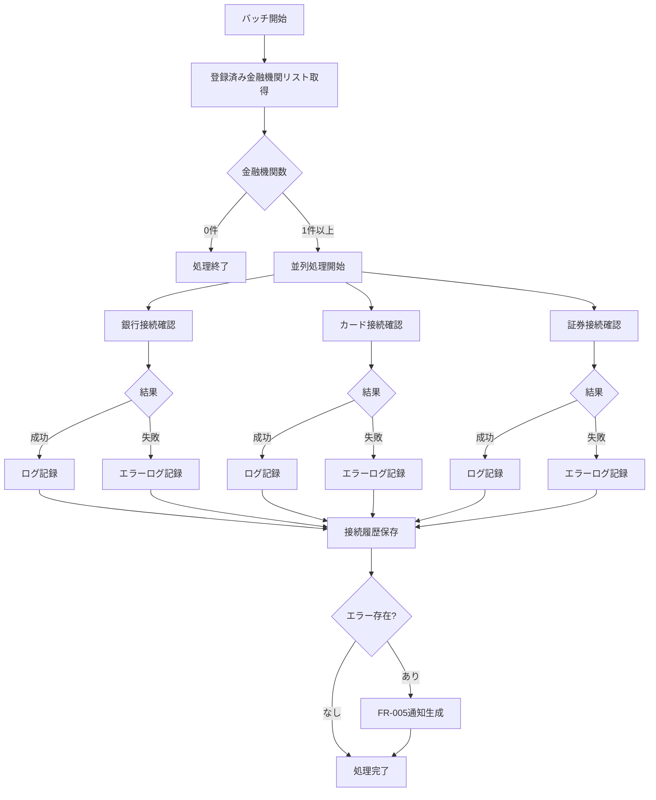
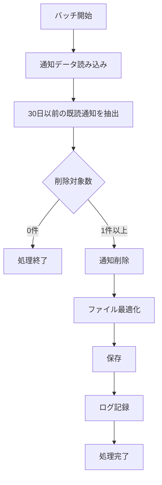

# バッチ処理詳細設計

このドキュメントでは、金融機関連携機能におけるバッチ処理の詳細を記載しています。

## 目次

1. [定期接続確認バッチ (FR-004)](#定期接続確認バッチ-fr-004)
2. [通知クリーンアップバッチ (FR-005)](#通知クリーンアップバッチ-fr-005)
3. [バッチスケジューリング](#バッチスケジューリング)
4. [エラーハンドリング](#エラーハンドリング)
5. [ログ出力](#ログ出力)
6. [パフォーマンス最適化](#パフォーマンス最適化)

---

## 定期接続確認バッチ (FR-004)

### 概要

登録済みの全金融機関に対して定期的に接続テストを実行し、接続状態を更新するバッチ処理です。

### 実行タイミング

| 実行条件     | タイミング                       | 設定              |
| ------------ | -------------------------------- | ----------------- |
| 定期実行     | 毎日 AM 6:00                     | Cron: `0 6 * * *` |
| 手動実行     | ユーザーが同期ボタン押下         | API経由           |
| アプリ起動時 | アプリ起動時（バックグラウンド） | 自動              |

### 処理フロー



### 詳細仕様

**処理内容:**

1. 登録済み金融機関リスト取得
   - Institution、CreditCard、SecuritiesAccountの全データを取得
2. 各金融機関への接続テスト（並列実行）
   - 最大5件を同時並列処理
   - タイムアウト: 10秒/金融機関
   - リトライ: 3回（間隔: 5秒）
3. ステータス更新
   - 接続成功: `isConnected = true`, `status = CONNECTED`
   - 接続失敗: `isConnected = false`, `status = DISCONNECTED`
   - 認証エラー: `isConnected = false`, `status = NEED_REAUTH`
4. 接続履歴を保存
   - `data/health/connection-history.json` に追記
   - 保持期間: 90日間
5. エラー時の通知生成 (FR-005)
   - 認証エラー → 優先度: 高（モーダル通知）
   - その他エラー → 優先度: 中（トースト通知）
   - 複数失敗 → 優先度: 高（モーダル通知）

**パフォーマンス要件:**

| 項目         | 要件               |
| ------------ | ------------------ |
| 処理時間     | 最大5秒/金融機関   |
| タイムアウト | 10秒/金融機関      |
| 並列実行数   | 最大5件同時        |
| UIブロック   | なし（非同期処理） |

**実装例:**

```typescript
@Cron('0 6 * * *')
async executeScheduledConnectionCheck(): Promise<void> {
  this.logger.log('定期接続確認バッチ開始');

  try {
    const results = await this.checkConnectionStatusUseCase.execute();

    // エラーがある場合は通知
    const errors = results.filter(r => r.hasError());
    if (errors.length > 0) {
      await this.notificationService.notifyConnectionFailures(errors);
    }

    this.logger.log(`定期接続確認バッチ完了: ${results.length}件処理`);
  } catch (error) {
    this.logger.error('定期接続確認バッチでエラー発生', error);
  }
}
```

---

## 通知クリーンアップバッチ (FR-005)

### 概要

古い通知データを定期的に削除し、通知ファイルを最適化するバッチ処理です。

### 実行タイミング

| 実行条件 | タイミング   | 設定              |
| -------- | ------------ | ----------------- |
| 定期実行 | 毎日 AM 3:00 | Cron: `0 3 * * *` |

### 処理フロー



### 詳細仕様

**処理内容:**

1. 通知データ読み込み
   - `data/notifications/notifications.json` を読み込み
2. 削除対象の抽出
   - ユーザー確認済み・アーカイブ: 30日以前に作成された通知
   - 却下: 7日以前に作成された通知
3. 通知削除
   - 削除対象を配列から除外
4. ファイル最適化
   - JSON形式を整形
   - 不要な空白を削除
5. 保存
   - 最適化されたデータを保存

**削除ルール:**

| 通知ステータス   | 保持期間 | 削除条件         |
| ---------------- | -------- | ---------------- |
| 未表示           | 永続     | 削除しない       |
| 表示中           | 永続     | 削除しない       |
| 後で確認         | 永続     | 削除しない       |
| ユーザー確認済み | 30日     | 30日経過後に削除 |
| 却下             | 7日      | 7日経過後に削除  |
| アーカイブ       | 30日     | 30日経過後に削除 |

**保持期間の設計意図:**

- **却下（7日）**: ユーザーが明示的に重要でないと判断したため、短期間で削除
- **確認済み/アーカイブ（30日）**: 問題が解決済みだが、一定期間は履歴として保持
- **その他**: ユーザーのアクションを待つため永続保持

**実装例:**

```typescript
@Cron('0 3 * * *')
async executeNotificationCleanup(): Promise<void> {
  this.logger.log('通知クリーンアップバッチ開始');

  try {
    const notifications = await this.notificationRepository.findAll();
    const now = new Date();
    const thirtyDaysAgo = new Date(now.getTime() - 30 * 24 * 60 * 60 * 1000);
    const sevenDaysAgo = new Date(now.getTime() - 7 * 24 * 60 * 60 * 1000);

    // 削除対象を抽出
    const toDelete = notifications.filter(n => {
      // 確認済み・アーカイブは30日後に削除
      if ((n.status === 'confirmed' || n.status === 'archived') && n.createdAt < thirtyDaysAgo) {
        return true;
      }
      // 却下は7日後に削除
      if (n.status === 'dismissed' && n.createdAt < sevenDaysAgo) {
        return true;
      }
      return false;
    });

    // 削除実行
    for (const notification of toDelete) {
      await this.notificationRepository.delete(notification.id);
    }

    this.logger.log(`通知クリーンアップバッチ完了: ${toDelete.length}件削除`);
  } catch (error) {
    this.logger.error('通知クリーンアップバッチでエラー発生', error);
  }
}
```

---

## バッチスケジューリング

### Cron式の設定

NestJSの`@nestjs/schedule`パッケージを使用してスケジューリングを管理します。

**Cron式の例:**

| 式             | 意味         |
| -------------- | ------------ |
| `0 6 * * *`    | 毎日 6:00 AM |
| `0 3 * * *`    | 毎日 3:00 AM |
| `0 */6 * * *`  | 6時間ごと    |
| `*/30 * * * *` | 30分ごと     |

### スケジュール設定

```typescript
// app.module.ts
import { ScheduleModule } from '@nestjs/schedule';

@Module({
  imports: [
    ScheduleModule.forRoot(),
    // ... その他のモジュール
  ],
})
export class AppModule {}
```

### バッチ実装

```typescript
import { Injectable, Logger } from '@nestjs/common';
import { Cron, CronExpression } from '@nestjs/schedule';

@Injectable()
export class ScheduledConnectionCheckService {
  private readonly logger = new Logger(ScheduledConnectionCheckService.name);

  constructor(
    private readonly checkConnectionStatusUseCase: CheckConnectionStatusUseCase,
    private readonly notificationService: NotificationService
  ) {}

  // 定期接続確認: 毎日 6:00 AM
  @Cron('0 6 * * *')
  async handleScheduledConnectionCheck() {
    this.logger.log('定期接続確認バッチ開始');
    await this.execute();
  }

  // 手動実行用
  async execute(): Promise<void> {
    try {
      const results = await this.checkConnectionStatusUseCase.execute();

      const errors = results.filter((r) => r.hasError());
      if (errors.length > 0) {
        await this.notificationService.notifyConnectionFailures(errors);
      }

      this.logger.log(`接続確認完了: ${results.length}件処理`);
    } catch (error) {
      this.logger.error('接続確認でエラー発生', error);
      throw error;
    }
  }
}
```

---

## エラーハンドリング

### エラー分類

| エラー種別          | 対処方法                 |
| ------------------- | ------------------------ |
| API接続タイムアウト | リトライ（最大3回）      |
| 認証エラー          | 通知生成、リトライしない |
| APIレート制限       | 60秒待機後リトライ       |
| ネットワークエラー  | リトライ（最大3回）      |
| データ保存エラー    | ログ記録、管理者通知     |
| 予期しないエラー    | ログ記録、バッチ継続     |

### リトライロジック

```typescript
import { isHttpError } from '@/common/errors/http-error.interface';

async testConnectionWithRetry(
  adapter: BankApiAdapter,
  credentials: EncryptedCredentials,
  maxRetries: number = 3,
): Promise<ConnectionCheckResultVO> {
  let lastError: Error = new Error('Unknown error');

  for (let attempt = 1; attempt <= maxRetries; attempt++) {
    try {
      const result = await Promise.race([
        adapter.testConnection(credentials),
        this.timeout(10000), // 10秒でタイムアウト
      ]);

      return ConnectionCheckResultVO.success(result);
      } catch (error) {
        lastError = error instanceof Error ? error : new Error(String(error));
        this.logger.warn(`接続テスト失敗 (試行${attempt}/${maxRetries})`, error);

        // 認証エラーはリトライしない
        // isHttpError型ガードを使用することで、statusCodeに安全にアクセス可能
        if (isHttpError(error) && (error.statusCode === 401 || error.statusCode === 403)) {
          return ConnectionCheckResultVO.needReauth(error.message);
        }

        // タイムアウトエラーの判定
        const isTimeout = error instanceof Error && error.message === 'Timeout';

        // APIレート制限の場合は60秒待機
        if (isHttpError(error) && error.statusCode === 429) {
          await this.sleep(60000);
          continue;
        }

        // 最後の試行でなければ5秒待機
        if (attempt < maxRetries) {
          await this.sleep(5000);
        }
      }
  }

  return ConnectionCheckResultVO.failure(lastError.message);
}

private async timeout(ms: number): Promise<never> {
  return new Promise((_, reject) =>
    setTimeout(() => reject(new Error('Timeout')), ms)
  );
}

private async sleep(ms: number): Promise<void> {
  return new Promise(resolve => setTimeout(resolve, ms));
}
```

---

## ログ出力

### ログレベル

| レベル | 用途                           |
| ------ | ------------------------------ |
| DEBUG  | 詳細なデバッグ情報             |
| INFO   | 通常の処理ログ                 |
| WARN   | 警告（リトライ、軽微なエラー） |
| ERROR  | エラー（処理失敗）             |

### ログ出力例

```typescript
// バッチ開始
this.logger.log('[Batch] 定期接続確認バッチ開始');

// 処理中
this.logger.debug(`[Bank] ${bank.name} の接続確認開始`);

// 成功
this.logger.log(`[Bank] ${bank.name} 接続成功 (応答時間: ${responseTime}ms)`);

// リトライ
this.logger.warn(`[Bank] ${bank.name} 接続失敗、リトライ中 (試行${attempt}/${maxRetries})`);

// エラー
this.logger.error(`[Bank] ${bank.name} 接続失敗`, error);

// バッチ完了
this.logger.log(`[Batch] 定期接続確認バッチ完了: 成功${successCount}件、失敗${errorCount}件`);
```

### ログファイル

| ログファイル                          | 内容                         | 保持期間 |
| ------------------------------------- | ---------------------------- | -------- |
| `logs/batch-connection-check.log`     | 接続確認バッチログ           | 30日     |
| `logs/batch-notification-cleanup.log` | 通知クリーンアップバッチログ | 30日     |
| `logs/batch-error.log`                | バッチエラーログ             | 90日     |

---

## パフォーマンス最適化

### 並列処理

最大5件の金融機関を同時に並列処理することで、全体の処理時間を短縮します。

```typescript
async checkAllInstitutions(
  institutions: InstitutionEntity[],
): Promise<ConnectionCheckResultVO[]> {
  const BATCH_SIZE = 5;
  const results: ConnectionCheckResultVO[] = [];

  // 5件ずつバッチ処理
  for (let i = 0; i < institutions.length; i += BATCH_SIZE) {
    const batch = institutions.slice(i, i + BATCH_SIZE);

    const batchResults = await Promise.all(
      batch.map(inst => this.checkInstitution(inst))
    );

    results.push(...batchResults);
  }

  return results;
}
```

### メモリ管理

大量のデータを扱う場合、メモリ使用量を最適化します。

```typescript
// ストリーミング処理（大量データ向け）
async processLargeDataset(): Promise<void> {
  const stream = await this.repository.streamAll();

  for await (const institution of stream) {
    await this.checkInstitution(institution);
    // 処理後すぐにメモリ解放
  }
}
```

### キャッシング

頻繁にアクセスされるデータをキャッシュします。

```typescript
@Injectable()
export class ConnectionCheckCache {
  private cache = new Map<string, ConnectionCheckResultVO>();
  private TTL = 5 * 60 * 1000; // 5分

  get(institutionId: string): ConnectionCheckResultVO | null {
    const cached = this.cache.get(institutionId);
    if (!cached) return null;

    // TTL確認
    if (Date.now() - cached.checkedAt.getTime() > this.TTL) {
      this.cache.delete(institutionId);
      return null;
    }

    return cached;
  }

  set(institutionId: string, result: ConnectionCheckResultVO): void {
    this.cache.set(institutionId, result);
  }
}
```

---

## バッチ監視

### ヘルスチェック

バッチ処理の正常性を監視するヘルスチェックエンドポイントを提供します。

```typescript
@Controller('health')
export class HealthCheckController {
  @Get('batch/last-run')
  getLastBatchRun(): {
    lastConnectionCheck: Date;
    lastNotificationCleanup: Date;
    status: string;
  } {
    return {
      lastConnectionCheck: this.getLastConnectionCheckTime(),
      lastNotificationCleanup: this.getLastCleanupTime(),
      status: 'ok',
    };
  }
}
```

### アラート

バッチ処理が失敗した場合、アラートを発報します。

```typescript
private async sendAlert(message: string): Promise<void> {
  // ログ記録
  this.logger.error(`[ALERT] ${message}`);

  // 管理者へメール通知（将来実装）
  // await this.emailService.sendAlert(message);

  // Slackへ通知（将来実装）
  // await this.slackService.sendAlert(message);
}
```

---

## まとめ

このバッチ処理詳細設計書は、金融機関連携機能における定期実行処理の全ての仕様を記載しています。エラーハンドリング、パフォーマンス最適化、ログ出力、監視の方針も明確に定義されており、実装・運用時の指針として活用できます。
