# クラス図

このドキュメントでは、金融機関連携機能のクラス構造を記載しています。

## 目次

1. [Domain層クラス図](#domain層クラス図)
2. [Application層クラス図](#application層クラス図)
3. [Infrastructure層クラス図](#infrastructure層クラス図)
4. [Presentation層クラス図](#presentation層クラス図)
5. [Frontend コンポーネント図](#frontendコンポーネント図)

---

## Domain層クラス図

### Institution Module (FR-001)

```mermaid
classDiagram
    class InstitutionEntity {
        +string id
        +string name
        +InstitutionType type
        +EncryptedCredentials credentials
        +boolean isConnected
        +Date|null lastSyncedAt
        +AccountEntity[] accounts
        +Date createdAt
        +Date updatedAt
        +isBank() boolean
        +isCreditCard() boolean
        +isSecurities() boolean
        +updateConnectionStatus(isConnected) InstitutionEntity
        +updateLastSyncedAt(date) InstitutionEntity
        +updateCredentials(credentials) InstitutionEntity
        +addAccount(account) InstitutionEntity
        +updateAccount(accountId, account) InstitutionEntity
        +removeAccount(accountId) InstitutionEntity
        +toJSON() InstitutionJSONResponse
    }

    note right of InstitutionEntity
        toJSON()の返り値型は
        input-output-design.mdで
        定義されているレスポンスモデル
    end note

    class AccountEntity {
        +string id
        +string accountNumber
        +string accountName
        +string accountType
        +number balance
        +number availableBalance
        +Date createdAt
        +Date updatedAt
        +updateBalance(balance) AccountEntity
        +toJSON() AccountJSONResponse
    }

    class EncryptedCredentials {
        -string encryptedData
        -string iv
        +encrypt(data) EncryptedCredentials
        +decrypt() object
        +toJSON() object
    }

    class InstitutionType {
        <<enumeration>>
        BANK
        CREDIT_CARD
        SECURITIES
    }

    class InstitutionRepositoryInterface {
        <<interface>>
        +save(institution) Promise~InstitutionEntity~
        +findById(id) Promise~InstitutionEntity|null~
        +findAll() Promise~InstitutionEntity[]~
        +update(institution) Promise~InstitutionEntity~
        +delete(id) Promise~void~
    }

    InstitutionEntity --> InstitutionType
    InstitutionEntity --> EncryptedCredentials
    InstitutionEntity "1" *-- "many" AccountEntity
    InstitutionRepositoryInterface ..> InstitutionEntity
```

### Credit Card Module (FR-002)

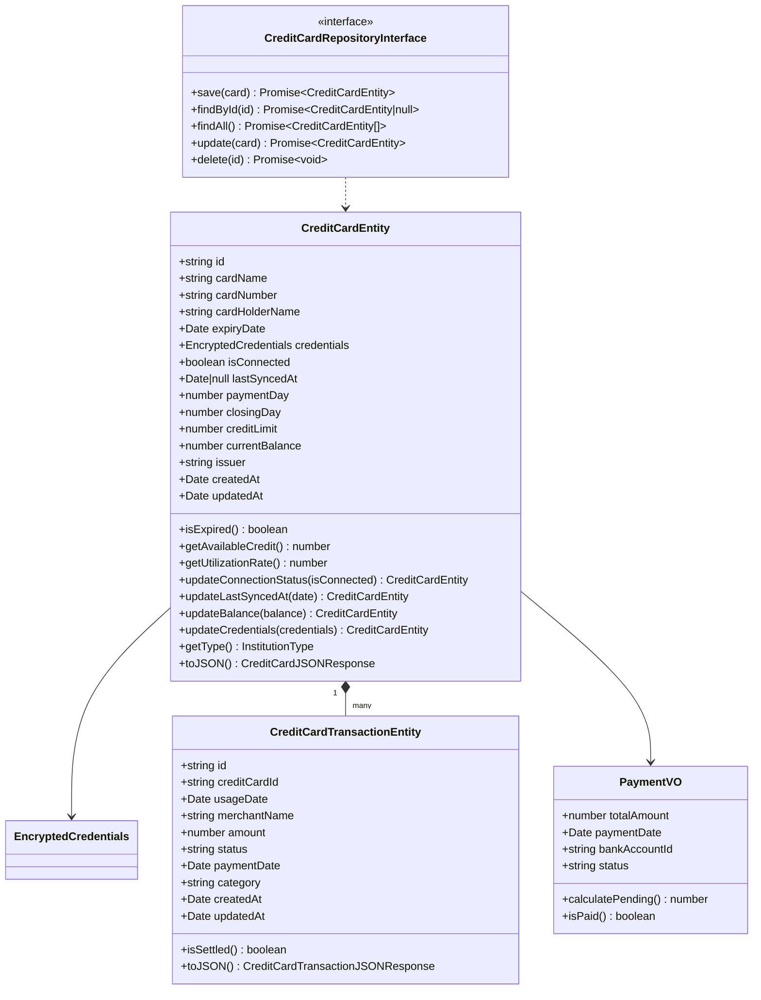

### Securities Module (FR-003)

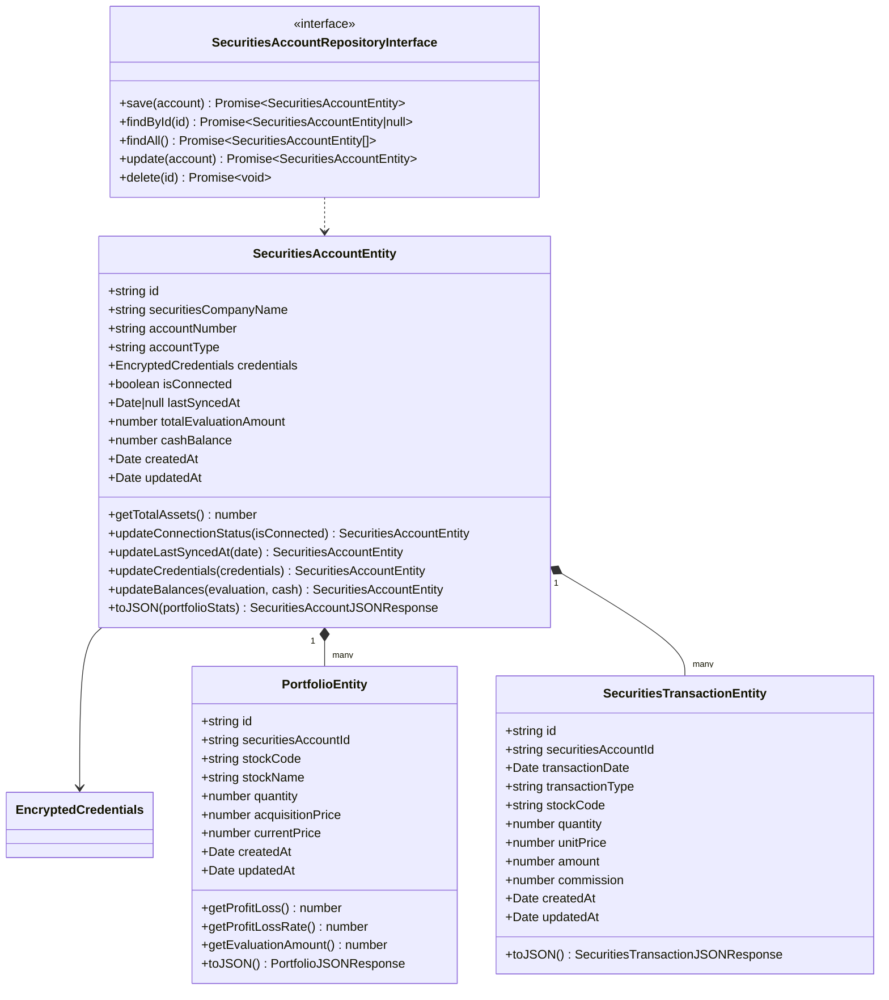

### Health Module (FR-004, FR-005)

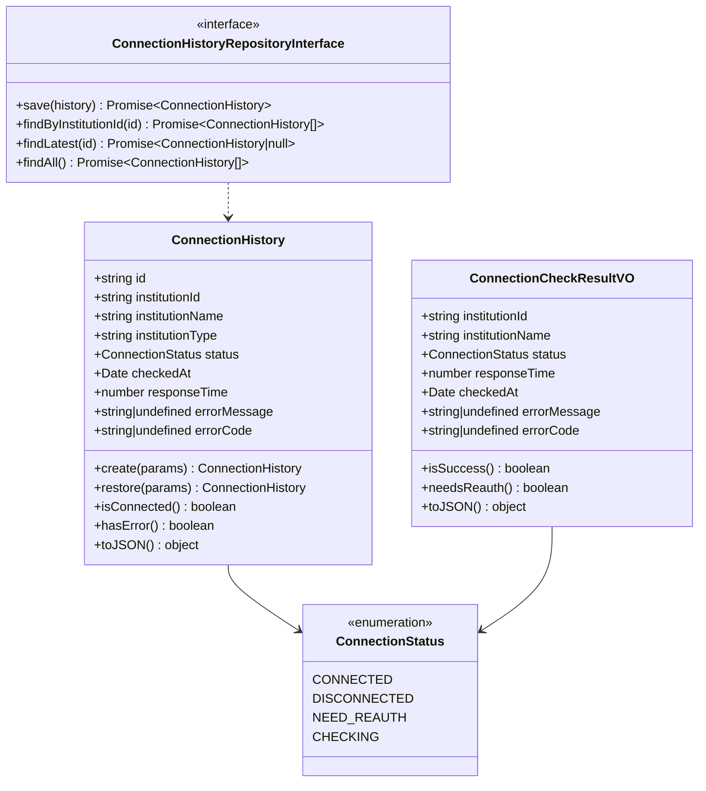

---

## Application層クラス図

### Use Cases (FR-001 ~ FR-005)

```mermaid
classDiagram
    class ConnectInstitutionUseCase {
        -IInstitutionRepository repository
        -IBankApiAdapter bankApi
        -ICryptoService encryption
        +execute(dto) Promise~InstitutionEntity~
    }

    class ConnectCreditCardUseCase {
        -ICreditCardRepository repository
        -ICreditCardApiAdapter cardApi
        -ICryptoService encryption
        +execute(dto) Promise~CreditCardEntity~
    }

    class ConnectSecuritiesAccountUseCase {
        -ISecuritiesAccountRepository repository
        -ISecuritiesApiAdapter securitiesApi
        -ICryptoService encryption
        +execute(dto) Promise~SecuritiesAccountEntity~
    }

    class CheckConnectionStatusUseCase {
        -ConnectionCheckerService checker
        -IConnectionHistoryRepository historyRepo
        +execute(command, institutions) Promise~ConnectionStatusResult[]~
    }

    class ScheduledConnectionCheckUseCase {
        -CheckConnectionStatusUseCase checkUseCase
        -NotificationService notification
        +execute() Promise~void~
    }

    class GetConnectionHistoryUseCase {
        -ConnectionHistoryRepository repository
        +execute(institutionId) Promise~ConnectionHistory[]~
    }

    class InstitutionAggregationService {
        -InstitutionRepository institutionRepo
        -CreditCardRepository creditCardRepo
        -SecuritiesAccountRepository securitiesRepo
        +getAllInstitutions() Promise~AllInstitutions~
    }

    ConnectInstitutionUseCase --> InstitutionRepositoryInterface
    ConnectCreditCardUseCase --> CreditCardRepositoryInterface
    ConnectSecuritiesAccountUseCase --> SecuritiesAccountRepositoryInterface
    CheckConnectionStatusUseCase --> ConnectionHistoryRepositoryInterface
    ScheduledConnectionCheckUseCase --> CheckConnectionStatusUseCase
    GetConnectionHistoryUseCase --> ConnectionHistoryRepositoryInterface
```

---

## Infrastructure層クラス図

### Repository Implementations

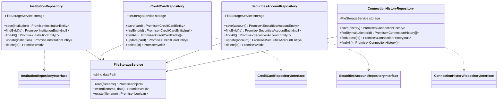

### API Adapters

```mermaid
classDiagram
    class BankApiAdapterInterface {
        <<interface>>
        +testConnection(credentials) Promise~boolean~
        +fetchAccounts(credentials) Promise~Account[]~
    }

    class MockBankApiAdapter {
        +testConnection(credentials) Promise~boolean~
        +fetchAccounts(credentials) Promise~Account[]~
    }

    class CreditCardApiAdapterInterface {
        <<interface>>
        +testConnection(credentials) Promise~boolean~
        +fetchTransactions(credentials, from, to) Promise~Transaction[]~
        +fetchPaymentInfo(credentials) Promise~PaymentInfo~
    }

    class MockCreditCardApiAdapter {
        +testConnection(credentials) Promise~boolean~
        +fetchTransactions(credentials, from, to) Promise~Transaction[]~
        +fetchPaymentInfo(credentials) Promise~PaymentInfo~
    }

    class SecuritiesApiAdapterInterface {
        <<interface>>
        +testConnection(credentials) Promise~boolean~
        +fetchPortfolio(credentials) Promise~Portfolio[]~
        +fetchTransactions(credentials, from, to) Promise~Transaction[]~
    }

    class MockSecuritiesApiAdapter {
        +testConnection(credentials) Promise~boolean~
        +fetchPortfolio(credentials) Promise~Portfolio[]~
        +fetchTransactions(credentials, from, to) Promise~Transaction[]~
    }

    class ConnectionCheckerService {
        -BankApiAdapter bankApi
        -CreditCardApiAdapter cardApi
        -SecuritiesApiAdapter securitiesApi
        +checkInstitution(institution) Promise~ConnectionCheckResultVO~
        +checkCreditCard(card) Promise~ConnectionCheckResultVO~
        +checkSecuritiesAccount(account) Promise~ConnectionCheckResultVO~
    }

    MockBankApiAdapter ..> BankApiAdapterInterface
    MockCreditCardApiAdapter ..> CreditCardApiAdapterInterface
    MockSecuritiesApiAdapter ..> SecuritiesApiAdapterInterface

    ConnectionCheckerService --> BankApiAdapterInterface
    ConnectionCheckerService --> CreditCardApiAdapterInterface
    ConnectionCheckerService --> SecuritiesApiAdapterInterface
```

---

## Presentation層クラス図

### Controllers

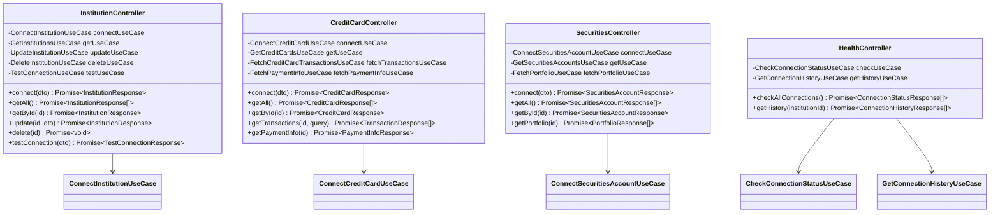

### DTOs

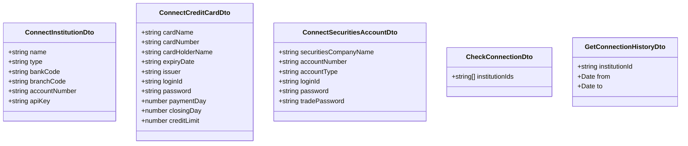

---

## Frontendコンポーネント図

### Component Structure

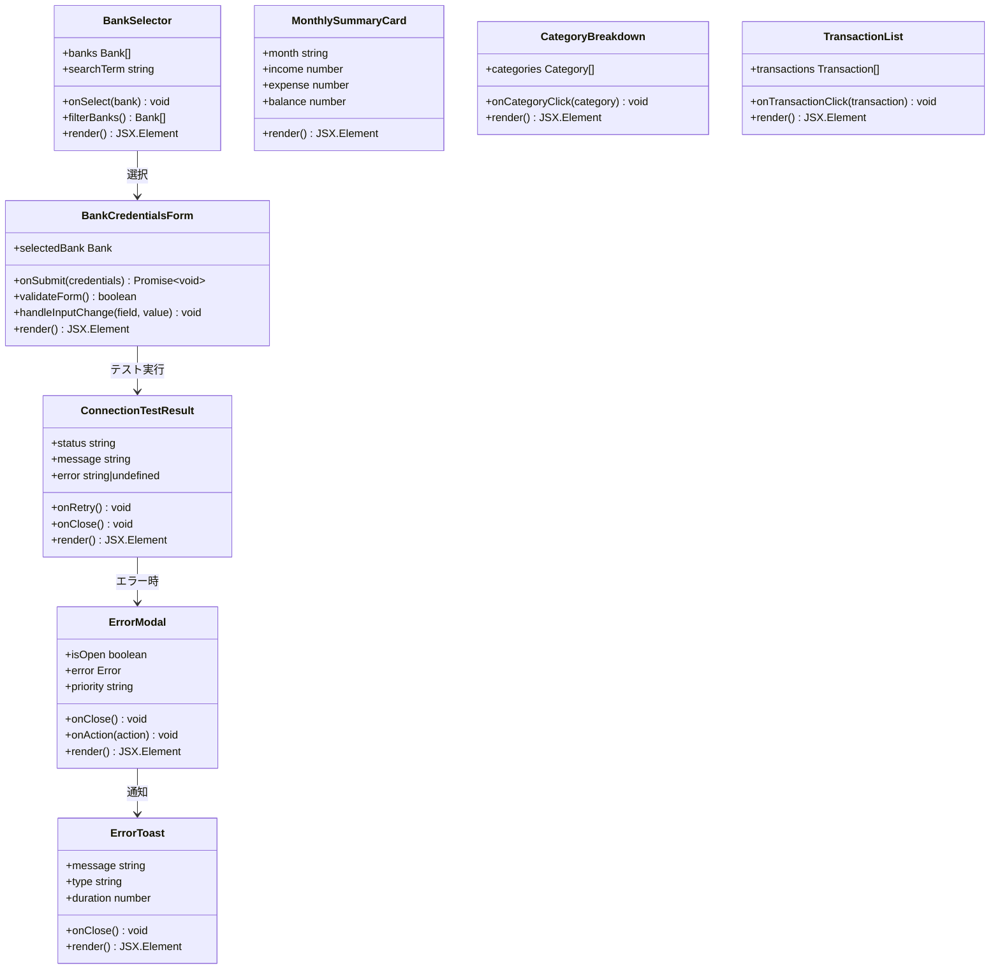

### Store (State Management)

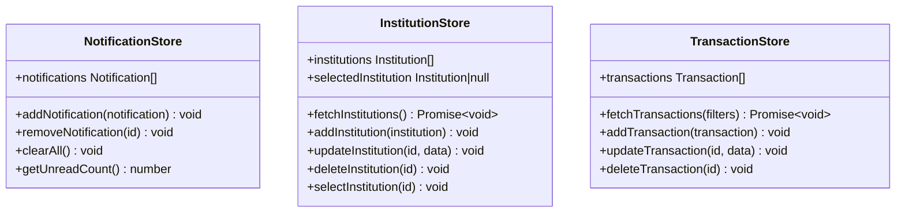

---

## クラス間の関係性

### 依存関係の方向

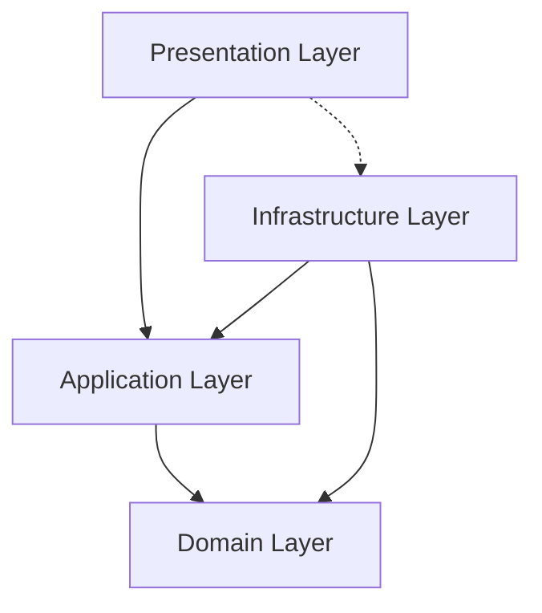

### モジュール間の関連

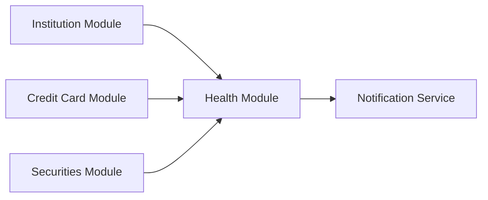

---

## まとめ

このクラス図は、金融機関連携機能における全てのクラスとその関係性を示しています。Onion Architectureに基づき、Domain層を中心に各レイヤが適切に分離されており、保守性と拡張性が確保されています。
