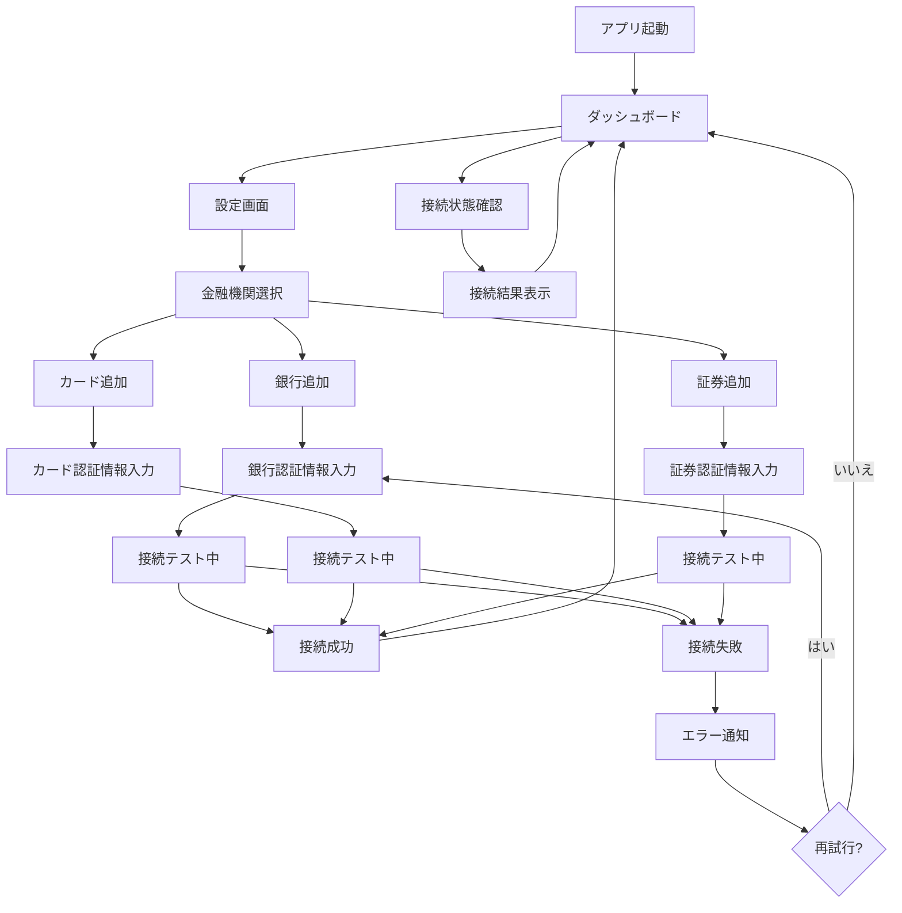
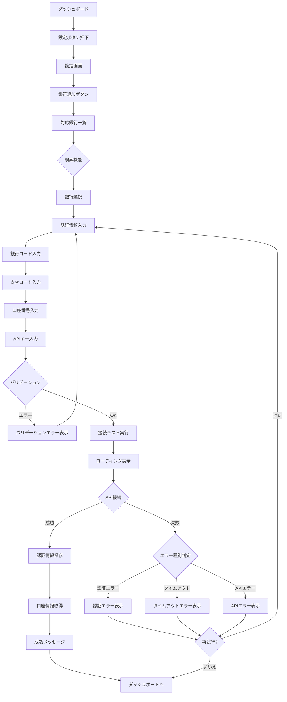
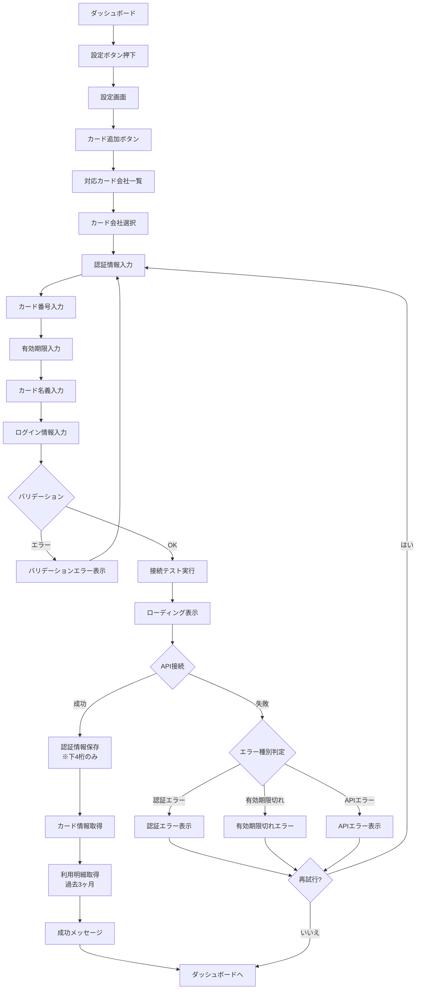
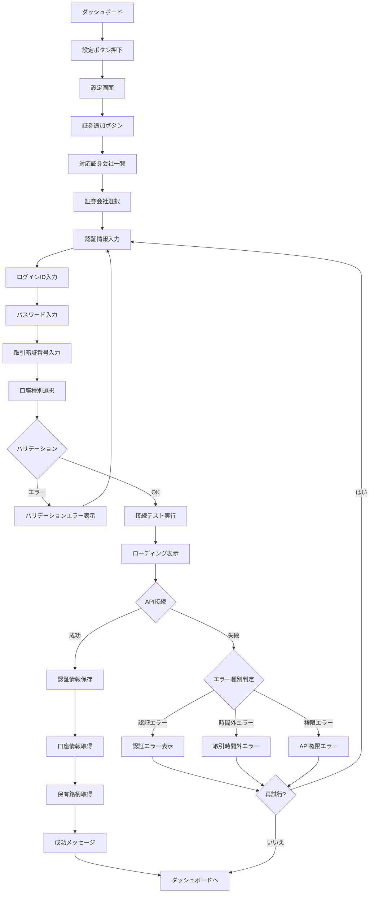
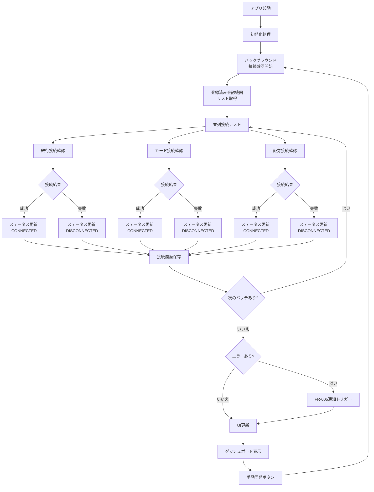
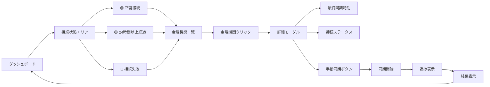
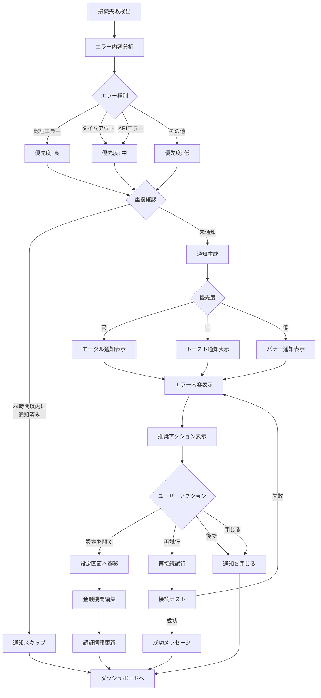
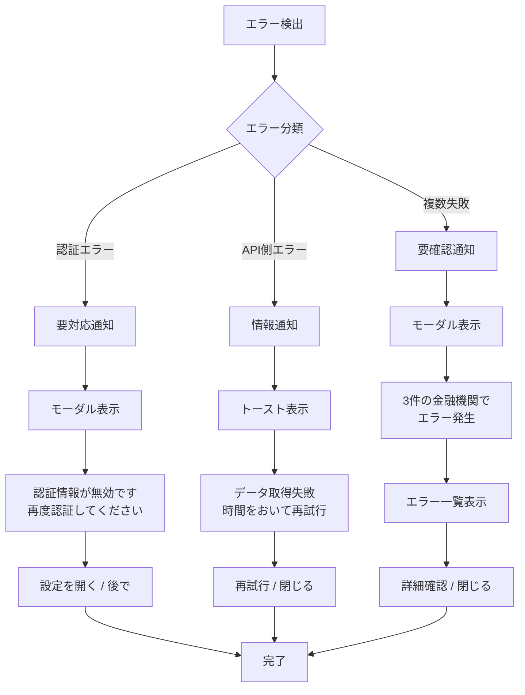

# 画面遷移図

このドキュメントでは、金融機関連携機能の画面遷移フローを記載しています。

## 目次

1. [全体画面遷移図](#全体画面遷移図)
2. [金融機関連携フロー (FR-001, FR-002, FR-003)](#金融機関連携フロー)
3. [接続状態確認フロー (FR-004)](#接続状態確認フロー)
4. [エラー通知フロー (FR-005)](#エラー通知フロー)

---

## 全体画面遷移図

---

## 金融機関連携フロー

### FR-001: 銀行口座との連携

### FR-002: クレジットカードとの連携

### FR-003: 証券会社との連携

---

## 接続状態確認フロー

### FR-004: バックグラウンド接続確認

### ダッシュボード接続状態表示

---

## エラー通知フロー

### FR-005: 接続失敗通知

### エラー通知タイプ別フロー

---

## 画面一覧

### 実装済み画面

| 画面名             | パス             | 説明                   | 機能要件    |
| ------------------ | ---------------- | ---------------------- | ----------- |
| ダッシュボード     | `/dashboard`     | 資産状況・接続状態表示 | FR-004      |
| 銀行追加画面       | `/banks/add`     | 銀行連携フォーム       | FR-001      |
| 設定画面           | `/settings`      | 金融機関管理           | FR-001〜003 |
| エラー通知モーダル | (コンポーネント) | エラー通知表示         | FR-005      |

### コンポーネント一覧

| コンポーネント名     | ファイル                   | 説明           | 機能要件    |
| -------------------- | -------------------------- | -------------- | ----------- |
| BankSelector         | `BankSelector.tsx`         | 銀行選択UI     | FR-001      |
| BankCredentialsForm  | `BankCredentialsForm.tsx`  | 認証情報入力   | FR-001      |
| ConnectionTestResult | `ConnectionTestResult.tsx` | 接続テスト結果 | FR-001〜003 |
| ErrorModal           | `ErrorModal.tsx`           | エラーモーダル | FR-005      |
| ErrorToast           | `ErrorToast.tsx`           | トースト通知   | FR-005      |

---

## 画面遷移のルール

### 一般原則

1. **戻るボタン**: 常に前の画面に戻れること
2. **キャンセル**: 作業中でもキャンセル可能
3. **自動遷移**: 成功時は自動的にダッシュボードへ
4. **エラー遷移**: エラー時は入力画面に留まる

### 状態保持

- 入力途中の情報は保持される (セッションストレージ)
- エラー後の再入力では前回値が復元される
- ページリロード時は入力内容がクリアされる

### アクセス制御

- 未認証ユーザーは設定画面にアクセス不可
- 金融機関追加は設定画面からのみ可能

---

## まとめ

この画面遷移図は、金融機関連携機能における全ての主要な画面フローを網羅しています。ユーザーはダッシュボードを起点として、各金融機関の追加・管理、接続状態確認、エラー通知への対応を行うことができます。
