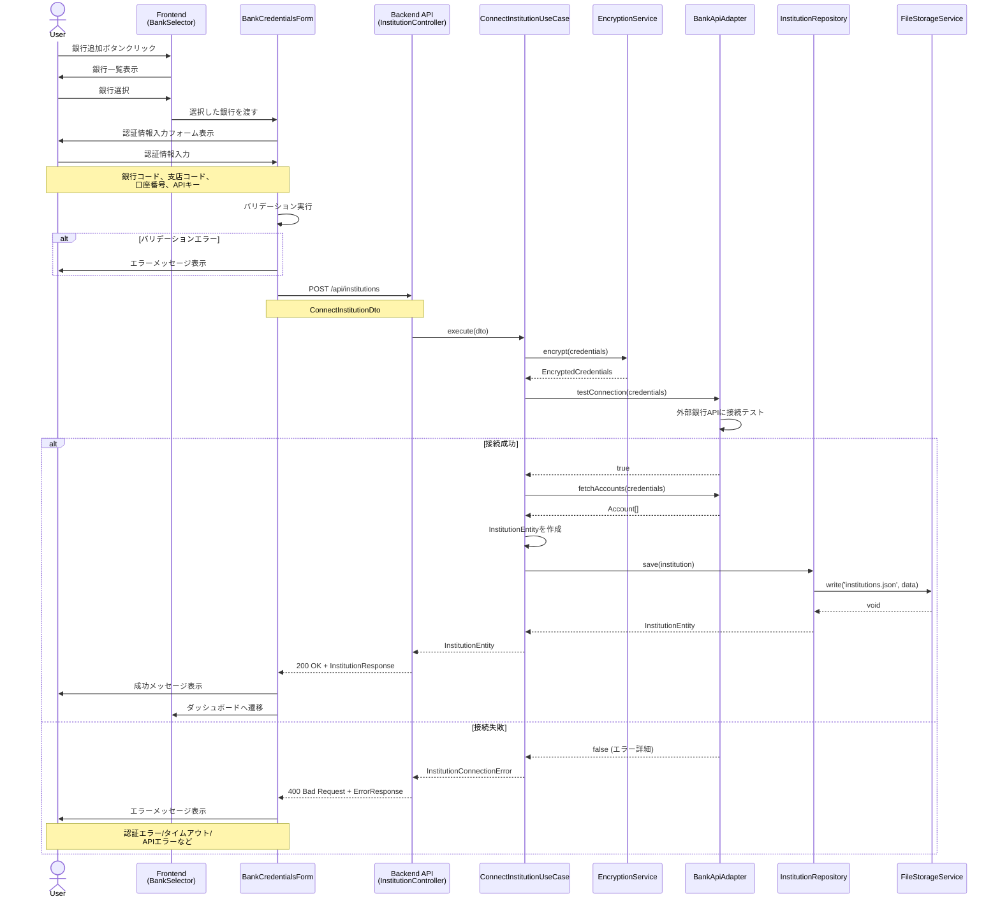
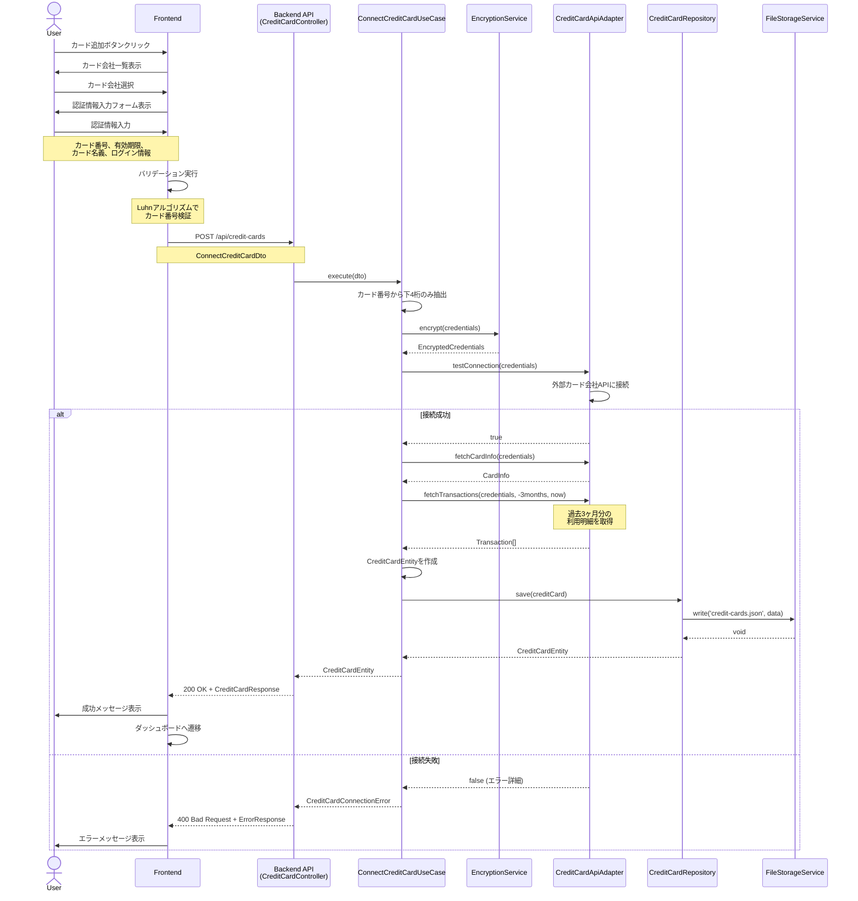
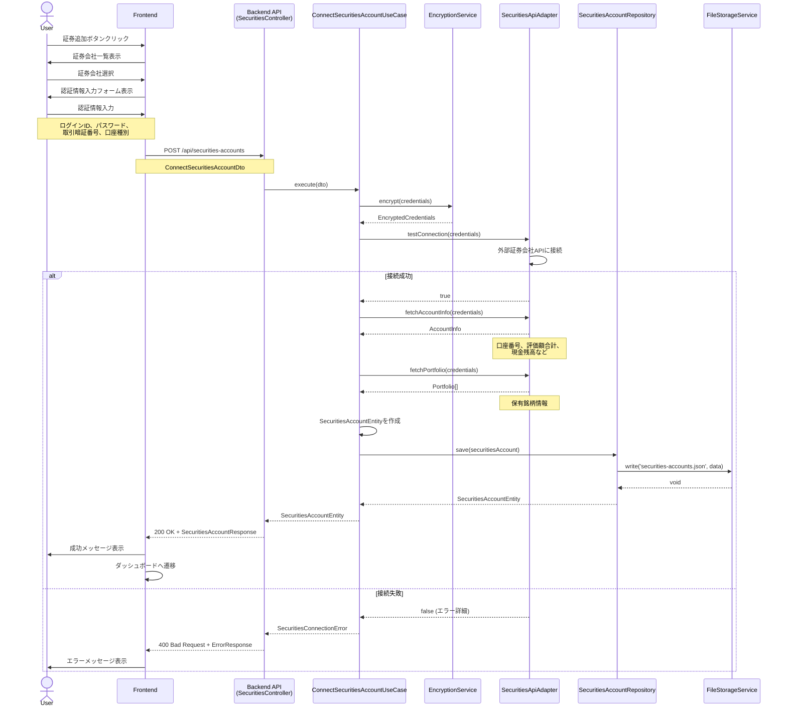
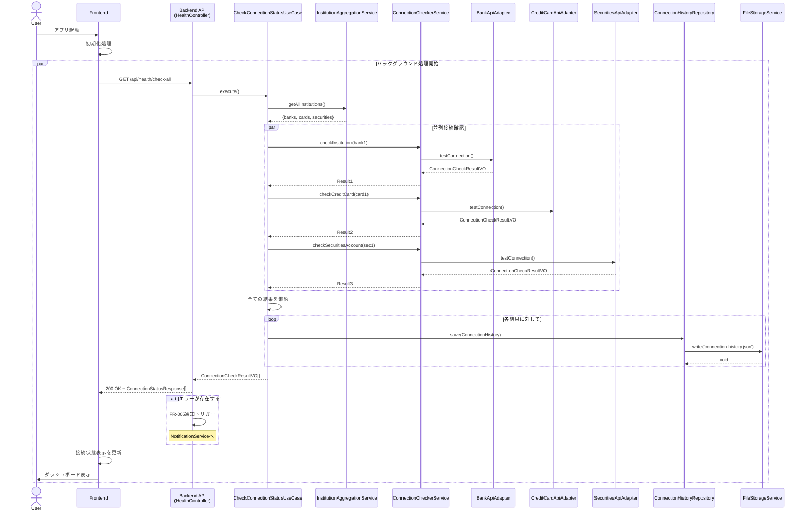
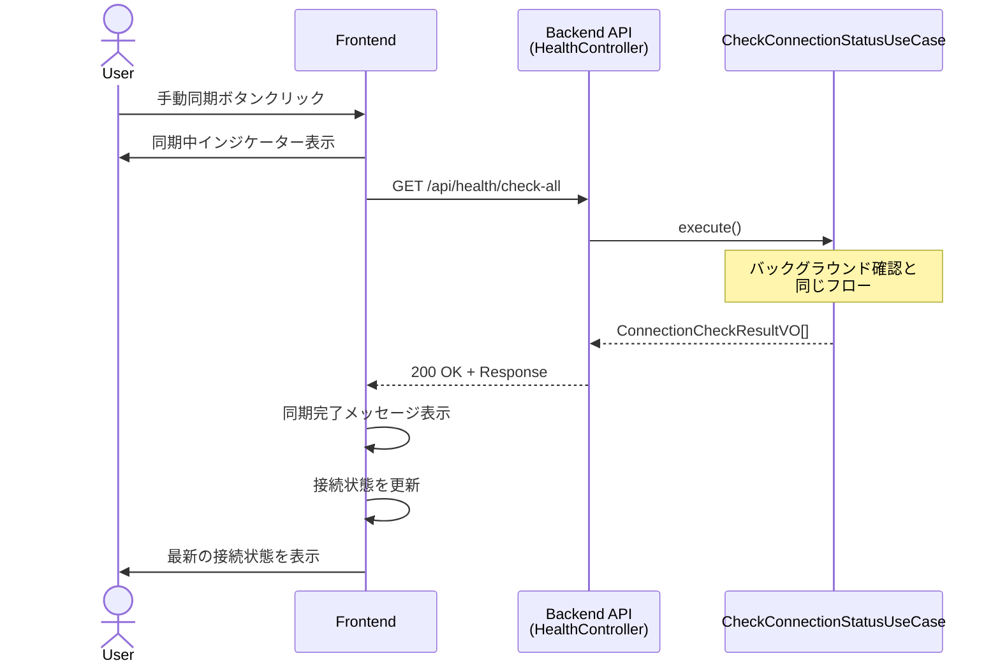
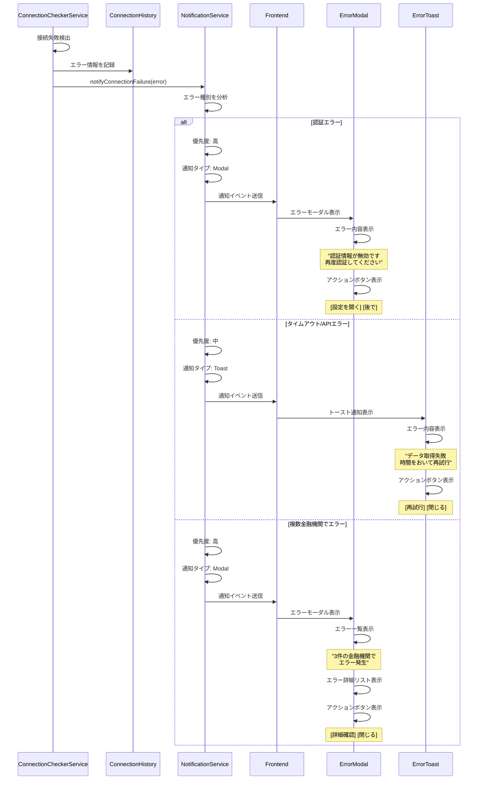
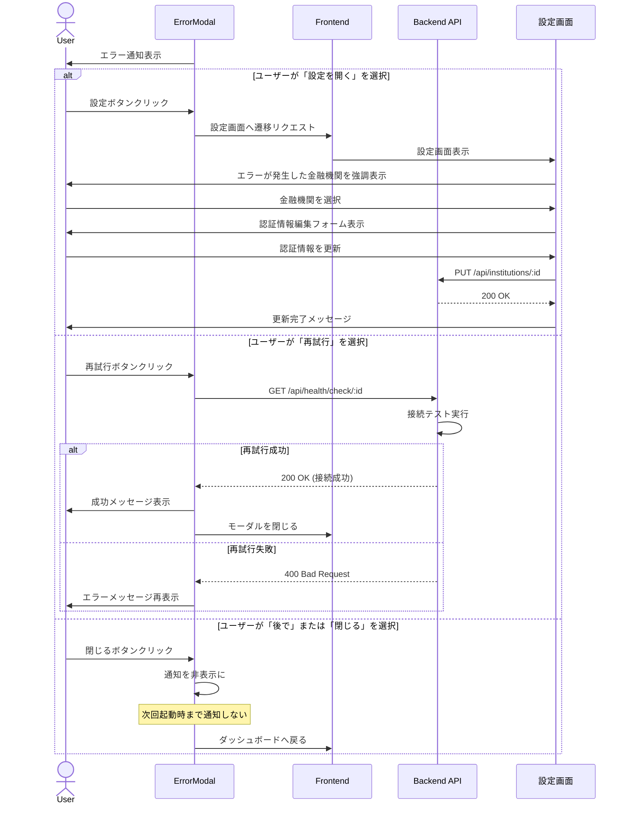
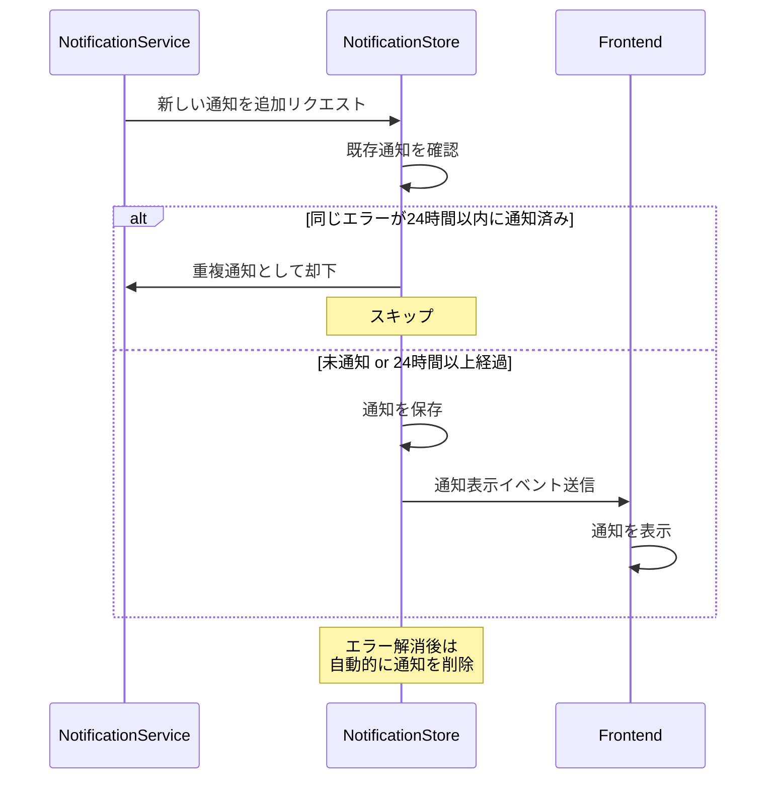
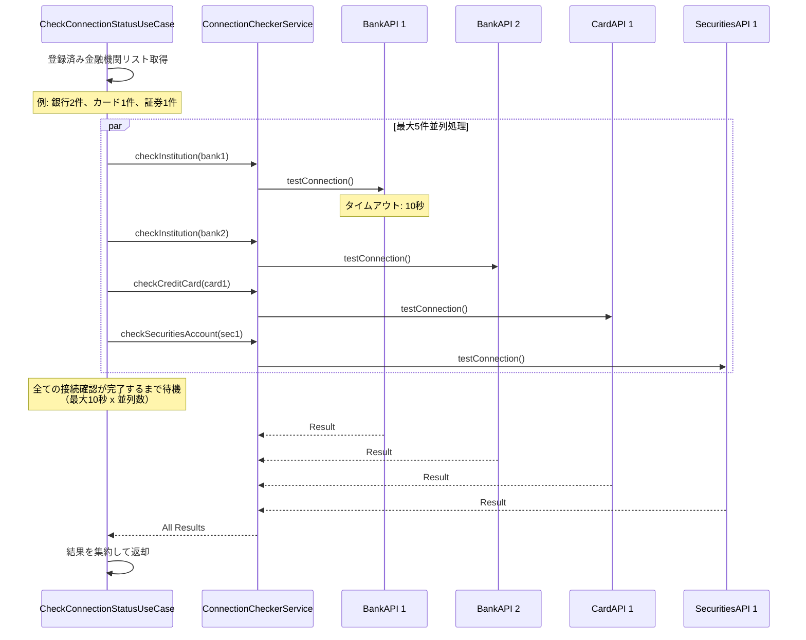
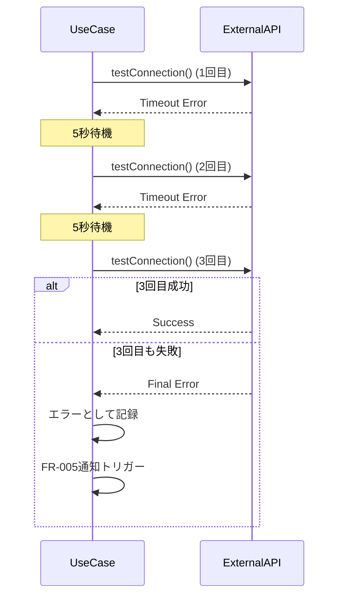

# シーケンス図

このドキュメントでは、金融機関連携機能の主要な処理フローをシーケンス図で記載しています。

## 目次

1. [金融機関連携フロー (FR-001)](#金融機関連携フロー-fr-001)
2. [クレジットカード連携フロー (FR-002)](#クレジットカード連携フロー-fr-002)
3. [証券会社連携フロー (FR-003)](#証券会社連携フロー-fr-003)
4. [バックグラウンド接続確認フロー (FR-004)](#バックグラウンド接続確認フロー-fr-004)
5. [接続失敗通知フロー (FR-005)](#接続失敗通知フロー-fr-005)

---

## 金融機関連携フロー (FR-001)

### 銀行口座連携

---

## クレジットカード連携フロー (FR-002)

### クレジットカード連携と利用明細取得

---

## 証券会社連携フロー (FR-003)

### 証券口座連携と保有銘柄取得

---

## バックグラウンド接続確認フロー (FR-004)

### アプリ起動時の接続確認

### 手動同期

---

## 接続失敗通知フロー (FR-005)

### エラー検出と通知表示

### ユーザーアクション処理

### 通知の重複防止

---

## パフォーマンス最適化

### 並列接続確認の実装

---

## エラーハンドリング

### リトライロジック

---

## まとめ

このシーケンス図は、金融機関連携機能における主要な処理フローを詳細に記載しています。各フローは実際の実装に基づいており、エラーハンドリングやパフォーマンス最適化の方針も明確に示されています。
