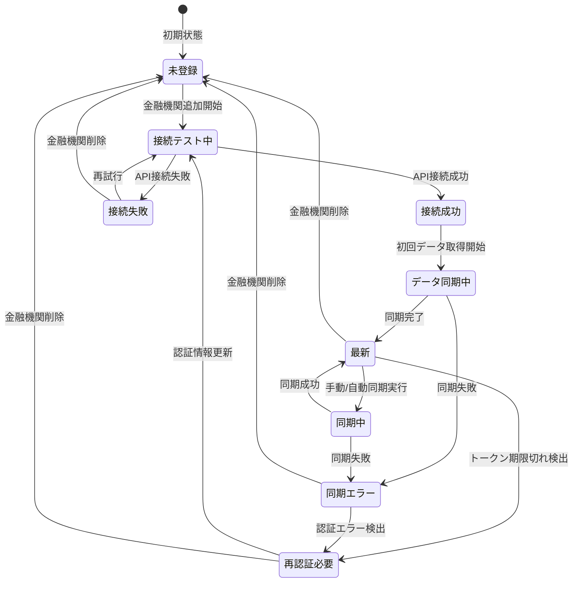
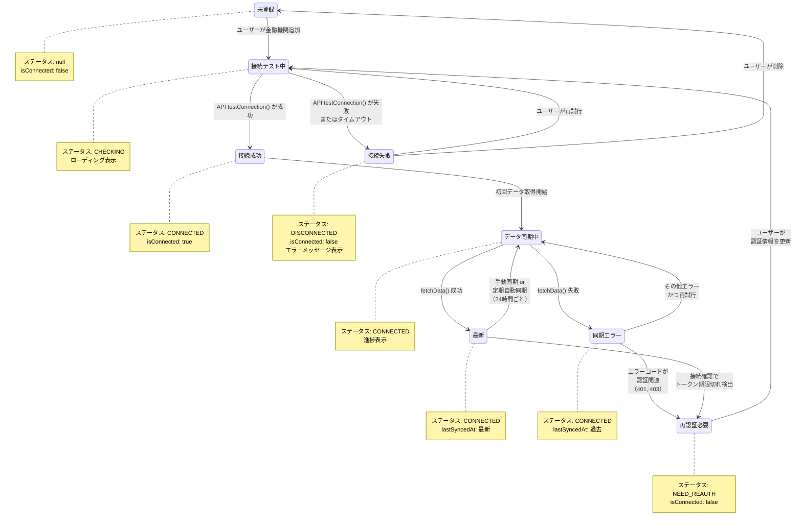
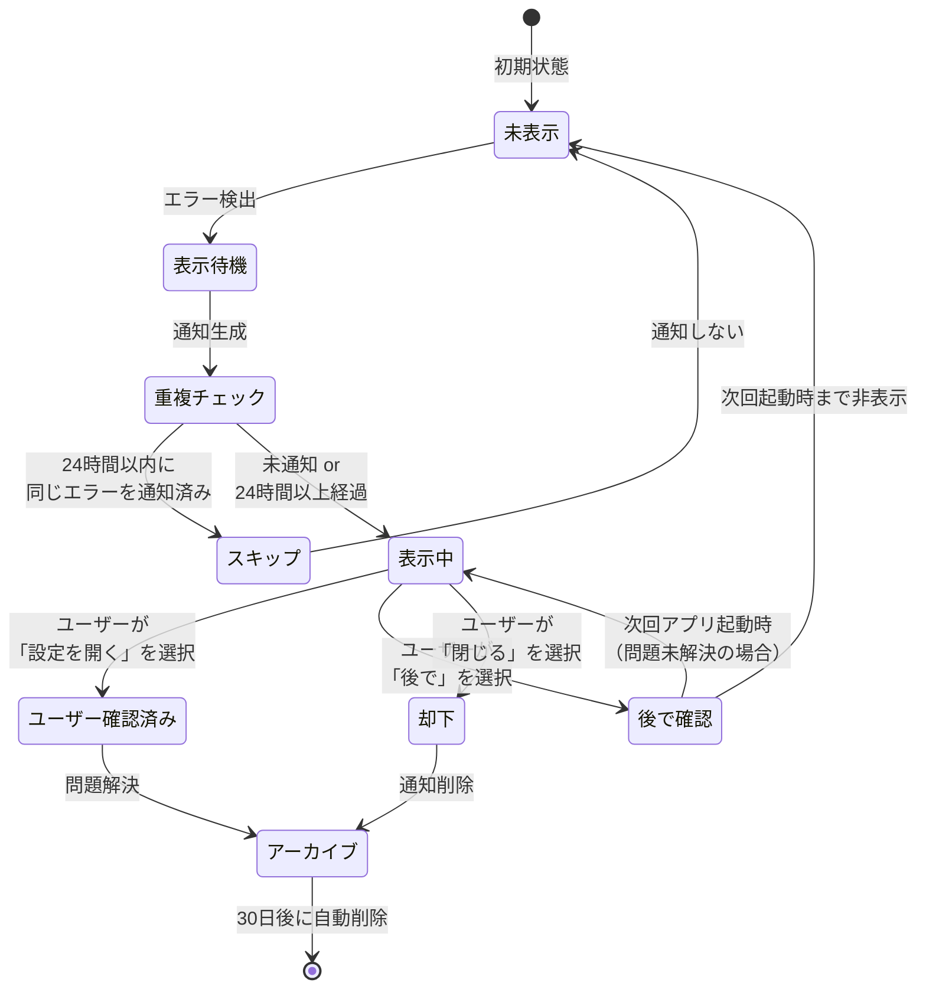
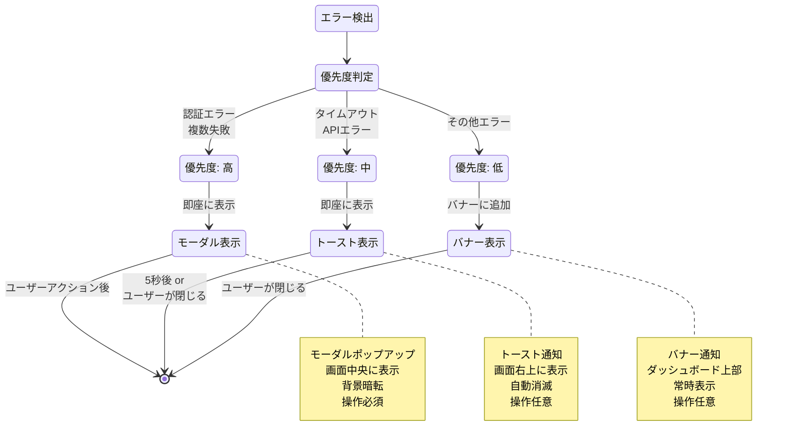
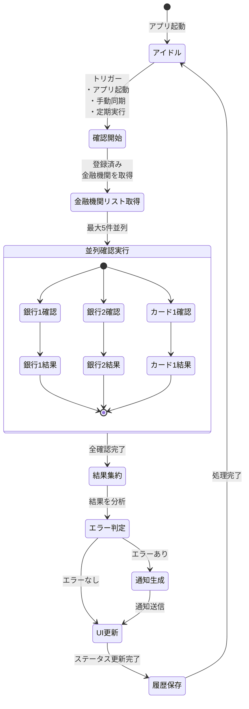
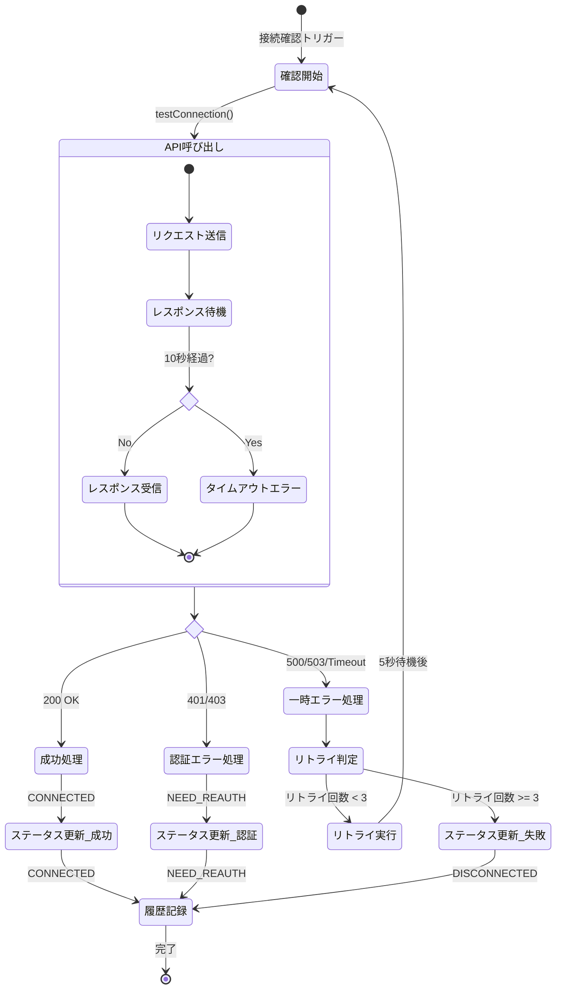
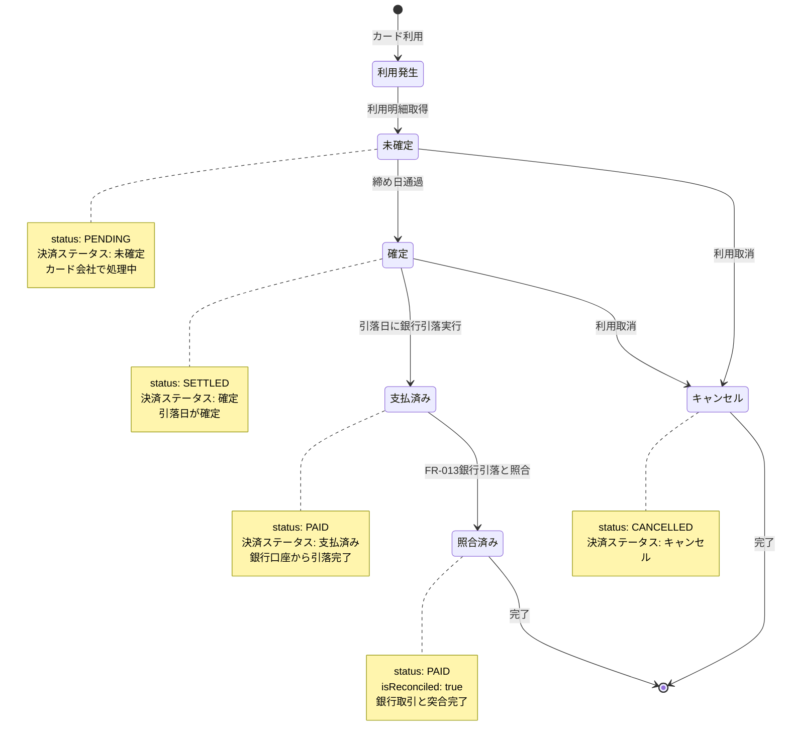
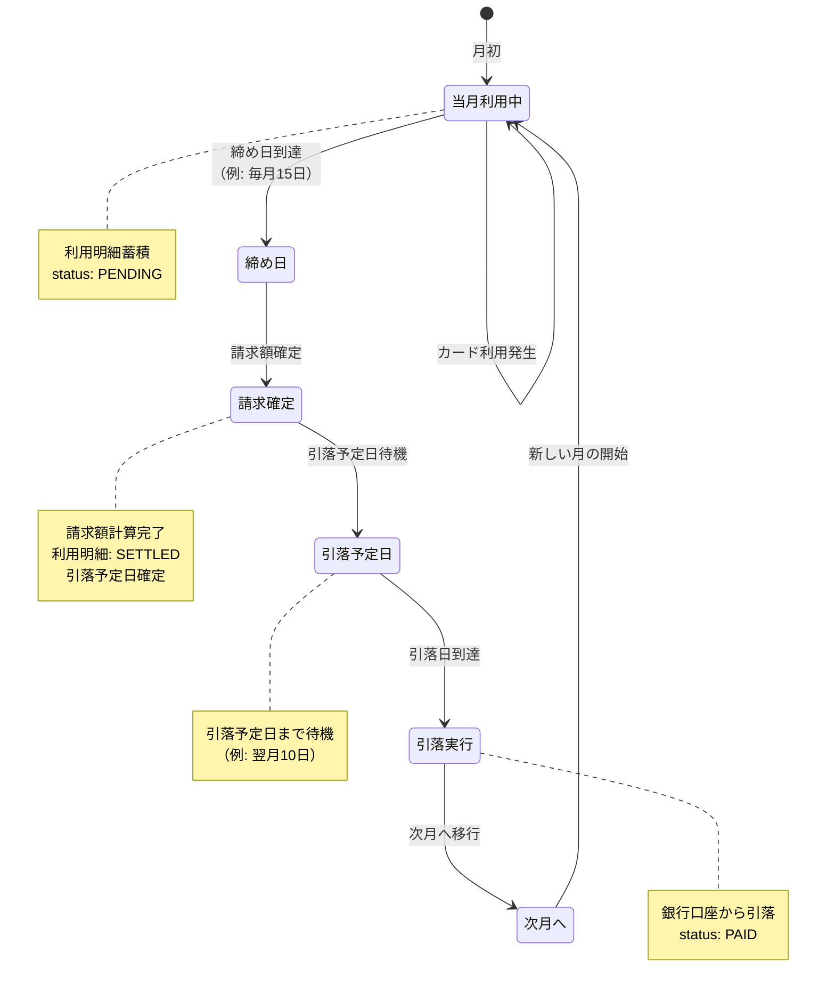

# 状態遷移図

このドキュメントでは、金融機関連携機能における状態遷移を記載しています。

## 目次

1. [金融機関接続状態の遷移](#金融機関接続状態の遷移)
2. [通知状態の遷移](#通知状態の遷移)
3. [接続確認プロセスの状態遷移](#接続確認プロセスの状態遷移)
4. [クレジットカード決済状態の遷移](#クレジットカード決済状態の遷移)

---

## 金融機関接続状態の遷移

### 基本状態遷移

### 詳細状態と遷移条件

### ステータス定義

| ステータス   | 値 (ConnectionStatus) | 説明                           | UI表示       |
| ------------ | --------------------- | ------------------------------ | ------------ |
| 未登録       | -                     | 金融機関が登録されていない状態 | -            |
| 接続テスト中 | `CHECKING`            | API接続テスト実行中            | ローディング |
| 接続成功     | `CONNECTED`           | API接続成功、利用可能          | 🟢 緑        |
| 接続失敗     | `DISCONNECTED`        | API接続失敗                    | 🔴 赤        |
| データ同期中 | `CONNECTED`           | データ取得中                   | 進捗バー     |
| 最新         | `CONNECTED`           | データが最新                   | 🟢 緑        |
| 同期エラー   | `DISCONNECTED`        | データ同期失敗                 | 🔴 赤        |
| 再認証必要   | `NEED_REAUTH`         | 認証情報の再入力が必要         | 🟡 黄        |

---

## 通知状態の遷移

### 通知ライフサイクル

### 通知優先度別の表示フロー

---

## 接続確認プロセスの状態遷移

### バックグラウンド接続確認

### 個別金融機関の確認フロー

---

## クレジットカード決済状態の遷移

### 決済ステータスの遷移 (FR-002, FR-012関連)

### 支払いサイクルの状態遷移

---

## 状態遷移の制約条件

### 金融機関接続状態

| 現在の状態   | 許可される遷移先           | 遷移条件                     |
| ------------ | -------------------------- | ---------------------------- |
| 未登録       | 接続テスト中               | ユーザーが金融機関追加を開始 |
| 接続テスト中 | 接続成功, 接続失敗         | API接続テストの結果          |
| 接続成功     | データ同期中               | 自動的に遷移                 |
| データ同期中 | 最新, 同期エラー           | データ取得の結果             |
| 最新         | 同期中, 再認証必要, 未登録 | 手動同期/自動確認/削除       |
| 同期エラー   | 同期中, 再認証必要, 未登録 | 再試行/認証エラー/削除       |
| 再認証必要   | 接続テスト中, 未登録       | 認証情報更新/削除            |
| 接続失敗     | 接続テスト中, 未登録       | 再試行/削除                  |

### 通知状態

| 現在の状態       | 許可される遷移先                 | 遷移条件           |
| ---------------- | -------------------------------- | ------------------ |
| 未表示           | 表示待機                         | エラー検出         |
| 表示待機         | 重複チェック                     | 自動的に遷移       |
| 重複チェック     | スキップ, 表示中                 | 重複判定の結果     |
| 表示中           | ユーザー確認済み, 後で確認, 却下 | ユーザーアクション |
| ユーザー確認済み | アーカイブ                       | 問題解決           |
| 後で確認         | 未表示, 表示中                   | 時間経過           |
| 却下             | アーカイブ                       | 自動的に遷移       |

### クレジットカード決済

| 現在の状態 | 許可される遷移先     | 遷移条件           |
| ---------- | -------------------- | ------------------ |
| 利用発生   | 未確定               | カード利用明細取得 |
| 未確定     | 確定, キャンセル     | 締め日通過 or 取消 |
| 確定       | 支払済み, キャンセル | 引落実行 or 取消   |
| 支払済み   | 照合済み             | 銀行引落と照合完了 |
| キャンセル | (終了)               | 終了状態           |
| 照合済み   | (終了)               | 終了状態           |

---

## 状態遷移のイベント一覧

### トリガーとなるイベント

| イベント名         | 発生タイミング               | 影響する状態遷移          |
| ------------------ | ---------------------------- | ------------------------- |
| アプリ起動         | ユーザーがアプリを開く       | 接続確認プロセス開始      |
| 金融機関追加       | ユーザーが新規金融機関を追加 | 未登録 → 接続テスト中     |
| API接続テスト成功  | 外部APIとの接続成功          | 接続テスト中 → 接続成功   |
| API接続テスト失敗  | 外部APIとの接続失敗          | 接続テスト中 → 接続失敗   |
| データ同期開始     | 手動 or 自動同期実行         | 最新 → 同期中             |
| データ同期成功     | データ取得完了               | 同期中 → 最新             |
| データ同期失敗     | データ取得失敗               | 同期中 → 同期エラー       |
| 認証エラー検出     | API が401/403を返却          | 任意 → 再認証必要         |
| トークン期限切れ   | 定期確認で検出               | 最新 → 再認証必要         |
| 認証情報更新       | ユーザーが認証情報を再入力   | 再認証必要 → 接続テスト中 |
| 金融機関削除       | ユーザーが削除を実行         | 任意 → 未登録             |
| エラー検出         | 接続確認でエラー             | 未表示 → 表示待機         |
| 通知表示           | エラー内容を分析後           | 表示待機 → 表示中         |
| ユーザーアクション | 通知への操作                 | 表示中 → 各種状態         |
| 締め日到達         | カード締め日                 | 未確定 → 確定             |
| 引落日到達         | カード引落日                 | 確定 → 支払済み           |
| 銀行引落照合       | FR-013処理                   | 支払済み → 照合済み       |

---

## まとめ

この状態遷移図は、金融機関連携機能における全ての状態とその遷移条件を明確に示しています。各状態は明確に定義され、遷移条件も具体的に記載されているため、実装時の指針として活用できます。
