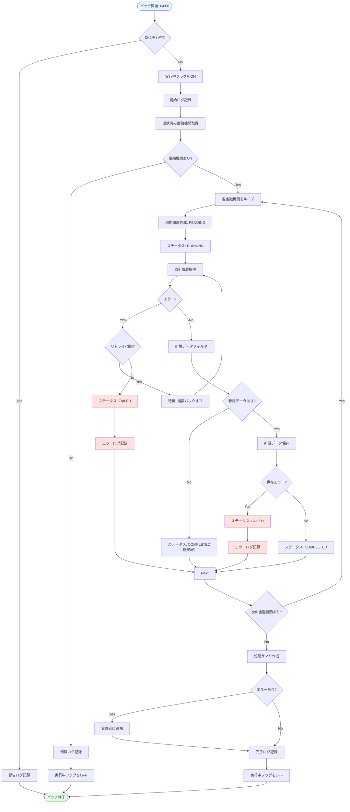
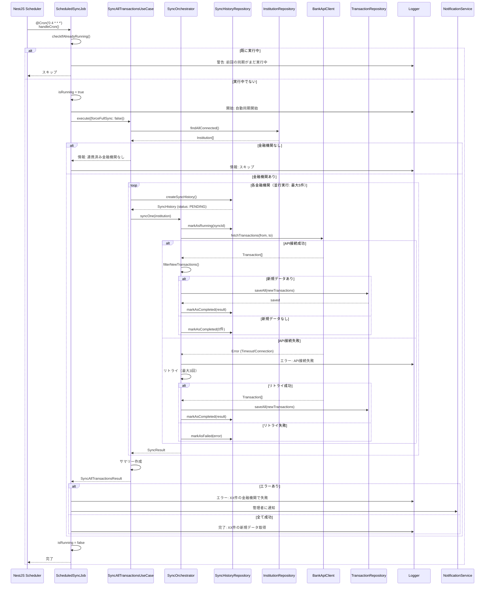

# バッチ処理詳細

このドキュメントでは、利用履歴自動取得機能のバッチ処理（定期実行ジョブ）に関する詳細を記載しています。

## 目次

1. [バッチ処理一覧](#バッチ処理一覧)
2. [バッチ処理の詳細](#バッチ処理の詳細)
3. [スケジュール設定](#スケジュール設定)
4. [エラーハンドリング](#エラーハンドリング)
5. [モニタリングとロギング](#モニタリングとロギング)

---

## バッチ処理一覧

| バッチ名         | 説明                           | 実行頻度 | 実行時刻 | 所要時間(目安) |
| ---------------- | ------------------------------ | -------- | -------- | -------------- |
| ScheduledSyncJob | 全金融機関の取引履歴を自動取得 | 毎日     | 04:00    | 5-15分         |

---

## バッチ処理の詳細

### ScheduledSyncJob: 取引履歴自動同期

#### 概要

**目的**: 連携済みの全金融機関から取引履歴を自動的に取得し、データベースに保存する

**処理内容**:

1. 重複実行チェック（既に実行中の場合はスキップ）
2. 連携済み金融機関リストを取得
3. 各金融機関に対して並行同期処理を実行
4. 差分同期（前回取得日以降のデータのみ取得）
5. 重複チェック（既存データとの照合）
6. 新規データのみをデータベースに保存
7. 同期履歴を記録
8. エラー発生時は通知

**実行頻度**: 毎日 04:00（デフォルト）

**所要時間**: 5-15分（金融機関数とデータ量により変動）

---

#### 処理フロー



---

#### シーケンス図



---

#### 実装クラス

**クラス名**: `ScheduledSyncJob`

**メソッド**:

```typescript
import { Injectable, Logger } from '@nestjs/common';
import { Cron, CronExpression } from '@nestjs/schedule';
import { SyncAllTransactionsUseCase } from '../application/use-cases/sync-all-transactions.use-case';
import { NotificationService } from '../infrastructure/notification/notification.service';

@Injectable()
export class ScheduledSyncJob {
  private readonly logger = new Logger(ScheduledSyncJob.name);
  private isRunning = false;

  constructor(
    private readonly syncAllTransactionsUseCase: SyncAllTransactionsUseCase,
    private readonly notificationService: NotificationService
  ) {}

  /**
   * 毎日午前4時に自動同期を実行
   */
  @Cron('0 4 * * *', {
    name: 'scheduled-sync',
    timeZone: 'Asia/Tokyo',
  })
  async handleCron(): Promise<void> {
    // 重複実行チェック
    if (this.isRunning) {
      this.logger.warn('前回の同期がまだ実行中のため、スキップします');
      return;
    }

    this.isRunning = true;
    const startTime = Date.now();

    try {
      this.logger.log('=== 自動同期開始 ===');

      // 同期実行
      const result = await this.syncAllTransactionsUseCase.execute({
        forceFullSync: false,
      });

      const duration = Date.now() - startTime;
      const durationSec = (duration / 1000).toFixed(2);

      if (result.summary.failureCount === 0) {
        // 全て成功
        this.logger.log(
          `=== 自動同期完了 ===\n` +
            `  対象金融機関: ${result.summary.totalInstitutions}件\n` +
            `  新規データ: ${result.summary.totalNew}件\n` +
            `  重複データ: ${result.summary.totalDuplicate}件\n` +
            `  処理時間: ${durationSec}秒`
        );
      } else {
        // 一部失敗
        this.logger.error(
          `=== 自動同期完了（エラーあり） ===\n` +
            `  対象金融機関: ${result.summary.totalInstitutions}件\n` +
            `  成功: ${result.summary.successCount}件\n` +
            `  失敗: ${result.summary.failureCount}件\n` +
            `  新規データ: ${result.summary.totalNew}件\n` +
            `  処理時間: ${durationSec}秒`
        );

        // 管理者に通知
        await this.notifyAdministrator(result);
      }
    } catch (error) {
      this.logger.error('自動同期中に予期しないエラーが発生しました', error);

      // 管理者に通知
      await this.notificationService.sendAlert({
        level: 'critical',
        title: '自動同期が失敗しました',
        message: error instanceof Error ? error.message : String(error),
      });
    } finally {
      this.isRunning = false;
    }
  }

  /**
   * 管理者に通知
   */
  private async notifyAdministrator(result: SyncAllTransactionsResult): Promise<void> {
    const failedInstitutions = result.histories
      .filter((h) => h.status === 'failed')
      .map((h) => `${h.institutionName}: ${h.errorMessage}`)
      .join('\n');

    await this.notificationService.sendAlert({
      level: 'error',
      title: '自動同期で一部失敗しました',
      message: `以下の金融機関で同期に失敗しました:\n\n${failedInstitutions}`,
      successCount: result.summary.successCount,
      failureCount: result.summary.failureCount,
    });
  }

  /**
   * 現在実行中かどうかを取得（テスト用）
   */
  getIsRunning(): boolean {
    return this.isRunning;
  }
}
```

---

#### データモデル

**対象データ**: 連携済み金融機関（`Institution`）

```typescript
interface Institution {
  id: string;
  name: string;
  type: 'bank' | 'credit-card' | 'securities';
  isConnected: boolean;
  lastSyncedAt?: Date;
}
```

**処理結果**: `SyncAllTransactionsResult`

```typescript
interface SyncAllTransactionsResult {
  success: boolean;
  histories: SyncHistory[];
  summary: {
    totalInstitutions: number;
    successCount: number;
    failureCount: number;
    totalFetched: number;
    totalNew: number;
    totalDuplicate: number;
    duration: number;
  };
}
```

---

#### パフォーマンス最適化

**並行実行制御**:

- 最大5金融機関を同時処理
- `Promise.allSettled` を使用して、1つの失敗が他に影響しないよう保証

```typescript
// SyncOrchestrator内での実装
async syncAll(institutions: Institution[]): Promise<SyncResult[]> {
  const MAX_CONCURRENT = 5;
  const results: SyncResult[] = [];

  // 金融機関を5件ずつに分割
  for (let i = 0; i < institutions.length; i += MAX_CONCURRENT) {
    const batch = institutions.slice(i, i + MAX_CONCURRENT);

    // 並行実行
    const batchResults = await Promise.allSettled(
      batch.map((inst) => this.syncOne(inst))
    );

    // 結果を集約
    for (const result of batchResults) {
      if (result.status === 'fulfilled') {
        results.push(result.value);
      } else {
        this.logger.error('同期失敗', result.reason);
        // 失敗結果も記録
        results.push({
          institutionId: '?',
          status: 'failed',
          error: result.reason,
        });
      }
    }
  }

  return results;
}
```

---

## スケジュール設定

### Cron式

| バッチ名         | Cron式      | 説明          |
| ---------------- | ----------- | ------------- |
| ScheduledSyncJob | `0 4 * * *` | 毎日4時に実行 |

**Cron式の説明**:

```
  ┌──── 分 (0 - 59)
  │ ┌──── 時 (0 - 23)
  │ │ ┌──── 日 (1 - 31)
  │ │ │ ┌──── 月 (1 - 12)
  │ │ │ │ ┌──── 曜日 (0 - 7) (0と7は日曜日)
  │ │ │ │ │
  0 4 * * *
```

### NestJSでの実装

```typescript
import { Injectable } from '@nestjs/common';
import { Cron } from '@nestjs/schedule';

@Injectable()
export class ScheduledSyncJob {
  @Cron('0 4 * * *', {
    name: 'scheduled-sync',
    timeZone: 'Asia/Tokyo',
  })
  async handleCron() {
    // バッチ処理のロジック
  }
}
```

### スケジュール設定の動的更新

```typescript
import { SchedulerRegistry } from '@nestjs/schedule';
import { CronJob } from 'cron';

@Injectable()
export class SyncScheduleService {
  constructor(private schedulerRegistry: SchedulerRegistry) {}

  /**
   * スケジュールを動的に更新
   */
  updateSchedule(cronExpression: string, timezone: string = 'Asia/Tokyo'): void {
    const job = this.schedulerRegistry.getCronJob('scheduled-sync');
    job.stop();

    // 新しいスケジュールで再作成
    const newJob = new CronJob(cronExpression, () => this.handleCron(), null, false, timezone);

    this.schedulerRegistry.deleteCronJob('scheduled-sync');
    this.schedulerRegistry.addCronJob('scheduled-sync', newJob);
    newJob.start();
  }
}
```

### 手動実行API

```typescript
// Controller
@Controller('sync')
export class SyncController {
  constructor(private readonly scheduledSyncJob: ScheduledSyncJob) {}

  /**
   * バッチを手動実行（テスト・デバッグ用）
   */
  @Post('manual-trigger')
  @UseGuards(AdminAuthGuard)
  async manualTrigger() {
    await this.scheduledSyncJob.handleCron();
    return { success: true, message: 'バッチを手動実行しました' };
  }
}
```

---

## エラーハンドリング

### リトライ戦略

**基本方針**:

- **一時的なエラー**: 3回までリトライ
- **恒久的なエラー**: リトライせず、エラーログに記録

**リトライ間隔**（指数バックオフ）:

- 1回目: 即座
- 2回目: 1秒後
- 3回目: 2秒後
- 4回目: 4秒後（最後）

**実装例**:

```typescript
private async syncOneWithRetry(
  institution: Institution,
  maxRetries: number = 3
): Promise<SyncResult> {
  let lastError: Error;
  let attempt = 0;

  while (attempt < maxRetries) {
    attempt++;

    try {
      return await this.syncOne(institution);
    } catch (error) {
      lastError = error;

      // エラー種別を判定
      if (this.isPermanentError(error)) {
        // 恒久的エラーはリトライしない
        this.logger.error(
          `恒久的エラーのためリトライをスキップ: ${institution.name}`,
          error
        );
        throw error;
      }

      this.logger.warn(
        `リトライ ${attempt}/${maxRetries} 失敗: ${institution.name}`,
        error
      );

      // 最後の試行でなければリトライ
      if (attempt < maxRetries) {
        const delay = this.getRetryDelay(attempt);
        await this.sleep(delay);
      }
    }
  }

  // すべてのリトライが失敗
  throw lastError;
}

/**
 * 恒久的エラーかどうかを判定
 */
private isPermanentError(error: any): boolean {
  if (error.statusCode >= 400 && error.statusCode < 500) {
    // 4xxエラーは恒久的（クライアントエラー）
    return true;
  }
  return false;
}

/**
 * リトライ間隔を計算（指数バックオフ）
 */
private getRetryDelay(attempt: number): number {
  return Math.pow(2, attempt - 1) * 1000; // 1秒, 2秒, 4秒...
}

/**
 * 待機
 */
private sleep(ms: number): Promise<void> {
  return new Promise((resolve) => setTimeout(resolve, ms));
}
```

### エラー分類

| エラー種類               | 説明               | リトライ | 通知 |
| ------------------------ | ------------------ | -------- | ---- |
| 一時的ネットワークエラー | タイムアウト等     | ✅ 3回   | ❌   |
| バリデーションエラー     | データ不正         | ❌       | ✅   |
| 外部API エラー (4xx)     | クライアントエラー | ❌       | ✅   |
| 外部API エラー (5xx)     | サーバーエラー     | ✅ 3回   | ✅   |
| データベースエラー       | 接続エラー等       | ✅ 3回   | ✅   |

---

## モニタリングとロギング

### ログレベル

| レベル | 用途       | 例                          |
| ------ | ---------- | --------------------------- |
| INFO   | 正常な処理 | バッチ開始/終了、処理サマリ |
| WARN   | 警告       | リトライ発生、一部失敗      |
| ERROR  | エラー     | 処理失敗、致命的エラー      |

### ログフォーマット

```json
{
  "timestamp": "2025-11-23T04:00:00.000Z",
  "level": "INFO",
  "batch": "ScheduledSyncJob",
  "message": "自動同期完了",
  "context": {
    "totalInstitutions": 10,
    "successCount": 9,
    "failureCount": 1,
    "totalFetched": 1250,
    "totalNew": 1180,
    "totalDuplicate": 70,
    "duration": 12500,
    "successRate": 90.0
  }
}
```

### メトリクス

**収集するメトリクス**:

- 処理件数（金融機関数）
- 成功件数/失敗件数
- 成功率
- 処理時間
- 新規データ件数
- 重複データ件数

**実装例**:

```typescript
export class SyncMetrics {
  private metrics = {
    totalExecutions: 0,
    successExecutions: 0,
    failureExecutions: 0,
    averageDuration: 0,
    totalNewRecords: 0,
  };

  recordExecution(result: SyncAllTransactionsResult, duration: number): void {
    this.metrics.totalExecutions++;

    if (result.summary.failureCount === 0) {
      this.metrics.successExecutions++;
    } else {
      this.metrics.failureExecutions++;
    }

    // 移動平均で計算
    this.metrics.averageDuration =
      (this.metrics.averageDuration * (this.metrics.totalExecutions - 1) + duration) /
      this.metrics.totalExecutions;

    this.metrics.totalNewRecords += result.summary.totalNew;
  }

  getMetrics() {
    const total = this.metrics.totalExecutions;
    return {
      ...this.metrics,
      successRate: total > 0 ? (this.metrics.successExecutions / total) * 100 : 0,
    };
  }
}
```

### アラート条件

| 条件                          | アラートレベル | 通知先              |
| ----------------------------- | -------------- | ------------------- |
| 成功率 < 95%                  | WARNING        | 開発チーム          |
| 成功率 < 80%                  | ERROR          | 開発チーム + 管理者 |
| バッチ失敗（全金融機関）      | CRITICAL       | 開発チーム + 管理者 |
| 処理時間 > 30分               | WARNING        | 開発チーム          |
| 新規データ件数 = 0（3日連続） | WARNING        | 開発チーム          |

---

## チェックリスト

バッチ処理詳細作成時の確認事項：

### 基本項目

- [x] バッチ処理の目的が明確
- [x] 処理フローが記載されている
- [x] スケジュール設定が明確
- [x] 実行頻度と所要時間が記載されている

### 実装

- [x] エラーハンドリングが適切
- [x] リトライ戦略が定義されている
- [x] パフォーマンス最適化が考慮されている
- [x] 重複実行防止機構が実装されている

### 運用

- [x] ロギング戦略が明確
- [x] モニタリング項目が定義されている
- [x] アラート条件が定義されている
- [x] 手動実行方法が提供されている
