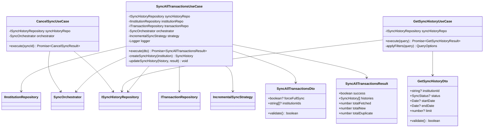
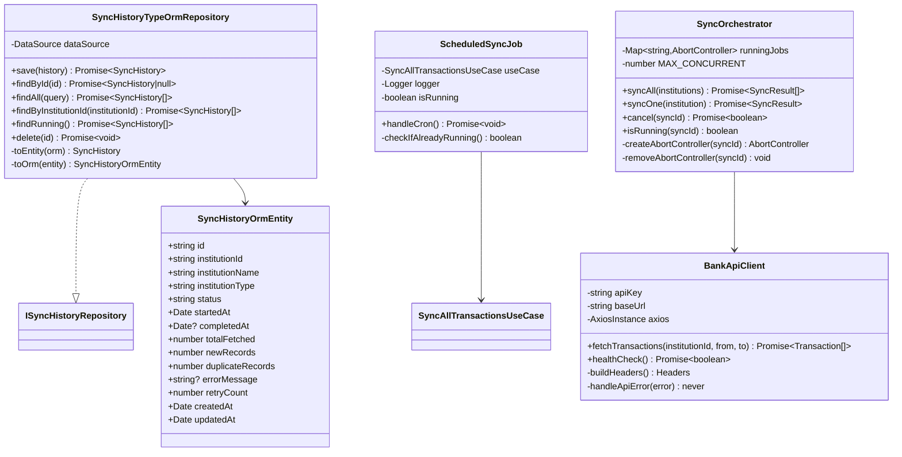
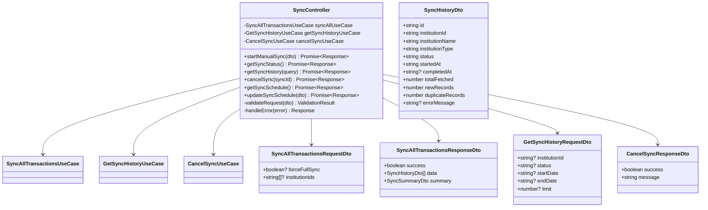
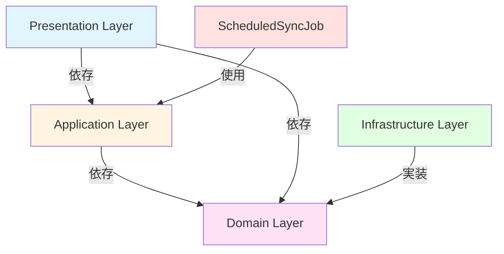
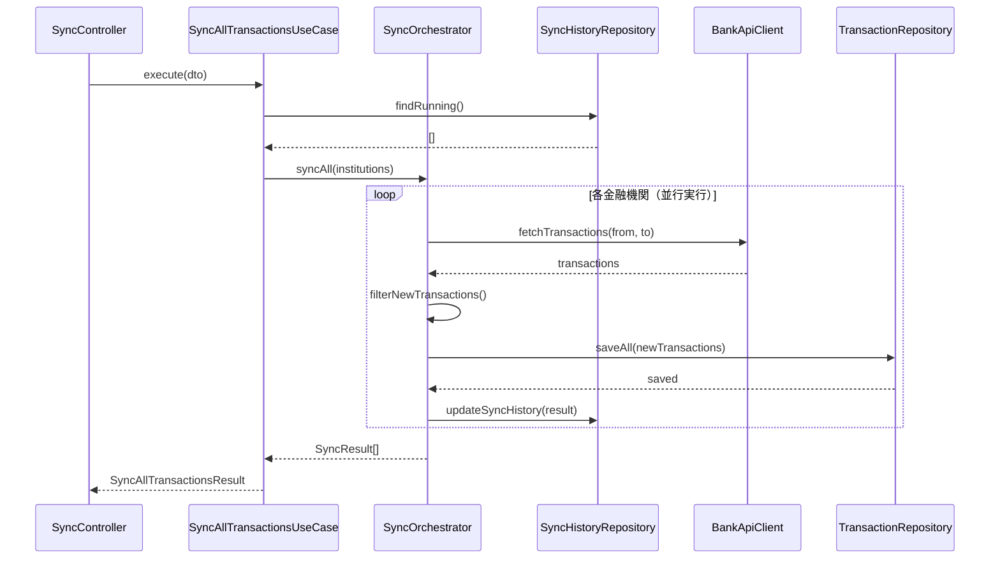
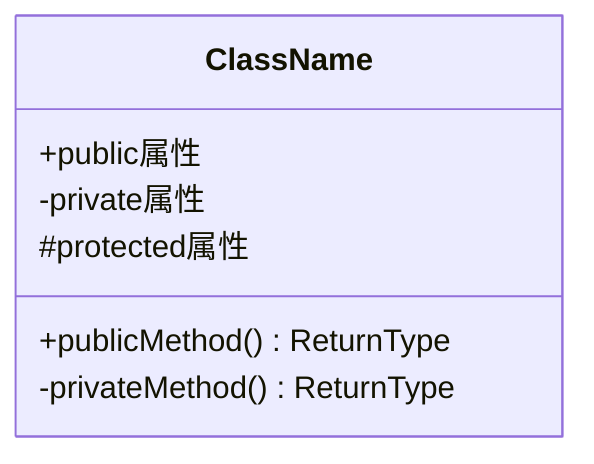

# クラス図

このドキュメントでは、利用履歴自動取得機能のクラス構造を記載しています。

## 目次

1. [Domain層クラス図](#domain層クラス図)
2. [Application層クラス図](#application層クラス図)
3. [Infrastructure層クラス図](#infrastructure層クラス図)
4. [Presentation層クラス図](#presentation層クラス図)

---

## Domain層クラス図

### Sync Module

```mermaid
classDiagram
    class SyncHistory {
        +string id
        +string institutionId
        +string institutionName
        +InstitutionType institutionType
        +SyncStatus status
        +Date startedAt
        +Date? completedAt
        +number totalFetched
        +number newRecords
        +number duplicateRecords
        +string? errorMessage
        +number retryCount
        +Date createdAt
        +Date updatedAt
        +markAsRunning() void
        +markAsCompleted(result) void
        +markAsFailed(error) void
        +markAsCancelled() void
        +incrementRetryCount() void
        +toJSON() SyncHistoryDto
    }

    note right of SyncHistory
        toJSON()の返り値型は
        input-output-design.mdで
        定義されているレスポンスモデル
    end note

    class SyncStatus {
        <<enumeration>>
        PENDING
        RUNNING
        COMPLETED
        FAILED
        CANCELLED
    }

    class InstitutionType {
        <<enumeration>>
        BANK
        CREDIT_CARD
        SECURITIES
    }

    class IncrementalSyncStrategy {
        -Date? lastSyncDate
        +filterNewTransactions(transactions) Transaction[]
        +isDuplicate(transaction) boolean
        +getTransactionHash(transaction) string
    }

    class ISyncHistoryRepository {
        <<interface>>
        +save(history) Promise~SyncHistory~
        +findById(id) Promise~SyncHistory|null~
        +findAll(query) Promise~SyncHistory[]~
        +findByInstitutionId(institutionId) Promise~SyncHistory[]~
        +findRunning() Promise~SyncHistory[]~
        +delete(id) Promise~void~
    }

    SyncHistory --> SyncStatus
    SyncHistory --> InstitutionType
    IncrementalSyncStrategy --> SyncHistory
```

**クラス説明**:

#### SyncHistory

- **責務**: 同期履歴の管理、ステータス遷移、結果の記録
- **主要メソッド**:
  - `markAsRunning()`: ステータスを実行中に変更
  - `markAsCompleted(result)`: ステータスを完了に変更し、結果を記録
  - `markAsFailed(error)`: ステータスを失敗に変更し、エラーメッセージを記録
  - `markAsCancelled()`: ステータスをキャンセル済みに変更
  - `incrementRetryCount()`: リトライ回数を増加
  - `toJSON()`: JSON形式への変換（APIレスポンス用）

#### SyncStatus

- **責務**: 同期ステータスの定義
- **値**:
  - `PENDING`: 実行待ち
  - `RUNNING`: 実行中
  - `COMPLETED`: 完了
  - `FAILED`: 失敗
  - `CANCELLED`: キャンセル

#### InstitutionType

- **責務**: 金融機関種別の定義
- **値**:
  - `BANK`: 銀行
  - `CREDIT_CARD`: クレジットカード
  - `SECURITIES`: 証券

#### IncrementalSyncStrategy

- **責務**: 差分同期戦略、重複チェック
- **主要メソッド**:
  - `filterNewTransactions()`: 新規トランザクションのみをフィルタ
  - `isDuplicate()`: 重複判定
  - `getTransactionHash()`: トランザクションのハッシュ値計算（重複チェック用）

---

## Application層クラス図

### Use Cases



**クラス説明**:

#### SyncAllTransactionsUseCase

- **責務**: 全金融機関の取引履歴同期のオーケストレーション
- **依存**: SyncHistoryRepository, InstitutionRepository, TransactionRepository, SyncOrchestrator, IncrementalSyncStrategy
- **入力**: `SyncAllTransactionsDto`
- **出力**: `SyncAllTransactionsResult`
- **主要メソッド**:
  - `execute()`: 同期処理のメインロジック
  - `createSyncHistory()`: 同期履歴の作成
  - `updateSyncHistory()`: 同期履歴の更新

#### GetSyncHistoryUseCase

- **責務**: 同期履歴の取得とフィルタリング
- **依存**: SyncHistoryRepository
- **入力**: `GetSyncHistoryDto`
- **出力**: `GetSyncHistoryResult`

#### CancelSyncUseCase

- **責務**: 実行中の同期キャンセル
- **依存**: SyncHistoryRepository, SyncOrchestrator
- **入力**: `syncId` (string)
- **出力**: `CancelSyncResult`

---

## Infrastructure層クラス図

### Repository Implementations & Jobs



**クラス説明**:

#### SyncHistoryTypeOrmRepository

- **責務**: 同期履歴の永続化（TypeORM使用）
- **永続化方法**: MySQL（本番）、JSON（開発）
- **主要メソッド**:
  - `toEntity()`: ORMエンティティからドメインエンティティへ変換
  - `toOrm()`: ドメインエンティティからORMエンティティへ変換

#### ScheduledSyncJob

- **責務**: 定期実行ジョブ（cron）による自動同期
- **スケジュール**: 毎日午前4時（デフォルト）
- **主要メソッド**:
  - `handleCron()`: cron実行時のエントリーポイント
  - `checkIfAlreadyRunning()`: 重複実行の防止

#### SyncOrchestrator

- **責務**: 同期処理のオーケストレーション、並行実行制御
- **並行数**: 最大5金融機関を同時処理
- **主要メソッド**:
  - `syncAll()`: 全金融機関を並行同期
  - `syncOne()`: 1つの金融機関を同期
  - `cancel()`: 同期のキャンセル
  - `isRunning()`: 実行中かどうかの確認

#### BankApiClient

- **責務**: 銀行APIとの通信
- **API**: 各銀行のREST API
- **認証**: Bearer Token
- **主要メソッド**:
  - `fetchTransactions()`: 取引履歴の取得
  - `healthCheck()`: 接続確認

---

## Presentation層クラス図

### Controllers



**クラス説明**:

#### SyncController

- **責務**: 同期関連のHTTPリクエスト/レスポンス処理
- **エンドポイント**:
  - `POST /api/sync/start`: 手動同期開始
  - `GET /api/sync/status`: 同期ステータス取得
  - `GET /api/sync/history`: 同期履歴取得
  - `PUT /api/sync/cancel/:id`: 同期キャンセル
  - `GET /api/sync/schedule`: スケジュール設定取得
  - `PUT /api/sync/schedule`: スケジュール設定更新

#### SyncAllTransactionsRequestDto

- **責務**: 同期開始リクエストデータの受け取りとバリデーション
- **バリデーション**:
  - `forceFullSync`: boolean（オプション）
  - `institutionIds`: string配列（オプション、指定すると特定の金融機関のみ同期）

#### SyncAllTransactionsResponseDto

- **責務**: 同期開始レスポンスデータの構築
- **変換**: UseCaseの結果から変換

---

## クラス間の関係性

### 依存関係の概要



### データフロー（手動同期）



---

## 実装上の注意点

### 型安全性

- すべてのクラスとメソッドに適切な型定義を行う
- `any`型の使用を避ける
- Genericsを活用して型の再利用性を高める

### 依存性注入

- コンストラクタインジェクションを使用
- インターフェースに依存し、実装に依存しない
- NestJSのDIコンテナを活用

### イミュータビリティ

- SyncHistoryのステータス更新は新しいインスタンスを返す
- Stateの直接変更を避ける

### エラーハンドリング

- カスタム例外クラスを定義
- 適切なエラーメッセージを提供
- エラーのロギング

### 並行実行制御

- `Promise.allSettled` を使用して、1つの失敗が他に影響しないよう保証
- AbortControllerを使用してキャンセル可能にする

---

## チェックリスト

クラス図作成時の確認事項：

### Domain層

- [x] すべてのEntityが定義されている
- [x] Value Object（IncrementalSyncStrategy）が適切に定義されている
- [x] Repositoryインターフェースが定義されている
- [x] ビジネスロジックがEntityに配置されている

### Application層

- [x] すべてのUseCaseが定義されている
- [x] DTOが適切に定義されている
- [x] サービスクラス（SyncOrchestrator）が必要に応じて定義されている

### Infrastructure層

- [x] Repositoryの実装クラスが定義されている
- [x] 外部APIクライアントが定義されている
- [x] 永続化方法が明確
- [x] ScheduledSyncJobが定義されている

### Presentation層

- [x] すべてのControllerが定義されている
- [x] RequestDTO、ResponseDTOが定義されている
- [x] エンドポイントが明確

---

## Mermaid記法のヒント

### クラス定義



### 関係性

- `-->`: 依存（Dependency）
- `--|>`: 継承（Inheritance）
- `..|>`: 実装（Implementation）
- `--*`: コンポジション（Composition）
- `--o`: 集約（Aggregation）
