# シーケンス図

このドキュメントでは、利用履歴自動取得機能の処理フローをシーケンス図で記載しています。

## 目次

1. [手動同期のフロー](#手動同期のフロー)
2. [自動同期のフロー](#自動同期のフロー)
3. [同期履歴取得のフロー](#同期履歴取得のフロー)
4. [同期キャンセルのフロー](#同期キャンセルのフロー)
5. [エラーハンドリングフロー](#エラーハンドリングフロー)

---

## 手動同期のフロー

### 概要

**ユースケース**: ユーザーが「今すぐ同期」ボタンを押して、任意のタイミングで取引履歴を同期

**アクター**: ユーザー

**前提条件**:

- ユーザーが認証済み
- 金融機関が連携済み
- 同期が実行中でないこと

**成功時の結果**:

- 各金融機関の取引履歴が取得される
- 新規データがデータベースに保存される
- 重複データはスキップされる
- 同期履歴が記録される

### 正常系フロー

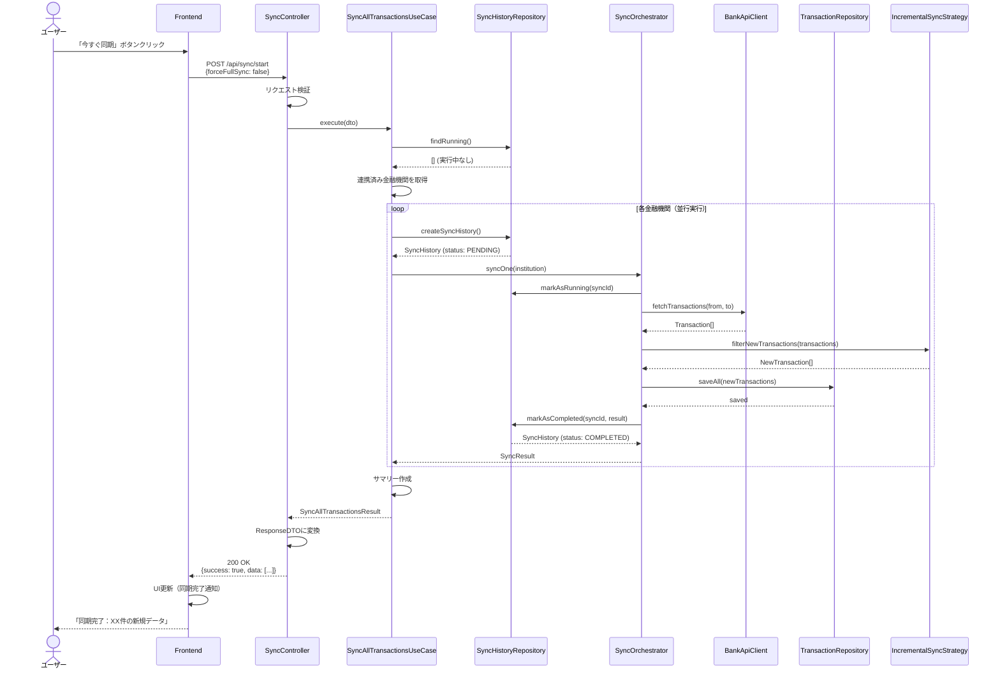

### ステップ詳細

1. **ユーザーアクション**
   - ユーザーがダッシュボードの「今すぐ同期」ボタンをクリック

2. **Frontend バリデーション**
   - 必須パラメータの確認（なし）
   - オプション: `forceFullSync` (boolean)、`institutionIds` (string[])

3. **API リクエスト**
   - エンドポイント: `POST /api/sync/start`
   - RequestDTO: `SyncAllTransactionsRequestDto`

4. **実行中チェック**
   - 既に同期が実行中の場合はエラー（409 Conflict）

5. **並行同期実行**
   - 最大5金融機関を同時処理
   - 各金融機関の処理は独立（1つの失敗が他に影響しない）

6. **差分同期**
   - 前回同期日以降のデータのみ取得
   - 重複チェック（トランザクションハッシュで判定）

7. **レスポンス**
   - ResponseDTO: `SyncAllTransactionsResponseDto`
   - HTTPステータス: 200 OK

---

## 自動同期のフロー

### 概要

**ユースケース**: 設定された時刻（デフォルト: 毎日午前4時）に自動的に同期を実行

**アクター**: スケジューラー

**前提条件**:

- スケジューラーが有効
- 金融機関が連携済み

**成功時の結果**:

- 各金融機関の取引履歴が自動取得される
- 同期履歴が記録される
- エラー発生時はログに記録される

### 正常系フロー

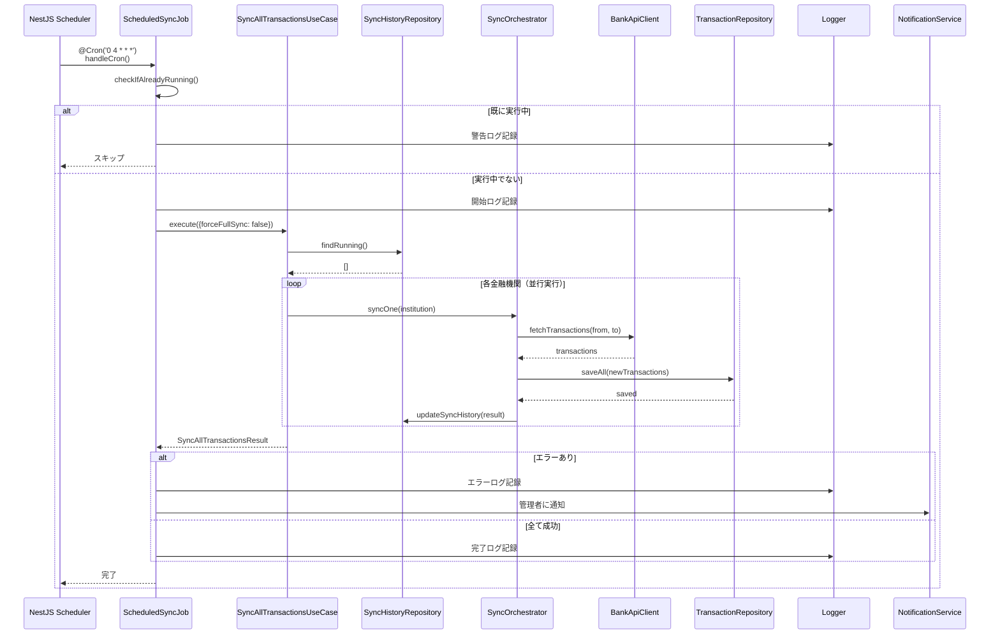

### ステップ詳細

1. **スケジューラートリガー**
   - NestJS Schedulerが指定時刻にcronジョブを実行
   - デフォルト: 毎日午前4時（`0 4 * * *`）

2. **重複実行チェック**
   - 前回の実行がまだ終わっていない場合はスキップ
   - フラグ管理で制御

3. **同期実行**
   - UseCaseを呼び出して同期処理を実行
   - 手動同期と同じロジックを使用

4. **エラー通知**
   - エラー発生時は管理者に通知
   - 成功率が一定以下の場合も通知

5. **ログ記録**
   - 開始・終了・エラーのログを記録
   - メトリクスを収集

---

## 同期履歴取得のフロー

### 概要

**ユースケース**: 過去の同期履歴を取得し、成功・失敗状況を確認

**アクター**: ユーザー

**前提条件**:

- ユーザーが認証済み

**成功時の結果**:

- 同期履歴の一覧が取得される
- フィルタ・ソートが適用される

### 正常系フロー

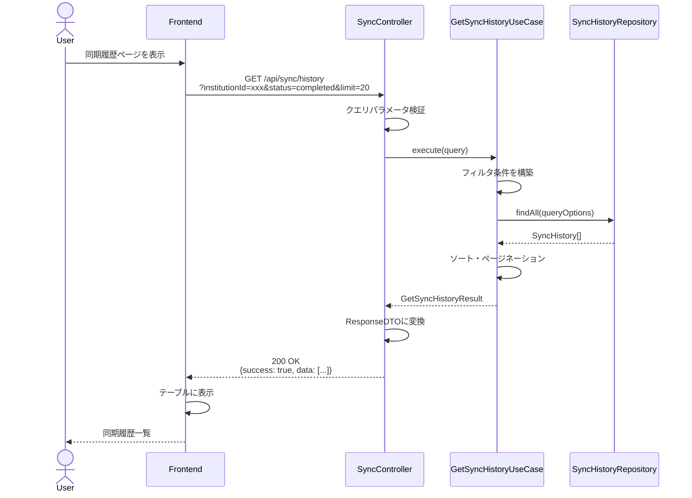

### ステップ詳細

1. **ユーザーアクション**
   - ユーザーが同期履歴ページを表示
   - フィルタ・ソート条件を指定（オプション）

2. **API リクエスト**
   - エンドポイント: `GET /api/sync/history`
   - クエリパラメータ:
     - `institutionId` (string, optional)
     - `status` (SyncStatus, optional)
     - `startDate` (ISO8601, optional)
     - `endDate` (ISO8601, optional)
     - `limit` (number, optional, default: 20)

3. **フィルタ適用**
   - 指定された条件で履歴をフィルタ
   - デフォルトは最新20件

4. **レスポンス**
   - ResponseDTO: `GetSyncHistoryResponseDto`
   - HTTPステータス: 200 OK

---

## 同期キャンセルのフロー

### 概要

**ユースケース**: 実行中の同期処理をキャンセル

**アクター**: ユーザー

**前提条件**:

- 同期が実行中であること
- ユーザーが認証済み

**成功時の結果**:

- 実行中の同期がキャンセルされる
- ステータスが「cancelled」に更新される

### 正常系フロー

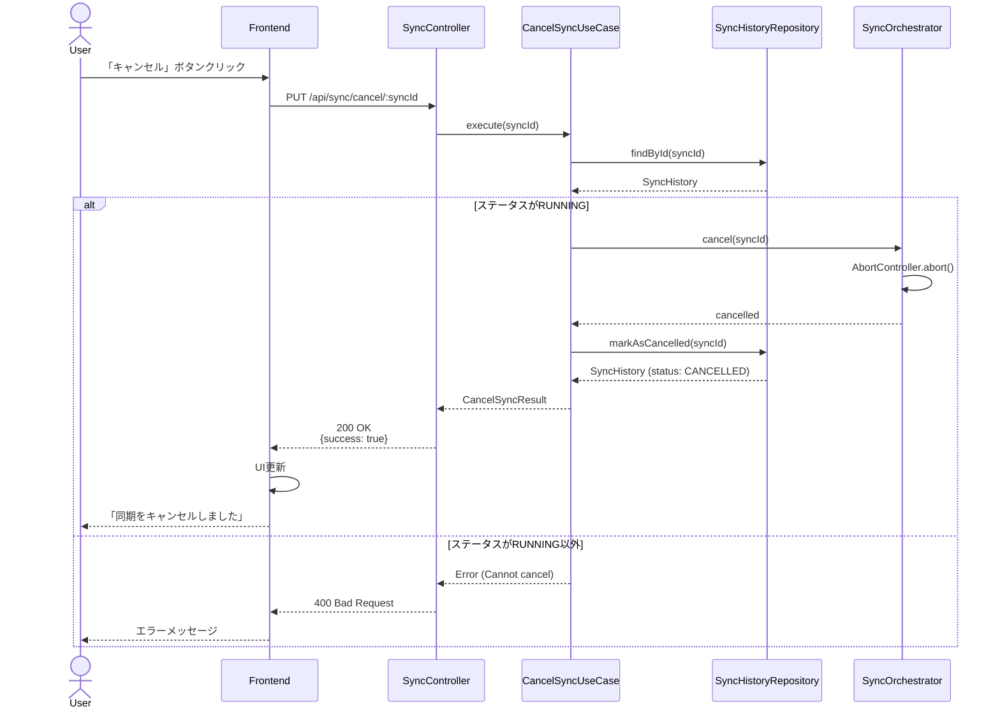

### ステップ詳細

1. **ユーザーアクション**
   - ユーザーが実行中の同期の「キャンセル」ボタンをクリック

2. **API リクエスト**
   - エンドポイント: `PUT /api/sync/cancel/:syncId`
   - PathParameter: `syncId` (string)

3. **ステータス確認**
   - ステータスが「RUNNING」の場合のみキャンセル可能
   - それ以外はエラー

4. **AbortController使用**
   - AbortControllerを使用して進行中の処理を中断
   - Promise.allSettledで並行実行している場合、すべての処理を中断

5. **レスポンス**
   - ResponseDTO: `CancelSyncResponseDto`
   - HTTPステータス: 200 OK

---

## エラーハンドリングフロー

### バリデーションエラー (400 Bad Request)

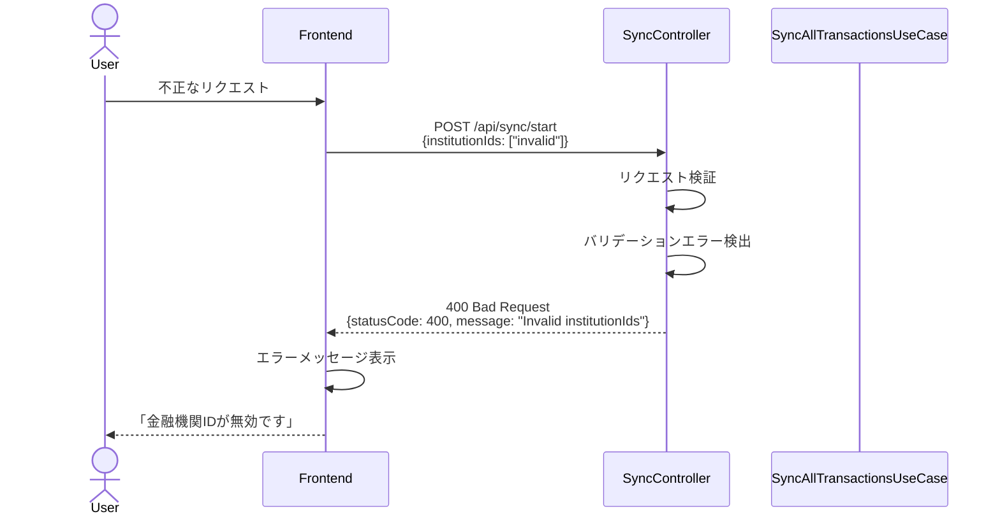

**エラーレスポンス例**:

```json
{
  "success": false,
  "statusCode": 400,
  "message": "Validation failed",
  "errors": [
    {
      "field": "institutionIds",
      "message": "Invalid institution ID: invalid"
    }
  ]
}
```

### 同時実行エラー (409 Conflict)

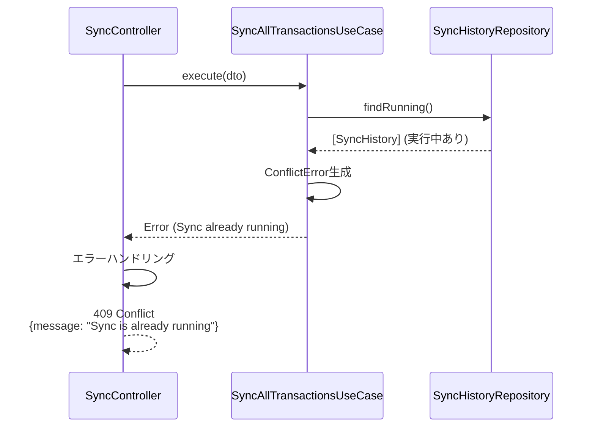

### 金融機関API接続エラー (502 Bad Gateway)

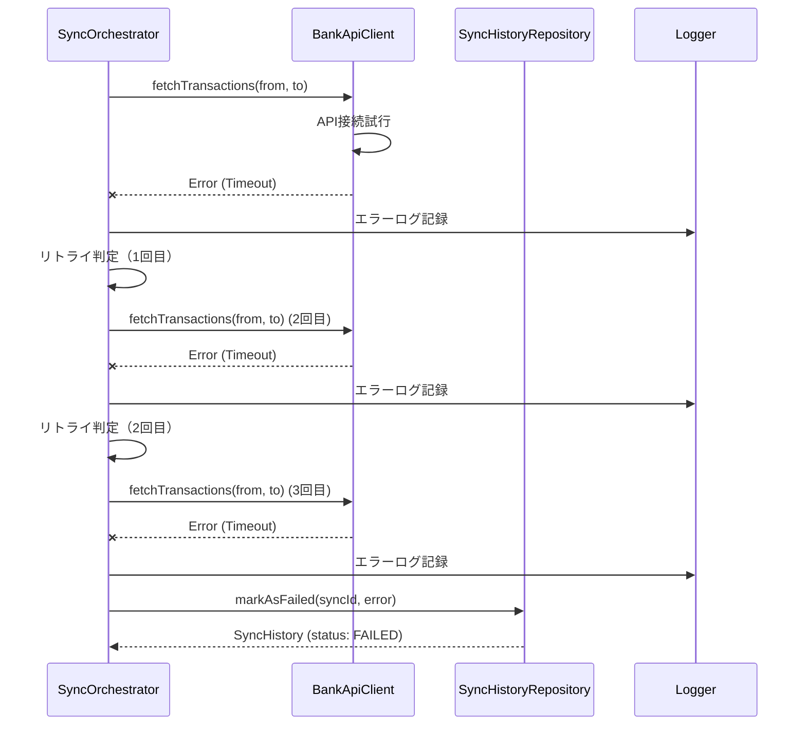

**リトライ戦略**:

- 最大3回までリトライ
- リトライ間隔: 1秒、2秒、4秒（指数バックオフ）
- 3回失敗したら、ステータスを「FAILED」に変更

### データ保存エラー (500 Internal Server Error)

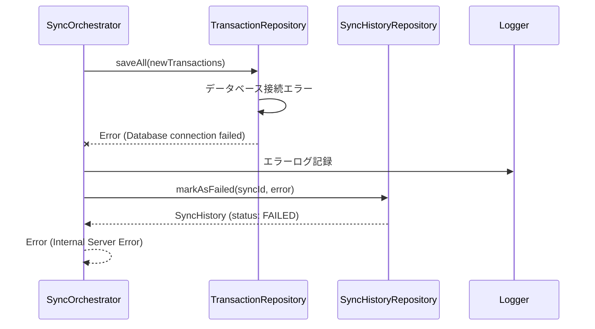

---

## トランザクション境界

### データベーストランザクション

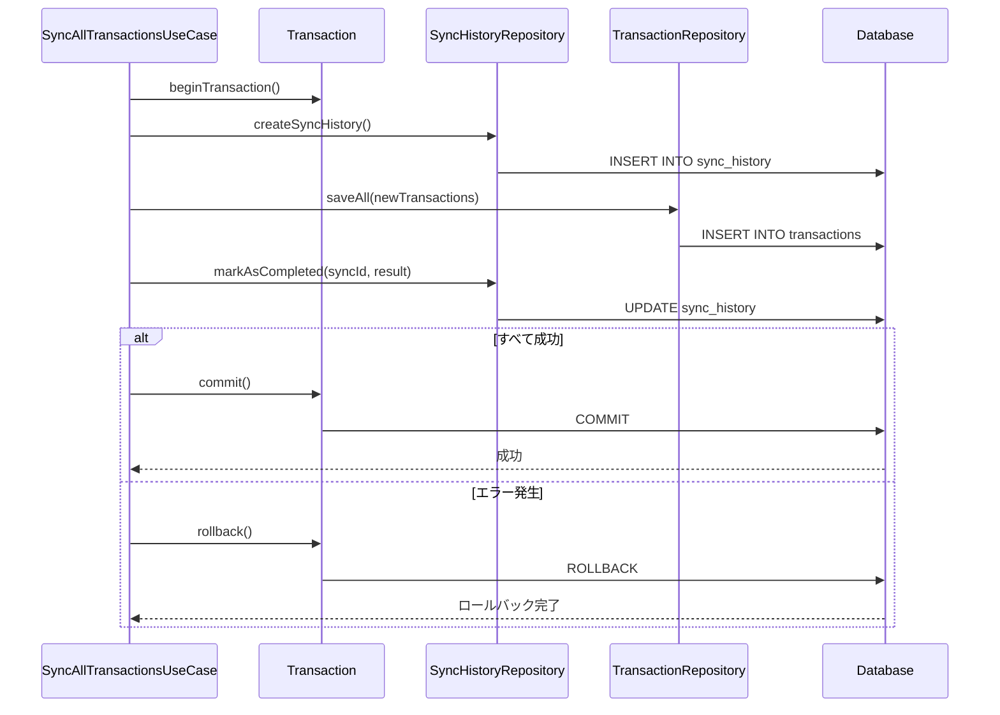

**トランザクション境界の重要性**:

- 同期履歴とトランザクションデータの保存は同一トランザクション内で実行
- エラー発生時は両方ともロールバックされる
- データの整合性を保証

---

## パフォーマンス最適化

### 並行実行制御

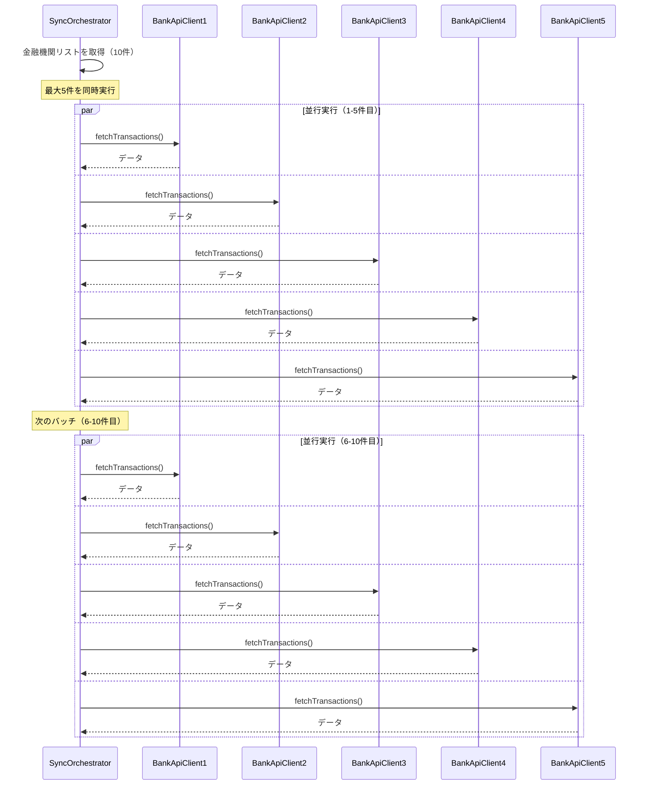

**並行実行のメリット**:

- 同期時間の大幅短縮
- APIレート制限の回避（同時実行数制限）
- 1つの失敗が他に影響しない

---

## チェックリスト

シーケンス図作成時の確認事項：

### 基本項目

- [x] 主要なユースケースがすべて記載されている
- [x] アクター、参加者が明確に定義されている
- [x] 正常系フローが記載されている
- [x] 異常系フローが記載されている

### 詳細項目

- [x] エラーハンドリングが明確
- [x] トランザクション境界が明確
- [x] 非同期処理が適切に表現されている
- [x] レスポンスの型とステータスコードが明記されている

### 実装ガイド

- [x] 各ステップに説明が付与されている
- [x] 前提条件が明確
- [x] 成功時の結果が明確

---

## Mermaid記法のヒント

### 基本構文

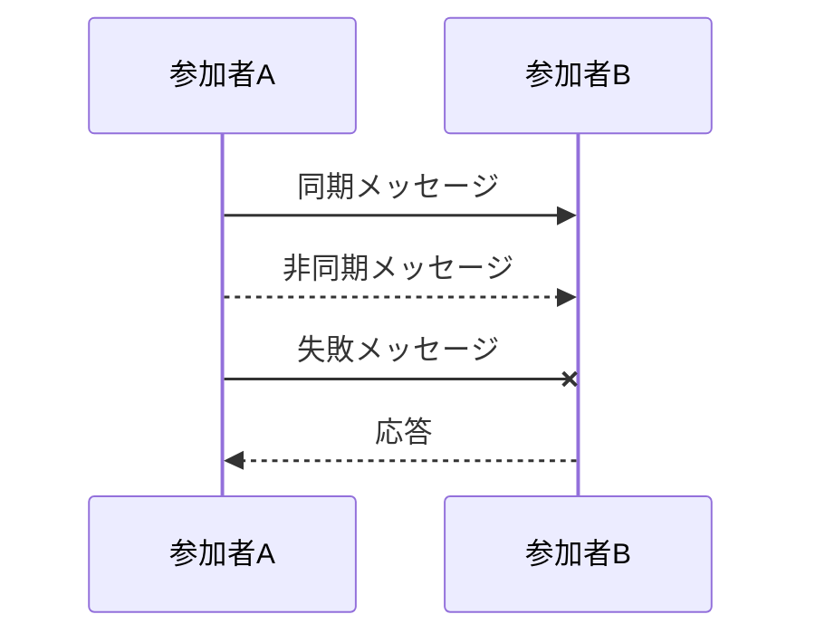

### 条件分岐

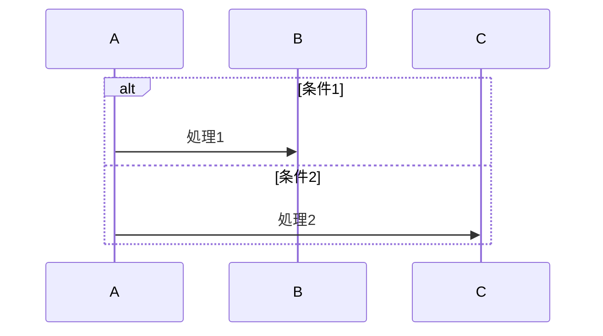

### ループ

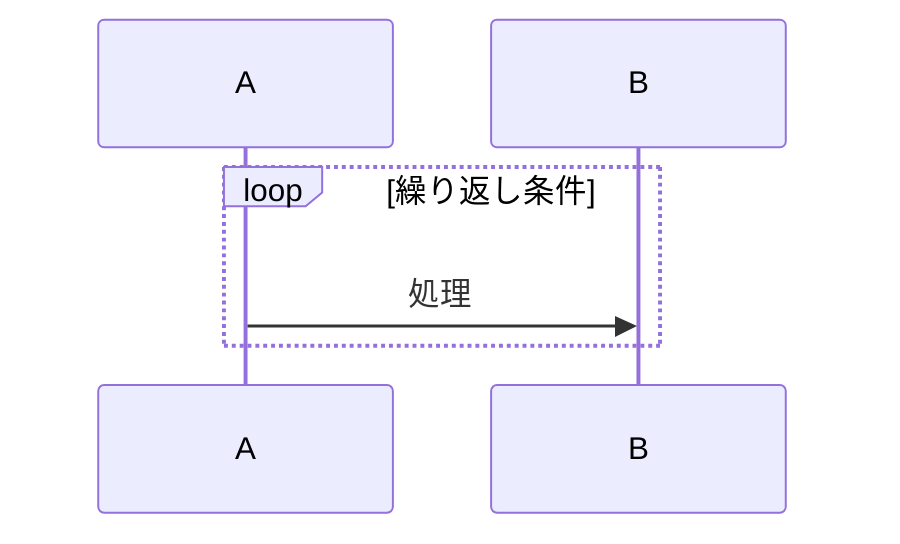

### 並行処理

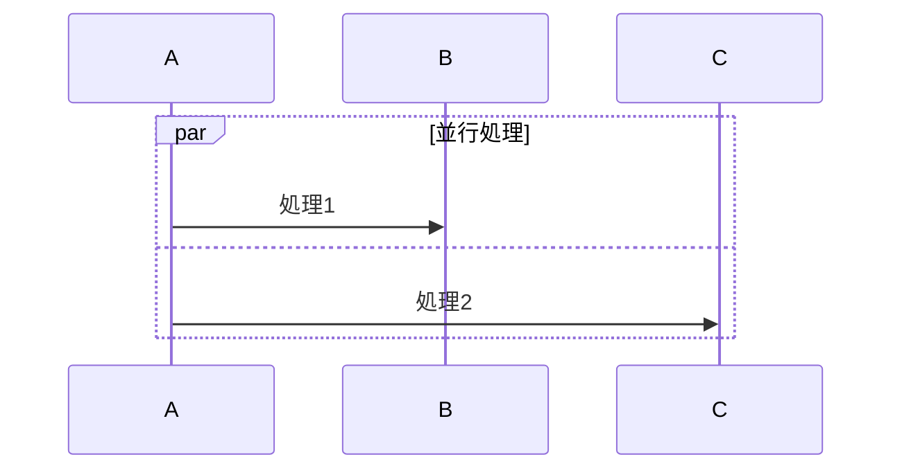
