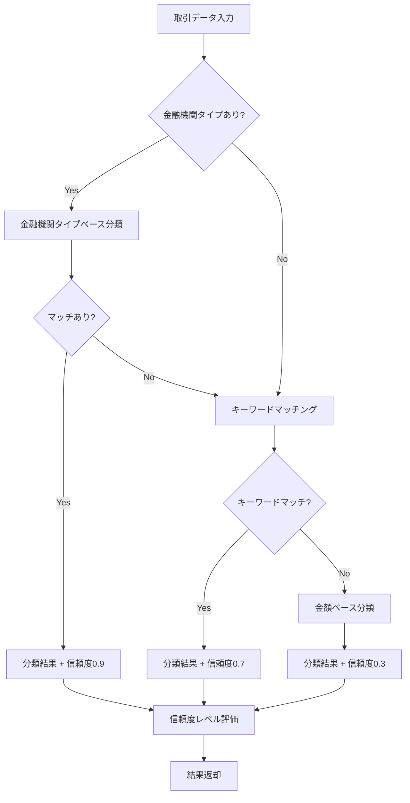

# FR-008-011: 取引データの主要カテゴリ自動分類 - 詳細設計書

## 概要

### 機能概要

取引データを5つの主要カテゴリ（収入・支出・振替・返済・投資）に自動分類する機能です。
取引の金額、説明文、金融機関タイプを分析し、最適なカテゴリを推定します。

### 対象機能要件

- **FR-008**: カテゴリ自動分類のコアロジック
- **FR-009**: 金融機関タイプによる分類精度向上
- **FR-010**: 信頼度スコアの計算
- **FR-011**: 分類結果の説明生成

### 実装範囲

- **Backend**: 分類ロジック、API、ユースケース
- **Frontend**: 分類試行UI、結果表示
- **共通**: TypeScript型定義

---

## アーキテクチャ

### Onion Architecture層構成

```
┌─────────────────────────────────────────────────────────┐
│ Presentation層 (Controllers)                             │
│  - TransactionController                                 │
│    - POST /api/transactions/classify                     │
└─────────────────────────────────────────────────────────┘
                         ↓
┌─────────────────────────────────────────────────────────┐
│ Application層 (Use Cases)                                │
│  - ClassifyTransactionUseCase                            │
│    - execute(): カテゴリ分類の実行                        │
└─────────────────────────────────────────────────────────┘
                         ↓
┌─────────────────────────────────────────────────────────┐
│ Domain層 (Services, Entities)                            │
│  - CategoryClassificationService                         │
│    - classifyTransaction(): 分類ロジック                 │
│    - matchKeywords(): キーワードマッチング               │
│    - classifyByAmount(): 金額ベース分類                  │
│    - evaluateConfidence(): 信頼度評価                    │
└─────────────────────────────────────────────────────────┘
                         ↓
┌─────────────────────────────────────────────────────────┐
│ Infrastructure層 (Repositories)                          │
│  - CategoryRepository                                    │
│    - findByType(): カテゴリタイプでの検索                │
└─────────────────────────────────────────────────────────┘
```

### 依存関係の方向

- Presentation → Application → Domain → Infrastructure
- 各層は外側の層に依存せず、内側の層のみに依存
- インターフェースを通じた依存性の注入

---

## 技術スタック

### Backend

- **Framework**: NestJS
- **言語**: TypeScript
- **バリデーション**: class-validator
- **DI**: NestJS Dependency Injection

### Frontend

- **Framework**: Next.js 15 (App Router)
- **言語**: TypeScript
- **UI**: React 19, Tailwind CSS
- **API通信**: Fetch API (apiClient)

### 共通

- **型定義**: @account-book/types (libs/types)
- **Monorepo**: Turborepo + pnpm workspace

---

## 分類アルゴリズム

### 分類フロー



### 分類優先度

1. **金融機関タイプ**: 信頼度 0.9
   - `securities` → INVESTMENT
   - その他の条件は現在未実装

2. **キーワードマッチング**: 信頼度 0.7
   - 評価順序（具体的 → 一般的）：
     1. REPAYMENT（返済）
     2. INVESTMENT（投資）
     3. TRANSFER（振替）
     4. INCOME（収入）
     5. EXPENSE（支出）

3. **金額ベース**: 信頼度 0.3
   - 正の値 → INCOME
   - 負の値 → EXPENSE

### キーワード辞書

各カテゴリに対応するキーワードリスト：

- **REPAYMENT**: ローン、返済、住宅ローン、自動車ローン、教育ローン
- **INVESTMENT**: 株式、投資信託、債券、売買、配当、分配金、株、fund、stock、証券
- **TRANSFER**: 振替、カード引落、口座振替、資金移動、チャージ、送金、transfer、口座間
- **INCOME**: 給与、賞与、ボーナス、報酬、利息、売上、還付、キャッシュバック、払戻、返金、振込、salary、bonus、入金
- **EXPENSE**: 購入、支払、決済、引落、コンビニ、スーパー、レストラン、カフェ、ガソリン、公共料金、携帯、水道、電気、ガス

### 信頼度レベル

| 信頼度スコア | レベル | 説明                       |
| ------------ | ------ | -------------------------- |
| 0.9以上      | high   | 金融機関タイプによる分類   |
| 0.7以上      | medium | キーワードマッチによる分類 |
| 0.7未満      | low    | 金額ベース分類             |

---

## 主要コンポーネント

### Backend

| コンポーネント                | ファイル                             | 責務                           |
| ----------------------------- | ------------------------------------ | ------------------------------ |
| CategoryClassificationService | `category-classification.service.ts` | 分類ロジックの実装             |
| ClassifyTransactionUseCase    | `classify-transaction.use-case.ts`   | 分類処理のオーケストレーション |
| TransactionController         | `transaction.controller.ts`          | API エンドポイント提供         |

### Frontend

| コンポーネント      | ファイル                    | 責務       |
| ------------------- | --------------------------- | ---------- |
| CategoryClassifier  | `CategoryClassifier.tsx`    | 分類試行UI |
| classifyTransaction | `lib/api/classification.ts` | API通信    |

---

## テスト戦略

### ユニットテスト

- **CategoryClassificationService**: 分類ロジックの各パターン
- **ClassifyTransactionUseCase**: ユースケースの統合テスト
- **TransactionController**: APIエンドポイントのバリデーション

### E2Eテスト

- 各カテゴリ（収入・支出・振替・返済・投資）の分類確認
- バリデーションエラーのハンドリング
- 分類結果の表示確認

---

## セキュリティ・パフォーマンス

### セキュリティ

- **入力バリデーション**: class-validatorによる型検証
- **型安全性**: TypeScriptによる厳密な型チェック

### パフォーマンス

- **キーワードマッチング**: O(n) - カテゴリ数に比例
- **データベースクエリ**: カテゴリタイプでのインデックス利用
- **キャッシング**: 現在未実装、将来的に検討

---

## 制約・前提条件

### 制約

- カテゴリ辞書は日本語と英語のみ対応
- 金融機関タイプは`securities`のみ特殊処理
- 振替パターン検出は未実装（将来拡張予定）

### 前提条件

- カテゴリマスタが事前に登録されていること
- 取引データに`amount`と`description`が必須

---

## 今後の拡張予定

1. **高度な振替検出**: 2つの取引のペアリング検出
2. **機械学習**: 過去の分類データから学習
3. **ユーザーカスタムルール**: ユーザー独自の分類ルール追加
4. **多言語対応**: キーワード辞書の多言語化

---

## 変更履歴

| バージョン | 日付       | 変更内容             | 変更理由                            | 作成者       |
| ---------- | ---------- | -------------------- | ----------------------------------- | ------------ |
| 1.0        | 2025-11-22 | 初版作成（事後作成） | Issue #55実装完了後のドキュメント化 | AI Assistant |

---

## 参考資料

- [機能要件書: FR-008-011](../../functional-requirements/FR-008-011_data-classification.md)
- [システムアーキテクチャ](../../system-architecture.md)
- [Issue #55](https://github.com/kencom2400/account-book/issues/55)
- [PR #254](https://github.com/kencom2400/account-book/pull/254)
