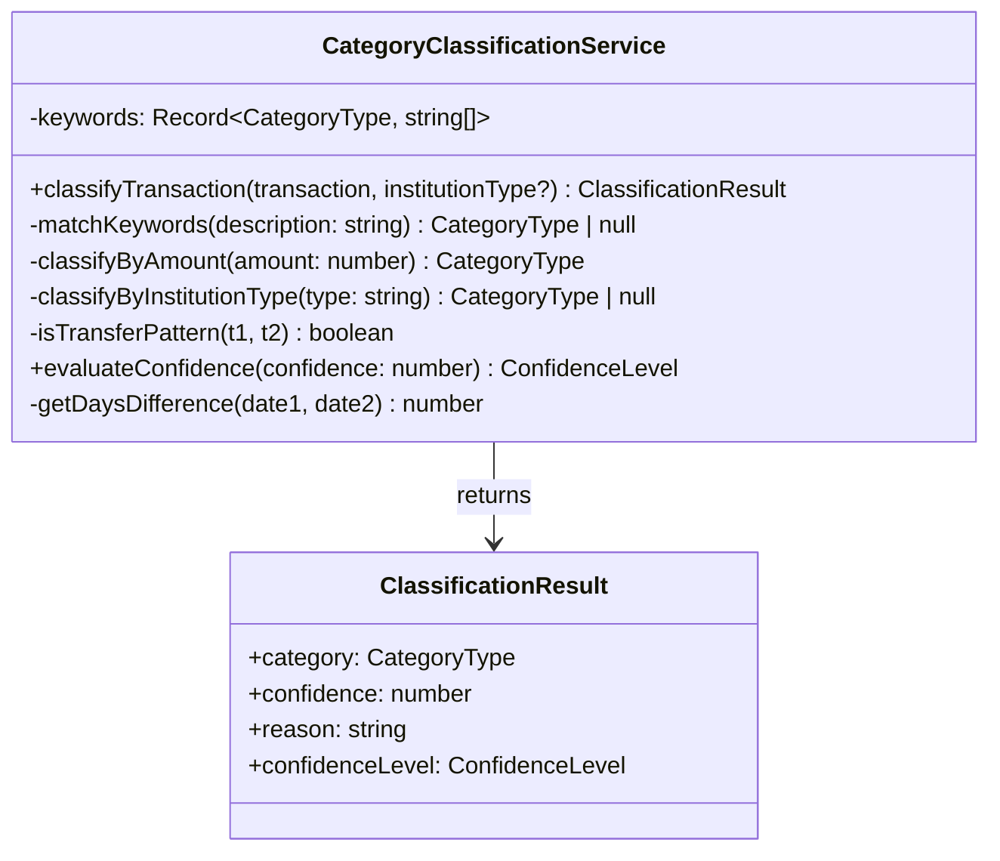
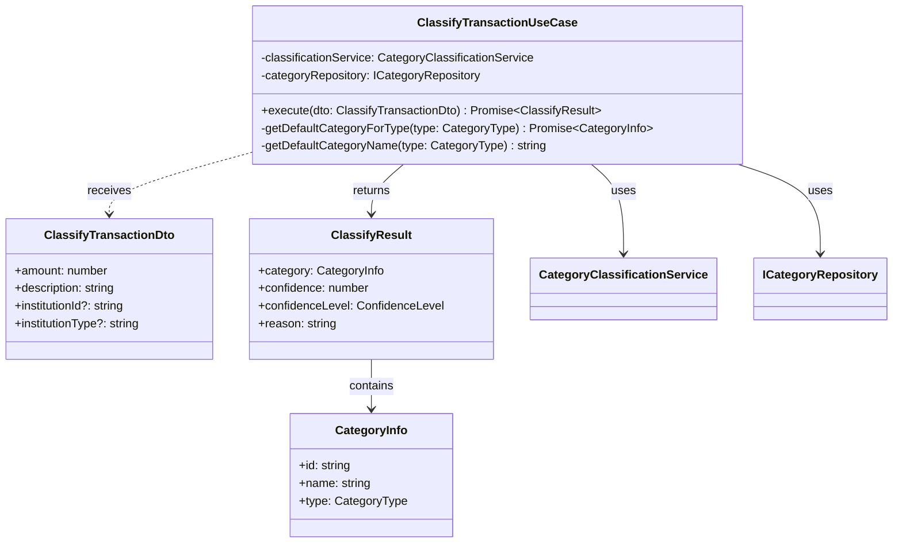
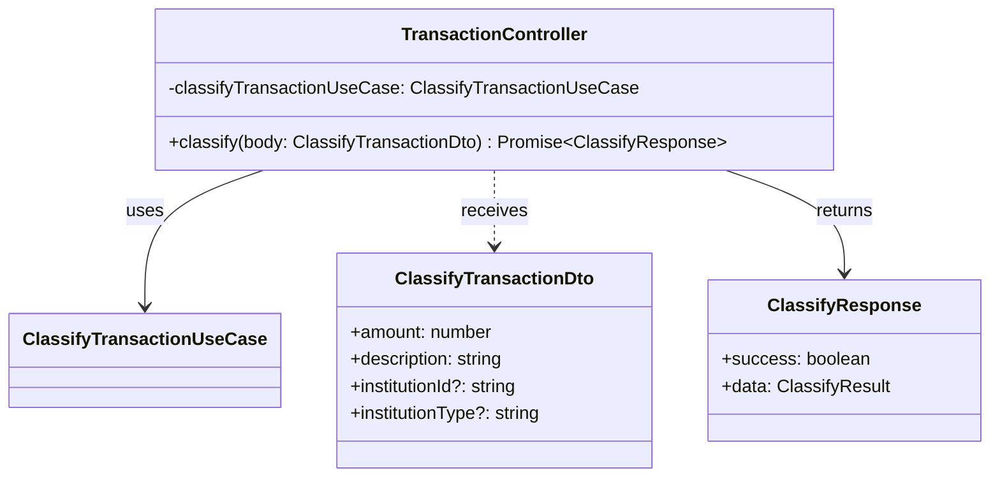
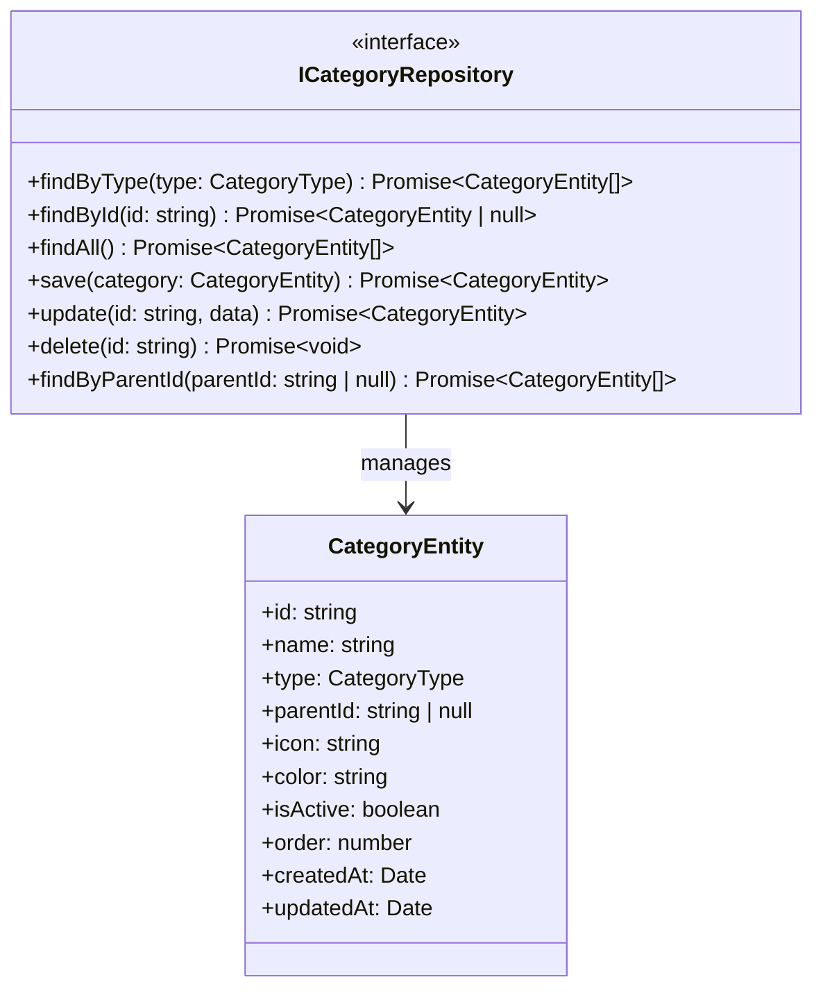
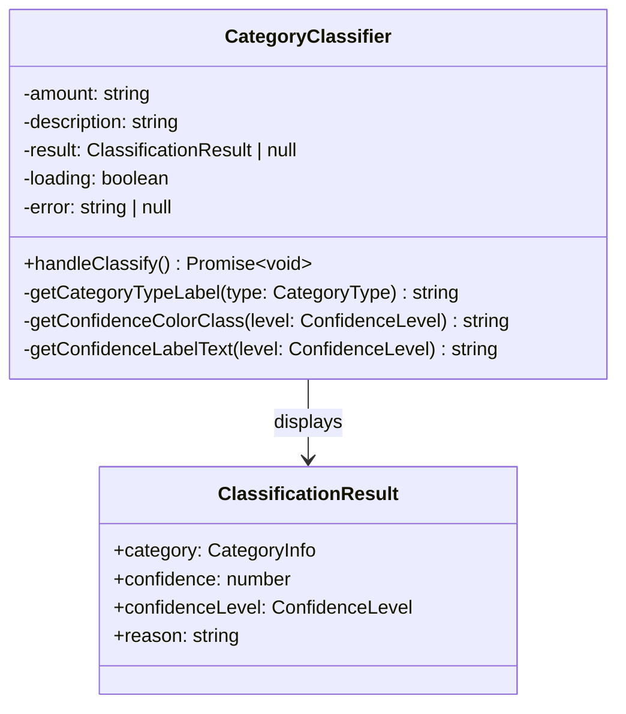
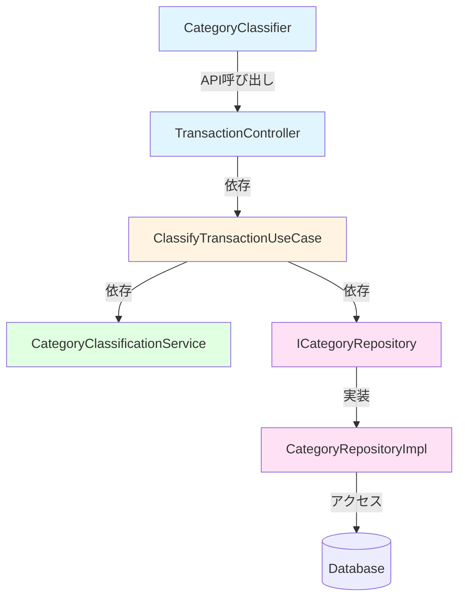

# クラス図 - FR-008-011: 取引データの主要カテゴリ自動分類

## Domain層

### CategoryClassificationService

分類ロジックの中核クラス



#### プロパティ

| 名前     | 型                               | 説明                         |
| -------- | -------------------------------- | ---------------------------- |
| keywords | `Record<CategoryType, string[]>` | カテゴリごとのキーワード辞書 |

#### メソッド

| メソッド                  | 引数                          | 戻り値               | 説明                       |
| ------------------------- | ----------------------------- | -------------------- | -------------------------- |
| classifyTransaction       | transaction, institutionType? | ClassificationResult | 取引を自動分類             |
| matchKeywords             | description: string           | CategoryType \| null | キーワードマッチング       |
| classifyByAmount          | amount: number                | CategoryType         | 金額ベース分類             |
| classifyByInstitutionType | type: string                  | CategoryType \| null | 金融機関タイプベース分類   |
| isTransferPattern         | t1, t2                        | boolean              | 振替パターン検出（未使用） |
| evaluateConfidence        | confidence: number            | ConfidenceLevel      | 信頼度レベル評価           |

---

## Application層

### ClassifyTransactionUseCase

分類処理のオーケストレーション



#### メソッド

| メソッド                  | 引数                        | 戻り値                  | 説明                                     |
| ------------------------- | --------------------------- | ----------------------- | ---------------------------------------- |
| execute                   | dto: ClassifyTransactionDto | Promise<ClassifyResult> | 分類を実行し、カテゴリ情報を返す         |
| getDefaultCategoryForType | type: CategoryType          | Promise<CategoryInfo>   | タイプに対応するデフォルトカテゴリを取得 |
| getDefaultCategoryName    | type: CategoryType          | string                  | タイプに対応するデフォルト名を取得       |

---

## Presentation層

### TransactionController

API エンドポイント



#### エンドポイント

| メソッド | パス                         | 説明             |
| -------- | ---------------------------- | ---------------- |
| POST     | `/api/transactions/classify` | 取引データを分類 |

#### バリデーション

`class-validator`を使用した入力検証：

- `amount`: 数値必須
- `description`: 文字列必須
- `institutionId`: 文字列オプション
- `institutionType`: 文字列オプション

---

## Infrastructure層

### ICategoryRepository

カテゴリリポジトリインターフェース



---

## Frontend

### CategoryClassifier Component



---

## 型定義

### CategoryType (Enum)

```typescript
enum CategoryType {
  INCOME = 'INCOME',
  EXPENSE = 'EXPENSE',
  TRANSFER = 'TRANSFER',
  REPAYMENT = 'REPAYMENT',
  INVESTMENT = 'INVESTMENT',
}
```

### ConfidenceLevel

```typescript
type ConfidenceLevel = 'high' | 'medium' | 'low';
```

---

## クラス間の関係



---

## 依存性注入

### Backend (NestJS)

```typescript
// CategoryClassificationService
@Injectable()
export class CategoryClassificationService { ... }

// ClassifyTransactionUseCase
@Injectable()
export class ClassifyTransactionUseCase {
  constructor(
    private readonly classificationService: CategoryClassificationService,
    @Inject(CATEGORY_REPOSITORY)
    private readonly categoryRepository: ICategoryRepository,
  ) {}
}

// TransactionController
@Controller('transactions')
export class TransactionController {
  constructor(
    private readonly classifyTransactionUseCase: ClassifyTransactionUseCase,
  ) {}
}
```

---

## 設計パターン

### 使用パターン

1. **Dependency Injection**: NestJSのDIコンテナを活用
2. **Repository Pattern**: データアクセスの抽象化
3. **Use Case Pattern**: ビジネスロジックのカプセル化
4. **Strategy Pattern**: 分類アルゴリズムの切り替え（金融機関タイプ、キーワード、金額）

---

## チェックリスト

- [x] Domain層のクラス定義
- [x] Application層のクラス定義
- [x] Presentation層のクラス定義
- [x] Infrastructure層のインターフェース定義
- [x] Frontend コンポーネント定義
- [x] 型定義の明確化
- [x] クラス間の依存関係の図示
- [x] 依存性注入の説明
- [x] 使用している設計パターンの記載
