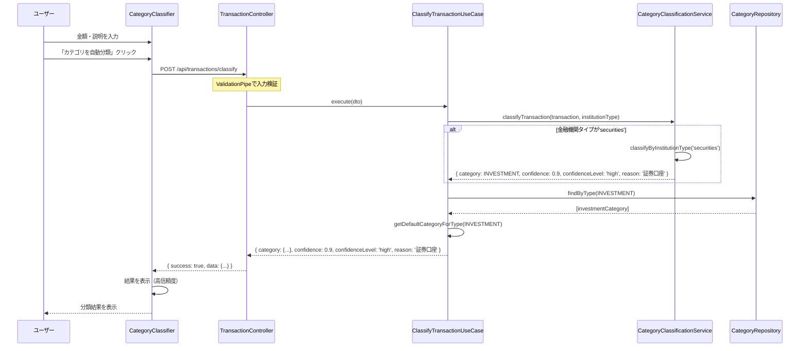
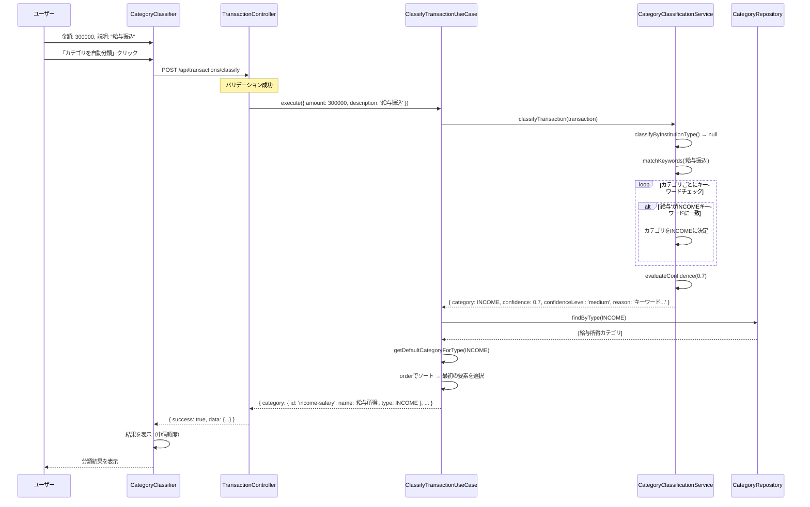
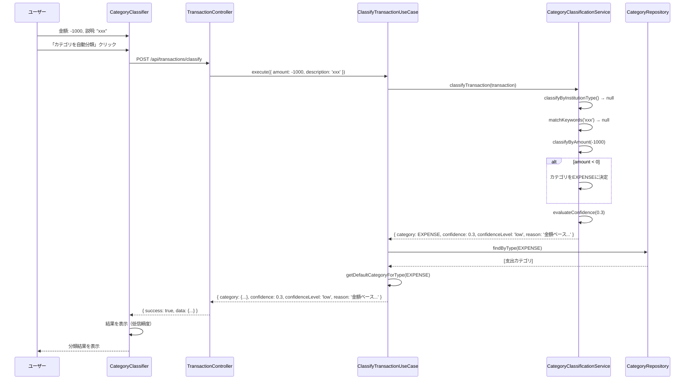
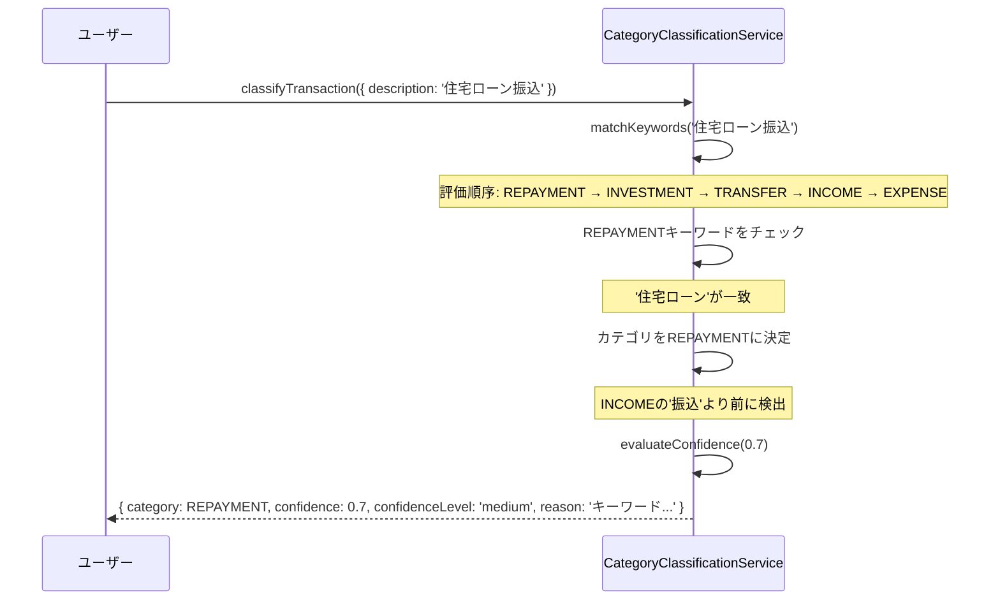
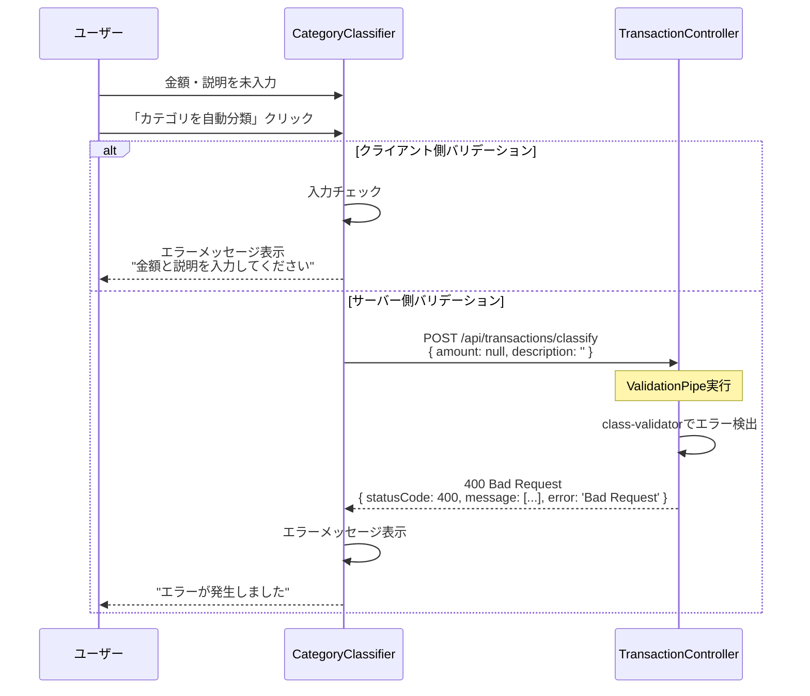
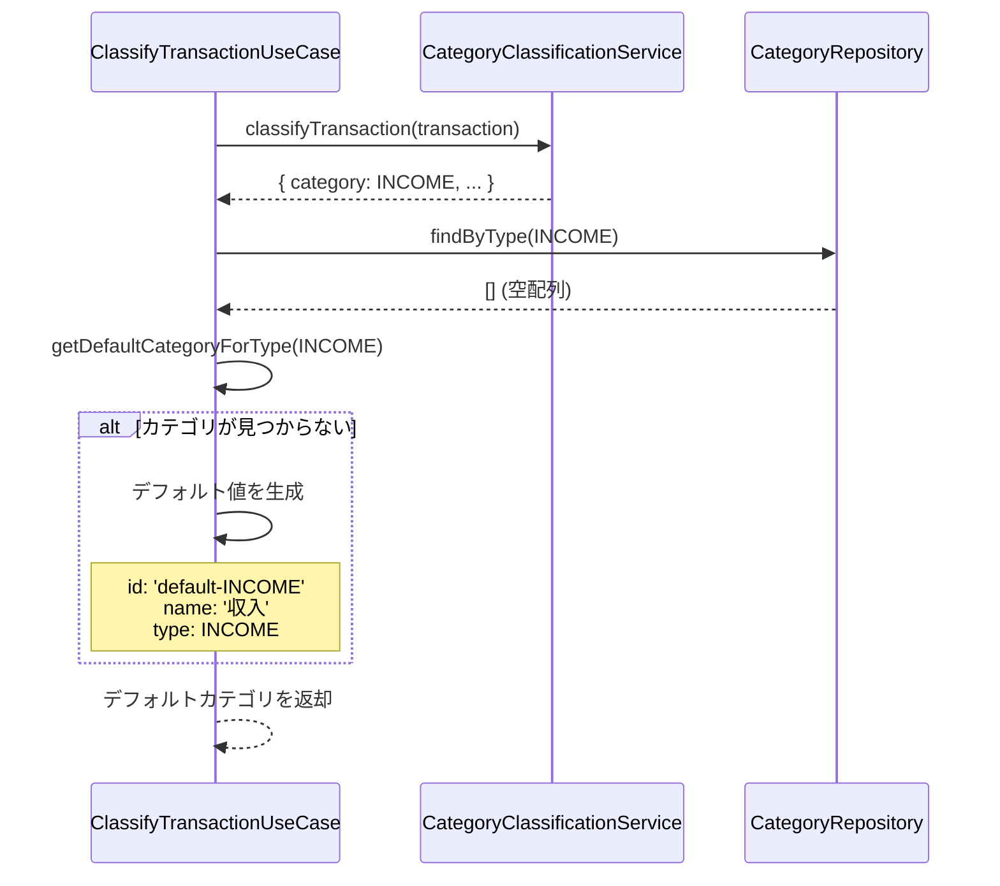
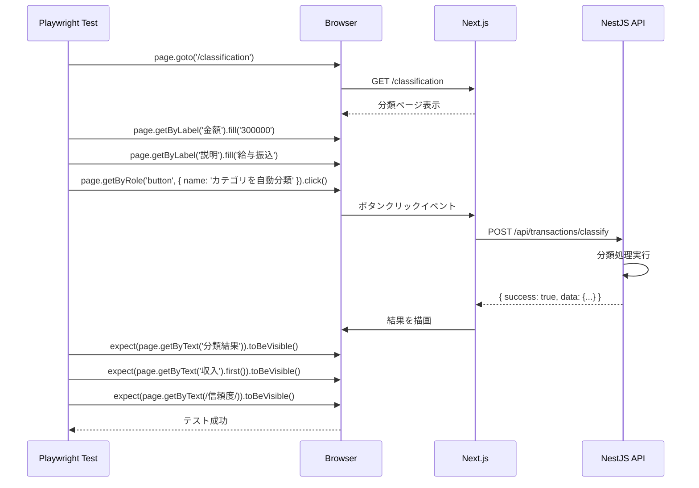
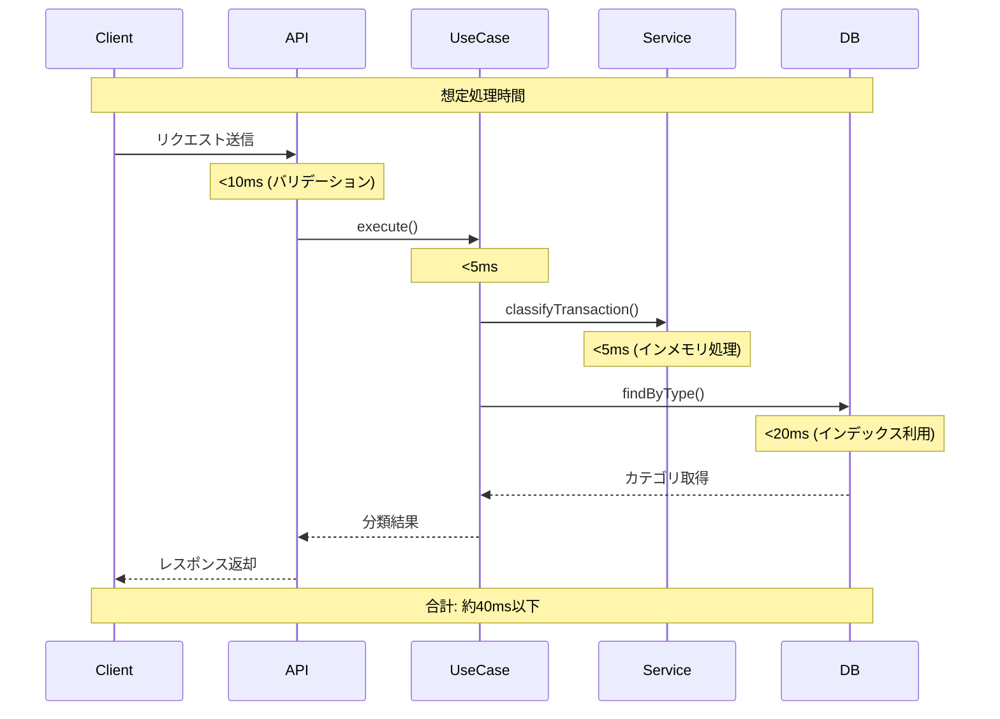

# シーケンス図 - FR-008-011: 取引データの主要カテゴリ自動分類

## 正常系: 分類リクエストの全体フロー

### 金融機関タイプによる分類（信頼度: high）

---

## 正常系: キーワードマッチングによる分類（信頼度: medium）

---

## 正常系: 金額ベース分類（信頼度: low）

---

## 正常系: キーワード評価順序による正しい分類

---

## 異常系: バリデーションエラー

---

## 異常系: カテゴリが見つからない

---

## E2Eテストフロー

---

## 処理時間とパフォーマンス

### 分類処理の時間計測

---

## チェックリスト

- [x] 正常系の主要フローを記載
- [x] 金融機関タイプによる分類フロー
- [x] キーワードマッチングによる分類フロー
- [x] 金額ベース分類フロー
- [x] キーワード評価順序の説明
- [x] 異常系のフロー（バリデーションエラー）
- [x] 異常系のフロー（カテゴリ未検出）
- [x] E2Eテストフロー
- [x] パフォーマンス計測の考慮
- [x] エラーハンドリングの記載
