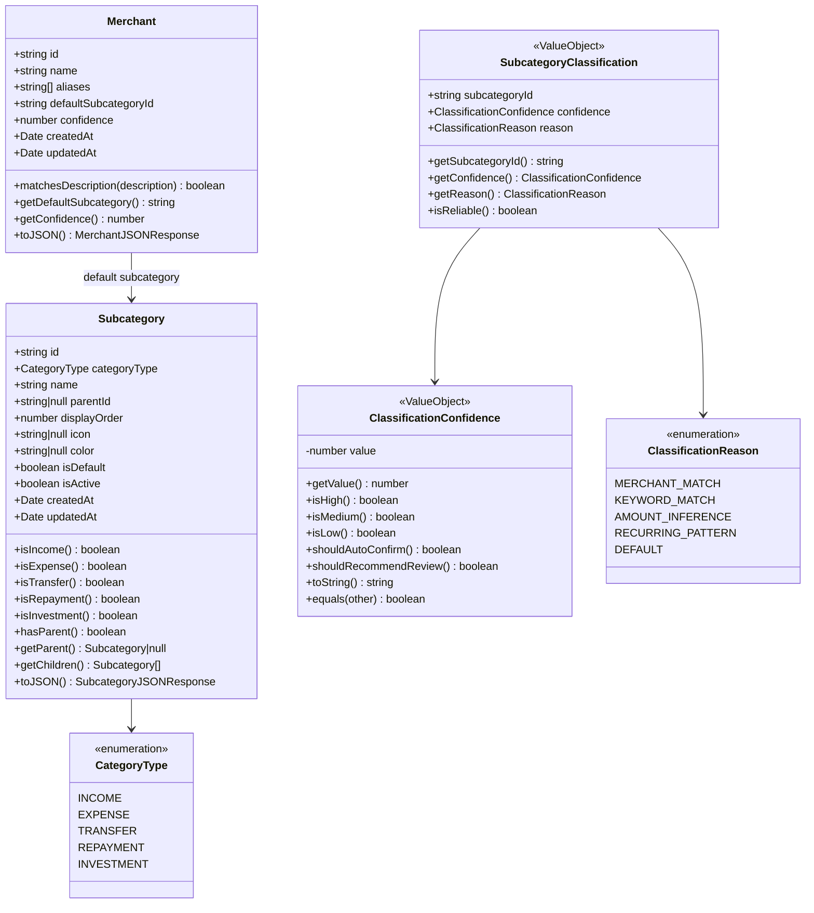
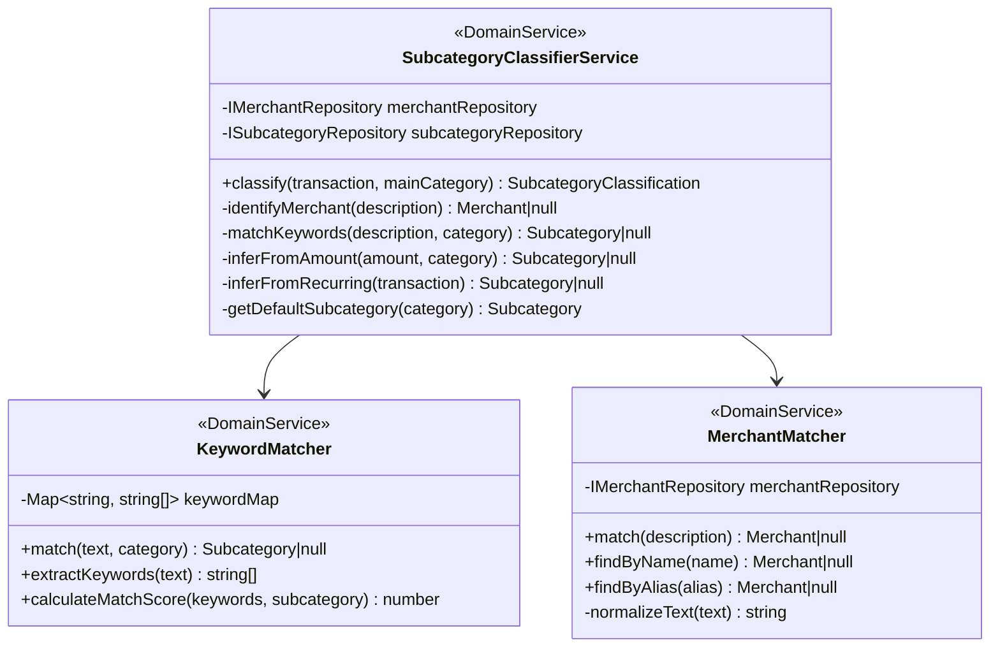
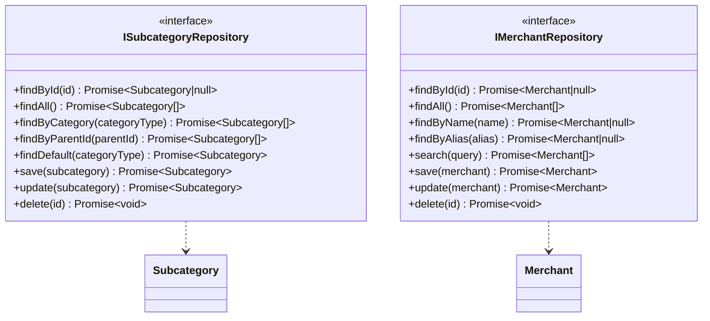
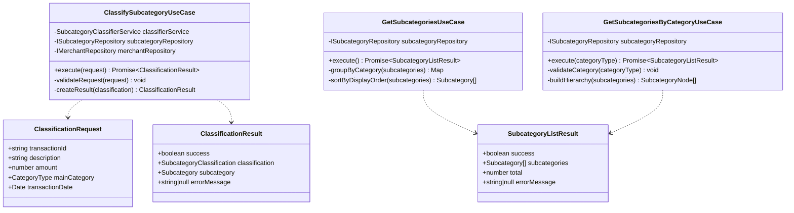
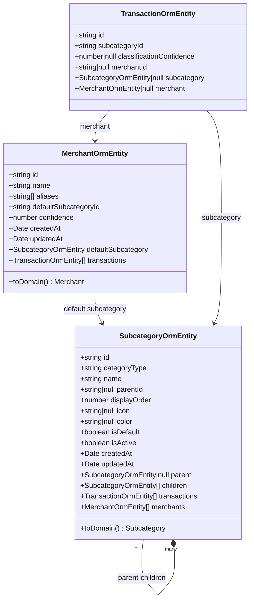
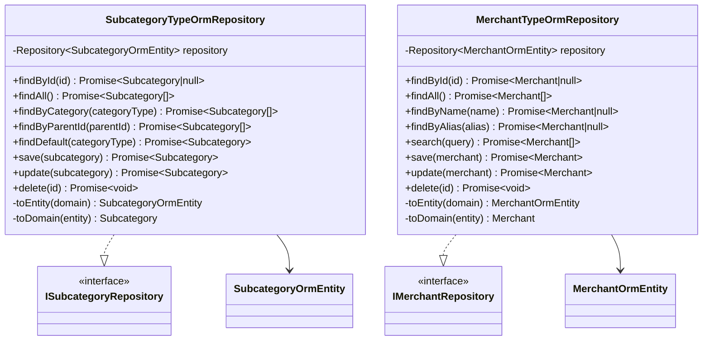
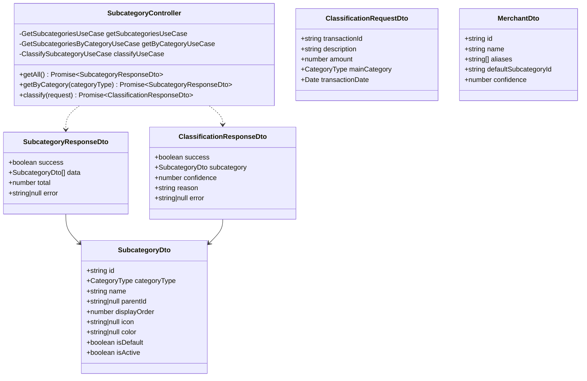
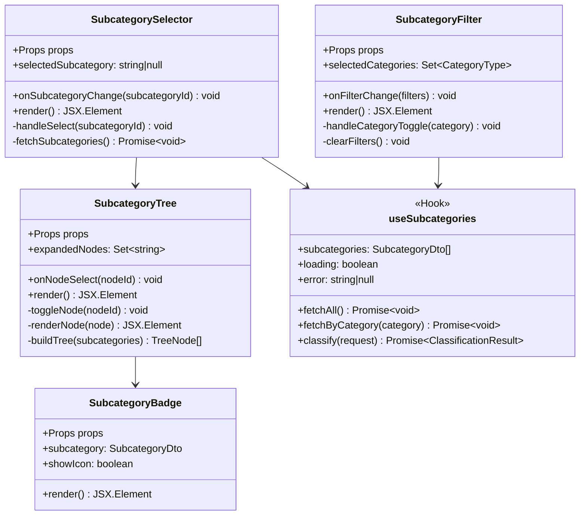
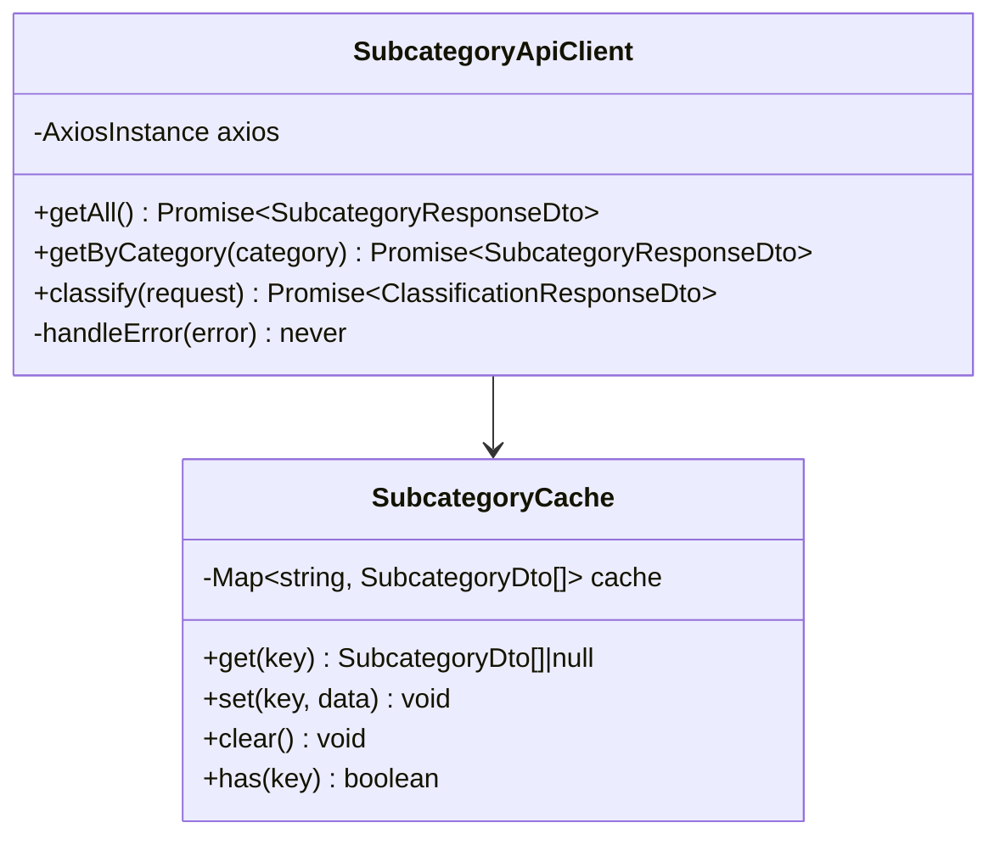
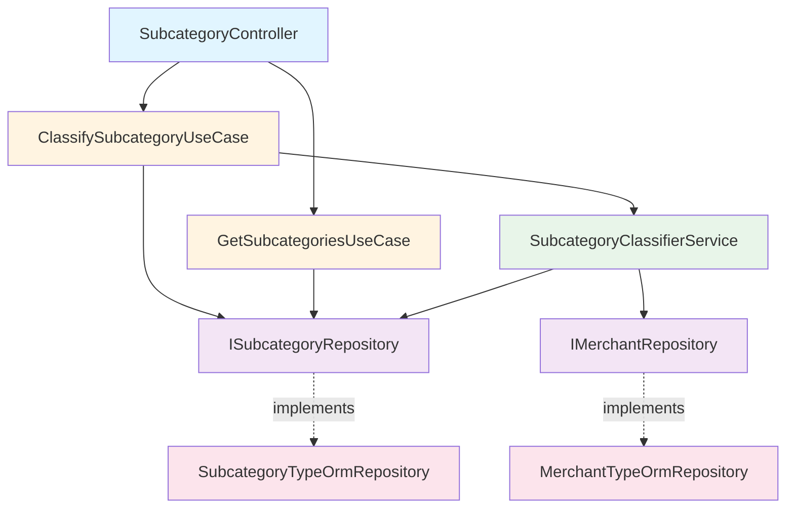

# クラス図

このドキュメントでは、詳細費目分類機能のクラス構造を記載しています。

## 目次

1. [Domain層クラス図](#domain層クラス図)
2. [Application層クラス図](#application層クラス図)
3. [Infrastructure層クラス図](#infrastructure層クラス図)
4. [Presentation層クラス図](#presentation層クラス図)
5. [Frontend コンポーネント図](#frontendコンポーネント図)

---

## Domain層クラス図

### Subcategory Entity & Value Objects

### Domain Services

### Repository Interfaces

---

## Application層クラス図

### Use Cases

---

## Infrastructure層クラス図

### TypeORM Entities

### Repository Implementations

---

## Presentation層クラス図

### Controllers & DTOs

---

## Frontendコンポーネント図

### React Components

### API Client

---

## クラス間の主要な関連

### 依存関係の全体像

---

## 設計原則

### Onion Architectureの遵守

1. **依存関係の方向**: 外側から内側へ（Presentation → Application → Domain）
2. **ドメイン層の独立性**: Domainは他のレイヤに依存しない
3. **インターフェース分離**: Repositoryはインターフェースで定義

### SOLID原則

- **単一責任**: 各クラスは一つの責任のみを持つ
- **開放閉鎖**: 拡張に対して開いて、修正に対して閉じている
- **リスコフ置換**: 派生クラスは基底クラスと置換可能
- **インターフェース分離**: 使用しないメソッドへの依存を強制しない
- **依存性逆転**: 抽象に依存し、具象に依存しない

### DDD (Domain-Driven Design)

- **Entity**: IDで識別される（Subcategory, Merchant）
- **Value Object**: 値で識別される（ClassificationConfidence）
- **Domain Service**: エンティティに属さないビジネスロジック（SubcategoryClassifierService）
- **Repository**: 永続化の抽象化

---

## 拡張性

### 将来の拡張ポイント

1. **カスタム費目追加（FR-011）**
   - `Subcategory`に`userId`フィールドを追加
   - ユーザー固有のサブカテゴリをサポート

2. **機械学習ベース分類**
   - `MLClassifierService`を追加
   - `SubcategoryClassifierService`から呼び出し

3. **多言語対応**
   - `SubcategoryTranslation`エンティティを追加
   - ロケールごとの名称管理

4. **階層の拡張**
   - `parentId`を使用した多段階階層
   - 無限ループ防止の検証ロジック

---

## 参考資料

- [README.md](./README.md) - 設計書の概要
- [sequence-diagrams.md](./sequence-diagrams.md) - 処理フロー
- [input-output-design.md](./input-output-design.md) - API仕様
