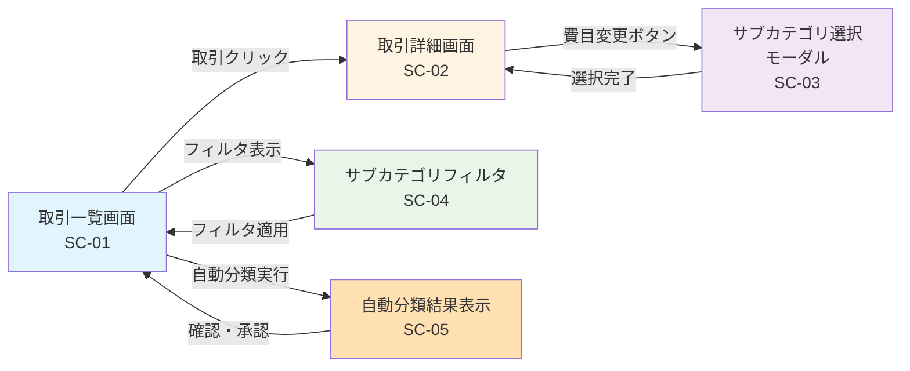

# 画面遷移

このドキュメントでは、詳細費目分類機能のUI画面遷移とワイヤーフレームを記載しています。

## 目次

1. [画面一覧](#画面一覧)
2. [画面遷移図](#画面遷移図)
3. [画面詳細](#画面詳細)
4. [コンポーネント構成](#コンポーネント構成)
5. [レスポンシブ対応](#レスポンシブ対応)

---

## 画面一覧

| 画面ID | 画面名                   | 説明                           | パス                     |
| ------ | ------------------------ | ------------------------------ | ------------------------ |
| SC-01  | 取引一覧画面             | 取引一覧とサブカテゴリ表示     | `/transactions`          |
| SC-02  | 取引詳細画面             | 取引の詳細とサブカテゴリ編集   | `/transactions/:id`      |
| SC-03  | サブカテゴリ選択モーダル | サブカテゴリを階層表示して選択 | モーダル                 |
| SC-04  | サブカテゴリフィルタ     | カテゴリ別にフィルタリング     | サイドバー               |
| SC-05  | 自動分類結果表示         | 自動分類された取引の確認・承認 | `/transactions/classify` |

---

## 画面遷移図



---

## 画面詳細

### SC-01: 取引一覧画面

**概要**: 取引一覧を表示し、各取引のサブカテゴリを確認できます。

**主要機能**:

- 取引一覧の表示（テーブル形式）
- サブカテゴリフィルタ
- 一括自動分類ボタン
- 検索・並び替え

**ワイヤーフレーム**:

```
┌─────────────────────────────────────────────────────────────────┐
│ 家計簿アプリ                                    [ユーザーメニュー] │
├─────────────────────────────────────────────────────────────────┤
│ 📊 ダッシュボード  💰 取引  📁 カテゴリ  ⚙️ 設定                │
├─────────────────────────────────────────────────────────────────┤
│                                                                   │
│ ┌─────────────────────────────────────────────────────────────┐ │
│ │ 取引一覧                              [🤖 一括自動分類]      │ │
│ └─────────────────────────────────────────────────────────────┘ │
│                                                                   │
│ ┌────────┐  ┌─────────────────────────────────────────────────┐│
│ │フィルタ │  │ 検索: [________________] 📅 期間: [今月▼]      ││
│ │        │  │                                                  ││
│ │□ 食費  │  │ 日付     │ 説明            │ 金額    │ 費目     ││
│ │ □ 食料品│  ├──────────┼─────────────────┼─────────┼─────────┤│
│ │ □ 外食  │  │ 11/24   │ スターバックス   │ -450円  │ ☕ カフェ││
│ │ □ カフェ│  │          │ 表参道店         │         │          ││
│ │□ 日用品│  ├──────────┼─────────────────┼─────────┼─────────┤│
│ │□ 交通費│  │ 11/23   │ セブンイレブン   │ -980円  │ 🛒 食料品││
│ │□ 住居  │  │          │                  │         │          ││
│ │        │  ├──────────┼─────────────────┼─────────┼─────────┤│
│ │        │  │ 11/22   │ JR東日本 定期券  │-10,000円│ 🚃 電車  ││
│ │        │  │          │                  │         │ [信頼度:80%] │
│ │        │  ├──────────┼─────────────────┼─────────┼─────────┤│
│ │        │  │ ...      │ ...              │ ...     │ ...      ││
│ └────────┘  └─────────────────────────────────────────────────┘│
│                                                                   │
│                                      [前へ] 1/10 [次へ]          │
└─────────────────────────────────────────────────────────────────┘
```

**UI要素**:

| 要素                 | タイプ   | 説明                               |
| -------------------- | -------- | ---------------------------------- |
| 検索ボックス         | Input    | 取引説明で検索                     |
| 期間選択             | Dropdown | 今月・先月・今年など               |
| フィルタサイドバー   | Sidebar  | サブカテゴリでフィルタ             |
| 取引テーブル         | Table    | 取引一覧                           |
| サブカテゴリバッジ   | Badge    | アイコン + 名称（例: "☕ カフェ"） |
| 信頼度インジケーター | Badge    | 80%未満の場合警告表示              |
| 一括自動分類ボタン   | Button   | 未分類の取引を一括で自動分類       |

---

### SC-02: 取引詳細画面

**概要**: 取引の詳細情報を表示し、サブカテゴリを手動で変更できます。

**主要機能**:

- 取引詳細情報表示
- サブカテゴリの手動変更
- 分類信頼度の表示
- 店舗情報の表示（該当する場合）

**ワイヤーフレーム**:

```
┌─────────────────────────────────────────────────────────────────┐
│ ← 取引一覧へ戻る                                                  │
├─────────────────────────────────────────────────────────────────┤
│                                                                   │
│ ┌─────────────────────────────────────────────────────────────┐ │
│ │ 取引詳細                                                      │ │
│ └─────────────────────────────────────────────────────────────┘ │
│                                                                   │
│ ┌───────────────────────────────────────────┐                   │
│ │ 日付: 2025年11月24日 (日)                   │                   │
│ │ 時刻: 10:30                                │                   │
│ ├───────────────────────────────────────────┤                   │
│ │ 説明: スターバックス 表参道店              │                   │
│ ├───────────────────────────────────────────┤                   │
│ │ 金額: ¥-450                                │                   │
│ │ カテゴリ: 支出                             │                   │
│ ├───────────────────────────────────────────┤                   │
│ │ 📁 費目                                    │                   │
│ │ ┌─────────────────────────────────────┐  │                   │
│ │ │ ☕ カフェ                  [変更]    │  │                   │
│ │ └─────────────────────────────────────┘  │                   │
│ │ 🤖 自動分類: 店舗マスタ一致                │                   │
│ │ 📊 信頼度: 98%                             │                   │
│ │ 🏪 店舗: スターバックス                    │                   │
│ ├───────────────────────────────────────────┤                   │
│ │ 取引元: 三菱UFJ銀行 (普通 1234567)         │                   │
│ └───────────────────────────────────────────┘                   │
│                                                                   │
│                               [保存] [キャンセル]                 │
└─────────────────────────────────────────────────────────────────┘
```

**UI要素**:

| 要素             | タイプ       | 説明                               |
| ---------------- | ------------ | ---------------------------------- |
| サブカテゴリ表示 | Badge        | 現在のサブカテゴリ                 |
| 変更ボタン       | Button       | サブカテゴリ選択モーダルを開く     |
| 自動分類理由     | Text         | MERCHANT_MATCH → "店舗マスタ一致"  |
| 信頼度表示       | Progress Bar | 0-100%をバーで表示                 |
| 店舗名表示       | Text         | 店舗マスタにヒットした場合のみ表示 |

---

### SC-03: サブカテゴリ選択モーダル

**概要**: サブカテゴリを階層表示し、ユーザーが選択できます。

**主要機能**:

- カテゴリタブ切り替え（収入・支出・振替・返済・投資）
- 階層表示（ツリー形式）
- 最近使用した費目の優先表示
- 検索機能

**ワイヤーフレーム**:

```
┌───────────────────────────────────────────────────────────┐
│ サブカテゴリを選択                                  [✕]   │
├───────────────────────────────────────────────────────────┤
│                                                             │
│ [収入] [支出] [振替] [返済] [投資]   ← タブ              │
│                                                             │
│ 検索: [________________] 🔍                                │
│                                                             │
│ ┌─────────────────────────────────────────────────────┐  │
│ │ ⭐ 最近使用した費目                                  │  │
│ │ ┌─────────┐ ┌─────────┐ ┌─────────┐             │  │
│ │ │ ☕ カフェ │ │ 🛒 食料品│ │ 🚃 電車  │             │  │
│ │ └─────────┘ └─────────┘ └─────────┘             │  │
│ └─────────────────────────────────────────────────────┘  │
│                                                             │
│ ┌─────────────────────────────────────────────────────┐  │
│ │ すべての費目                                         │  │
│ │                                                       │  │
│ │ ▼ 🍔 食費                                            │  │
│ │   ├─ 🛒 食料品                                       │  │
│ │   ├─ 🍽️ 外食                                        │  │
│ │   └─ ☕ カフェ                                       │  │
│ │                                                       │  │
│ │ ▼ 🏠 日用品                                          │  │
│ │   ├─ 🧴 生活用品                                     │  │
│ │   └─ 👕 衣類                                         │  │
│ │                                                       │  │
│ │ ▶ 🏡 住居                                            │  │
│ │ ▶ 💡 水道・光熱費                                    │  │
│ │ ▶ 📱 通信費                                          │  │
│ │ ▶ 🚃 交通費                                          │  │
│ │ ▶ 🚗 自動車                                          │  │
│ │ ...                                                   │  │
│ └─────────────────────────────────────────────────────┘  │
│                                                             │
│                                       [キャンセル] [選択]  │
└───────────────────────────────────────────────────────────┘
```

**UI要素**:

| 要素                 | タイプ    | 説明                                     |
| -------------------- | --------- | ---------------------------------------- |
| カテゴリタブ         | Tabs      | 5つのカテゴリを切り替え                  |
| 検索ボックス         | Input     | サブカテゴリ名で検索                     |
| 最近使用エリア       | Card Grid | よく使う費目を3-5個表示                  |
| ツリー表示           | Tree View | 階層構造で表示（▶/▼で展開・折りたたみ） |
| サブカテゴリアイテム | Tree Node | クリックで選択                           |

**インタラクション**:

1. ユーザーがカテゴリタブを選択
2. 該当カテゴリのサブカテゴリをツリー表示
3. ▶ をクリックで展開、▼ をクリックで折りたたみ
4. サブカテゴリをクリックで選択
5. [選択] ボタンで確定、モーダルを閉じる

---

### SC-04: サブカテゴリフィルタ（サイドバー）

**概要**: 取引一覧をサブカテゴリでフィルタリングします。

**主要機能**:

- チェックボックスで複数選択
- カテゴリ別グルーピング
- フィルタのクリア

**ワイヤーフレーム**:

```
┌──────────────────────┐
│ フィルタ             │
├──────────────────────┤
│                      │
│ [すべてクリア]       │
│                      │
│ ▼ 食費               │
│   ☑ 食料品 (25)      │
│   ☐ 外食 (12)        │
│   ☐ カフェ (8)       │
│                      │
│ ▼ 日用品             │
│   ☐ 生活用品 (5)     │
│   ☐ 衣類 (3)         │
│                      │
│ ▶ 住居               │
│ ▶ 水道・光熱費       │
│ ▶ 通信費             │
│ ▶ 交通費             │
│                      │
│ ...                  │
│                      │
└──────────────────────┘
```

**UI要素**:

| 要素             | タイプ    | 説明                 |
| ---------------- | --------- | -------------------- |
| クリアボタン     | Button    | 全選択解除           |
| カテゴリグループ | Accordion | 展開・折りたたみ可能 |
| チェックボックス | Checkbox  | サブカテゴリの選択   |
| 件数表示         | Badge     | 該当する取引件数     |

---

### SC-05: 自動分類結果表示

**概要**: 一括自動分類の結果を表示し、確認・承認できます。

**主要機能**:

- 分類結果一覧
- 信頼度別グルーピング
- 個別編集
- 一括承認

**ワイヤーフレーム**:

```
┌─────────────────────────────────────────────────────────────────┐
│ 自動分類結果                                            [✕ 閉じる] │
├─────────────────────────────────────────────────────────────────┤
│                                                                   │
│ ┌─────────────────────────────────────────────────────────────┐ │
│ │ 📊 分類完了: 100件                                            │ │
│ │ ✅ 高信頼度 (90%以上): 75件                                   │ │
│ │ ⚠️  中信頼度 (70-89%): 20件                                   │ │
│ │ ❌ 低信頼度 (70%未満): 5件                                    │ │
│ └─────────────────────────────────────────────────────────────┘ │
│                                                                   │
│ ┌─────────────────────────────────────────────────────────────┐ │
│ │ ✅ 高信頼度 (75件)                                            │ │
│ │ ─────────────────────────────────────────────────────────── │ │
│ │ 11/24 │ スターバックス      │ -450円  │ ☕ カフェ │ 98%    │ │
│ │ 11/23 │ セブンイレブン      │ -980円  │ 🛒 食料品│ 95%    │ │
│ │ ...                                                           │ │
│ └─────────────────────────────────────────────────────────────┘ │
│                                                                   │
│ ┌─────────────────────────────────────────────────────────────┐ │
│ │ ⚠️  中信頼度 (20件) - 要確認                                   │ │
│ │ ─────────────────────────────────────────────────────────── │ │
│ │ 11/22 │ JR東日本 定期券     │-10,000円│ 🚃 電車  │ 80% [編集]│ │
│ │ 11/21 │ Amazon              │ -2,500円│ 📦 その他│ 75% [編集]│ │
│ │ ...                                                           │ │
│ └─────────────────────────────────────────────────────────────┘ │
│                                                                   │
│ ┌─────────────────────────────────────────────────────────────┐ │
│ │ ❌ 低信頼度 (5件) - 手動確認推奨                              │ │
│ │ ─────────────────────────────────────────────────────────── │ │
│ │ 11/20 │ ABC商店             │ -1,200円│ ❓ その他│ 50% [編集]│ │
│ │ ...                                                           │ │
│ └─────────────────────────────────────────────────────────────┘ │
│                                                                   │
│                     [高信頼度のみ承認] [すべて承認]              │
└─────────────────────────────────────────────────────────────────┘
```

**UI要素**:

| 要素           | タイプ    | 説明                           |
| -------------- | --------- | ------------------------------ |
| サマリーカード | Card      | 分類結果の統計                 |
| 信頼度グループ | Accordion | 信頼度別にグループ化           |
| 取引リスト     | List      | 分類された取引                 |
| 信頼度バッジ   | Badge     | パーセンテージ表示             |
| 編集ボタン     | Button    | サブカテゴリ選択モーダルを開く |
| 承認ボタン     | Button    | 分類結果を確定                 |

---

## コンポーネント構成

### 主要コンポーネント

```typescript
// サブカテゴリ選択コンポーネント
<SubcategorySelector
  selectedSubcategoryId="food_cafe"
  onSubcategoryChange={(id) => handleChange(id)}
  categoryType="EXPENSE"
/>

// サブカテゴリツリー
<SubcategoryTree
  subcategories={subcategories}
  expandedNodes={expandedNodeIds}
  onNodeSelect={(id) => handleSelect(id)}
/>

// サブカテゴリバッジ
<SubcategoryBadge
  subcategory={subcategory}
  showIcon={true}
  confidence={0.98}
/>

// サブカテゴリフィルタ
<SubcategoryFilter
  selectedCategories={selectedCategories}
  onFilterChange={(filters) => handleFilterChange(filters)}
/>

// 自動分類結果表示
<ClassificationResults
  results={results}
  onApprove={(transactionIds) => handleApprove(transactionIds)}
  onEdit={(transactionId) => handleEdit(transactionId)}
/>
```

### コンポーネント階層

```
TransactionListPage (SC-01)
├── SubcategoryFilter (SC-04)
│   ├── CategoryGroup
│   │   └── SubcategoryCheckbox
│   └── ClearButton
├── SearchBar
├── TransactionTable
│   ├── TransactionRow
│   │   ├── SubcategoryBadge
│   │   └── ConfidenceBadge
│   └── Pagination
└── BatchClassifyButton

TransactionDetailPage (SC-02)
├── TransactionInfo
├── SubcategoryDisplay
│   ├── SubcategoryBadge
│   └── ChangeButton
│       └── SubcategorySelector (SC-03)
│           ├── CategoryTabs
│           ├── SearchBox
│           ├── RecentUsed
│           └── SubcategoryTree
├── ClassificationInfo
│   ├── ReasonDisplay
│   ├── ConfidenceBar
│   └── MerchantInfo
└── ActionButtons
```

---

## レスポンシブ対応

### ブレイクポイント

| デバイス     | 幅         | 表示形式                      |
| ------------ | ---------- | ----------------------------- |
| モバイル     | < 768px    | 1カラム、サイドバーは非表示   |
| タブレット   | 768-1024px | 2カラム、サイドバー折りたたみ |
| デスクトップ | > 1024px   | 3カラム、サイドバー常時表示   |

### モバイル時の調整

**SC-01: 取引一覧画面（モバイル）**

```
┌───────────────────────┐
│ ☰  取引一覧     🔍    │
├───────────────────────┤
│ [📁 フィルタ] [🤖 分類]│
├───────────────────────┤
│ ┌───────────────────┐ │
│ │ 11/24  10:30      │ │
│ │ スターバックス    │ │
│ │ ☕ カフェ   -¥450 │ │
│ │ 信頼度: 98%       │ │
│ └───────────────────┘ │
│ ┌───────────────────┐ │
│ │ 11/23  14:20      │ │
│ │ セブンイレブン    │ │
│ │ 🛒 食料品   -¥980 │ │
│ │ 信頼度: 95%       │ │
│ └───────────────────┘ │
│ ┌───────────────────┐ │
│ │ 11/22  08:15      │ │
│ │ JR東日本 定期券   │ │
│ │ 🚃 電車 -¥10,000  │ │
│ │ 信頼度: 80% ⚠️     │ │
│ └───────────────────┘ │
│                       │
│   [もっと見る]        │
└───────────────────────┘
```

- テーブルをカード形式に変更
- フィルタはボトムシートで表示
- タップでモーダル表示

---

## アクセシビリティ

### キーボードナビゲーション

- Tab キー: フォーカス移動
- Enter / Space: 選択・実行
- Esc: モーダルを閉じる
- ↑↓: リスト内の移動

### スクリーンリーダー対応

- `aria-label` でボタンの説明
- `role="tree"` でツリー構造を明示
- フォーカス時に音声案内

---

## 参考資料

- [README.md](./README.md) - 設計書の概要
- [class-diagrams.md](./class-diagrams.md) - クラス構造
- [sequence-diagrams.md](./sequence-diagrams.md) - 処理フロー
- [input-output-design.md](./input-output-design.md) - API仕様
