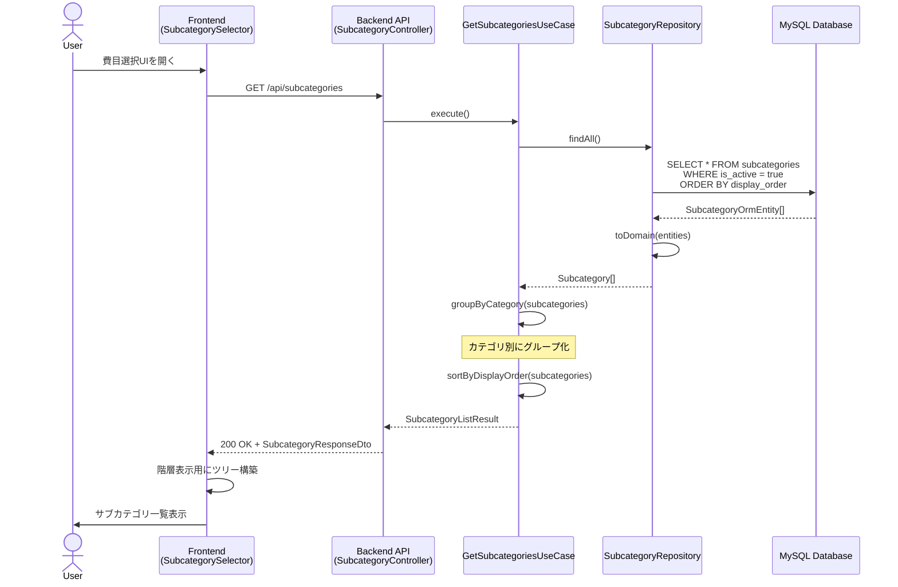
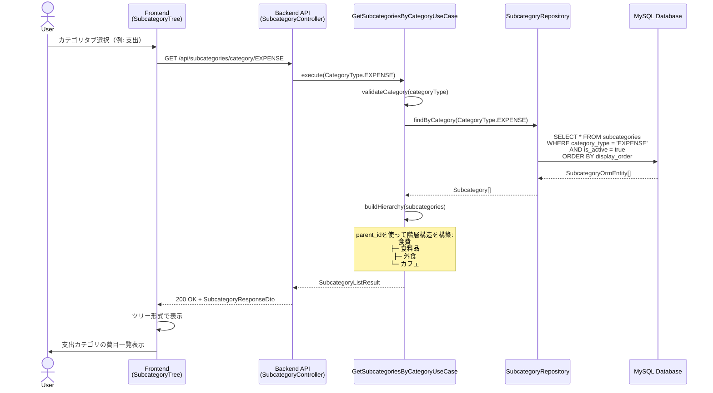
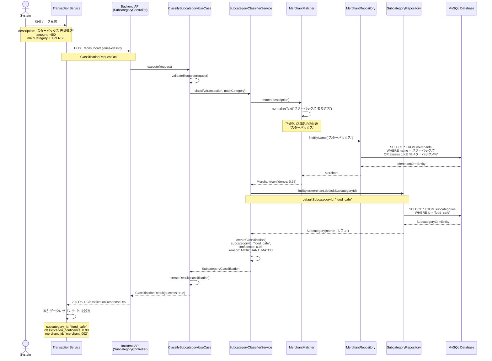
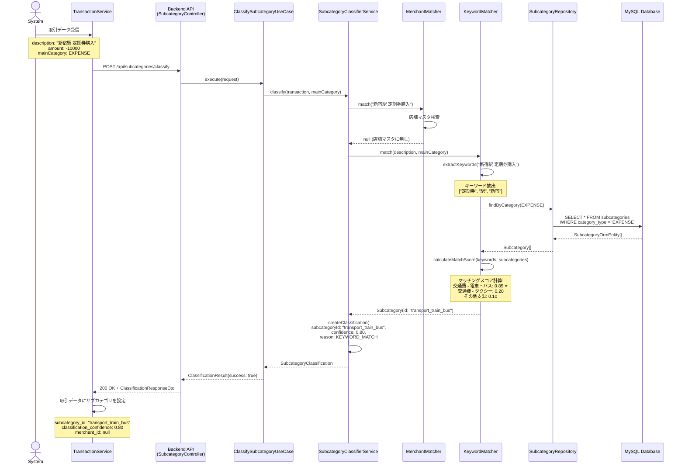
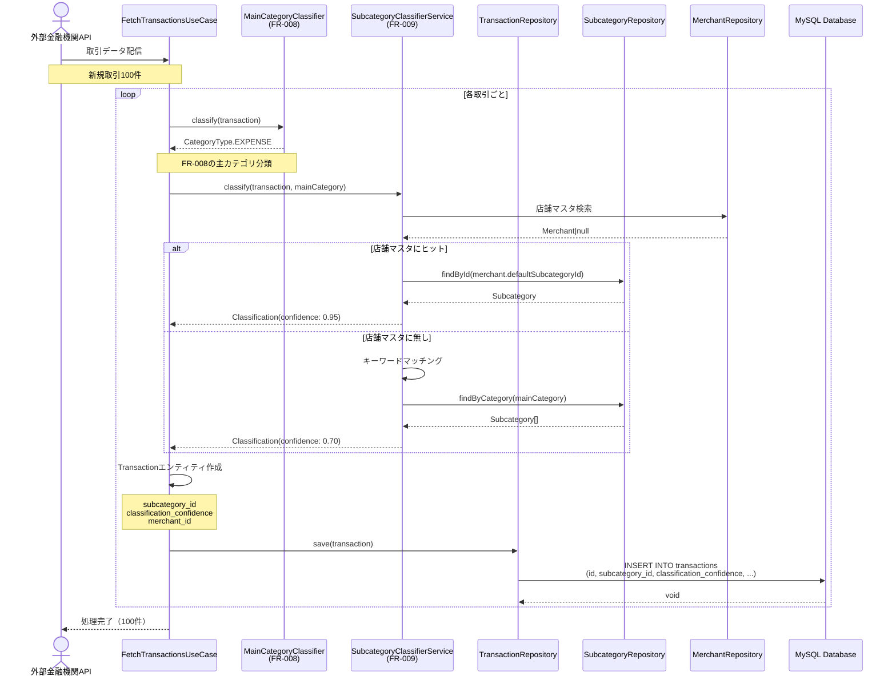
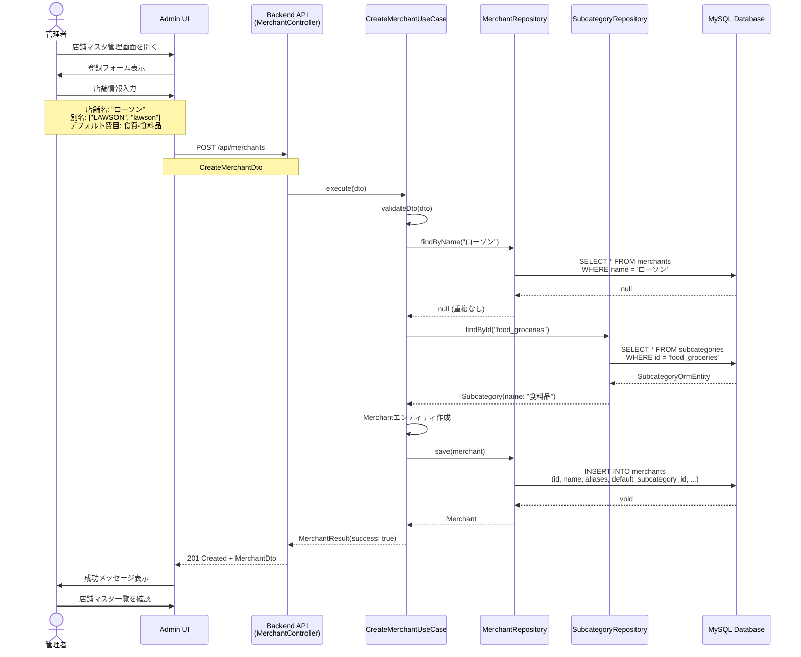
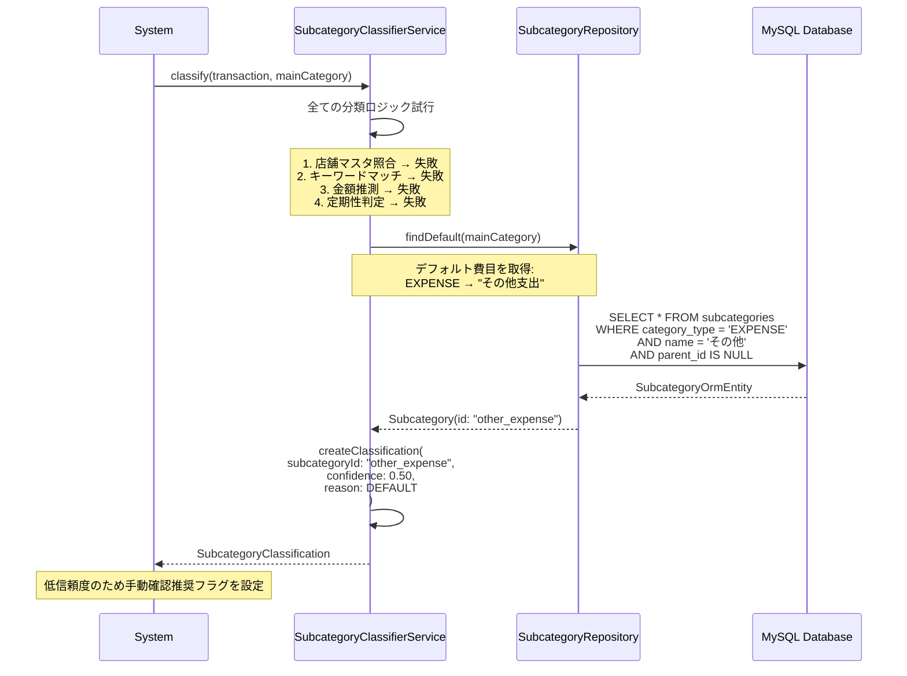
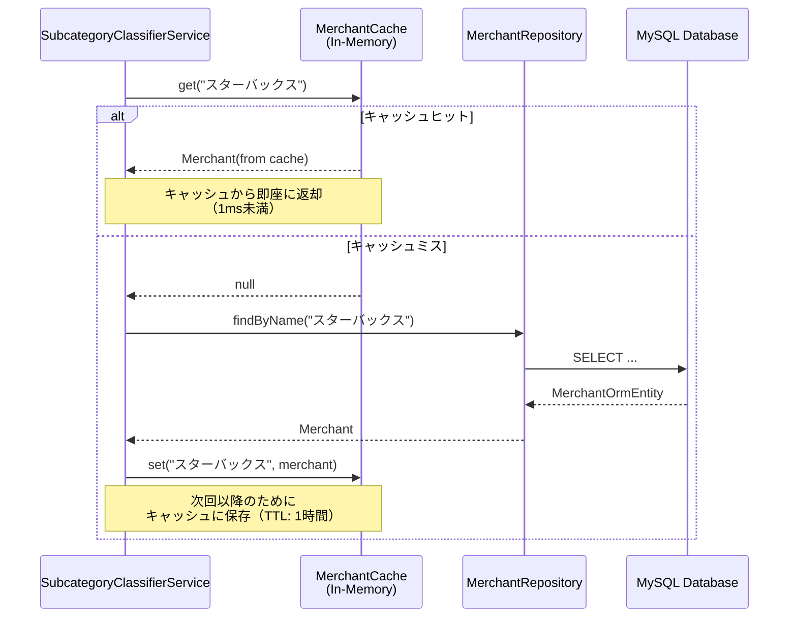

# シーケンス図

このドキュメントでは、詳細費目分類機能の主要な処理フローをシーケンス図で記載しています。

## 目次

1. [サブカテゴリ一覧取得フロー](#サブカテゴリ一覧取得フロー)
2. [カテゴリ別サブカテゴリ取得フロー](#カテゴリ別サブカテゴリ取得フロー)
3. [詳細費目自動分類フロー（店舗マスタ照合）](#詳細費目自動分類フロー店舗マスタ照合)
4. [詳細費目自動分類フロー（キーワードマッチング）](#詳細費目自動分類フローキーワードマッチング)
5. [取引データへのサブカテゴリ適用フロー](#取引データへのサブカテゴリ適用フロー)
6. [店舗マスタ登録フロー](#店舗マスタ登録フロー)

---

## サブカテゴリ一覧取得フロー

### 全サブカテゴリ取得

---

## カテゴリ別サブカテゴリ取得フロー

### 特定カテゴリのサブカテゴリ取得

---

## 詳細費目自動分類フロー（店舗マスタ照合）

### 店舗名からサブカテゴリを推測

---

## 詳細費目自動分類フロー（キーワードマッチング）

### キーワードからサブカテゴリを推測（店舗マスタに無い場合）

---

## 取引データへのサブカテゴリ適用フロー

### 新規取引受信時の自動分類

---

## 店舗マスタ登録フロー

### 新しい店舗をマスタに追加（管理者機能）

---

## エラー処理フロー

### サブカテゴリが見つからない場合

---

## パフォーマンス最適化

### 店舗マスタのキャッシュ利用

---

## 注意事項

### 並行処理

- バッチ分類時は複数トランザクションを並行処理
- 店舗マスタとサブカテゴリマスタはイミュータブルとして扱う

### トランザクション管理

- 取引データへのサブカテゴリ適用はトランザクション内で実行
- ロールバック時はサブカテゴリ情報もクリア

### キャッシュ戦略

- 店舗マスタ: インメモリキャッシュ（1時間TTL）
- サブカテゴリマスタ: アプリケーション起動時にロード

---

## 参考資料

- [README.md](./README.md) - 設計書の概要
- [class-diagrams.md](./class-diagrams.md) - クラス構造
- [input-output-design.md](./input-output-design.md) - API仕様
