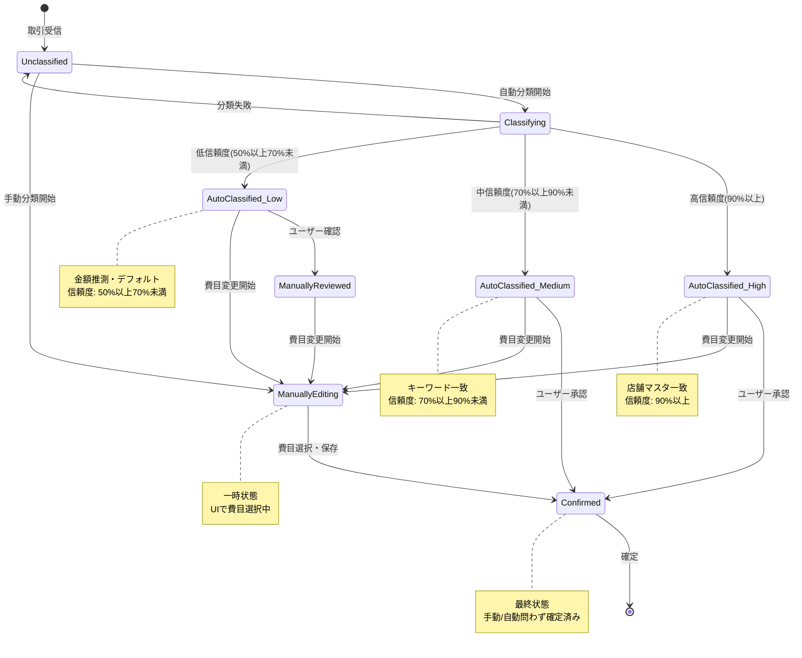
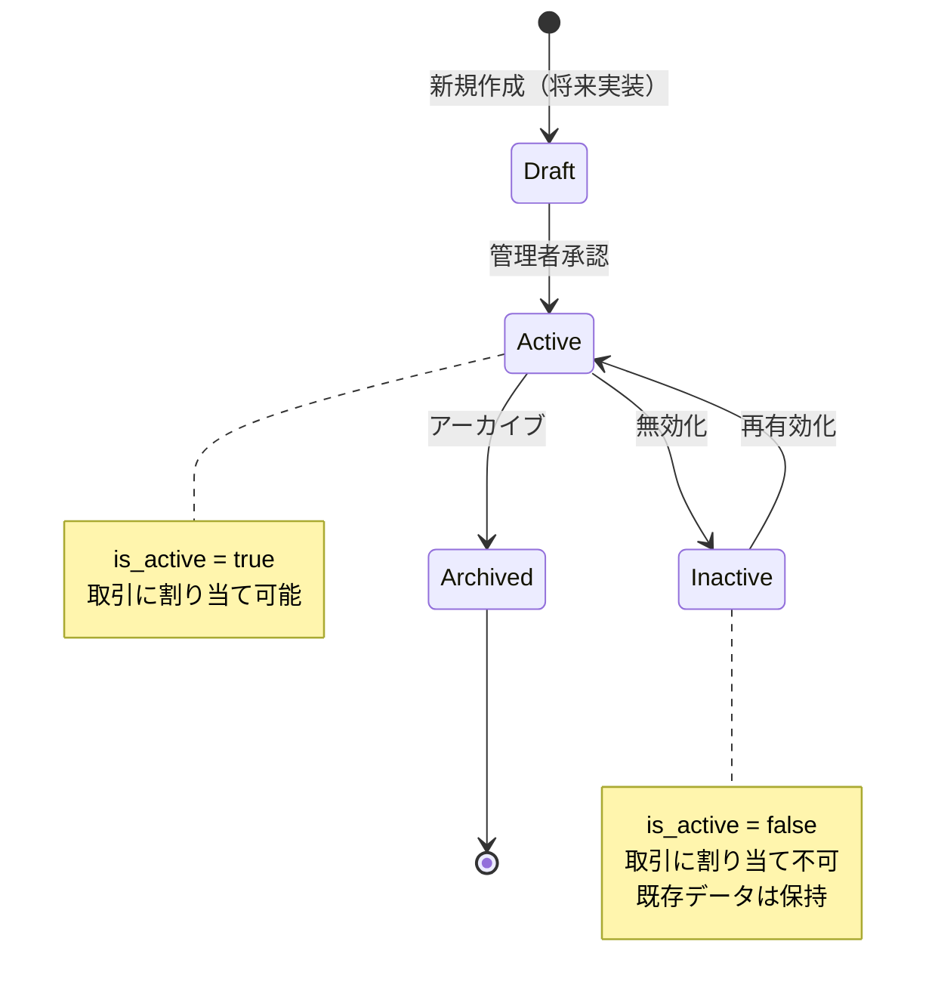
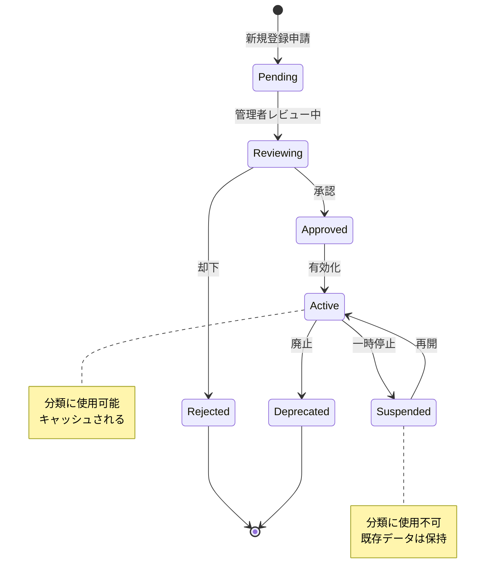

# 状態遷移

このドキュメントでは、詳細費目分類機能の状態管理とデータライフサイクルを記載しています。

## 目次

1. [状態遷移図](#状態遷移図)
2. [サブカテゴリの状態](#サブカテゴリの状態)
3. [取引の分類状態](#取引の分類状態)
4. [店舗マスタの状態](#店舗マスタの状態)
5. [フロントエンド状態管理](#フロントエンド状態管理)
6. [キャッシュ戦略](#キャッシュ戦略)

---

## 状態遷移図

### 取引の分類状態



**状態の説明**:

- `Unclassified`: 未分類（初期状態）
- `Classifying`: 分類処理中（一時状態）
- `AutoClassified_*`: 自動分類完了（信頼度別）
- `ManuallyReviewed`: ユーザーが確認中（一時状態）
- `ManuallyEditing`: ユーザーが編集中（一時状態）
- `Confirmed`: 確定済み（最終状態）- 手動/自動問わず確定されたすべての取引

### サブカテゴリのライフサイクル



### 店舗マスタの状態



---

## サブカテゴリの状態

### 状態定義

| 状態     | 値            | 説明                                 | is_active | is_default |
| -------- | ------------- | ------------------------------------ | --------- | ---------- |
| Active   | `true/true`   | アクティブなデフォルト費目           | true      | true       |
| Active   | `true/false`  | アクティブなカスタム費目（将来実装） | true      | false      |
| Inactive | `false/true`  | 無効化されたデフォルト費目           | false     | true       |
| Inactive | `false/false` | 無効化されたカスタム費目             | false     | false      |
| Archived | -             | アーカイブ済み（削除フラグ）         | false     | -          |

### 状態遷移の条件

| 遷移元   | 遷移先   | 条件                              | 実行者 |
| -------- | -------- | --------------------------------- | ------ |
| Active   | Inactive | 使用頻度が低い、または管理者判断  | 管理者 |
| Inactive | Active   | 再有効化リクエスト                | 管理者 |
| Active   | Archived | 削除リクエスト（取引データが0件） | 管理者 |
| Inactive | Archived | 削除リクエスト（取引データが0件） | 管理者 |

### ビジネスルール

1. **デフォルト費目の保護**:
   - `is_default = true` の費目は削除不可
   - 無効化のみ可能

2. **取引データへの影響**:
   - Inactive状態でも既存の取引データは保持される
   - 新規分類時には使用されない

3. **階層構造の整合性**:
   - 親カテゴリを無効化すると子カテゴリも自動的に無効化
   - 子カテゴリが存在する親カテゴリは削除不可

---

## 取引の分類状態

### 状態定義

| 状態                  | 説明                             | confidence       | reason                    |
| --------------------- | -------------------------------- | ---------------- | ------------------------- |
| Unclassified          | 未分類                           | null             | null                      |
| Classifying           | 分類処理中（一時状態）           | -                | -                         |
| AutoClassified_High   | 自動分類（高信頼度）             | 0.90以上         | MERCHANT_MATCH            |
| AutoClassified_Medium | 自動分類（中信頼度）             | 0.70以上0.90未満 | KEYWORD_MATCH             |
| AutoClassified_Low    | 自動分類（低信頼度）             | 0.50以上0.70未満 | AMOUNT_INFERENCE, DEFAULT |
| ManuallyReviewed      | ユーザー確認中（一時状態）       | -                | -                         |
| ManuallyEditing       | ユーザーが費目編集中（一時状態） | -                | -                         |
| Confirmed             | 確定済み（最終状態）             | 1.00             | MANUAL または元のreason   |

### 状態遷移ルール

#### 自動分類 → 手動編集 → 確定

```typescript
// Before (AutoClassified_High)
transaction.subcategoryId = 'food_cafe';
transaction.classificationConfidence = 0.98;
transaction.classificationReason = 'MERCHANT_MATCH';

// User starts editing → ManuallyEditing (一時状態)

// User selects and saves → Confirmed
transaction.subcategoryId = 'food_dining_out'; // 変更
transaction.classificationConfidence = 1.0; // 手動確定
transaction.classificationReason = 'MANUAL'; // 理由更新
transaction.confirmedAt = new Date(); // 確定日時記録
```

#### 自動分類 → 承認 → 確定

```typescript
// Before (AutoClassified_High)
transaction.subcategoryId = 'food_cafe';
transaction.classificationConfidence = 0.98;
transaction.classificationReason = 'MERCHANT_MATCH';

// User approves → Confirmed
transaction.classificationConfidence = 1.0; // 信頼度を100%に
transaction.classificationReason = 'MERCHANT_MATCH'; // 理由は保持
transaction.confirmedAt = new Date(); // 確定日時記録
```

### データベース表現

```sql
-- 取引テーブルのカラム
CREATE TABLE transactions (
  id VARCHAR(50) PRIMARY KEY,
  subcategory_id VARCHAR(50),
  classification_confidence DECIMAL(3,2), -- 0.00 - 1.00
  classification_reason ENUM(
    'MERCHANT_MATCH',
    'KEYWORD_MATCH',
    'AMOUNT_INFERENCE',
    'RECURRING_PATTERN',
    'DEFAULT',
    'MANUAL'
  ),
  merchant_id VARCHAR(50), -- 店舗マスタID（該当する場合）
  confirmed_at TIMESTAMP NULL, -- 確定日時（手動/自動問わず）
  FOREIGN KEY (subcategory_id) REFERENCES subcategories(id),
  FOREIGN KEY (merchant_id) REFERENCES merchants(id)
);
```

**カラムの説明**:

- `classification_confidence`: 分類信頼度（0.00-1.00）、確定後は1.00
- `classification_reason`: 分類理由、手動編集の場合は'MANUAL'
- `confirmed_at`: 確定日時、NULL = 未確定、NOT NULL = 確定済み

---

## 店舗マスタの状態

### 状態定義

| 状態       | 説明       | 使用可能 | キャッシュ |
| ---------- | ---------- | -------- | ---------- |
| Pending    | 承認待ち   | ❌       | ❌         |
| Reviewing  | レビュー中 | ❌       | ❌         |
| Approved   | 承認済み   | ✅       | ✅         |
| Active     | アクティブ | ✅       | ✅         |
| Suspended  | 一時停止   | ❌       | ❌         |
| Deprecated | 廃止       | ❌       | ❌         |
| Rejected   | 却下       | ❌       | ❌         |

### ビジネスルール

1. **承認フロー（将来実装）**:
   - ユーザーが店舗マスタ追加をリクエスト → Pending
   - 管理者がレビュー → Reviewing
   - 承認 → Active / 却下 → Rejected

2. **一時停止の条件**:
   - 誤分類報告が多数
   - 店舗が閉店・サービス終了

3. **廃止の条件**:
   - 一定期間（例: 6ヶ月）使用されていない
   - 重複する店舗マスタが存在

---

## フロントエンド状態管理

### React Context / Redux State

```typescript
// サブカテゴリの状態
interface SubcategoryState {
  subcategories: SubcategoryDto[]; // 全サブカテゴリ
  byCategory: Record<CategoryType, SubcategoryDto[]>; // カテゴリ別
  hierarchy: SubcategoryTreeNode[]; // 階層構造
  recentUsed: SubcategoryDto[]; // 最近使用
  popular: SubcategoryDto[]; // よく使われる
  loading: boolean;
  error: string | null;
}

// 取引の状態
interface TransactionState {
  transactions: TransactionDto[];
  selectedTransactionId: string | null;
  filters: {
    subcategoryIds: string[];
    dateRange: [Date, Date] | null;
    searchQuery: string;
  };
  sortBy: 'date' | 'amount' | 'subcategory';
  sortOrder: 'asc' | 'desc';
  pagination: {
    page: number;
    limit: number;
    total: number;
  };
  loading: boolean;
  error: string | null;
}

// 分類の状態
interface ClassificationState {
  isClassifying: boolean; // 分類中かどうか
  results: ClassificationResult[]; // 分類結果
  summary: {
    total: number;
    highConfidence: number;
    mediumConfidence: number;
    lowConfidence: number;
  };
  error: string | null;
}

// モーダルの状態
interface ModalState {
  subcategorySelectorOpen: boolean;
  classificationResultsOpen: boolean;
  selectedCategoryType: CategoryType | null;
}
```

### 状態更新フロー

```typescript
// サブカテゴリ選択時
dispatch(selectSubcategory(subcategoryId));
// → transactions.selectedTransactionId を更新
// → API呼び出し: PUT /api/transactions/:id
// → transactions を更新

// フィルタ変更時
dispatch(updateFilter({ subcategoryIds: ['food_cafe', 'food_groceries'] }));
// → filters.subcategoryIds を更新
// → API呼び出し: GET /api/transactions?subcategories=...
// → transactions を更新

// 自動分類実行時
dispatch(classifyTransactions(transactionIds));
// → isClassifying = true
// → API呼び出し: POST /api/subcategories/batch-classify
// → results と summary を更新
// → isClassifying = false
```

---

## キャッシュ戦略

### バックエンド（インメモリ）

```typescript
// サブカテゴリマスタ: アプリケーション起動時にロード
class SubcategoryCache {
  private static instance: Map<string, Subcategory>;

  static async load() {
    const subcategories = await subcategoryRepository.findAll();
    this.instance = new Map(subcategories.map((s) => [s.id, s]));
  }

  static get(id: string): Subcategory | null {
    return this.instance.get(id) || null;
  }

  static getByCategory(categoryType: CategoryType): Subcategory[] {
    return Array.from(this.instance.values()).filter((s) => s.categoryType === categoryType);
  }
}

// 店舗マスタ: 1時間TTLのキャッシュ
class MerchantCache {
  private cache = new Map<string, { merchant: Merchant; expiresAt: number }>();
  private TTL = 60 * 60 * 1000; // 1時間

  set(name: string, merchant: Merchant) {
    this.cache.set(name, {
      merchant,
      expiresAt: Date.now() + this.TTL,
    });
  }

  get(name: string): Merchant | null {
    const cached = this.cache.get(name);
    if (!cached) return null;

    if (Date.now() > cached.expiresAt) {
      this.cache.delete(name);
      return null;
    }

    return cached.merchant;
  }

  clear() {
    this.cache.clear();
  }
}
```

### フロントエンド（React Query / SWR）

```typescript
// サブカテゴリ一覧: 無期限キャッシュ（静的データ）
const { data: subcategories } = useQuery({
  queryKey: ['subcategories'],
  queryFn: fetchSubcategories,
  staleTime: Infinity, // 永続キャッシュ
  cacheTime: Infinity,
});

// 取引一覧: 30秒キャッシュ
const { data: transactions } = useQuery({
  queryKey: ['transactions', filters],
  queryFn: () => fetchTransactions(filters),
  staleTime: 30 * 1000, // 30秒
  refetchOnWindowFocus: true,
});

// 店舗マスタ検索: 5分キャッシュ
const { data: merchants } = useQuery({
  queryKey: ['merchants', searchQuery],
  queryFn: () => searchMerchants(searchQuery),
  staleTime: 5 * 60 * 1000, // 5分
  enabled: searchQuery.length > 0,
});
```

### キャッシュ無効化

```typescript
// サブカテゴリ更新時（管理者操作）
queryClient.invalidateQueries(['subcategories']);

// 取引更新時（サブカテゴリ変更）
queryClient.invalidateQueries(['transactions']);
queryClient.invalidateQueries(['transaction', transactionId]);

// 店舗マスタ更新時（管理者操作）
queryClient.invalidateQueries(['merchants']);
```

---

## イベントログ

### 分類イベントの記録

```typescript
interface ClassificationEvent {
  eventId: string;
  transactionId: string;
  subcategoryId: string;
  confidence: number;
  reason: ClassificationReason;
  merchantId?: string;
  isManual: boolean;
  userId: string;
  timestamp: Date;
}

// ログ例
{
  "eventId": "evt_1234567890",
  "transactionId": "tx_001",
  "subcategoryId": "food_cafe",
  "confidence": 0.98,
  "reason": "MERCHANT_MATCH",
  "merchantId": "merchant_002",
  "isManual": false,
  "userId": "user_123",
  "timestamp": "2025-11-24T10:30:00.000Z"
}
```

### イベント集計（将来実装）

- 分類精度の追跡
- ユーザーの手動編集率
- 店舗マスタのヒット率
- カテゴリ別の分類信頼度

---

## データ整合性

### トランザクション管理

```typescript
// 取引へのサブカテゴリ適用（トランザクション内）
async function applySubcategoryToTransaction(
  transactionId: string,
  classification: SubcategoryClassification
) {
  const queryRunner = dataSource.createQueryRunner();
  await queryRunner.connect();
  await queryRunner.startTransaction();

  try {
    // 1. サブカテゴリの存在確認
    const subcategory = await queryRunner.manager.findOne(SubcategoryOrmEntity, {
      where: { id: classification.subcategoryId },
    });
    if (!subcategory) {
      throw new Error('Subcategory not found');
    }

    // 2. 取引の更新
    await queryRunner.manager.update(
      TransactionOrmEntity,
      { id: transactionId },
      {
        subcategoryId: classification.subcategoryId,
        classificationConfidence: classification.confidence.getValue(),
        classificationReason: classification.reason,
        merchantId: classification.merchantId,
      }
    );

    // 3. イベントログの記録
    await queryRunner.manager.insert(ClassificationEventOrmEntity, {
      transactionId,
      subcategoryId: classification.subcategoryId,
      confidence: classification.confidence.getValue(),
      reason: classification.reason,
      // ...
    });

    await queryRunner.commitTransaction();
  } catch (error) {
    await queryRunner.rollbackTransaction();
    throw error;
  } finally {
    await queryRunner.release();
  }
}
```

### 外部キー制約

```sql
-- サブカテゴリの削除を防止（取引データが存在する場合）
ALTER TABLE transactions
  ADD CONSTRAINT fk_transactions_subcategory
  FOREIGN KEY (subcategory_id)
  REFERENCES subcategories(id)
  ON DELETE RESTRICT;

-- 店舗の削除を防止（取引データが存在する場合）
ALTER TABLE transactions
  ADD CONSTRAINT fk_transactions_merchant
  FOREIGN KEY (merchant_id)
  REFERENCES merchants(id)
  ON DELETE SET NULL; -- 店舗削除時はNULLに設定
```

---

## パフォーマンス監視

### メトリクス

| メトリクス                | 目標値    | 測定方法                                  |
| ------------------------- | --------- | ----------------------------------------- |
| 分類処理時間（1件）       | 5ms以内   | APM（Application Performance Monitoring） |
| 分類処理時間（100件一括） | 500ms以内 | APM                                       |
| サブカテゴリ取得時間      | 10ms以内  | APM                                       |
| 店舗マスタ検索時間        | 20ms以内  | APM                                       |
| キャッシュヒット率        | 95%以上   | カスタムメトリクス                        |

### アラート設定

- 分類処理時間が10ms超過 → 警告
- 分類処理時間が50ms超過 → エラー
- キャッシュヒット率が80%未満 → 警告

---

## 参考資料

- [README.md](./README.md) - 設計書の概要
- [class-diagrams.md](./class-diagrams.md) - クラス構造
- [sequence-diagrams.md](./sequence-diagrams.md) - 処理フロー
- [input-output-design.md](./input-output-design.md) - API仕様
- [screen-transitions.md](./screen-transitions.md) - 画面遷移
