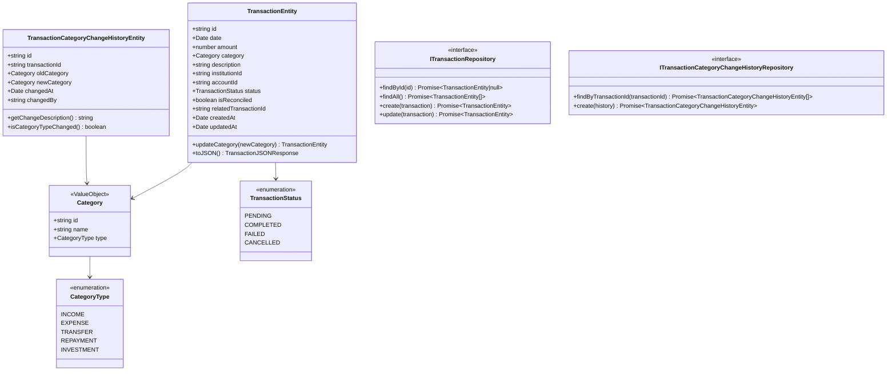
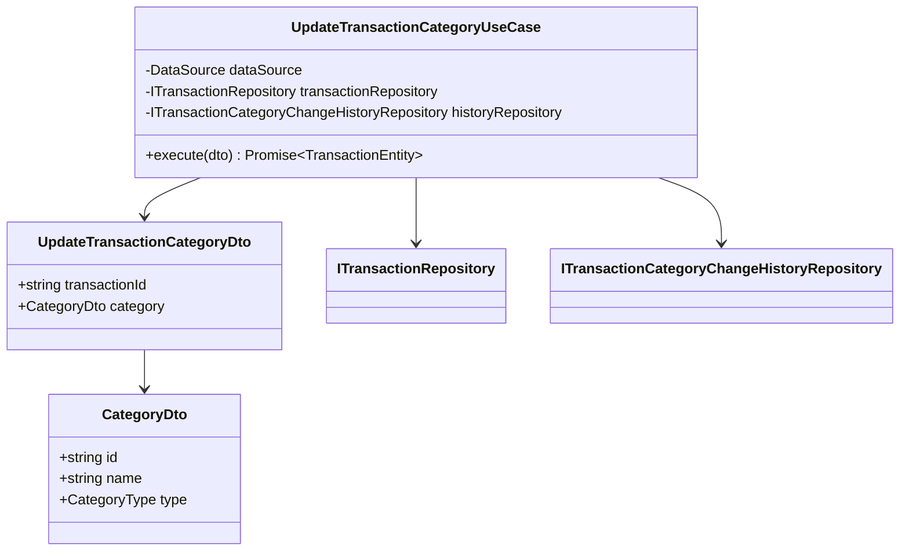
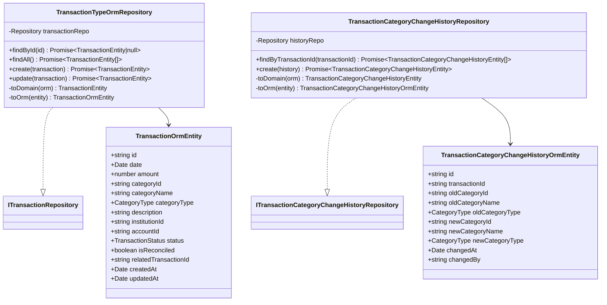
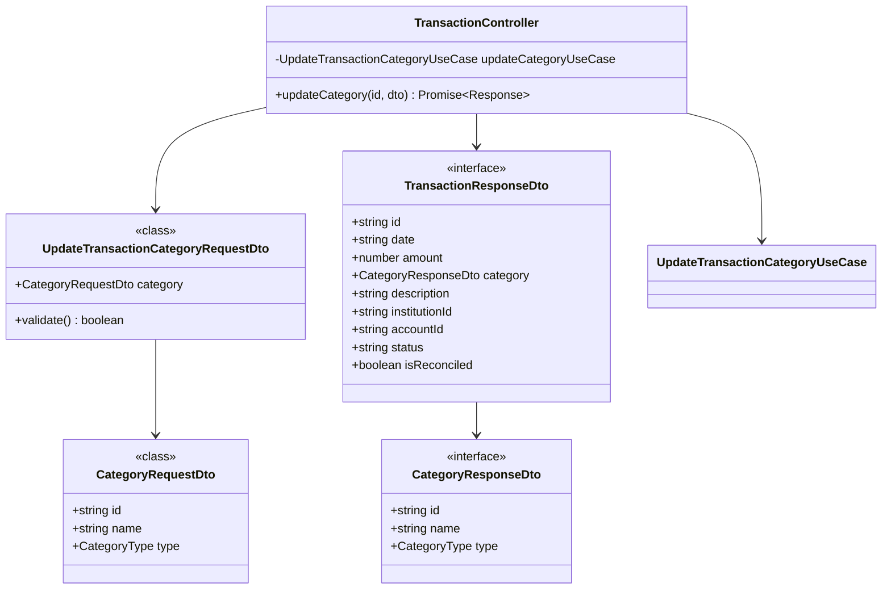
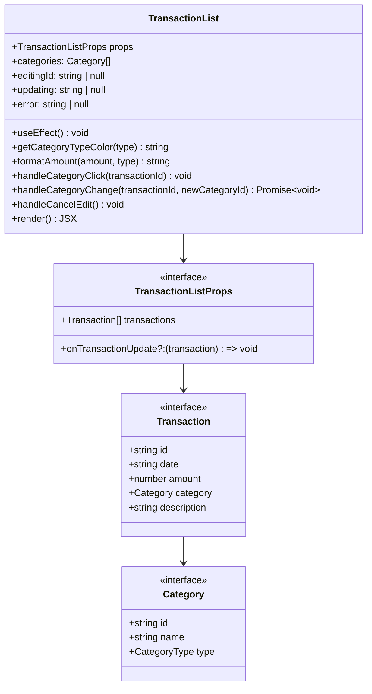
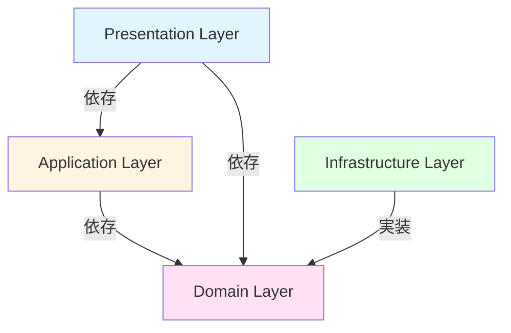
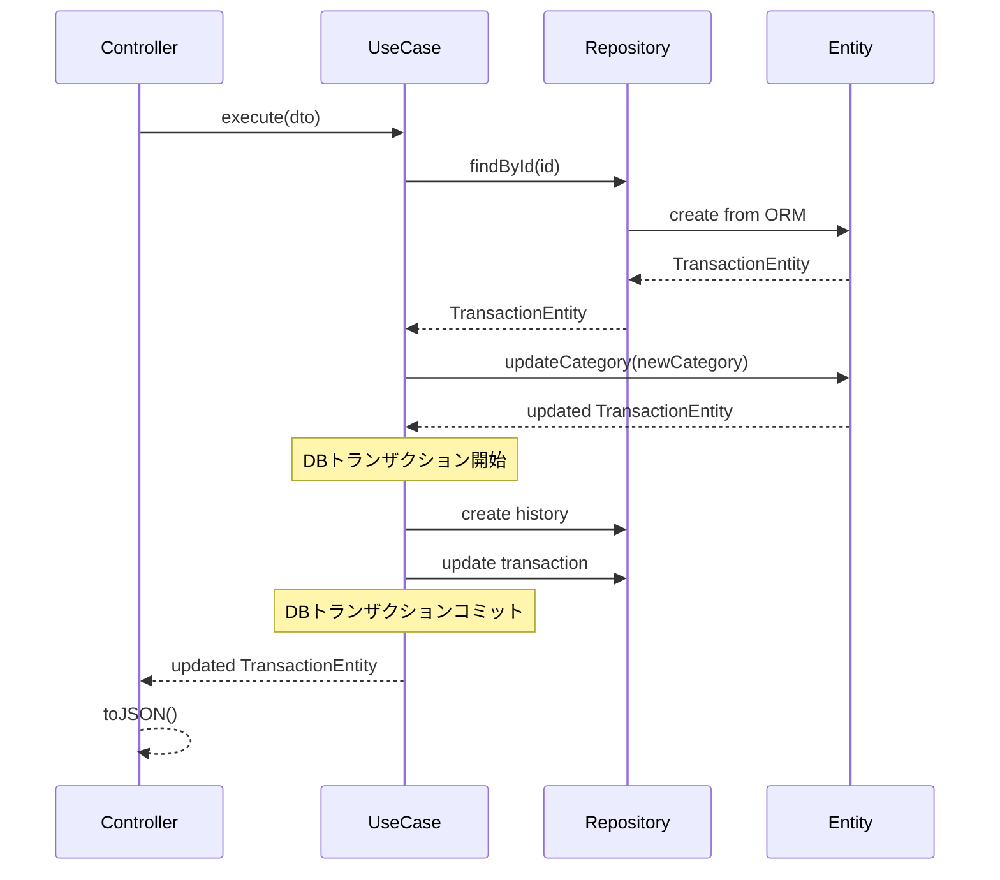
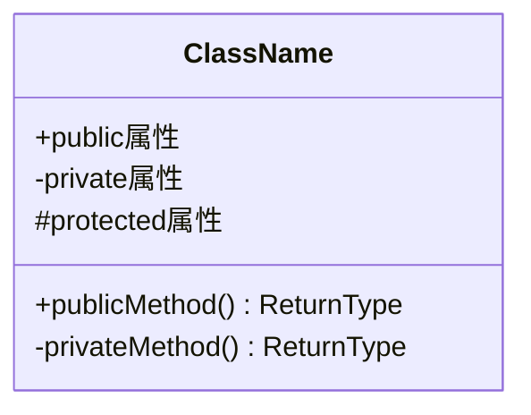
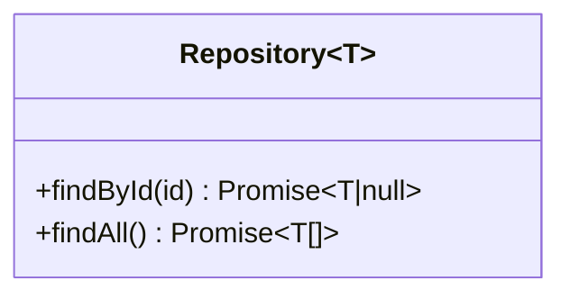

# クラス図

このドキュメントでは、FR-010（費目の手動修正機能）のクラス構造を記載しています。

## 目次

1. [Domain層クラス図](#domain層クラス図)
2. [Application層クラス図](#application層クラス図)
3. [Infrastructure層クラス図](#infrastructure層クラス図)
4. [Presentation層クラス図](#presentation層クラス図)
5. [Frontend コンポーネント図](#frontendコンポーネント図)

---

## Domain層クラス図

### Transaction Module

**クラス説明**:

#### TransactionEntity

- **責務**: 取引データの管理、カテゴリ更新ロジック
- **主要メソッド**:
  - `updateCategory(newCategory)`: カテゴリを更新して新しいインスタンスを返す
  - `toJSON()`: JSON形式への変換
- **不変性**: Entityは基本的に不変で、更新時は新しいインスタンスを生成

#### TransactionCategoryChangeHistoryEntity

- **責務**: カテゴリ変更履歴の記録と管理
- **主要メソッド**:
  - `getChangeDescription()`: 変更内容の人間が読みやすい説明を返す
  - `isCategoryTypeChanged()`: カテゴリタイプが変更されたかを判定
- **不変性**: すべてのプロパティが`readonly`で不変

#### Category

- **責務**: カテゴリ情報を表現する値オブジェクト
- **不変性**: 値オブジェクトは不変（immutable）
- **構成**: ID、名前、タイプの3つの属性

#### CategoryType

- **責務**: カテゴリの種別を表すEnum
- **値**:
  - `INCOME`: 収入
  - `EXPENSE`: 支出
  - `TRANSFER`: 振替
  - `REPAYMENT`: 返済
  - `INVESTMENT`: 投資

---

## Application層クラス図

### Use Cases

**クラス説明**:

#### UpdateTransactionCategoryUseCase

- **責務**: カテゴリ更新のユースケース実装、トランザクション管理
- **依存**:
  - `ITransactionRepository`: 取引データへのアクセス
  - `ITransactionCategoryChangeHistoryRepository`: 変更履歴の記録
  - `DataSource`: データベーストランザクション管理
- **入力**: `UpdateTransactionCategoryDto`
- **出力**: `Promise<TransactionEntity>`

**処理フロー**:

1. トランザクション外で取引の存在確認
2. ドメインエンティティでカテゴリ更新
3. データベーストランザクション開始
4. 変更履歴を記録
5. 取引を更新
6. トランザクションコミット

#### UpdateTransactionCategoryDto

- **責務**: リクエストデータの受け取り
- **バリデーション**: Presentation層で実施

---

## Infrastructure層クラス図

### Repository Implementations

**クラス説明**:

#### TransactionTypeOrmRepository

- **責務**: 取引データのデータベース永続化
- **永続化方法**: TypeORM（MySQL）
- **マッピング**: ドメインエンティティとORMエンティティの相互変換

#### TransactionCategoryChangeHistoryRepository

- **責務**: カテゴリ変更履歴のデータベース永続化
- **永続化方法**: TypeORM（MySQL）
- **インデックス**: transactionId、transactionId+changedAt複合インデックス

#### TransactionOrmEntity

- **責務**: 取引データのORMマッピング
- **特徴**: カテゴリはフラット化して保存（categoryId, categoryName, categoryType）

#### TransactionCategoryChangeHistoryOrmEntity

- **責務**: カテゴリ変更履歴のORMマッピング
- **特徴**: 変更前後のカテゴリをフラット化して保存
- **インデックス**: `@Index(['transactionId', 'changedAt'])`

---

## Presentation層クラス図

### Controllers

**クラス説明**:

#### TransactionController

- **責務**: HTTPリクエスト/レスポンスの処理
- **エンドポイント**:
  - `PATCH /api/transactions/:id/category`: カテゴリ更新

#### UpdateTransactionCategoryRequestDto

- **責務**: リクエストデータの受け取りとバリデーション
- **バリデーション**:
  - `category`は必須
  - `category.id`は文字列で必須
  - `category.name`は文字列で必須
  - `category.type`はCategoryType enumで必須

#### TransactionResponseDto

- **責務**: レスポンスデータの構築
- **変換**: ドメインエンティティから変換（`toJSON()`メソッド使用）

---

## Frontend コンポーネント図

### React Components

**コンポーネント説明**:

#### TransactionList

- **責務**: 取引一覧表示とカテゴリ編集UI
- **State**:
  - `categories`: カテゴリ一覧
  - `editingId`: 編集中の取引ID
  - `updating`: 更新中の取引ID
  - `error`: エラーメッセージ
- **API連携**:
  - `getCategories()`: カテゴリ一覧取得
  - `updateTransactionCategory()`: カテゴリ更新
- **Props**:
  - `transactions`: 表示する取引データ配列
  - `onTransactionUpdate`: カテゴリ更新時のコールバック

**UI機能**:

- カテゴリクリックで編集モードに切り替え
- セレクトボックスで新しいカテゴリを選択
- 更新中は無効化
- エラー時は赤いボーダーで表示

---

## クラス間の関係性

### 依存関係の概要

### データフロー

---

## 実装上の注意点

### 型安全性

- すべてのクラスとメソッドに適切な型定義を行う
- DTOはclassで定義（バリデーションデコレータ使用のため）
- レスポンスDTOはinterfaceで定義（プロパティ初期化不要）
- Genericsを活用して型の再利用性を高める

### 依存性注入

- コンストラクタインジェクションを使用
- インターフェースに依存し、実装に依存しない
- NestJSのDIコンテナを活用
- トークンベースのDI（`@Inject(TRANSACTION_REPOSITORY)`）

### イミュータビリティ

- Domain EntityのHistoryは完全に不変（すべてのプロパティが`readonly`）
- TransactionEntityの更新は新しいインスタンスを返す
- Value Object（Category）は不変とする

### エラーハンドリング

- カスタム例外クラスを使用（`NotFoundException`）
- 適切なHTTPステータスコードを返す
- エラーのロギング（`Logger`使用）
- トランザクション内のエラーは自動的にロールバック

### トランザクション管理

- 複数のデータベース操作は`DataSource.transaction`を使用
- トランザクション外で可能な検証は先に実行（パフォーマンス最適化）
- `entityManager`を経由してリポジトリにアクセス

---

## チェックリスト

クラス図作成時の確認事項：

### Domain層

- [x] すべてのEntityが定義されている
- [x] Value Objectが適切に定義されている
- [x] Repositoryインターフェースが定義されている
- [x] ビジネスロジックがEntityに配置されている

### Application層

- [x] すべてのUseCaseが定義されている
- [x] DTOが適切に定義されている
- [x] トランザクション管理の責務が明確

### Infrastructure層

- [x] Repositoryの実装クラスが定義されている
- [x] ORMエンティティが定義されている
- [x] ドメインエンティティとORMエンティティのマッピングが明確

### Presentation層

- [x] すべてのControllerが定義されている
- [x] RequestDTO、ResponseDTOが定義されている
- [x] エンドポイントが明確

### Frontend

- [x] ページコンポーネントが定義されている
- [x] Props、Stateが明確
- [x] API連携が明確

---

## Mermaid記法のヒント

### クラス定義

### 関係性

- `-->`: 依存（Dependency）
- `--|>`: 継承（Inheritance）
- `..|>`: 実装（Implementation）
- `--*`: コンポジション（Composition）
- `--o`: 集約（Aggregation）

### ジェネリクス

