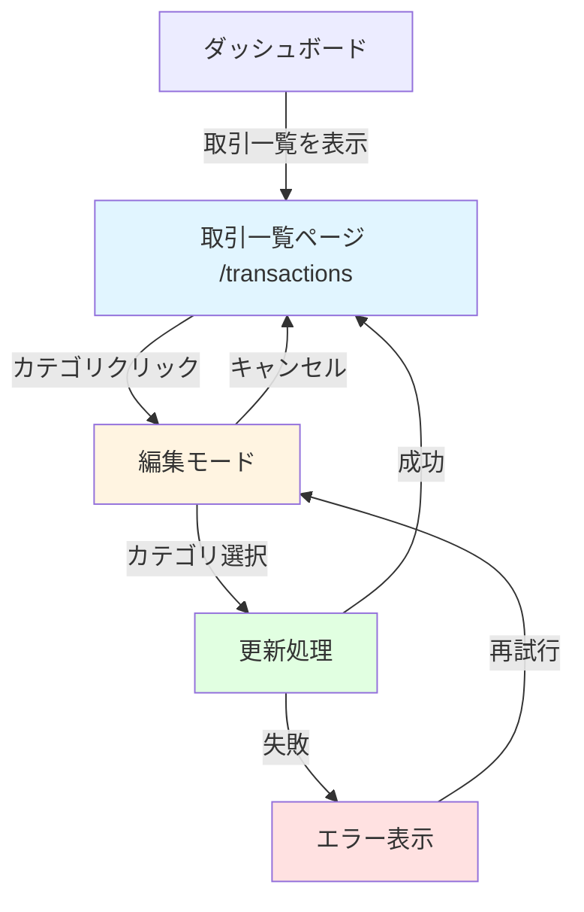
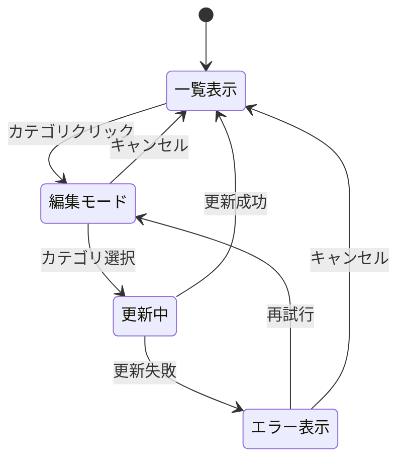
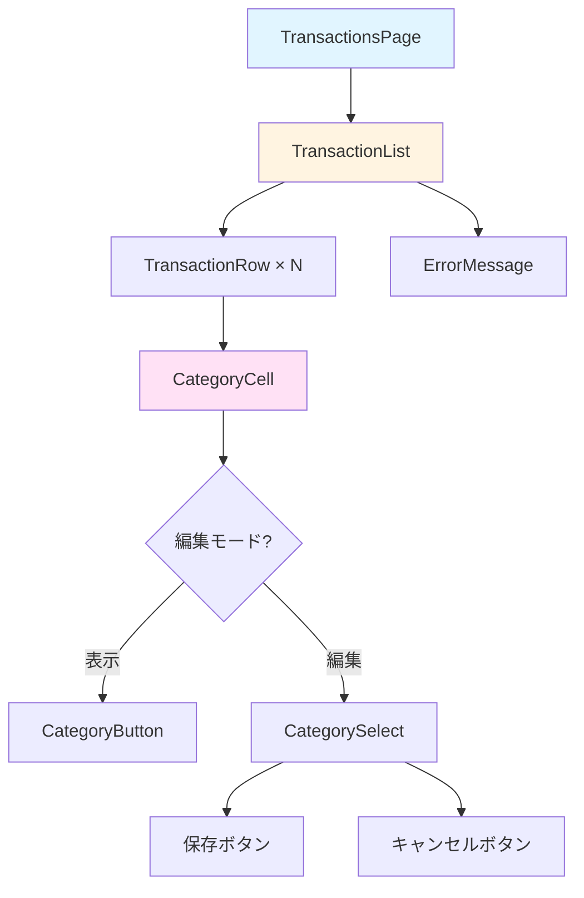
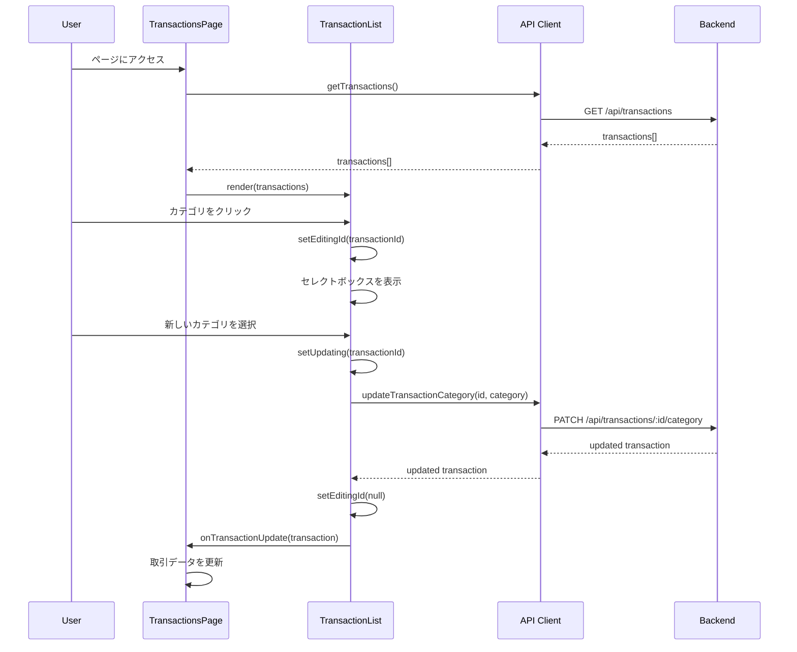
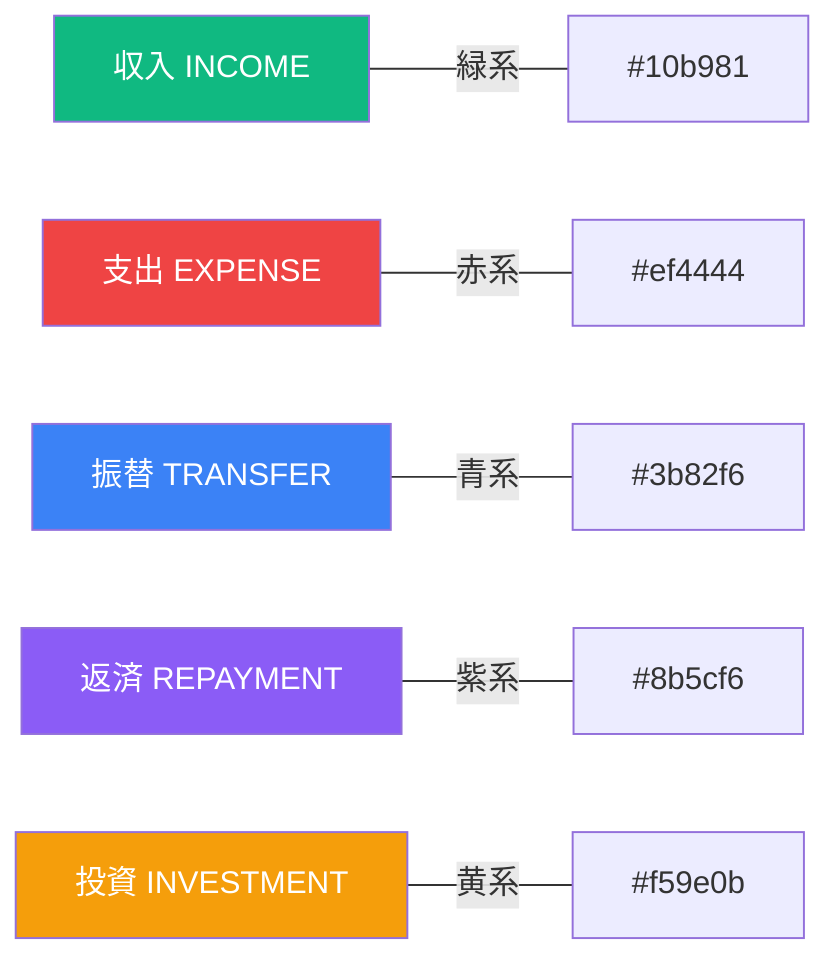

# 画面遷移図

このドキュメントでは、FR-010（費目の手動修正機能）の画面遷移とUI設計を記載しています。

## 目次

1. [画面遷移図](#画面遷移図)
2. [画面一覧](#画面一覧)
3. [画面詳細設計](#画面詳細設計)
4. [UI/UXガイドライン](#uiuxガイドライン)

---

## 画面遷移図

### 全体の画面遷移



### 状態遷移



---

## 画面一覧

| 画面名         | パス            | 説明                               | 実装状況    |
| -------------- | --------------- | ---------------------------------- | ----------- |
| 取引一覧ページ | `/transactions` | 取引データの一覧表示とカテゴリ編集 | 🚧 実装予定 |

---

## 画面詳細設計

### 取引一覧ページ (`/transactions`)

#### 画面概要

**目的**: ユーザーが取引履歴を確認し、各取引のカテゴリを手動で変更できるページ

**対象ユーザー**: すべてのユーザー

**アクセス方法**:

- ダッシュボードのナビゲーションメニューから「取引一覧」を選択
- 直接URL `/transactions` にアクセス

#### ワイヤーフレーム

```
┌─────────────────────────────────────────────────────────────┐
│  📊 Account Book                                    [Menu]   │
├─────────────────────────────────────────────────────────────┤
│                                                               │
│  取引一覧                                                      │
│                                                               │
│  ┌─────────────────────────────────────────────────────┐    │
│  │ 日付       │ 説明      │ カテゴリ   │ 金額      │ ステータス │    │
│  ├─────────────────────────────────────────────────────┤    │
│  │ 2025-01-15 │ スーパーA │ [食費 ▼] │ -3,500円 │ 完了    │    │
│  │ 2025-01-14 │ 給与     │ [給与 ▼] │ +300,000円│ 完了    │    │
│  │ 2025-01-13 │ 電車賃   │ [交通費▼]│ -500円   │ 完了    │    │
│  └─────────────────────────────────────────────────────┘    │
│                                                               │
│  [編集中の行] ──────────────────────────────────────────     │
│  ┌─────────────────────────────────────────────────────┐    │
│  │ 2025-01-15 │ スーパーA │ ┌─────────┐ │ -3,500円 │ 完了  │    │
│  │            │          │ │食費     ▼│ │         │       │    │
│  │            │          │ ├─────────┤ │         │       │    │
│  │            │          │ │食費     │ │         │       │    │
│  │            │          │ │交通費   │ │  [保存] [キャンセル]│    │
│  │            │          │ │娯楽     │ │         │       │    │
│  │            │          │ └─────────┘ │         │       │    │
│  └─────────────────────────────────────────────────────┘    │
│                                                               │
└─────────────────────────────────────────────────────────────┘
```

#### UIコンポーネント構成



#### コンポーネント説明

##### TransactionsPage

- **ファイル**: `apps/frontend/src/app/transactions/page.tsx`
- **責務**: ページレベルのレイアウトとデータ取得
- **State**:
  - `transactions: Transaction[]` - 取引一覧データ
  - `loading: boolean` - ローディング状態
  - `error: string | null` - エラーメッセージ
- **ライフサイクル**:
  - マウント時: `getTransactions()` APIを呼び出して取引データを取得
  - データ取得完了後: `TransactionList`コンポーネントに取引データを渡す

##### TransactionList

- **ファイル**: `apps/frontend/src/components/transactions/TransactionList.tsx`（既存）
- **責務**: 取引一覧の表示とカテゴリ編集UI
- **Props**:
  - `transactions: Transaction[]` - 表示する取引データ配列
  - `onTransactionUpdate?: (transaction: Transaction) => void` - カテゴリ更新時のコールバック
- **State**:
  - `categories: Category[]` - カテゴリ一覧
  - `editingId: string | null` - 編集中の取引ID
  - `updating: string | null` - 更新中の取引ID
  - `error: string | null` - エラーメッセージ

##### CategoryCell

- **責務**: カテゴリ表示・編集セル
- **挙動**:
  - デフォルト: カテゴリ名をボタンとして表示
  - クリック時: セレクトボックスに切り替え
  - 選択時: 自動的に更新処理を実行

#### データフロー



#### API連携

| メソッド | エンドポイント                   | 用途             | レスポンス      |
| -------- | -------------------------------- | ---------------- | --------------- |
| GET      | `/api/transactions`              | 取引一覧取得     | `Transaction[]` |
| GET      | `/api/categories`                | カテゴリ一覧取得 | `Category[]`    |
| PATCH    | `/api/transactions/:id/category` | カテゴリ更新     | `Transaction`   |

#### 画面表示ルール

##### 初期表示

- [ ] すべての取引が日付降順で表示される
- [ ] カテゴリはボタンとして表示される
- [ ] 各取引行はホバー時に背景色が変わる

##### 編集モード

- [ ] クリックした取引のカテゴリがセレクトボックスに変わる
- [ ] セレクトボックスには現在のカテゴリタイプに一致するカテゴリのみ表示
- [ ] 保存ボタンとキャンセルボタンが表示される
- [ ] 編集中は他の取引のカテゴリはクリックできない

##### 更新中

- [ ] 更新中の取引行の背景色が変わる
- [ ] セレクトボックスと保存ボタンが無効化される
- [ ] ローディングインジケーターが表示される

##### エラー時

- [ ] エラーメッセージが取引一覧の上部に表示される
- [ ] エラーメッセージは赤い背景で表示される
- [ ] 編集モードは維持される（再試行可能）

#### バリデーションルール

| 項目           | ルール                   | エラーメッセージ                         |
| -------------- | ------------------------ | ---------------------------------------- |
| カテゴリID     | 必須、既存カテゴリに存在 | 「カテゴリが見つかりません」             |
| カテゴリタイプ | 取引のタイプと一致       | 「このタイプのカテゴリは選択できません」 |

#### エラーハンドリング

| エラー             | 発生条件         | ユーザーへの表示                 | 対処方法           |
| ------------------ | ---------------- | -------------------------------- | ------------------ |
| ネットワークエラー | API接続失敗      | 「サーバーに接続できません」     | 再試行ボタンを表示 |
| 404エラー          | 取引が存在しない | 「取引が見つかりません」         | ページをリロード   |
| 400エラー          | 無効なカテゴリ   | 「無効なカテゴリです」           | 編集モードを維持   |
| 500エラー          | サーバーエラー   | 「サーバーエラーが発生しました」 | 再試行ボタンを表示 |

---

## UI/UXガイドライン

### カラーパレット

#### カテゴリタイプ別色



#### 状態別色

| 状態       | 色                          | 用途                 |
| ---------- | --------------------------- | -------------------- |
| デフォルト | `text-gray-700`             | 通常のテキスト       |
| ホバー     | `bg-gray-50`                | 行のホバー時         |
| 編集中     | `bg-blue-50`                | 編集モードの行       |
| 更新中     | `bg-yellow-50`              | 更新処理中の行       |
| エラー     | `bg-red-50, border-red-500` | エラー表示           |
| 成功       | `bg-green-50`               | 更新成功時（一時的） |

### フォント

| 要素             | サイズ      | ウェイト      |
| ---------------- | ----------- | ------------- |
| ページタイトル   | `text-2xl`  | `font-bold`   |
| テーブルヘッダー | `text-sm`   | `font-medium` |
| テーブルセル     | `text-base` | `font-normal` |
| カテゴリボタン   | `text-sm`   | `font-medium` |
| エラーメッセージ | `text-sm`   | `font-normal` |

### スペーシング

| 要素             | パディング  | マージン |
| ---------------- | ----------- | -------- |
| ページコンテナ   | `p-6`       | -        |
| テーブル         | `p-0`       | `mt-4`   |
| テーブルセル     | `px-4 py-2` | -        |
| カテゴリボタン   | `px-3 py-1` | -        |
| エラーメッセージ | `p-4`       | `mb-4`   |

### アニメーション

| 要素                 | アニメーション      | 持続時間 |
| -------------------- | ------------------- | -------- |
| 行ホバー             | `transition-colors` | `150ms`  |
| ボタンホバー         | `transition-colors` | `150ms`  |
| セレクトボックス表示 | `fade-in`           | `200ms`  |
| エラーメッセージ     | `slide-down`        | `300ms`  |
| 更新成功時           | `fade-out`          | `2000ms` |

### レスポンシブデザイン

#### ブレークポイント

| デバイス     | 幅               | レイアウト変更             |
| ------------ | ---------------- | -------------------------- |
| モバイル     | `< 640px`        | テーブルをカード形式に変更 |
| タブレット   | `640px - 1024px` | 一部の列を非表示           |
| デスクトップ | `>= 1024px`      | 全列を表示                 |

#### モバイル表示

```
┌────────────────────────┐
│  取引一覧              │
├────────────────────────┤
│ ┌────────────────────┐ │
│ │ 2025-01-15         │ │
│ │ スーパーA          │ │
│ │ [食費 ▼]          │ │
│ │ -3,500円          │ │
│ └────────────────────┘ │
│                        │
│ ┌────────────────────┐ │
│ │ 2025-01-14         │ │
│ │ 給与              │ │
│ │ [給与 ▼]          │ │
│ │ +300,000円        │ │
│ └────────────────────┘ │
└────────────────────────┘
```

### アクセシビリティ

#### キーボード操作

| キー          | 動作                         |
| ------------- | ---------------------------- |
| `Tab`         | 次のカテゴリボタンに移動     |
| `Shift + Tab` | 前のカテゴリボタンに移動     |
| `Enter`       | カテゴリボタンをクリック     |
| `Escape`      | 編集モードをキャンセル       |
| `↑` / `↓`     | セレクトボックス内で選択移動 |

#### ARIA属性

| 要素             | 属性         | 値                                     |
| ---------------- | ------------ | -------------------------------------- |
| カテゴリボタン   | `aria-label` | 「カテゴリを変更: {現在のカテゴリ名}」 |
| セレクトボックス | `aria-label` | 「新しいカテゴリを選択」               |
| 保存ボタン       | `aria-label` | 「カテゴリを保存」                     |
| キャンセルボタン | `aria-label` | 「編集をキャンセル」                   |
| 更新中の行       | `aria-busy`  | `true`                                 |
| エラーメッセージ | `role`       | `alert`                                |

#### スクリーンリーダー対応

- [ ] すべてのボタンに適切な`aria-label`を設定
- [ ] エラーメッセージに`role="alert"`を設定
- [ ] 更新中は`aria-busy="true"`を設定
- [ ] フォーカス順序を論理的に設定

### パフォーマンス目標

| 指標                   | 目標値  | 測定方法                       |
| ---------------------- | ------- | ------------------------------ |
| 初回表示時間           | < 1秒   | LCP (Largest Contentful Paint) |
| カテゴリ選択レスポンス | < 100ms | FID (First Input Delay)        |
| カテゴリ更新API        | < 500ms | Network tab                    |
| 再レンダリング         | < 16ms  | React DevTools                 |

---

## 実装チェックリスト

### ページ実装

- [ ] `/transactions` ページの作成
- [ ] 取引データの取得とState管理
- [ ] ローディング状態の実装
- [ ] エラーハンドリングの実装

### コンポーネント統合

- [ ] `TransactionList`コンポーネントの統合
- [ ] `onTransactionUpdate`コールバックの実装
- [ ] State更新ロジックの実装

### スタイリング

- [ ] Tailwind CSSでのスタイル適用
- [ ] カテゴリタイプ別色の実装
- [ ] レスポンシブデザインの実装
- [ ] ホバー・フォーカス状態の実装

### アクセシビリティ

- [ ] キーボード操作のサポート
- [ ] ARIA属性の設定
- [ ] スクリーンリーダー対応

### テスト

- [ ] E2Eテストのスキップを解除
- [ ] 全テストケースの実行確認
- [ ] エッジケースのテスト追加

---

## 参考資料

- [Tailwind CSS公式ドキュメント](https://tailwindcss.com/docs)
- [WCAG 2.1アクセシビリティガイドライン](https://www.w3.org/WAI/WCAG21/quickref/)
- [React公式ドキュメント](https://react.dev/)
- [Web Vitals](https://web.dev/vitals/)

---

## 変更履歴

| バージョン | 日付       | 変更内容 | 作成者     |
| ---------- | ---------- | -------- | ---------- |
| 1.0        | 2025-11-30 | 初版作成 | kencom2400 |
