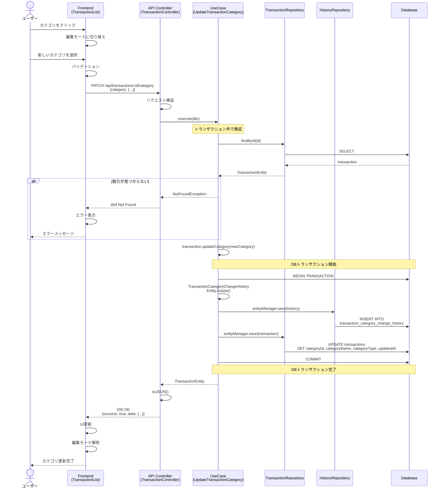
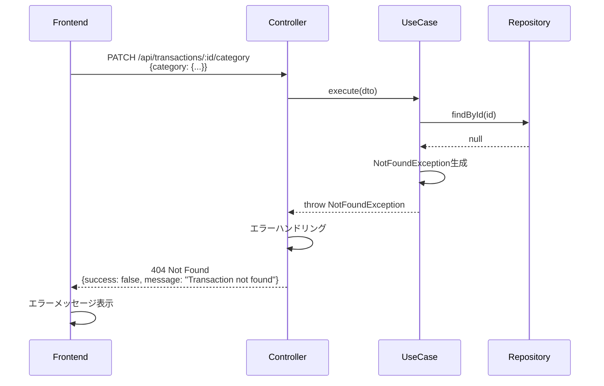
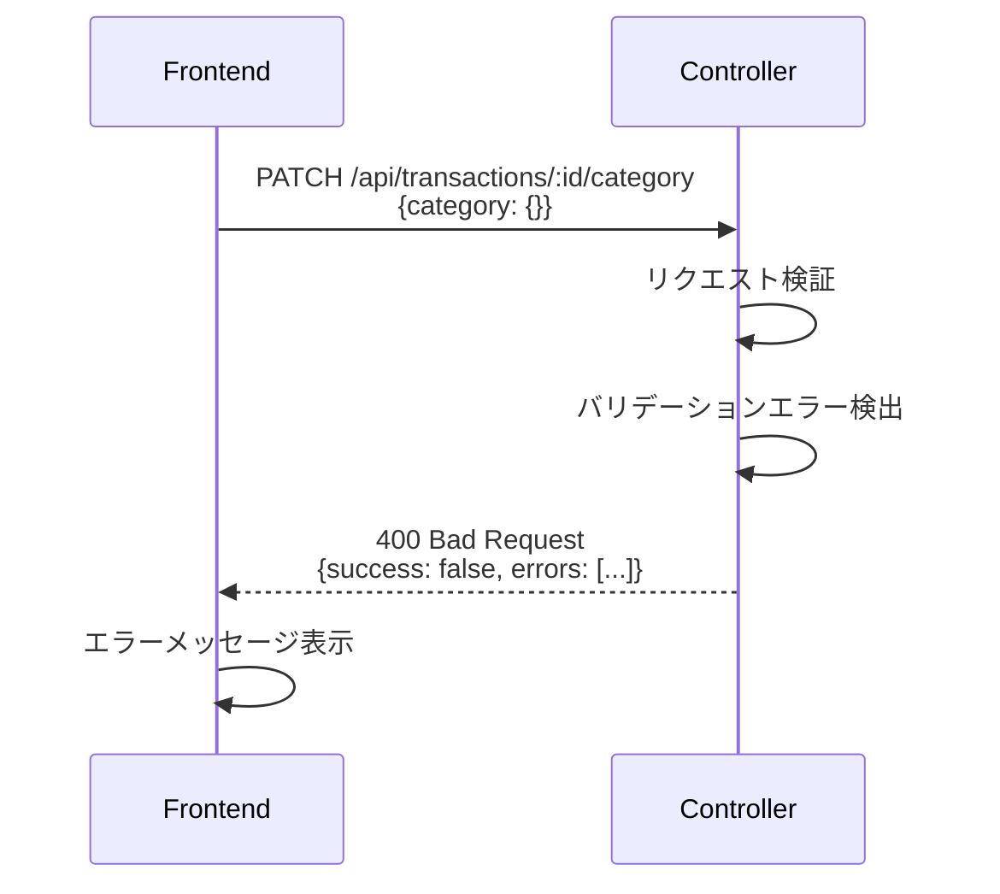
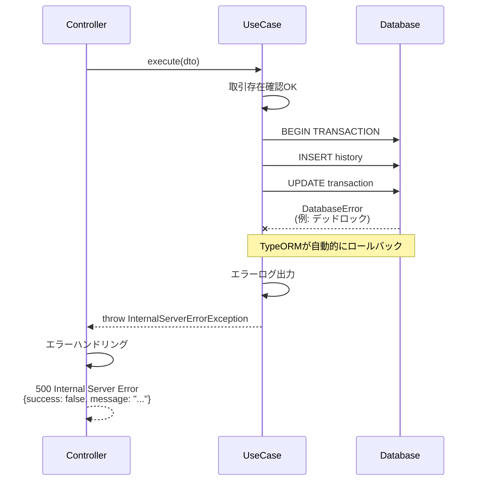
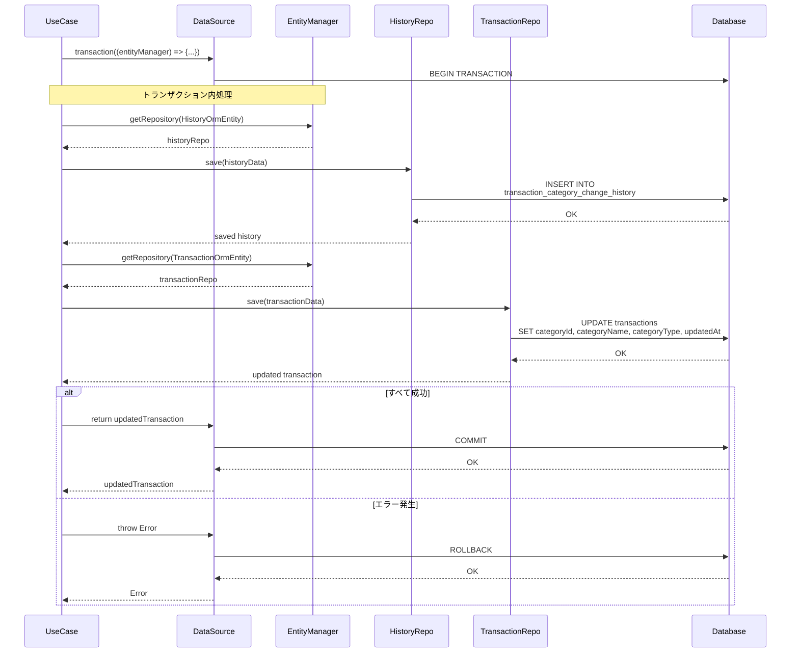
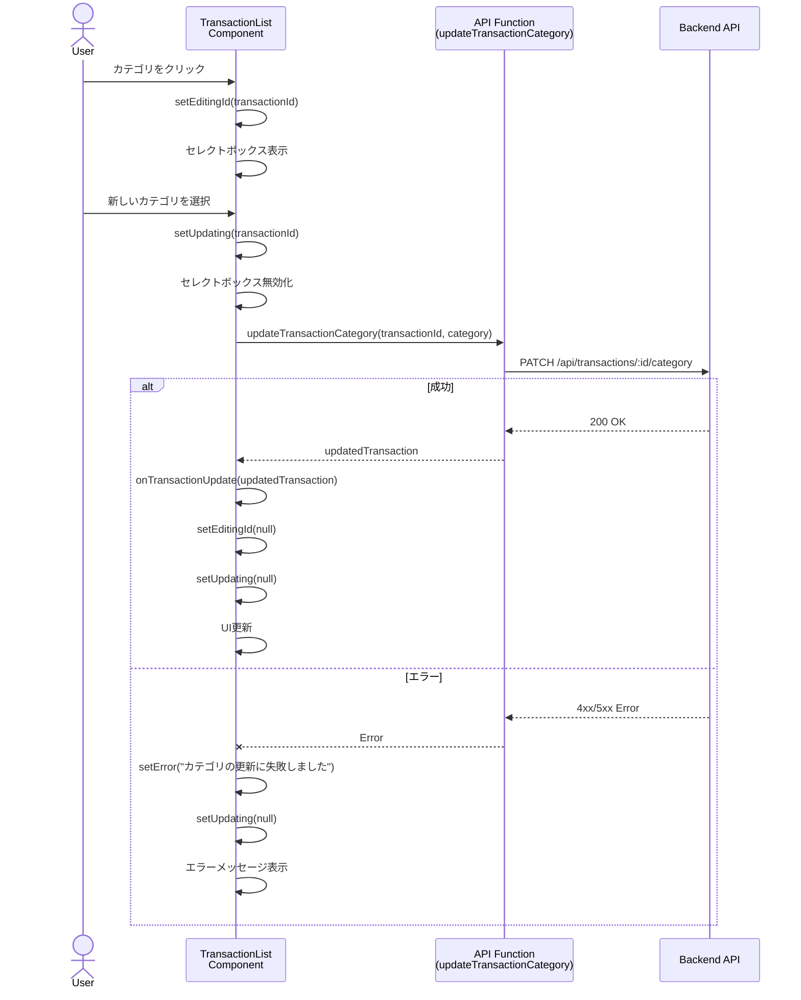
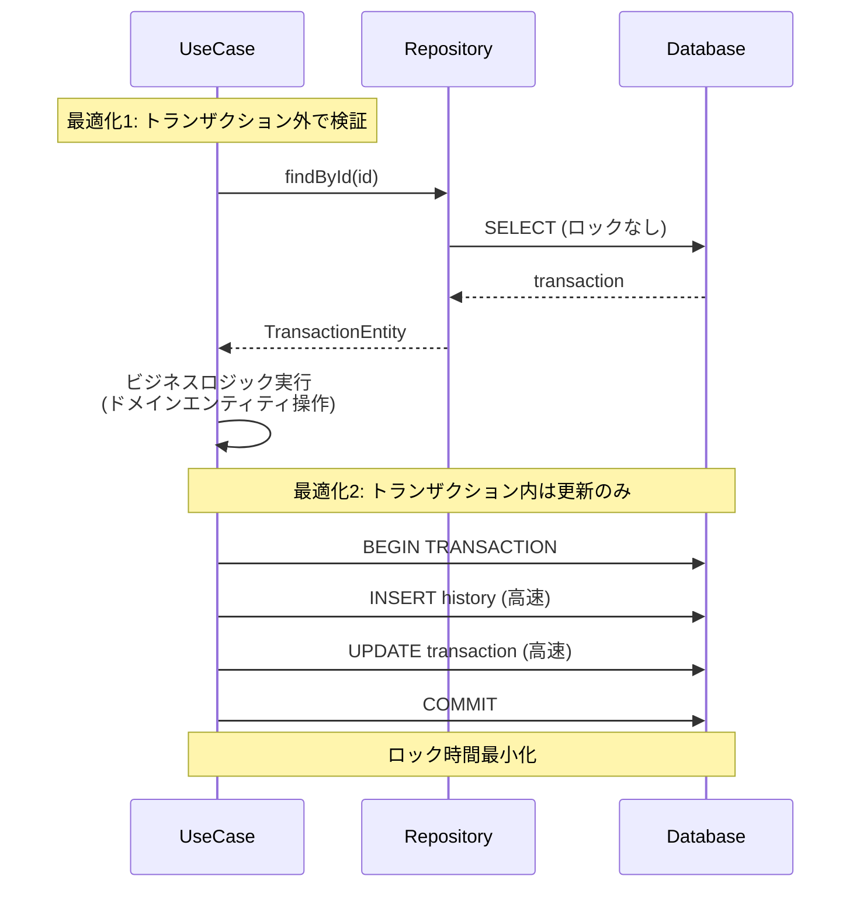
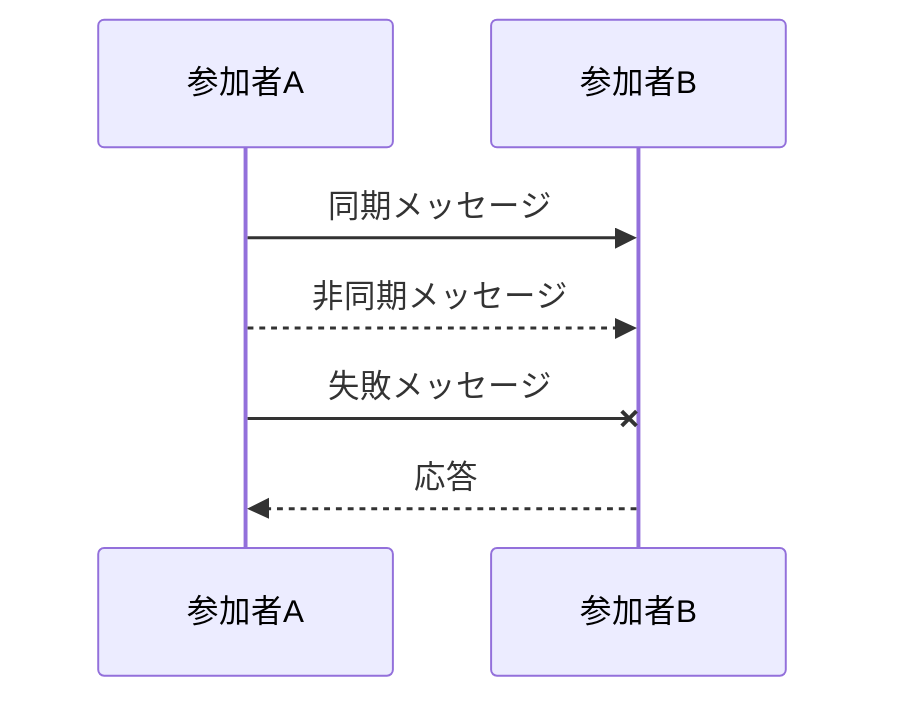
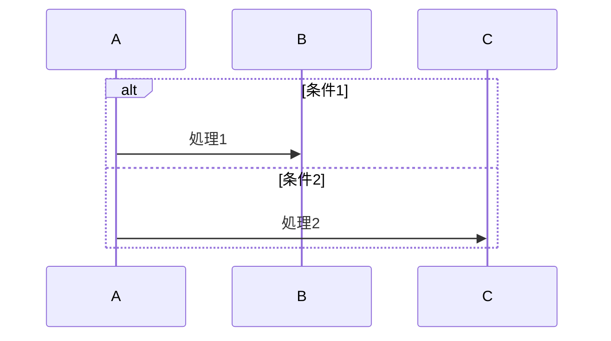
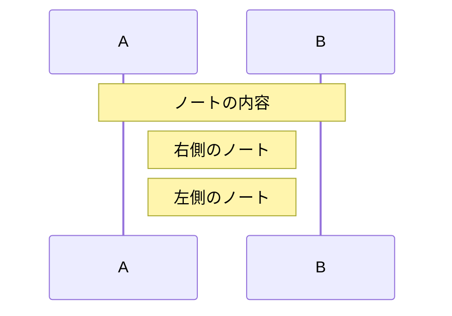

# シーケンス図

このドキュメントでは、FR-010（費目の手動修正機能）の処理フローをシーケンス図で記載しています。

## 目次

1. [カテゴリ更新のフロー（正常系）](#カテゴリ更新のフロー正常系)
2. [カテゴリ更新のフロー（異常系）](#カテゴリ更新のフロー異常系)
3. [データベーストランザクション](#データベーストランザクション)

---

## カテゴリ更新のフロー（正常系）

### 概要

**ユースケース**: ユーザーが取引のカテゴリを手動で変更する

**アクター**: ユーザー

**前提条件**:

- 取引データがデータベースに存在すること
- カテゴリマスタが登録されていること
- フロントエンドでカテゴリ一覧が取得済みであること

**成功時の結果**:

- 取引のカテゴリが更新される
- カテゴリ変更履歴が記録される
- UIが更新される

### 正常系フロー



### ステップ詳細

1. **ユーザーアクション**
   - ユーザーが取引一覧のカテゴリをクリック
   - セレクトボックスが表示される

2. **Frontend バリデーション**
   - 新しいカテゴリIDが有効であることを確認
   - カテゴリマスタに存在することを確認

3. **API リクエスト**
   - エンドポイント: `PATCH /api/transactions/:id/category`
   - RequestDTO: `{category: {id, name, type}}`

4. **UseCase 実行**
   - トランザクション外で取引の存在確認（パフォーマンス最適化）
   - ドメインエンティティでカテゴリ更新
   - データベーストランザクションで変更履歴記録と取引更新をアトミックに実行

5. **データベース永続化**
   - 変更履歴テーブルに INSERT
   - 取引テーブルを UPDATE
   - トランザクションコミット

6. **レスポンス**
   - ResponseDTO: `TransactionResponseDto`
   - HTTPステータス: 200 OK

---

## カテゴリ更新のフロー（異常系）

### 異常系1: 取引が存在しない



**エラーレスポンス例**:

```json
{
  "success": false,
  "statusCode": 404,
  "message": "Transaction with id abc123 not found"
}
```

### 異常系2: バリデーションエラー



**エラーレスポンス例**:

```json
{
  "success": false,
  "statusCode": 400,
  "message": "Validation failed",
  "errors": [
    {
      "field": "category.id",
      "message": "category.id must be a string"
    },
    {
      "field": "category.name",
      "message": "category.name must not be empty"
    }
  ]
}
```

### 異常系3: データベースエラー



**エラーレスポンス例**:

```json
{
  "success": false,
  "statusCode": 500,
  "message": "Internal server error"
}
```

---

## データベーストランザクション

### トランザクション境界の詳細



### トランザクション管理の特徴

**トランザクション境界**:

- 変更履歴の記録と取引の更新を1つのトランザクションで実行
- すべての操作が成功するか、すべて失敗するかのどちらか（原子性）

**パフォーマンス最適化**:

- 取引の存在確認はトランザクション外で実施
- トランザクション内では実際の更新処理のみを実行
- 不要なロック時間を削減

**エラーハンドリング**:

- トランザクション内でエラーが発生した場合、自動的にロールバック
- データの整合性を常に保証

---

## Frontend UIフロー

### カテゴリ編集UI



### 状態管理

**State**:

- `categories`: カテゴリ一覧（初期ロード時に取得）
- `editingId`: 編集中の取引ID
- `updating`: 更新中の取引ID（ローディング表示用）
- `error`: エラーメッセージ

**状態遷移**:

1. 初期状態: `editingId=null, updating=null, error=null`
2. カテゴリクリック: `editingId=transactionId`
3. カテゴリ選択: `updating=transactionId`
4. 更新成功: `editingId=null, updating=null`
5. 更新失敗: `updating=null, error="..."`

---

## パフォーマンス考慮事項

### 最適化ポイント



**最適化効果**:

- トランザクション外での検証により、ロック時間を最小化
- トランザクション内では必要最小限の操作のみを実行
- 並行処理の競合リスクを低減

---

## チェックリスト

シーケンス図作成時の確認事項：

### 基本項目

- [x] 主要なユースケースがすべて記載されている
- [x] アクター、参加者が明確に定義されている
- [x] 正常系フローが記載されている
- [x] 異常系フローが記載されている

### 詳細項目

- [x] エラーハンドリングが明確
- [x] トランザクション境界が明確
- [x] レスポンスの型とステータスコードが明記されている
- [x] データベース操作の詳細が記載されている

### 実装ガイド

- [x] 各ステップに説明が付与されている
- [x] 前提条件が明確
- [x] 成功時の結果が明確

---

## Mermaid記法のヒント

### 基本構文



### 条件分岐



### ノート


