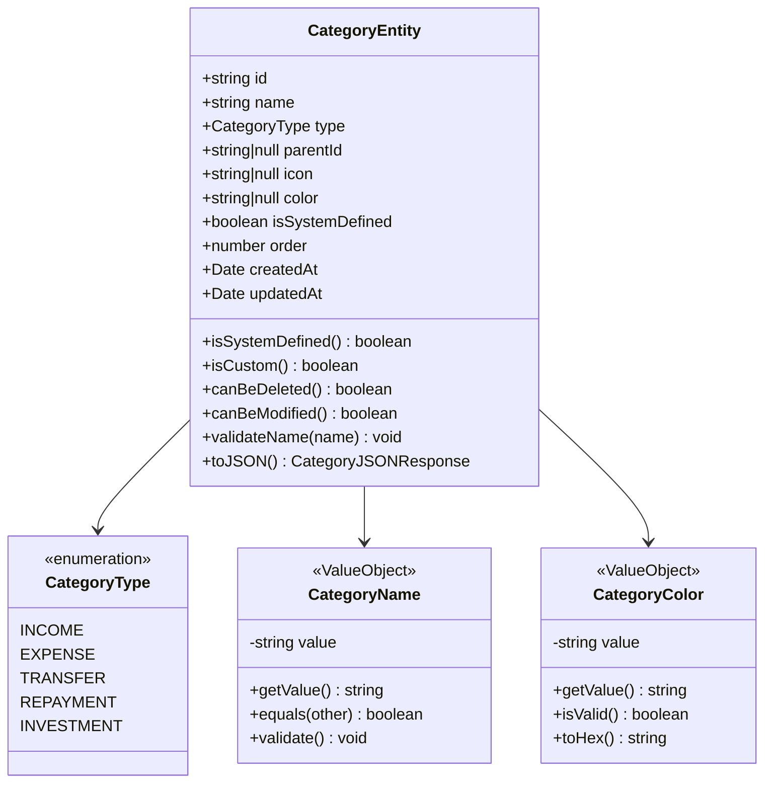
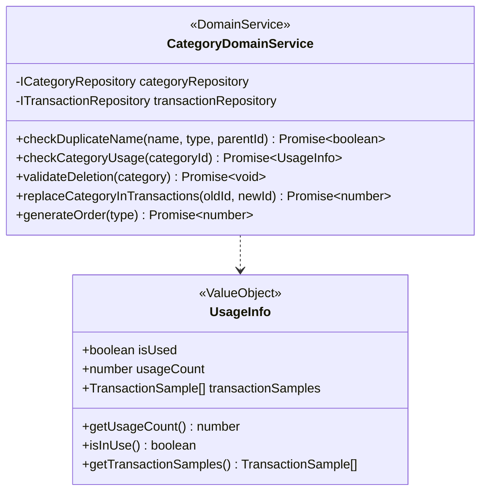
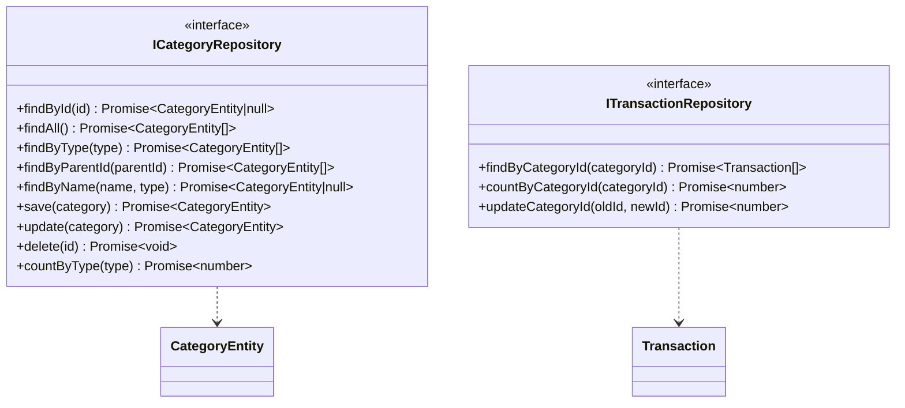
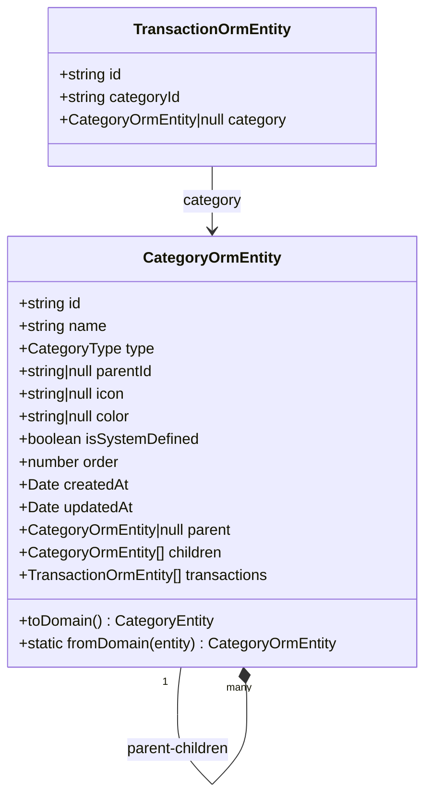
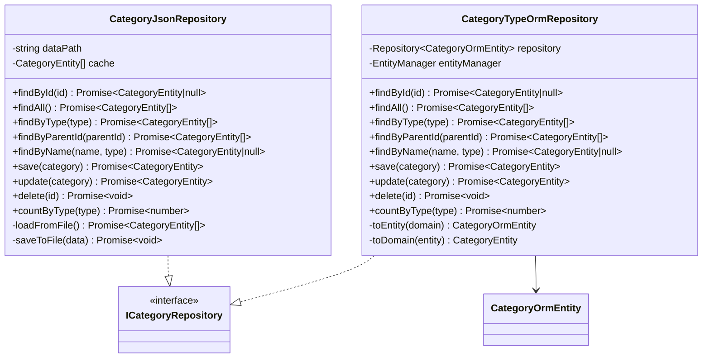
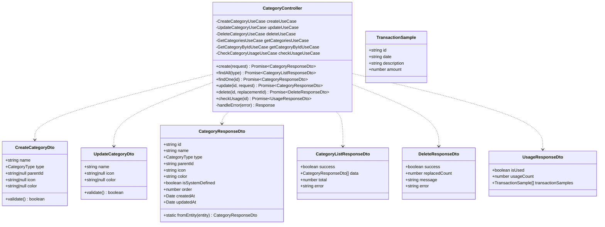
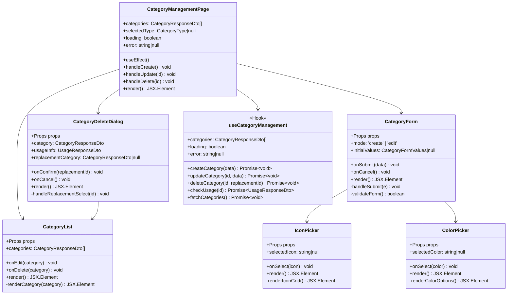
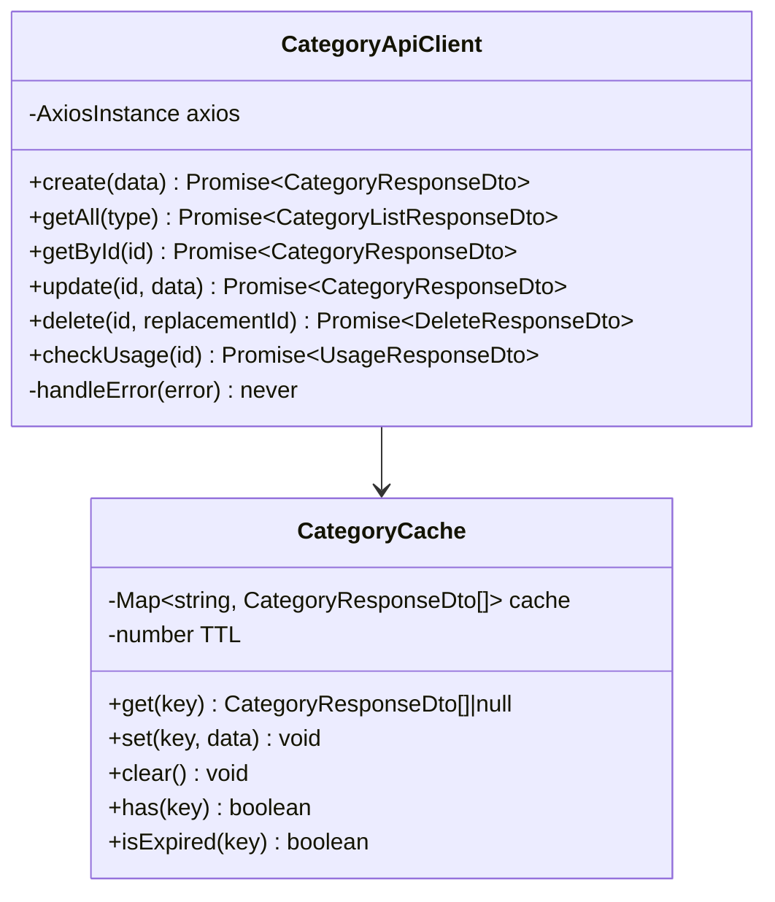
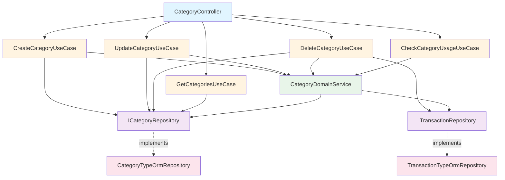

# クラス図

このドキュメントでは、費目のカスタマイズ機能（FR-011）のクラス構造を記載しています。

## 目次

1. [Domain層クラス図](#domain層クラス図)
2. [Application層クラス図](#application層クラス図)
3. [Infrastructure層クラス図](#infrastructure層クラス図)
4. [Presentation層クラス図](#presentation層クラス図)
5. [Frontend コンポーネント図](#frontendコンポーネント図)

---

## Domain層クラス図

### Category Entity & Value Objects

**クラス説明**:

#### CategoryEntity

- **責務**: 費目（カテゴリ）のドメインエンティティ
- **主要メソッド**:
  - `isSystemDefined()`: デフォルト費目か判定
  - `isCustom()`: カスタム費目か判定
  - `canBeDeleted()`: 削除可能か判定（デフォルト費目は削除不可）
  - `canBeModified()`: 編集可能か判定
  - `validateName(name)`: 費目名のバリデーション
  - `toJSON()`: JSON形式への変換

#### CategoryType (Enum)

- **責務**: カテゴリタイプの定義
- **値**:
  - `INCOME`: 収入
  - `EXPENSE`: 支出
  - `TRANSFER`: 振替
  - `REPAYMENT`: 返済
  - `INVESTMENT`: 投資

#### CategoryName (Value Object)

- **責務**: 費目名の値オブジェクト
- **バリデーション**:
  - 必須
  - 1-50文字
  - 重複チェック（同一親カテゴリ内）

#### CategoryColor (Value Object)

- **責務**: カラーコードの値オブジェクト
- **バリデーション**:
  - HEXカラーコード形式（例: #FF9800）

---

### Domain Services

**クラス説明**:

#### CategoryDomainService

- **責務**: 費目管理のドメインサービス
- **主要メソッド**:
  - `checkDuplicateName()`: 費目名の重複チェック
  - `checkCategoryUsage()`: 費目の使用状況確認
  - `validateDeletion()`: 削除可能性の検証
  - `replaceCategoryInTransactions()`: 取引データの費目一括置換
  - `generateOrder()`: 表示順序の自動生成

#### UsageInfo (Value Object)

- **責務**: 費目の使用状況を表す値オブジェクト
- **プロパティ**:
  - `isUsed`: 使用中かどうか
  - `usageCount`: 使用件数
  - `transactionSamples`: 使用中の取引サンプル一覧（先頭10件）
    - `id`: 取引ID
    - `date`: 取引日
    - `description`: 摘要
    - `amount`: 金額

---

### Repository Interfaces

---

## Application層クラス図

### Use Cases

```mermaid
classDiagram
    class CreateCategoryUseCase {
        -ICategoryRepository categoryRepository
        -CategoryDomainService domainService
        +execute(request) Promise~CreateCategoryResult~
        -validateRequest(request) void
        -checkDuplicateName(request) Promise~void~
        -createEntity(request) CategoryEntity
        -generateId() string
    }

    class UpdateCategoryUseCase {
        -ICategoryRepository categoryRepository
        -CategoryDomainService domainService
        +execute(id, request) Promise~UpdateCategoryResult~
        -validateRequest(request) void
        -checkExistence(id) Promise~CategoryEntity~
        -validateModification(category) void
        -applyChanges(category, request) CategoryEntity
    }

    class DeleteCategoryUseCase {
        -ICategoryRepository categoryRepository
        -ITransactionRepository transactionRepository
        -CategoryDomainService domainService
        +execute(id, replacementId) Promise~DeleteCategoryResult~
        -validateDeletion(category) Promise~void~
        -checkUsage(id) Promise~UsageInfo~
        -replaceCategory(id, replacementId) Promise~void~
        -performDelete(id) Promise~void~
    }

    class GetCategoriesUseCase {
        -ICategoryRepository categoryRepository
        +execute(type) Promise~GetCategoriesResult~
        -filterByType(categories, type) CategoryEntity[]
        -sortByOrder(categories) CategoryEntity[]
        -buildHierarchy(categories) CategoryNode[]
    }

    class CheckCategoryUsageUseCase {
        -CategoryDomainService domainService
        +execute(id) Promise~UsageCheckResult~
    }

    class CreateCategoryRequest {
        +string name
        +CategoryType type
        +string|null parentId
        +string|null icon
        +string|null color
    }

    class UpdateCategoryRequest {
        +string name
        +string|null icon
        +string|null color
    }

    class DeleteCategoryRequest {
        +string categoryId
        +string|null replacementCategoryId
    }

    CreateCategoryUseCase ..> CreateCategoryRequest
    UpdateCategoryUseCase ..> UpdateCategoryRequest
    DeleteCategoryUseCase ..> DeleteCategoryRequest
```

**クラス説明**:

#### CreateCategoryUseCase

- **責務**: 新規費目の作成
- **依存**: `ICategoryRepository`, `CategoryDomainService`
- **入力**: `CreateCategoryRequest`
- **出力**: `CreateCategoryResult`
- **処理フロー**:
  1. リクエストのバリデーション
  2. 費目名の重複チェック
  3. 表示順序の生成
  4. エンティティの作成
  5. 永続化

#### UpdateCategoryUseCase

- **責務**: 既存費目の更新
- **依存**: `ICategoryRepository`, `CategoryDomainService`
- **入力**: `UpdateCategoryRequest`
- **出力**: `UpdateCategoryResult`
- **処理フロー**:
  1. 費目の存在確認
  2. 編集可能性の検証
  3. 変更の適用
  4. 永続化

#### DeleteCategoryUseCase

- **責務**: 費目の削除
- **依存**: `ICategoryRepository`, `ITransactionRepository`, `CategoryDomainService`
- **入力**: `DeleteCategoryRequest`
- **出力**: `DeleteCategoryResult`
- **処理フロー**:
  1. 削除可能性の検証（デフォルト費目は削除不可）
  2. 使用状況の確認
  3. 使用中の場合、代替費目への一括置換
  4. 論理削除の実行

#### GetCategoriesUseCase

- **責務**: 費目一覧の取得
- **依存**: `ICategoryRepository`
- **入力**: `CategoryType` (optional)
- **出力**: `GetCategoriesResult`
- **処理フロー**:
  1. 全費目の取得
  2. タイプでフィルタリング（指定がある場合）
  3. 表示順序でソート
  4. 階層構造の構築

#### CheckCategoryUsageUseCase

- **責務**: 費目の使用状況確認
- **依存**: `CategoryDomainService`
- **入力**: `categoryId`
- **出力**: `UsageCheckResult`

---

## Infrastructure層クラス図

### TypeORM Entities

### Repository Implementations

**クラス説明**:

#### CategoryTypeOrmRepository

- **責務**: TypeORMを使用した費目の永続化
- **データベース**: MySQL
- **キャッシング**: なし（データベースから都度取得）

#### CategoryJsonRepository

- **責務**: JSON形式での費目の永続化（フォールバック）
- **ファイルパス**: `data/categories/categories.json`
- **キャッシング**: メモリキャッシュ使用

---

## Presentation層クラス図

### Controllers & DTOs

**クラス説明**:

#### CategoryController

- **責務**: 費目CRUD APIの提供
- **エンドポイント**:
  - `POST /api/categories`: 費目追加
  - `GET /api/categories`: 費目一覧取得
  - `GET /api/categories/:id`: 費目詳細取得
  - `PUT /api/categories/:id`: 費目編集
  - `DELETE /api/categories/:id`: 費目削除
  - `GET /api/categories/:id/usage`: 使用状況確認

#### CreateCategoryDto

- **責務**: 費目追加リクエストのバリデーション
- **バリデーション**:
  - `name`: 必須、1-50文字
  - `type`: 必須、有効なCategoryType
  - `parentId`: 任意、有効なカテゴリID
  - `icon`: 任意、絵文字
  - `color`: 任意、HEXカラーコード

#### UpdateCategoryDto

- **責務**: 費目更新リクエストのバリデーション
- **バリデーション**:
  - `name`: 任意、1-50文字
  - `icon`: 任意、絵文字
  - `color`: 任意、HEXカラーコード

**注意**: `DeleteCategoryDto`は削除されました。削除時の代替費目IDはクエリパラメータで指定します。

---

## Frontendコンポーネント図

### React Components

**コンポーネント説明**:

#### CategoryManagementPage

- **責務**: 費目管理のメインページ
- **State**:
  - `categories`: 費目一覧
  - `selectedType`: 選択中のカテゴリタイプ
  - `loading`: ローディング状態
  - `error`: エラーメッセージ
- **API連携**:
  - `GET /api/categories`: 費目一覧取得
  - `POST /api/categories`: 費目追加
  - `PUT /api/categories/:id`: 費目更新
  - `DELETE /api/categories/:id`: 費目削除

#### CategoryForm

- **責務**: 費目の追加・編集フォーム
- **Props**:
  - `mode`: 'create' | 'edit'
  - `initialValues`: 初期値（編集時）
  - `onSubmit`: フォーム送信時のコールバック
  - `onCancel`: キャンセル時のコールバック
- **バリデーション**: React Hook Form + Zod

#### CategoryDeleteDialog

- **責務**: 費目削除の確認ダイアログ
- **Props**:
  - `category`: 削除対象の費目
  - `usageInfo`: 使用状況
  - `onConfirm`: 削除確認時のコールバック
  - `onCancel`: キャンセル時のコールバック
- **機能**:
  - 使用中の場合、代替費目の選択を促す
  - デフォルト費目の削除を防止

#### IconPicker

- **責務**: アイコン（絵文字）選択UI
- **Props**:
  - `selectedIcon`: 選択中のアイコン
  - `onSelect`: アイコン選択時のコールバック
- **UI**: グリッド表示

#### ColorPicker

- **責務**: 色選択UI
- **Props**:
  - `selectedColor`: 選択中の色
  - `onSelect`: 色選択時のコールバック
- **UI**: プリセットカラー表示

---

### API Client

---

## クラス間の主要な関連

### 依存関係の全体像

---

## 設計原則

### Onion Architectureの遵守

1. **依存関係の方向**: 外側から内側へ（Presentation → Application → Domain）
2. **ドメイン層の独立性**: Domainは他のレイヤに依存しない
3. **インターフェース分離**: Repositoryはインターフェースで定義

### SOLID原則

- **単一責任**: 各クラスは一つの責任のみを持つ
- **開放閉鎖**: 拡張に対して開いて、修正に対して閉じている
- **リスコフ置換**: 派生クラスは基底クラスと置換可能
- **インターフェース分離**: 使用しないメソッドへの依存を強制しない
- **依存性逆転**: 抽象に依存し、具象に依存しない

### DDD (Domain-Driven Design)

- **Entity**: IDで識別される（CategoryEntity）
- **Value Object**: 値で識別される（CategoryName, CategoryColor, UsageInfo）
- **Domain Service**: エンティティに属さないビジネスロジック（CategoryDomainService）
- **Repository**: 永続化の抽象化

---

## 拡張性

### 将来の拡張ポイント

1. **ユーザーごとの費目管理**
   - `CategoryEntity`に`userId`フィールドを追加
   - ユーザー固有の費目をサポート

2. **階層の深化**
   - `parentId`を使用した多段階階層
   - 無限ループ防止の検証ロジック

3. **エクスポート/インポート**
   - `ExportCategoryUseCase`
   - `ImportCategoryUseCase`
   - JSON形式でのバックアップ・復元

4. **多言語対応**
   - `CategoryTranslation`エンティティを追加
   - ロケールごとの名称管理

---

## 実装上の注意点

### 型安全性

- すべてのクラスとメソッドに適切な型定義を行う
- `any`型の使用を避ける
- Genericsを活用して型の再利用性を高める

### トランザクション管理

- 費目削除時の一括置換はトランザクション内で実行
- ロールバック可能な設計
- `@Transaction()`デコレーターの活用

### エラーハンドリング

- カスタム例外クラスを定義
  - `CategoryAlreadyExistsException`
  - `CategoryInUseException`
  - `SystemCategoryDeletionException`
- 適切なHTTPステータスコードを返却
- エラーログの適切な出力

### バリデーション

- DTO層でのバリデーション（class-validator）
- ドメイン層でのビジネスルールバリデーション
- 二重チェックによる堅牢性の確保

---

## チェックリスト

クラス図作成時の確認事項：

### Domain層

- [x] すべてのEntityが定義されている
- [x] Value Objectが適切に定義されている
- [x] Repositoryインターフェースが定義されている
- [x] ビジネスロジックがEntityに配置されている
- [x] Domain Serviceが定義されている

### Application層

- [x] すべてのUseCaseが定義されている
- [x] DTOが適切に定義されている
- [x] サービスクラスが必要に応じて定義されている

### Infrastructure層

- [x] Repositoryの実装クラスが定義されている
- [x] ORM Entityが定義されている
- [x] 永続化方法が明確

### Presentation層

- [x] すべてのControllerが定義されている
- [x] RequestDTO、ResponseDTOが定義されている
- [x] エンドポイントが明確

### Frontend

- [x] ページコンポーネントが定義されている
- [x] 主要な子コンポーネントが定義されている
- [x] Props、Stateが明確
- [x] カスタムHookが定義されている

---

## 参考資料

- [README.md](./README.md) - 設計書の概要
- [sequence-diagrams.md](./sequence-diagrams.md) - 処理フロー
- [input-output-design.md](./input-output-design.md) - API仕様
- [screen-transitions.md](./screen-transitions.md) - 画面遷移
