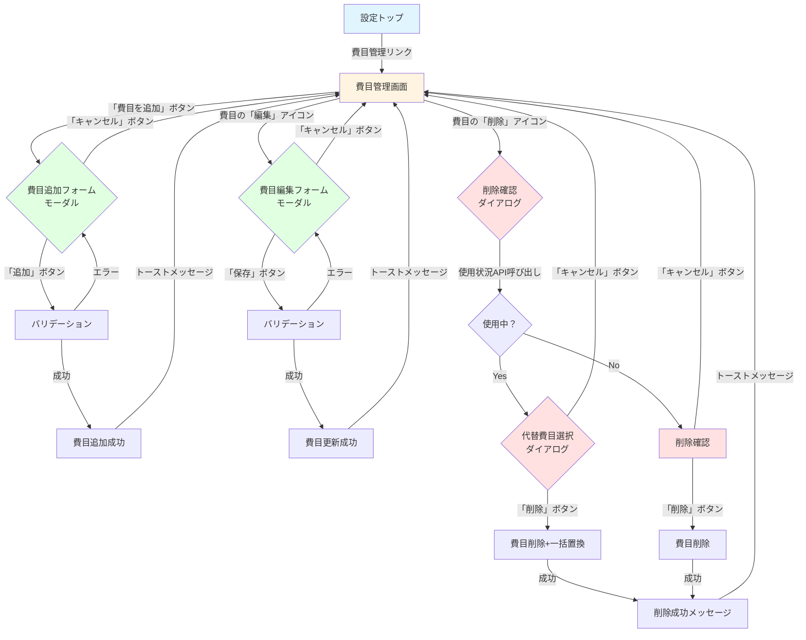
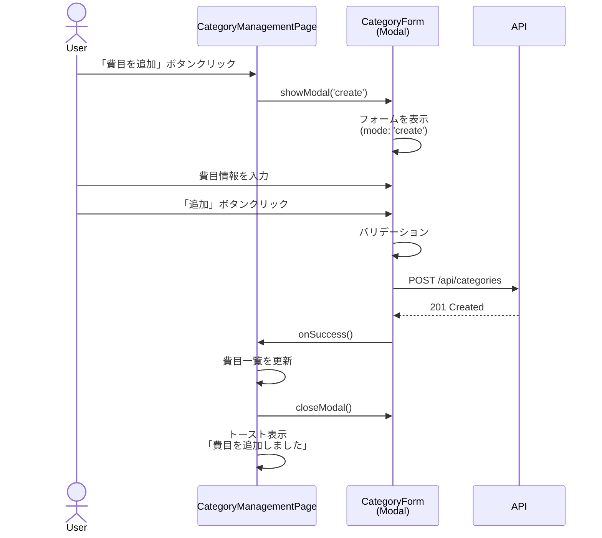
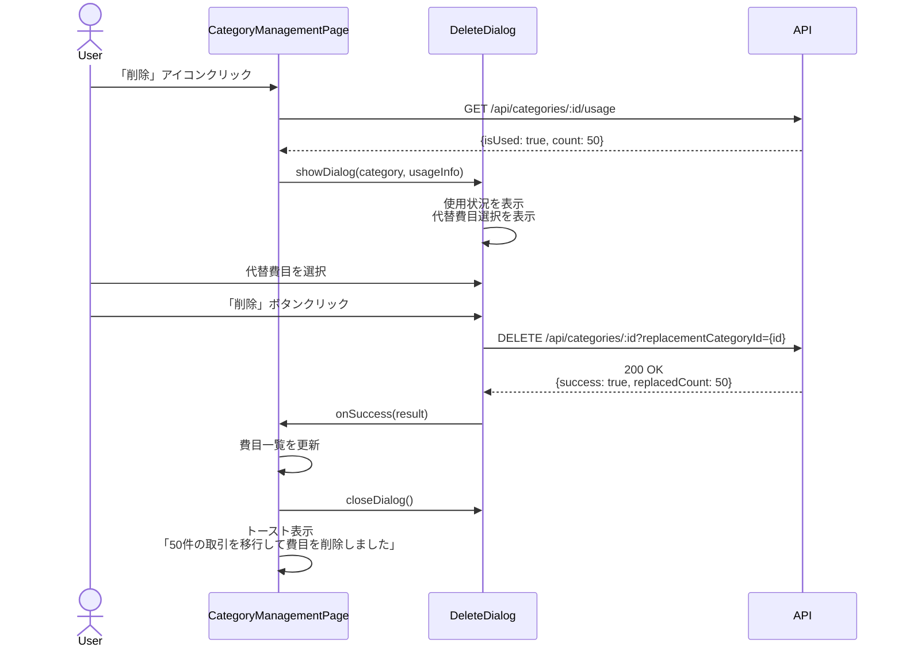

# 画面遷移図

このドキュメントでは、費目のカスタマイズ機能（FR-011）の画面遷移を記載しています。

## 目次

1. [画面遷移全体図](#画面遷移全体図)
2. [各画面の詳細](#各画面の詳細)
3. [モーダル・ダイアログ遷移](#モーダルダイアログ遷移)
4. [画面仕様](#画面仕様)

---

## 画面遷移全体図

### メイン遷移フロー



### 画面の種類

- **費目管理画面**: 費目の一覧表示、追加・編集・削除のエントリーポイント
- **費目追加フォーム**: モーダルダイアログで新規費目を作成
- **費目編集フォーム**: モーダルダイアログで既存費目を編集
- **削除確認ダイアログ**: 削除前の確認と使用状況の表示
- **代替費目選択ダイアログ**: 使用中の費目を削除する際の代替費目選択

---

## 各画面の詳細

### 1. 費目管理画面

#### 画面ID

`category-management`

#### URL

`/settings/categories`

#### 概要

すべての費目（デフォルト + カスタム）を一覧表示し、追加・編集・削除を行う画面

#### 表示内容

**タブバー**:

- 🟢 収入
- 🔴 支出
- 🔵 振替
- 🟡 返済
- 🟣 投資

**費目一覧テーブル**（タブごと）:

| アイコン | 費目名 | 種別       | 操作        |
| -------- | ------ | ---------- | ----------- |
| 🍔       | 食費   | デフォルト | 編集        |
| 🐕       | ペット | カスタム   | 編集 / 削除 |

**ボタン**:

- `+費目を追加` ボタン（各タブの下部）

**フィルタリング**:

- カテゴリタブによる自動フィルタリング
- デフォルト/カスタムの表示切り替え（トグルボタン）

**ソート**:

- 表示順序でソート（`order` ASC）
- 同一orderの場合は名前の昇順

#### 遷移先

- `category-create-modal`: 「費目を追加」ボタンクリック時
- `category-edit-modal`: 費目の「編集」アイコンクリック時
- `category-delete-dialog`: 費目の「削除」アイコンクリック時

#### API連携

- `GET /api/categories`: 初回読み込み時
- `GET /api/categories?type=EXPENSE`: タブ切り替え時

#### 状態管理

```typescript
interface CategoryManagementState {
  categories: CategoryResponse[];
  selectedType: CategoryType; // タブで選択中のカテゴリ
  loading: boolean;
  error: string | null;
  showModal: 'create' | 'edit' | 'delete' | null;
  selectedCategory: CategoryResponse | null;
}
```

---

### 2. 費目追加フォーム（モーダル）

#### 画面ID

`category-create-modal`

#### 概要

新しいカスタム費目を追加するモーダルダイアログ

#### 表示内容

**モーダルヘッダー**:

- タイトル: 「費目を追加」
- 閉じるボタン（×）

**入力フォーム**:

| フィールド | 型             | 必須 | プレースホルダー | デフォルト値                 |
| ---------- | -------------- | ---- | ---------------- | ---------------------------- |
| カテゴリ   | 選択           | ✅   | -                | 現在選択中のタブのカテゴリ   |
| 費目名     | テキスト       | ✅   | "例: ペット"     | 空                           |
| アイコン   | 選択           | ❌   | "絵文字を選択"   | null                         |
| 色         | カラーピッカー | ❌   | -                | プリセットカラー候補から選択 |

**ボタン**:

- `キャンセル` ボタン（左下）
- `追加` ボタン（右下、プライマリ）

#### バリデーション

| フィールド | ルール                         | エラーメッセージ                          |
| ---------- | ------------------------------ | ----------------------------------------- |
| カテゴリ   | 必須                           | "カテゴリを選択してください"              |
| 費目名     | 必須、1-50文字                 | "費目名は1〜50文字で入力してください"     |
| 費目名     | 重複チェック（同一カテゴリ内） | "この費目名は既に存在します"              |
| アイコン   | 絵文字1文字                    | "アイコンは絵文字1文字で指定してください" |
| 色         | #RRGGBB形式                    | "無効なカラーコードです"                  |

#### 遷移先

- `category-management`: 追加成功時、キャンセル時

#### API連携

- `POST /api/categories`: 「追加」ボタンクリック時

#### 状態管理

```typescript
interface CategoryFormState {
  formData: {
    name: string;
    type: CategoryType;
    parentId: string | null;
    icon: string | null;
    color: string | null;
  };
  errors: Record<string, string>;
  isSubmitting: boolean;
}
```

---

### 3. 費目編集フォーム（モーダル）

#### 画面ID

`category-edit-modal`

#### 概要

既存費目の名称、アイコン、色を編集するモーダルダイアログ

#### 表示内容

**モーダルヘッダー**:

- タイトル: 「費目を編集」
- 閉じるボタン（×）

**入力フォーム**:

| フィールド | 型             | 必須 | 初期値 | 編集可否 |
| ---------- | -------------- | ---- | ------ | -------- |
| カテゴリ   | 選択           | ✅   | 既存値 | ❌ 不可  |
| 費目名     | テキスト       | ✅   | 既存値 | ✅       |
| アイコン   | 選択           | ❌   | 既存値 | ✅       |
| 色         | カラーピッカー | ❌   | 既存値 | ✅       |

**注記**:

- デフォルト費目の場合も編集可能
- カテゴリ（type）は変更不可（グレーアウト表示）

**ボタン**:

- `キャンセル` ボタン（左下）
- `保存` ボタン（右下、プライマリ）

#### バリデーション

費目追加フォームと同じ

#### 遷移先

- `category-management`: 更新成功時、キャンセル時

#### API連携

- `GET /api/categories/:id`: モーダルオープン時（既存データ取得）
- `PUT /api/categories/:id`: 「保存」ボタンクリック時

---

### 4. 削除確認ダイアログ

#### 画面ID

`category-delete-dialog`

#### 概要

費目削除前の確認と使用状況の表示

#### 表示内容

**ダイアログヘッダー**:

- タイトル: 「費目を削除」

**確認メッセージ**:

**パターン1: 未使用の費目**

```
「{費目名}」を削除しますか？

この操作は取り消せません。
```

**パターン2: 使用中の費目**

```
「{費目名}」は{N}件の取引で使用されています。

削除するには、代替費目を選択してください。
すべての取引が代替費目に移行されます。
```

**代替費目選択（使用中の場合のみ表示）**:

- ドロップダウンリスト
- 同じカテゴリの費目のみ選択可能
- デフォルトで未選択状態

**ボタン**:

- `キャンセル` ボタン（左下）
- `削除` ボタン（右下、危険色）
  - 使用中の場合、代替費目を選択するまで無効化

#### 遷移先

- `category-management`: 削除成功時、キャンセル時

#### API連携

- `GET /api/categories/:id/usage`: ダイアログオープン時
- `DELETE /api/categories/:id`: 「削除」ボタンクリック時（未使用）
- `DELETE /api/categories/:id?replacementCategoryId={id}`: 「削除」ボタンクリック時（使用中）

#### 状態管理

```typescript
interface DeleteDialogState {
  category: CategoryResponse;
  usageInfo: CategoryUsageResponse | null;
  replacementCategoryId: string | null;
  isLoading: boolean;
  error: string | null;
}
```

---

### 5. 代替費目選択ダイアログ

#### 画面ID

`category-replacement-dialog`

#### 概要

使用中の費目を削除する際の代替費目選択ダイアログ

**注**: 実際には削除確認ダイアログ内に組み込まれます（上記参照）

---

## モーダル・ダイアログ遷移

### モーダルの表示・非表示



### 削除フローの詳細



---

## 画面仕様

### UI/UXガイドライン

#### レイアウト

**費目管理画面**:

```
┌─────────────────────────────────────────────┐
│ 設定 / 費目管理                              │
├─────────────────────────────────────────────┤
│ [🟢収入] [🔴支出] [🔵振替] [🟡返済] [🟣投資] │
├─────────────────────────────────────────────┤
│ [✓ デフォルトを表示] [✓ カスタムを表示]     │
├─────────────────────────────────────────────┤
│ アイコン │ 費目名     │ 種別       │ 操作   │
├─────────────────────────────────────────────┤
│ 🍔      │ 食費       │ デフォルト │ [編集] │
│ 🏠      │ 住居       │ デフォルト │ [編集] │
│ 🐕      │ ペット     │ カスタム   │ [編集][削除] │
│ ...                                          │
├─────────────────────────────────────────────┤
│                     [+ 費目を追加]           │
└─────────────────────────────────────────────┘
```

**費目追加フォーム（モーダル）**:

```
┌─────────────────────────────────────────────┐
│ 費目を追加                              [×] │
├─────────────────────────────────────────────┤
│                                              │
│ カテゴリ *                                   │
│ [支出 ▼]                                     │
│                                              │
│ 費目名 *                                     │
│ [____________________________]               │
│                                              │
│ アイコン                                     │
│ [🔍 選択...]                                 │
│                                              │
│ 色                                           │
│ [🎨 ○ ○ ○ ○ ○ ○ ○ ○]                      │
│                                              │
├─────────────────────────────────────────────┤
│ [キャンセル]           [追加]                │
└─────────────────────────────────────────────┘
```

**削除確認ダイアログ（使用中）**:

```
┌─────────────────────────────────────────────┐
│ 費目を削除                              [×] │
├─────────────────────────────────────────────┤
│                                              │
│ ⚠️ 「ペット」は50件の取引で使用されています。│
│                                              │
│ 削除するには、代替費目を選択してください。   │
│ すべての取引が代替費目に移行されます。       │
│                                              │
│ 代替費目 *                                   │
│ [費目を選択 ▼]                               │
│                                              │
│ 取引サンプル（先頭10件）:                    │
│ • 2025/11/01 - ペットフード - ¥2,000        │
│ • 2025/11/05 - 動物病院 - ¥5,000            │
│ • ...                                        │
│                                              │
├─────────────────────────────────────────────┤
│ [キャンセル]           [削除]                │
└─────────────────────────────────────────────┘
```

#### カラーパレット

**プリセットカラー（選択候補）**:

- 🔴 #F44336 (赤)
- 🟠 #FF9800 (オレンジ)
- 🟡 #FFEB3B (黄)
- 🟢 #4CAF50 (緑)
- 🔵 #2196F3 (青)
- 🟣 #9C27B0 (紫)
- 🟤 #795548 (茶)
- ⚫ #607D8B (グレー)

#### アイコンピッカー

**絵文字カテゴリ**:

- 食べ物: 🍔 🍕 🍣 🍜 🍰 ☕
- 交通: 🚗 🚇 🚲 ✈️ 🚢 ⛽
- 家: 🏠 🛏️ 🔌 💡 🚿 🔥
- 趣味: 🎮 📚 🎵 🎬 ⚽ 🎨
- その他: 💰 💳 🏥 🏫 🎓 🐕

**UI**:

- グリッド表示（8列）
- スクロール可能
- ホバー時にツールチップ表示

#### アクセシビリティ

- **キーボード操作**:
  - Tab/Shift+Tab: フォーカス移動
  - Enter: 送信/選択
  - Esc: モーダル/ダイアログを閉じる
  - Arrow Keys: アイコンピッカーでの移動

- **スクリーンリーダー対応**:
  - すべてのフォーム要素に`aria-label`を設定
  - エラーメッセージに`aria-live="polite"`を設定
  - モーダルに`role="dialog"`、`aria-modal="true"`を設定

- **カラーコントラスト**:
  - WCAG AA基準を満たす（4.5:1以上）
  - エラーメッセージは赤色+アイコンで表現

---

## トースト通知

### 成功メッセージ

| アクション         | メッセージ                                 | 表示時間 |
| ------------------ | ------------------------------------------ | -------- |
| 費目追加           | ✅ 費目を追加しました                      | 3秒      |
| 費目更新           | ✅ 費目を更新しました                      | 3秒      |
| 費目削除（未使用） | ✅ 費目を削除しました                      | 3秒      |
| 費目削除（使用中） | ✅ {N}件の取引を移行して費目を削除しました | 5秒      |

### エラーメッセージ

| エラー                 | メッセージ                                      | 表示時間 |
| ---------------------- | ----------------------------------------------- | -------- |
| バリデーションエラー   | ❌ {フィールド名}: {エラーメッセージ}           | 5秒      |
| 重複エラー             | ❌ この費目名は既に存在します                   | 5秒      |
| デフォルト費目削除試行 | ❌ デフォルト費目は削除できません               | 5秒      |
| 使用中費目削除試行     | ❌ 使用中の費目です。代替費目を指定してください | 5秒      |
| サーバーエラー         | ❌ エラーが発生しました。もう一度お試しください | 5秒      |

---

## 参考資料

- [README.md](./README.md) - 設計書の概要
- [class-diagrams.md](./class-diagrams.md) - クラス構造
- [sequence-diagrams.md](./sequence-diagrams.md) - 処理フロー
- [input-output-design.md](./input-output-design.md) - API仕様
