# シーケンス図

このドキュメントでは、費目のカスタマイズ機能（FR-011）の処理フローをシーケンス図で記載しています。

## 目次

1. [費目追加のフロー](#費目追加のフロー)
2. [費目編集のフロー](#費目編集のフロー)
3. [費目削除のフロー（使用中）](#費目削除のフロー使用中)
4. [費目一覧取得のフロー](#費目一覧取得のフロー)
5. [費目使用状況確認のフロー](#費目使用状況確認のフロー)
6. [エラーハンドリングフロー](#エラーハンドリングフロー)

---

## 費目追加のフロー

### 概要

**ユースケース**: ユーザーが新しいカスタム費目を追加する

**アクター**: ユーザー

**前提条件**:

- ユーザーが費目管理画面にアクセスしている
- 有効な親カテゴリ（収入/支出/振替/返済/投資）が選択されている

**成功時の結果**:

- 新しい費目がデータベースに保存される
- 費目一覧に新規費目が表示される

### 正常系フロー

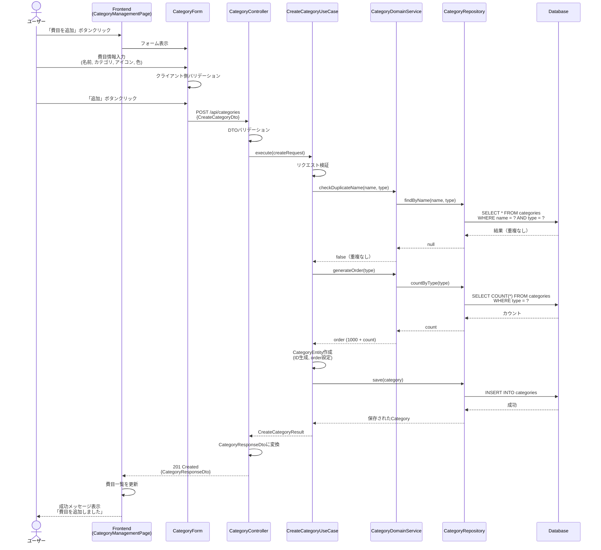

### ステップ詳細

1. **ユーザーアクション**
   - 費目管理画面で「費目を追加」ボタンをクリック

2. **フォーム表示**
   - CategoryFormコンポーネントがモーダルで表示される
   - 必須項目: 費目名、親カテゴリ
   - 任意項目: アイコン、色

3. **Frontend バリデーション**
   - 費目名: 1-50文字
   - 親カテゴリ: 有効なCategoryType
   - 色: HEXカラーコード形式

4. **API リクエスト**
   - エンドポイント: `POST /api/categories`
   - RequestDTO: `CreateCategoryDto`

5. **UseCase 実行**
   - 重複チェック（同一親カテゴリ内で同名の費目がないか）
   - 表示順序の生成（カスタム費目は1000以降）
   - UUIDでIDを生成
   - トランザクション境界: save()メソッド内

6. **データ永続化**
   - `categories`テーブルにINSERT
   - `is_system_defined: false`として保存

7. **レスポンス**
   - ResponseDTO: `CategoryResponseDto`
   - HTTPステータス: 201 Created

---

## 費目編集のフロー

### 概要

**ユースケース**: 既存費目の名称、アイコン、色を編集する

**アクター**: ユーザー

**前提条件**:

- 編集対象の費目が存在する
- 費目が編集可能（デフォルト費目も編集可）

**成功時の結果**:

- 費目情報が更新される
- 費目一覧に更新内容が反映される

### 正常系フロー

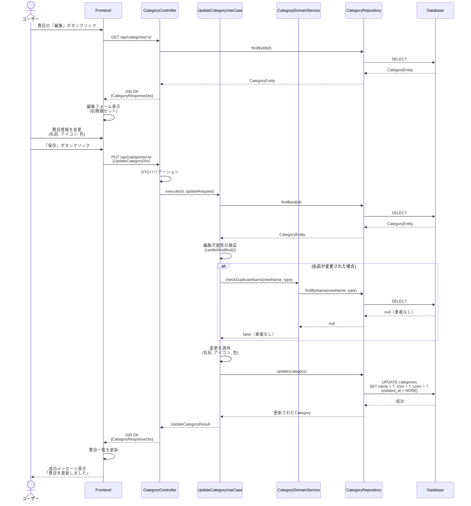

### ステップ詳細

1. **費目情報取得**
   - 編集対象の費目をAPIから取得
   - 編集フォームに初期値として設定

2. **バリデーション**
   - 編集可能性の検証（削除不可のデフォルト費目も編集は可能）
   - 名前が変更された場合、重複チェックを実行

3. **更新処理**
   - 変更された項目のみを適用
   - `updated_at`タイムスタンプを更新

4. **親カテゴリの変更**
   - 親カテゴリ（type）の変更は不可
   - UIで無効化される

---

## 費目削除のフロー（使用中）

### 概要

**ユースケース**: 使用中の費目を代替費目に置き換えて削除する

**アクター**: ユーザー

**前提条件**:

- 削除対象の費目が存在する
- 削除対象の費目が取引データで使用されている

**成功時の結果**:

- すべての取引データが代替費目に置き換えられる
- 費目が論理削除される

### 正常系フロー

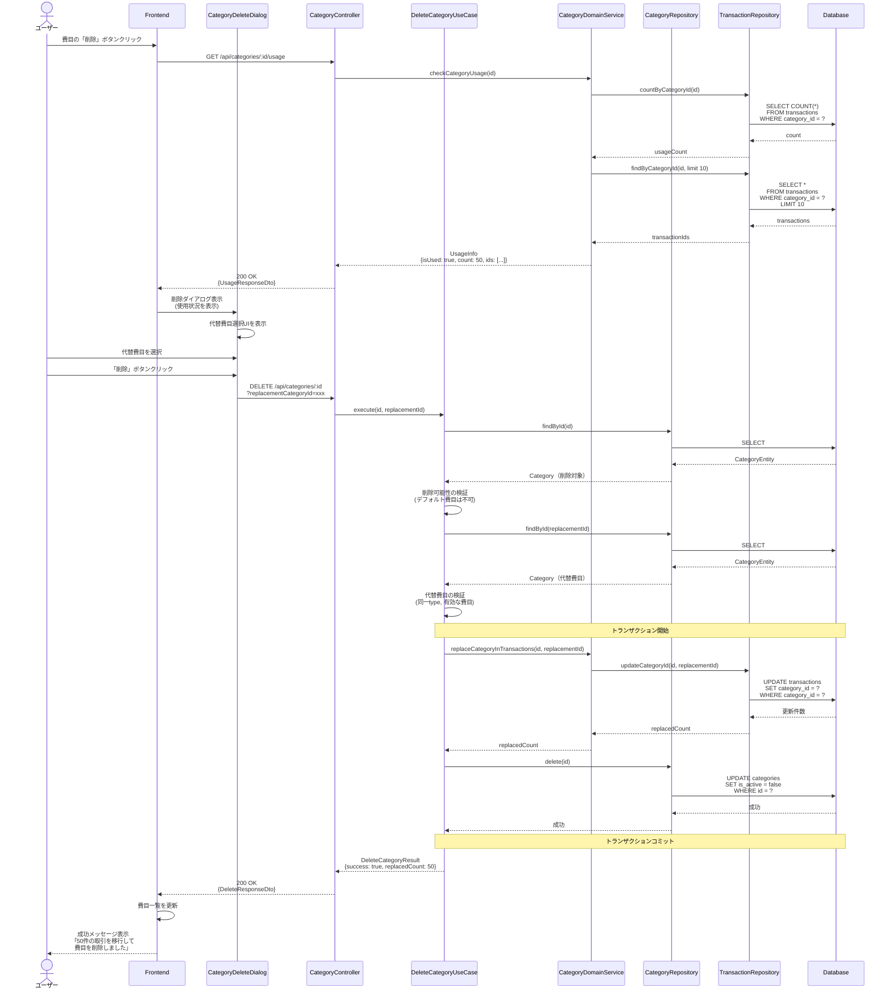

### ステップ詳細

1. **使用状況確認**
   - 削除前に費目の使用状況を確認
   - 使用中の取引件数と取引IDのサンプル（先頭10件）を取得

2. **代替費目選択**
   - 使用中の場合、削除ダイアログで代替費目の選択を促す
   - 同じ親カテゴリの費目のみ選択可能

3. **バリデーション**
   - デフォルト費目は削除不可
   - 代替費目が同じカテゴリタイプであることを検証

4. **トランザクション内での一括処理**
   - すべての取引データの費目を代替費目に更新
   - 費目を論理削除（`is_active = false`）
   - ロールバック可能

5. **完了通知**
   - 移行した取引件数をユーザーに通知

---

## 費目一覧取得のフロー

### 概要

**ユースケース**: すべての費目（デフォルト + カスタム）を取得する

**アクター**: ユーザー

**前提条件**:

- なし

**成功時の結果**:

- 費目一覧が階層構造で表示される

### 正常系フロー

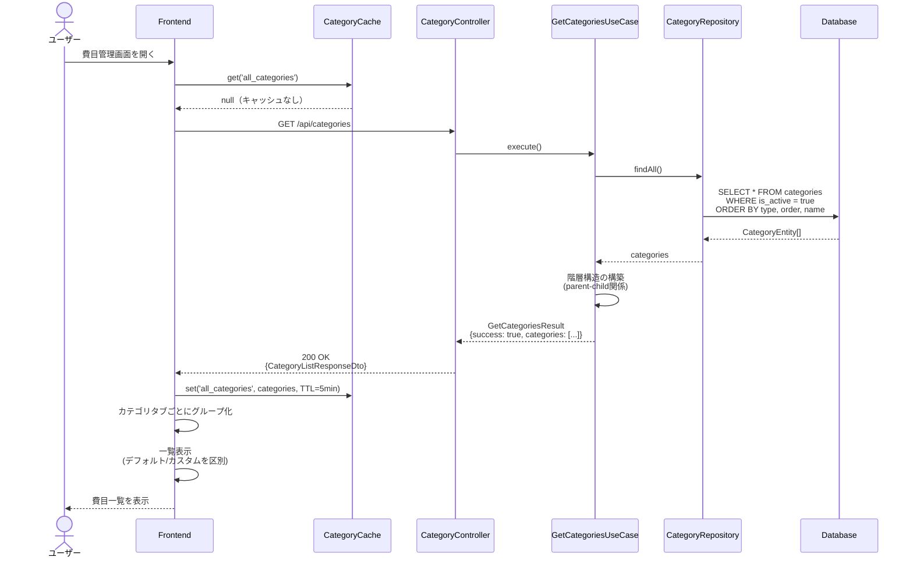

### カテゴリタイプフィルタリング

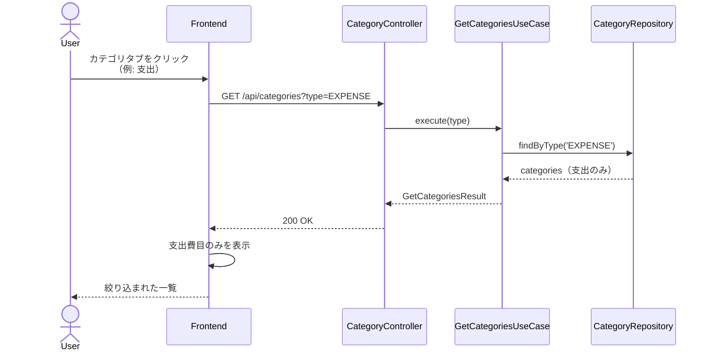

---

## 費目使用状況確認のフロー

### 概要

**ユースケース**: 費目が取引データで使用されているか確認する

**アクター**: システム（削除前に自動実行）

**前提条件**:

- 対象費目が存在する

**成功時の結果**:

- 使用状況情報が返却される

### 正常系フロー

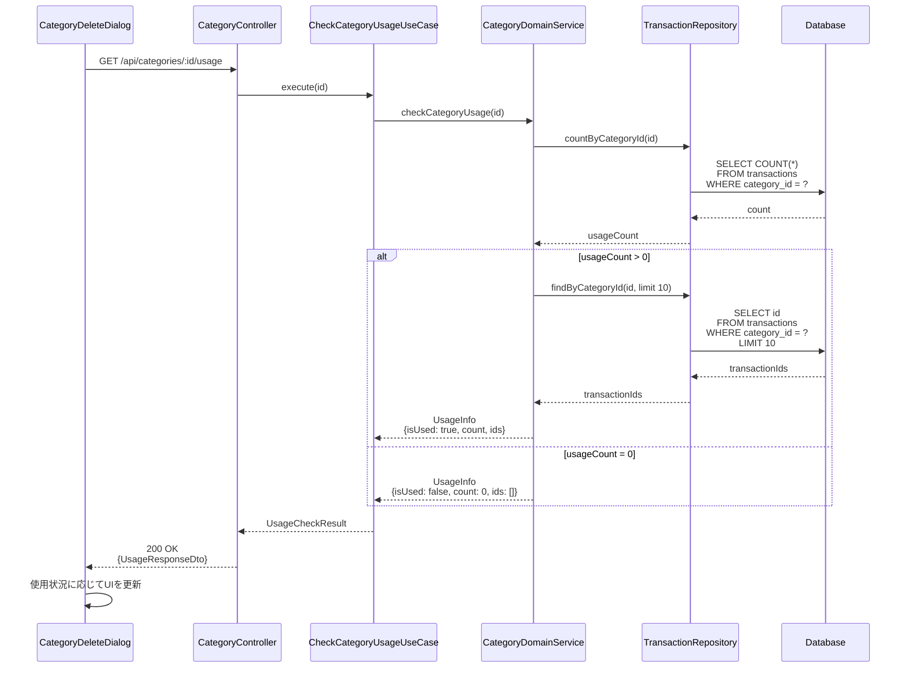

---

## エラーハンドリングフロー

### バリデーションエラー (400 Bad Request)

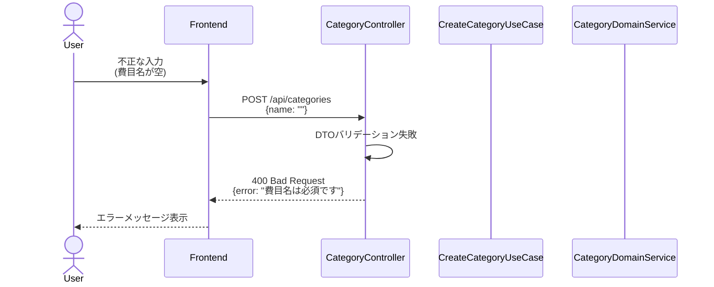

### 重複エラー (400 Bad Request)

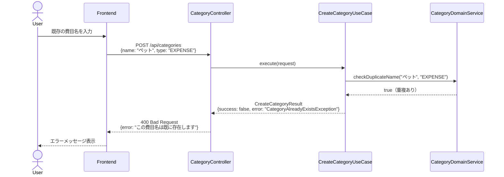

### デフォルト費目削除エラー (403 Forbidden)

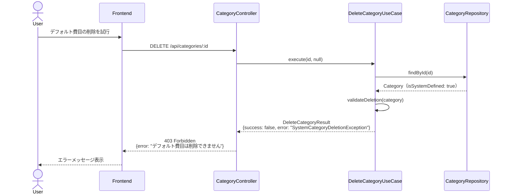

### 使用中費目削除エラー (409 Conflict)

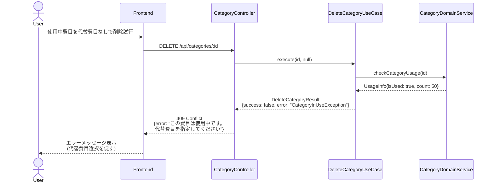

### 費目が見つからない (404 Not Found)

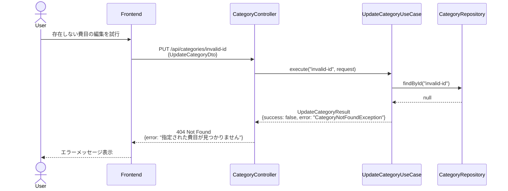

---

## トランザクション境界

### 費目削除時のトランザクション

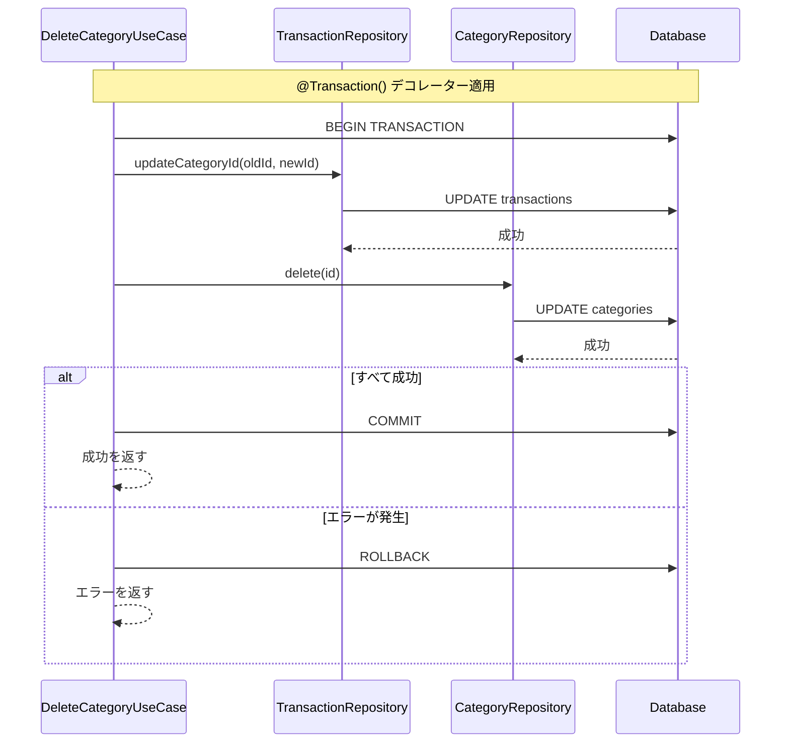

---

## パフォーマンス最適化

### キャッシング戦略

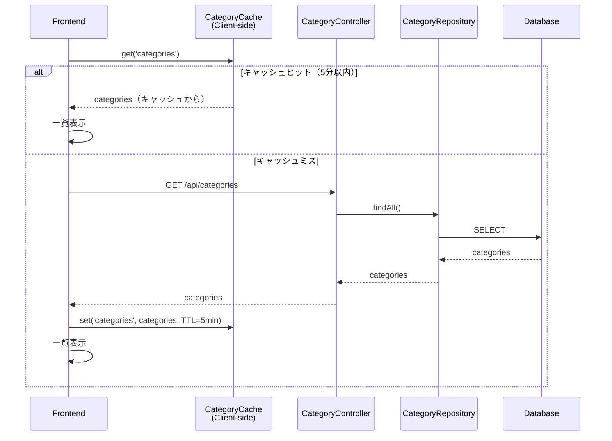

---

## 参考資料

- [README.md](./README.md) - 設計書の概要
- [class-diagrams.md](./class-diagrams.md) - クラス構造
- [input-output-design.md](./input-output-design.md) - API仕様
- [screen-transitions.md](./screen-transitions.md) - 画面遷移
