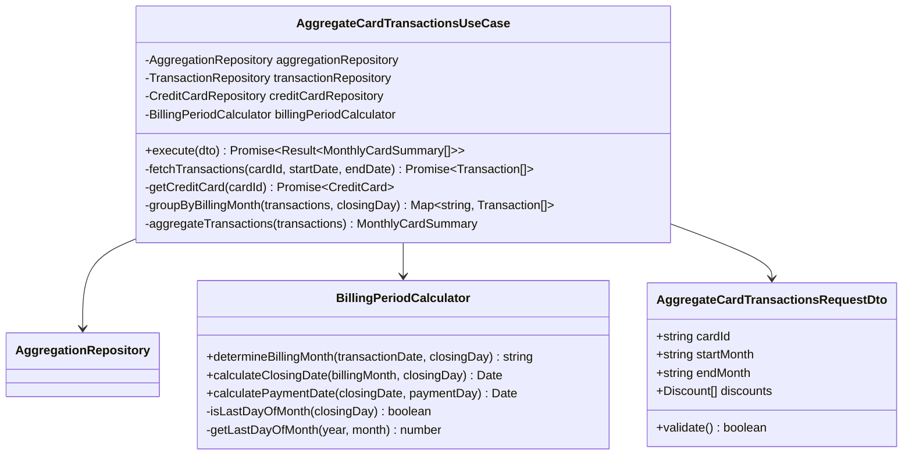
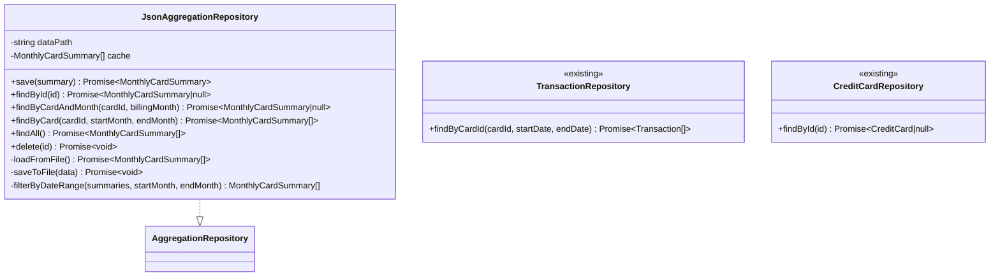
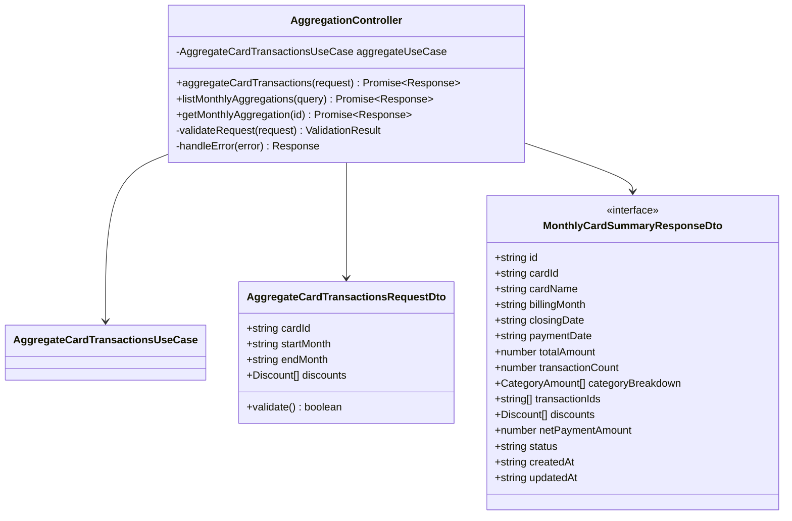
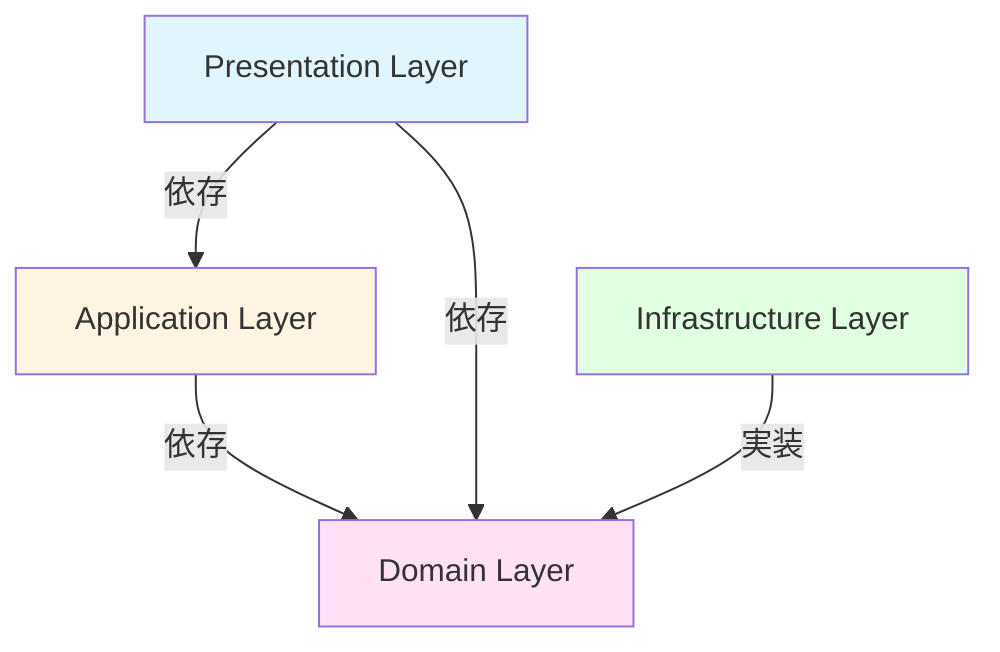
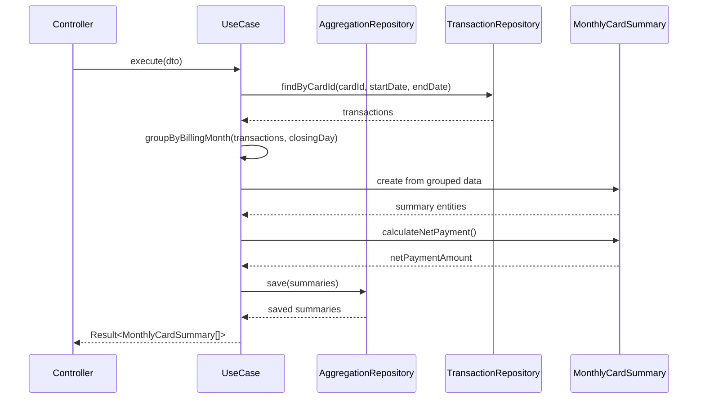

# クラス図

このドキュメントでは、クレジットカード月別集計機能のクラス構造を記載しています。

## 目次

1. [Domain層クラス図](#domain層クラス図)
2. [Application層クラス図](#application層クラス図)
3. [Infrastructure層クラス図](#infrastructure層クラス図)
4. [Presentation層クラス図](#presentation層クラス図)

---

## Domain層クラス図

### Aggregation Module

```mermaid
classDiagram
    class MonthlyCardSummary {
        +string id
        +string cardId
        +string cardName
        +string billingMonth
        +Date closingDate
        +Date paymentDate
        +number totalAmount
        +number transactionCount
        +CategoryAmount[] categoryBreakdown
        +string[] transactionIds
        +Discount[] discounts
        +number netPaymentAmount
        +PaymentStatus status
        +Date createdAt
        +Date updatedAt
        +calculateNetPayment() number
        +addDiscount(discount) void
    }

    note right of MonthlyCardSummary
        エンティティからDTOへの変換は、
        Application層のUseCaseまたは
        Presentation層のマッパーで実施
    end note

    class CategoryAmount {
        +string category
        +number amount
        +number count
    }

    class Discount {
        +DiscountType type
        +number amount
        +string description
    }

    class PaymentStatus {
        <<enumeration>>
        PENDING
        PROCESSING
        PAID
        OVERDUE
        PARTIAL
        DISPUTED
        CANCELLED
        MANUAL_CONFIRMED
    }

    class DiscountType {
        <<enumeration>>
        POINT
        CASHBACK
        CAMPAIGN
    }

    class AggregationRepository {
        <<interface>>
        +save(summary) Promise~MonthlyCardSummary~
        +findById(id) Promise~MonthlyCardSummary|null~
        +findByCardAndMonth(cardId, billingMonth) Promise~MonthlyCardSummary|null~
        +findByCard(cardId, startMonth, endMonth) Promise~MonthlyCardSummary[]~
        +findAll() Promise~MonthlyCardSummary[]~
        +delete(id) Promise~void~
    }

    MonthlyCardSummary --> CategoryAmount
    MonthlyCardSummary --> Discount
    MonthlyCardSummary --> PaymentStatus
    Discount --> DiscountType
```

**クラス説明**:

#### MonthlyCardSummary

- **責務**: カード利用明細の月別集計データを保持し、支払額計算を行う
- **主要メソッド**:
  - `calculateNetPayment()`: ポイント利用・キャッシュバックを控除した最終支払額を計算
  - `addDiscount(discount)`: 割引・ポイント利用を追加
- **注意**: エンティティからDTOへの変換は、Application層のUseCaseまたはPresentation層のマッパーで行う（Onion Architecture原則遵守）
- **ビジネスルール**:
  - 支払額 = 合計金額 - 割引合計（0円未満にはならない）
  - 締め日に基づいて請求月を決定

#### CategoryAmount

- **責務**: カテゴリ別の集計金額を保持
- **不変性**: 値オブジェクトとして不変（immutable）

#### Discount

- **責務**: 割引・ポイント利用・キャッシュバック情報を保持
- **不変性**: 値オブジェクトとして不変（immutable）

#### PaymentStatus

- **責務**: 支払いステータスの定義
- **値**:
  - PENDING: 未払い（引落前）
  - PROCESSING: 処理中（引落予定日前後）
  - PAID: 支払済（照合完了）
  - OVERDUE: 延滞
  - PARTIAL: 一部支払い
  - DISPUTED: 不一致（要確認）
  - CANCELLED: キャンセル
  - MANUAL_CONFIRMED: 手動確認済

#### DiscountType

- **責務**: 割引タイプの定義
- **値**:
  - POINT: ポイント利用
  - CASHBACK: キャッシュバック
  - CAMPAIGN: キャンペーン割引

---

## Application層クラス図

### Use Cases and Services



**クラス説明**:

#### AggregateCardTransactionsUseCase

- **責務**: カード利用明細の月別集計を実行する
- **依存**: AggregationRepository, TransactionRepository, CreditCardRepository, BillingPeriodCalculator
- **入力**: `AggregateCardTransactionsRequestDto`
- **出力**: `Result<MonthlyCardSummary[]>`
- **処理フロー**:
  1. カード情報取得（締め日、支払日）
  2. 指定期間の取引データ取得
  3. 締め日に基づいて請求月別にグループ化
  4. 月別に集計（カテゴリ別内訳、合計金額）
  5. 割引・ポイント利用を反映
  6. 最終支払額を計算
  7. 集計結果を保存

#### BillingPeriodCalculator

- **責務**: 締め日に基づく請求月・支払日の計算
- **主要メソッド**:
  - `determineBillingMonth()`: 取引日と締め日から請求月を判定
  - `calculateClosingDate()`: 請求月と締め日から締め日の日付を算出
  - `calculatePaymentDate()`: 締め日と支払日から支払日の日付を算出
- **ビジネスルール**:
  - 取引日 <= 締め日 → 当月請求
  - 取引日 > 締め日 → 翌月請求
  - 月末締めの場合は各月の最終日を考慮

---

## Infrastructure層クラス図

### Repository Implementations



**クラス説明**:

#### JsonAggregationRepository

- **責務**: 月別集計データのJSON形式での永続化
- **永続化方法**: JSON形式でファイルに保存（`data/aggregation/monthly-card-summary.json`）
- **キャッシング戦略**: ライトスルーキャッシュ
  - 読み取り時: メモリキャッシュが存在すればそれを返却、なければファイルから読み込み
  - 書き込み時: ファイルとメモリキャッシュを同時に更新（一貫性を保証）
  - 無効化: アプリケーション再起動時にキャッシュをクリア
- **主要メソッド**:
  - `save()`: 集計データを保存（既存データがある場合は更新）
  - `findByCardAndMonth()`: カードIDと請求月で検索
  - `findByCard()`: カードIDと期間で複数の集計データを取得
  - `filterByDateRange()`: 請求月の範囲でフィルタリング

#### TransactionRepository（既存）

- **責務**: 取引データの取得
- **使用箇所**: UseCaseから取引データを取得

#### CreditCardRepository（既存）

- **責務**: クレジットカード情報の取得
- **使用箇所**: UseCaseからカード設定（締め日、支払日）を取得

---

## Presentation層クラス図

### Controllers



**クラス説明**:

#### AggregationController

- **責務**: カード利用明細集計APIの提供
- **エンドポイント**:
  - `POST /api/aggregation/card/monthly`: 月別集計を実行
  - `GET /api/aggregation/card/monthly`: 月別集計の一覧を取得
  - `GET /api/aggregation/card/monthly/:id`: 月別集計の詳細を取得

#### AggregateCardTransactionsRequestDto（class）

- **責務**: リクエストデータの受け取りとバリデーション
- **バリデーション**:
  - cardId: 必須、UUID形式
  - startMonth: 必須、YYYY-MM形式
  - endMonth: 必須、YYYY-MM形式
  - 期間: startMonth <= endMonth
  - 期間: 最大12ヶ月

#### MonthlyCardSummaryResponseDto（interface）

- **責務**: レスポンスデータの構築
- **変換**: MonthlyCardSummary Entityから変換
- **日付形式**: ISO8601形式（YYYY-MM-DDTHH:mm:ss.sssZ）

---

## クラス間の関係性

### 依存関係の概要



### データフロー



---

## 実装上の注意点

### 型安全性

- すべてのクラスとメソッドに適切な型定義を行う
- `any`型の使用を避ける
- Genericsを活用して型の再利用性を高める
- RequestDTOは`class`、ResponseDTOは`interface`

### 依存性注入

- コンストラクタインジェクションを使用
- インターフェースに依存し、実装に依存しない
- NestJSのDIコンテナを活用

### イミュータビリティ

- CategoryAmount、Discountは不変とする
- MonthlyCardSummaryの更新は新しいインスタンスを返す
- Stateの直接変更を避ける

### エラーハンドリング

- カスタム例外クラスを定義
  - `CardNotFoundException`: カードが見つからない
  - `InvalidBillingPeriodException`: 無効な集計期間
  - `AggregationDataNotFoundException`: 集計データが見つからない
- 適切なエラーメッセージを提供
- エラーのロギング

### 計算ロジック

- 締め日計算時の月またぎ処理に注意
- 12月から1月への遷移を正しく処理
- 月末締めの場合、各月の日数を考慮（28/29/30/31日）
- 金額計算は小数点以下を切り捨て（整数のみ）

---

## チェックリスト

クラス図作成時の確認事項：

### Domain層

- [x] すべてのEntityが定義されている
- [x] Value Objectが適切に定義されている
- [x] Repositoryインターフェースが定義されている
- [x] ビジネスロジックがEntityに配置されている
- [x] Enumが適切に定義されている

### Application層

- [x] すべてのUseCaseが定義されている
- [x] DTOが適切に定義されている
- [x] サービスクラスが必要に応じて定義されている
- [x] 計算ロジックがサービスに分離されている

### Infrastructure層

- [x] Repositoryの実装クラスが定義されている
- [x] 永続化方法が明確（JSON）
- [x] 既存リポジトリとの連携が明確

### Presentation層

- [x] すべてのControllerが定義されている
- [x] RequestDTO、ResponseDTOが定義されている
- [x] エンドポイントが明確
- [x] RequestDTOはclass、ResponseDTOはinterface
