# シーケンス図

このドキュメントでは、クレジットカード月別集計機能の処理フローをシーケンス図で記載しています。

## 目次

1. [カード利用明細の月別集計のフロー](#カード利用明細の月別集計のフロー)
2. [月別集計一覧取得のフロー](#月別集計一覧取得のフロー)
3. [エラーハンドリングフロー](#エラーハンドリングフロー)

---

## カード利用明細の月別集計のフロー

### 概要

**ユースケース**: カード利用明細を月別に集計する

**アクター**: フロントエンド（将来対応）、外部システム

**前提条件**:

- クレジットカードが登録済み
- 締め日・支払日が設定済み
- 指定期間内に取引データが存在する

**成功時の結果**:

- 月別集計データが作成される
- 請求月、カテゴリ別内訳、支払額が正しく算出される
- 集計データがJSON形式で永続化される

### 正常系フロー

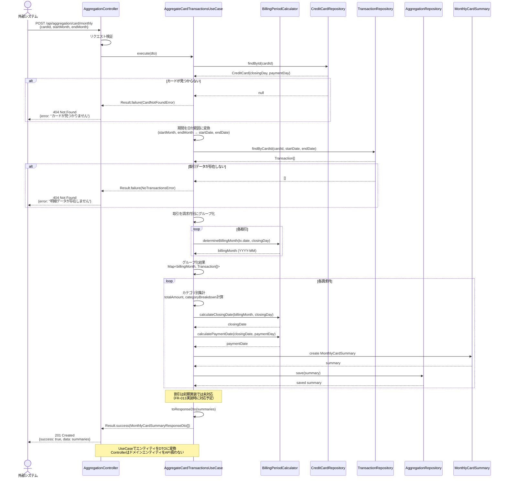

### ステップ詳細

1. **リクエスト受信**
   - エンドポイント: `POST /api/aggregation/card/monthly`
   - RequestDTO: `AggregateCardTransactionsRequestDto`
   - バリデーション: cardId（UUID）、startMonth/endMonth（YYYY-MM）、期間（最大12ヶ月）

2. **カード情報取得**
   - カードIDからクレジットカード情報を取得
   - 締め日（closingDay）、支払日（paymentDay）を取得
   - カードが存在しない場合は404エラー

3. **取引データ取得**
   - 指定期間（startMonth〜endMonth）の取引データを取得
   - 期間を日付範囲に変換（例: 2025-01 → 2025-01-01〜2025-01-31）
   - 取引が存在しない場合は404エラー

4. **請求月別グループ化**
   - 各取引の日付と締め日を比較
   - 取引日 <= 締め日 → 当月請求
   - 取引日 > 締め日 → 翌月請求
   - 請求月をキーとしてグループ化

5. **月別集計**
   - 各請求月ごとに集計処理
   - 合計金額、取引件数を計算
   - カテゴリ別内訳を作成
   - 締め日・支払日を算出

6. **支払額計算**
   - ポイント利用・キャッシュバックを控除
   - netPaymentAmount = totalAmount - sum(discounts)
   - 0円未満にはならない（Math.max(0, result)）

7. **永続化**
   - 月別集計データをJSON形式で保存
   - 既存データがある場合は更新

8. **レスポンス**
   - ResponseDTO: `MonthlyCardSummaryResponseDto[]`
   - HTTPステータス: 201 Created

---

## 月別集計一覧取得のフロー

### 概要

**ユースケース**: 特定カードの月別集計データを一覧取得

**アクター**: フロントエンド（将来対応）

**前提条件**:

- 集計データが既に作成されている

### 正常系フロー

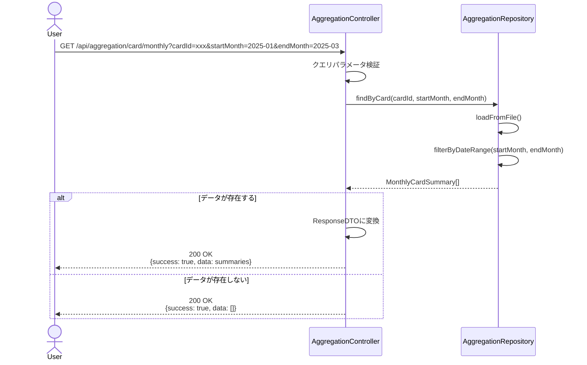

### 詳細取得フロー

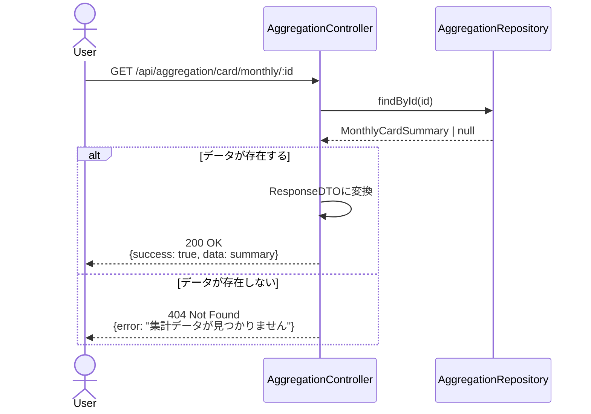

---

## エラーハンドリングフロー

### バリデーションエラー (400 Bad Request)

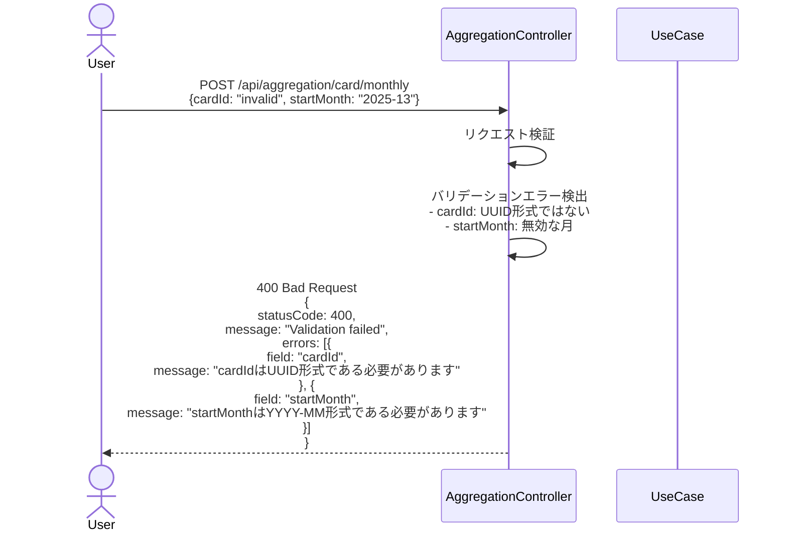

**エラーレスポンス例**:

```json
{
  "statusCode": 400,
  "message": "Validation failed",
  "errors": [
    {
      "field": "cardId",
      "message": "cardIdはUUID形式である必要があります"
    },
    {
      "field": "startMonth",
      "message": "startMonthはYYYY-MM形式である必要があります"
    }
  ]
}
```

### カード未検出エラー (404 Not Found)

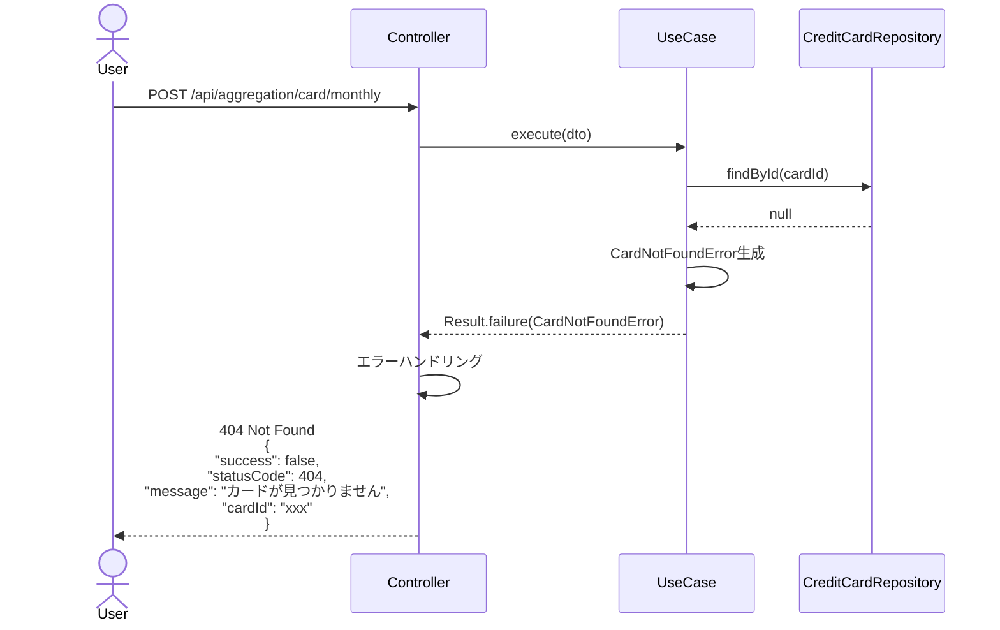

### 取引データ不存在エラー (404 Not Found)

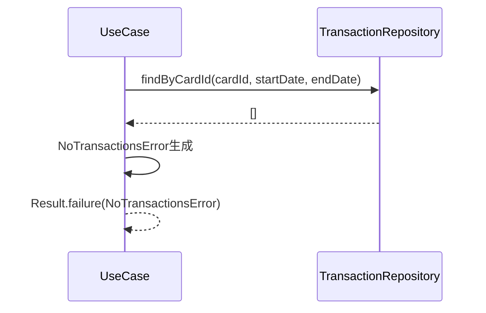

### サーバーエラー (500 Internal Server Error)

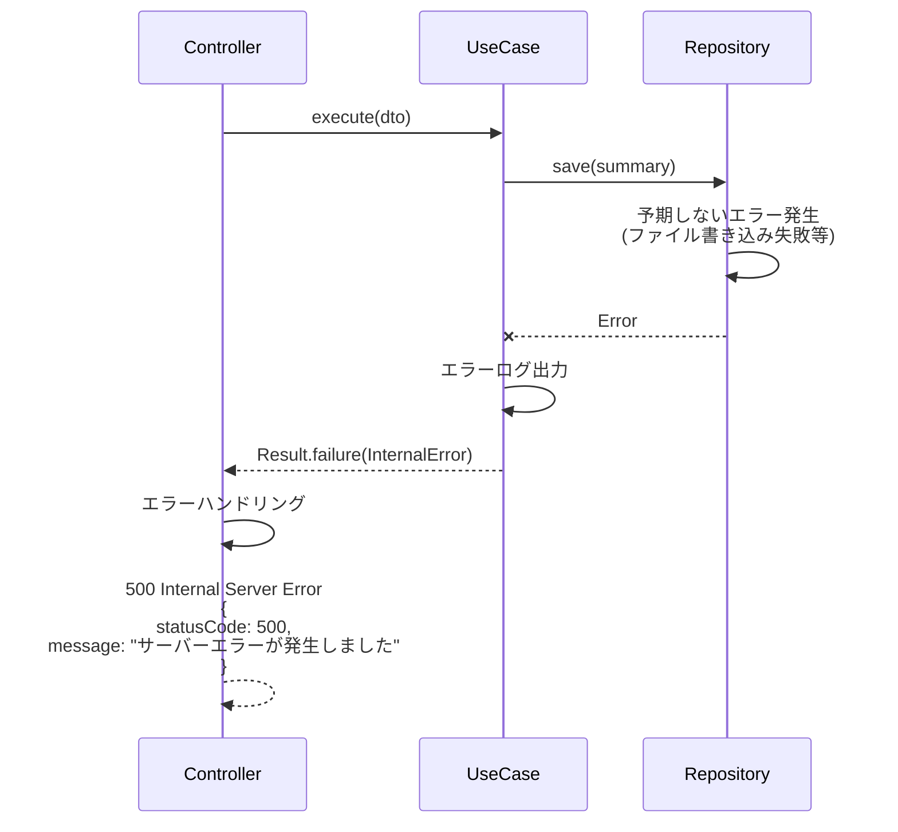

---

## 請求月判定ロジック詳細

### 月末締めの場合

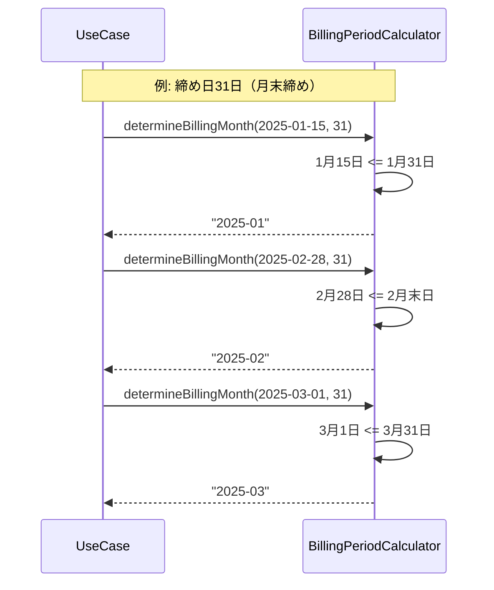

### 15日締めの場合

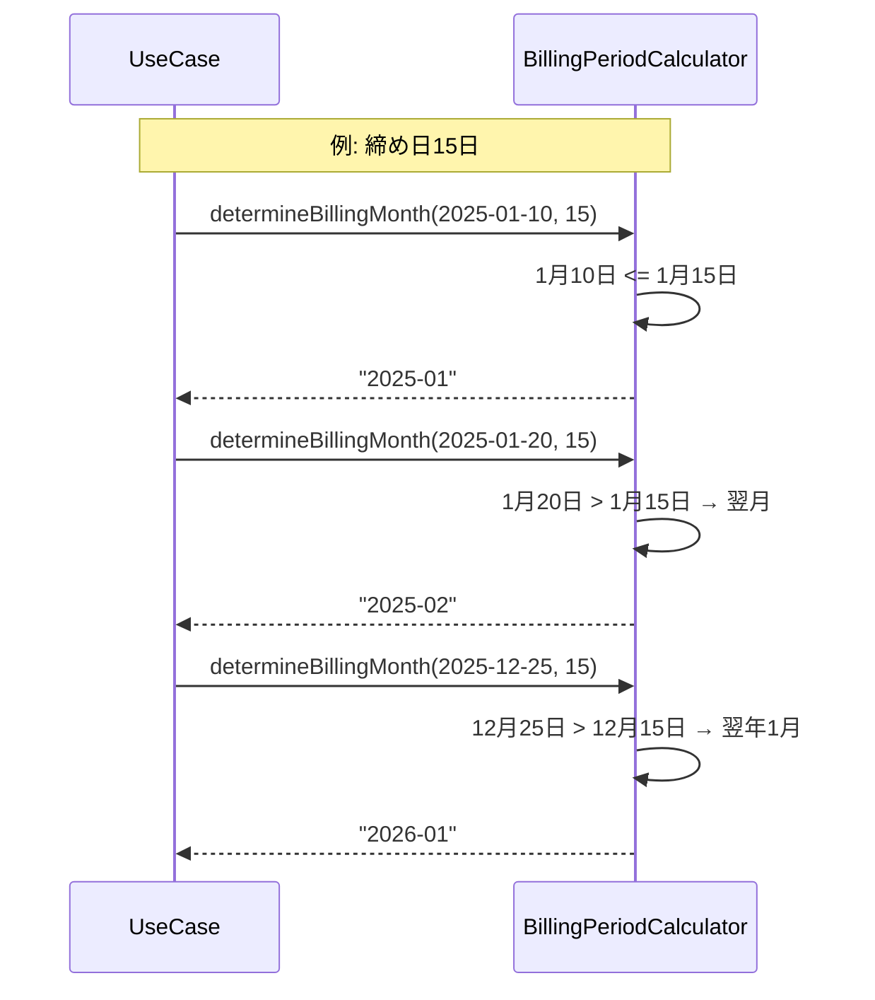

---

## 支払額計算フロー

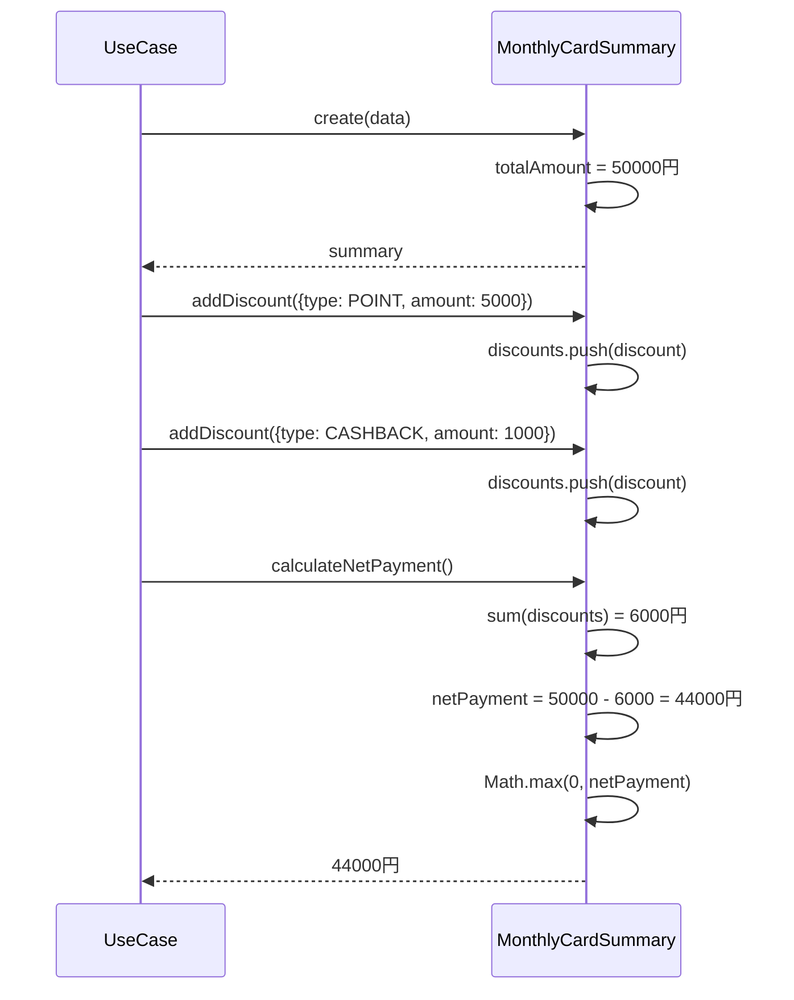

---

## パフォーマンス最適化

### キャッシング戦略（将来対応）

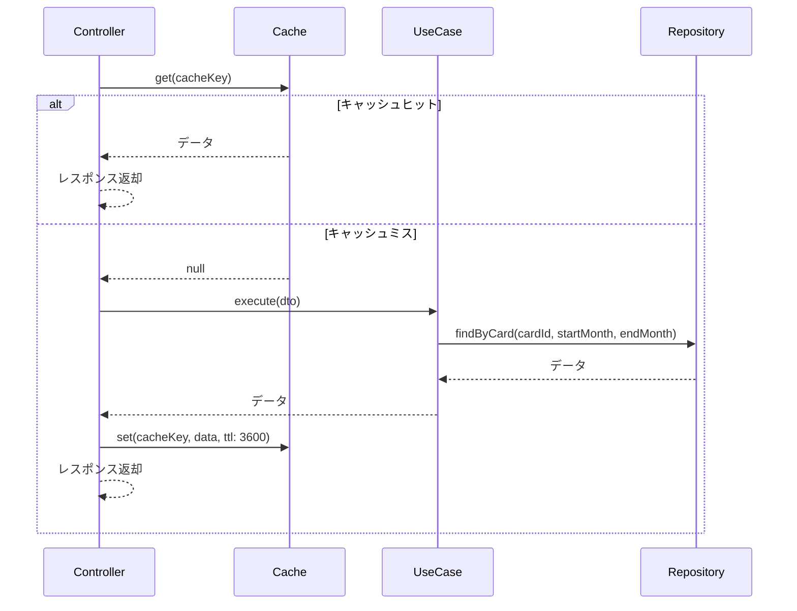

---

## チェックリスト

シーケンス図作成時の確認事項：

### 基本項目

- [x] 主要なユースケースがすべて記載されている
- [x] アクター、参加者が明確に定義されている
- [x] 正常系フローが記載されている
- [x] 異常系フローが記載されている

### 詳細項目

- [x] エラーハンドリングが明確
- [x] レスポンスの型とステータスコードが明記されている
- [x] 計算ロジックの詳細が記載されている
- [x] 請求月判定ロジックが明確

### 実装ガイド

- [x] 各ステップに説明が付与されている
- [x] 前提条件が明確
- [x] 成功時の結果が明確
- [x] エラーレスポンス例が記載されている
