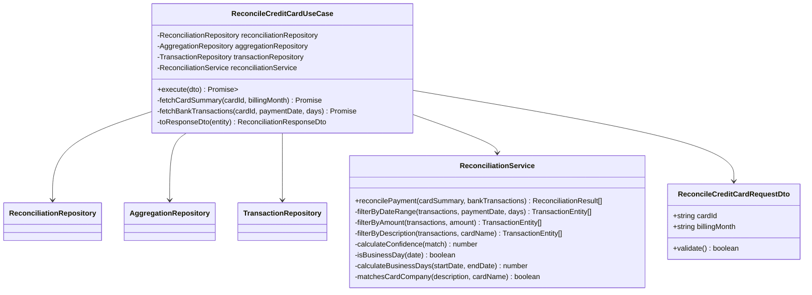
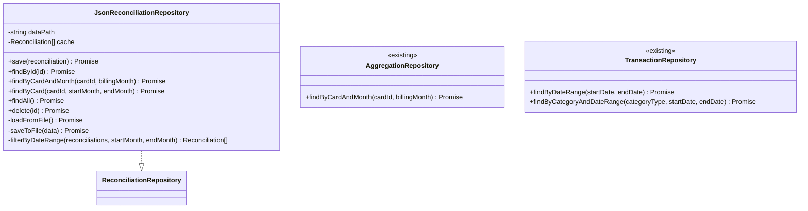
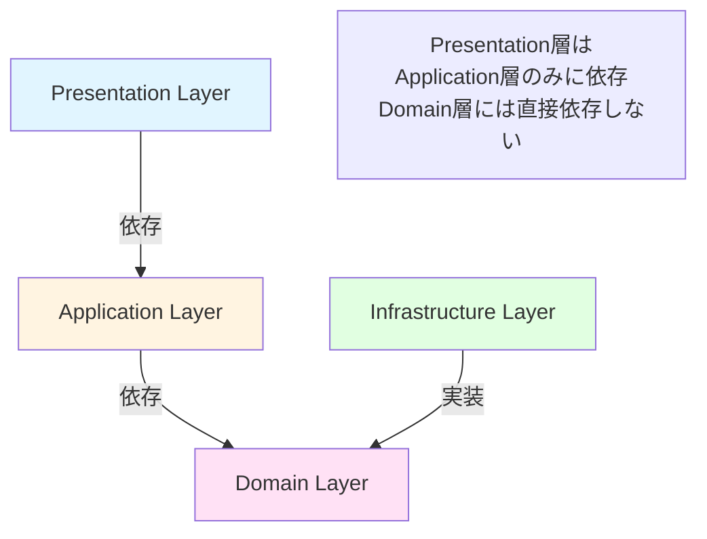
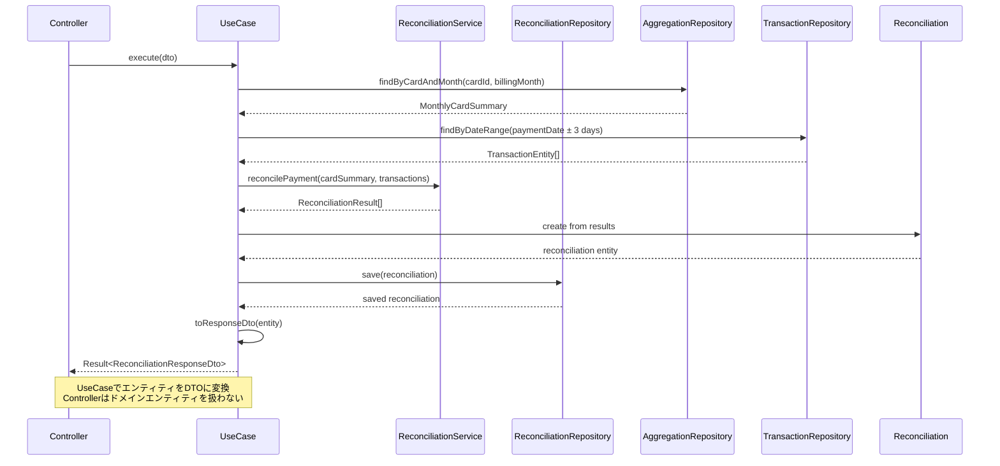

# クラス図

このドキュメントでは、銀行引落額との自動照合機能のクラス構造を記載しています。

## 目次

1. [Domain層クラス図](#domain層クラス図)
2. [Application層クラス図](#application層クラス図)
3. [Infrastructure層クラス図](#infrastructure層クラス図)
4. [Presentation層クラス図](#presentation層クラス図)

---

## Domain層クラス図

### Reconciliation Module

```mermaid
classDiagram
    class Reconciliation {
        +string id
        +string cardId
        +string billingMonth
        +ReconciliationStatus status
        +Date executedAt
        +ReconciliationResult[] results
        +ReconciliationSummary summary
        +Date createdAt
        +Date updatedAt
        +markAsMatched() void
        +markAsUnmatched() void
        +markAsPartial() void
    }

    note right of Reconciliation
        エンティティからDTOへの変換は、
        Application層のUseCaseまたは
        Presentation層のマッパーで実施
    end note

    class ReconciliationResult {
        +boolean isMatched
        +number confidence
        +string bankTransactionId
        +string cardSummaryId
        +Discrepancy discrepancy
        +Date matchedAt
        +calculateConfidence() number
    }

    class ReconciliationSummary {
        +number total
        +number matched
        +number unmatched
        +number partial
        +calculateSummary() void
    }

    class Discrepancy {
        +number amountDifference
        +number dateDifference
        +boolean descriptionMatch
        +string reason
    }

    class ReconciliationStatus {
        <<enumeration>>
        MATCHED
        UNMATCHED
        PARTIAL
        PENDING
    }

    class ReconciliationRepository {
        <<interface>>
        +save(reconciliation) Promise<Reconciliation>
        +findById(id) Promise<Reconciliation|null>
        +findByCardAndMonth(cardId, billingMonth) Promise<Reconciliation|null>
        +findByCard(cardId, startMonth, endMonth) Promise<Reconciliation[]>
        +findAll() Promise<Reconciliation[]>
        +delete(id) Promise<void>
    }

    class MonthlyCardSummary {
        <<existing>>
        +string id
        +string cardId
        +string cardName
        +string billingMonth
        +Date paymentDate
        +number netPaymentAmount
        +PaymentStatus status
    }

    class TransactionEntity {
        <<existing>>
        +string id
        +Date date
        +number amount
        +string description
        +CategoryType category
    }

    Reconciliation --> ReconciliationResult
    Reconciliation --> ReconciliationSummary
    Reconciliation --> ReconciliationStatus
    ReconciliationResult --> Discrepancy
    Reconciliation ..> MonthlyCardSummary : uses (cardId, billingMonth)
    ReconciliationResult ..> TransactionEntity : uses (bankTransactionId)
```

**クラス説明**:

#### Reconciliation

- **責務**: 照合結果を保持し、照合ステータスを管理する
- **主要メソッド**:
  - `markAsMatched()`: ステータスを「MATCHED」に更新
  - `markAsUnmatched()`: ステータスを「UNMATCHED」に更新
  - `markAsPartial()`: ステータスを「PARTIAL」に更新
- **注意**: エンティティからDTOへの変換は、Application層のUseCaseまたはPresentation層のマッパーで行う（Onion Architecture原則遵守）
- **ビジネスルール**:
  - 同じカード・請求月の照合結果は上書き（最新の結果を保持）
- **関連エンティティ**: `MonthlyCardSummary`とは`cardId`と`billingMonth`で関連付けられる（直接保持しない）

#### ReconciliationResult

- **責務**: 個別の照合結果を保持（Value Object）
- **不変性**: 値オブジェクトとして不変（immutable）
- **主要メソッド**:
  - `calculateConfidence()`: 信頼度スコアを算出（0-100）
- **信頼度スコアリング**:
  - 完全一致（金額・日付・摘要すべて一致）: confidence = 100
  - 部分一致（金額・日付のみ一致）: confidence = 70
  - 不一致: confidence = 0
- **関連エンティティ**: `TransactionEntity`とは`bankTransactionId`で関連付けられる（直接保持しない）

#### ReconciliationSummary

- **責務**: 照合結果のサマリー情報を保持（Value Object）
- **不変性**: 値オブジェクトとして不変（immutable）
- **主要メソッド**:
  - `calculateSummary()`: 照合結果からサマリーを計算

#### Discrepancy

- **責務**: 不一致の詳細情報を保持（Value Object）
- **不変性**: 値オブジェクトとして不変（immutable）
- **フィールド**:
  - `amountDifference`: 金額差（円）
  - `dateDifference`: 日数差（営業日）
  - `descriptionMatch`: 摘要一致フラグ
  - `reason`: 不一致理由

#### ReconciliationStatus

- **責務**: 照合ステータスの定義
- **値**:
  - MATCHED: 完全一致
  - UNMATCHED: 不一致
  - PARTIAL: 部分一致（要確認）
  - PENDING: 照合待ち

---

## Application層クラス図

### Use Cases and Services



**クラス説明**:

#### ReconcileCreditCardUseCase

- **責務**: クレジットカード引落額照合を実行する
- **依存**: ReconciliationRepository, AggregationRepository, TransactionRepository, ReconciliationService
- **入力**: `ReconcileCreditCardRequestDto`
- **出力**: `Result<ReconciliationResponseDto>`
- **処理フロー**:
  1. カード月別集計データ取得（AggregationRepository）
  2. 引落予定日前後3営業日の銀行取引取得（TransactionRepository）
  3. 照合処理実行（ReconciliationService.reconcilePayment()を直接呼び出し）
  4. 照合結果を保存（ReconciliationRepository）
  5. エンティティをResponseDTOに変換して返却
- **注意**: 照合ロジックは`ReconciliationService`に委譲し、UseCaseは調整のみを行う

#### ReconciliationService

- **責務**: 照合ロジックの実装
- **主要メソッド**:
  - `reconcilePayment()`: カード請求と銀行取引を照合
  - `filterByDateRange()`: 日付範囲でフィルタリング（営業日計算）
  - `filterByAmount()`: 金額でフィルタリング
  - `filterByDescription()`: 摘要でフィルタリング
  - `calculateConfidence()`: 信頼度スコアを算出
  - `isBusinessDay()`: 営業日判定（土日を除外）
  - `calculateBusinessDays()`: 営業日数を計算
  - `matchesCardCompany()`: 摘要にカード会社名が含まれるか判定
- **ビジネスルール**:
  - 引落予定日 ± 3営業日の範囲で検索
  - 金額は完全一致（許容誤差±0円）
  - 摘要にカード会社名が含まれるか判定

---

## Infrastructure層クラス図

### Repository Implementations



**クラス説明**:

#### JsonReconciliationRepository

- **責務**: 照合データのJSON形式での永続化
- **永続化方法**: JSON形式でファイルに保存（`data/reconciliation/reconciliations.json`）
- **キャッシング戦略**: ライトスルーキャッシュ
  - 読み取り時: メモリキャッシュが存在すればそれを返却、なければファイルから読み込み
  - 書き込み時: ファイルとメモリキャッシュを同時に更新（一貫性を保証）
  - 無効化: アプリケーション再起動時にキャッシュをクリア
- **主要メソッド**:
  - `save()`: 照合データを保存（既存データがある場合は上書き）
  - `findByCardAndMonth()`: カードIDと請求月で検索
  - `findByCard()`: カードIDと期間で複数の照合データを取得
  - `filterByDateRange()`: 請求月の範囲でフィルタリング

#### AggregationRepository（既存）

- **責務**: カード月別集計データの取得
- **使用箇所**: UseCaseから月別集計データを取得

#### TransactionRepository（既存）

- **責務**: 銀行取引データの取得
- **使用箇所**: UseCaseから引落予定日前後の銀行取引を取得

---

## Presentation層クラス図

### Controllers

```mermaid
classDiagram
    class ReconciliationController {
        -ReconcileCreditCardUseCase reconcileUseCase
        +reconcileCreditCard(request) Promise<Response>
        +listReconciliations(query) Promise<Response>
        +getReconciliation(id) Promise<Response>
        -validateRequest(request) ValidationResult
        -handleError(error) Response
    }

    class ReconcileCreditCardRequestDto {
        +string cardId
        +string billingMonth
    }

    note right of ReconcileCreditCardRequestDto
        バリデーションはclass-validatorデコレータと
        ValidationPipeを使用（NestJSのベストプラクティス）
    end note

    class ReconciliationResponseDto {
        <<interface>>
        +string id
        +string cardId
        +string billingMonth
        +string status
        +string executedAt
        +ReconciliationResultDto[] results
        +ReconciliationSummaryDto summary
        +string createdAt
        +string updatedAt
    }

    class ReconciliationListItemDto {
        <<interface>>
        +string id
        +string cardId
        +string billingMonth
        +string status
        +string executedAt
        +ReconciliationSummaryDto summary
        +string createdAt
        +string updatedAt
    }

    class ReconciliationResultDto {
        <<interface>>
        +boolean isMatched
        +number confidence
        +string bankTransactionId
        +string cardSummaryId
        +DiscrepancyDto discrepancy
        +string matchedAt
    }

    class ReconciliationSummaryDto {
        <<interface>>
        +number total
        +number matched
        +number unmatched
        +number partial
    }

    class DiscrepancyDto {
        <<interface>>
        +number amountDifference
        +number dateDifference
        +boolean descriptionMatch
        +string reason
    }

    ReconciliationController --> ReconcileCreditCardUseCase
    ReconciliationController --> ReconcileCreditCardRequestDto
    ReconciliationController --> ReconciliationResponseDto
    ReconciliationController --> ReconciliationListItemDto
    ReconciliationController --> ReconciliationResultDto
    ReconciliationController --> ReconciliationSummaryDto
    ReconciliationResultDto --> DiscrepancyDto
```

**クラス説明**:

#### ReconciliationController

- **責務**: 照合APIの提供
- **エンドポイント**:
  - `POST /api/reconciliations`: クレジットカード照合を実行
  - `GET /api/reconciliations`: 照合結果一覧を取得（クエリパラメータで絞り込み）
  - `GET /api/reconciliations/:id`: 照合結果詳細を取得

#### ReconcileCreditCardRequestDto（class）

- **責務**: リクエストデータの受け取り
- **バリデーション**: `class-validator`デコレータと`ValidationPipe`を使用（NestJSのベストプラクティス）
  - cardId: 必須、UUID形式（`@IsUUID()`）
  - billingMonth: 必須、YYYY-MM形式（`@Matches(/^\d{4}-(0[1-9]|1[0-2])$/)`）

#### ReconciliationResponseDto（interface）

- **責務**: 照合結果詳細レスポンスデータの構築（GET /:id用）
- **変換**: Reconciliation Entityから変換
- **日付形式**: ISO8601形式（YYYY-MM-DDTHH:mm:ss.sssZ）
- **特徴**: 詳細な照合結果リスト（`results`）を含む完全版

#### ReconciliationListItemDto（interface）

- **責務**: 照合結果一覧レスポンスデータの構築（GET一覧用）
- **変換**: Reconciliation Entityから変換
- **日付形式**: ISO8601形式（YYYY-MM-DDTHH:mm:ss.sssZ）
- **特徴**: 一覧表示に必要な最小限の情報のみ（`results`を省略）

#### ReconciliationResultDto（interface）

- **責務**: 個別照合結果のレスポンスデータ
- **変換**: ReconciliationResult Value Objectから変換

#### ReconciliationSummaryDto（interface）

- **責務**: 照合サマリーのレスポンスデータ
- **変換**: ReconciliationSummary Value Objectから変換

#### DiscrepancyDto（interface）

- **責務**: 不一致詳細のレスポンスデータ
- **変換**: Discrepancy Value Objectから変換

---

## クラス間の関係性

### 依存関係の概要



**依存関係の原則**:

- Presentation層 → Application層のみ（Domain層には直接依存しない）
- Application層 → Domain層
- Infrastructure層 → Domain層（インターフェースを実装）
- ドメイン層は他のレイヤに依存しない（最も内側）

### データフロー



---

## 実装上の注意点

### 型安全性

- すべてのクラスとメソッドに適切な型定義を行う
- `any`型の使用を避ける
- Genericsを活用して型の再利用性を高める
- RequestDTOは`class`、ResponseDTOは`interface`

### 依存性注入

- コンストラクタインジェクションを使用
- インターフェースに依存し、実装に依存しない
- NestJSのDIコンテナを活用

### イミュータビリティ

- ReconciliationResult、ReconciliationSummary、Discrepancyは不変とする
- Reconciliationの更新は新しいインスタンスを返す
- Stateの直接変更を避ける

### エラーハンドリング

- カスタム例外クラスを定義
  - `CardSummaryNotFoundException`: カード月別集計データが見つからない（RC001）
  - `BankTransactionNotFoundException`: 銀行取引データが取得できない（RC002）
  - `InvalidPaymentDateException`: 引落予定日が未来（RC003）
  - `MultipleCandidateException`: 複数の候補取引が存在（RC004）
- 適切なエラーメッセージを提供
- エラーのロギング

### 照合ロジック

- 営業日計算時の土日除外に注意
- 日付範囲の計算に注意（月またぎ処理）
- 金額は完全一致（許容誤差±0円）
- 摘要マッチングは部分一致（カード会社名が含まれるか）

---

## チェックリスト

クラス図作成時の確認事項：

### Domain層

- [x] すべてのEntityが定義されている
- [x] Value Objectが適切に定義されている
- [x] Repositoryインターフェースが定義されている
- [x] ビジネスロジックがEntityに配置されている
- [x] Enumが適切に定義されている

### Application層

- [x] すべてのUseCaseが定義されている
- [x] DTOが適切に定義されている
- [x] サービスクラスが必要に応じて定義されている
- [x] 照合ロジックがサービスに分離されている

### Infrastructure層

- [x] Repositoryの実装クラスが定義されている
- [x] 永続化方法が明確（JSON）
- [x] 既存リポジトリとの連携が明確

### Presentation層

- [x] すべてのControllerが定義されている
- [x] RequestDTO、ResponseDTOが定義されている
- [x] エンドポイントが明確
- [x] RequestDTOはclass、ResponseDTOはinterface
