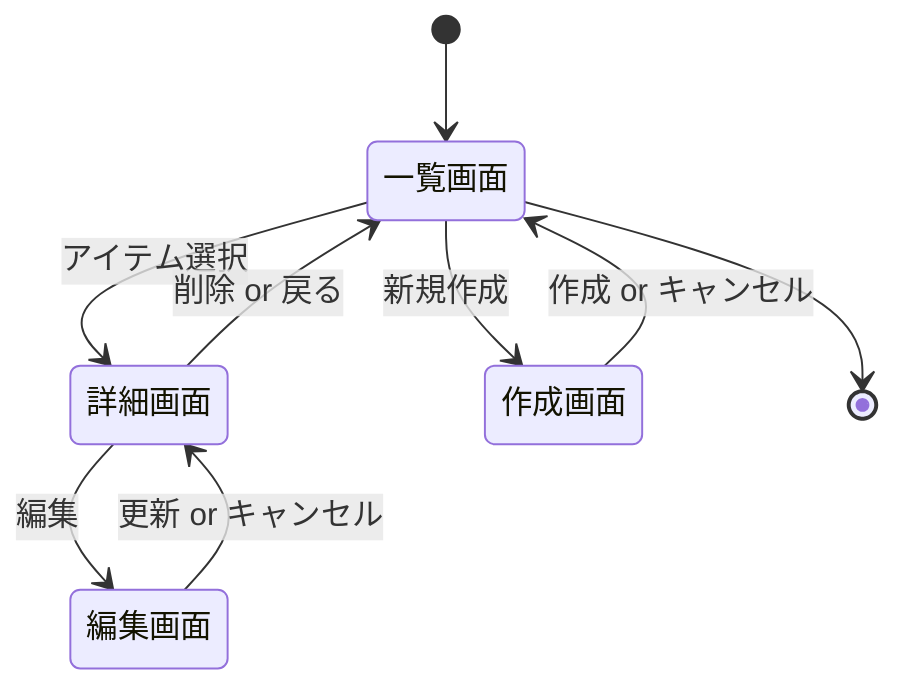
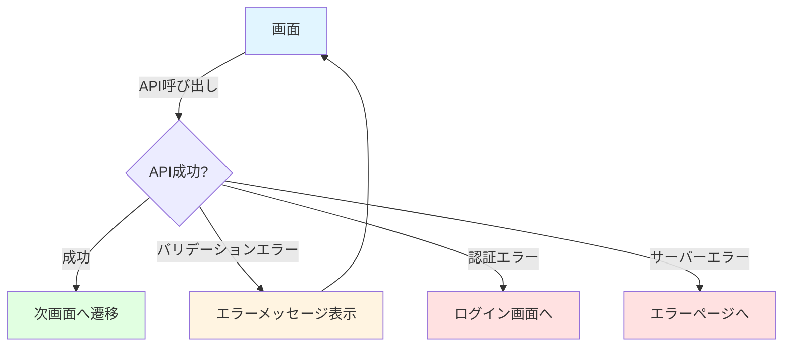
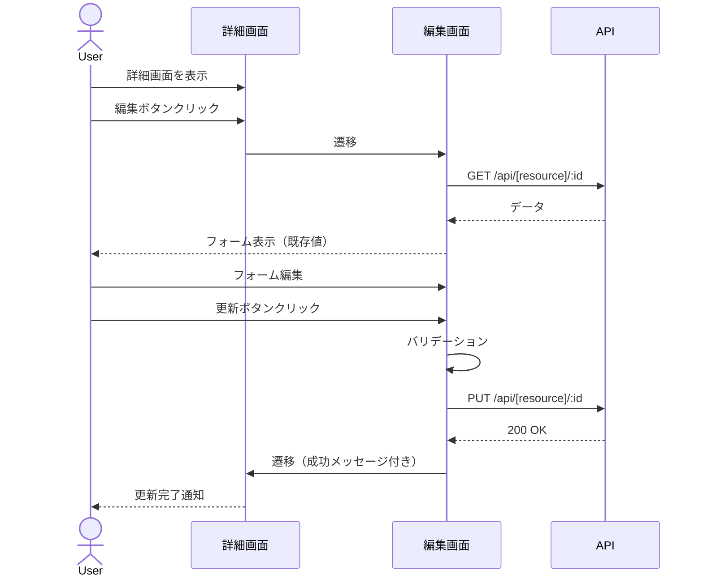
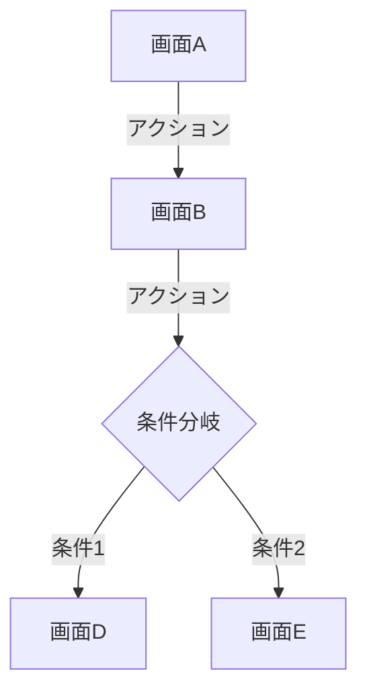
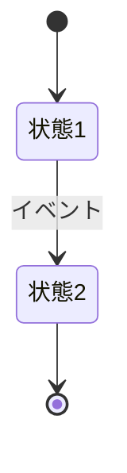
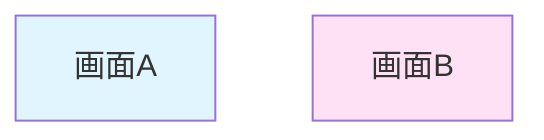

# 画面遷移図

このドキュメントでは、[機能名]の画面遷移を記載しています。

**注意**: この画面遷移図は、画面を持つ機能の場合にのみ作成してください。
APIのみの機能の場合は、このファイルは不要です。

## 目次

1. [画面遷移全体図](#画面遷移全体図)
2. [各画面の詳細](#各画面の詳細)
3. [画面仕様](#画面仕様)

---

## 画面遷移全体図

### メイン遷移フロー

```mermaid
graph TD
    A[トップページ] -->|リンククリック| B[[機能名]一覧画面]
    B -->|新規作成ボタン| C[[機能名]作成画面]
    B -->|アイテムクリック| D[[機能名]詳細画面]

    C -->|作成完了| B
    C -->|キャンセル| B

    D -->|編集ボタン| E[[機能名]編集画面]
    D -->|削除ボタン| F{削除確認}
    D -->|戻るボタン| B

    E -->|更新完了| D
    E -->|キャンセル| D

    F -->|確認| B
    F -->|キャンセル| D

    style A fill:#e1f5ff
    style B fill:#fff4e1
    style C fill:#e1ffe1
    style D fill:#ffe1f5
    style E fill:#e1ffe1
    style F fill:#ffe1e1
```

### 画面の種類

- **一覧画面**: データの一覧表示、検索、フィルタリング
- **詳細画面**: 個別データの表示
- **作成画面**: 新規データの作成
- **編集画面**: 既存データの編集
- **削除確認**: 削除前の確認ダイアログ

---

## 各画面の詳細

### 1. [機能名]一覧画面

#### 画面ID

`[screen-id-list]`

#### URL

`/[feature-name]`

#### 概要

[機能名]の一覧を表示し、新規作成、詳細表示、検索が可能な画面

#### 表示内容

- 一覧テーブル
  - カラム1: [説明]
  - カラム2: [説明]
  - アクションボタン（詳細、編集、削除）
- 検索フォーム
- 新規作成ボタン
- ページネーション

#### 遷移先

- `[screen-id-detail]`: アイテムクリック時
- `[screen-id-create]`: 新規作成ボタンクリック時

#### API連携

- `GET /api/[resource]`: 一覧データ取得
- `DELETE /api/[resource]/:id`: 削除

---

### 2. [機能名]詳細画面

#### 画面ID

`[screen-id-detail]`

#### URL

`/[feature-name]/:id`

#### 概要

[機能名]の詳細情報を表示する画面

#### 表示内容

- 詳細情報
  - フィールド1: [説明]
  - フィールド2: [説明]
- 編集ボタン
- 削除ボタン
- 戻るボタン

#### 遷移先

- `[screen-id-list]`: 戻るボタンクリック時
- `[screen-id-edit]`: 編集ボタンクリック時

#### API連携

- `GET /api/[resource]/:id`: 詳細データ取得

---

### 3. [機能名]作成画面

#### 画面ID

`[screen-id-create]`

#### URL

`/[feature-name]/new`

#### 概要

新しい[機能名]を作成する画面

#### 表示内容

- 入力フォーム
  - フィールド1: [説明] [必須/任意]
  - フィールド2: [説明] [必須/任意]
- 作成ボタン
- キャンセルボタン

#### バリデーション

- フィールド1: [バリデーションルール]
- フィールド2: [バリデーションルール]

#### 遷移先

- `[screen-id-list]`: 作成完了時、キャンセル時

#### API連携

- `POST /api/[resource]`: 新規作成

---

### 4. [機能名]編集画面

#### 画面ID

`[screen-id-edit]`

#### URL

`/[feature-name]/:id/edit`

#### 概要

既存の[機能名]を編集する画面

#### 表示内容

- 入力フォーム（既存データが初期値として設定される）
  - フィールド1: [説明] [必須/任意]
  - フィールド2: [説明] [必須/任意]
- 更新ボタン
- キャンセルボタン

#### バリデーション

- フィールド1: [バリデーションルール]
- フィールド2: [バリデーションルール]

#### 遷移先

- `[screen-id-detail]`: 更新完了時、キャンセル時

#### API連携

- `GET /api/[resource]/:id`: 既存データ取得
- `PUT /api/[resource]/:id`: 更新

---

## 画面遷移パターン

### CRUD操作の基本フロー



### エラーハンドリング



---

## 画面仕様

### [機能名]一覧画面

#### ワイヤーフレーム（テキスト版）

```
┌─────────────────────────────────────────────────────────┐
│  ヘッダー                                [新規作成ボタン] │
├─────────────────────────────────────────────────────────┤
│  検索: [_______________] [検索ボタン] [クリアボタン]     │
├─────────────────────────────────────────────────────────┤
│  ┌──────────┬──────────┬──────────┬──────────┐         │
│  │ カラム1  │ カラム2  │ カラム3  │ アクション│         │
│  ├──────────┼──────────┼──────────┼──────────┤         │
│  │ データ1  │ データ1  │ データ1  │ [詳細][削除]│         │
│  │ データ2  │ データ2  │ データ2  │ [詳細][削除]│         │
│  │ データ3  │ データ3  │ データ3  │ [詳細][削除]│         │
│  └──────────┴──────────┴──────────┴──────────┘         │
│                                                         │
│  [<前へ] ページ 1/10 [次へ>]                            │
└─────────────────────────────────────────────────────────┘
```

#### UI コンポーネント

- **ヘッダー**: アプリケーション共通ヘッダー
- **検索バー**: テキスト入力、検索ボタン、クリアボタン
- **データテーブル**:
  - ソート機能
  - アクションボタン（詳細、削除）
- **ページネーション**: 前へ、次へ、ページ番号

---

### [機能名]詳細画面

#### ワイヤーフレーム（テキスト版）

```
┌─────────────────────────────────────────────────────────┐
│  [< 戻る]                                               │
├─────────────────────────────────────────────────────────┤
│  [機能名] 詳細                                           │
│                                                         │
│  フィールド1: 値1                                        │
│  フィールド2: 値2                                        │
│  フィールド3: 値3                                        │
│                                                         │
│  作成日時: YYYY-MM-DD HH:MM:SS                          │
│  更新日時: YYYY-MM-DD HH:MM:SS                          │
│                                                         │
│  [編集ボタン] [削除ボタン]                               │
└─────────────────────────────────────────────────────────┘
```

---

### [機能名]作成/編集画面

#### ワイヤーフレーム（テキスト版）

```
┌─────────────────────────────────────────────────────────┐
│  [< 戻る]                                               │
├─────────────────────────────────────────────────────────┤
│  [機能名] [作成|編集]                                    │
│                                                         │
│  フィールド1 *                                           │
│  [____________________]                                 │
│  ※ 必須項目です                                         │
│                                                         │
│  フィールド2                                             │
│  [____________________]                                 │
│                                                         │
│  フィールド3 *                                           │
│  ┌────────────────────┐                                │
│  │                    │                                │
│  │  (テキストエリア)   │                                │
│  │                    │                                │
│  └────────────────────┘                                │
│                                                         │
│  [キャンセル] [作成|更新]                                │
└─────────────────────────────────────────────────────────┘
```

---

## ユーザー操作フロー

### 新規作成フロー

```mermaid
sequenceDiagram
    actor User as ユーザー
    participant List as 一覧画面
    participant Create as 作成画面
    participant API as API

    User->>List: 一覧画面を表示
    User->>List: 新規作成ボタンクリック
    List->>Create: 遷移
    User->>Create: フォーム入力
    User->>Create: 作成ボタンクリック
    Create->>Create: バリデーション
    Create->>API: POST /api/[resource]
    API-->>Create: 201 Created
    Create->>List: 遷移（成功メッセージ付き）
    List-->>User: 作成完了通知
```

### 編集フロー



---

## レスポンシブ対応

### デスクトップ表示（1024px以上）

- テーブル形式で表示
- サイドバーメニュー表示

### タブレット表示（768px - 1023px）

- テーブル形式で表示（スクロール可能）
- ハンバーガーメニュー

### モバイル表示（767px以下）

- カード形式で表示
- ハンバーガーメニュー
- アクションボタンをアイコン化

---

## チェックリスト

画面遷移図作成時の確認事項：

### 基本項目

- [ ] すべての画面が定義されている
- [ ] 画面間の遷移が明確に記載されている
- [ ] 各画面のURLが定義されている
- [ ] 各画面のAPIエンドポイントが明確

### 詳細項目

- [ ] エラー時の遷移が定義されている
- [ ] ワイヤーフレームが作成されている
- [ ] バリデーションルールが記載されている
- [ ] レスポンシブ対応が考慮されている

### UX

- [ ] ユーザーの操作フローが自然
- [ ] 戻る動線が明確
- [ ] エラーメッセージが適切
- [ ] 成功メッセージが適切

---

## Mermaid記法のヒント

### Graph（画面遷移図）



### State Diagram（状態遷移図）



### スタイリング


