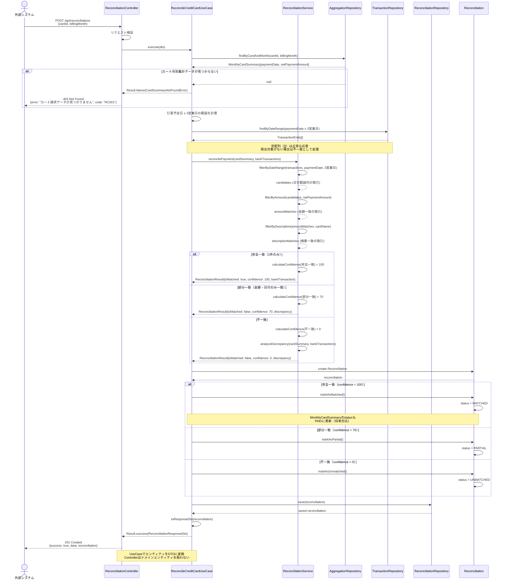
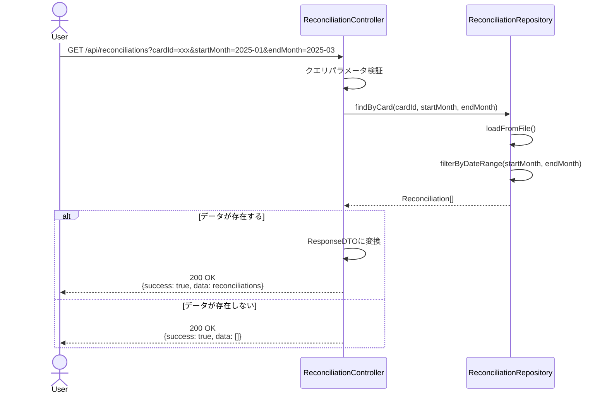
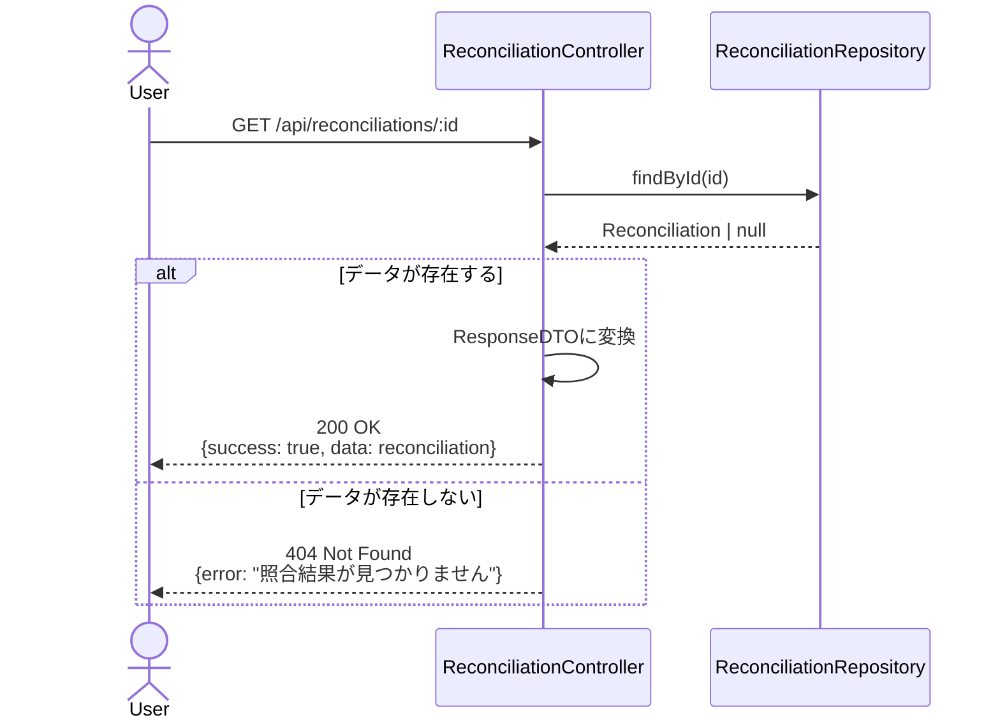
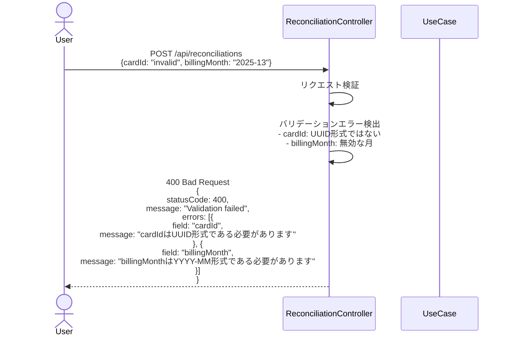
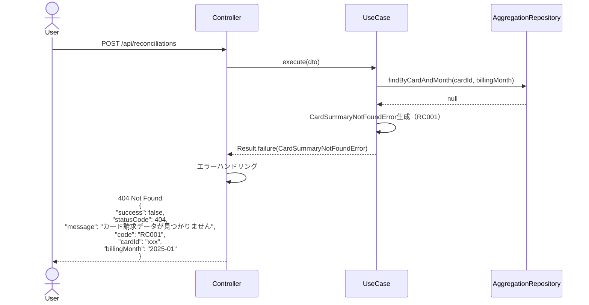
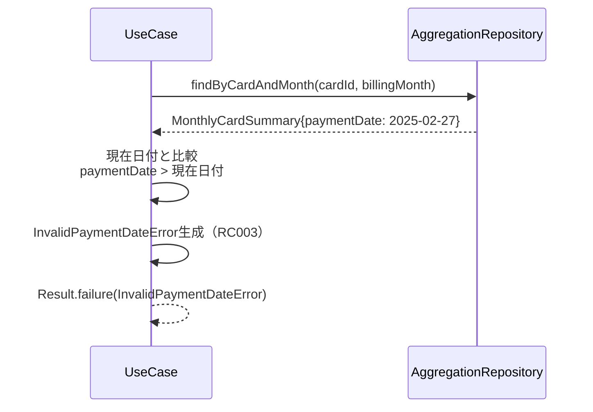
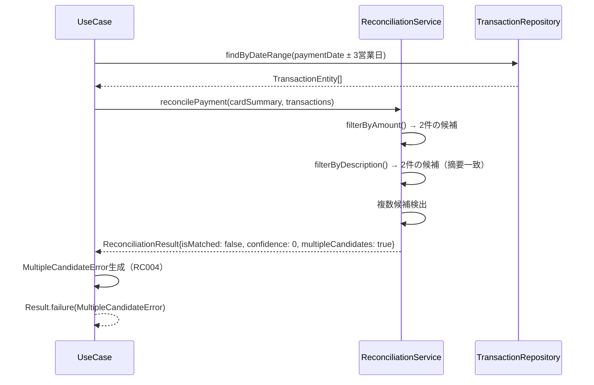
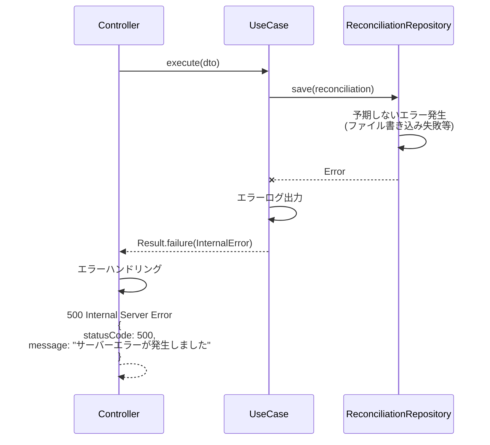
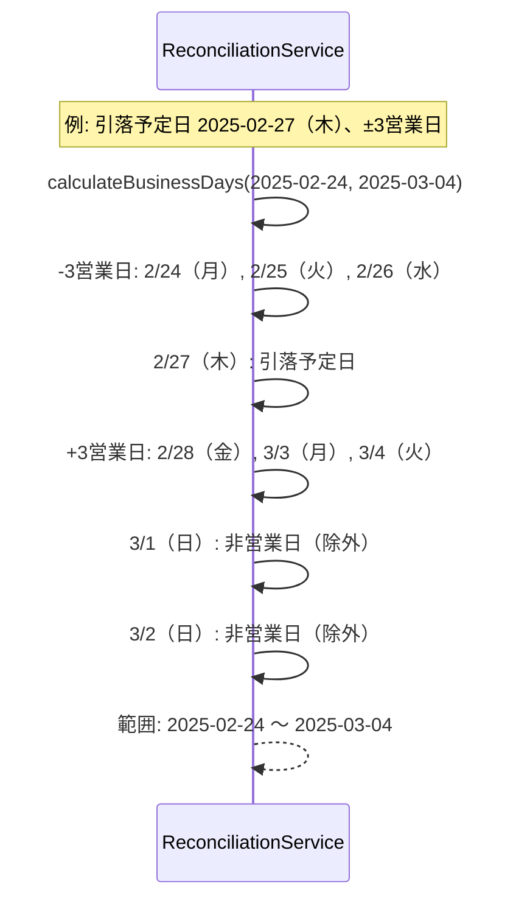
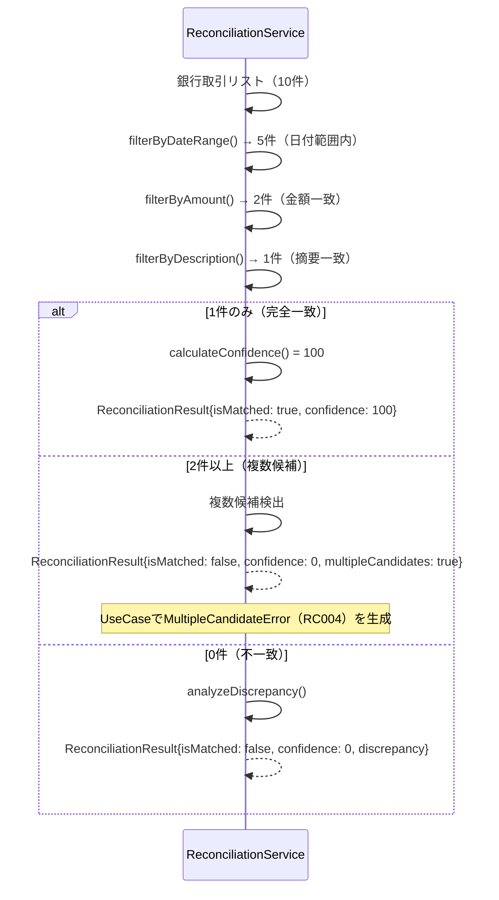

# シーケンス図

このドキュメントでは、銀行引落額との自動照合機能の処理フローをシーケンス図で記載しています。

## 目次

1. [クレジットカード照合実行のフロー](#クレジットカード照合実行のフロー)
2. [照合結果一覧取得のフロー](#照合結果一覧取得のフロー)
3. [エラーハンドリングフロー](#エラーハンドリングフロー)

---

## クレジットカード照合実行のフロー

### 概要

**ユースケース**: クレジットカードの月別集計額と銀行引落額を照合する

**アクター**: フロントエンド（将来対応）、外部システム

**前提条件**:

- クレジットカードが登録済み
- 月別集計データが作成済み（FR-012）
- 銀行取引データが存在する

**成功時の結果**:

- 照合結果が作成される
- 一致・不一致が判定される
- 照合結果がJSON形式で永続化される
- 完全一致の場合は支払済ステータスに更新される

### 正常系フロー（完全一致）



### ステップ詳細

1. **リクエスト受信**
   - エンドポイント: `POST /api/reconciliations`
   - RequestDTO: `ReconcileCreditCardRequestDto`
   - バリデーション: cardId（UUID）、billingMonth（YYYY-MM）

2. **カード月別集計データ取得**
   - カードIDと請求月から月別集計データを取得
   - 引落予定日（paymentDate）、最終支払額（netPaymentAmount）を取得
   - データが存在しない場合は404エラー（RC001）

3. **銀行取引データ取得**
   - 引落予定日 ± 3営業日の範囲で銀行取引を取得
   - 営業日計算（土日を除外）
   - 空配列（[]）は正常な応答として扱い、照合対象がない場合は不一致（UNMATCHED）として処理
   - 外部システム（銀行APIなど）の障害やデータベース接続失敗など予期しないエラーの場合のみ502/503エラー（RC002）

4. **照合処理**
   - **日付範囲フィルタリング**: 引落予定日 ± 3営業日の範囲でフィルタ
   - **金額フィルタリング**: 銀行引落額 = カード請求額（完全一致）
   - **摘要フィルタリング**: 銀行取引の摘要にカード会社名が含まれるか判定
   - **信頼度スコアリング**:
     - 完全一致（金額・日付・摘要すべて一致）: confidence = 100
     - 部分一致（金額・日付のみ一致）: confidence = 70
     - 不一致: confidence = 0

5. **結果判定**
   - confidence = 100: ステータスを「MATCHED」に更新
   - confidence = 70: ステータスを「PARTIAL」に更新（要確認）
   - confidence = 0: ステータスを「UNMATCHED」に更新（アラート生成）

6. **永続化**
   - 照合結果をJSON形式で保存
   - 既存データがある場合は上書き（最新の結果を保持）

7. **レスポンス**
   - ResponseDTO: `ReconciliationResponseDto`
   - HTTPステータス: 201 Created

---

## 照合結果一覧取得のフロー

### 概要

**ユースケース**: 特定カードの照合結果を一覧取得

**アクター**: フロントエンド（将来対応）

**前提条件**:

- 照合データが既に作成されている

### 正常系フロー



### 詳細取得フロー



---

## エラーハンドリングフロー

### バリデーションエラー (400 Bad Request)



**エラーレスポンス例**:

```json
{
  "statusCode": 400,
  "message": "Validation failed",
  "errors": [
    {
      "field": "cardId",
      "message": "cardIdはUUID形式である必要があります"
    },
    {
      "field": "billingMonth",
      "message": "billingMonthはYYYY-MM形式である必要があります"
    }
  ]
}
```

### カード月別集計データ未検出エラー (404 Not Found - RC001)



### 引落予定日が未来エラー (422 Unprocessable Entity - RC003)



### 複数の候補取引が存在エラー (422 Unprocessable Entity - RC004)



### サーバーエラー (500 Internal Server Error)



---

## 照合ロジック詳細

### 営業日計算



### 照合マッチングフロー



---

## チェックリスト

シーケンス図作成時の確認事項：

### 基本項目

- [x] 主要なユースケースがすべて記載されている
- [x] アクター、参加者が明確に定義されている
- [x] 正常系フローが記載されている
- [x] 異常系フローが記載されている

### 詳細項目

- [x] エラーハンドリングが明確
- [x] レスポンスの型とステータスコードが明記されている
- [x] 照合ロジックの詳細が記載されている
- [x] 営業日計算ロジックが明確
- [x] エラーコード（RC001-RC004）が明記されている

### 実装ガイド

- [x] 各ステップに説明が付与されている
- [x] 前提条件が明確
- [x] 成功時の結果が明確
- [x] エラーレスポンス例が記載されている
