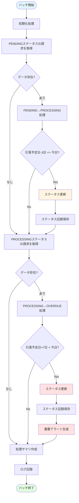
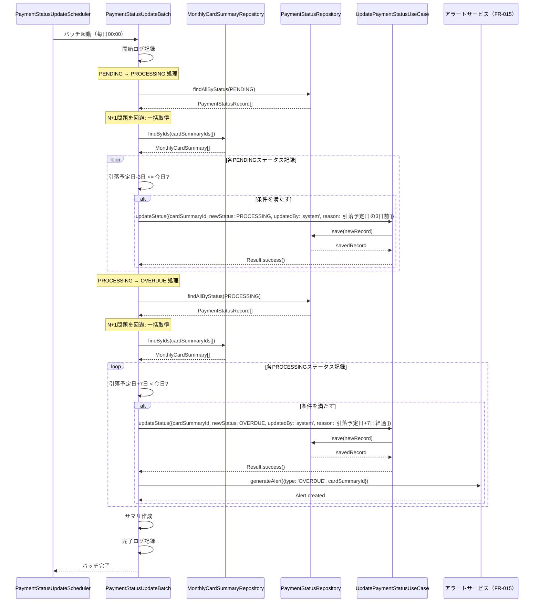

# バッチ処理詳細

このドキュメントでは、支払いステータス管理機能のバッチ処理に関する詳細を記載しています。

## 目次

1. [バッチ処理一覧](#バッチ処理一覧)
2. [バッチ処理の詳細](#バッチ処理の詳細)
3. [スケジュール設定](#スケジュール設定)
4. [エラーハンドリング](#エラーハンドリング)
5. [モニタリングとロギング](#モニタリングとロギング)

---

## バッチ処理一覧

| バッチ名                 | 説明                                                         | 実行頻度 | 実行時刻 | 所要時間(目安) |
| ------------------------ | ------------------------------------------------------------ | -------- | -------- | -------------- |
| PaymentStatusUpdateBatch | 自動ステータス更新（PENDING→PROCESSING、PROCESSING→OVERDUE） | 毎日     | 00:00    | 1-3分          |

---

## バッチ処理の詳細

### PaymentStatusUpdateBatch: 自動ステータス更新バッチ

#### 概要

**目的**: 引落予定日に基づいて、支払いステータスを自動的に更新する

**処理内容**:

1. PENDING → PROCESSING: 引落予定日の3日前の請求を抽出し、ステータスを更新
2. PROCESSING → OVERDUE: 引落予定日+7日経過の請求を抽出し、ステータスを更新

**実行頻度**: 毎日 00:00

**所要時間**: 1-3分（データ量により変動）

---

#### 処理フロー



---

#### シーケンス図



---

#### 実装クラス

**クラス名**: `PaymentStatusUpdateScheduler`

**メソッド**:

```typescript
import { Injectable, Logger } from '@nestjs/common';
import { Cron, CronExpression } from '@nestjs/schedule';
import { UpdatePaymentStatusUseCase } from '../application/use-cases/update-payment-status.use-case';
import { MonthlyCardSummaryRepository } from '../domain/repositories/monthly-card-summary.repository';
import { PaymentStatusRepository } from '../domain/repositories/payment-status.repository';
import { PaymentStatus } from '../domain/entities/payment-status.enum';

@Injectable()
export class PaymentStatusUpdateScheduler {
  private readonly logger = new Logger(PaymentStatusUpdateScheduler.name);

  constructor(
    private readonly updateUseCase: UpdatePaymentStatusUseCase,
    private readonly summaryRepository: MonthlyCardSummaryRepository,
    private readonly statusRepository: PaymentStatusRepository
  ) {}

  /**
   * 日次バッチ処理: 自動ステータス更新
   * 毎日深夜0時に実行
   */
  @Cron('0 0 * * *', {
    name: 'PaymentStatusUpdateBatch',
    timeZone: 'Asia/Tokyo',
  })
  async scheduleDailyUpdate(): Promise<void> {
    this.logger.log('PaymentStatusUpdateBatch started');

    try {
      // PENDING → PROCESSING の更新
      await this.updatePendingToProcessing();

      // PROCESSING → OVERDUE の更新
      await this.updateProcessingToOverdue();

      this.logger.log('PaymentStatusUpdateBatch completed');
    } catch (error) {
      this.logger.error('PaymentStatusUpdateBatch failed', error);
      throw error;
    }
  }

  /**
   * PENDING → PROCESSING の更新
   * 引落予定日の3日前の請求を抽出
   */
  async updatePendingToProcessing(): Promise<void> {
    this.logger.log('Updating PENDING to PROCESSING...');

    const pendingRecords = await this.statusRepository.findAllByStatus(PaymentStatus.PENDING);

    if (pendingRecords.length === 0) {
      this.logger.log('No PENDING records found');
      return;
    }

    // N+1問題を回避: 必要なMonthlyCardSummaryを一括取得
    const cardSummaryIds = pendingRecords.map((r) => r.cardSummaryId);
    const summaries = await this.summaryRepository.findByIds(cardSummaryIds);
    const summaryMap = new Map(summaries.map((s) => [s.id, s]));

    const today = new Date();
    today.setHours(0, 0, 0, 0);

    let updatedCount = 0;

    for (const record of pendingRecords) {
      try {
        const summary = summaryMap.get(record.cardSummaryId);

        if (!summary) {
          this.logger.warn(`MonthlyCardSummary not found: ${record.cardSummaryId}`);
          continue;
        }

        // 引落予定日の3日前を計算
        const threeDaysBefore = new Date(summary.paymentDate);
        threeDaysBefore.setDate(threeDaysBefore.getDate() - 3);
        threeDaysBefore.setHours(0, 0, 0, 0);

        // 今日が引落予定日の3日前以降かチェック
        if (today >= threeDaysBefore) {
          await this.updateUseCase.execute({
            cardSummaryId: record.cardSummaryId,
            newStatus: PaymentStatus.PROCESSING,
            updatedBy: 'system',
            reason: '引落予定日の3日前',
          });

          updatedCount++;
        }
      } catch (error) {
        this.logger.error(`Failed to update status for ${record.cardSummaryId}`, error);
      }
    }

    this.logger.log(`PENDING → PROCESSING: ${updatedCount}/${pendingRecords.length} updated`);
  }

  /**
   * PROCESSING → OVERDUE の更新
   * 引落予定日+7日経過の請求を抽出
   */
  async updateProcessingToOverdue(): Promise<void> {
    this.logger.log('Updating PROCESSING to OVERDUE...');

    const processingRecords = await this.statusRepository.findAllByStatus(PaymentStatus.PROCESSING);

    if (processingRecords.length === 0) {
      this.logger.log('No PROCESSING records found');
      return;
    }

    // N+1問題を回避: 必要なMonthlyCardSummaryを一括取得
    const cardSummaryIds = processingRecords.map((r) => r.cardSummaryId);
    const summaries = await this.summaryRepository.findByIds(cardSummaryIds);
    const summaryMap = new Map(summaries.map((s) => [s.id, s]));

    const today = new Date();
    today.setHours(0, 0, 0, 0);

    let updatedCount = 0;

    for (const record of processingRecords) {
      try {
        const summary = summaryMap.get(record.cardSummaryId);

        if (!summary) {
          this.logger.warn(`MonthlyCardSummary not found: ${record.cardSummaryId}`);
          continue;
        }

        // 引落予定日+7日を計算
        const sevenDaysAfter = new Date(summary.paymentDate);
        sevenDaysAfter.setDate(sevenDaysAfter.getDate() + 7);
        sevenDaysAfter.setHours(0, 0, 0, 0);

        // 今日が引落予定日+7日以降かチェック
        if (today > sevenDaysAfter) {
          await this.updateUseCase.execute({
            cardSummaryId: record.cardSummaryId,
            newStatus: PaymentStatus.OVERDUE,
            updatedBy: 'system',
            reason: '引落予定日+7日経過',
          });

          updatedCount++;

          // 重要アラート生成（FR-015で実装）
          // await this.alertService.generateOverdueAlert(record.cardSummaryId);
        }
      } catch (error) {
        this.logger.error(`Failed to update status for ${record.cardSummaryId}`, error);
      }
    }

    this.logger.log(`PROCESSING → OVERDUE: ${updatedCount}/${processingRecords.length} updated`);
  }

  /**
   * 手動実行用メソッド（テスト・デバッグ用）
   */
  async executeManually(): Promise<BatchResult> {
    const startTime = Date.now();

    try {
      await this.updatePendingToProcessing();
      await this.updateProcessingToOverdue();

      // NOTE: update...メソッドから返される実際の件数を反映することが望ましい
      // 現時点では簡易実装のため、処理件数は0として返す
      return {
        success: 0,
        failure: 0,
        total: 0,
        duration: Date.now() - startTime,
        timestamp: new Date(),
      };
    } catch (error) {
      this.logger.error('Manual execution failed', error);
      throw error;
    }
  }
}

interface BatchResult {
  success: number;
  failure: number;
  total: number;
  duration: number;
  timestamp: Date;
}
```

---

#### データモデル

**対象データ**:

```typescript
// PaymentStatusRecord (既存)
interface PaymentStatusRecord {
  id: string;
  cardSummaryId: string;
  status: PaymentStatus;
  previousStatus?: PaymentStatus;
  updatedAt: Date;
  updatedBy: 'system' | 'user';
  reason?: string;
  reconciliationId?: string;
  notes?: string;
  createdAt: Date;
}

// MonthlyCardSummary (既存)
interface MonthlyCardSummary {
  id: string;
  cardId: string;
  cardName: string;
  billingMonth: string;
  closingDate: Date;
  paymentDate: Date; // 引落予定日
  totalAmount: number;
  transactionCount: number;
  categoryBreakdown: CategoryAmount[];
  transactionIds: string[];
  netPaymentAmount: number;
  status: PaymentStatus;
  createdAt: Date;
  updatedAt: Date;
}
```

**処理結果**:

```typescript
interface BatchResult {
  success: number; // 成功件数
  failure: number; // 失敗件数
  total: number; // 総件数
  duration: number; // 処理時間（ミリ秒）
  timestamp: Date; // 実行日時
}
```

---

#### パフォーマンス最適化

**バッチサイズ**:

- 1回の処理で最大1000件まで
- メモリ使用量を考慮して調整

**並列処理**:

- 現時点では順次処理（データ整合性を優先）
- 将来的に並列処理を検討（最大10並列）

---

## スケジュール設定

### Cron式

| バッチ名                 | Cron式      | 説明          |
| ------------------------ | ----------- | ------------- |
| PaymentStatusUpdateBatch | `0 0 * * *` | 毎日0時に実行 |

### NestJSでの実装

```typescript
import { Injectable } from '@nestjs/common';
import { Cron } from '@nestjs/schedule';

@Injectable()
export class PaymentStatusUpdateScheduler {
  @Cron('0 0 * * *', {
    name: 'PaymentStatusUpdateBatch',
    timeZone: 'Asia/Tokyo',
  })
  async scheduleDailyUpdate() {
    // バッチ処理実行
  }
}
```

### 手動実行API

```typescript
// Controller
@Controller('batch')
export class BatchController {
  constructor(private readonly scheduler: PaymentStatusUpdateScheduler) {}

  @Post('payment-status/execute')
  @UseGuards(AdminAuthGuard) // 将来対応
  async executeBatch() {
    const result = await this.scheduler.executeManually();
    return { success: true, result };
  }
}
```

---

## エラーハンドリング

### リトライ戦略

**基本方針**:

- 一時的なエラー: リトライしない（次回バッチで再試行）
- 恒久的なエラー: エラーログに記録し、スキップ

**エラー分類**:

| エラー種類           | 説明                              | リトライ | 通知         |
| -------------------- | --------------------------------- | -------- | ------------ |
| 請求データ未検出     | MonthlyCardSummaryが見つからない  | ❌       | ⚠️ WARNログ  |
| ステータス記録未検出 | PaymentStatusRecordが見つからない | ❌       | ⚠️ WARNログ  |
| 無効なステータス遷移 | 遷移ルール違反                    | ❌       | ⚠️ WARNログ  |
| データベースエラー   | 接続エラー等                      | ❌       | ✅ ERRORログ |
| 予期しないエラー     | その他のエラー                    | ❌       | ✅ ERRORログ |

**実装例**:

```typescript
async updatePendingToProcessing(): Promise<void> {
  const pendingRecords = await this.statusRepository.findAllByStatus(
    PaymentStatus.PENDING
  );

  let successCount = 0;
  let failureCount = 0;

  for (const record of pendingRecords) {
    try {
      // 処理実行
      await this.processRecord(record);
      successCount++;
    } catch (error) {
      failureCount++;
      this.logger.error(
        `Failed to process record ${record.id}`,
        error
      );
      // エラーが発生しても次のレコードの処理を継続
    }
  }

  this.logger.log(
    `PENDING → PROCESSING: ${successCount} succeeded, ${failureCount} failed`
  );
}
```

---

## モニタリングとロギング

### ログレベル

| レベル | 用途       | 例                          |
| ------ | ---------- | --------------------------- |
| INFO   | 正常な処理 | バッチ開始/終了、処理サマリ |
| WARN   | 警告       | 請求データ未検出、一部失敗  |
| ERROR  | エラー     | 処理失敗、致命的エラー      |

### ログフォーマット

```json
{
  "timestamp": "2025-01-27T00:00:00.000Z",
  "level": "INFO",
  "batch": "PaymentStatusUpdateBatch",
  "message": "Batch completed successfully",
  "context": {
    "pendingToProcessing": {
      "total": 100,
      "updated": 95,
      "skipped": 5
    },
    "processingToOverdue": {
      "total": 50,
      "updated": 2,
      "skipped": 48
    },
    "duration": 120000
  }
}
```

### メトリクス

**収集するメトリクス**:

- 処理件数（PENDING→PROCESSING、PROCESSING→OVERDUE）
- 更新件数
- スキップ件数
- 処理時間
- エラー件数

### アラート条件

| 条件            | アラートレベル | 通知先              |
| --------------- | -------------- | ------------------- |
| エラー率 > 10%  | WARNING        | 開発チーム          |
| エラー率 > 30%  | ERROR          | 開発チーム + 管理者 |
| バッチ失敗      | CRITICAL       | 開発チーム + 管理者 |
| 処理時間 > 10分 | WARNING        | 開発チーム          |

---

## チェックリスト

バッチ処理詳細作成時の確認事項：

### 基本項目

- [x] バッチ処理の目的が明確
- [x] 処理フローが記載されている
- [x] スケジュール設定が明確
- [x] 実行頻度と所要時間が記載されている

### 実装

- [x] エラーハンドリングが適切
- [x] リトライ戦略が定義されている（次回バッチで再試行）
- [x] パフォーマンス最適化が考慮されている
- [x] トランザクション境界が明確

### 運用

- [x] ロギング戦略が明確
- [x] モニタリング項目が定義されている
- [x] アラート条件が定義されている
- [x] 手動実行方法が提供されている
