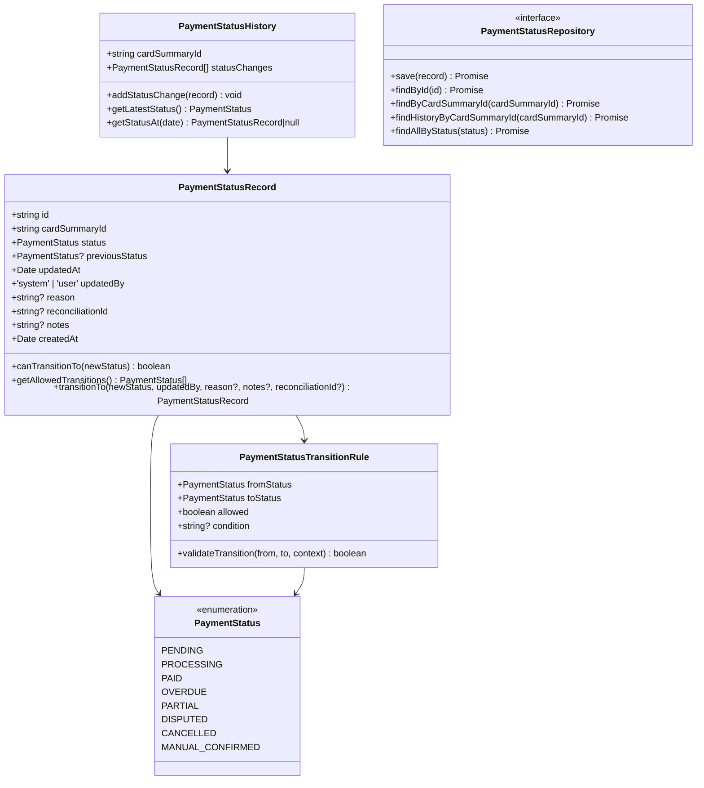
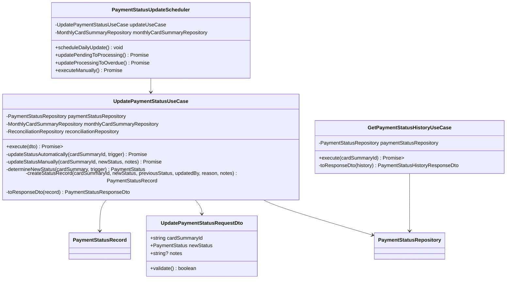
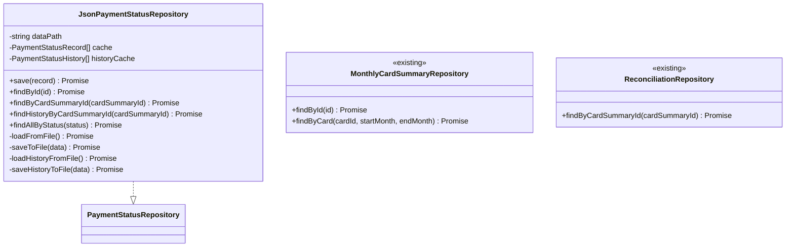
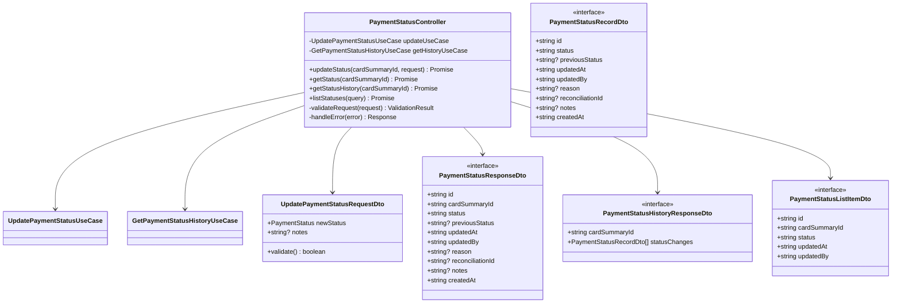
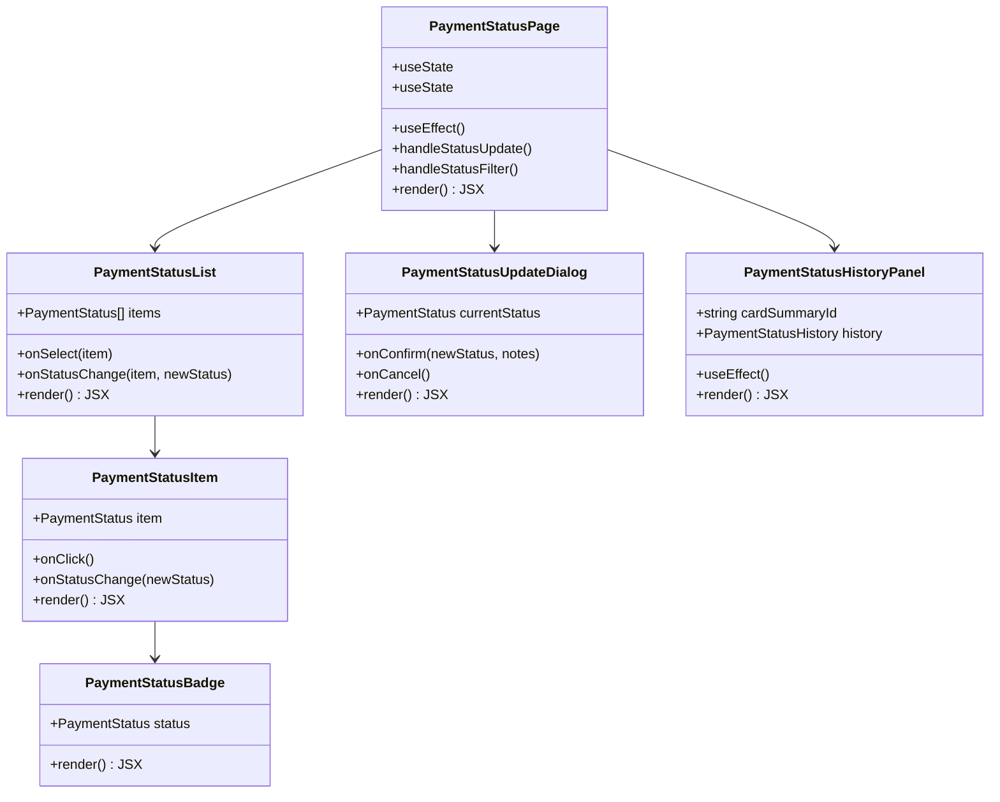
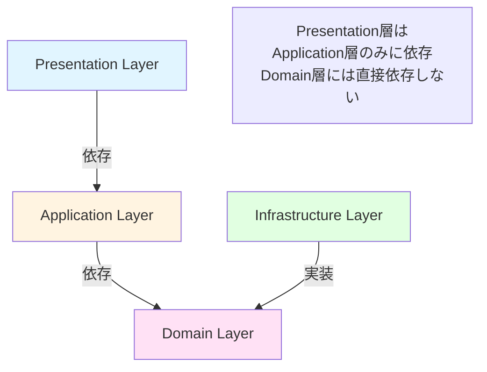
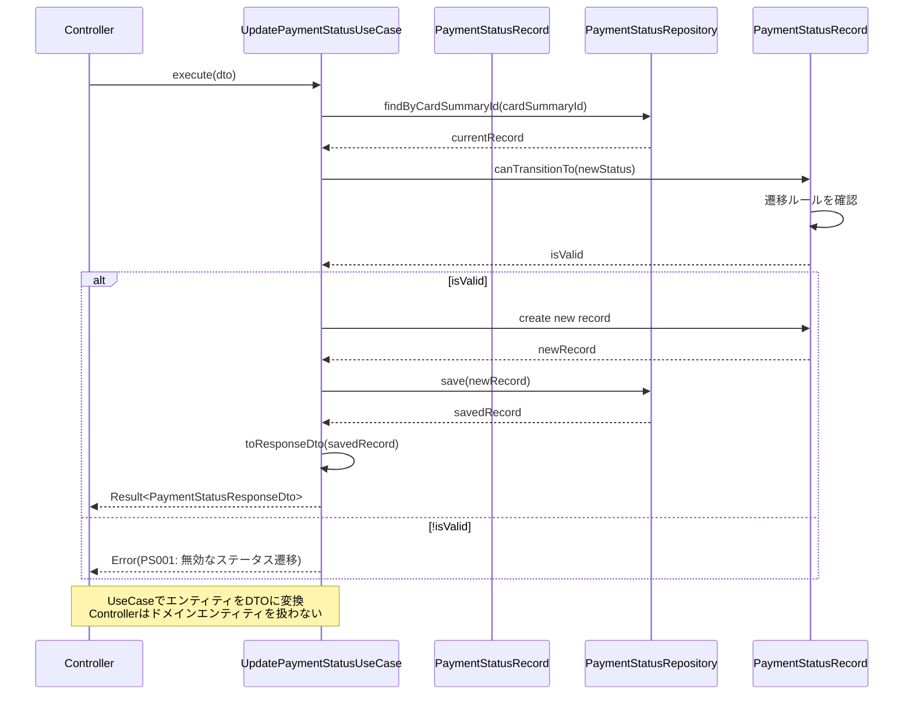

# クラス図

このドキュメントでは、支払いステータス管理機能のクラス構造を記載しています。

## 目次

1. [Domain層クラス図](#domain層クラス図)
2. [Application層クラス図](#application層クラス図)
3. [Infrastructure層クラス図](#infrastructure層クラス図)
4. [Presentation層クラス図](#presentation層クラス図)
5. [Frontend コンポーネント図](#frontendコンポーネント図)

---

## Domain層クラス図

### Payment Status Module

**クラス説明**:

#### PaymentStatusRecord

- **責務**: 支払いステータスの記録を保持し、ステータス遷移の妥当性を検証する
- **主要メソッド**:
  - `canTransitionTo(newStatus)`: 指定されたステータスへの遷移が可能か判定
  - `getAllowedTransitions()`: 遷移可能なステータスリストを取得
  - `transitionTo(newStatus, updatedBy, reason?, notes?, reconciliationId?)`: ステータスを遷移（新しいインスタンスを返す）
- **ビジネスルール**:
  - ステータス変更履歴は不変（immutable）
  - すべてのステータス変更は記録される
- **注意**: エンティティからDTOへの変換は、Application層のUseCaseまたはPresentation層のマッパーで行う（Onion Architecture原則遵守）

#### PaymentStatusHistory

- **責務**: ステータス変更履歴を保持し、履歴の操作を提供する
- **主要メソッド**:
  - `addStatusChange(record)`: 新しいステータス変更を追加
  - `getLatestStatus()`: 最新のステータスを取得
  - `getStatusAt(date)`: 指定日時点のステータスを取得
- **不変性**: 履歴は追記のみ（append-only）、削除・変更不可

#### PaymentStatus

- **責務**: 支払いステータスの定義
- **値**:
  - PENDING: 未払い（引落前）
  - PROCESSING: 処理中（引落予定日前後）
  - PAID: 支払済（照合完了）
  - OVERDUE: 延滞（引落日を過ぎても未払い）
  - PARTIAL: 一部支払い
  - DISPUTED: 不一致（要確認）
  - CANCELLED: キャンセル
  - MANUAL_CONFIRMED: 手動確認済

#### PaymentStatusTransitionRule

- **責務**: ステータス遷移ルールを定義し、遷移の妥当性を検証する
- **不変性**: 値オブジェクトとして不変（immutable）
- **主要メソッド**:
  - `validateTransition(from, to, context)`: 遷移の妥当性を検証
- **遷移ルール**:
  - PENDING → PROCESSING: 引落予定日の3日前
  - PENDING → PARTIAL: 一部金額のみ引落
  - PENDING → CANCELLED: ユーザーがキャンセル
  - PENDING → MANUAL_CONFIRMED: 手動で確認完了
  - PROCESSING → PAID: 照合成功（FR-013）
  - PROCESSING → DISPUTED: 照合失敗（FR-013）
  - PROCESSING → OVERDUE: 引落予定日+7日経過
  - その他の遷移は基本的に不可（特別な場合のみ許可）

---

## Application層クラス図

### Use Cases and Services

**クラス説明**:

#### UpdatePaymentStatusUseCase

- **責務**: 支払いステータスの更新を実行する（手動・自動両対応）
- **依存**: PaymentStatusRepository, MonthlyCardSummaryRepository, ReconciliationRepository
- **注意**: 状態遷移の検証は`PaymentStatusRecord`エンティティの`canTransitionTo`メソッドを使用（ドメイン層に一元化）
- **入力**: `UpdatePaymentStatusRequestDto`
- **出力**: `Result<PaymentStatusResponseDto>`
- **処理フロー**:
  1. 請求データ（MonthlyCardSummary）を取得
  2. 現在のステータスを取得
  3. ステータス遷移の妥当性を検証
  4. 新しいステータスを決定（自動更新の場合）
  5. ステータス記録を作成
  6. ステータス記録を保存
  7. 履歴を更新
  8. エンティティをResponseDTOに変換して返却

#### GetPaymentStatusHistoryUseCase

- **責務**: ステータス変更履歴を取得する
- **依存**: PaymentStatusRepository
- **入力**: `cardSummaryId` (string)
- **出力**: `Result<PaymentStatusHistoryResponseDto>`
- **処理フロー**:
  1. ステータス履歴を取得
  2. エンティティをResponseDTOに変換して返却

#### PaymentStatusUpdateScheduler

- **責務**: 日次バッチ処理による自動ステータス更新のスケジューリング
- **依存**: UpdatePaymentStatusUseCase, MonthlyCardSummaryRepository
- **主要メソッド**:
  - `scheduleDailyUpdate()`: 日次バッチ処理をスケジュール（毎日深夜0時実行）
  - `updatePendingToProcessing()`: PENDING → PROCESSING の更新（引落予定日の3日前）
  - `updateProcessingToOverdue()`: PROCESSING → OVERDUE の更新（引落予定日+7日経過）
  - `executeManually()`: 手動実行用メソッド（テスト・デバッグ用）
- **注意**: 照合結果による更新（PROCESSING → PAID/DISPUTED）は、照合処理（FR-013）が直接`UpdatePaymentStatusUseCase`を呼び出す設計
- **スケジューリング**: NestJS Schedule（@nestjs/schedule）を使用

**注意**: `PaymentStatusTransitionValidator`は削除され、状態遷移の検証ロジックは`PaymentStatusRecord`エンティティ（ドメイン層）に一元化されました。

---

## Infrastructure層クラス図

### Repository Implementations

**クラス説明**:

#### JsonPaymentStatusRepository

- **責務**: ステータスデータのJSON形式での永続化
- **永続化方法**: JSON形式でファイルに保存
  - ステータス記録: `data/payment-status/records.json`
  - ステータス履歴: `data/payment-status/history.json`
- **キャッシング戦略**: ライトスルーキャッシュ
  - 読み取り時: メモリキャッシュが存在すればそれを返却、なければファイルから読み込み
  - 書き込み時: ファイルとメモリキャッシュを同時に更新（一貫性を保証）
  - 無効化: アプリケーション再起動時にキャッシュをクリア
- **主要メソッド**:
  - `save()`: ステータス記録を保存（既存データがある場合は更新）
  - `findByCardSummaryId()`: カード集計IDで最新のステータス記録を取得
  - `findHistoryByCardSummaryId()`: カード集計IDでステータス変更履歴を取得
  - `findAllByStatus()`: ステータスでフィルタリングして取得（バッチ処理用）

#### MonthlyCardSummaryRepository（既存）

- **責務**: 月別集計データの取得
- **使用箇所**: UseCaseから請求データ（引落予定日等）を取得

#### ReconciliationRepository（既存、FR-013）

- **責務**: 照合データの取得
- **使用箇所**: UseCaseから照合結果を取得してステータスを更新

---

## Presentation層クラス図

### Controllers

**クラス説明**:

#### PaymentStatusController

- **責務**: 支払いステータス管理APIの提供
- **エンドポイント**:
  - `PUT /api/payment-status/:cardSummaryId`: ステータスを手動更新
  - `GET /api/payment-status/:cardSummaryId`: 現在のステータスを取得
  - `GET /api/payment-status/:cardSummaryId/history`: ステータス変更履歴を取得
  - `GET /api/payment-status`: ステータス一覧を取得（フィルタ）

#### UpdatePaymentStatusRequestDto（class）

- **責務**: リクエストデータの受け取りとバリデーション
- **バリデーション**:
  - newStatus: 必須、PaymentStatus Enum値
  - notes: 任意、最大1000文字

#### PaymentStatusResponseDto（interface）

- **責務**: ステータスレスポンスデータの構築
- **変換**: PaymentStatusRecord Entityから変換
- **日付形式**: ISO8601形式（YYYY-MM-DDTHH:mm:ss.sssZ）

#### PaymentStatusHistoryResponseDto（interface）

- **責務**: ステータス履歴レスポンスデータの構築
- **変換**: PaymentStatusHistory Entityから変換

#### PaymentStatusListItemDto（interface）

- **責務**: 一覧表示用の簡略レスポンスデータの構築
- **変換**: PaymentStatusRecord Entityから変換
- **特徴**: 一覧表示に必要な最小限の情報のみ

---

## Frontend コンポーネント図

### React Components

**コンポーネント説明**:

#### PaymentStatusPage

- **責務**: 支払いステータス管理ページのメインコンポーネント
- **State**:
  - `statuses`: ステータス一覧
  - `selectedStatus`: 選択中のステータス
  - `filter`: フィルタ条件（ステータス、カード等）
- **API連携**:
  - `GET /api/payment-status`: ステータス一覧取得
  - `PUT /api/payment-status/:cardSummaryId`: ステータス更新

#### PaymentStatusList

- **責務**: ステータス一覧の表示と操作
- **Props**:
  - `items`: 表示するステータス配列
  - `onSelect`: ステータス選択時のコールバック
  - `onStatusChange`: ステータス変更時のコールバック

#### PaymentStatusItem

- **責務**: 個別のステータスアイテムの表示
- **Props**:
  - `item`: 表示するステータスデータ
  - `onClick`: クリック時のコールバック
  - `onStatusChange`: ステータス変更時のコールバック

#### PaymentStatusBadge

- **責務**: ステータスバッジの表示（カラーコード対応）
- **Props**:
  - `status`: 表示するステータス
- **カラーコード**:
  - PENDING: 黄色
  - PROCESSING: 青色
  - PAID: 緑色
  - OVERDUE: 赤色
  - DISPUTED: オレンジ色

#### PaymentStatusUpdateDialog

- **責務**: ステータス更新ダイアログの表示
- **Props**:
  - `currentStatus`: 現在のステータス
  - `onConfirm`: 確認時のコールバック（newStatus, notes）
  - `onCancel`: キャンセル時のコールバック
- **バリデーション**: 遷移可能なステータスのみ選択可能

#### PaymentStatusHistoryPanel

- **責務**: ステータス変更履歴の表示
- **Props**:
  - `cardSummaryId`: カード集計ID
- **API連携**: `GET /api/payment-status/:cardSummaryId/history`

---

## クラス間の関係性

### 依存関係の概要

**依存関係の原則**:

- Presentation層 → Application層のみ（Domain層には直接依存しない）
- Application層 → Domain層
- Infrastructure層 → Domain層（インターフェースを実装）
- ドメイン層は他のレイヤに依存しない（最も内側）

### データフロー

---

## 実装上の注意点

### 型安全性

- すべてのクラスとメソッドに適切な型定義を行う
- `any`型の使用を避ける
- Genericsを活用して型の再利用性を高める
- RequestDTOは`class`、ResponseDTOは`interface`

### 依存性注入

- コンストラクタインジェクションを使用
- インターフェースに依存し、実装に依存しない
- NestJSのDIコンテナを活用

### イミュータビリティ

- PaymentStatusTransitionRuleは不変とする
- PaymentStatusRecordの更新は新しいインスタンスを返す
- PaymentStatusHistoryは追記のみ（append-only）

### エラーハンドリング

- カスタム例外クラスを定義
  - `InvalidStatusTransitionException`: 無効なステータス遷移
  - `PaymentStatusNotFoundException`: ステータス記録が見つからない
  - `CardSummaryNotFoundException`: 請求データが見つからない
- 適切なエラーメッセージを提供
- エラーのロギング

### ステータス遷移の検証

- すべてのステータス変更で遷移ルールを検証
- 無効な遷移は即座に拒否
- 自動更新と手動更新で異なるルールを適用可能

### 履歴の不変性

- ステータス変更履歴は削除・変更不可
- 履歴は追記のみ（append-only）
- 履歴の整合性を保証

---

## チェックリスト

クラス図作成時の確認事項：

### Domain層

- [x] すべてのEntityが定義されている
- [x] Value Objectが適切に定義されている
- [x] Repositoryインターフェースが定義されている
- [x] ビジネスロジックがEntityに配置されている
- [x] Enumが適切に定義されている

### Application層

- [x] すべてのUseCaseが定義されている
- [x] DTOが適切に定義されている
- [x] サービスクラスが必要に応じて定義されている
- [x] バリデーターが適切に定義されている
- [x] スケジューラーが適切に定義されている

### Infrastructure層

- [x] Repositoryの実装クラスが定義されている
- [x] 永続化方法が明確（JSON）
- [x] 既存リポジトリとの連携が明確

### Presentation層

- [x] すべてのControllerが定義されている
- [x] RequestDTO、ResponseDTOが定義されている
- [x] エンドポイントが明確
- [x] RequestDTOはclass、ResponseDTOはinterface

### Frontend

- [x] ページコンポーネントが定義されている
- [x] 主要な子コンポーネントが定義されている
- [x] Props、Stateが明確
- [x] API連携が明確
