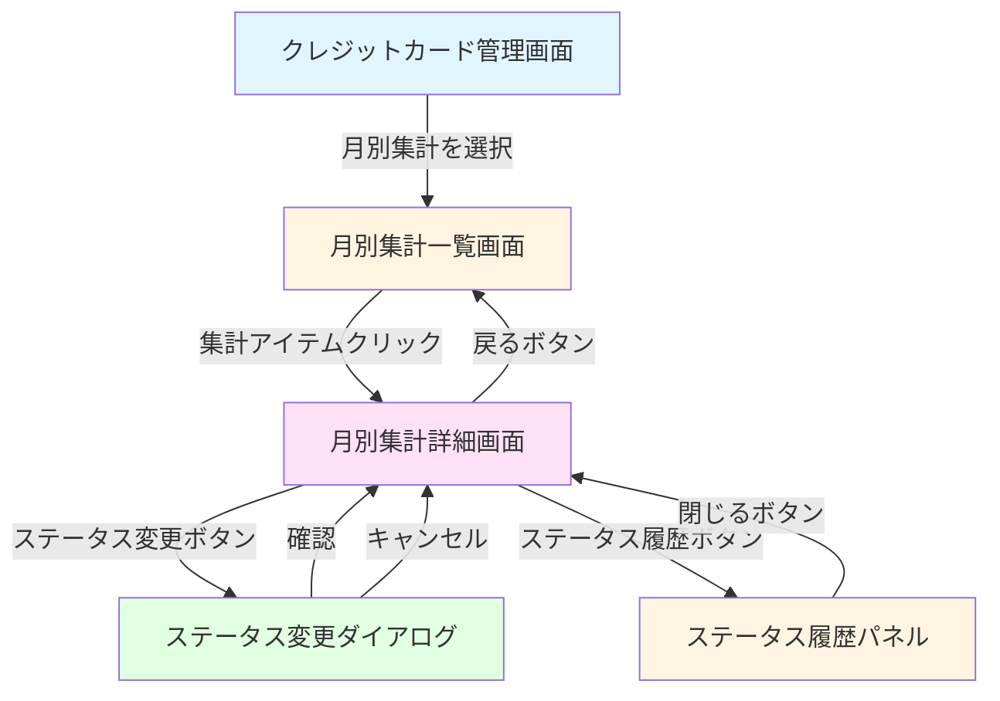
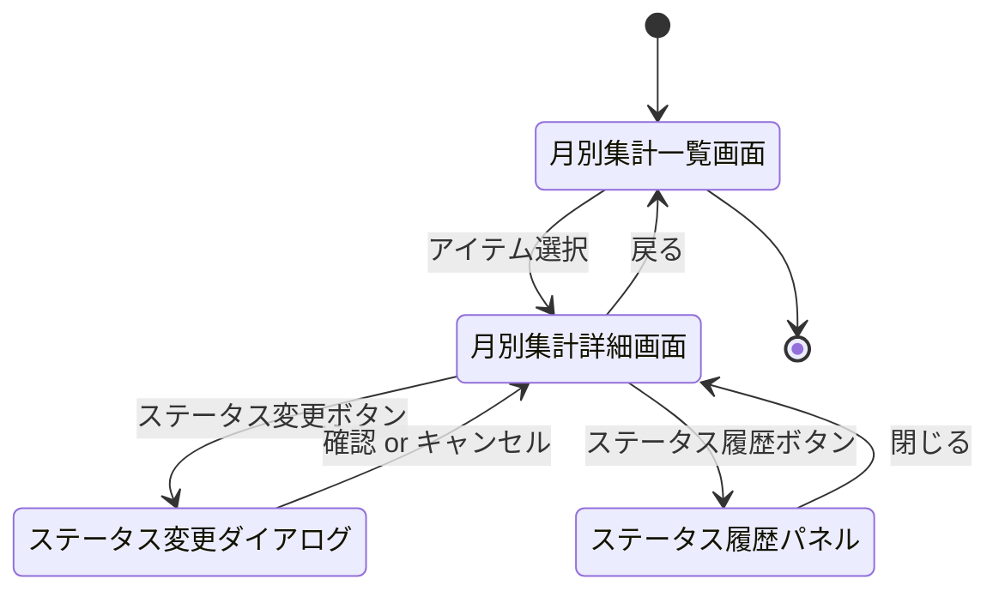
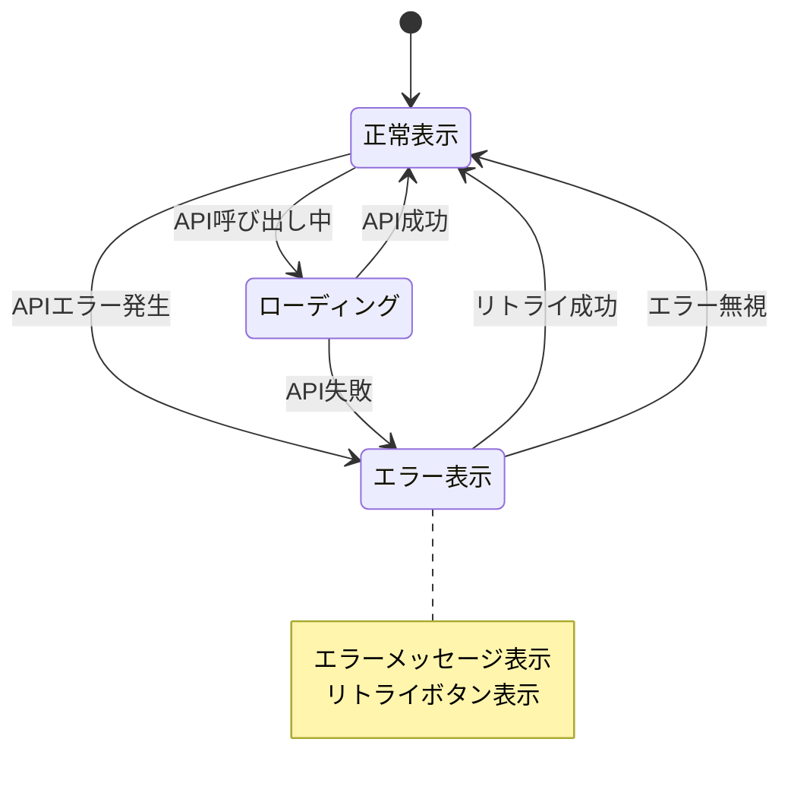

# 画面遷移図

このドキュメントでは、支払いステータス管理機能の画面遷移を記載しています。

## 目次

1. [画面遷移全体図](#画面遷移全体図)
2. [各画面の詳細](#各画面の詳細)
3. [画面仕様](#画面仕様)

---

## 画面遷移全体図

### メイン遷移フロー



### 画面の種類

- **月別集計一覧画面**: 月別集計データの一覧表示、ステータスフィルタ
- **月別集計詳細画面**: 個別集計データの詳細表示、ステータス変更
- **ステータス変更ダイアログ**: ステータスを手動で変更するモーダル
- **ステータス履歴パネル**: ステータス変更履歴を表示するサイドパネル

---

## 各画面の詳細

### 1. 月別集計一覧画面

#### 画面ID

`credit-card-monthly-aggregation-list`

#### URL

`/credit-cards/:cardId/aggregations`

#### 概要

クレジットカードの月別集計データの一覧を表示し、ステータスでフィルタリングが可能な画面

#### 表示内容

- 一覧テーブル
  - 請求月（YYYY-MM）
  - 締め日
  - 支払日
  - 合計金額
  - 取引件数
  - **ステータスバッジ**（カラーコード対応）
  - アクションボタン（詳細）
- ステータスフィルタ
  - ドロップダウン: すべて / PENDING / PROCESSING / PAID / OVERDUE / DISPUTED / その他
- 期間フィルタ
  - 開始月、終了月の選択
- 戻るボタン

#### ステータスバッジのカラーコード

| ステータス       | カラー     | 説明                           |
| ---------------- | ---------- | ------------------------------ |
| PENDING          | 黄色       | 未払い（引落前）               |
| PROCESSING       | 青色       | 処理中（引落予定日前後）       |
| PAID             | 緑色       | 支払済（照合完了）             |
| OVERDUE          | 赤色       | 延滞（引落日を過ぎても未払い） |
| DISPUTED         | オレンジ色 | 不一致（要確認）               |
| PARTIAL          | オレンジ色 | 一部支払い                     |
| CANCELLED        | グレー     | キャンセル                     |
| MANUAL_CONFIRMED | 緑色       | 手動確認済                     |

#### 遷移先

- `credit-card-monthly-aggregation-detail`: アイテムクリック時

#### API連携

- `GET /api/aggregation/card/monthly?cardId=xxx&startMonth=xxx&endMonth=xxx`: 一覧データ取得
- `GET /api/payment-status?cardSummaryId=xxx`: ステータス一覧取得（フィルタ用）

---

### 2. 月別集計詳細画面

#### 画面ID

`credit-card-monthly-aggregation-detail`

#### URL

`/credit-cards/:cardId/aggregations/:aggregationId`

#### 概要

月別集計データの詳細情報を表示し、ステータス変更が可能な画面

#### 表示内容

- 詳細情報セクション
  - カード名
  - 請求月（YYYY-MM）
  - 締め日
  - 支払日（引落予定日）
  - 合計金額
  - 取引件数
  - カテゴリ別内訳
  - 最終支払額
- **ステータスセクション**
  - 現在のステータスバッジ（カラーコード対応）
  - ステータス変更ボタン（遷移可能な場合のみ有効）
  - ステータス履歴ボタン
- アクションボタン
- 戻るボタン

#### ステータス変更ボタンの表示条件

- **有効**: 以下の場合のみ表示・有効
  - PENDING → PARTIAL, CANCELLED, MANUAL_CONFIRMED
  - DISPUTED → MANUAL_CONFIRMED
- **無効**: その他のステータス（自動更新のみ）

#### 遷移先

- `credit-card-monthly-aggregation-list`: 戻るボタンクリック時
- `payment-status-update-dialog`: ステータス変更ボタンクリック時
- `payment-status-history-panel`: ステータス履歴ボタンクリック時

#### API連携

- `GET /api/aggregation/card/monthly/:id`: 詳細データ取得
- `GET /api/payment-status/:cardSummaryId`: 現在のステータス取得

---

### 3. ステータス変更ダイアログ

#### 画面ID

`payment-status-update-dialog`

#### URL

（モーダルダイアログ、URLなし）

#### 概要

ステータスを手動で変更するモーダルダイアログ

#### 表示内容

- 現在のステータス表示
- 新しいステータス選択
  - ドロップダウン: 遷移可能なステータスのみ表示
  - 例: PENDING → PARTIAL, CANCELLED, MANUAL_CONFIRMED
- メモ入力
  - テキストエリア: 最大1000文字
  - プレースホルダー: "ステータス変更の理由やメモを入力してください（任意）"
- アクションボタン
  - 確認ボタン
- キャンセルボタン

#### バリデーション

- 新しいステータス: 必須、遷移可能なステータスのみ選択可能
- メモ: 任意、最大1000文字

#### 遷移先

- `credit-card-monthly-aggregation-detail`: 確認時、キャンセル時

#### API連携

- `PUT /api/payment-status/:cardSummaryId`: ステータス更新

#### エラーハンドリング

- 無効なステータス遷移: エラーメッセージ表示、ダイアログは閉じない
- ネットワークエラー: エラーメッセージ表示、リトライボタン表示

---

### 4. ステータス履歴パネル

#### 画面ID

`payment-status-history-panel`

#### URL

（サイドパネル、URLなし）

#### 概要

ステータス変更履歴を時系列で表示するサイドパネル

#### 表示内容

- パネルヘッダー
  - タイトル: "ステータス変更履歴"
  - 閉じるボタン
- 履歴リスト（時系列順、新しい順）
  - 各履歴アイテム:
    - ステータスバッジ（カラーコード対応）
    - 更新日時（YYYY-MM-DD HH:mm）
    - 更新者（システム / ユーザー）
    - 変更理由
    - メモ（存在する場合）
    - 照合ID（存在する場合、FR-013）

#### 表示形式

```
┌─────────────────────────────────────┐
│ ステータス変更履歴            [×]   │
├─────────────────────────────────────┤
│ [MANUAL_CONFIRMED] 緑色             │
│ 2025-01-27 10:30                   │
│ 更新者: ユーザー                    │
│ 理由: 手動で確認完了                │
│ メモ: 手動で確認完了しました      │
├─────────────────────────────────────┤
│ [DISPUTED] オレンジ色               │
│ 2025-01-27 09:00                   │
│ 更新者: システム                    │
│ 理由: 照合失敗                      │
│ 照合ID: recon-001                   │
├─────────────────────────────────────┤
│ [PROCESSING] 青色                   │
│ 2025-01-27 00:00                   │
│ 更新者: システム                    │
│ 理由: 引落予定日の3日前             │
├─────────────────────────────────────┤
│ [PENDING] 黄色                      │
│ 2025-01-26 12:00                   │
│ 更新者: システム                    │
│ 理由: 請求確定時                    │
└─────────────────────────────────────┘
```

#### 遷移先

- `credit-card-monthly-aggregation-detail`: 閉じるボタンクリック時

#### API連携

- `GET /api/payment-status/:cardSummaryId/history`: ステータス履歴取得

---

## 画面遷移パターン

### ステータス管理の基本フロー



### エラーハンドリング



---

## 画面仕様

### ステータスバッジコンポーネント

#### コンポーネント名

`PaymentStatusBadge`

#### Props

```typescript
interface PaymentStatusBadgeProps {
  status: PaymentStatus;
  size?: 'sm' | 'md' | 'lg';
}
```

#### 実装例

```typescript
export function PaymentStatusBadge({
  status,
  size = 'md',
}: PaymentStatusBadgeProps) {
  const colorMap: Record<PaymentStatus, string> = {
    [PaymentStatus.PENDING]: 'bg-yellow-100 text-yellow-800',
    [PaymentStatus.PROCESSING]: 'bg-blue-100 text-blue-800',
    [PaymentStatus.PAID]: 'bg-green-100 text-green-800',
    [PaymentStatus.OVERDUE]: 'bg-red-100 text-red-800',
    [PaymentStatus.DISPUTED]: 'bg-orange-100 text-orange-800',
    [PaymentStatus.PARTIAL]: 'bg-orange-100 text-orange-800',
    [PaymentStatus.CANCELLED]: 'bg-gray-100 text-gray-800',
    [PaymentStatus.MANUAL_CONFIRMED]: 'bg-green-100 text-green-800',
  };

  const labelMap: Record<PaymentStatus, string> = {
    [PaymentStatus.PENDING]: '未払い',
    [PaymentStatus.PROCESSING]: '処理中',
    [PaymentStatus.PAID]: '支払済',
    [PaymentStatus.OVERDUE]: '延滞',
    [PaymentStatus.DISPUTED]: '不一致',
    [PaymentStatus.PARTIAL]: '一部支払い',
    [PaymentStatus.CANCELLED]: 'キャンセル',
    [PaymentStatus.MANUAL_CONFIRMED]: '手動確認済',
  };

  return (
    <span
      className={`inline-flex items-center px-2.5 py-0.5 rounded-full text-xs font-medium ${colorMap[status]}`}
    >
      {labelMap[status]}
    </span>
  );
}
```

### ステータス変更ダイアログコンポーネント

#### コンポーネント名

`PaymentStatusUpdateDialog`

#### Props

```typescript
interface PaymentStatusUpdateDialogProps {
  cardSummaryId: string;
  currentStatus: PaymentStatus;
  isOpen: boolean;
  onClose: () => void;
  onSuccess: () => void;
}
```

#### 実装例

```typescript
export function PaymentStatusUpdateDialog({
  cardSummaryId,
  currentStatus,
  isOpen,
  onClose,
  onSuccess,
}: PaymentStatusUpdateDialogProps) {
  const [newStatus, setNewStatus] = useState<PaymentStatus | null>(null);
  const [notes, setNotes] = useState<string>('');
  const [isSubmitting, setIsSubmitting] = useState(false);
  const [error, setError] = useState<string | null>(null);

  // 遷移可能なステータスを取得
  const allowedTransitions = useMemo(() => {
    const transitions: Record<PaymentStatus, PaymentStatus[]> = {
      [PaymentStatus.PENDING]: [
        PaymentStatus.PARTIAL,
        PaymentStatus.CANCELLED,
        PaymentStatus.MANUAL_CONFIRMED,
      ],
      [PaymentStatus.DISPUTED]: [PaymentStatus.MANUAL_CONFIRMED],
      // その他のステータスは手動遷移不可
    };
    return transitions[currentStatus] ?? [];
  }, [currentStatus]);

  const handleSubmit = async () => {
    if (!newStatus) {
      setError('新しいステータスを選択してください');
      return;
    }

    setIsSubmitting(true);
    setError(null);

    try {
      await updatePaymentStatus(cardSummaryId, {
        newStatus,
        notes: notes || undefined,
      });
      onSuccess();
      onClose();
    } catch (err) {
      setError(err instanceof Error ? err.message : 'ステータス更新に失敗しました');
    } finally {
      setIsSubmitting(false);
    }
  };

  if (!isOpen) return null;

  return (
    <Modal isOpen={isOpen} onClose={onClose}>
      <ModalHeader>ステータス変更</ModalHeader>
      <ModalBody>
        <div className="space-y-4">
          <div>
            <Label>現在のステータス</Label>
            <PaymentStatusBadge status={currentStatus} />
          </div>

          <div>
            <Label>新しいステータス</Label>
            <Select
              value={newStatus ?? ''}
              onChange={(e) => setNewStatus(e.target.value as PaymentStatus)}
            >
              <option value="">選択してください</option>
              {allowedTransitions.map((status) => (
                <option key={status} value={status}>
                  {getStatusLabel(status)}
                </option>
              ))}
            </Select>
          </div>

          <div>
            <Label>メモ（任意）</Label>
            <Textarea
              value={notes}
              onChange={(e) => setNotes(e.target.value)}
              maxLength={1000}
              placeholder="ステータス変更の理由やメモを入力してください（任意）"
            />
            <div className="text-sm text-gray-500 mt-1">
              {notes.length}/1000文字
            </div>
          </div>

          {error && (
            <div className="text-red-600 text-sm">{error}</div>
          )}
        </div>
      </ModalBody>
      <ModalFooter>
        <Button onClick={onClose} variant="secondary">
          キャンセル
        </Button>
        <Button
          onClick={handleSubmit}
          disabled={!newStatus || isSubmitting}
        >
          {isSubmitting ? '更新中...' : '確認'}
        </Button>
      </ModalFooter>
    </Modal>
  );
}
```

### ステータス履歴パネルコンポーネント

#### コンポーネント名

`PaymentStatusHistoryPanel`

#### Props

```typescript
interface PaymentStatusHistoryPanelProps {
  cardSummaryId: string;
  isOpen: boolean;
  onClose: () => void;
}
```

#### 実装例

```typescript
export function PaymentStatusHistoryPanel({
  cardSummaryId,
  isOpen,
  onClose,
}: PaymentStatusHistoryPanelProps) {
  const [history, setHistory] = useState<PaymentStatusHistory | null>(null);
  const [isLoading, setIsLoading] = useState(false);
  const [error, setError] = useState<string | null>(null);

  useEffect(() => {
    if (isOpen && cardSummaryId) {
      loadHistory();
    }
  }, [isOpen, cardSummaryId]);

  const loadHistory = async () => {
    setIsLoading(true);
    setError(null);

    try {
      const data = await getPaymentStatusHistory(cardSummaryId);
      setHistory(data);
    } catch (err) {
      setError(err instanceof Error ? err.message : '履歴の取得に失敗しました');
    } finally {
      setIsLoading(false);
    }
  };

  if (!isOpen) return null;

  return (
    <SidePanel isOpen={isOpen} onClose={onClose}>
      <SidePanelHeader>
        <h2>ステータス変更履歴</h2>
        <Button onClick={onClose} variant="ghost">
          ×
        </Button>
      </SidePanelHeader>
      <SidePanelBody>
        {isLoading && <LoadingSpinner />}
        {error && <ErrorMessage message={error} />}
        {history && (
          <div className="space-y-4">
            {history.statusChanges.map((record) => (
              <div
                key={record.id}
                className="border-b border-gray-200 pb-4 last:border-b-0"
              >
                <div className="flex items-center gap-2 mb-2">
                  <PaymentStatusBadge status={record.status} />
                  <span className="text-sm text-gray-500">
                    {formatDateTime(record.updatedAt)}
                  </span>
                </div>
                <div className="text-sm text-gray-600">
                  更新者: {record.updatedBy === 'system' ? 'システム' : 'ユーザー'}
                </div>
                {record.reason && (
                  <div className="text-sm text-gray-600">
                    理由: {record.reason}
                  </div>
                )}
                {record.notes && (
                  <div className="text-sm text-gray-600 mt-1">
                    メモ: {record.notes}
                  </div>
                )}
                {record.reconciliationId && (
                  <div className="text-sm text-gray-500 mt-1">
                    照合ID: {record.reconciliationId}
                  </div>
                )}
              </div>
            ))}
          </div>
        )}
      </SidePanelBody>
    </SidePanel>
  );
}
```

---

## チェックリスト

画面遷移図作成時の確認事項：

### 基本項目

- [x] すべての画面が定義されている
- [x] 画面間の遷移が明確に記載されている
- [x] URLが明確に定義されている
- [x] API連携が明確

### 詳細項目

- [x] 各画面の表示内容が明確
- [x] バリデーションルールが記載されている
- [x] エラーハンドリングが明確
- [x] コンポーネント設計が明確

### UI/UX

- [x] ステータスバッジのカラーコードが明確
- [x] ボタンの有効/無効条件が明確
- [x] ユーザーフローが自然
- [x] エラーメッセージが適切
