# シーケンス図

このドキュメントでは、支払いステータス管理機能の処理フローをシーケンス図で記載しています。

## 目次

1. [手動ステータス更新のフロー](#手動ステータス更新のフロー)
2. [自動ステータス更新のフロー（日次バッチ）](#自動ステータス更新のフロー日次バッチ)
3. [ステータス履歴取得のフロー](#ステータス履歴取得のフロー)
4. [照合結果による自動ステータス更新のフロー](#照合結果による自動ステータス更新のフロー)
5. [エラーハンドリングフロー](#エラーハンドリングフロー)

---

## 手動ステータス更新のフロー

### 概要

**ユースケース**: ユーザーが請求明細のステータスを手動で更新する

**アクター**: フロントエンド、ユーザー

**前提条件**:

- 請求データ（MonthlyCardSummary）が存在する
- 現在のステータスが取得可能

**成功時の結果**:

- ステータスが更新される
- ステータス変更履歴が記録される
- 更新理由とメモが保存される

### 正常系フロー

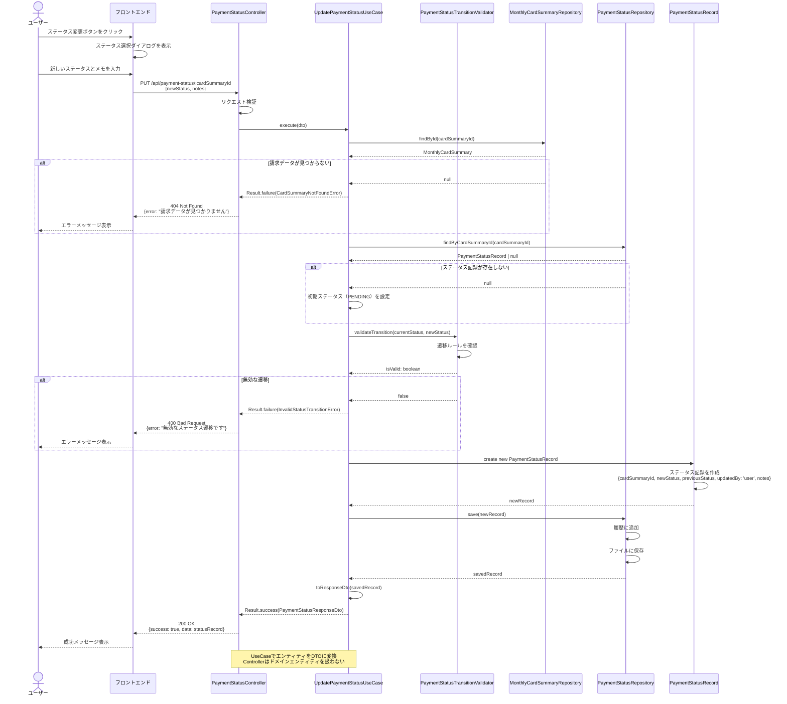

### ステップ詳細

1. **リクエスト受信**
   - エンドポイント: `PUT /api/payment-status/:cardSummaryId`
   - RequestDTO: `UpdatePaymentStatusRequestDto`
   - バリデーション: newStatus（PaymentStatus Enum）、notes（任意、最大1000文字）

2. **請求データ取得**
   - カード集計IDから請求データを取得
   - 請求データが存在しない場合は404エラー

3. **現在のステータス取得**
   - カード集計IDから最新のステータス記録を取得
   - ステータス記録が存在しない場合は初期ステータス（PENDING）を設定

4. **ステータス遷移の検証**
   - 現在のステータスから新しいステータスへの遷移が許可されているか検証
   - 無効な遷移の場合は400エラー

5. **ステータス記録の作成**
   - 新しいステータス記録を作成
   - updatedBy: 'user'、notesを設定

6. **永続化**
   - ステータス記録をJSON形式で保存
   - ステータス変更履歴に追加

7. **レスポンス**
   - ResponseDTO: `PaymentStatusResponseDto`
   - HTTPステータス: 200 OK

---

## 自動ステータス更新のフロー（日次バッチ）

### 概要

**ユースケース**: 日次バッチ処理により、引落予定日に基づいて自動的にステータスを更新する

**アクター**: スケジューラー（NestJS Schedule）

**前提条件**:

- 請求データ（MonthlyCardSummary）が存在する
- 引落予定日が設定されている

**成功時の結果**:

- ステータスが自動更新される
- ステータス変更履歴が記録される
- 更新理由が記録される

### PENDING → PROCESSING の更新フロー

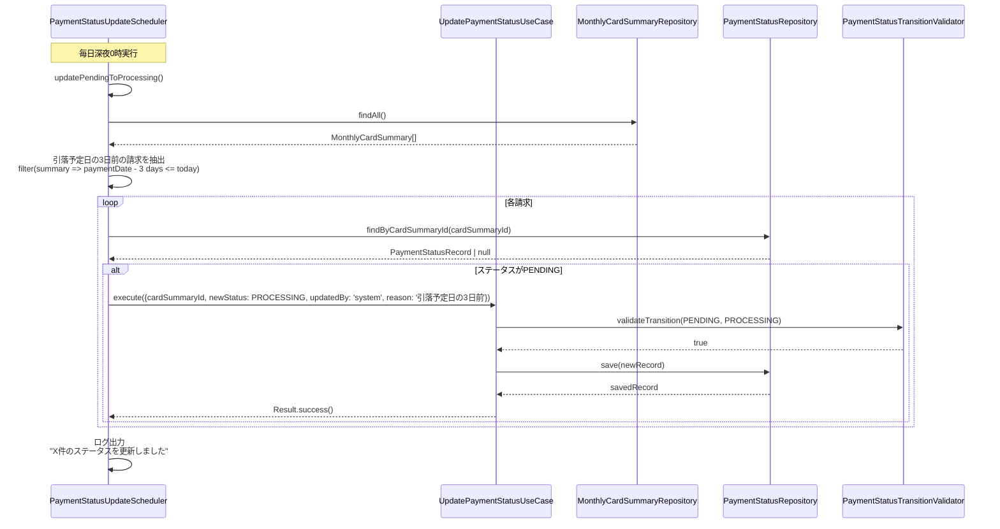

### PROCESSING → OVERDUE の更新フロー

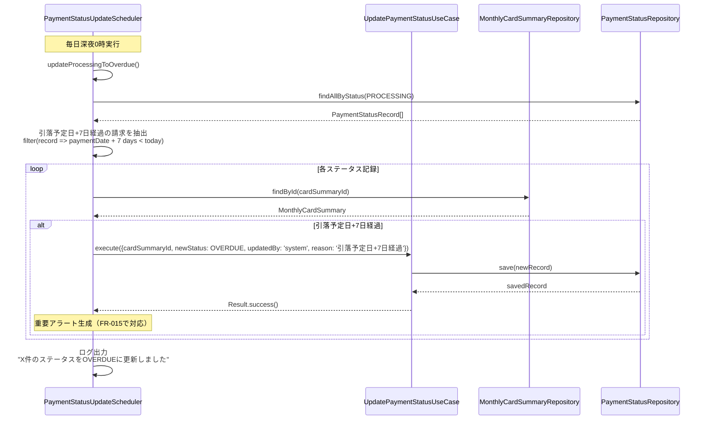

### ステップ詳細

1. **スケジューラー起動**
   - 毎日深夜0時に実行
   - NestJS Schedule（@nestjs/schedule）を使用

2. **対象抽出**
   - PENDING → PROCESSING: 引落予定日の3日前の請求を抽出
   - PROCESSING → OVERDUE: 引落予定日+7日経過の請求を抽出

3. **ステータス更新**
   - 各請求に対してステータス更新を実行
   - updatedBy: 'system'、reasonを設定

4. **ログ記録**
   - 更新件数をログに記録

---

## 照合結果による自動ステータス更新のフロー

### 概要

**ユースケース**: 照合結果（FR-013）に基づいて自動的にステータスを更新する

**アクター**: 照合処理（FR-013）

**前提条件**:

- 照合処理が実行されている
- 照合結果が取得可能

**成功時の結果**:

- ステータスが自動更新される（PROCESSING → PAID または DISPUTED）
- 照合IDが記録される

### PROCESSING → PAID の更新フロー（照合成功）

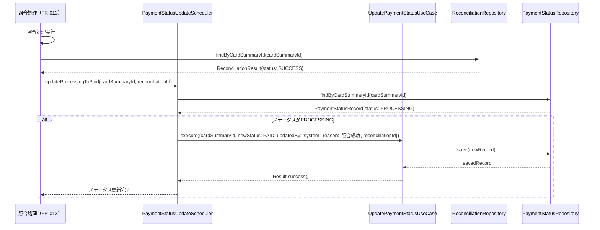

### PROCESSING → DISPUTED の更新フロー（照合失敗）

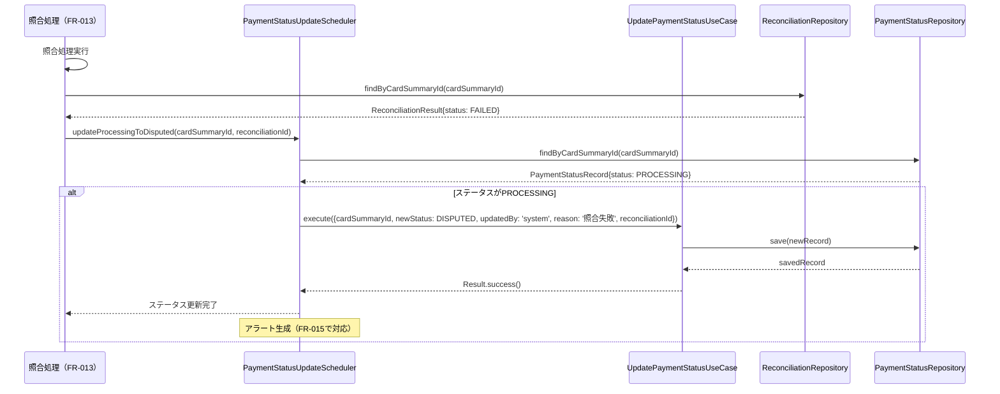

---

## ステータス履歴取得のフロー

### 概要

**ユースケース**: 指定された請求月のステータス変更履歴を取得する

**アクター**: フロントエンド、ユーザー

**前提条件**:

- 請求データ（MonthlyCardSummary）が存在する

**成功時の結果**:

- ステータス変更履歴が取得される
- すべてのステータス変更（自動・手動）が時系列で表示される

### 正常系フロー

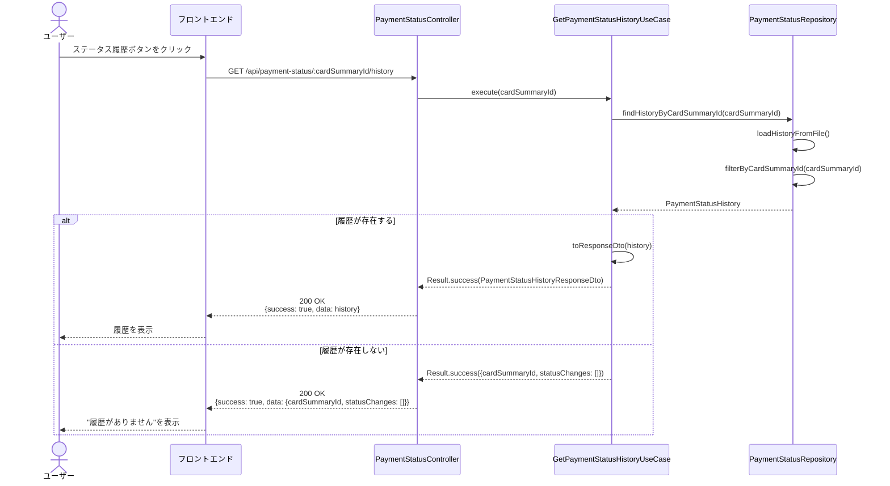

### ステップ詳細

1. **リクエスト受信**
   - エンドポイント: `GET /api/payment-status/:cardSummaryId/history`
   - パラメータ: cardSummaryId（パスパラメータ）

2. **履歴取得**
   - カード集計IDからステータス変更履歴を取得
   - 履歴が存在しない場合は空配列を返す

3. **レスポンス**
   - ResponseDTO: `PaymentStatusHistoryResponseDto`
   - HTTPステータス: 200 OK

---

## エラーハンドリングフロー

### バリデーションエラー (400 Bad Request)

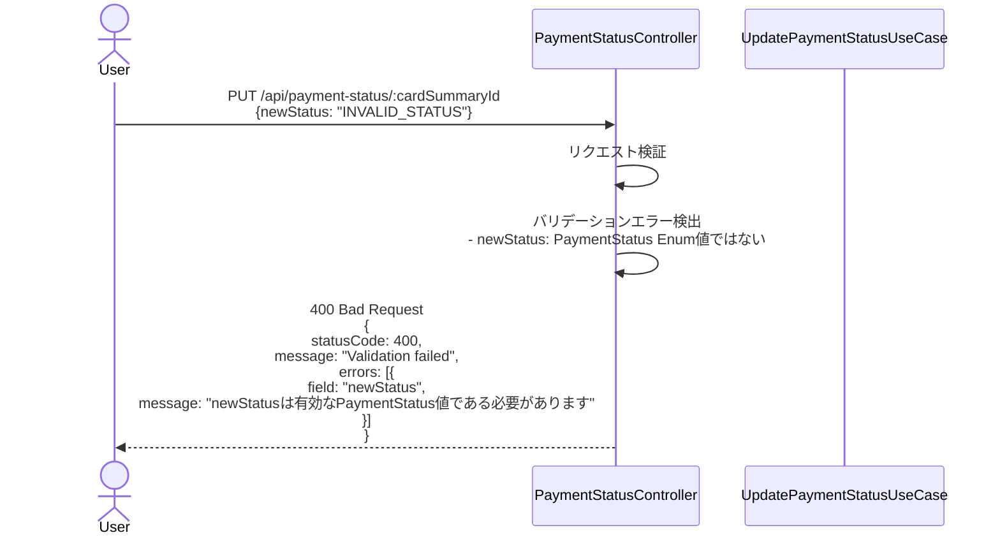

**エラーレスポンス例**:

```json
{
  "statusCode": 400,
  "message": "Validation failed",
  "errors": [
    {
      "field": "newStatus",
      "message": "newStatusは有効なPaymentStatus値である必要があります"
    }
  ]
}
```

### 無効なステータス遷移エラー (400 Bad Request)

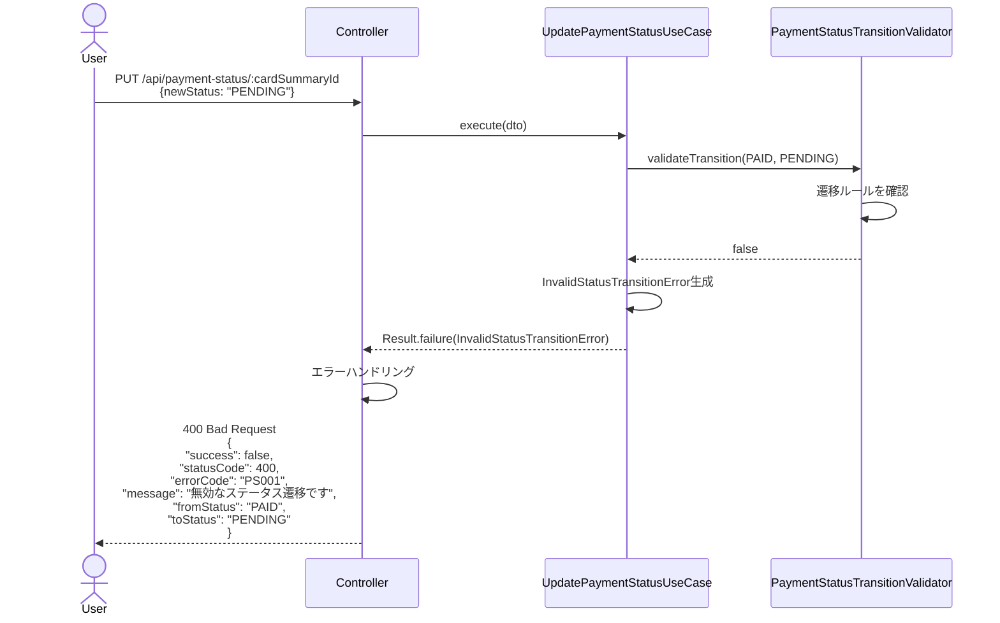

### 請求データ未検出エラー (404 Not Found)

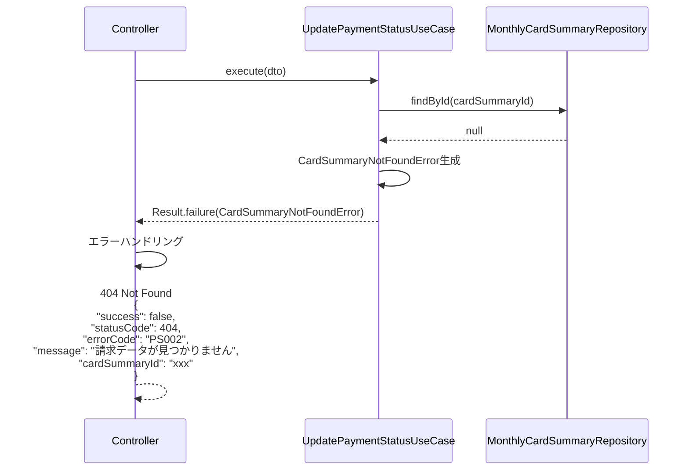

### 同時更新の競合エラー (409 Conflict)

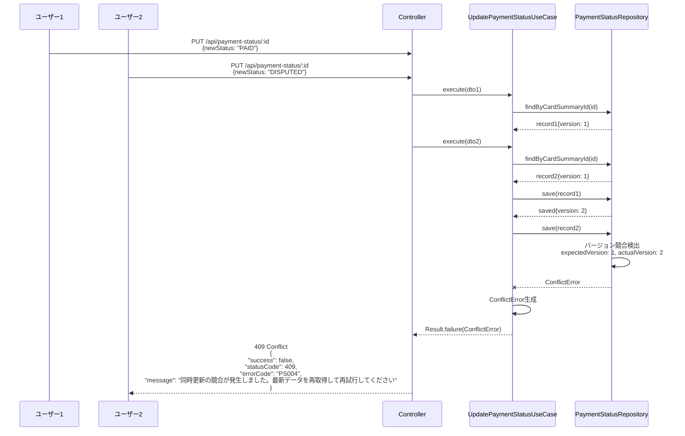

### サーバーエラー (500 Internal Server Error)

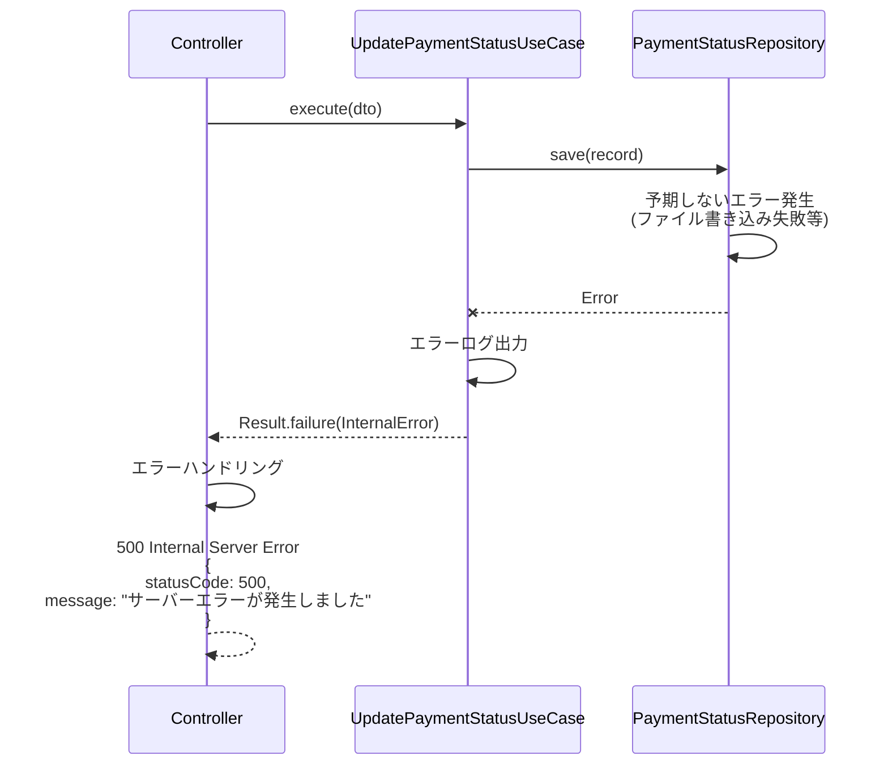

---

## ステータス遷移ルール詳細

### 許可された遷移

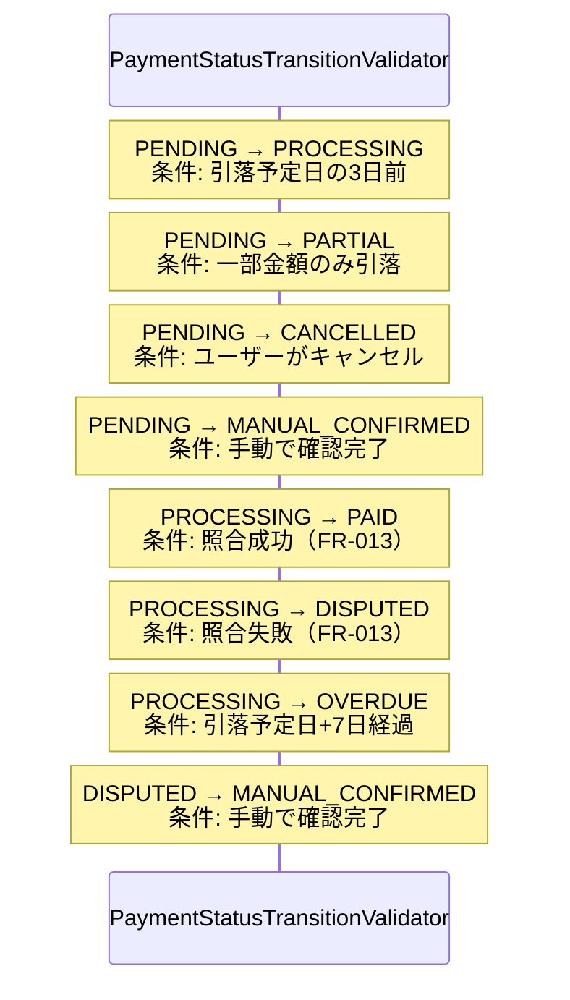

### 禁止された遷移

- PAID → PENDING: 支払済みから未払いに戻すことは不可
- PAID → PROCESSING: 支払済みから処理中に戻すことは不可
- OVERDUE → PENDING: 延滞から未払いに戻すことは不可
- CANCELLED → その他: キャンセルから他のステータスに遷移することは不可

---

## チェックリスト

シーケンス図作成時の確認事項：

### 基本項目

- [x] 主要なユースケースがすべて記載されている
- [x] アクター、参加者が明確に定義されている
- [x] 正常系フローが記載されている
- [x] 異常系フローが記載されている

### 詳細項目

- [x] エラーハンドリングが明確
- [x] レスポンスの型とステータスコードが明記されている
- [x] ステータス遷移ルールが明確
- [x] 自動更新と手動更新の違いが明確

### 実装ガイド

- [x] 各ステップに説明が付与されている
- [x] 前提条件が明確
- [x] 成功時の結果が明確
- [x] エラーレスポンス例が記載されている
