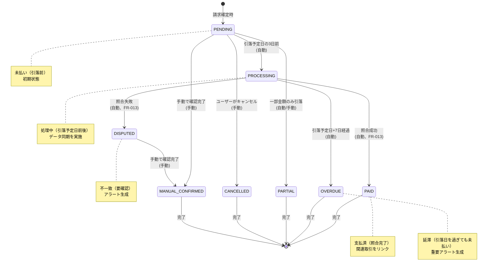

# 状態遷移図

このドキュメントでは、支払いステータス管理機能における状態管理と状態遷移を記載しています。

## 目次

1. [PaymentStatus の状態遷移](#paymentstatusの状態遷移)
2. [状態の詳細説明](#状態の詳細説明)
3. [遷移条件とバリデーション](#遷移条件とバリデーション)
4. [状態管理の実装](#状態管理の実装)

---

## PaymentStatus の状態遷移

### 状態遷移図



### 状態一覧

| 状態             | 説明                           | 次の状態                                         | 更新方法  |
| ---------------- | ------------------------------ | ------------------------------------------------ | --------- |
| PENDING          | 未払い（引落前）               | PROCESSING, PARTIAL, CANCELLED, MANUAL_CONFIRMED | 自動/手動 |
| PROCESSING       | 処理中（引落予定日前後）       | PAID, DISPUTED, OVERDUE                          | 自動      |
| PAID             | 支払済（照合完了）             | -（終端状態）                                    | 自動      |
| OVERDUE          | 延滞（引落日を過ぎても未払い） | -（終端状態）                                    | 自動      |
| PARTIAL          | 一部支払い                     | -（終端状態）                                    | 自動/手動 |
| DISPUTED         | 不一致（要確認）               | MANUAL_CONFIRMED                                 | 自動/手動 |
| CANCELLED        | キャンセル                     | -（終端状態）                                    | 手動      |
| MANUAL_CONFIRMED | 手動確認済                     | -（終端状態）                                    | 手動      |

---

## 状態の詳細説明

### PENDING（未払い）

**概要**: 請求が確定し、引落予定日が到来する前の状態。初期状態として設定される。

**プロパティ**:

- `status`: `"pending"`
- `updatedBy`: `"system"` または `"user"`
- `updatedAt`: `Date`

**可能なアクション**:

- **自動遷移**: 引落予定日の3日前にPROCESSINGへ自動遷移
- **手動遷移**:
  - PARTIAL: 一部金額のみ引落が確認された場合
  - CANCELLED: ユーザーがキャンセルした場合
  - MANUAL_CONFIRMED: 手動で確認完了した場合

**制約**:

- 請求データ（MonthlyCardSummary）が存在する必要がある
- 引落予定日が設定されている必要がある

**UI表示**:

- 表示内容: ステータスバッジ（黄色）
- ボタン状態: ステータス変更ボタンが有効

---

### PROCESSING（処理中）

**概要**: 引落予定日の3日前から、引落処理が完了するまでの状態。データ同期を実施し、照合処理を待つ。

**プロパティ**:

- `status`: `"processing"`
- `updatedBy`: `"system"`
- `updatedAt`: `Date`
- `reason`: `"引落予定日の3日前"`

**可能なアクション**:

- **自動遷移**:
  - PAID: 照合成功時（FR-013）
  - DISPUTED: 照合失敗時（FR-013）
  - OVERDUE: 引落予定日+7日経過時

**制約**:

- 照合処理（FR-013）が実行されている必要がある
- 引落予定日が設定されている必要がある

**UI表示**:

- 表示内容: ステータスバッジ（青色）
- ボタン状態: ステータス変更ボタンは無効（自動更新のみ）

---

### PAID（支払済）

**概要**: 照合が成功し、支払いが完了した状態。終端状態で、他の状態に遷移することはできない。

**プロパティ**:

- `status`: `"paid"`
- `updatedBy`: `"system"`
- `updatedAt`: `Date`
- `reason`: `"照合成功"`
- `reconciliationId`: `string`（FR-013の照合ID）

**可能なアクション**:

- なし（終端状態）

**制約**:

- この状態からは他の状態に遷移できない
- 照合結果（FR-013）が成功である必要がある

**UI表示**:

- 表示内容: ステータスバッジ（緑色）
- ボタン状態: すべて無効

---

### OVERDUE（延滞）

**概要**: 引落予定日+7日経過しても未払いの状態。重要アラートが生成される。終端状態。

**プロパティ**:

- `status`: `"overdue"`
- `updatedBy`: `"system"`
- `updatedAt`: `Date`
- `reason`: `"引落予定日+7日経過"`

**可能なアクション**:

- なし（終端状態）

**制約**:

- この状態からは他の状態に遷移できない
- 引落予定日+7日経過している必要がある

**UI表示**:

- 表示内容: ステータスバッジ（赤色）
- ボタン状態: すべて無効
- アラート: 重要アラート表示（FR-015）

---

### PARTIAL（一部支払い）

**概要**: 一部金額のみ引落が確認された状態。終端状態。

**プロパティ**:

- `status`: `"partial"`
- `updatedBy`: `"system"` または `"user"`
- `updatedAt`: `Date`
- `reason`: `"一部金額のみ引落"`

**可能なアクション**:

- なし（終端状態）

**制約**:

- この状態からは他の状態に遷移できない
- 一部金額のみ引落が確認されている必要がある

**UI表示**:

- 表示内容: ステータスバッジ（オレンジ色）
- ボタン状態: すべて無効

---

### DISPUTED（不一致）

**概要**: 照合が失敗し、不一致が検出された状態。ユーザーの確認が必要。

**プロパティ**:

- `status`: `"disputed"`
- `updatedBy`: `"system"`
- `updatedAt`: `Date`
- `reason`: `"照合失敗"`
- `reconciliationId`: `string`（FR-013の照合ID）

**可能なアクション**:

- **手動遷移**: MANUAL_CONFIRMED（手動で確認完了した場合）

**制約**:

- 照合結果（FR-013）が失敗である必要がある
- ユーザーの確認が必要

**UI表示**:

- 表示内容: ステータスバッジ（オレンジ色）
- ボタン状態: ステータス変更ボタンが有効（MANUAL_CONFIRMEDへの遷移のみ）
- アラート: アプリ内通知（FR-015）

---

### CANCELLED（キャンセル）

**概要**: ユーザーがキャンセルした状態。終端状態。

**プロパティ**:

- `status`: `"cancelled"`
- `updatedBy`: `"user"`
- `updatedAt`: `Date`
- `reason`: `"ユーザーがキャンセル"`
- `notes`: `string`（ユーザー入力メモ）

**可能なアクション**:

- なし（終端状態）

**制約**:

- この状態からは他の状態に遷移できない
- ユーザーによる手動操作が必要

**UI表示**:

- 表示内容: ステータスバッジ（グレー）
- ボタン状態: すべて無効

---

### MANUAL_CONFIRMED（手動確認済）

**概要**: ユーザーが手動で確認完了した状態。終端状態。

**プロパティ**:

- `status`: `"manual_confirmed"`
- `updatedBy`: `"user"`
- `updatedAt`: `Date`
- `reason`: `"手動で確認完了"`
- `notes`: `string`（ユーザー入力メモ）

**可能なアクション**:

- なし（終端状態）

**制約**:

- この状態からは他の状態に遷移できない
- ユーザーによる手動操作が必要

**UI表示**:

- 表示内容: ステータスバッジ（緑色）
- ボタン状態: すべて無効

---

## 遷移条件とバリデーション

### PENDING → PROCESSING

**トリガー**: 日次バッチ処理（引落予定日の3日前）

**前提条件**:

- [ ] ステータスがPENDINGである
- [ ] 引落予定日が設定されている
- [ ] 引落予定日 - 3日 <= 今日

**処理**:

1. ステータスをPROCESSINGに更新
2. updatedBy: 'system'を設定
3. reason: '引落予定日の3日前'を設定
4. データ同期を実施

**バリデーション**:

- ステータスがPENDINGであることを確認
- 引落予定日が有効な日付であることを確認

**失敗時の動作**:

- バリデーションエラー: ログに記録、状態は変更しない
- システムエラー: エラーログに記録、次回バッチで再試行

```typescript
// 実装例
async function transitionToProcessing(
  record: PaymentStatusRecord,
  paymentDate: Date
): Promise<PaymentStatusRecord> {
  // 前提条件チェック
  if (record.status !== PaymentStatus.PENDING) {
    throw new InvalidStatusTransitionError(`Cannot transition to PROCESSING from ${record.status}`);
  }

  const threeDaysBefore = new Date(paymentDate);
  threeDaysBefore.setDate(threeDaysBefore.getDate() - 3);

  if (new Date() < threeDaysBefore) {
    // まだ3日前ではない
    return record;
  }

  // 状態更新
  return new PaymentStatusRecord({
    ...record,
    status: PaymentStatus.PROCESSING,
    previousStatus: record.status,
    updatedBy: 'system',
    reason: '引落予定日の3日前',
    updatedAt: new Date(),
  });
}
```

---

### PROCESSING → PAID

**トリガー**: 照合成功（FR-013）

**前提条件**:

- [ ] ステータスがPROCESSINGである
- [ ] 照合結果（FR-013）が成功である
- [ ] 照合IDが存在する

**処理**:

1. ステータスをPAIDに更新
2. updatedBy: 'system'を設定
3. reason: '照合成功'を設定
4. reconciliationIdを設定
5. 関連取引をリンク

**バリデーション**:

- ステータスがPROCESSINGであることを確認
- 照合結果が成功であることを確認

```typescript
// 実装例
async function transitionToPaid(
  record: PaymentStatusRecord,
  reconciliationId: string
): Promise<PaymentStatusRecord> {
  if (record.status !== PaymentStatus.PROCESSING) {
    throw new InvalidStatusTransitionError(`Cannot transition to PAID from ${record.status}`);
  }

  return new PaymentStatusRecord({
    ...record,
    status: PaymentStatus.PAID,
    previousStatus: record.status,
    updatedBy: 'system',
    reason: '照合成功',
    reconciliationId,
    updatedAt: new Date(),
  });
}
```

---

### PROCESSING → DISPUTED

**トリガー**: 照合失敗（FR-013）

**前提条件**:

- [ ] ステータスがPROCESSINGである
- [ ] 照合結果（FR-013）が失敗である
- [ ] 照合IDが存在する

**処理**:

1. ステータスをDISPUTEDに更新
2. updatedBy: 'system'を設定
3. reason: '照合失敗'を設定
4. reconciliationIdを設定
5. アラート生成（FR-015）

**バリデーション**:

- ステータスがPROCESSINGであることを確認
- 照合結果が失敗であることを確認

---

### PROCESSING → OVERDUE

**トリガー**: 日次バッチ処理（引落予定日+7日経過）

**前提条件**:

- [ ] ステータスがPROCESSINGである
- [ ] 引落予定日が設定されている
- [ ] 引落予定日 + 7日 < 今日

**処理**:

1. ステータスをOVERDUEに更新
2. updatedBy: 'system'を設定
3. reason: '引落予定日+7日経過'を設定
4. 重要アラート生成（FR-015）

**バリデーション**:

- ステータスがPROCESSINGであることを確認
- 引落予定日+7日経過していることを確認

---

### PENDING → CANCELLED

**トリガー**: ユーザーの手動操作

**前提条件**:

- [ ] ステータスがPENDINGである
- [ ] ユーザーが認証されている

**処理**:

1. ステータスをCANCELLEDに更新
2. updatedBy: 'user'を設定
3. reason: 'ユーザーがキャンセル'を設定
4. notes（ユーザー入力メモ）を保存

**バリデーション**:

- ステータスがPENDINGであることを確認
- ユーザーが認証されていることを確認

---

### DISPUTED → MANUAL_CONFIRMED

**トリガー**: ユーザーの手動操作

**前提条件**:

- [ ] ステータスがDISPUTEDである
- [ ] ユーザーが認証されている

**処理**:

1. ステータスをMANUAL_CONFIRMEDに更新
2. updatedBy: 'user'を設定
3. reason: '手動で確認完了'を設定
4. notes（ユーザー入力メモ）を保存

**バリデーション**:

- ステータスがDISPUTEDであることを確認
- ユーザーが認証されていることを確認

---

## 状態管理の実装

### Entity での状態管理

```typescript
// PaymentStatusRecord Entity定義例
export class PaymentStatusRecord {
  private _status: PaymentStatus;
  private _previousStatus?: PaymentStatus;

  get status(): PaymentStatus {
    return this._status;
  }

  get previousStatus(): PaymentStatus | undefined {
    return this._previousStatus;
  }

  // 状態遷移メソッド
  public canTransitionTo(newStatus: PaymentStatus): boolean {
    const allowedTransitions: Record<PaymentStatus, PaymentStatus[]> = {
      [PaymentStatus.PENDING]: [
        PaymentStatus.PROCESSING,
        PaymentStatus.PARTIAL,
        PaymentStatus.CANCELLED,
        PaymentStatus.MANUAL_CONFIRMED,
      ],
      [PaymentStatus.PROCESSING]: [
        PaymentStatus.PAID,
        PaymentStatus.DISPUTED,
        PaymentStatus.OVERDUE,
      ],
      [PaymentStatus.PAID]: [],
      [PaymentStatus.OVERDUE]: [],
      [PaymentStatus.PARTIAL]: [],
      [PaymentStatus.DISPUTED]: [PaymentStatus.MANUAL_CONFIRMED],
      [PaymentStatus.CANCELLED]: [],
      [PaymentStatus.MANUAL_CONFIRMED]: [],
    };

    return allowedTransitions[this._status]?.includes(newStatus) ?? false;
  }

  public transitionTo(
    newStatus: PaymentStatus,
    updatedBy: 'system' | 'user',
    reason?: string,
    notes?: string,
    reconciliationId?: string
  ): PaymentStatusRecord {
    if (!this.canTransitionTo(newStatus)) {
      throw new InvalidStatusTransitionError(
        `Cannot transition from ${this._status} to ${newStatus}`
      );
    }

    return new PaymentStatusRecord({
      ...this,
      status: newStatus,
      previousStatus: this._status,
      updatedBy,
      reason,
      notes,
      reconciliationId,
      updatedAt: new Date(),
    });
  }
}
```

### Enum定義

```typescript
export enum PaymentStatus {
  PENDING = 'pending',
  PROCESSING = 'processing',
  PAID = 'paid',
  OVERDUE = 'overdue',
  PARTIAL = 'partial',
  DISPUTED = 'disputed',
  CANCELLED = 'cancelled',
  MANUAL_CONFIRMED = 'manual_confirmed',
}
```

### 遷移ルールの実装

**注意**: 状態遷移の検証ロジックはドメイン層（`PaymentStatusRecord`エンティティ）に一元化されています。Application層の`PaymentStatusTransitionValidator`は削除し、UseCaseがエンティティのメソッドを直接呼び出して検証する設計とします。

```typescript
// PaymentStatusRecord Entity（ドメイン層）
export class PaymentStatusRecord {
  // ... プロパティ定義 ...

  /**
   * 遷移可能かどうかを検証（ドメインロジック）
   */
  public canTransitionTo(newStatus: PaymentStatus): boolean {
    const allowedTransitions: Record<PaymentStatus, PaymentStatus[]> = {
      [PaymentStatus.PENDING]: [
        PaymentStatus.PROCESSING,
        PaymentStatus.PARTIAL,
        PaymentStatus.CANCELLED,
        PaymentStatus.MANUAL_CONFIRMED,
      ],
      [PaymentStatus.PROCESSING]: [
        PaymentStatus.PAID,
        PaymentStatus.DISPUTED,
        PaymentStatus.OVERDUE,
      ],
      [PaymentStatus.DISPUTED]: [PaymentStatus.MANUAL_CONFIRMED],
      // その他の状態は終端状態（遷移不可）
      [PaymentStatus.PAID]: [],
      [PaymentStatus.OVERDUE]: [],
      [PaymentStatus.PARTIAL]: [],
      [PaymentStatus.CANCELLED]: [],
      [PaymentStatus.MANUAL_CONFIRMED]: [],
    };

    return allowedTransitions[this.status]?.includes(newStatus) ?? false;
  }

  /**
   * 遷移可能なステータスリストを取得
   */
  public getAllowedTransitions(): PaymentStatus[] {
    const allowedTransitions: Record<PaymentStatus, PaymentStatus[]> = {
      [PaymentStatus.PENDING]: [
        PaymentStatus.PROCESSING,
        PaymentStatus.PARTIAL,
        PaymentStatus.CANCELLED,
        PaymentStatus.MANUAL_CONFIRMED,
      ],
      [PaymentStatus.PROCESSING]: [
        PaymentStatus.PAID,
        PaymentStatus.DISPUTED,
        PaymentStatus.OVERDUE,
      ],
      [PaymentStatus.DISPUTED]: [PaymentStatus.MANUAL_CONFIRMED],
      [PaymentStatus.PAID]: [],
      [PaymentStatus.OVERDUE]: [],
      [PaymentStatus.PARTIAL]: [],
      [PaymentStatus.CANCELLED]: [],
      [PaymentStatus.MANUAL_CONFIRMED]: [],
    };

    return allowedTransitions[this.status] ?? [];
  }

  /**
   * 自動遷移かどうかを判定
   */
  public isAutomaticTransition(to: PaymentStatus): boolean {
    const automaticTransitions: Array<[PaymentStatus, PaymentStatus]> = [
      [PaymentStatus.PENDING, PaymentStatus.PROCESSING],
      [PaymentStatus.PROCESSING, PaymentStatus.PAID],
      [PaymentStatus.PROCESSING, PaymentStatus.DISPUTED],
      [PaymentStatus.PROCESSING, PaymentStatus.OVERDUE],
    ];

    return automaticTransitions.some(([f, t]) => f === this.status && t === to);
  }
}
```

---

## フロントエンドでの状態管理

### React での実装例

```typescript
// カスタムフック例
export function usePaymentStatusState(initialStatus: PaymentStatus) {
  const [status, setStatus] = useState<PaymentStatus>(initialStatus);
  const [error, setError] = useState<Error | null>(null);

  const canTransition = useCallback(
    (newStatus: PaymentStatus): boolean => {
      const allowedTransitions: Record<PaymentStatus, PaymentStatus[]> = {
        [PaymentStatus.PENDING]: [
          PaymentStatus.PARTIAL,
          PaymentStatus.CANCELLED,
          PaymentStatus.MANUAL_CONFIRMED,
        ],
        [PaymentStatus.DISPUTED]: [PaymentStatus.MANUAL_CONFIRMED],
        // その他の状態は手動遷移不可
      };

      return allowedTransitions[status]?.includes(newStatus) ?? false;
    },
    [status]
  );

  const updateStatus = useCallback(
    async (newStatus: PaymentStatus, notes?: string) => {
      if (!canTransition(newStatus)) {
        throw new Error('Invalid state transition');
      }

      try {
        const response = await api.updatePaymentStatus({
          cardSummaryId,
          newStatus,
          notes,
        });
        setStatus(response.data.status);
      } catch (err) {
        setError(err as Error);
        throw err;
      }
    },
    [canTransition, cardSummaryId]
  );

  return {
    status,
    error,
    canTransition,
    updateStatus,
  };
}
```

---

## チェックリスト

状態遷移図作成時の確認事項：

### 基本項目

- [x] すべての状態が定義されている
- [x] 状態間の遷移が明確に記載されている
- [x] 初期状態と終端状態が明確
- [x] 遷移のトリガーが記載されている

### 詳細項目

- [x] 各状態の詳細説明がある
- [x] 遷移条件が明確
- [x] バリデーションルールが記載されている
- [x] 実装例が提供されている

### 実装ガイド

- [x] 不正な遷移の防止方法が記載されている
- [x] エラーハンドリングが明確
- [x] 自動遷移と手動遷移の違いが明確
