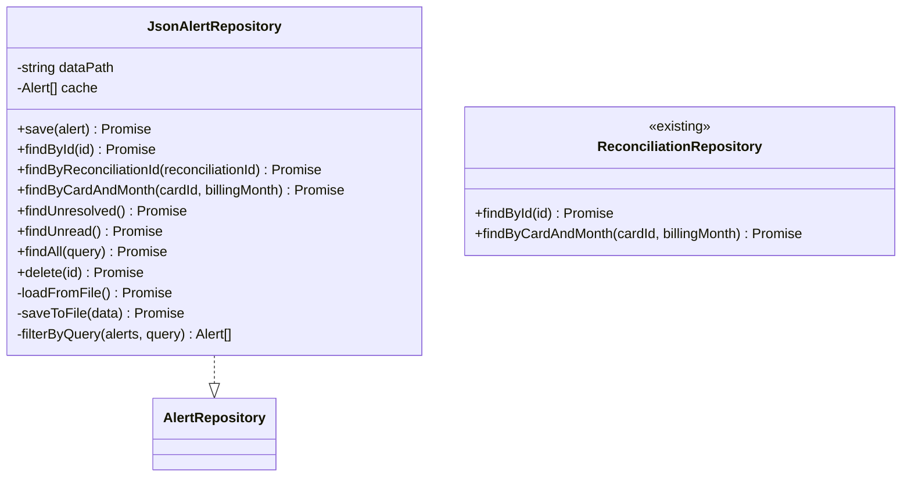
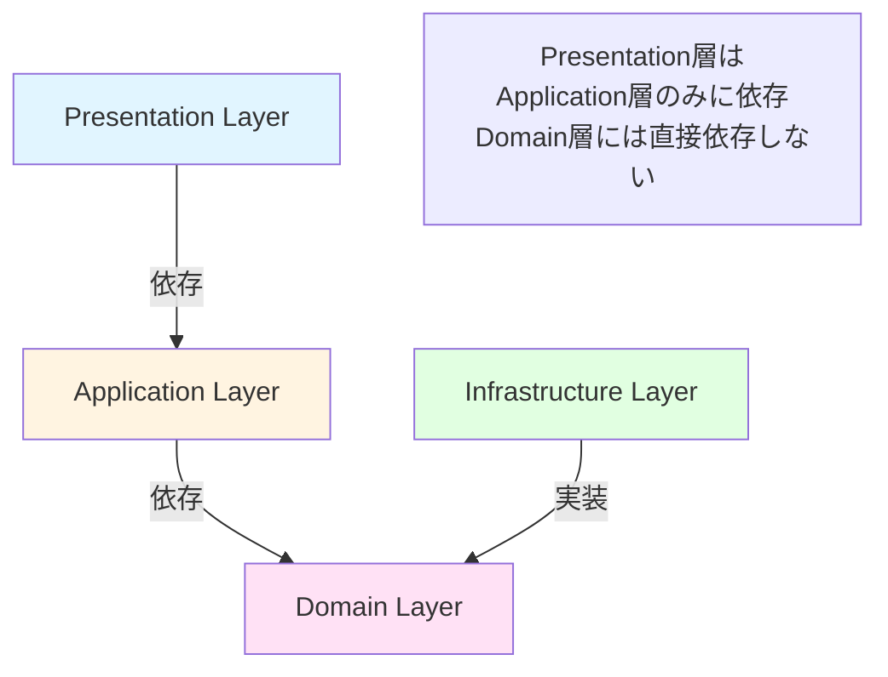
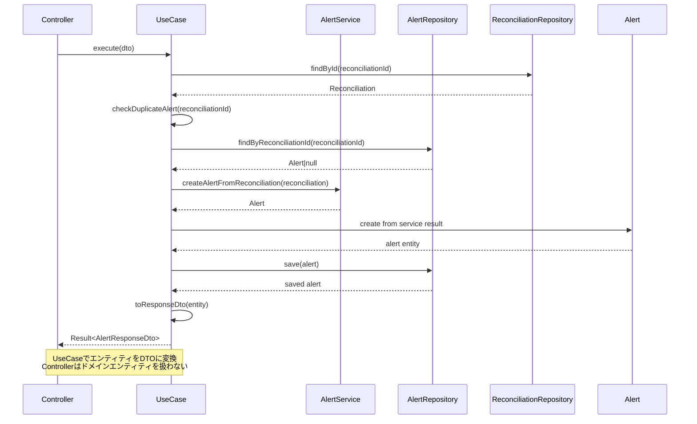

# クラス図

このドキュメントでは、不一致時のアラート表示機能のクラス構造を記載しています。

## 目次

1. [Domain層クラス図](#domain層クラス図)
2. [Application層クラス図](#application層クラス図)
3. [Infrastructure層クラス図](#infrastructure層クラス図)
4. [Presentation層クラス図](#presentation層クラス図)

---

## Domain層クラス図

### Alert Module

```mermaid
classDiagram
    class Alert {
        +string id
        +AlertType type
        +AlertLevel level
        +string title
        +string message
        +AlertDetails details
    +AlertStatus status
    +Date createdAt
    +Date resolvedAt
        +string resolvedBy
        +string resolutionNote
        +AlertAction[] actions
        +markAsRead() void
        +markAsResolved(resolvedBy, note) void
        +addAction(action) void
    }

    note right of Alert
        エンティティからDTOへの変換は、
        Application層のUseCaseまたは
        Presentation層のマッパーで実施
    end note

    class AlertDetails {
        +string cardId
        +string cardName
        +string billingMonth
        +number expectedAmount
        +number actualAmount
        +number discrepancy
        +Date paymentDate
        +number daysElapsed
        +string[] relatedTransactions
        +string reconciliationId
    }

    class AlertAction {
        +string id
        +string label
        +ActionType action
        +boolean isPrimary
    }

    class AlertLevel {
        <<enumeration>>
        INFO
        WARNING
        ERROR
        CRITICAL
    }

    class AlertType {
        <<enumeration>>
        AMOUNT_MISMATCH
        PAYMENT_NOT_FOUND
        OVERDUE
        MULTIPLE_CANDIDATES
    }

    class AlertStatus {
        <<enumeration>>
        UNREAD
        READ
        RESOLVED
    }

    class ActionType {
        <<enumeration>>
        VIEW_DETAILS
        MANUAL_MATCH
        MARK_RESOLVED
        CONTACT_BANK
        IGNORE
    }

    class AlertRepository {
        <<interface>>
        +save(alert) Promise<Alert>
        +findById(id) Promise<Alert|null>
        +findByReconciliationId(reconciliationId) Promise<Alert|null>
        +findByCardAndMonth(cardId, billingMonth) Promise<Alert[]>
        +findUnresolved() Promise<Alert[]>
        +findUnread() Promise<Alert[]>
        +findAll(query) Promise<Alert[]>
        +delete(id) Promise<void>
    }

    class Reconciliation {
        <<existing>>
        +string id
        +string cardId
        +string billingMonth
        +ReconciliationStatus status
        +ReconciliationResult[] results
    }

    class MonthlyCardSummary {
        <<existing>>
        +string id
        +string cardId
        +string cardName
        +string billingMonth
        +Date paymentDate
        +number netPaymentAmount
    }

    Alert --> AlertType
    Alert --> AlertLevel
    Alert --> AlertStatus
    Alert --> AlertDetails
    Alert --> AlertAction
    AlertAction --> ActionType
    Alert ..> Reconciliation : uses (reconciliationId)
    AlertDetails ..> MonthlyCardSummary : uses (cardId, billingMonth)
```

**クラス説明**:

#### Alert

- **責務**: アラート情報を保持し、アラートステータスを管理する
- **主要メソッド**:
  - `markAsRead()`: ステータスを「READ」に更新
  - `markAsResolved(resolvedBy, note)`: ステータスを「RESOLVED」に更新、解決情報を記録
  - `addAction(action)`: アクションを追加
- **注意**: エンティティからDTOへの変換は、Application層のUseCaseまたはPresentation層のマッパーで行う（Onion Architecture原則遵守）
- **ビジネスルール**:
  - 同じ照合結果に対するアラートは1件のみ生成（重複防止）
  - 解決済みアラートは90日間保持
  - CRITICALアラートは削除不可（アーカイブのみ）
- **関連エンティティ**: `Reconciliation`とは`reconciliationId`で関連付けられる（直接保持しない）

#### AlertDetails

- **責務**: アラートの詳細情報を保持（Value Object）
- **不変性**: 値オブジェクトとして不変（immutable）
- **フィールド**:
  - `cardId`: カードID
  - `cardName`: カード名
  - `billingMonth`: 請求月（YYYY-MM）
  - `expectedAmount`: 期待金額（請求額）
  - `actualAmount`: 実際の金額（引落額、オプション）
  - `discrepancy`: 差額（オプション）
  - `paymentDate`: 引落予定日（オプション）
  - `daysElapsed`: 経過日数（オプション）
  - `relatedTransactions`: 関連取引IDのリスト
  - `reconciliationId`: 照合結果ID（オプション）

#### AlertAction

- **責務**: アラートに対するアクションを保持（Value Object）
- **不変性**: 値オブジェクトとして不変（immutable）
- **フィールド**:
  - `id`: アクションID
  - `label`: アクションラベル（表示用）
  - `action`: アクションタイプ
  - `isPrimary`: プライマリアクションかどうか

#### AlertLevel

- **責務**: アラートレベルの定義
- **値**:
  - INFO: 情報（軽微な差異）
  - WARNING: 警告（要確認）
  - ERROR: エラー（重大な不一致）
  - CRITICAL: 緊急（延滞等）

#### AlertType

- **責務**: アラート種別の定義
- **値**:
  - AMOUNT_MISMATCH: 金額不一致
  - PAYMENT_NOT_FOUND: 引落未検出
  - OVERDUE: 延滞
  - MULTIPLE_CANDIDATES: 複数候補

#### AlertStatus

- **責務**: アラートステータスの定義
- **値**:
  - UNREAD: 未読
  - READ: 既読
  - RESOLVED: 解決済み

#### ActionType

- **責務**: アクションタイプの定義
- **値**:
  - VIEW_DETAILS: 詳細を確認
  - MANUAL_MATCH: 手動で照合
  - MARK_RESOLVED: 解決済みにする
  - CONTACT_BANK: カード会社に問い合わせ
  - IGNORE: 無視する

---

## Application層クラス図

### Use Cases and Services

```mermaid
classDiagram
    class CreateAlertUseCase {
        -AlertRepository alertRepository
        -ReconciliationRepository reconciliationRepository
        -AlertService alertService
        +execute(dto) Promise<Result<AlertResponseDto>>
        -checkDuplicateAlert(reconciliationId) Promise<boolean>
        -toResponseDto(entity) AlertResponseDto
    }

    note right of CreateAlertUseCase
        アラート種別の判定はAlertServiceに委譲
        UseCaseはreconciliationIdのみを受け取る
    end note

    class GetAlertsUseCase {
        -AlertRepository alertRepository
        +execute(query) Promise<Result<AlertListResponseDto>>
        -toListResponseDto(alerts) AlertListResponseDto
    }

    class ResolveAlertUseCase {
        -AlertRepository alertRepository
        +execute(id, dto) Promise<Result<AlertResponseDto>>
        -toResponseDto(entity) AlertResponseDto
    }

    class MarkAlertAsReadUseCase {
        -AlertRepository alertRepository
        +execute(id) Promise<Result<AlertResponseDto>>
        -toResponseDto(entity) AlertResponseDto
    }

    class AlertService {
        +createAlertFromReconciliation(reconciliation) Alert
        +analyzeReconciliationResult(reconciliation) AlertType
        +determineAlertLevel(type, details) AlertLevel
        +buildAlertMessage(type, details) string
        +buildAlertActions(type) AlertAction[]
        -buildAmountMismatchAlert(reconciliation) Alert
        -buildPaymentNotFoundAlert(reconciliation) Alert
        -buildOverdueAlert(reconciliation) Alert
        -buildMultipleCandidatesAlert(reconciliation) Alert
    }

    class CreateAlertRequestDto {
        +string reconciliationId
        +AlertType type
    }

    note right of CreateAlertRequestDto
        バリデーションはclass-validatorデコレータと
        ValidationPipeを使用（NestJSのベストプラクティス）
    end note

    CreateAlertUseCase --> AlertRepository
    CreateAlertUseCase --> ReconciliationRepository
    CreateAlertUseCase --> AlertService
    CreateAlertUseCase --> CreateAlertRequestDto
    GetAlertsUseCase --> AlertRepository
    ResolveAlertUseCase --> AlertRepository
    MarkAlertAsReadUseCase --> AlertRepository
```

**クラス説明**:

#### CreateAlertUseCase

- **責務**: 照合結果からアラートを生成する
- **依存**: AlertRepository, ReconciliationRepository, AlertService
- **入力**: `CreateAlertRequestDto`
- **出力**: `Result<AlertResponseDto>`
- **処理フロー**:
  1. 照合結果を取得（ReconciliationRepository）
  2. 重複アラートチェック（同じ照合結果に対するアラートが既に存在しないか）
  3. アラート生成（AlertService）
     - `AlertService.createAlertFromReconciliation()`を呼び出し
     - `AlertService`が照合結果を分析してアラート種別を自動判定
  4. アラートを保存（AlertRepository）
  5. エンティティをResponseDTOに変換して返却
- **注意**: アラート生成ロジックとアラート種別の判定は`AlertService`に委譲し、UseCaseは調整のみを行う

#### GetAlertsUseCase

- **責務**: アラート一覧を取得する
- **依存**: AlertRepository
- **入力**: クエリパラメータ（level, status, cardId, billingMonth等）
- **出力**: `Result<AlertListResponseDto>`
- **処理フロー**:
  1. クエリパラメータに基づいてアラートを取得（AlertRepository）
  2. エンティティをListResponseDTOに変換して返却

#### ResolveAlertUseCase

- **責務**: アラートを解決済みにする
- **依存**: AlertRepository
- **入力**: アラートID、`ResolveAlertRequestDto`（解決理由等）
- **出力**: `Result<AlertResponseDto>`
- **処理フロー**:
  1. アラートを取得（AlertRepository）
  2. アラートを解決済みに更新（`markAsResolved()`）
  3. アラートを保存（AlertRepository）
  4. エンティティをResponseDTOに変換して返却

#### MarkAlertAsReadUseCase

- **責務**: アラートを既読にする
- **依存**: AlertRepository
- **入力**: アラートID
- **出力**: `Result<AlertResponseDto>`
- **処理フロー**:
  1. アラートを取得（AlertRepository）
  2. アラートを既読に更新（`markAsRead()`）
  3. アラートを保存（AlertRepository）
  4. エンティティをResponseDTOに変換して返却

#### AlertService

- **責務**: アラート生成ロジックの実装
- **主要メソッド**:
  - `createAlertFromReconciliation()`: 照合結果からアラートを生成
  - `determineAlertLevel()`: アラートタイプと詳細からレベルを決定
  - `buildAlertMessage()`: アラートタイプと詳細からメッセージを構築
  - `buildAlertActions()`: アラートタイプからアクションリストを構築
  - `buildAmountMismatchAlert()`: 金額不一致アラートを構築
  - `buildPaymentNotFoundAlert()`: 引落未検出アラートを構築
  - `buildOverdueAlert()`: 延滞アラートを構築
  - `buildMultipleCandidatesAlert()`: 複数候補アラートを構築
- **ビジネスルール**:
  - 照合結果を分析してアラートタイプを判定（`analyzeReconciliationResult()`）
  - アラートタイプに応じてレベルを決定
  - アラートタイプに応じてアクションを設定

---

## Infrastructure層クラス図

### Repository Implementations



**クラス説明**:

#### JsonAlertRepository

- **責務**: アラートデータのJSON形式での永続化
- **永続化方法**: JSON形式でファイルに保存（`data/alerts/alerts.json`）
- **キャッシング戦略**: ライトスルーキャッシュ
  - 読み取り時: メモリキャッシュが存在すればそれを返却、なければファイルから読み込み
  - 書き込み時: ファイルとメモリキャッシュを同時に更新（一貫性を保証）
  - 無効化: アプリケーション再起動時にキャッシュをクリア
- **主要メソッド**:
  - `save()`: アラートデータを保存（既存データがある場合は上書き）
  - `findByReconciliationId()`: 照合結果IDで検索（重複チェック用）
  - `findByCardAndMonth()`: カードIDと請求月で複数のアラートを取得
  - `findUnresolved()`: 未解決のアラートを取得
  - `findUnread()`: 未読のアラートを取得
  - `findAll()`: クエリパラメータに基づいてフィルタリングして取得
  - `filterByQuery()`: クエリパラメータでフィルタリング

#### ReconciliationRepository（既存）

- **責務**: 照合データの取得
- **使用箇所**: UseCaseから照合結果を取得してアラート生成

---

## Presentation層クラス図

### Controllers

```mermaid
classDiagram
    class AlertController {
        -CreateAlertUseCase createAlertUseCase
        -GetAlertsUseCase getAlertsUseCase
        -ResolveAlertUseCase resolveAlertUseCase
        -MarkAlertAsReadUseCase markAlertAsReadUseCase
        +getAlerts(query) Promise<Response>
        +getAlert(id) Promise<Response>
        +createAlert(request) Promise<Response>
        +resolveAlert(id, request) Promise<Response>
        +markAsRead(id) Promise<Response>
        +deleteAlert(id) Promise<Response>
        -validateRequest(request) ValidationResult
        -handleError(error) Response
    }

    class CreateAlertRequestDto {
        +string reconciliationId
        +AlertType type
    }

    note right of CreateAlertRequestDto
        バリデーションはclass-validatorデコレータと
        ValidationPipeを使用（NestJSのベストプラクティス）
    end note

    class ResolveAlertRequestDto {
        +string resolvedBy
        +string resolutionNote
    }

    class AlertResponseDto {
        <<interface>>
        +string id
        +string type
        +string level
        +string title
        +string message
        +AlertDetailsDto details
        +string status
        +string createdAt
        +string resolvedAt
        +string resolvedBy
        +string resolutionNote
        +AlertActionDto[] actions
    }

    class AlertListItemDto {
        <<interface>>
        +string id
        +string type
        +string level
        +string title
        +string status
        +string createdAt
    }

    class AlertListResponseDto {
        <<interface>>
        +AlertListItemDto[] alerts
        +number total
        +number unreadCount
    }

    class AlertDetailsDto {
        <<interface>>
        +string cardId
        +string cardName
        +string billingMonth
        +number expectedAmount
        +number actualAmount
        +number discrepancy
        +string paymentDate
        +number daysElapsed
        +string[] relatedTransactions
        +string reconciliationId
    }

    class AlertActionDto {
        <<interface>>
        +string id
        +string label
        +string action
        +boolean isPrimary
    }

    AlertController --> CreateAlertUseCase
    AlertController --> GetAlertsUseCase
    AlertController --> ResolveAlertUseCase
    AlertController --> MarkAlertAsReadUseCase
    AlertController --> CreateAlertRequestDto
    AlertController --> ResolveAlertRequestDto
    AlertController --> AlertResponseDto
    AlertController --> AlertListResponseDto
    AlertResponseDto --> AlertDetailsDto
    AlertResponseDto --> AlertActionDto
    AlertListResponseDto --> AlertListItemDto
```

**クラス説明**:

#### AlertController

- **責務**: アラートAPIの提供
- **エンドポイント**:
  - `GET /api/alerts`: アラート一覧を取得（クエリパラメータで絞り込み）
  - `GET /api/alerts/:id`: アラート詳細を取得
  - `POST /api/alerts`: アラートを生成（内部用、照合処理から呼び出し）
  - `PATCH /api/alerts/:id/resolve`: アラートを解決済みにする
  - `PATCH /api/alerts/:id/read`: アラートを既読にする
  - `DELETE /api/alerts/:id`: アラートを削除

#### CreateAlertRequestDto（class）

- **責務**: リクエストデータの受け取り
- **バリデーション**: `class-validator`デコレータと`ValidationPipe`を使用（NestJSのベストプラクティス）
  - reconciliationId: 必須、UUID形式（`@IsUUID()`）
  - type: 必須、AlertType Enum（`@IsEnum(AlertType)`）

#### ResolveAlertRequestDto（class）

- **責務**: アラート解決リクエストデータの受け取り
- **バリデーション**:
  - resolvedBy: 必須、文字列（`@IsString()`, `@IsNotEmpty()`）
  - resolutionNote: オプション、文字列（`@IsString()`, `@IsOptional()`）

#### AlertResponseDto（interface）

- **責務**: アラート詳細レスポンスデータの構築（GET /:id用）
- **変換**: Alert Entityから変換
- **日付形式**: ISO8601形式（YYYY-MM-DDTHH:mm:ss.sssZ）
- **特徴**: 詳細なアラート情報を含む完全版

#### AlertListItemDto（interface）

- **責務**: アラート一覧レスポンスデータの構築（GET一覧用）
- **変換**: Alert Entityから変換
- **日付形式**: ISO8601形式（YYYY-MM-DDTHH:mm:ss.sssZ）
- **特徴**: 一覧表示に必要な最小限の情報のみ（`details`、`actions`を省略）
- **注意**: `isRead`と`isResolved`フィールドは削除。`status`フィールド（UNREAD/READ/RESOLVED）で状態を表現

#### AlertListResponseDto（interface）

- **責務**: アラート一覧レスポンスデータの構築
- **フィールド**:
  - `alerts`: アラート一覧（`AlertListItemDto[]`）
  - `total`: 総件数
  - `unreadCount`: 未読件数

#### AlertDetailsDto（interface）

- **責務**: アラート詳細情報のレスポンスデータ
- **変換**: AlertDetails Value Objectから変換

#### AlertActionDto（interface）

- **責務**: アラートアクションのレスポンスデータ
- **変換**: AlertAction Value Objectから変換

---

## クラス間の関係性

### 依存関係の概要



**依存関係の原則**:

- Presentation層 → Application層のみ（Domain層には直接依存しない）
- Application層 → Domain層
- Infrastructure層 → Domain層（インターフェースを実装）
- ドメイン層は他のレイヤに依存しない（最も内側）

### データフロー



---

## 実装上の注意点

### 型安全性

- すべてのクラスとメソッドに適切な型定義を行う
- `any`型の使用を避ける
- Genericsを活用して型の再利用性を高める
- RequestDTOは`class`、ResponseDTOは`interface`

### 依存性注入

- コンストラクタインジェクションを使用
- インターフェースに依存し、実装に依存しない
- NestJSのDIコンテナを活用

### イミュータビリティ

- AlertDetails、AlertActionは不変とする
- Alertの更新は新しいインスタンスを返す
- Stateの直接変更を避ける

### エラーハンドリング

- カスタム例外クラスを定義
  - `AlertNotFoundException`: アラートが見つからない（AL001, 404 Not Found）
  - `DuplicateAlertException`: 重複アラート生成エラー（AL002, 422 Unprocessable Entity）
  - `AlertAlreadyResolvedException`: 既に解決済みのアラート（AL003, 422 Unprocessable Entity）
  - `CriticalAlertDeletionException`: CRITICALアラートは削除不可（AL004, 422 Unprocessable Entity）
  - `AlertGenerationException`: アラート生成失敗（AL005, 500 Internal Server Error）
  - `NotificationSendException`: 通知送信失敗（AL006, 500 Internal Server Error）
  - `AlertResolutionException`: アラート解決失敗（AL007, 500 Internal Server Error）
- 適切なエラーメッセージを提供
- エラーのロギング

### アラート生成ロジック

- 照合結果のステータス（UNMATCHED）からアラートタイプを判定
- アラートタイプに応じてレベルを決定
- 重複アラートの防止（同じ照合結果に対するアラートは1件のみ）

### アラート保持期間

- 解決済みアラートは90日間保持
- CRITICALアラートは削除不可（アーカイブのみ）

---

## チェックリスト

クラス図作成時の確認事項：

### Domain層

- [x] すべてのEntityが定義されている
- [x] Value Objectが適切に定義されている
- [x] Repositoryインターフェースが定義されている
- [x] ビジネスロジックがEntityに配置されている
- [x] Enumが適切に定義されている

### Application層

- [x] すべてのUseCaseが定義されている
- [x] DTOが適切に定義されている
- [x] サービスクラスが必要に応じて定義されている
- [x] アラート生成ロジックがサービスに分離されている

### Infrastructure層

- [x] Repositoryの実装クラスが定義されている
- [x] 永続化方法が明確（JSON）
- [x] 既存リポジトリとの連携が明確

### Presentation層

- [x] すべてのControllerが定義されている
- [x] RequestDTO、ResponseDTOが定義されている
- [x] エンドポイントが明確
- [x] RequestDTOはclass、ResponseDTOはinterface
