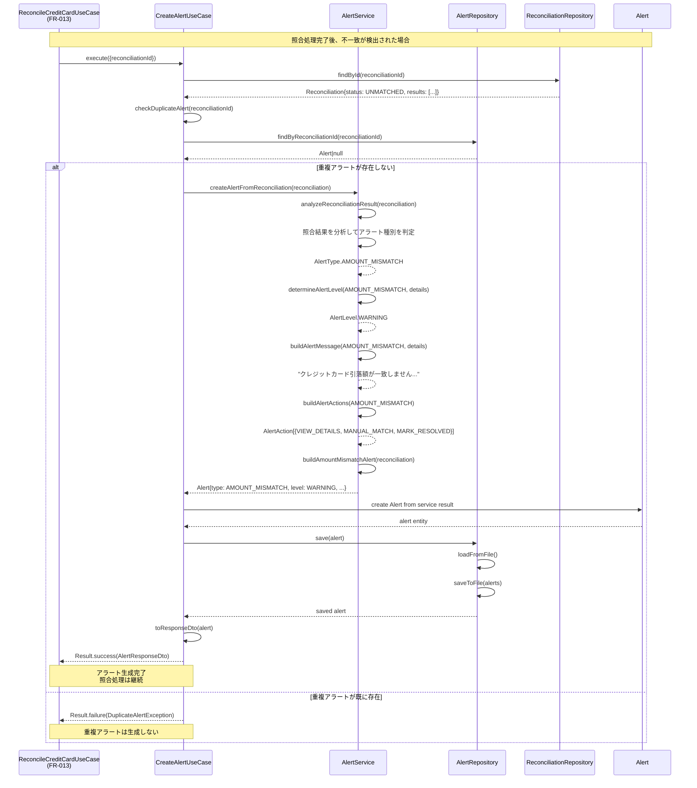
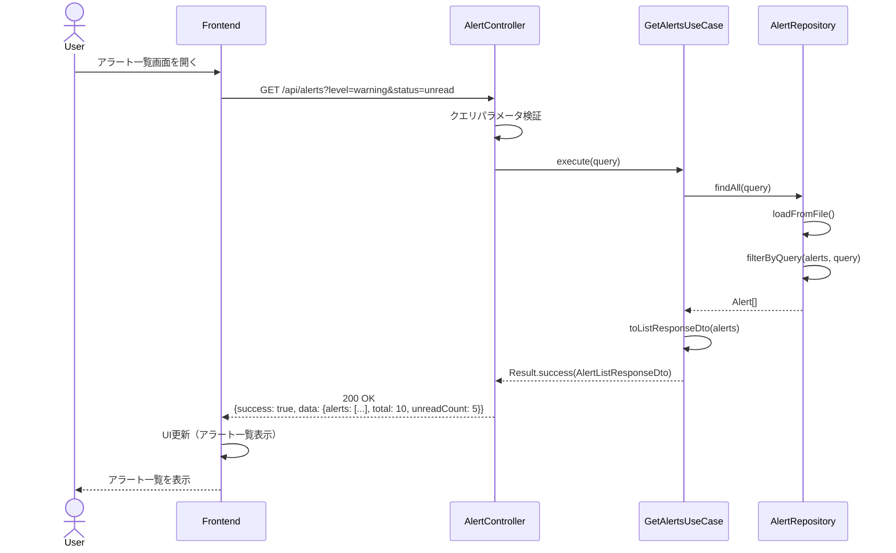
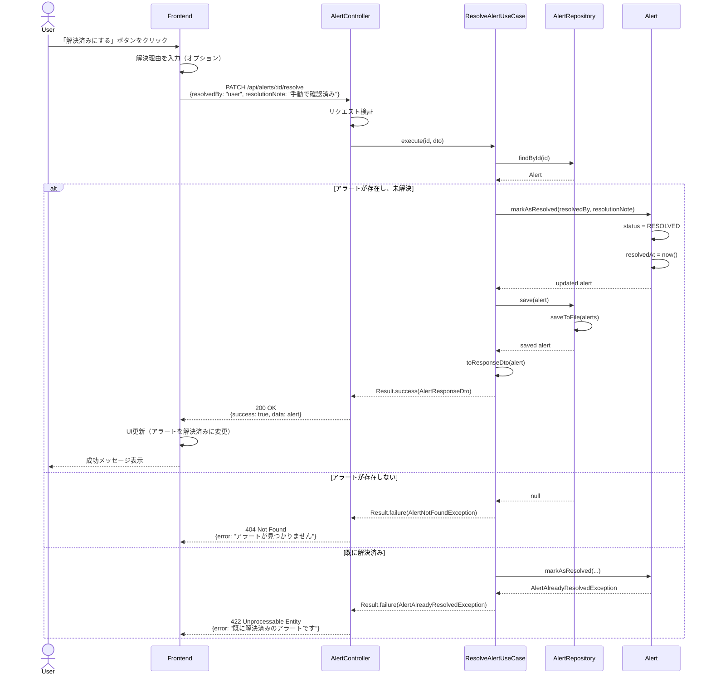
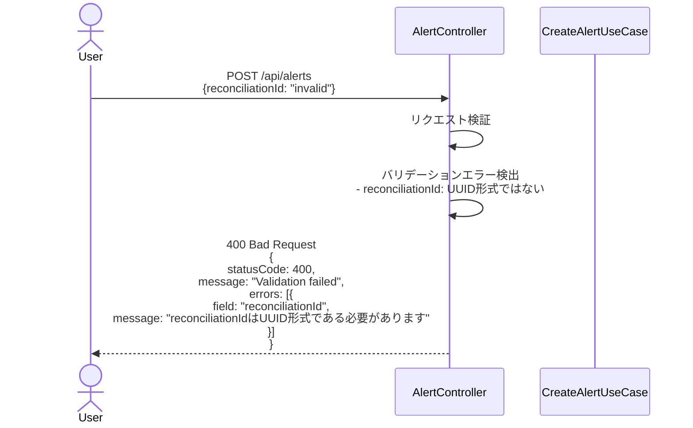
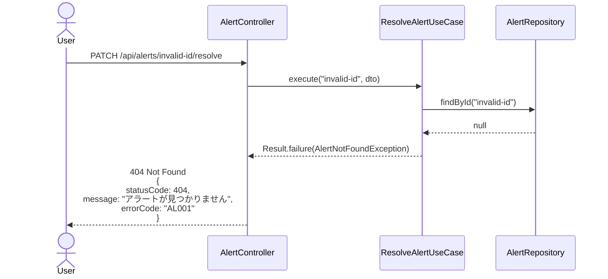
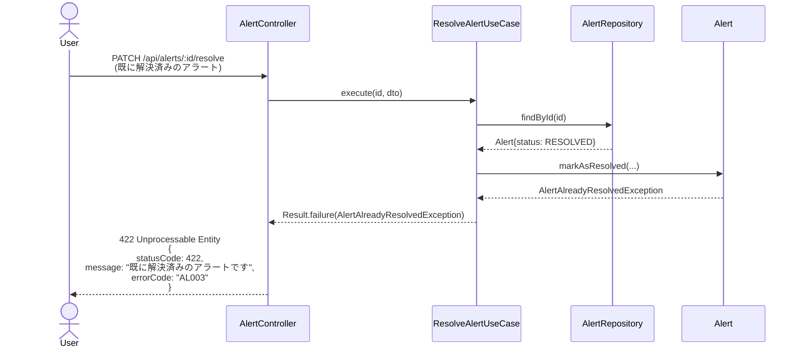
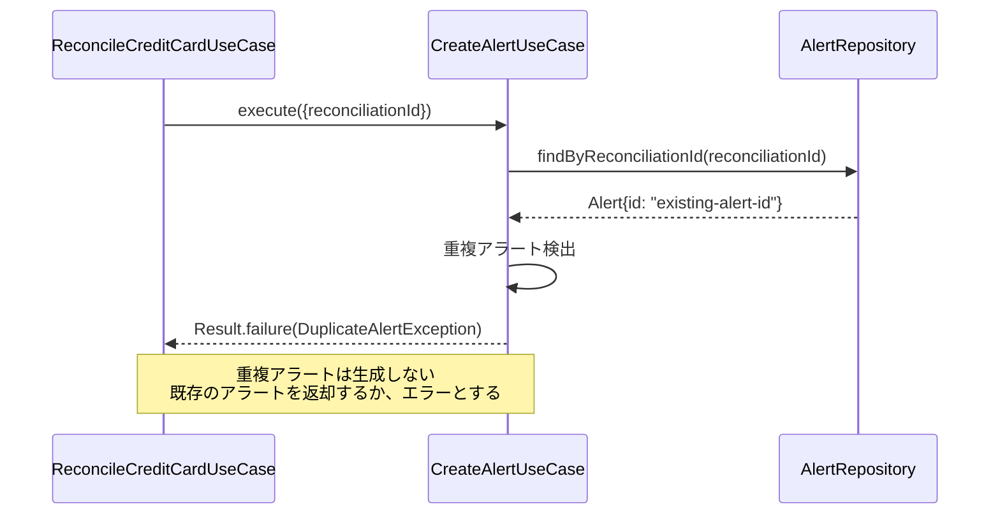
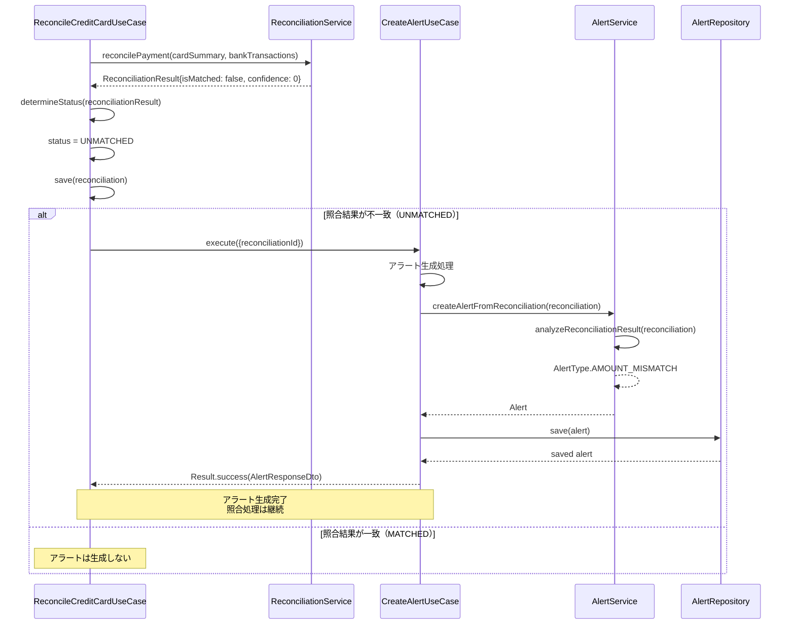

# シーケンス図

このドキュメントでは、不一致時のアラート表示機能の処理フローをシーケンス図で記載しています。

## 目次

1. [アラート生成のフロー](#アラート生成のフロー)
2. [アラート一覧取得のフロー](#アラート一覧取得のフロー)
3. [アラート解決のフロー](#アラート解決のフロー)
4. [エラーハンドリングフロー](#エラーハンドリングフロー)

---

## アラート生成のフロー

### 概要

**ユースケース**: 照合処理完了時に不一致が検出された場合、アラートを生成する

**アクター**: 照合処理（FR-013）

**前提条件**:

- 照合処理が完了している
- 照合結果のステータスが`UNMATCHED`または`PARTIAL`

**成功時の結果**:

- アラートが生成される
- アラートがJSON形式で永続化される
- 重複アラートは生成されない

### 正常系フロー（金額不一致アラート）

### ステップ詳細

1. **トリガー**
   - 照合処理（FR-013）完了後、照合結果のステータスが`UNMATCHED`の場合
   - 照合処理から`CreateAlertUseCase`を呼び出し（`reconciliationId`のみを渡す）

2. **照合結果取得**
   - 照合結果IDから照合データを取得
   - 照合結果の詳細（不一致情報等）を取得

3. **重複チェック**
   - 同じ照合結果に対するアラートが既に存在しないか確認
   - 既に存在する場合は新規生成しない

4. **アラート種別判定**
   - `AlertService.analyzeReconciliationResult()`で照合結果を分析
   - 照合結果のステータス、不一致詳細、経過日数等からアラート種別を自動判定

5. **アラート生成**
   - `AlertService`でアラートタイプに応じたアラートを生成
   - アラートレベル、メッセージ、アクションを設定

6. **永続化**
   - アラートをJSON形式で保存
   - 既存データがある場合は上書き

7. **レスポンス**
   - ResponseDTO: `AlertResponseDto`
   - 照合処理に成功結果を返却

---

## アラート一覧取得のフロー

### 概要

**ユースケース**: アラート一覧を取得する

**アクター**: フロントエンド

**前提条件**:

- アラートデータが既に作成されている

### 正常系フロー

### ステップ詳細

1. **リクエスト受信**
   - エンドポイント: `GET /api/alerts`
   - クエリパラメータ: `level`, `status`, `cardId`, `billingMonth`等

2. **アラート取得**
   - クエリパラメータに基づいてアラートをフィルタリング
   - 未読件数も同時に計算

3. **レスポンス**
   - ResponseDTO: `AlertListResponseDto`
   - HTTPステータス: 200 OK

---

## アラート解決のフロー

### 概要

**ユースケース**: アラートを解決済みにする

**アクター**: フロントエンド

**前提条件**:

- アラートが存在する
- アラートが未解決である

### 正常系フロー

### ステップ詳細

1. **リクエスト受信**
   - エンドポイント: `PATCH /api/alerts/:id/resolve`
   - RequestDTO: `ResolveAlertRequestDto`

2. **アラート取得**
   - アラートIDからアラートを取得

3. **解決処理**
   - アラートを解決済みに更新（`markAsResolved()`）
   - 解決情報（解決者、解決理由）を記録

4. **永続化**
   - 更新されたアラートを保存

5. **レスポンス**
   - ResponseDTO: `AlertResponseDto`
   - HTTPステータス: 200 OK

---

## エラーハンドリングフロー

### バリデーションエラー (400 Bad Request)

### リソース未検出エラー (404 Not Found)

### ビジネスロジックエラー (422 Unprocessable Entity)

### 重複アラートエラー (422 Unprocessable Entity)

---

## アラート生成タイミングの詳細

### 照合処理からの自動生成

---

## チェックリスト

シーケンス図作成時の確認事項：

### 必須項目

- [x] 主要なユースケースのフローが記載されている
- [x] 正常系フローが記載されている
- [x] エラーハンドリングフローが記載されている
- [x] アクター、参加者が明確に定義されている

### 推奨項目

- [x] 前提条件が記載されている
- [x] 成功時の結果が記載されている
- [x] ステップ詳細が記載されている
- [x] 条件分岐（alt）が適切に記載されている
