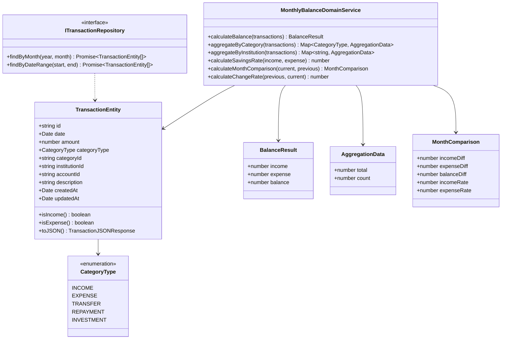
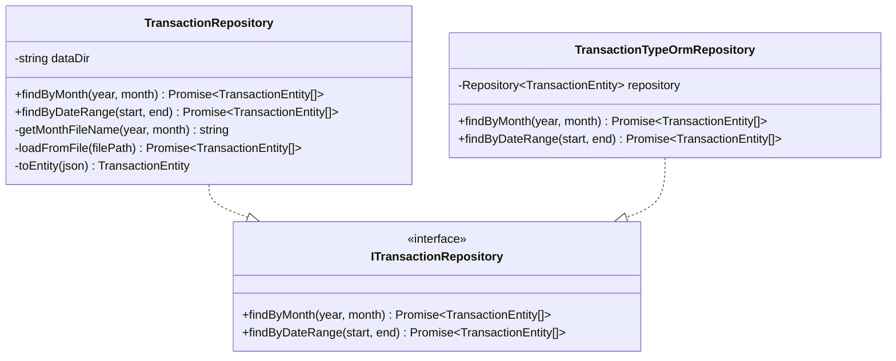
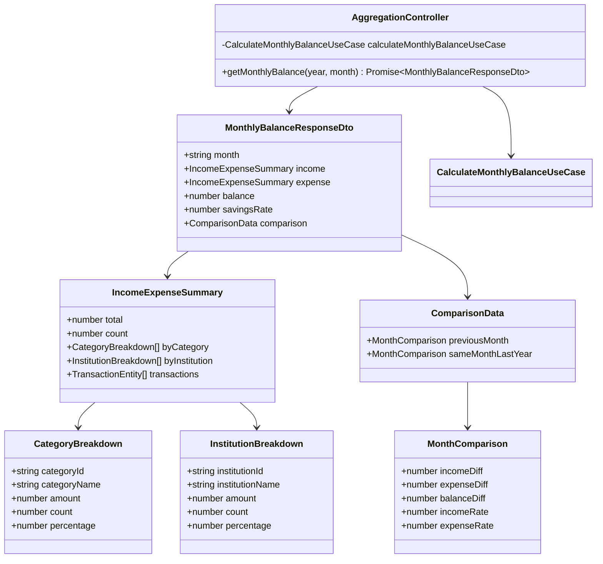

# クラス図

このドキュメントでは、月別収支集計機能のクラス構造を記載しています。

## 目次

1. [Domain層クラス図](#domain層クラス図)
2. [Application層クラス図](#application層クラス図)
3. [Infrastructure層クラス図](#infrastructure層クラス図)
4. [Presentation層クラス図](#presentation層クラス図)

---

## Domain層クラス図

### Aggregation Module (FR-016)



**クラス説明**:

#### TransactionEntity（既存）

- **責務**: 取引データのエンティティ
- **主要メソッド**:
  - `isIncome()`: 収入取引かどうかを判定
  - `isExpense()`: 支出取引かどうかを判定
  - `toJSON()`: JSON形式への変換

#### MonthlyBalanceDomainService（新規作成）

- **責務**: 月別収支集計のドメインロジック
- **主要メソッド**:
  - `calculateBalance(transactions)`: 収入・支出・収支差額を計算
  - `aggregateByCategory(transactions)`: カテゴリ別に集計
  - `aggregateByInstitution(transactions)`: 金融機関別に集計
  - `calculateSavingsRate(income, expense)`: 貯蓄率を計算
  - `calculateMonthComparison(current, previous)`: 前月比を計算
  - `calculateChangeRate(previous, current)`: 増減率を計算

#### BalanceResult（Value Object）

- **責務**: 収支計算結果を表現
- **不変性**: 値オブジェクトは不変（immutable）

#### AggregationData（Value Object）

- **責務**: 集計データ（合計額・件数）を表現
- **不変性**: 値オブジェクトは不変（immutable）

#### MonthComparison（Value Object）

- **責務**: 月次比較データを表現
- **不変性**: 値オブジェクトは不変（immutable）

---

## Application層クラス図

### Use Cases

```mermaid
classDiagram
    class CalculateMonthlyBalanceUseCase {
        -ITransactionRepository transactionRepository
        -MonthlyBalanceDomainService domainService
        +execute(year, month) Promise~MonthlyBalanceResponseDto~
        -getPreviousMonth(year, month) {year, month}
        -getSameMonthLastYear(year, month) {year, month}
        -buildCategoryBreakdown(aggregation, transactions) CategoryBreakdown[]
        -buildInstitutionBreakdown(aggregation, transactions) InstitutionBreakdown[]
    }

    class MonthlyBalanceDomainService {
        +calculateBalance(transactions) BalanceResult
        +aggregateByCategory(transactions) Map~CategoryType, AggregationData~
        +aggregateByInstitution(transactions) Map~string, AggregationData~
        +calculateSavingsRate(income, expense) number
        +calculateMonthComparison(current, previous) MonthComparison
    }

    class MonthlyBalanceResponseDto {
        +string month
        +IncomeExpenseSummary income
        +IncomeExpenseSummary expense
        +number balance
        +number savingsRate
        +ComparisonData comparison
    }

    class IncomeExpenseSummary {
        +number total
        +number count
        +CategoryBreakdown[] byCategory
        +InstitutionBreakdown[] byInstitution
        +TransactionEntity[] transactions
    }

    class CategoryBreakdown {
        +string categoryId
        +string categoryName
        +number amount
        +number count
        +number percentage
    }

    class InstitutionBreakdown {
        +string institutionId
        +string institutionName
        +number amount
        +number count
        +number percentage
    }

    class ComparisonData {
        +MonthComparison previousMonth
        +MonthComparison sameMonthLastYear
    }

    class MonthComparison {
        +number incomeDiff
        +number expenseDiff
        +number balanceDiff
        +number incomeRate
        +number expenseRate
    }

    CalculateMonthlyBalanceUseCase --> ITransactionRepository
    CalculateMonthlyBalanceUseCase --> MonthlyBalanceDomainService
    CalculateMonthlyBalanceUseCase --> MonthlyBalanceResponseDto
    MonthlyBalanceResponseDto --> IncomeExpenseSummary
    MonthlyBalanceResponseDto --> ComparisonData
    IncomeExpenseSummary --> CategoryBreakdown
    IncomeExpenseSummary --> InstitutionBreakdown
    ComparisonData --> MonthComparison
```

**クラス説明**:

#### CalculateMonthlyBalanceUseCase（新規作成）

- **責務**: 月別収支集計のユースケース実装
- **依存**: `ITransactionRepository`, `MonthlyBalanceDomainService`
- **入力**: `year: number`, `month: number`
- **出力**: `MonthlyBalanceResponseDto`
- **主要メソッド**:
  - `execute(year, month)`: 月別収支集計を実行
  - `getPreviousMonth(year, month)`: 前月の年月を取得
  - `getSameMonthLastYear(year, month)`: 前年同月の年月を取得
  - `buildCategoryBreakdown(aggregation, transactions)`: カテゴリ別内訳を構築
  - `buildInstitutionBreakdown(aggregation, transactions)`: 金融機関別内訳を構築

#### MonthlyBalanceResponseDto（新規作成）

- **責務**: 月別収支集計のレスポンスDTO
- **型**: `interface`（レスポンスはinterface）

#### IncomeExpenseSummary（新規作成）

- **責務**: 収入または支出のサマリー情報
- **型**: `interface`

#### CategoryBreakdown（新規作成）

- **責務**: カテゴリ別の内訳情報
- **型**: `interface`

#### InstitutionBreakdown（新規作成）

- **責務**: 金融機関別の内訳情報
- **型**: `interface`

#### ComparisonData（新規作成）

- **責務**: 比較データ（前月比・前年同月比）
- **型**: `interface`

---

## Infrastructure層クラス図

### Repository Implementations



**クラス説明**:

#### TransactionRepository（既存）

- **責務**: JSONファイルベースの取引リポジトリ実装
- **主要メソッド**:
  - `findByMonth(year, month)`: 月で取引を取得
  - `findByDateRange(start, end)`: 期間で取引を取得

#### TransactionTypeOrmRepository（既存）

- **責務**: TypeORMベースの取引リポジトリ実装
- **主要メソッド**:
  - `findByMonth(year, month)`: 月で取引を取得
  - `findByDateRange(start, end)`: 期間で取引を取得

---

## Presentation層クラス図

### Controllers and DTOs



**クラス説明**:

#### AggregationController（新規作成）

- **責務**: 集計機能のREST APIエンドポイント
- **主要メソッド**:
  - `getMonthlyBalance(year, month)`: 月別収支集計情報を取得

#### MonthlyBalanceResponseDto（新規作成）

- **責務**: 月別収支集計のレスポンスDTO
- **型**: `interface`（レスポンスはinterface）

---

## チェックリスト

クラス図作成時の確認事項：

### 必須項目

- [x] Domain層のクラス図が記載されている
- [x] Application層のクラス図が記載されている
- [x] Infrastructure層のクラス図が記載されている
- [x] Presentation層のクラス図が記載されている
- [x] 各クラスの責務が説明されている
- [x] 主要メソッドが記載されている
- [x] 依存関係が明確に示されている

### 推奨項目

- [x] Value Objectが明示されている
- [x] Repository Interfaceが明示されている
- [x] DTOの型（class/interface）が明確

### 注意事項

- [x] Domain層のエンティティは、Presentation層のDTO型に依存していない
- [x] 依存関係の方向が正しい（外→内）
- [x] レスポンスDTOは`interface`で定義されている
