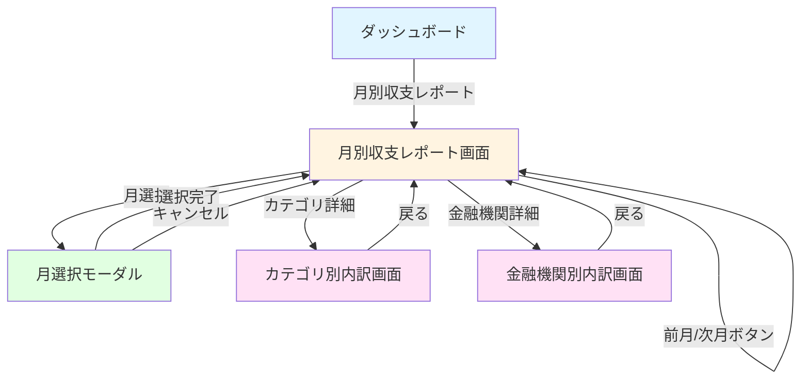

# 画面遷移図

このドキュメントでは、月別収支集計機能の画面遷移を記載しています。

## 目次

1. [画面遷移全体図](#画面遷移全体図)
2. [各画面の詳細](#各画面の詳細)
3. [画面仕様](#画面仕様)

---

## 画面遷移全体図

### メイン遷移フロー

### 画面の種類

- **月別収支レポート画面**: 月別の収支サマリー、グラフ、内訳を表示
- **月選択モーダル**: 表示する月を選択
- **カテゴリ別内訳画面**: カテゴリ別の詳細な内訳を表示
- **金融機関別内訳画面**: 金融機関別の詳細な内訳を表示

---

## 各画面の詳細

### 1. 月別収支レポート画面

#### 画面ID

`monthly-balance-report`

#### URL

`/aggregation/monthly-balance?year=2025&month=1`

#### 概要

指定した月の収入・支出を集計し、詳細な分析情報を表示する画面

#### 表示内容

##### ヘッダー

- 月選択ボタン（「2025年1月」など）
- 前月/次月ボタン（← →）
- 現在の月がハイライト表示

##### サマリーカード

- **収入**: 大きな数字で表示（緑色）
- **支出**: 大きな数字で表示（赤色）
- **収支**: 大きな数字で表示（プラスは緑、マイナスは赤）
- **貯蓄率**: パーセンテージ表示

##### 前月比・前年同月比

- 前月比: 増減額と増減率（↑↓矢印で視覚化）
- 前年同月比: 増減額と増減率（↑↓矢印で視覚化）

##### グラフ

- **月間サマリーバーグラフ**: 収入・支出・収支を横棒グラフで表示
- **カテゴリ別円グラフ**: 支出カテゴリの構成比を円グラフで表示
- **日別推移グラフ**: 月内の日別収入・支出推移を折れ線グラフで表示

##### 内訳セクション

- **カテゴリ別内訳**: 収入・支出それぞれのカテゴリ別内訳
  - カテゴリ名、金額、件数、割合を表示
  - 「詳細を見る」ボタンでカテゴリ別内訳画面に遷移
- **金融機関別内訳**: 収入・支出それぞれの金融機関別内訳
  - 金融機関名、金額、件数、割合を表示
  - 「詳細を見る」ボタンで金融機関別内訳画面に遷移

##### 取引明細

- 取引一覧テーブル（オプション、折りたたみ可能）
  - 日付、金額、カテゴリ、金融機関、説明を表示

#### 遷移先

- `month-selector`: 月選択ボタンクリック時
- `category-breakdown`: カテゴリ別内訳の「詳細を見る」ボタンクリック時
- `institution-breakdown`: 金融機関別内訳の「詳細を見る」ボタンクリック時

#### API連携

- `GET /api/aggregation/monthly-balance?year={year}&month={month}`: 月別収支集計情報取得

#### 操作フロー

1. **画面表示時**
   - デフォルトで当月を表示
   - APIを呼び出してデータを取得
   - ローディング表示

2. **前月/次月ボタンクリック**
   - 前月または次月のデータを取得
   - URLパラメータを更新
   - 画面を再描画

3. **月選択ボタンクリック**
   - 月選択モーダルを表示
   - カレンダー形式で月を選択可能

4. **カテゴリ/金融機関詳細ボタンクリック**
   - 該当する内訳画面に遷移

---

### 2. 月選択モーダル

#### 画面ID

`month-selector`

#### URL

（モーダルとして表示、URL変更なし）

#### 概要

表示する月を選択するモーダル

#### 表示内容

- カレンダー形式の月選択UI
- 年選択ドロップダウン
- 月選択グリッド（1月〜12月）
- 「選択」ボタン
- 「キャンセル」ボタン

#### 遷移先

- `monthly-balance-report`: 選択完了またはキャンセル時

#### 操作フロー

1. **月選択**
   - 年を選択
   - 月を選択
   - 「選択」ボタンをクリック
   - モーダルを閉じて、選択した月のデータを表示

2. **キャンセル**
   - 「キャンセル」ボタンをクリック
   - モーダルを閉じる（データは変更しない）

---

### 3. カテゴリ別内訳画面

#### 画面ID

`category-breakdown`

#### URL

`/aggregation/monthly-balance/category?year=2025&month=1&type=expense`

#### 概要

カテゴリ別の詳細な内訳を表示する画面

#### 表示内容

- ヘッダー: 月情報、戻るボタン
- カテゴリタイプ選択（収入/支出）
- カテゴリ別内訳テーブル
  - カテゴリ名、金額、件数、割合
  - ソート機能（金額順、件数順など）
- 円グラフ（カテゴリ別構成比）
- 取引明細（該当カテゴリの取引一覧）

#### 遷移先

- `monthly-balance-report`: 戻るボタンクリック時

#### API連携

- `GET /api/aggregation/monthly-balance?year={year}&month={month}`: 月別収支集計情報取得（既存APIを再利用）

---

### 4. 金融機関別内訳画面

#### 画面ID

`institution-breakdown`

#### URL

`/aggregation/monthly-balance/institution?year=2025&month=1&type=expense`

#### 概要

金融機関別の詳細な内訳を表示する画面

#### 表示内容

- ヘッダー: 月情報、戻るボタン
- カテゴリタイプ選択（収入/支出）
- 金融機関別内訳テーブル
  - 金融機関名、金額、件数、割合
  - ソート機能（金額順、件数順など）
- 棒グラフ（金融機関別比較）
- 取引明細（該当金融機関の取引一覧）

#### 遷移先

- `monthly-balance-report`: 戻るボタンクリック時

#### API連携

- `GET /api/aggregation/monthly-balance?year={year}&month={month}`: 月別収支集計情報取得（既存APIを再利用）

---

## 画面仕様

### UI/UX要件

#### 色分け

- **収入**: 緑色（#10b981）
- **支出**: 赤色（#ef4444）
- **収支（プラス）**: 緑色
- **収支（マイナス）**: 赤色

#### 数値表示

- 大きな数字で収支を強調表示
- 3桁区切りで表示（例: 300,000円）
- パーセンテージは小数点第2位まで表示（例: 33.33%）

#### 前月比表示

- 増加: ↑ 緑色
- 減少: ↓ 赤色
- 変化なし: → グレー

#### グラフ

- **月間サマリーバーグラフ**: 横棒グラフ
- **カテゴリ別円グラフ**: 円グラフ（支出のみ）
- **日別推移グラフ**: 折れ線グラフ（収入・支出の2本の線）

#### レスポンシブ対応

- モバイル: 1カラム表示
- タブレット: 2カラム表示
- デスクトップ: 3カラム表示

### エラーハンドリング

#### データ取得エラー

- エラーメッセージを表示
- リトライボタンを表示
- エラー詳細は開発者向けにログ出力

#### データが存在しない場合

- 「データがありません」メッセージを表示
- 空のグラフを表示（0円表示）
- 前月比・前年同月比は「-」表示

### パフォーマンス要件

- **データ取得**: 1秒以内
- **グラフ描画**: 500ms以内
- **画面遷移**: 300ms以内

### アクセシビリティ

- キーボード操作対応
- スクリーンリーダー対応
- コントラスト比の確保（WCAG 2.1 AA準拠）

---

## チェックリスト

画面遷移図作成時の確認事項：

### 必須項目

- [x] 画面遷移全体図が記載されている
- [x] 各画面の詳細が記載されている
- [x] URLが明確に定義されている
- [x] API連携が明確に定義されている

### 推奨項目

- [x] UI/UX要件が記載されている
- [x] エラーハンドリングが記載されている
- [x] パフォーマンス要件が記載されている

### 注意事項

- [x] 画面遷移の流れが明確
- [x] 各画面の責務が明確
- [x] ユーザー操作フローが明確
