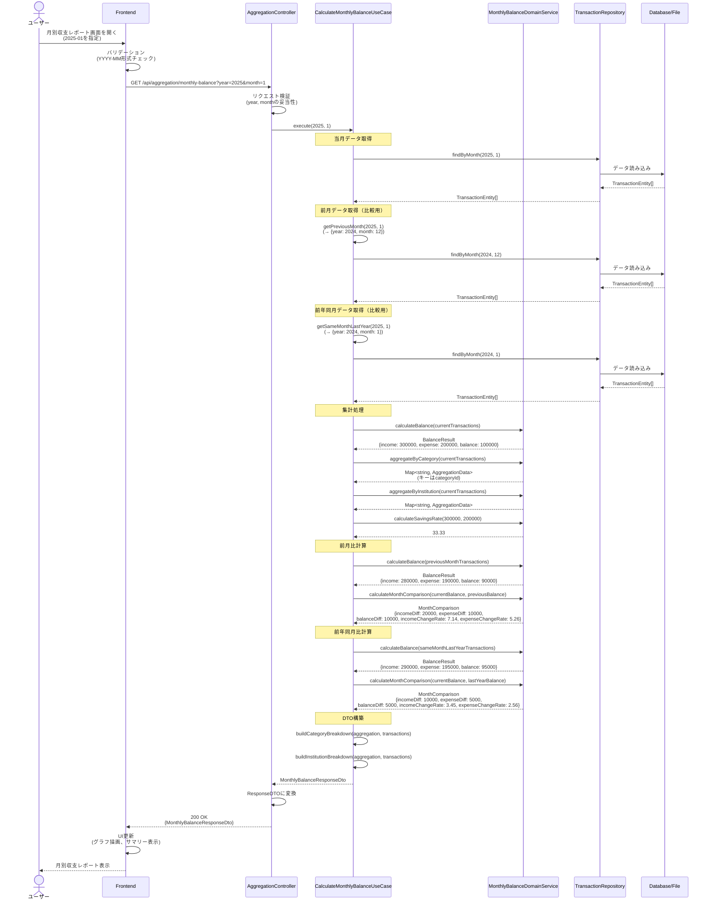
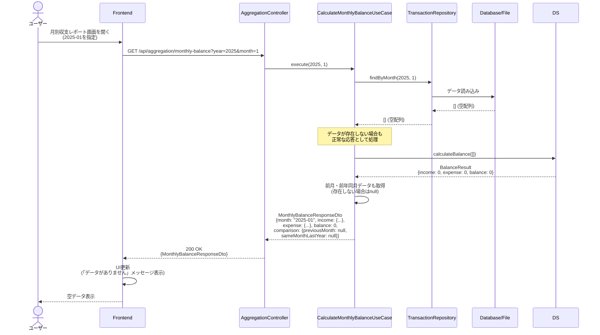
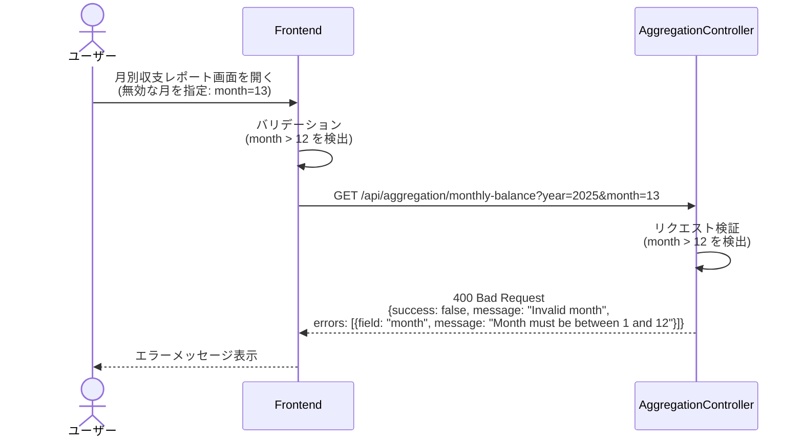
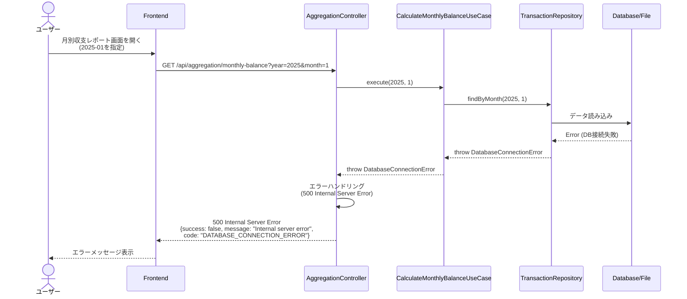

# シーケンス図

このドキュメントでは、月別収支集計機能の処理フローをシーケンス図で記載しています。

## 目次

1. [月別収支集計取得のフロー](#月別収支集計取得のフロー)
2. [エラーハンドリングフロー](#エラーハンドリングフロー)

---

## 月別収支集計取得のフロー

### 概要

**ユースケース**: 指定した月の収入・支出を集計し、詳細な分析情報を取得する

**アクター**: ユーザー（フロントエンド経由）

**前提条件**:

- 取引データが存在する（データが存在しない場合は空データを返す）

**成功時の結果**:

- 月別収支集計情報が取得される
- カテゴリ別・金融機関別の内訳が取得される
- 前月比・前年同月比の比較情報が取得される
- 貯蓄率が計算される

### 正常系フロー



### ステップ詳細

1. **ユーザーアクション**
   - ユーザーが月別収支レポート画面を開く
   - デフォルトで当月を表示、または月を選択

2. **Frontend バリデーション**
   - 月の形式チェック（YYYY-MM形式）
   - 無効な月指定のチェック（13月など）

3. **API リクエスト**
   - エンドポイント: `GET /api/aggregation/monthly-balance?year=2025&month=1`
   - クエリパラメータ: `year` (number), `month` (number)

4. **UseCase 実行**
   - 当月の取引データを取得
   - 前月の取引データを取得（比較用）
   - 前年同月の取引データを取得（比較用）
   - 各月のデータを集計
   - 前月比・前年同月比を計算
   - 貯蓄率を計算
   - カテゴリ別・金融機関別の内訳を構築

5. **Domain Service 実行**
   - `calculateBalance()`: 収入・支出・収支差額を計算
   - `aggregateByCategory()`: カテゴリID別に集計（キーは`categoryId`）
   - `aggregateByInstitution()`: 金融機関別に集計
   - `calculateSavingsRate()`: 貯蓄率を計算（incomeが0の場合は0を返す）
   - `calculateMonthComparison()`: 前月比・前年同月比を計算

6. **レスポンス**
   - ResponseDTO: `MonthlyBalanceResponseDto`
   - HTTPステータス: 200 OK

### データが存在しない場合のフロー



**重要**: データが存在しない場合でも、500エラーではなく200 OKで空データを返す。これは正常なシナリオの一つとして扱う。

---

## エラーハンドリングフロー

### バリデーションエラー（400 Bad Request）



### サーバーエラー（500 Internal Server Error）



### エラーレスポンス形式

すべてのエラーレスポンスは以下の共通形式に従う：

```typescript
interface ErrorResponse {
  success: false;
  statusCode: number;
  message: string;
  code?: string;
  errors?: Array<{
    field: string;
    message: string;
  }>;
  timestamp: string;
  path: string;
}
```

### エラー分類

| HTTPステータス | エラーコード                | 説明                   | 例                       |
| -------------- | --------------------------- | ---------------------- | ------------------------ |
| 400            | `VALIDATION_ERROR`          | バリデーションエラー   | 無効な月指定（13月など） |
| 500            | `DATABASE_CONNECTION_ERROR` | データベース接続エラー | DB接続失敗               |
| 500            | `INTERNAL_SERVER_ERROR`     | 予期しないエラー       | その他の内部エラー       |

---

## チェックリスト

シーケンス図作成時の確認事項：

### 必須項目

- [x] 正常系フローが記載されている
- [x] 異常系フローが記載されている
- [x] 各ステップの説明が記載されている
- [x] エラーハンドリングが明確に示されている
- [x] データが存在しない場合の処理が明確

### 推奨項目

- [x] 前提条件が記載されている
- [x] 成功時の結果が記載されている
- [x] エラーレスポンス形式が明確

### 注意事項

- [x] 空配列（[]）は正常な応答として扱う（500エラーにしない）
- [x] エラーレスポンスは共通形式に準拠している
- [x] HTTPステータスコードが適切に使い分けられている
