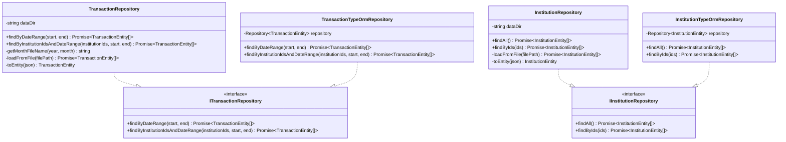

# クラス図

このドキュメントでは、金融機関別集計機能のクラス構造を記載しています。

## 目次

1. [Domain層クラス図](#domain層クラス図)
2. [Application層クラス図](#application層クラス図)
3. [Infrastructure層クラス図](#infrastructure層クラス図)
4. [Presentation層クラス図](#presentation層クラス図)

---

## Domain層クラス図

### Aggregation Module (FR-017)

**クラス説明**:

#### TransactionEntity（既存）

- **責務**: 取引データのエンティティ
- **主要メソッド**:
  - `isIncome()`: 収入取引かどうかを判定
  - `isExpense()`: 支出取引かどうかを判定

#### InstitutionEntity（既存）

- **責務**: 金融機関情報のエンティティ
- **主要プロパティ**:
  - `accounts`: 配下の口座一覧

#### AccountEntity（既存）

- **責務**: 口座情報のエンティティ
- **主要プロパティ**:
  - `balance`: 現在の残高

#### InstitutionAggregationDomainService（新規作成）

- **責務**: 金融機関別集計のドメインロジック
- **主要メソッド**:
  - `aggregateByInstitution(transactions, institutions)`: 金融機関別に集計（キーは`institutionId`）
  - `aggregateByAccount(transactions, accounts)`: 口座別に集計（キーは`accountId`）
  - `calculateInstitutionBalance(income, expense)`: 収支差額を計算（income - expense）
  - `filterByInstitutionIds(transactions, institutionIds)`: 指定された金融機関IDの取引のみをフィルタリング

#### InstitutionAggregationData（Value Object）

- **責務**: 金融機関別の集計データを表現
- **不変性**: 値オブジェクトは不変（immutable）

#### AccountAggregationData（Value Object）

- **責務**: 口座別の集計データを表現
- **不変性**: 値オブジェクトは不変（immutable）

---

## Application層クラス図

### Use Cases

**クラス説明**:

#### CalculateInstitutionSummaryUseCase（新規作成）

- **責務**: 金融機関別集計のユースケース実装
- **依存**: `ITransactionRepository`, `IInstitutionRepository`, `InstitutionAggregationDomainService`
- **入力**: `startDate: Date`, `endDate: Date`, `institutionIds?: string[]`（未指定の場合は全機関）
- **出力**: `InstitutionSummaryResponseDto`
- **主要メソッド**:
  - `execute(startDate, endDate, institutionIds?)`: 金融機関別集計を実行
  - `buildInstitutionSummary(institution, aggregationData, accounts)`: 金融機関別サマリーを構築
  - `buildAccountSummary(account, aggregationData)`: 口座別サマリーを構築
  - `toTransactionDto(entity: TransactionEntity)`: `TransactionEntity`を`TransactionDto`に変換（Onion Architecture原則）

#### InstitutionSummaryResponseDto（新規作成）

- **責務**: 金融機関別集計のレスポンスDTO
- **型**: `interface`（レスポンスはinterface）

#### InstitutionSummaryDto（新規作成）

- **責務**: 金融機関別のサマリー情報
- **型**: `interface`
- **注意**: `TransactionEntity`ではなく`TransactionDto`を使用（Onion Architecture原則）

#### AccountSummaryDto（新規作成）

- **責務**: 口座別のサマリー情報
- **型**: `interface`

#### Period（新規作成）

- **責務**: 集計期間を表現
- **型**: `interface`

#### TransactionDto（新規作成）

- **責務**: 取引データのDTO（プレゼンテーション層用）
- **型**: `interface`
- **注意**: Domain層の`TransactionEntity`から変換して使用

---

## Infrastructure層クラス図

### Repository Implementations

**クラス説明**:

#### TransactionRepository（既存・拡張）

- **責務**: JSONファイルベースの取引リポジトリ実装
- **主要メソッド**:
  - `findByDateRange(start, end)`: 期間で取引を取得
  - `findByInstitutionIdsAndDateRange(institutionIds, start, end)`: 指定された金融機関IDと期間で取引を取得（新規追加）

#### TransactionTypeOrmRepository（既存・拡張）

- **責務**: TypeORMベースの取引リポジトリ実装
- **主要メソッド**:
  - `findByDateRange(start, end)`: 期間で取引を取得
  - `findByInstitutionIdsAndDateRange(institutionIds, start, end)`: 指定された金融機関IDと期間で取引を取得（新規追加）

#### InstitutionRepository（既存）

- **責務**: JSONファイルベースの金融機関リポジトリ実装
- **主要メソッド**:
  - `findAll()`: 全金融機関を取得
  - `findByIds(ids)`: 指定されたIDの金融機関を取得

#### InstitutionTypeOrmRepository（既存）

- **責務**: TypeORMベースの金融機関リポジトリ実装
- **主要メソッド**:
  - `findAll()`: 全金融機関を取得
  - `findByIds(ids)`: 指定されたIDの金融機関を取得

---

## Presentation層クラス図

### Controllers and DTOs

**クラス説明**:

#### AggregationController（既存・拡張）

- **責務**: 集計機能のREST APIエンドポイント
- **主要メソッド**:
  - `getInstitutionSummary(query)`: 金融機関別集計情報を取得

#### GetInstitutionSummaryDto（新規作成）

- **責務**: 金融機関別集計のリクエストDTO
- **型**: `class`（リクエストはclass）
- **バリデーション**: 開始日・終了日の妥当性チェック

#### InstitutionSummaryResponseDto（新規作成）

- **責務**: 金融機関別集計のレスポンスDTO
- **型**: `interface`（レスポンスはinterface）

---

## チェックリスト

クラス図作成時の確認事項：

### 必須項目

- [x] Domain層のクラス図が記載されている
- [x] Application層のクラス図が記載されている
- [x] Infrastructure層のクラス図が記載されている
- [x] Presentation層のクラス図が記載されている
- [x] 各クラスの責務が説明されている
- [x] 主要メソッドが記載されている
- [x] 依存関係が明確に示されている

### 推奨項目

- [x] Value Objectが明示されている
- [x] Repository Interfaceが明示されている
- [x] DTOの型（class/interface）が明確

### 注意事項

- [x] Domain層のエンティティは、Presentation層のDTO型に依存していない
- [x] 依存関係の方向が正しい（外→内）
- [x] レスポンスDTOは`interface`で定義されている
- [x] リクエストDTOは`class`で定義されている
