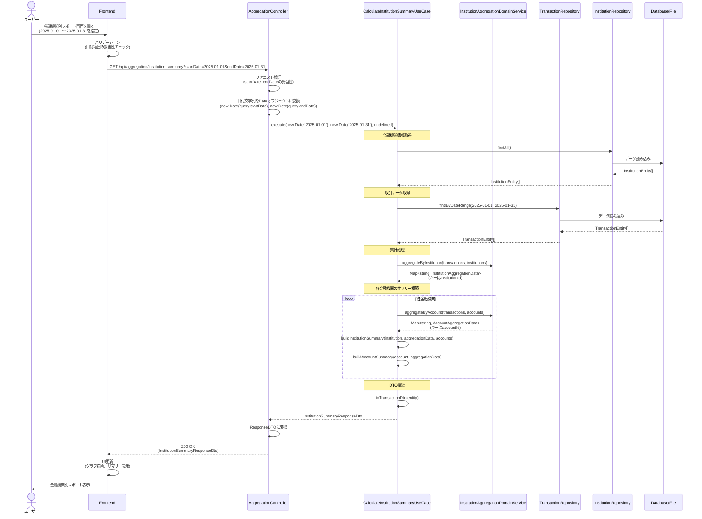
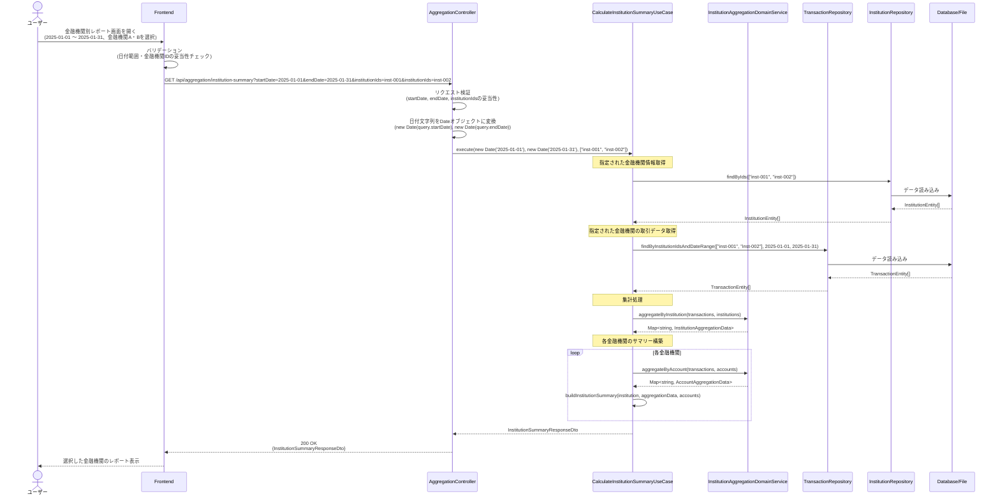
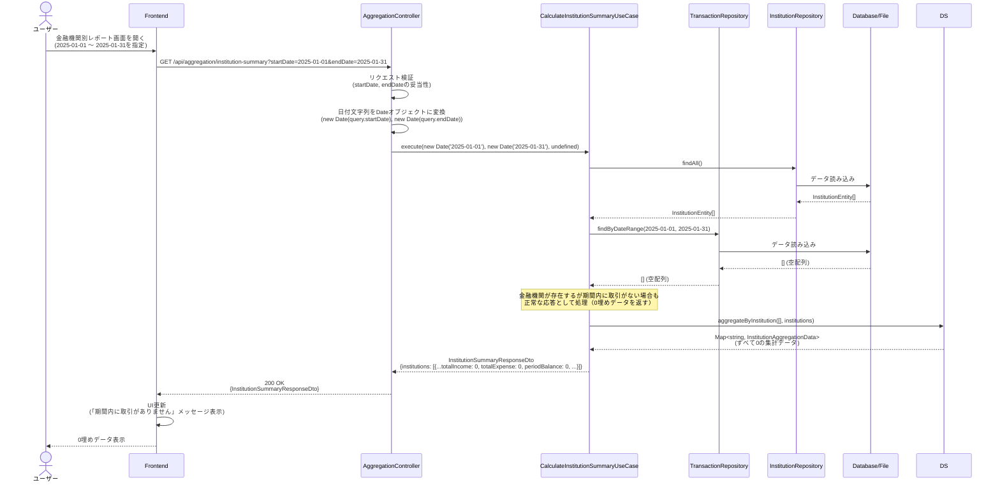
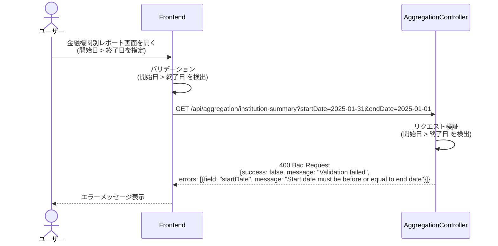
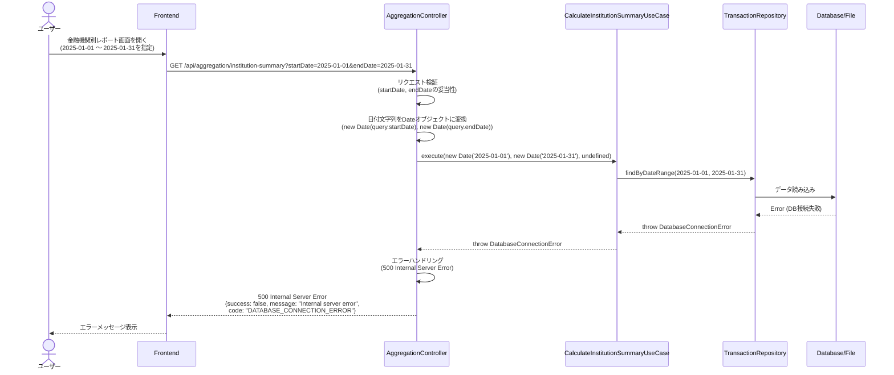

# シーケンス図

このドキュメントでは、金融機関別集計機能の処理フローをシーケンス図で記載しています。

## 目次

1. [金融機関別集計取得のフロー](#金融機関別集計取得のフロー)
2. [エラーハンドリングフロー](#エラーハンドリングフロー)

---

## 金融機関別集計取得のフロー

### 概要

**ユースケース**: 指定した期間の取引を金融機関ごとに集計し、機関別の収支状況を取得する

**アクター**: ユーザー（フロントエンド経由）

**前提条件**:

- 取引データが存在する（データが存在しない場合は空データを返す）
- 金融機関情報が存在する

**成功時の結果**:

- 金融機関別集計情報が取得される
- 口座別の内訳が取得される
- 残高情報が取得される

### 正常系フロー（全金融機関を対象）



### 正常系フロー（特定金融機関を選択）



### ステップ詳細

1. **ユーザーアクション**
   - ユーザーが金融機関別レポート画面を開く
   - 集計期間を選択（開始日〜終了日）
   - 金融機関を選択（複数選択可、未選択の場合は全機関）

2. **Frontend バリデーション**
   - 日付範囲の形式チェック（ISO8601形式）
   - 開始日 <= 終了日のチェック
   - 金融機関IDの妥当性チェック（存在チェックはサーバー側で実施）

3. **API リクエスト**
   - エンドポイント: `GET /api/aggregation/institution-summary`
   - クエリパラメータ: `startDate` (Date), `endDate` (Date), `institutionIds` (string[], オプション)

4. **UseCase 実行**
   - 金融機関情報を取得（全機関または指定された機関）
   - 期間内の取引データを取得（全機関または指定された機関）
   - 金融機関ごとにグループ化
   - 各機関の収入・支出を集計
   - 口座別の集計
   - 残高情報を取得
   - DTOを構築

5. **Domain Service 実行**
   - `aggregateByInstitution()`: 金融機関別に集計
   - `aggregateByAccount()`: 口座別に集計
   - `calculateInstitutionBalance()`: 収支差額を計算

6. **レスポンス**
   - ResponseDTO: `InstitutionSummaryResponseDto`
   - HTTPステータス: 200 OK

### データが存在しない場合のフロー



**重要**:

- 金融機関が存在するが期間内に取引がない場合：0埋めのデータを返す（フロントエンドは「処理されたがデータがなかった」と判断できる）
- 金融機関自体が存在しない場合：空配列を返す
- どちらの場合でも、500エラーではなく200 OKで返す。これは正常なシナリオの一つとして扱う。

---

## エラーハンドリングフロー

### バリデーションエラー（400 Bad Request）



### サーバーエラー（500 Internal Server Error）



### エラーレスポンス形式

すべてのエラーレスポンスは以下の共通形式に従う：

```typescript
interface ErrorResponse {
  success: false;
  statusCode: number;
  message: string;
  code?: string;
  errors?: Array<{
    field: string;
    message: string;
  }>;
  timestamp: string;
  path: string;
}
```

### エラー分類

| HTTPステータス | エラーコード                | 説明                   | 例                 |
| -------------- | --------------------------- | ---------------------- | ------------------ |
| 400            | `VALIDATION_ERROR`          | バリデーションエラー   | 開始日 > 終了日    |
| 500            | `DATABASE_CONNECTION_ERROR` | データベース接続エラー | DB接続失敗         |
| 500            | `INTERNAL_SERVER_ERROR`     | 予期しないエラー       | その他の内部エラー |

---

## チェックリスト

シーケンス図作成時の確認事項：

### 必須項目

- [x] 正常系フローが記載されている
- [x] 異常系フローが記載されている
- [x] 各ステップの説明が記載されている
- [x] エラーハンドリングが明確に示されている
- [x] データが存在しない場合の処理が明確

### 推奨項目

- [x] 前提条件が記載されている
- [x] 成功時の結果が記載されている
- [x] エラーレスポンス形式が明確

### 注意事項

- [x] 空配列（[]）は正常な応答として扱う（500エラーにしない）
- [x] エラーレスポンスは共通形式に準拠している
- [x] HTTPステータスコードが適切に使い分けられている
- [x] 金融機関選択の有無による処理の違いが明確
