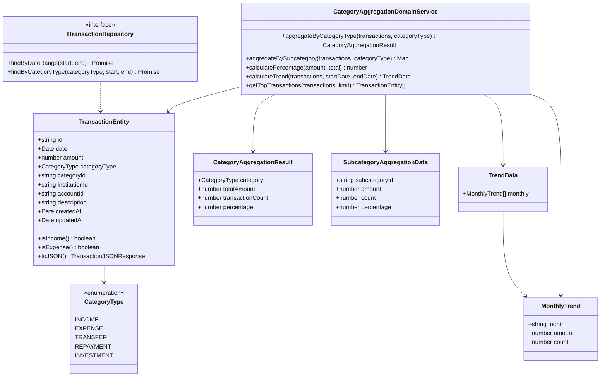
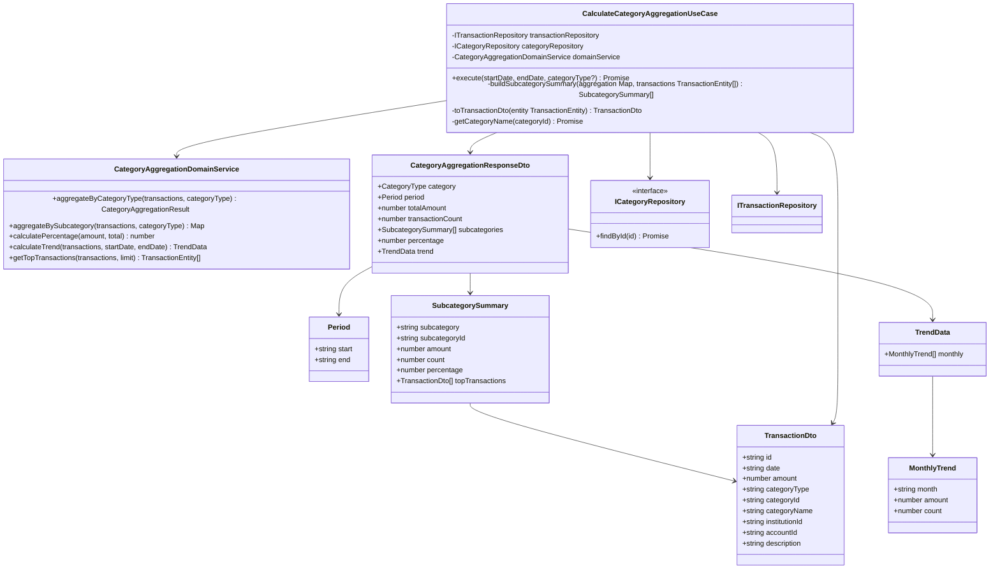
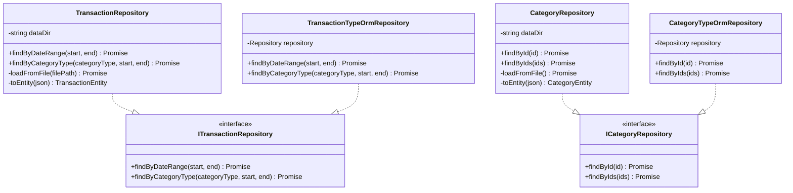
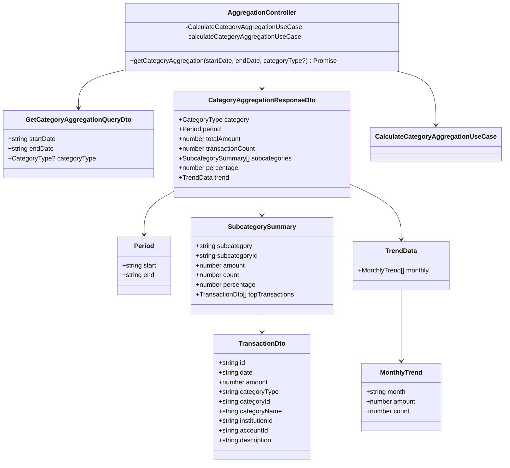

# クラス図

このドキュメントでは、カテゴリ別集計機能のクラス構造を記載しています。

## 目次

1. [Domain層クラス図](#domain層クラス図)
2. [Application層クラス図](#application層クラス図)
3. [Infrastructure層クラス図](#infrastructure層クラス図)
4. [Presentation層クラス図](#presentation層クラス図)

---

## Domain層クラス図

### Aggregation Module (FR-018)

**クラス説明**:

#### TransactionEntity（既存）

- **責務**: 取引データのエンティティ
- **主要メソッド**:
  - `isIncome()`: 収入取引かどうかを判定
  - `isExpense()`: 支出取引かどうかを判定
  - `toJSON()`: JSON形式への変換（戻り値型: `TransactionJSONResponse` - 既存の型定義を使用）

#### CategoryAggregationDomainService（新規作成）

- **責務**: カテゴリ別集計のドメインロジック
- **主要メソッド**:
  - `aggregateByCategoryType(transactions, categoryType)`: 指定したカテゴリタイプで集計
  - `aggregateBySubcategory(transactions, categoryType)`: サブカテゴリ（費目）別に集計（キーは`categoryId`）
  - `calculatePercentage(amount, total)`: 構成比を計算（totalが0の場合は0を返す）
  - `calculateTrend(transactions, startDate, endDate)`: 期間内の月次推移を計算
  - `getTopTransactions(transactions, limit)`: 金額の大きい取引を取得（最大5件）

#### CategoryAggregationResult（Value Object）

- **責務**: カテゴリ別集計結果を表現
- **不変性**: 値オブジェクトは不変（immutable）

#### SubcategoryAggregationData（Value Object）

- **責務**: サブカテゴリ別集計データを表現
- **不変性**: 値オブジェクトは不変（immutable）

#### TrendData（Value Object）

- **責務**: 推移データを表現
- **不変性**: 値オブジェクトは不変（immutable）

#### MonthlyTrend（Value Object）

- **責務**: 月次推移データを表現
- **不変性**: 値オブジェクトは不変（immutable）

---

## Application層クラス図

### Use Cases

**クラス説明**:

#### CalculateCategoryAggregationUseCase（新規作成）

- **責務**: カテゴリ別集計のユースケース実装
- **依存**: `ITransactionRepository`, `ICategoryRepository`, `CategoryAggregationDomainService`
- **入力**: `startDate: Date`, `endDate: Date`, `categoryType?: CategoryType`（オプション）
- **出力**: `CategoryAggregationResponseDto[]`（カテゴリタイプごとの配列）
- **主要メソッド**:
  - `execute(startDate, endDate, categoryType?)`: カテゴリ別集計を実行（categoryTypeが指定されていない場合は全カテゴリを集計）
  - `buildSubcategorySummary(aggregation: Map<string, SubcategoryAggregationData>, transactions: TransactionEntity[])`: サブカテゴリ別内訳を構築
  - `toTransactionDto(entity: TransactionEntity)`: `TransactionEntity`を`TransactionDto`に変換（Onion Architecture原則）
  - `getCategoryName(categoryId: string)`: カテゴリIDからカテゴリ名を取得

#### CategoryAggregationResponseDto（新規作成）

- **責務**: カテゴリ別集計のレスポンスDTO
- **型**: `interface`（レスポンスはinterface）

#### SubcategorySummary（新規作成）

- **責務**: サブカテゴリ（費目）別の内訳情報
- **型**: `interface`
- **注意**: `TransactionEntity`ではなく`TransactionDto`を使用（Onion Architecture原則）

#### TransactionDto（新規作成）

- **責務**: 取引データのDTO（プレゼンテーション層用）
- **型**: `interface`
- **注意**: Domain層の`TransactionEntity`から変換して使用

#### Period（新規作成）

- **責務**: 集計期間を表現
- **型**: `interface`

#### TrendData（新規作成）

- **責務**: 推移データ
- **型**: `interface`

#### MonthlyTrend（新規作成）

- **責務**: 月次推移データ
- **型**: `interface`

---

## Infrastructure層クラス図

### Repository Implementations

**クラス説明**:

#### TransactionRepository（既存）

- **責務**: JSONファイルベースの取引リポジトリ実装
- **主要メソッド**:
  - `findByDateRange(start, end)`: 期間で取引を取得
  - `findByCategoryType(categoryType, start, end)`: カテゴリタイプと期間で取引を取得

#### TransactionTypeOrmRepository（既存）

- **責務**: TypeORMベースの取引リポジトリ実装
- **主要メソッド**:
  - `findByDateRange(start, end)`: 期間で取引を取得
  - `findByCategoryType(categoryType, start, end)`: カテゴリタイプと期間で取引を取得

#### CategoryRepository（既存）

- **責務**: JSONファイルベースのカテゴリリポジトリ実装
- **主要メソッド**:
  - `findById(id)`: IDでカテゴリを取得
  - `findByIds(ids)`: IDの配列でカテゴリを一括取得（N+1問題対策）

#### CategoryTypeOrmRepository（既存）

- **責務**: TypeORMベースのカテゴリリポジトリ実装
- **主要メソッド**:
  - `findById(id)`: IDでカテゴリを取得
  - `findByIds(ids)`: IDの配列でカテゴリを一括取得（N+1問題対策）

---

## Presentation層クラス図

### Controllers and DTOs

**クラス説明**:

#### AggregationController（既存を拡張）

- **責務**: 集計機能のREST APIエンドポイント
- **主要メソッド**:
  - `getCategoryAggregation(startDate, endDate, categoryType?)`: カテゴリ別集計情報を取得

#### GetCategoryAggregationQueryDto（新規作成）

- **責務**: カテゴリ別集計のクエリパラメータDTO
- **型**: `class`（リクエストはclass）
- **バリデーション**:
  - `startDate`: 必須、ISO8601形式
  - `endDate`: 必須、ISO8601形式、startDateより後であること
  - `categoryType`: オプション、有効なCategoryType

#### CategoryAggregationResponseDto（新規作成）

- **責務**: カテゴリ別集計のレスポンスDTO
- **型**: `interface`（レスポンスはinterface）

---

## チェックリスト

クラス図作成時の確認事項：

### 必須項目

- [x] Domain層のクラス図が記載されている
- [x] Application層のクラス図が記載されている
- [x] Infrastructure層のクラス図が記載されている
- [x] Presentation層のクラス図が記載されている
- [x] 各クラスの責務が説明されている
- [x] 主要メソッドが記載されている
- [x] 依存関係が明確に示されている

### 推奨項目

- [x] Value Objectが明示されている
- [x] Repository Interfaceが明示されている
- [x] DTOの型（class/interface）が明確

### 注意事項

- [x] Domain層のエンティティは、Presentation層のDTO型に依存していない
- [x] 依存関係の方向が正しい（外→内）
- [x] レスポンスDTOは`interface`で定義されている
- [x] リクエストDTOは`class`で定義されている
