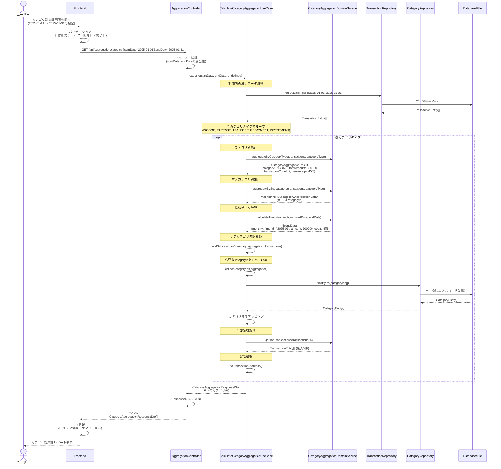
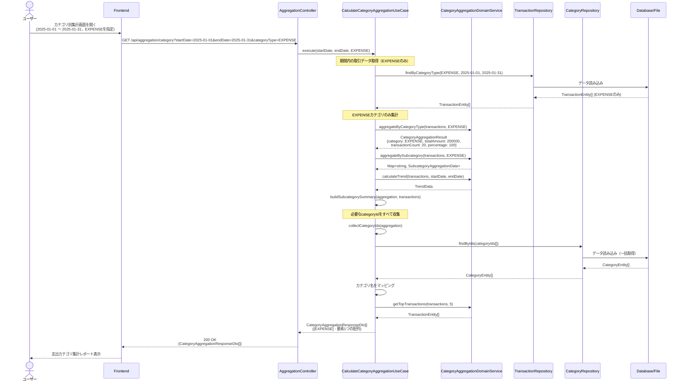
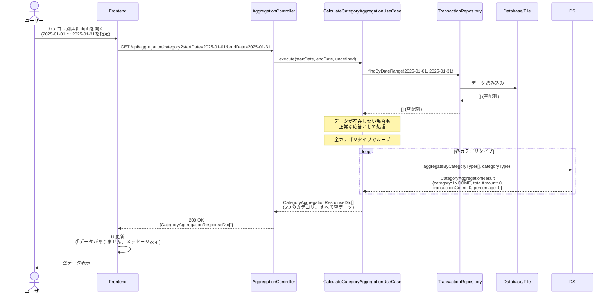
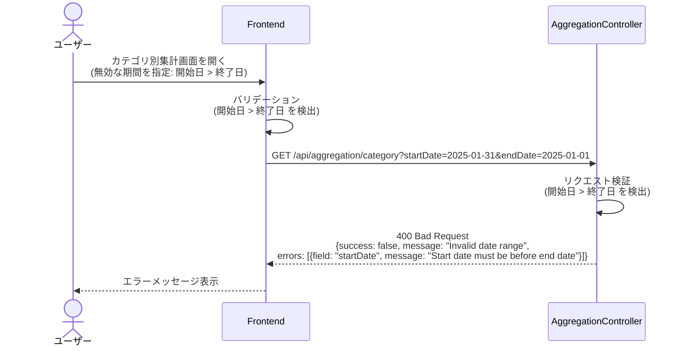
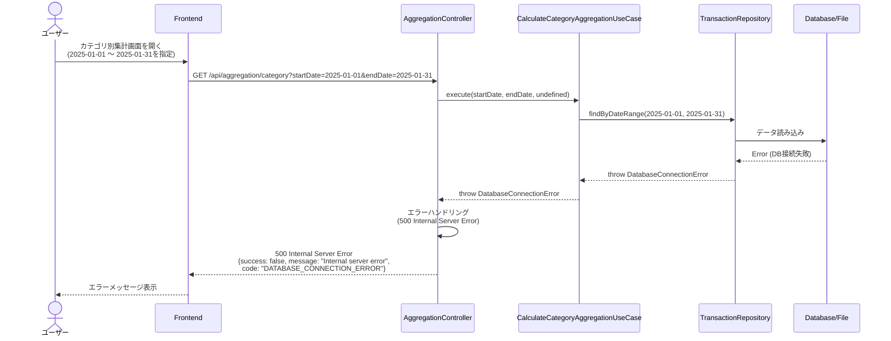

# シーケンス図

このドキュメントでは、カテゴリ別集計機能の処理フローをシーケンス図で記載しています。

## 目次

1. [カテゴリ別集計取得のフロー](#カテゴリ別集計取得のフロー)
2. [エラーハンドリングフロー](#エラーハンドリングフロー)

---

## カテゴリ別集計取得のフロー

### 概要

**ユースケース**: 指定した期間の5つの主要カテゴリ（収入・支出・振替・返済・投資）ごとに取引を集計し、詳細な分析情報を取得する

**アクター**: ユーザー（フロントエンド経由）

**前提条件**:

- 取引データが存在する（データが存在しない場合は空データを返す）

**成功時の結果**:

- カテゴリ別集計情報が取得される（5つのカテゴリごと）
- サブカテゴリ（費目）別の内訳が取得される
- 構成比が計算される
- 推移データ（月次推移）が計算される
- 主要取引（金額の大きい取引）が取得される

### 正常系フロー（全カテゴリ集計）



### 正常系フロー（特定カテゴリのみ集計）



### ステップ詳細

1. **ユーザーアクション**
   - ユーザーがカテゴリ別集計画面を開く
   - 期間を指定（開始日・終了日）
   - カテゴリタイプを指定（オプション、指定しない場合は全カテゴリ）

2. **Frontend バリデーション**
   - 日付の形式チェック（ISO8601形式）
   - 開始日が終了日より前であることのチェック
   - カテゴリタイプの妥当性チェック（有効なCategoryType）

3. **API リクエスト**
   - エンドポイント: `GET /api/aggregation/category?startDate=2025-01-01&endDate=2025-01-31&categoryType=EXPENSE`
   - クエリパラメータ: `startDate` (string), `endDate` (string), `categoryType?` (CategoryType, オプション)

4. **UseCase 実行**
   - 期間内の取引データを取得（categoryTypeが指定されている場合は該当カテゴリのみ）
   - 各カテゴリタイプで集計（categoryTypeが指定されていない場合）
   - サブカテゴリ別内訳を計算
   - 推移データを計算
   - 主要取引を取得
   - カテゴリ名を取得（CategoryRepositoryを使用）

5. **Domain Service 実行**
   - `aggregateByCategoryType()`: 指定したカテゴリタイプで集計
   - `aggregateBySubcategory()`: サブカテゴリ（費目）別に集計（キーは`categoryId`）
   - `calculatePercentage()`: 構成比を計算（totalが0の場合は0を返す）
   - `calculateTrend()`: 期間内の月次推移を計算
   - `getTopTransactions()`: 金額の大きい取引を取得（最大5件）

6. **レスポンス**
   - ResponseDTO: `CategoryAggregationResponseDto[]`（全カテゴリの場合）または`CategoryAggregationResponseDto`（特定カテゴリの場合）
   - HTTPステータス: 200 OK

### データが存在しない場合のフロー



**重要**: データが存在しない場合でも、500エラーではなく200 OKで空データを返す。これは正常なシナリオの一つとして扱う。

---

## エラーハンドリングフロー

### バリデーションエラー（400 Bad Request）



### サーバーエラー（500 Internal Server Error）



### エラーレスポンス形式

すべてのエラーレスポンスは以下の共通形式に従う：

```typescript
interface ErrorResponse {
  success: false;
  statusCode: number;
  message: string;
  code?: string;
  errors?: Array<{
    field: string;
    message: string;
  }>;
  timestamp: string;
  path: string;
}
```

### エラー分類

| HTTPステータス | エラーコード                | 説明                   | 例                          |
| -------------- | --------------------------- | ---------------------- | --------------------------- |
| 400            | `VALIDATION_ERROR`          | バリデーションエラー   | 開始日 > 終了日、無効な形式 |
| 500            | `DATABASE_CONNECTION_ERROR` | データベース接続エラー | DB接続失敗                  |
| 500            | `INTERNAL_SERVER_ERROR`     | 予期しないエラー       | その他の内部エラー          |

---

## チェックリスト

シーケンス図作成時の確認事項：

### 必須項目

- [x] 正常系フローが記載されている
- [x] 異常系フローが記載されている
- [x] 各ステップの説明が記載されている
- [x] エラーハンドリングが明確に示されている
- [x] データが存在しない場合の処理が明確

### 推奨項目

- [x] 前提条件が記載されている
- [x] 成功時の結果が記載されている
- [x] エラーレスポンス形式が明確

### 注意事項

- [x] 空配列（[]）は正常な応答として扱う（500エラーにしない）
- [x] エラーレスポンスは共通形式に準拠している
- [x] HTTPステータスコードが適切に使い分けられている
- [x] カテゴリタイプが指定されていない場合は全カテゴリを集計する処理が明確
