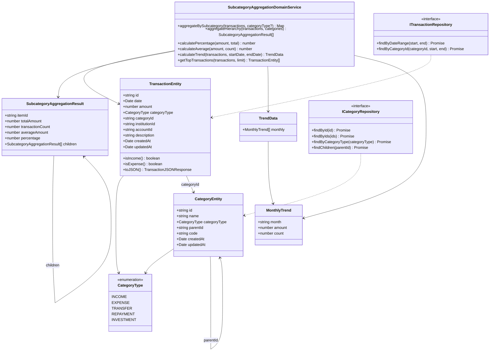
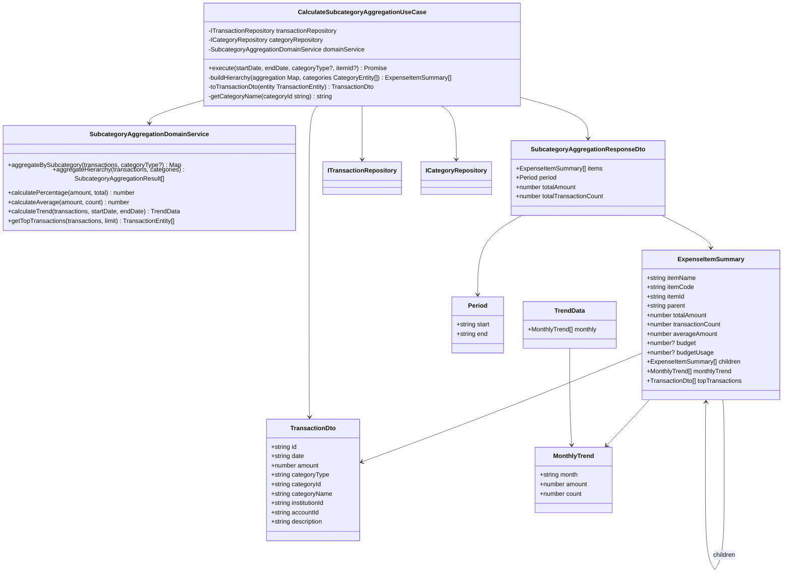
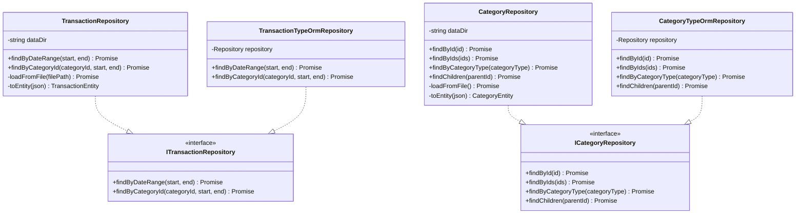
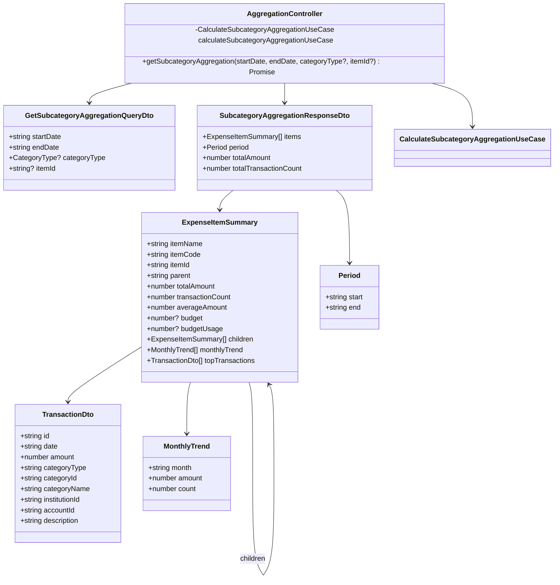

# クラス図

このドキュメントでは、費目別集計機能のクラス構造を記載しています。

## 目次

1. [Domain層クラス図](#domain層クラス図)
2. [Application層クラス図](#application層クラス図)
3. [Infrastructure層クラス図](#infrastructure層クラス図)
4. [Presentation層クラス図](#presentation層クラス図)

---

## Domain層クラス図

### Aggregation Module (FR-019)

**クラス説明**:

#### TransactionEntity（既存）

- **責務**: 取引データのエンティティ
- **主要メソッド**:
  - `isIncome()`: 収入取引かどうかを判定
  - `isExpense()`: 支出取引かどうかを判定
  - `toJSON()`: JSON形式への変換（戻り値型: `TransactionJSONResponse` - 既存の型定義を使用）

#### CategoryEntity（既存）

- **責務**: カテゴリ（費目）データのエンティティ
- **主要プロパティ**:
  - `parentId`: 親カテゴリID（階層構造を表現）
  - `code`: 費目コード

#### SubcategoryAggregationDomainService（新規作成）

- **責務**: 費目別集計のドメインロジック
- **主要メソッド**:
  - `aggregateBySubcategory(transactions, categoryType?)`: 費目別に集計（キーは`categoryId`）
  - `aggregateHierarchy(transactions, categories)`: 階層構造で集計（親子関係を考慮）
  - `calculatePercentage(amount, total)`: 構成比を計算（totalが0の場合は0を返す）
  - `calculateAverage(amount, count)`: 平均金額を計算
  - `calculateTrend(transactions, startDate, endDate)`: 期間内の月次推移を計算
  - `getTopTransactions(transactions, limit)`: 金額の大きい取引を取得（最大5件）

#### SubcategoryAggregationResult（Value Object）

- **責務**: 費目別集計結果を表現（階層構造を含む）
- **不変性**: 値オブジェクトは不変（immutable）
- **階層構造**: `children`プロパティで子費目を表現

#### TrendData（Value Object）

- **責務**: 推移データを表現
- **不変性**: 値オブジェクトは不変（immutable）

#### MonthlyTrend（Value Object）

- **責務**: 月次推移データを表現
- **不変性**: 値オブジェクトは不変（immutable）

---

## Application層クラス図

### Use Cases

**クラス説明**:

#### CalculateSubcategoryAggregationUseCase（新規作成）

- **責務**: 費目別集計のユースケース実装
- **依存**: `ITransactionRepository`, `ICategoryRepository`, `SubcategoryAggregationDomainService`
- **入力**: `startDate: Date`, `endDate: Date`, `categoryType?: CategoryType`（オプション）, `itemId?: string`（オプション）
- **出力**: `SubcategoryAggregationResponseDto[]`（費目ごとの配列、階層構造を含む）
- **主要メソッド**:
  - `execute(startDate, endDate, categoryType?, itemId?)`: 費目別集計を実行（階層構造で返す）
  - `buildHierarchy(aggregation: Map<string, SubcategoryAggregationResult>, categories: CategoryEntity[])`: 階層構造を構築
  - `toTransactionDto(entity: TransactionEntity)`: `TransactionEntity`を`TransactionDto`に変換（Onion Architecture原則）
  - `getCategoryName(categoryId: string)`: カテゴリIDからカテゴリ名を取得

#### SubcategoryAggregationResponseDto（新規作成）

- **責務**: 費目別集計のレスポンスDTO
- **型**: `interface`（レスポンスはinterface）

#### ExpenseItemSummary（新規作成）

- **責務**: 費目別のサマリー情報（階層構造を含む）
- **型**: `interface`
- **階層構造**: `children`プロパティで子費目を表現
- **予算対比**: `budget`と`budgetUsage`プロパティ（将来対応）

#### TransactionDto（新規作成）

- **責務**: 取引データのDTO（プレゼンテーション層用）
- **型**: `interface`
- **注意**: Domain層の`TransactionEntity`から変換して使用

#### Period（新規作成）

- **責務**: 集計期間を表現
- **型**: `interface`

#### TrendData（新規作成）

- **責務**: 推移データ
- **型**: `interface`

#### MonthlyTrend（新規作成）

- **責務**: 月次推移データ
- **型**: `interface`

---

## Infrastructure層クラス図

### Repository Implementations

**クラス説明**:

#### TransactionRepository（既存を拡張）

- **責務**: JSONファイルベースの取引リポジトリ実装
- **主要メソッド**:
  - `findByDateRange(start, end)`: 期間で取引を取得
  - `findByCategoryId(categoryId, start, end)`: 費目IDと期間で取引を取得（新規追加）

#### TransactionTypeOrmRepository（既存を拡張）

- **責務**: TypeORMベースの取引リポジトリ実装
- **主要メソッド**:
  - `findByDateRange(start, end)`: 期間で取引を取得
  - `findByCategoryId(categoryId, start, end)`: 費目IDと期間で取引を取得（新規追加）

#### CategoryRepository（既存を拡張）

- **責務**: JSONファイルベースのカテゴリリポジトリ実装
- **主要メソッド**:
  - `findById(id)`: IDでカテゴリを取得
  - `findByIds(ids)`: IDの配列でカテゴリを一括取得（N+1問題対策）
  - `findByCategoryType(categoryType)`: カテゴリタイプでカテゴリを取得（新規追加）
  - `findChildren(parentId)`: 親カテゴリIDで子カテゴリを取得（階層構造用、新規追加）

#### CategoryTypeOrmRepository（既存を拡張）

- **責務**: TypeORMベースのカテゴリリポジトリ実装
- **主要メソッド**:
  - `findById(id)`: IDでカテゴリを取得
  - `findByIds(ids)`: IDの配列でカテゴリを一括取得（N+1問題対策）
  - `findByCategoryType(categoryType)`: カテゴリタイプでカテゴリを取得（新規追加）
  - `findChildren(parentId)`: 親カテゴリIDで子カテゴリを取得（階層構造用、新規追加）

---

## Presentation層クラス図

### Controllers and DTOs

**クラス説明**:

#### AggregationController（既存を拡張）

- **責務**: 集計機能のREST APIエンドポイント
- **主要メソッド**:
  - `getSubcategoryAggregation(startDate, endDate, categoryType?, itemId?)`: 費目別集計情報を取得

#### GetSubcategoryAggregationQueryDto（新規作成）

- **責務**: 費目別集計のクエリパラメータDTO
- **型**: `class`（リクエストはclass）
- **バリデーション**:
  - `startDate`: 必須、ISO8601形式
  - `endDate`: 必須、ISO8601形式、startDateより後であること
  - `categoryType`: オプション、有効なCategoryType
  - `itemId`: オプション、特定の費目IDを指定（階層構造の特定ノードを取得）

#### SubcategoryAggregationResponseDto（新規作成）

- **責務**: 費目別集計のレスポンスDTO
- **型**: `interface`（レスポンスはinterface）
- **階層構造**: `items`配列内の`ExpenseItemSummary`が`children`プロパティで階層を表現

#### ExpenseItemSummary（新規作成）

- **責務**: 費目別のサマリー情報（階層構造を含む）
- **型**: `interface`
- **階層構造**: `children`プロパティで子費目を表現
- **予算対比**: `budget`と`budgetUsage`プロパティ（将来対応）

---

## チェックリスト

クラス図作成時の確認事項：

### 必須項目

- [x] Domain層のクラス図が記載されている
- [x] Application層のクラス図が記載されている
- [x] Infrastructure層のクラス図が記載されている
- [x] Presentation層のクラス図が記載されている
- [x] 各クラスの責務が説明されている
- [x] 主要メソッドが記載されている
- [x] 依存関係が明確に示されている

### 推奨項目

- [x] Value Objectが明示されている
- [x] Repository Interfaceが明示されている
- [x] DTOの型（class/interface）が明確
- [x] 階層構造が表現されている

### 注意事項

- [x] Domain層のエンティティは、Presentation層のDTO型に依存していない
- [x] 依存関係の方向が正しい（外→内）
- [x] レスポンスDTOは`interface`で定義されている
- [x] リクエストDTOは`class`で定義されている
