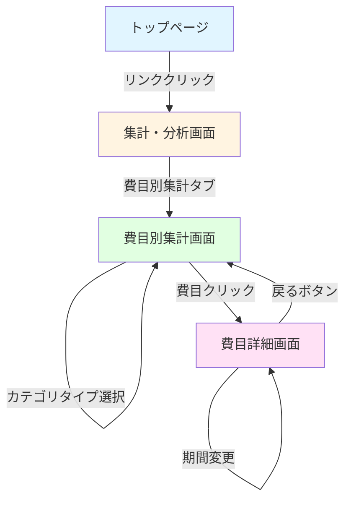

# 画面遷移図

このドキュメントでは、費目別集計機能の画面遷移を記載しています。

**注意**: この画面遷移図は、画面を持つ機能の場合にのみ作成してください。
APIのみの機能の場合は、このファイルは不要です。

## 目次

1. [画面遷移全体図](#画面遷移全体図)
2. [各画面の詳細](#各画面の詳細)
3. [画面仕様](#画面仕様)

---

## 画面遷移全体図

### メイン遷移フロー

### 画面の種類

- **集計・分析画面**: 集計機能のメイン画面（タブ切り替え）
- **費目別集計画面**: 費目別集計の一覧表示、階層表示、グラフ表示
- **費目詳細画面**: 特定費目の詳細情報、推移グラフ、主要取引一覧

---

## 各画面の詳細

### 1. 集計・分析画面

**パス**: `/aggregation`

**説明**: 集計機能のメイン画面。複数の集計機能（月別収支、金融機関別、カテゴリ別、費目別）をタブで切り替える。

**主要要素**:

- タブメニュー（月別収支、金融機関別、カテゴリ別、費目別）
- 各タブの内容表示エリア

**遷移先**:

- 費目別集計タブをクリック → 費目別集計画面

---

### 2. 費目別集計画面

**パス**: `/aggregation/subcategory`

**説明**: 費目別集計の一覧表示。階層構造で費目を表示し、集計結果を可視化する。

**主要要素**:

- 期間選択（開始日・終了日）
- カテゴリタイプ選択（全カテゴリ、収入、支出、振替、返済、投資）
- 費目一覧（階層表示）
  - 親費目と子費目をツリー形式で表示
  - 各費目の合計金額・取引件数・平均金額を表示
  - 予算対比（将来対応）
- グラフ表示
  - 円グラフ（費目別構成比）
  - 棒グラフ（費目別金額比較）
  - 推移グラフ（月次推移）

**操作**:

- 期間を変更 → 集計結果を再取得
- カテゴリタイプを変更 → 集計結果を再取得
- 費目をクリック → 費目詳細画面に遷移

**遷移先**:

- 費目をクリック → 費目詳細画面

---

### 3. 費目詳細画面

**パス**: `/aggregation/subcategory/:itemId`

**説明**: 特定費目の詳細情報を表示。該当費目とその子費目の集計結果、推移グラフ、主要取引一覧を表示する。

**主要要素**:

- 費目情報（費目名、費目コード、親費目）
- 集計サマリー（合計金額・取引件数・平均金額）
- 予算対比（将来対応）
- 階層表示（子費目の一覧）
- 推移グラフ（月次推移）
- 主要取引一覧（金額の大きい取引、最大5件）

**操作**:

- 期間を変更 → 集計結果を再取得
- 戻るボタン → 費目別集計画面に戻る
- 子費目をクリック → 該当子費目の詳細画面に遷移（再帰的）

**遷移先**:

- 戻るボタン → 費目別集計画面
- 子費目をクリック → 該当子費目の詳細画面（再帰的）

---

## 画面仕様

### 費目別集計画面の詳細仕様

#### 期間選択

- **形式**: 日付ピッカー（開始日・終了日）
- **デフォルト**: 当月（1日〜末日）
- **バリデーション**: 開始日 < 終了日

#### カテゴリタイプ選択

- **形式**: ドロップダウンまたはタブ
- **オプション**: 全カテゴリ、収入、支出、振替、返済、投資
- **デフォルト**: 全カテゴリ

#### 費目一覧（階層表示）

- **形式**: ツリービューまたはアコーディオン
- **表示項目**:
  - 費目名
  - 合計金額（右寄せ、カンマ区切り）
  - 取引件数
  - 平均金額
  - 予算消化率（将来対応）
- **階層表示**:
  - 親費目を展開/折りたたみ可能
  - 子費目はインデントで表示
  - 親費目の金額は子費目の合計を含む

#### グラフ表示

- **円グラフ**: 費目別構成比（親費目レベル）
- **棒グラフ**: 費目別金額比較（親費目レベル）
- **推移グラフ**: 月次推移（期間内の各月）

### 費目詳細画面の詳細仕様

#### 費目情報

- **表示項目**:
  - 費目名（見出し）
  - 費目コード
  - 親費目名（リンク、クリックで親費目の詳細画面に遷移）

#### 集計サマリー

- **表示項目**:
  - 合計金額（大きな数字で強調表示）
  - 取引件数
  - 平均金額
  - 予算（将来対応）
  - 予算消化率（将来対応）

#### 階層表示（子費目）

- **形式**: リストまたはカード
- **表示項目**: 費目名、合計金額、取引件数、平均金額
- **操作**: 子費目をクリック → 該当子費目の詳細画面に遷移

#### 推移グラフ

- **形式**: 折れ線グラフまたは棒グラフ
- **表示項目**: 月次推移（期間内の各月の金額・取引件数）

#### 主要取引一覧

- **表示件数**: 最大5件
- **表示項目**: 日付、金額、説明、金融機関名、口座名
- **ソート**: 金額の大きい順

---

## チェックリスト

画面遷移図作成時の確認事項：

### 必須項目

- [x] 画面遷移全体図が記載されている
- [x] 各画面の詳細が記載されている
- [x] 画面仕様が記載されている

### 推奨項目

- [x] 主要な操作フローが明確
- [x] 階層構造の表示方法が明確
- [x] グラフ表示の仕様が明確

### 注意事項

- [x] 階層構造の再帰的な遷移が明確に示されている
- [x] 期間選択やカテゴリタイプ選択による再取得が明確
