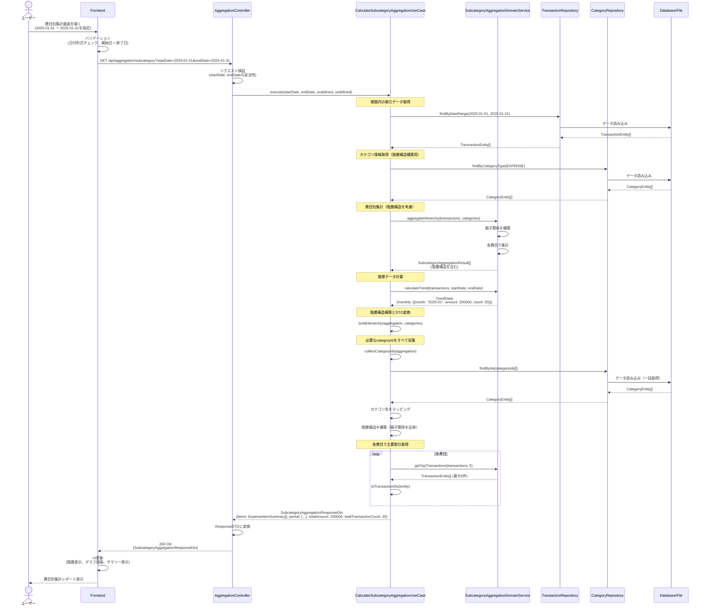
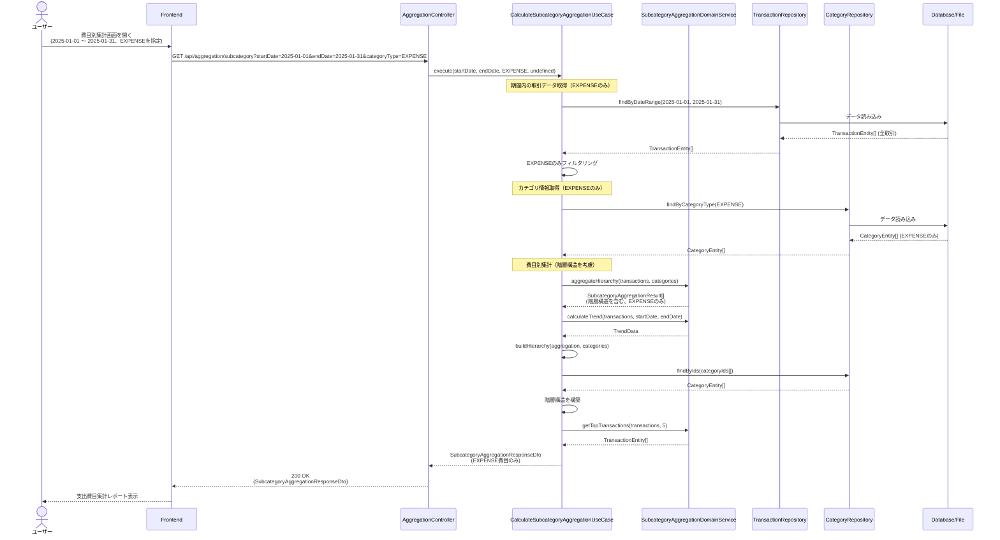
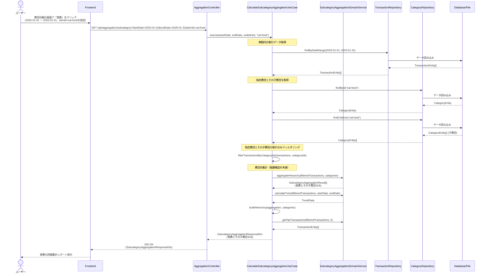
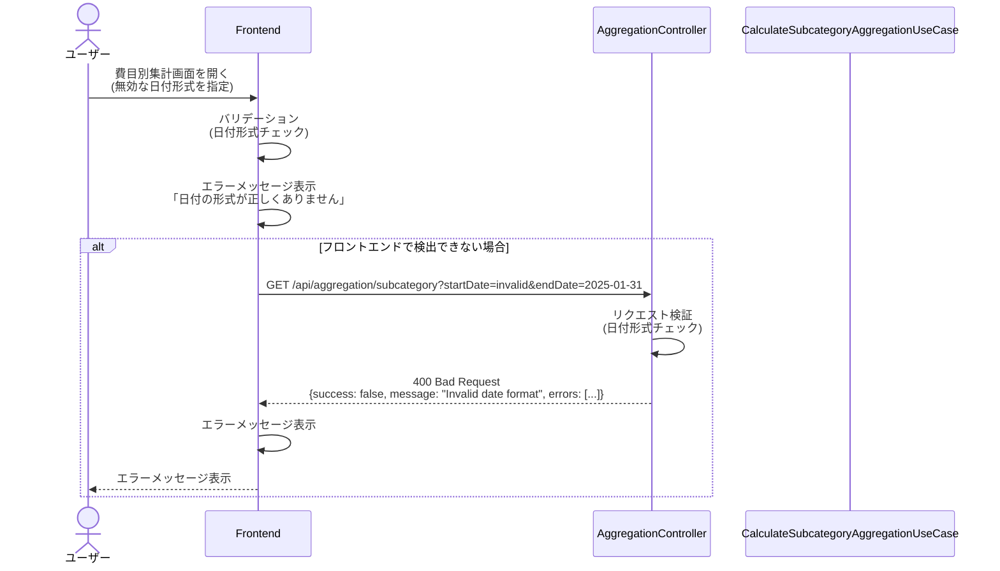
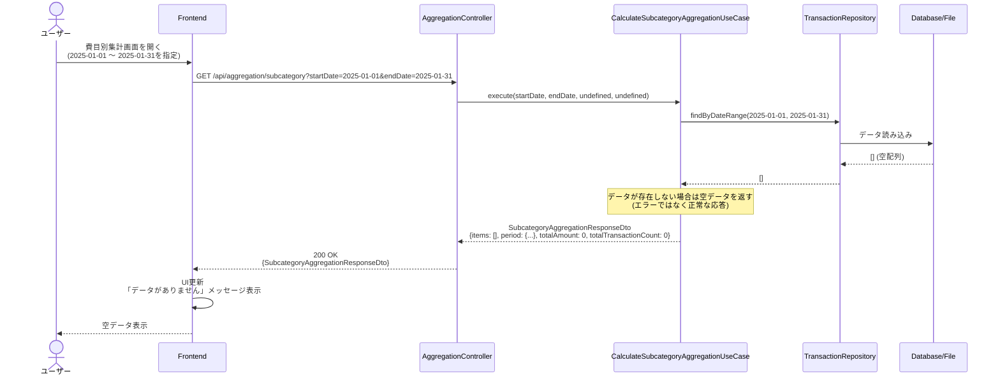
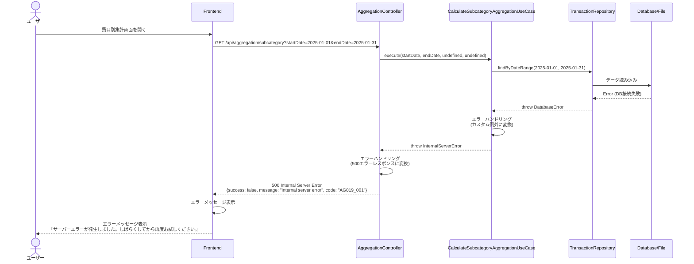

# シーケンス図

このドキュメントでは、費目別集計機能の処理フローをシーケンス図で記載しています。

## 目次

1. [費目別集計取得のフロー](#費目別集計取得のフロー)
2. [エラーハンドリングフロー](#エラーハンドリングフロー)

---

## 費目別集計取得のフロー

### 概要

**ユースケース**: 指定した期間の詳細な費目（食費、交通費、医療費等）ごとに取引を集計し、階層構造で分析情報を取得する

**アクター**: ユーザー（フロントエンド経由）

**前提条件**:

- 取引データが存在する（データが存在しない場合は空データを返す）

**成功時の結果**:

- 費目別集計情報が取得される（階層構造を含む）
- 平均金額が計算される
- 推移データ（月次推移）が計算される
- 主要取引（金額の大きい取引）が取得される
- 予算対比情報が取得される（将来対応）

### 正常系フロー（全費目集計）

### 正常系フロー（特定カテゴリタイプのみ集計）

### 正常系フロー（特定費目IDを指定）

### ステップ詳細

#### 1. リクエスト検証

- `startDate`と`endDate`の形式チェック（ISO8601形式）
- `startDate < endDate`のチェック
- `categoryType`の妥当性チェック（オプション）
- `itemId`の妥当性チェック（オプション）

#### 2. 取引データ取得

- 期間内の全取引データを取得
- `categoryType`が指定されている場合は、フィルタリング（Application層で実施）
- `itemId`が指定されている場合は、該当費目とその子費目の取引のみフィルタリング

#### 3. カテゴリ情報取得

- `categoryType`が指定されている場合は、該当カテゴリタイプのカテゴリのみ取得
- `itemId`が指定されている場合は、該当費目とその子費目を取得
- 階層構造構築のために、親子関係を考慮

#### 4. 費目別集計

- `SubcategoryAggregationDomainService.aggregateHierarchy()`で階層構造を考慮した集計
- 親費目の金額は、子費目の合計を含む（再帰的集計）
- 各費目で合計金額・取引件数・平均金額を計算

#### 5. 推移データ計算

- 期間内の月次推移を計算
- 各月の金額・取引件数を集計

#### 6. 階層構造構築

- カテゴリ情報から親子関係を構築
- 集計結果を階層構造にマッピング
- カテゴリ名を取得してDTOに設定

#### 7. 主要取引取得

- 各費目で金額の大きい取引を取得（最大5件）
- `TransactionEntity`を`TransactionDto`に変換

---

## エラーハンドリングフロー

### バリデーションエラー

### データ不存在エラー

### サーバーエラー

---

## チェックリスト

シーケンス図作成時の確認事項：

### 必須項目

- [x] 正常系フローが記載されている
- [x] エラーハンドリングフローが記載されている
- [x] 各ステップの説明が記載されている
- [x] 階層構造の処理が明確に示されている

### 推奨項目

- [x] 複数のシナリオ（全費目、特定カテゴリ、特定費目）が記載されている
- [x] データ不存在時の処理が明確
- [x] エラーレスポンス形式が明確

### 注意事項

- [x] 空データは正常な応答として扱う（500エラーにしない）
- [x] 階層構造の構築処理が明確に示されている
- [x] 親子関係の再帰的集計が明確に示されている
