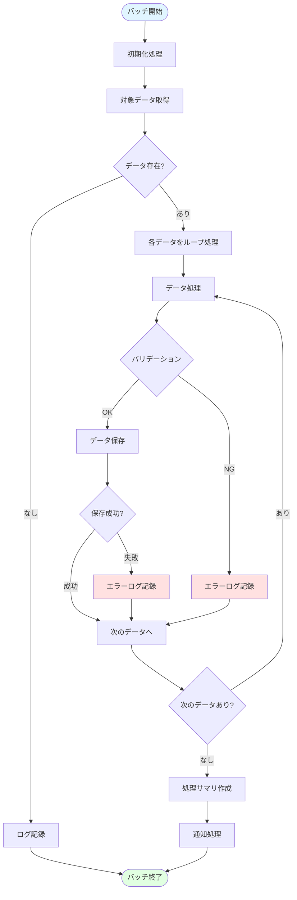
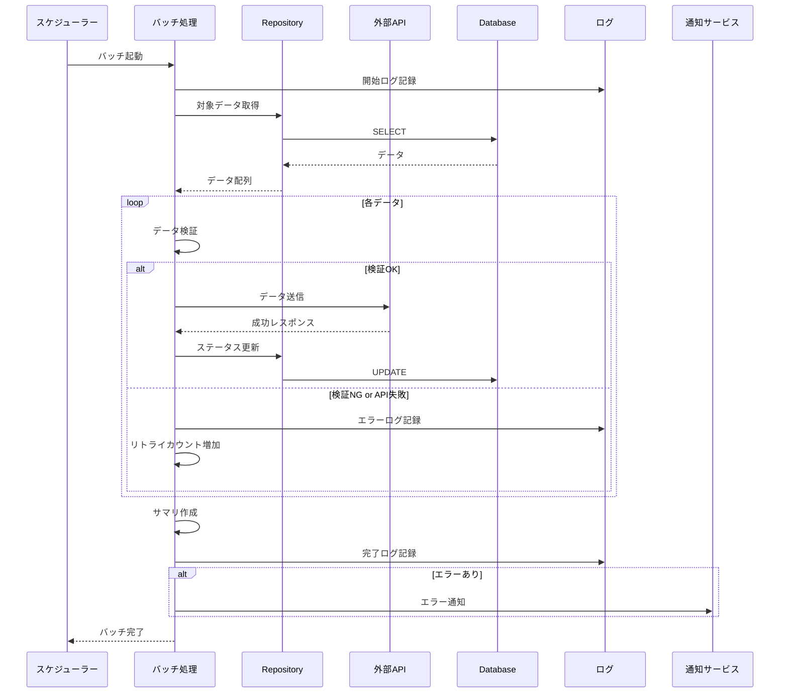

# バッチ処理詳細

このドキュメントでは、[機能名]のバッチ処理に関する詳細を記載しています。

**注意**: このバッチ処理詳細は、バッチ処理がある機能の場合にのみ作成してください。
バッチ処理がない機能の場合は、このファイルは不要です。

## 目次

1. [バッチ処理一覧](#バッチ処理一覧)
2. [バッチ処理の詳細](#バッチ処理の詳細)
3. [スケジュール設定](#スケジュール設定)
4. [エラーハンドリング](#エラーハンドリング)
5. [モニタリングとロギング](#モニタリングとロギング)

---

## バッチ処理一覧

| バッチ名     | 説明   | 実行頻度 | 実行時刻 | 所要時間(目安) |
| ------------ | ------ | -------- | -------- | -------------- |
| [BatchName1] | [説明] | 毎日     | 03:00    | 5-10分         |
| [BatchName2] | [説明] | 毎時     | 00分     | 1-2分          |
| [BatchName3] | [説明] | 手動     | -        | 10-30分        |

---

## バッチ処理の詳細

### [BatchName1]: [バッチ処理の名前]

#### 概要

**目的**: [バッチ処理の目的を記載]

**処理内容**:

1. [処理ステップ1]
2. [処理ステップ2]
3. [処理ステップ3]

**実行頻度**: 毎日 03:00

**所要時間**: 5-10分（データ量により変動）

---

#### 処理フロー



---

#### シーケンス図



---

#### 実装クラス

**クラス名**: `[BatchName]Job`

**メソッド**:

```typescript
export class [BatchName]Job {
  constructor(
    private readonly repository: [RepositoryName],
    private readonly externalService: [ServiceName],
    private readonly logger: Logger,
  ) {}

  /**
   * バッチ処理のメインロジック
   */
  async execute(): Promise<BatchResult> {
    this.logger.info('[BatchName] started');
    const startTime = Date.now();

    try {
      // 1. 対象データ取得
      const targets = await this.repository.findTargets();

      if (targets.length === 0) {
        this.logger.info('No targets found');
        return this.createResult(0, 0, 0, startTime);
      }

      // 2. データ処理
      const results = await this.processData(targets);

      // 3. サマリ作成
      const summary = this.createSummary(results);

      // 4. 完了ログ
      this.logger.info('[BatchName] completed', summary);

      return this.createResult(
        results.success,
        results.failure,
        targets.length,
        startTime
      );

    } catch (error) {
      this.logger.error('[BatchName] failed', error);
      throw error;
    }
  }

  /**
   * データ処理
   */
  private async processData(targets: Target[]): Promise<ProcessResult> {
    let successCount = 0;
    let failureCount = 0;

    for (const target of targets) {
      try {
        await this.processOne(target);
        successCount++;
      } catch (error) {
        this.logger.error(`Failed to process target ${target.id}`, error);
        failureCount++;
      }
    }

    return { success: successCount, failure: failureCount };
  }

  /**
   * 1件のデータ処理
   */
  private async processOne(target: Target): Promise<void> {
    // バリデーション
    this.validate(target);

    // 外部API呼び出し
    const result = await this.externalService.process(target);

    // ステータス更新
    await this.repository.updateStatus(target.id, 'completed');
  }

  private validate(target: Target): void {
    if (!target.field1) {
      throw new ValidationError('field1 is required');
    }
  }

  private createSummary(results: ProcessResult): BatchSummary {
    const total = results.success + results.failure;
    return {
      totalProcessed: total,
      successCount: results.success,
      failureCount: results.failure,
      successRate: total > 0 ? (results.success / total) * 100 : 0,
    };
  }

  private createResult(
    success: number,
    failure: number,
    total: number,
    startTime: number
  ): BatchResult {
    return {
      success,
      failure,
      total,
      duration: Date.now() - startTime,
      timestamp: new Date(),
    };
  }
}
```

---

#### データモデル

**対象データ**:

```typescript
interface Target {
  id: string;
  field1: string;
  field2: number;
  status: 'pending' | 'processing' | 'completed' | 'failed';
  retryCount: number;
  createdAt: Date;
  updatedAt: Date;
}
```

**処理結果**:

```typescript
interface BatchResult {
  success: number; // 成功件数
  failure: number; // 失敗件数
  total: number; // 総件数
  duration: number; // 処理時間（ミリ秒）
  timestamp: Date; // 実行日時
}

interface BatchSummary {
  totalProcessed: number; // 処理件数
  successCount: number; // 成功件数
  failureCount: number; // 失敗件数
  successRate: number; // 成功率（%）
}
```

---

#### パフォーマンス最適化

**バッチサイズ**:

- 1回の処理で最大1000件まで
- メモリ使用量を考慮して調整

**並列処理**:

```typescript
// Promise.allを使用した並列処理
private async processDataParallel(targets: Target[]): Promise<ProcessResult> {
  const BATCH_SIZE = 100;
  const batches = this.chunk(targets, BATCH_SIZE);

  let successCount = 0;
  let failureCount = 0;

  for (const batch of batches) {
    const results = await Promise.allSettled(
      batch.map(target => this.processOne(target))
    );

    for (const result of results) {
      if (result.status === 'fulfilled') {
        successCount++;
      } else {
        failureCount++;
        this.logger.error('Processing failed', result.reason);
      }
    }
  }

  return { success: successCount, failure: failureCount };
}

private chunk<T>(array: T[], size: number): T[][] {
  const chunks: T[][] = [];
  for (let i = 0; i < array.length; i += size) {
    chunks.push(array.slice(i, i + size));
  }
  return chunks;
}
```

---

## スケジュール設定

### Cron式

| バッチ名     | Cron式      | 説明          |
| ------------ | ----------- | ------------- |
| [BatchName1] | `0 3 * * *` | 毎日3時に実行 |
| [BatchName2] | `0 * * * *` | 毎時0分に実行 |
| [BatchName3] | 手動        | 手動実行のみ  |

### NestJSでの実装

```typescript
import { Injectable } from '@nestjs/common';
import { Cron, CronExpression } from '@nestjs/schedule';

@Injectable()
export class [BatchName]Scheduler {
  constructor(private readonly job: [BatchName]Job) {}

  @Cron('0 3 * * *', {
    name: '[BatchName1]',
    timeZone: 'Asia/Tokyo',
  })
  async execute[BatchName1]() {
    await this.job.execute();
  }

  @Cron(CronExpression.EVERY_HOUR, {
    name: '[BatchName2]',
  })
  async execute[BatchName2]() {
    await this.job.execute();
  }

  // 手動実行用のエンドポイント
  async executeManually() {
    return await this.job.execute();
  }
}
```

### 手動実行API

```typescript
// Controller
@Controller('batch')
export class BatchController {
  constructor(private readonly scheduler: [BatchName]Scheduler) {}

  @Post('[batch-name]/execute')
  @UseGuards(AdminAuthGuard)
  async executeBatch() {
    const result = await this.scheduler.executeManually();
    return { success: true, result };
  }
}
```

---

## エラーハンドリング

### リトライ戦略

**基本方針**:

- 一時的なエラー: 3回までリトライ
- 恒久的なエラー: リトライせず、エラーログに記録

**リトライ間隔**:

- 1回目: 即座
- 2回目: 1秒後
- 3回目: 5秒後

**実装例**:

```typescript
private async processOneWithRetry(
  target: Target,
  maxRetries: number = 3
): Promise<void> {
  let lastError: Error;

  for (let attempt = 1; attempt <= maxRetries; attempt++) {
    try {
      await this.processOne(target);
      return; // 成功したら終了
    } catch (error) {
      lastError = error;

      this.logger.warn(
        `Attempt ${attempt}/${maxRetries} failed for target ${target.id}`,
        error
      );

      // 最後の試行でなければリトライ
      if (attempt < maxRetries) {
        const delay = this.getRetryDelay(attempt);
        await this.sleep(delay);
      }
    }
  }

  // すべてのリトライが失敗
  throw lastError;
}

private getRetryDelay(attempt: number): number {
  // 指数バックオフ: 1秒, 2秒, 4秒...
  return Math.pow(2, attempt - 1) * 1000;
}

private sleep(ms: number): Promise<void> {
  return new Promise(resolve => setTimeout(resolve, ms));
}
```

### エラー分類

| エラー種類               | 説明               | リトライ | 通知 |
| ------------------------ | ------------------ | -------- | ---- |
| 一時的ネットワークエラー | タイムアウト等     | ✅ 3回   | ❌   |
| バリデーションエラー     | データ不正         | ❌       | ✅   |
| 外部API エラー (4xx)     | クライアントエラー | ❌       | ✅   |
| 外部API エラー (5xx)     | サーバーエラー     | ✅ 3回   | ✅   |
| データベースエラー       | 接続エラー等       | ✅ 3回   | ✅   |

---

## モニタリングとロギング

### ログレベル

| レベル | 用途       | 例                          |
| ------ | ---------- | --------------------------- |
| INFO   | 正常な処理 | バッチ開始/終了、処理サマリ |
| WARN   | 警告       | リトライ発生、一部失敗      |
| ERROR  | エラー     | 処理失敗、致命的エラー      |

### ログフォーマット

```json
{
  "timestamp": "2025-11-21T03:00:00.000Z",
  "level": "INFO",
  "batch": "[BatchName]",
  "message": "Batch completed successfully",
  "context": {
    "totalProcessed": 1000,
    "successCount": 995,
    "failureCount": 5,
    "duration": 300000,
    "successRate": 99.5
  }
}
```

### メトリクス

**収集するメトリクス**:

- 処理件数
- 成功件数/失敗件数
- 成功率
- 処理時間
- エラー率

**実装例**:

```typescript
export class BatchMetrics {
  private metrics: {
    totalExecutions: number;
    successExecutions: number;
    failureExecutions: number;
    averageDuration: number;
  } = {
    totalExecutions: 0,
    successExecutions: 0,
    failureExecutions: 0,
    averageDuration: 0,
  };

  recordExecution(result: BatchResult): void {
    this.metrics.totalExecutions++;

    if (result.failure === 0) {
      this.metrics.successExecutions++;
    } else {
      this.metrics.failureExecutions++;
    }

    // 移動平均で計算
    this.metrics.averageDuration =
      (this.metrics.averageDuration * (this.metrics.totalExecutions - 1) + result.duration) /
      this.metrics.totalExecutions;
  }

  getMetrics() {
    const total = this.metrics.totalExecutions;
    return {
      ...this.metrics,
      successRate: total > 0 ? (this.metrics.successExecutions / total) * 100 : 0,
    };
  }
}
```

### アラート条件

| 条件            | アラートレベル | 通知先              |
| --------------- | -------------- | ------------------- |
| 成功率 < 95%    | WARNING        | 開発チーム          |
| 成功率 < 80%    | ERROR          | 開発チーム + 管理者 |
| バッチ失敗      | CRITICAL       | 開発チーム + 管理者 |
| 処理時間 > 30分 | WARNING        | 開発チーム          |

---

## チェックリスト

バッチ処理詳細作成時の確認事項：

### 基本項目

- [ ] バッチ処理の目的が明確
- [ ] 処理フローが記載されている
- [ ] スケジュール設定が明確
- [ ] 実行頻度と所要時間が記載されている

### 実装

- [ ] エラーハンドリングが適切
- [ ] リトライ戦略が定義されている
- [ ] パフォーマンス最適化が考慮されている
- [ ] トランザクション境界が明確（必要な場合）

### 運用

- [ ] ロギング戦略が明確
- [ ] モニタリング項目が定義されている
- [ ] アラート条件が定義されている
- [ ] 手動実行方法が提供されている
