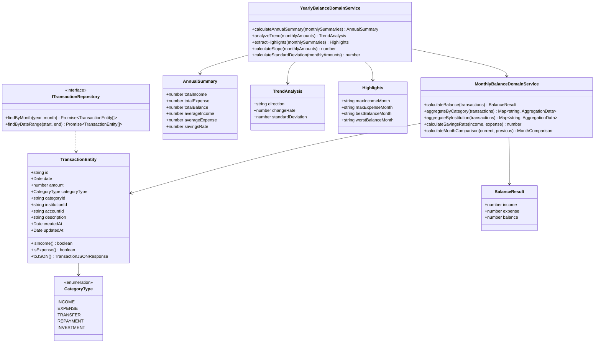

# クラス図

このドキュメントでは、年間収支推移表示機能のクラス構造を記載しています。

## 目次

1. [Domain層クラス図](#domain層クラス図)
2. [Application層クラス図](#application層クラス図)
3. [Infrastructure層クラス図](#infrastructure層クラス図)
4. [Presentation層クラス図](#presentation層クラス図)

---

## Domain層クラス図

### Aggregation Module (FR-020)

**クラス説明**:

#### TransactionEntity（既存）

- **責務**: 取引データのエンティティ
- **主要メソッド**:
  - `isIncome()`: 収入取引かどうかを判定
  - `isExpense()`: 支出取引かどうかを判定
  - `toJSON()`: JSON形式への変換（戻り値型: `TransactionJSONResponse` - 既存の型定義を使用）

#### YearlyBalanceDomainService（新規作成）

- **責務**: 年間収支集計のドメインロジック
- **主要メソッド**:
  - `calculateAnnualSummary(monthlySummaries)`: 年間サマリーを計算（合計・平均・貯蓄率）
  - `analyzeTrend(monthlyAmounts)`: トレンド分析を実行（線形回帰による傾き・標準偏差・方向判定）
  - `extractHighlights(monthlySummaries)`: ハイライト情報を抽出（最大収入月・最大支出月・最高収支月・最低収支月）
  - `calculateSlope(monthlyAmounts)`: 線形回帰の傾きを計算
  - `calculateStandardDeviation(monthlyAmounts)`: 標準偏差を計算

#### MonthlyBalanceDomainService（既存、FR-016で作成済み）

- **責務**: 月別収支集計のドメインロジック（FR-016で作成済み、再利用）
- **主要メソッド**:
  - `calculateBalance(transactions)`: 収入・支出・収支差額を計算
  - `aggregateByCategory(transactions)`: カテゴリID別に集計
  - `aggregateByInstitution(transactions)`: 金融機関別に集計
  - `calculateSavingsRate(income, expense)`: 貯蓄率を計算
  - `calculateMonthComparison(current, previous)`: 前月比を計算

#### AnnualSummary（Value Object）

- **責務**: 年間サマリー情報を表現
- **不変性**: 値オブジェクトは不変（immutable）

#### TrendAnalysis（Value Object）

- **責務**: トレンド分析結果を表現
- **不変性**: 値オブジェクトは不変（immutable）

#### Highlights（Value Object）

- **責務**: ハイライト情報を表現
- **不変性**: 値オブジェクトは不変（immutable）

#### BalanceResult（Value Object、FR-016で作成済み）

- **責務**: 収支計算結果を表現
- **不変性**: 値オブジェクトは不変（immutable）

---

## Application層クラス図

### Use Cases

**クラス説明**:

#### CalculateYearlyBalanceUseCase（新規作成）

- **責務**: 年間収支推移表示のユースケース実装
- **依存**: `ITransactionRepository`、`YearlyBalanceDomainService`、`MonthlyBalanceDomainService`（FR-016）
- **入力**: `year: number`
- **出力**: `YearlyBalanceResponseDto`
- **主要メソッド**:
  - `execute(year)`: 年間収支推移を実行
  - `getYearlyTransactions(year)`: 対象年全体の取引データを一度に取得（`findByDateRange`を使用）
  - `aggregateByMonth(transactions, year)`: メモリ上で月別にフィルタリング・集計（`MonthlyBalanceDomainService`を再利用）
  - `buildYearlySummary(monthlyData)`: 年間サマリーを構築

#### CalculateMonthlyBalanceUseCase（既存、FR-016で作成済み）

- **責務**: 月別収支集計のユースケース実装（FR-016で作成済み、再利用）
- **依存**: `ITransactionRepository`, `MonthlyBalanceDomainService`
- **入力**: `year: number`, `month: number`
- **出力**: `MonthlyBalanceResponseDto`

#### YearlyBalanceResponseDto（新規作成）

- **責務**: 年間収支推移のレスポンスDTO
- **型**: `interface`（レスポンスはinterface）

#### AnnualSummaryData（新規作成）

- **責務**: 年間サマリー情報
- **型**: `interface`

#### TrendData（新規作成）

- **責務**: トレンド分析情報
- **型**: `interface`

#### HighlightsData（新規作成）

- **責務**: ハイライト情報
- **型**: `interface`

---

## Infrastructure層クラス図

### Repository Implementations

**クラス説明**:

#### TransactionRepository（既存）

- **責務**: JSONファイルベースの取引リポジトリ実装
- **主要メソッド**:
  - `findByMonth(year, month)`: 月で取引を取得
  - `findByDateRange(start, end)`: 期間で取引を取得

#### TransactionTypeOrmRepository（既存）

- **責務**: TypeORMベースの取引リポジトリ実装
- **主要メソッド**:
  - `findByMonth(year, month)`: 月で取引を取得
  - `findByDateRange(start, end)`: 期間で取引を取得

---

## Presentation層クラス図

### Controllers and DTOs

**クラス説明**:

#### AggregationController（既存、拡張）

- **責務**: 集計機能のREST APIエンドポイント
- **主要メソッド**:
  - `getYearlyBalance(year)`: 年間収支推移情報を取得（新規追加）
  - `getMonthlyBalance(year, month)`: 月別収支集計情報を取得（既存、FR-016）

#### YearlyBalanceResponseDto（新規作成）

- **責務**: 年間収支推移のレスポンスDTO
- **型**: `interface`（レスポンスはinterface）

---

## チェックリスト

クラス図作成時の確認事項：

### 必須項目

- [x] Domain層のクラス図が記載されている
- [x] Application層のクラス図が記載されている
- [x] Infrastructure層のクラス図が記載されている
- [x] Presentation層のクラス図が記載されている
- [x] 各クラスの責務が説明されている
- [x] 主要メソッドが記載されている
- [x] 依存関係が明確に示されている

### 推奨項目

- [x] Value Objectが明示されている
- [x] Repository Interfaceが明示されている
- [x] DTOの型（class/interface）が明確
- [x] 既存実装との関係が明確（FR-016の再利用）

### 注意事項

- [x] Domain層のエンティティは、Presentation層のDTO型に依存していない
- [x] 依存関係の方向が正しい（外→内）
- [x] レスポンスDTOは`interface`で定義されている
- [x] 既存のFR-016のUseCaseとDomainServiceを再利用している
