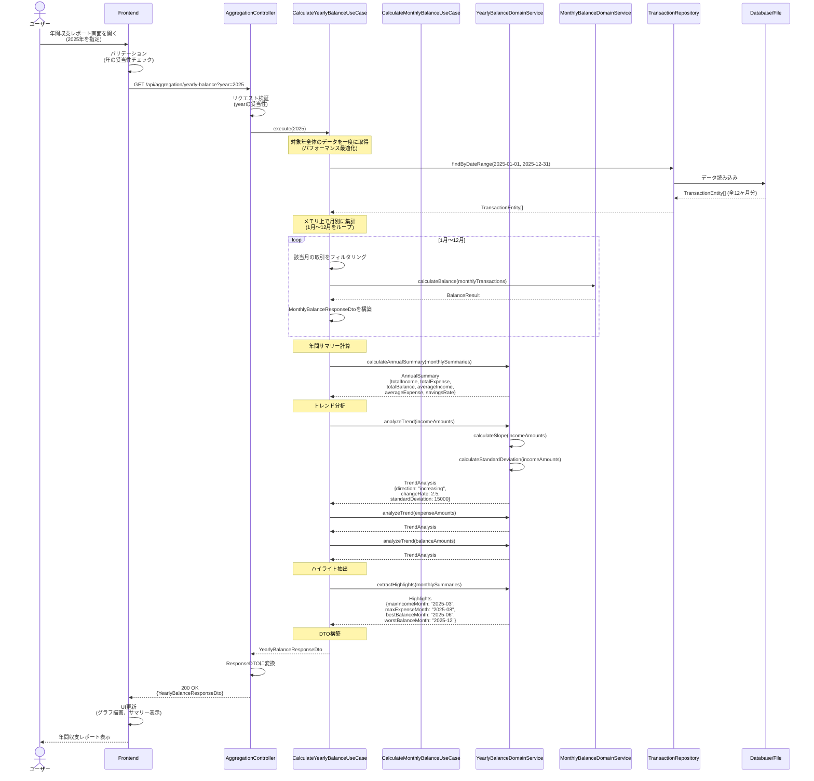
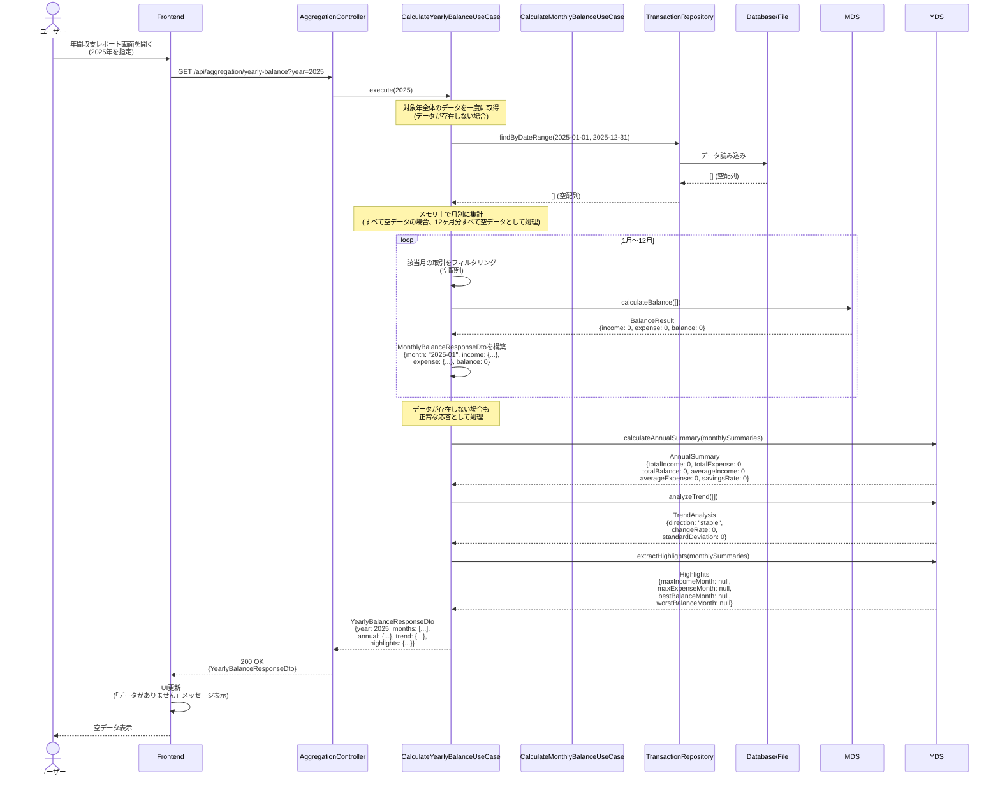
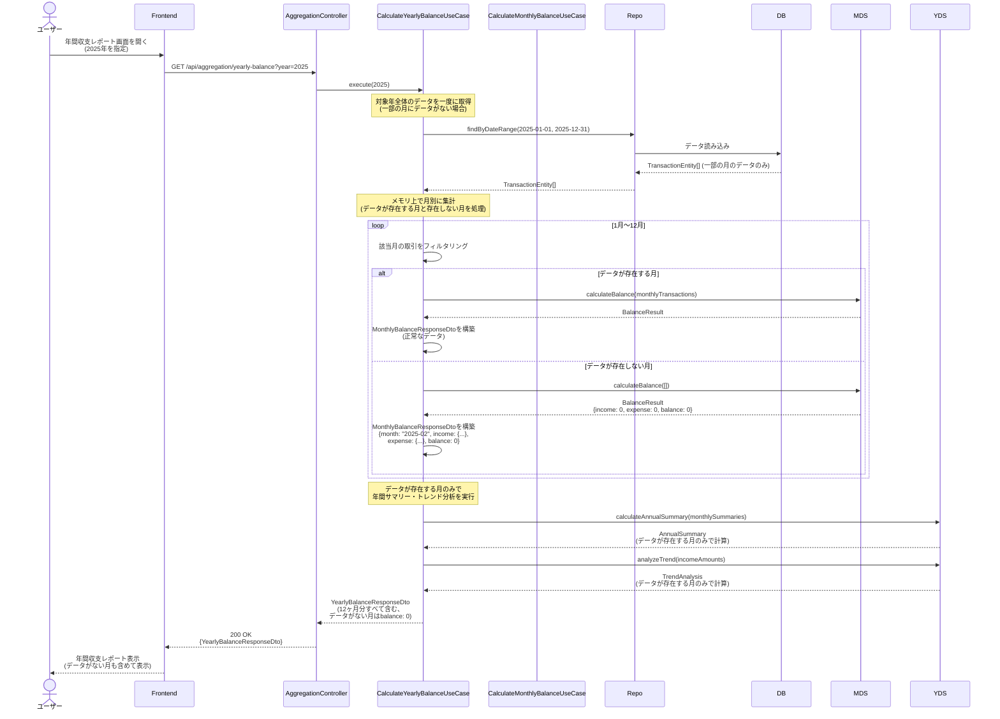
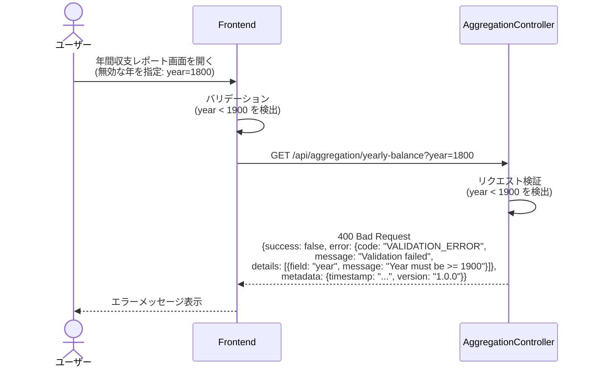
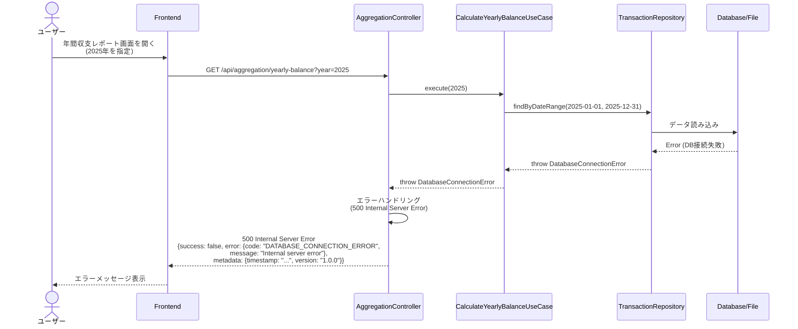

# シーケンス図

このドキュメントでは、年間収支推移表示機能の処理フローをシーケンス図で記載しています。

## 目次

1. [年間収支推移取得のフロー](#年間収支推移取得のフロー)
2. [エラーハンドリングフロー](#エラーハンドリングフロー)

---

## 年間収支推移取得のフロー

### 概要

**ユースケース**: 指定した年の1年間（12ヶ月）の収支推移を集計し、詳細な分析情報を取得する

**アクター**: ユーザー（フロントエンド経由）

**前提条件**:

- 取引データが存在する（データが存在しない場合は空データを返す）

**成功時の結果**:

- 年間収支推移情報が取得される
- 12ヶ月分の月別データが取得される
- 年間サマリー（合計・平均・貯蓄率）が計算される
- トレンド分析（収入・支出・収支の傾向）が実行される
- ハイライト情報（最大収入月・最大支出月・最高収支月・最低収支月）が抽出される

### 正常系フロー



### ステップ詳細

1. **ユーザーアクション**
   - ユーザーが年間収支レポート画面を開く
   - デフォルトで今年を表示、または年を選択

2. **Frontend バリデーション**
   - 年の形式チェック（数値）
   - 無効な年指定のチェック（1900年未満など）

3. **API リクエスト**
   - エンドポイント: `GET /api/aggregation/yearly-balance?year=2025`
   - クエリパラメータ: `year` (number)

4. **UseCase 実行**
   - 1月〜12月の各月について、FR-016の`CalculateMonthlyBalanceUseCase`を呼び出し
   - 各月のデータを取得
   - 年間サマリーを計算（合計・平均・貯蓄率）
   - トレンド分析を実行（収入・支出・収支それぞれ）
   - ハイライト情報を抽出

5. **Domain Service 実行**
   - `calculateAnnualSummary()`: 年間サマリーを計算
   - `analyzeTrend()`: トレンド分析を実行（線形回帰による傾き・標準偏差・方向判定）
   - `extractHighlights()`: ハイライト情報を抽出

6. **レスポンス**
   - ResponseDTO: `YearlyBalanceResponseDto`
   - HTTPステータス: 200 OK

### データが存在しない場合のフロー



**重要**: データが存在しない場合でも、500エラーではなく200 OKで空データを返す。これは正常なシナリオの一つとして扱う。

### 一部の月にデータが存在しない場合のフロー



**重要**: 一部の月にデータが存在しない場合でも、その月は空データ（balance: 0）として扱い、エラーにはしない。年間サマリー・トレンド分析は、データが存在する月のみで計算する。

---

## エラーハンドリングフロー

### バリデーションエラー（400 Bad Request）



### サーバーエラー（500 Internal Server Error）



### エラーレスポンス形式

すべてのエラーレスポンスは、プロジェクトで定義されている標準形式（`libs/types/src/api/error-response.ts`）に従う：

```typescript
export interface ErrorResponse {
  success: false;
  error: {
    code: string;
    message: string;
    details?: ErrorDetail[];
  };
  metadata: {
    timestamp: string;
    version: string;
  };
}
```

### エラー分類

| HTTPステータス | エラーコード                | 説明                   | 例                         |
| -------------- | --------------------------- | ---------------------- | -------------------------- |
| 400            | `VALIDATION_ERROR`          | バリデーションエラー   | 無効な年指定（1800年など） |
| 500            | `DATABASE_CONNECTION_ERROR` | データベース接続エラー | DB接続失敗                 |
| 500            | `INTERNAL_SERVER_ERROR`     | 予期しないエラー       | その他の内部エラー         |

---

## チェックリスト

シーケンス図作成時の確認事項：

### 必須項目

- [x] 正常系フローが記載されている
- [x] 異常系フローが記載されている
- [x] 各ステップの説明が記載されている
- [x] エラーハンドリングが明確に示されている
- [x] データが存在しない場合の処理が明確
- [x] 一部の月にデータが存在しない場合の処理が明確

### 推奨項目

- [x] 前提条件が記載されている
- [x] 成功時の結果が記載されている
- [x] エラーレスポンス形式が明確
- [x] FR-016のUseCaseを再利用していることが明確

### 注意事項

- [x] 空配列（[]）は正常な応答として扱う（500エラーにしない）
- [x] エラーレスポンスは共通形式に準拠している
- [x] HTTPステータスコードが適切に使い分けられている
- [x] 12ヶ月分のデータ取得がループで表現されている
