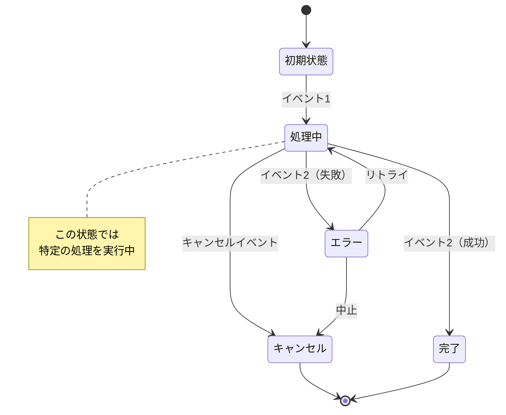
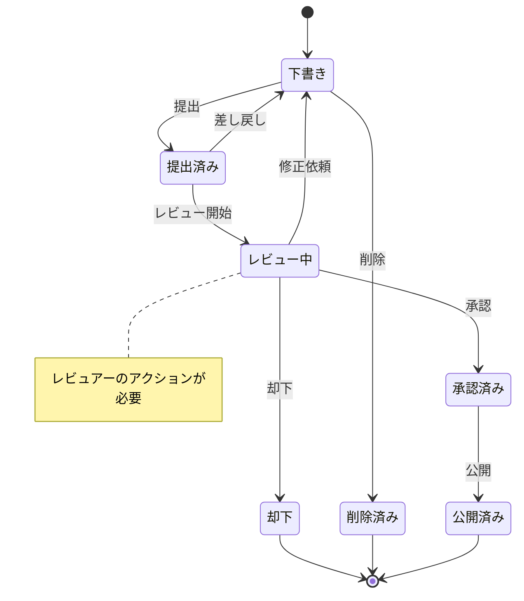
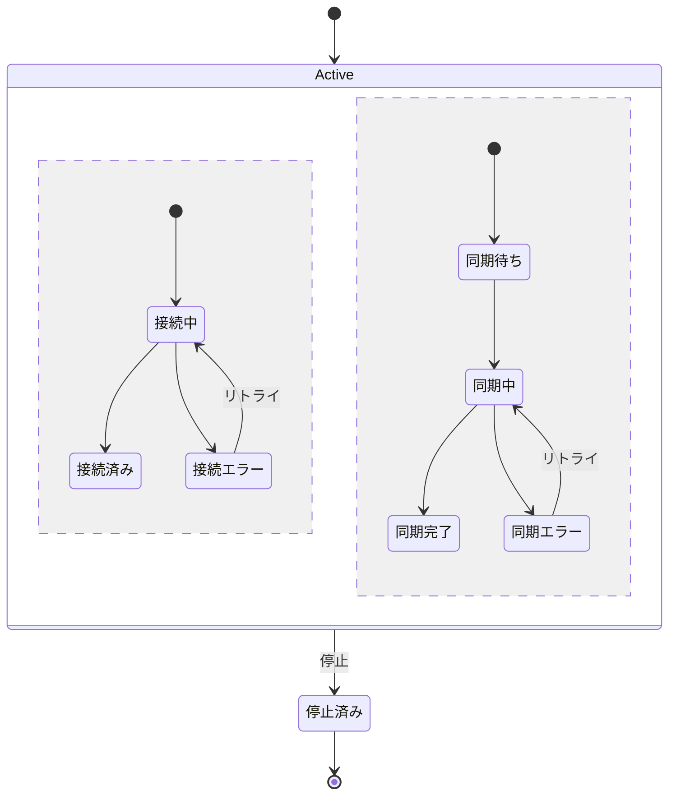
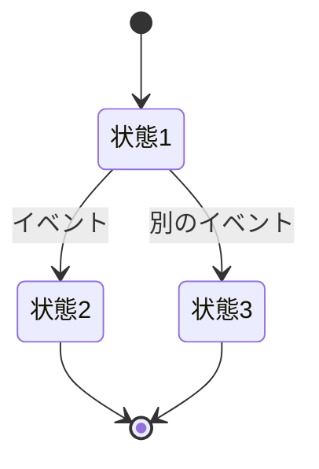
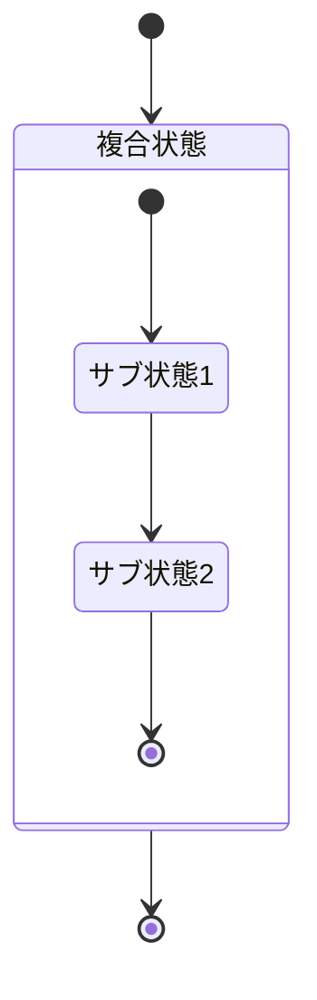
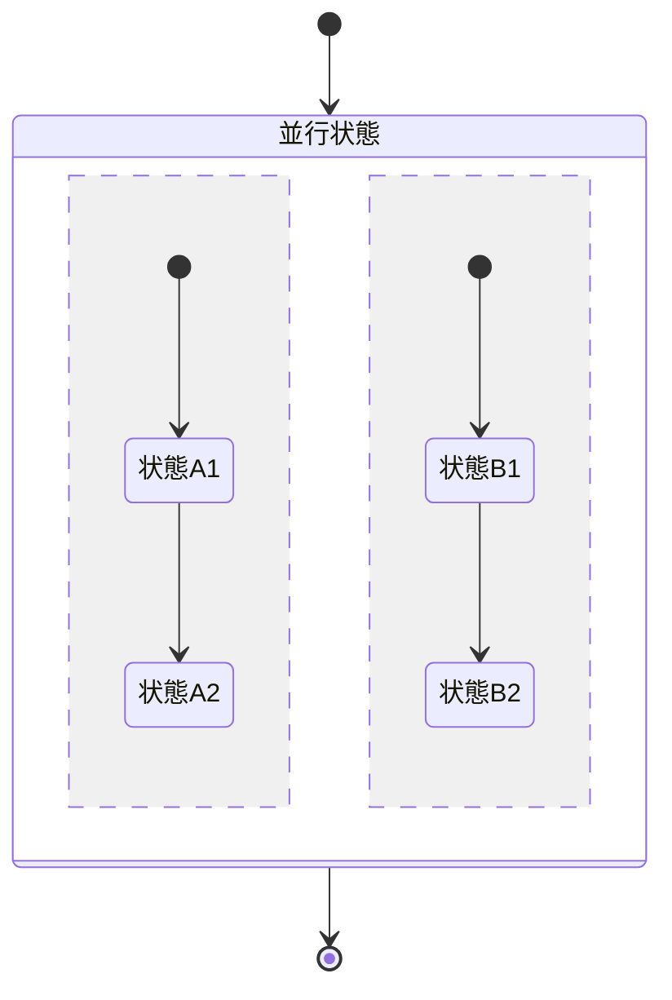
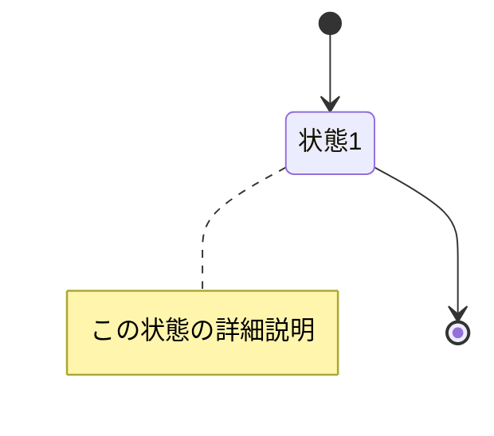

# 状態遷移図

このドキュメントでは、[機能名]における状態管理と状態遷移を記載しています。

**注意**: この状態遷移図は、複雑な状態管理がある機能の場合にのみ作成してください。
シンプルなCRUD操作のみの場合は、このファイルは不要です。

## 目次

1. [[エンティティ/機能名] の状態遷移](#エンティティ機能名の状態遷移)
2. [状態の詳細説明](#状態の詳細説明)
3. [遷移条件とバリデーション](#遷移条件とバリデーション)

---

## [エンティティ/機能名] の状態遷移

### 状態遷移図



### 状態一覧

| 状態       | 説明   | 次の状態                 |
| ---------- | ------ | ------------------------ |
| 初期状態   | [説明] | 処理中                   |
| 処理中     | [説明] | 完了, エラー, キャンセル |
| 完了       | [説明] | -                        |
| エラー     | [説明] | 処理中, キャンセル       |
| キャンセル | [説明] | -                        |

---

## 状態の詳細説明

### 初期状態 (Initial)

**概要**: [状態の説明]

**プロパティ**:

- `status`: `"initial"`
- [その他のプロパティ]

**可能なアクション**:

- [アクション1]: [説明]
- [アクション2]: [説明]

**制約**:

- [制約条件を記載]

**UI表示**:

- 表示内容: [UIでの表示方法]
- ボタン状態: [有効/無効なボタン]

---

### 処理中 (Processing)

**概要**: [状態の説明]

**プロパティ**:

- `status`: `"processing"`
- `progress`: `number` (0-100)
- [その他のプロパティ]

**可能なアクション**:

- [アクション1]: [説明]
- キャンセル: 処理を中止

**制約**:

- [制約条件を記載]

**UI表示**:

- 表示内容: ローディングインジケーター
- ボタン状態: ほとんどのボタンが無効

---

### 完了 (Completed)

**概要**: [状態の説明]

**プロパティ**:

- `status`: `"completed"`
- `completedAt`: `Date`
- [その他のプロパティ]

**可能なアクション**:

- なし（終端状態）

**制約**:

- この状態からは他の状態に遷移できない

**UI表示**:

- 表示内容: 完了メッセージ
- ボタン状態: すべて無効

---

### エラー (Error)

**概要**: [状態の説明]

**プロパティ**:

- `status`: `"error"`
- `errorMessage`: `string`
- `retryCount`: `number`
- [その他のプロパティ]

**可能なアクション**:

- リトライ: 処理を再試行
- 中止: キャンセル状態へ遷移

**制約**:

- リトライは最大3回まで
- [その他の制約]

**UI表示**:

- 表示内容: エラーメッセージ
- ボタン状態: リトライボタン、中止ボタンが有効

---

## 遷移条件とバリデーション

### 初期状態 → 処理中

**トリガー**: [イベント名]

**前提条件**:

- [ ] [条件1]
- [ ] [条件2]

**処理**:

1. [処理ステップ1]
2. [処理ステップ2]

**バリデーション**:

- [バリデーションルール]

**失敗時の動作**:

- バリデーションエラー: エラーメッセージ表示、状態は変更しない
- システムエラー: エラー状態へ遷移

```typescript
// 実装例
async function transitionToProcessing(entity: Entity): Promise<Entity> {
  // 前提条件チェック
  if (!validatePreconditions(entity)) {
    throw new ValidationError('前提条件を満たしていません');
  }

  // 状態更新
  entity.status = 'processing';
  entity.startedAt = new Date();

  return entity;
}
```

---

### 処理中 → 完了

**トリガー**: [イベント名]

**前提条件**:

- [ ] [条件1]
- [ ] [条件2]

**処理**:

1. [処理ステップ1]
2. [処理ステップ2]

**バリデーション**:

- [バリデーションルール]

```typescript
// 実装例
async function transitionToCompleted(entity: Entity): Promise<Entity> {
  if (entity.status !== 'processing') {
    throw new InvalidStateTransitionError();
  }

  entity.status = 'completed';
  entity.completedAt = new Date();

  return entity;
}
```

---

### 処理中 → エラー

**トリガー**: [エラー発生]

**前提条件**:

- エラーが発生した

**処理**:

1. エラー情報を記録
2. リトライカウントを記録
3. 状態をエラーに更新

**リトライ戦略**:

- 最大リトライ回数: 3回
- リトライ間隔: 指数バックオフ (1秒, 2秒, 4秒)

```typescript
// 実装例
async function transitionToError(entity: Entity, error: Error): Promise<Entity> {
  entity.status = 'error';
  entity.errorMessage = error.message;
  entity.retryCount = (entity.retryCount || 0) + 1;
  entity.lastErrorAt = new Date();

  return entity;
}
```

---

## 状態管理の実装

### Entity での状態管理

```typescript
// Entity定義例
export class [EntityName] {
  private _status: Status;

  get status(): Status {
    return this._status;
  }

  // 状態遷移メソッド
  public startProcessing(): [EntityName] {
    if (this._status !== 'initial') {
      throw new InvalidStateTransitionError(
        `Cannot start processing from ${this._status}`
      );
    }

    this._status = 'processing';
    this.startedAt = new Date();

    return this;
  }

  public complete(): [EntityName] {
    if (this._status !== 'processing') {
      throw new InvalidStateTransitionError(
        `Cannot complete from ${this._status}`
      );
    }

    this._status = 'completed';
    this.completedAt = new Date();

    return this;
  }

  public fail(error: Error): [EntityName] {
    if (this._status !== 'processing') {
      throw new InvalidStateTransitionError(
        `Cannot fail from ${this._status}`
      );
    }

    this._status = 'error';
    this.errorMessage = error.message;
    this.retryCount++;

    return this;
  }

  public cancel(): [EntityName] {
    if (!['processing', 'error'].includes(this._status)) {
      throw new InvalidStateTransitionError(
        `Cannot cancel from ${this._status}`
      );
    }

    this._status = 'cancelled';
    this.cancelledAt = new Date();

    return this;
  }

  // 状態チェックメソッド
  public canTransitionTo(newStatus: Status): boolean {
    const allowedTransitions: Record<Status, Status[]> = {
      initial: ['processing'],
      processing: ['completed', 'error', 'cancelled'],
      completed: [],
      error: ['processing', 'cancelled'],
      cancelled: [],
    };

    return allowedTransitions[this._status]?.includes(newStatus) ?? false;
  }
}
```

### Enum定義

```typescript
export enum Status {
  INITIAL = 'initial',
  PROCESSING = 'processing',
  COMPLETED = 'completed',
  ERROR = 'error',
  CANCELLED = 'cancelled',
}
```

---

## 複雑な状態遷移の例

### ワークフロー型の状態遷移



### 並行状態を持つ遷移



---

## フロントエンドでの状態管理

### React での実装例

```typescript
// カスタムフック例
export function use[EntityName]State(initialState: Status) {
  const [status, setStatus] = useState<Status>(initialState);
  const [error, setError] = useState<Error | null>(null);

  const startProcessing = useCallback(() => {
    if (status !== 'initial') {
      throw new Error('Invalid state transition');
    }
    setStatus('processing');
  }, [status]);

  const complete = useCallback(() => {
    if (status !== 'processing') {
      throw new Error('Invalid state transition');
    }
    setStatus('completed');
  }, [status]);

  const fail = useCallback((error: Error) => {
    if (status !== 'processing') {
      throw new Error('Invalid state transition');
    }
    setStatus('error');
    setError(error);
  }, [status]);

  const canTransition = useCallback((newStatus: Status): boolean => {
    // 遷移可能かチェック
    const allowedTransitions: Record<Status, Status[]> = {
      initial: ['processing'],
      processing: ['completed', 'error', 'cancelled'],
      completed: [],
      error: ['processing', 'cancelled'],
      cancelled: [],
    };

    return allowedTransitions[status]?.includes(newStatus) ?? false;
  }, [status]);

  return {
    status,
    error,
    startProcessing,
    complete,
    fail,
    canTransition,
  };
}
```

---

## チェックリスト

状態遷移図作成時の確認事項：

### 基本項目

- [ ] すべての状態が定義されている
- [ ] 状態間の遷移が明確に記載されている
- [ ] 初期状態と終端状態が明確
- [ ] 遷移のトリガーが記載されている

### 詳細項目

- [ ] 各状態の詳細説明がある
- [ ] 遷移条件が明確
- [ ] バリデーションルールが記載されている
- [ ] 実装例が提供されている

### 実装ガイド

- [ ] 不正な遷移の防止方法が記載されている
- [ ] エラーハンドリングが明確
- [ ] リトライ戦略が定義されている（必要な場合）

---

## Mermaid記法のヒント

### State Diagram



### 複合状態



### 並行状態



### ノート


