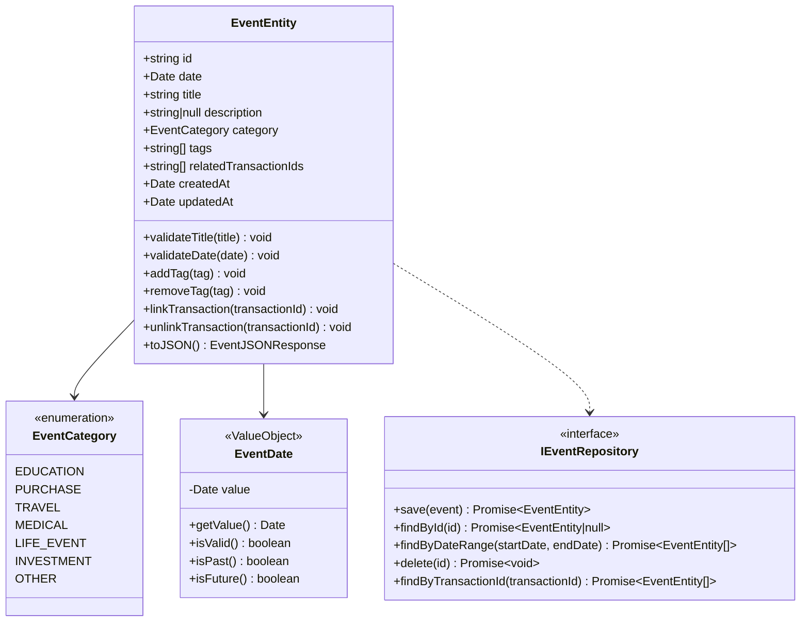
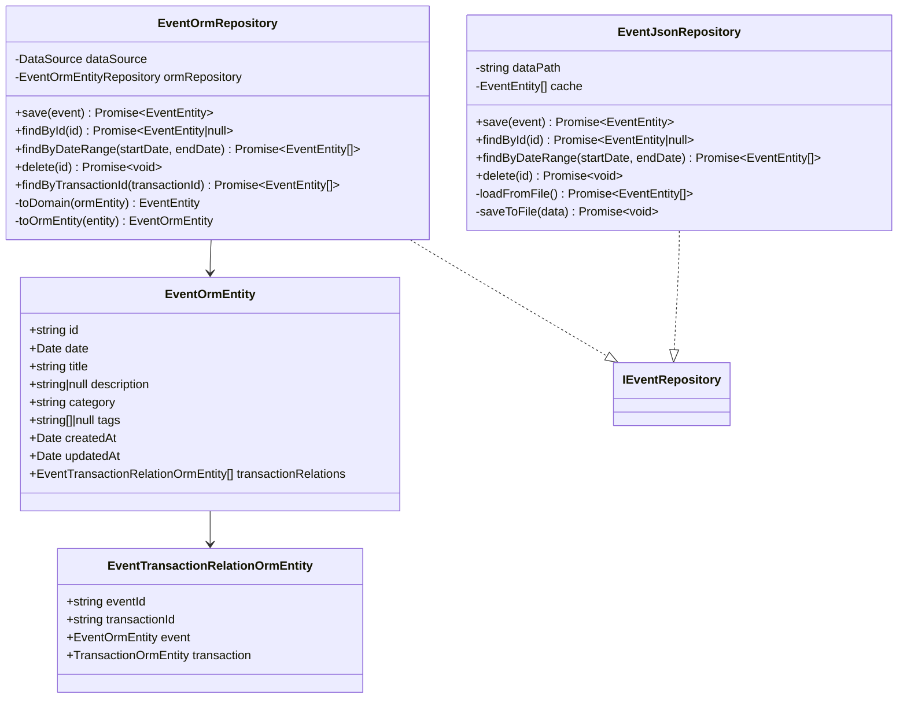
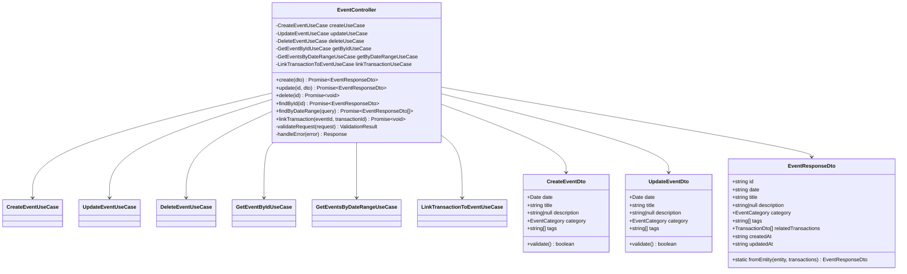
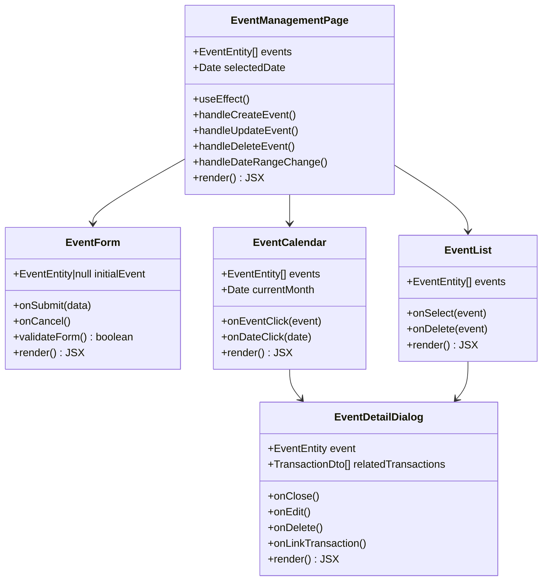
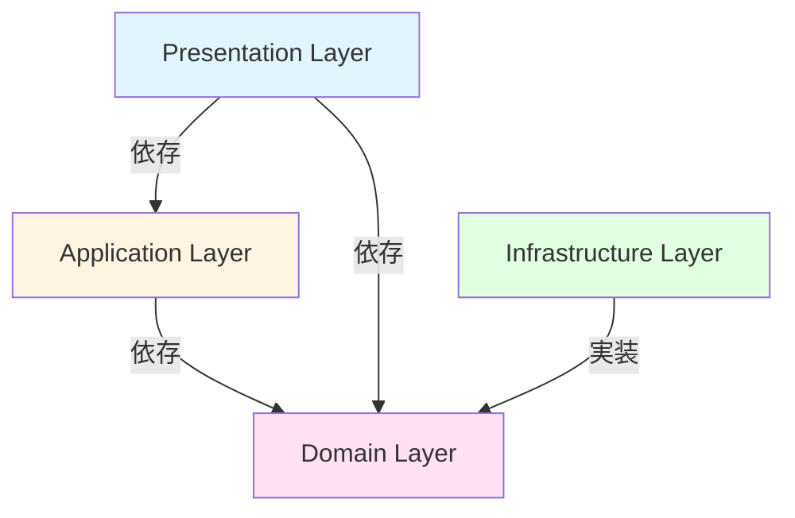
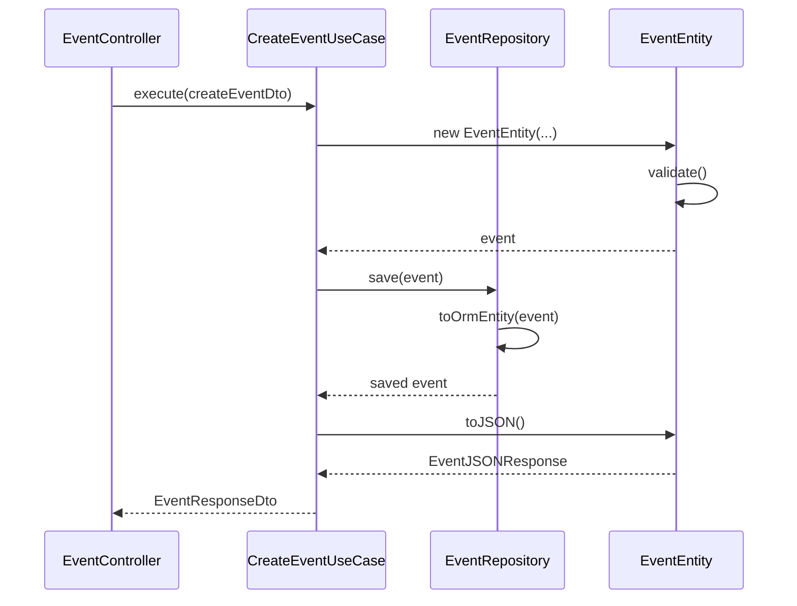

# クラス図

このドキュメントでは、イベントメモ機能（FR-021）のクラス構造を記載しています。

## 目次

1. [Domain層クラス図](#domain層クラス図)
2. [Application層クラス図](#application層クラス図)
3. [Infrastructure層クラス図](#infrastructure層クラス図)
4. [Presentation層クラス図](#presentation層クラス図)
5. [Frontend コンポーネント図](#frontendコンポーネント図)

---

## Domain層クラス図

### Event Entity & Value Objects

**クラス説明**:

#### EventEntity

- **責務**: イベントのドメインエンティティ
- **主要メソッド**:
  - `validateTitle(title)`: タイトルのバリデーション（1-100文字）
  - `validateDate(date)`: 日付のバリデーション
  - `addTag(tag)`: タグを追加
  - `removeTag(tag)`: タグを削除
  - `linkTransaction(transactionId)`: 取引を関連付け
  - `unlinkTransaction(transactionId)`: 取引との関連付けを解除
  - `toJSON()`: JSON形式への変換

#### EventCategory (Enum)

- **責務**: イベントカテゴリの定義
- **値**:
  - `EDUCATION`: 就学関連
  - `PURCHASE`: 高額購入
  - `TRAVEL`: 旅行
  - `MEDICAL`: 医療
  - `LIFE_EVENT`: ライフイベント
  - `INVESTMENT`: 投資
  - `OTHER`: その他

#### EventDate (Value Object)

- **責務**: イベント日付の値オブジェクト
- **バリデーション**:
  - 必須
  - 妥当な日付
- **メソッド**:
  - `isPast()`: 過去の日付か判定
  - `isFuture()`: 未来の日付か判定

---

## Application層クラス図

### Use Cases

```mermaid
classDiagram
    class CreateEventUseCase {
        -IEventRepository repository
        +execute(dto) Promise~EventEntity~
    }

    class UpdateEventUseCase {
        -IEventRepository repository
        +execute(id, dto) Promise~EventEntity~
    }

    class DeleteEventUseCase {
        -IEventRepository repository
        -ITransactionRepository transactionRepository
        +execute(id) Promise~void~
    }

    class GetEventByIdUseCase {
        -IEventRepository repository
        -ITransactionRepository transactionRepository
        +execute(id) Promise~EventResponseDto~
    }

    class GetEventsByDateRangeUseCase {
        -IEventRepository repository
        +execute(startDate, endDate) Promise~EventEntity[]~
    }

    class LinkTransactionToEventUseCase {
        -IEventRepository repository
        -ITransactionRepository transactionRepository
        +execute(eventId, transactionId) Promise~void~
    }

    class CreateEventDto {
        +Date date
        +string title
        +string|null description
        +EventCategory category
        +string[] tags
    }

    class UpdateEventDto {
        +Date date
        +string title
        +string|null description
        +EventCategory category
        +string[] tags
    }

    CreateEventUseCase --> IEventRepository
    UpdateEventUseCase --> IEventRepository
    DeleteEventUseCase --> IEventRepository
    GetEventByIdUseCase --> IEventRepository
    GetEventsByDateRangeUseCase --> IEventRepository
    LinkTransactionToEventUseCase --> IEventRepository
    CreateEventUseCase --> CreateEventDto
    UpdateEventUseCase --> UpdateEventDto
```

**クラス説明**:

#### CreateEventUseCase

- **責務**: イベント作成のユースケース
- **依存**: `IEventRepository`
- **入力**: `CreateEventDto`
- **出力**: `EventEntity`

#### UpdateEventUseCase

- **責務**: イベント更新のユースケース
- **依存**: `IEventRepository`
- **入力**: `id`, `UpdateEventDto`
- **出力**: `EventEntity`

#### DeleteEventUseCase

- **責務**: イベント削除のユースケース
- **依存**: `IEventRepository`, `ITransactionRepository`
- **処理**: イベント削除と関連取引との紐付け解除

#### GetEventByIdUseCase

- **責務**: イベント詳細取得のユースケース
- **依存**: `IEventRepository`, `ITransactionRepository`
- **出力**: `EventResponseDto`（関連取引情報を含む）

#### GetEventsByDateRangeUseCase

- **責務**: 日付範囲でのイベント一覧取得のユースケース
- **依存**: `IEventRepository`
- **入力**: `startDate`, `endDate`
- **出力**: `EventEntity[]`

#### LinkTransactionToEventUseCase

- **責務**: 取引とイベントの紐付けのユースケース
- **依存**: `IEventRepository`, `ITransactionRepository`
- **処理**: 中間テーブル（event_transaction_relations）に保存

---

## Infrastructure層クラス図

### Repository Implementations

**クラス説明**:

#### EventOrmRepository

- **責務**: イベントリポジトリの実装（TypeORM）
- **永続化方法**: MySQLデータベース
- **キャッシング**: なし（将来対応可能）

#### EventOrmEntity

- **責務**: TypeORM用のイベントエンティティ
- **テーブル**: `events`
- **関係**: `EventTransactionRelationOrmEntity`と1対多

#### EventTransactionRelationOrmEntity

- **責務**: イベントと取引の関連テーブル
- **テーブル**: `event_transaction_relations`
- **主キー**: 複合主キー（event_id, transaction_id）

#### EventJsonRepository

- **責務**: イベントリポジトリの実装（JSON Fallback）
- **永続化方法**: JSONファイル
- **用途**: 開発環境、テスト環境

---

## Presentation層クラス図

### Controllers

**クラス説明**:

#### EventController

- **責務**: イベントAPIのコントローラー
- **エンドポイント**:
  - `GET /api/events`: イベント一覧取得
  - `GET /api/events/:id`: イベント詳細取得
  - `GET /api/events/date-range`: 日付範囲でイベント取得
  - `POST /api/events`: イベント作成
  - `PUT /api/events/:id`: イベント更新
  - `DELETE /api/events/:id`: イベント削除
  - `POST /api/events/:id/transactions`: 取引との紐付け
  - `DELETE /api/events/:id/transactions/:transactionId`: 取引との紐付け解除

#### CreateEventDto

- **責務**: イベント作成リクエストのDTO
- **バリデーション**: class-validatorを使用
  - `date`: 必須、妥当な日付
  - `title`: 必須、1-100文字
  - `category`: 必須、EventCategoryの値
  - `description`: 任意、最大1000文字
  - `tags`: 任意、文字列配列

#### UpdateEventDto

- **責務**: イベント更新リクエストのDTO
- **バリデーション**: CreateEventDtoと同じ

#### EventResponseDto

- **責務**: イベントレスポンスのDTO
- **変換**: Entityから変換（UseCaseで実施）
- **注意**: Domain層のEntityに依存しない（Onion Architecture原則）

---

## Frontend コンポーネント図

### React Components

**コンポーネント説明**:

#### EventManagementPage

- **責務**: イベント管理ページのメインコンポーネント
- **State**:
  - `events`: イベント一覧
  - `selectedDate`: 選択された日付
- **API連携**:
  - `GET /api/events/date-range`: 日付範囲でイベント取得
  - `POST /api/events`: イベント作成
  - `PUT /api/events/:id`: イベント更新
  - `DELETE /api/events/:id`: イベント削除

#### EventForm

- **責務**: イベント作成・編集フォーム
- **Props**:
  - `initialEvent`: 編集時の初期値（nullの場合は新規作成）
  - `onSubmit`: フォーム送信時のコールバック
  - `onCancel`: キャンセル時のコールバック
- **バリデーション**: React Hook Form + Zod

#### EventCalendar

- **責務**: カレンダー表示コンポーネント
- **Props**:
  - `events`: 表示するイベント配列
  - `currentMonth`: 現在表示している月
  - `onEventClick`: イベントクリック時のコールバック
  - `onDateClick`: 日付クリック時のコールバック
- **機能**: イベントマーカーの表示、カテゴリ別の色分け

#### EventList

- **責務**: イベント一覧表示コンポーネント
- **Props**:
  - `events`: 表示するイベント配列
  - `onSelect`: イベント選択時のコールバック
  - `onDelete`: イベント削除時のコールバック

#### EventDetailDialog

- **責務**: イベント詳細ダイアログ
- **Props**:
  - `event`: 表示するイベント
  - `relatedTransactions`: 関連する取引一覧
  - `onClose`: 閉じる時のコールバック
  - `onEdit`: 編集時のコールバック
  - `onDelete`: 削除時のコールバック
  - `onLinkTransaction`: 取引紐付け時のコールバック

---

## クラス間の関係性

### 依存関係の概要

### データフロー

---

## 実装上の注意点

### 型安全性

- すべてのクラスとメソッドに適切な型定義を行う
- `any`型の使用を避ける
- Genericsを活用して型の再利用性を高める
- Enum型の比較は型安全に（`Object.entries()`使用時は明示的型キャスト）

### 依存性注入

- コンストラクタインジェクションを使用
- インターフェースに依存し、実装に依存しない
- NestJSのDIコンテナを活用

### イミュータビリティ

- Value Objectは不変とする
- Entityの更新は新しいインスタンスを返す
- Stateの直接変更を避ける

### エラーハンドリング

- カスタム例外クラスを定義（`EventNotFoundException`, `InvalidEventDateException`等）
- 適切なエラーメッセージを提供
- エラーのロギング

### Onion Architecture原則

- Domain層のEntityは、Presentation層のDTO型に依存してはならない
- EntityからDTOへの変換は、Application層のUseCaseまたはPresentation層のマッパーで実施
- `toJSON()`メソッドでDTOを返すのは違反

---

## チェックリスト

クラス図作成時の確認事項：

### Domain層

- [x] すべてのEntityが定義されている
- [x] Value Objectが適切に定義されている
- [x] Repositoryインターフェースが定義されている
- [x] ビジネスロジックがEntityに配置されている

### Application層

- [x] すべてのUseCaseが定義されている
- [x] DTOが適切に定義されている
- [x] サービスクラスが必要に応じて定義されている

### Infrastructure層

- [x] Repositoryの実装クラスが定義されている
- [x] ORMエンティティが定義されている
- [x] 永続化方法が明確

### Presentation層

- [x] すべてのControllerが定義されている
- [x] RequestDTO、ResponseDTOが定義されている
- [x] エンドポイントが明確

### Frontend

- [x] ページコンポーネントが定義されている
- [x] 主要な子コンポーネントが定義されている
- [x] Props、Stateが明確
